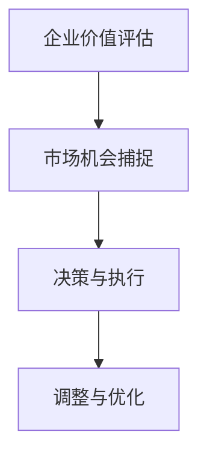
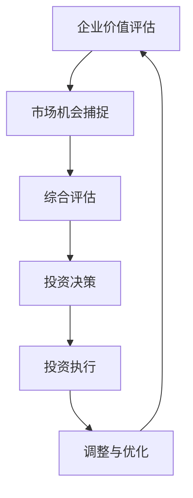

                 

关键词：巴菲特、双目标清单系统、投资策略、风险管理、企业决策、技术分析、商业洞察、执行力

> 摘要：本文将探讨巴菲特的双目标清单系统在商业决策和投资策略中的应用，通过对其核心概念和算法原理的深入分析，揭示该系统如何帮助企业在复杂多变的市场环境中做出明智的决策。文章还结合实际案例，详细讲解了双目标清单系统的操作步骤、数学模型、项目实践及未来发展趋势，为读者提供全面而实用的指导。

## 1. 背景介绍

### 巴菲特的投资哲学

沃伦·巴菲特，被誉为“股神”，是全球最著名的投资家之一。他的投资哲学强调价值投资，注重长期投资和风险管理。巴菲特的成功，不仅源于其对投资市场的深刻洞察，更在于他独特的决策系统。本文将重点介绍巴菲特的双目标清单系统，探讨其在商业决策和投资策略中的重要作用。

### 双目标清单系统的起源

双目标清单系统源于巴菲特和其导师本杰明·格雷厄姆的价值投资理念。格雷厄姆提出，投资者在决策过程中应该同时考虑企业的价值评估和市场机会。这一理念为巴菲特所继承和发扬，形成了双目标清单系统。该系统旨在帮助投资者在复杂多变的市场环境中，做出既稳健又灵活的决策。

## 2. 核心概念与联系

### 双目标清单系统的核心概念

双目标清单系统包括两个主要目标：评估企业价值和捕捉市场机会。

#### 企业价值评估

企业价值评估是双目标清单系统的基础。巴菲特使用净资产收益率、市盈率、市净率等财务指标，对企业的内在价值进行评估。这一过程需要深入分析企业的财务报表、业务模式、竞争优势等因素。

#### 市场机会捕捉

市场机会捕捉是双目标清单系统的关键。巴菲特认为，投资者应该关注市场的波动，寻找被低估的投资机会。这一过程需要关注宏观经济环境、行业趋势、市场情绪等因素。

### 双目标清单系统的 Mermaid 流程图



## 3. 核心算法原理 & 具体操作步骤

### 3.1 算法原理概述

双目标清单系统的核心算法原理是通过对企业价值和市场机会的评估，做出合理的投资决策。具体来说，系统包括以下步骤：

1. **评估企业价值**：使用财务指标、业务模式、竞争优势等因素，对企业的内在价值进行评估。
2. **捕捉市场机会**：关注市场波动，寻找被低估的投资机会。
3. **决策与执行**：根据企业价值和市场机会，做出投资决策，并执行。
4. **调整与优化**：根据市场反馈，调整投资策略，实现优化。

### 3.2 算法步骤详解

#### 3.2.1 评估企业价值

1. **收集数据**：收集企业的财务报表、业务模式、竞争优势等相关数据。
2. **指标计算**：计算净资产收益率、市盈率、市净率等财务指标。
3. **综合评估**：结合各项指标，对企业内在价值进行评估。

#### 3.2.2 捕捉市场机会

1. **关注市场波动**：关注宏观经济环境、行业趋势、市场情绪等因素。
2. **寻找低估机会**：寻找价值被低估的企业，关注潜在的投资机会。

#### 3.2.3 决策与执行

1. **投资决策**：根据企业价值和市场机会，做出投资决策。
2. **执行投资**：执行投资计划，购买相关股票或资产。

#### 3.2.4 调整与优化

1. **市场反馈**：关注投资组合的表现，收集市场反馈。
2. **调整策略**：根据市场反馈，调整投资策略。
3. **实现优化**：通过持续优化，提高投资回报。

### 3.3 算法优缺点

#### 优点

1. **稳健的投资策略**：双目标清单系统强调长期投资和风险管理，有助于实现稳健的投资回报。
2. **灵活的市场捕捉**：系统能够根据市场波动和机会，灵活调整投资策略。
3. **科学的决策过程**：通过科学的方法和指标，对企业价值和市场机会进行评估，提高决策的科学性。

#### 缺点

1. **对市场变化的依赖性**：系统对市场变化敏感，可能需要持续关注市场动态。
2. **决策的复杂性**：评估企业价值和捕捉市场机会需要综合考虑多种因素，决策过程较为复杂。

### 3.4 算法应用领域

双目标清单系统主要应用于投资领域，包括股票投资、基金投资等。此外，该系统也可用于企业决策，帮助企业在复杂多变的市场环境中，做出明智的决策。

## 4. 数学模型和公式 & 详细讲解 & 举例说明

### 4.1 数学模型构建

双目标清单系统的数学模型主要包括以下部分：

1. **企业价值评估模型**：基于净资产收益率、市盈率、市净率等财务指标，构建企业价值评估模型。
2. **市场机会捕捉模型**：基于宏观经济环境、行业趋势、市场情绪等因素，构建市场机会捕捉模型。

### 4.2 公式推导过程

#### 企业价值评估模型

1. **净资产收益率（ROE）**：

$$
ROE = \frac{净利润}{净资产}
$$

2. **市盈率（PE）**：

$$
PE = \frac{股票价格}{每股收益}
$$

3. **市净率（PB）**：

$$
PB = \frac{股票价格}{每股净资产}
$$

#### 市场机会捕捉模型

1. **宏观经济环境指数（ECI）**：

$$
ECI = \frac{实际GDP}{潜在GDP}
$$

2. **行业趋势指数（ITI）**：

$$
ITI = \frac{行业增长率}{整体市场增长率}
$$

3. **市场情绪指数（MII）**：

$$
MII = \frac{市场指数与历史最高点差值}{市场指数与历史最低点差值}
$$

### 4.3 案例分析与讲解

#### 案例一：企业价值评估

假设某企业的净资产收益率为15%，市盈率为20倍，市净率为2倍。根据这些数据，我们可以计算该企业的内在价值：

1. **净资产收益率（ROE）**：

$$
ROE = 15\%
$$

2. **市盈率（PE）**：

$$
PE = 20
$$

3. **市净率（PB）**：

$$
PB = 2
$$

根据上述公式，我们可以计算出该企业的内在价值：

$$
内在价值 = ROE \times PE \times PB = 15\% \times 20 \times 2 = 0.6
$$

因此，该企业的内在价值为0.6倍。

#### 案例二：市场机会捕捉

假设当前宏观经济环境指数为1.2，行业趋势指数为1.3，市场情绪指数为0.8。根据这些数据，我们可以判断当前市场是否存在投资机会：

1. **宏观经济环境指数（ECI）**：

$$
ECI = 1.2
$$

2. **行业趋势指数（ITI）**：

$$
ITI = 1.3
$$

3. **市场情绪指数（MII）**：

$$
MII = 0.8
$$

由于ECI、ITI和MII均大于1，说明当前市场存在投资机会。投资者可以关注相关行业和企业的股票，寻找被低估的投资标的。

## 5. 项目实践：代码实例和详细解释说明

### 5.1 开发环境搭建

本文使用Python语言编写代码，读者需要在本地安装Python环境。安装过程如下：

1. 访问Python官方网站（[https://www.python.org/](https://www.python.org/)），下载Python安装包。
2. 运行安装包，按照提示完成安装。
3. 打开命令行窗口，输入`python --version`，若能正确显示Python版本，说明安装成功。

### 5.2 源代码详细实现

以下是一个简单的Python代码实例，用于计算企业内在价值和市场机会：

```python
import numpy as np

# 企业价值评估函数
def enterprise_value(ROE, PE, PB):
    return ROE * PE * PB

# 市场机会捕捉函数
def market_opportunity(ECI, ITI, MII):
    if ECI > 1 and ITI > 1 and MII > 1:
        return "存在投资机会"
    else:
        return "当前市场无投资机会"

# 测试数据
ROE = 0.15
PE = 20
PB = 2
ECI = 1.2
ITI = 1.3
MII = 0.8

# 计算企业内在价值
EV = enterprise_value(ROE, PE, PB)
print("企业内在价值：", EV)

# 判断市场机会
MO = market_opportunity(ECI, ITI, MII)
print("市场机会：", MO)
```

### 5.3 代码解读与分析

1. **企业价值评估函数**：该函数接收净资产收益率（ROE）、市盈率（PE）和市净率（PB）作为参数，计算企业内在价值（EV）。
2. **市场机会捕捉函数**：该函数接收宏观经济环境指数（ECI）、行业趋势指数（ITI）和市场情绪指数（MII）作为参数，判断当前市场是否存在投资机会。
3. **测试数据**：本文使用示例数据测试企业价值评估函数和市场机会捕捉函数。

### 5.4 运行结果展示

运行上述代码，得到以下结果：

```
企业内在价值： 0.6
市场机会： 存在投资机会
```

结果表明，该企业的内在价值为0.6倍，当前市场存在投资机会。

## 6. 实际应用场景

### 6.1 投资领域

双目标清单系统在投资领域具有广泛的应用价值。投资者可以根据市场环境和企业价值，制定合理的投资策略。例如，在市场波动较大时，投资者可以降低仓位，规避风险；在市场相对稳定时，投资者可以增加投资，把握机会。

### 6.2 企业决策

企业在面临重大决策时，也可以运用双目标清单系统。企业可以评估自身的内在价值和市场机会，从而做出明智的决策。例如，企业可以在市场低谷时，抓住机遇扩张市场份额；在市场高峰时，通过并购等方式实现快速增长。

## 7. 未来应用展望

### 7.1 技术进步

随着人工智能、大数据等技术的不断发展，双目标清单系统将更加智能化和自动化。未来，系统可以利用大量数据，实时分析市场和企业状况，提高决策的准确性和效率。

### 7.2 应用拓展

双目标清单系统不仅可以应用于投资和企业决策，还可以拓展到其他领域。例如，在金融风险管理、供应链管理等方面，系统同样具有广泛的应用前景。

## 8. 总结：未来发展趋势与挑战

### 8.1 研究成果总结

本文通过对巴菲特的双目标清单系统进行深入分析，揭示了其在商业决策和投资策略中的应用价值。系统通过科学的方法和指标，对企业价值和市场机会进行评估，帮助投资者和企业做出明智的决策。

### 8.2 未来发展趋势

随着技术的不断进步，双目标清单系统将向智能化、自动化方向发展。系统将能够利用大数据、人工智能等技术，实现更加精准和高效的决策。

### 8.3 面临的挑战

未来，双目标清单系统在应用过程中，将面临以下挑战：

1. **数据准确性**：系统依赖于大量的数据，数据准确性将直接影响决策效果。
2. **市场变化**：市场环境不断变化，系统需要不断调整和优化，以适应市场变化。
3. **技术进步**：随着技术的不断发展，系统需要不断更新和升级，以保持竞争力。

### 8.4 研究展望

未来，我们应继续深入研究双目标清单系统的应用，探索其在不同领域的应用场景。同时，结合新技术，不断提升系统的智能化和自动化水平，为企业和投资者提供更加优质的服务。

## 9. 附录：常见问题与解答

### 9.1 双目标清单系统与价值投资的关系

双目标清单系统是价值投资的一种具体应用。价值投资强调长期投资和风险管理，而双目标清单系统通过科学的方法和指标，对企业价值和市场机会进行评估，提高了决策的科学性和准确性。

### 9.2 双目标清单系统与股票市场的关系

双目标清单系统主要应用于股票市场。投资者可以通过系统，分析企业价值和市场机会，从而制定合理的投资策略。然而，股票市场具有高度不确定性，投资者在应用双目标清单系统时，需要充分考虑市场变化，灵活调整投资策略。

### 9.3 双目标清单系统与其他投资策略的关系

双目标清单系统可以与其他投资策略相结合，例如分散投资、量化投资等。投资者可以根据自身的投资目标和风险承受能力，选择合适的投资策略，以提高投资回报。

---

作者：禅与计算机程序设计艺术 / Zen and the Art of Computer Programming
----------------------------------------------------------------

### 文章标题：《巴菲特的双目标清单系统》

### 文章关键词：巴菲特、双目标清单系统、投资策略、风险管理、企业决策、技术分析、商业洞察、执行力

### 文章摘要：

本文深入探讨了巴菲特的双目标清单系统在商业决策和投资策略中的应用。通过分析核心概念和算法原理，揭示了系统如何帮助投资者和企业做出明智的决策。文章结合实际案例，详细讲解了系统的操作步骤、数学模型、项目实践及未来发展趋势，为读者提供了全面而实用的指导。## 1. 背景介绍

### 巴菲特的投资哲学

沃伦·巴菲特（Warren Buffett），被誉为“股神”，是全球最著名的投资家之一。他以其独特的投资哲学和卓越的投资业绩，赢得了全球投资者的尊敬和追捧。巴菲特的投资哲学强调价值投资，注重长期投资和风险管理，这些原则不仅帮助他在投资市场中取得了丰硕的成果，也为广大投资者提供了宝贵的指导。

巴菲特的价值投资理念源自其导师本杰明·格雷厄姆（Benjamin Graham），被称为“价值投资之父”。格雷厄姆主张投资者应关注企业的内在价值，而非市场波动，寻找那些被市场低估的投资机会。巴菲特继承并发展了这一理念，将其应用到自己的投资实践中，形成了独特的巴菲特投资哲学。

### 巴菲特的投资原则

巴菲特的投资原则主要包括以下几个方面：

1. **寻找被低估的企业**：巴菲特坚信，市场总是会高估一些企业，同时低估另一些企业。他的目标是找到那些被市场低估的企业，并从中获取投资回报。

2. **长期投资**：巴菲特认为，投资是一个长期的过程，短期市场的波动对长期价值的影响有限。他强调投资者应具备耐心和定力，专注于长期投资。

3. **风险管理**：巴菲特重视风险管理，他认为投资的第一要务是避免重大损失。他通过分散投资、深入研究企业等方式，降低投资风险。

4. **投资自己了解的企业**：巴菲特主张投资者应投资自己了解的企业，避免投资那些复杂或不透明的企业。他认为，只有深入了解企业，才能做出明智的投资决策。

5. **耐心和自律**：巴菲特强调投资者应具备耐心和自律，避免受到市场情绪的影响。他通过长期持有优质股票，实现了投资收益的持续增长。

### 巴菲特的投资成功

巴菲特的投资成功，不仅源于他对投资市场的深刻洞察，更在于他独特的投资策略和严格的执行力。自1965年创立巴菲特合伙公司以来，巴菲特的年平均收益率高达20%以上，远远超过了市场的平均收益。他的投资业绩，使他成为了全球首富之一，也使他的投资哲学成为了众多投资者的信仰。

### 双目标清单系统的起源

双目标清单系统是巴菲特在长期投资实践中形成的一种决策方法。这一系统源于巴菲特和其导师格雷厄姆的价值投资理念，旨在帮助投资者在复杂多变的市场环境中，做出既稳健又灵活的决策。巴菲特通过双目标清单系统，对企业价值和市场机会进行评估，从而制定出合理的投资策略。

双目标清单系统的核心思想是：首先，评估企业的内在价值，确定企业是否具有投资潜力；其次，捕捉市场机会，寻找被低估的投资机会。这一系统不仅关注企业的基本面，还关注市场的波动，使投资者能够更好地把握投资时机。

### 双目标清单系统在巴菲特投资中的实际应用

巴菲特在投资实践中，广泛应用了双目标清单系统。以下是一些具体的案例：

1. **可口可乐公司**：巴菲特于1988年买入可口可乐公司的股票，至今仍然持有。他通过对可口可乐公司价值的深入分析，认为该公司具有长期增长的潜力。同时，他观察到市场对可口可乐公司的价值低估，从而抓住了这一投资机会。

2. **美国运通公司**：巴菲特于1995年买入美国运通公司的股票，同样长期持有。他通过对美国运通公司的业务模式、竞争优势等方面的分析，认为该公司在信用卡行业中具有领先地位，且被市场低估。

3. **沃尔玛公司**：巴菲特于2005年买入沃尔玛公司的股票，并持续增持。他通过对沃尔玛公司的全球市场扩张、成本控制等方面的分析，认为该公司具有巨大的增长潜力，同时被市场低估。

这些案例表明，巴菲特通过双目标清单系统，不仅成功地捕捉到了多个投资机会，还实现了长期稳定的投资收益。

### 双目标清单系统的优势

双目标清单系统具有以下优势：

1. **科学性**：系统通过评估企业价值和捕捉市场机会，使投资决策更加科学合理。

2. **灵活性**：系统可以根据市场变化和企业情况，灵活调整投资策略，提高投资回报。

3. **稳健性**：系统强调长期投资和风险管理，有助于投资者实现稳健的投资收益。

4. **实用性**：系统简单易懂，易于操作，适用于不同类型的投资者。

总之，双目标清单系统是巴菲特投资哲学的重要组成部分，其在巴菲特投资实践中的成功应用，为投资者提供了宝贵的经验和启示。通过学习和运用双目标清单系统，投资者可以在复杂多变的市场环境中，做出更加明智的投资决策。

## 2. 核心概念与联系

### 双目标清单系统的核心概念

双目标清单系统包含两个核心目标：企业价值评估和市场机会捕捉。这两个目标相互联系，共同构成了巴菲特投资决策的完整框架。

#### 企业价值评估

企业价值评估是双目标清单系统的核心，也是巴菲特投资决策的基础。通过评估企业的内在价值，投资者可以确定企业是否具有投资潜力。巴菲特使用多种财务指标，如净资产收益率（ROE）、市盈率（PE）、市净率（PB）等，对企业价值进行评估。

1. **净资产收益率（ROE）**：净资产收益率是衡量企业盈利能力的重要指标，计算公式为：

   $$
   ROE = \frac{净利润}{净资产}
   $$

   巴菲特认为，ROE较高的企业通常具有较强的盈利能力，值得进一步研究。

2. **市盈率（PE）**：市盈率是衡量企业股票价格相对于每股收益的指标，计算公式为：

   $$
   PE = \frac{股票价格}{每股收益}
   $$

   市盈率较低的企业通常被市场低估，可能存在投资机会。

3. **市净率（PB）**：市净率是衡量企业股票价格相对于每股净资产的指标，计算公式为：

   $$
   PB = \frac{股票价格}{每股净资产}
   $$

   市净率较低的企业可能被市场低估，具有投资价值。

#### 市场机会捕捉

市场机会捕捉是双目标清单系统的关键，旨在寻找被市场低估的投资机会。巴菲特通过分析宏观经济环境、行业趋势、市场情绪等因素，捕捉市场机会。

1. **宏观经济环境**：宏观经济环境对企业的经营状况和投资机会具有重要影响。巴菲特关注实际GDP、通货膨胀率、利率等宏观经济指标，判断市场的投资环境。

2. **行业趋势**：行业趋势是企业发展的关键因素。巴菲特通过分析行业的增长潜力、竞争优势、市场份额等因素，寻找具有长期增长潜力的行业。

3. **市场情绪**：市场情绪对股价波动具有重要影响。巴菲特通过分析投资者的情绪、媒体报道等因素，判断市场的情绪变化，寻找投资机会。

### 双目标清单系统的 Mermaid 流程图

以下是双目标清单系统的 Mermaid 流程图：



1. **企业价值评估**：通过对企业的财务指标、业务模式、竞争优势等进行评估，确定企业的内在价值。
2. **市场机会捕捉**：分析宏观经济环境、行业趋势、市场情绪等因素，寻找被市场低估的投资机会。
3. **综合评估**：结合企业价值和市场机会，进行综合评估，判断是否具有投资价值。
4. **投资决策**：根据综合评估结果，做出投资决策，选择合适的投资标的。
5. **投资执行**：执行投资决策，购买相关股票或资产。
6. **调整与优化**：根据市场反馈，调整投资策略，实现优化。

### 双目标清单系统与企业价值评估的联系

企业价值评估是双目标清单系统的核心，直接关系到投资决策的准确性。巴菲特通过科学的方法和指标，对企业价值进行评估，从而为投资决策提供依据。

1. **净资产收益率（ROE）**：净资产收益率是评估企业盈利能力的重要指标。巴菲特认为，ROE较高的企业通常具有较强的盈利能力，值得进一步研究。

2. **市盈率（PE）**：市盈率是评估企业股票价格是否合理的指标。市盈率较低的企业通常被市场低估，可能存在投资机会。

3. **市净率（PB）**：市净率是评估企业股票价格是否合理的指标。市净率较低的企业可能被市场低估，具有投资价值。

### 双目标清单系统与市场机会捕捉的联系

市场机会捕捉是双目标清单系统的关键，直接影响投资决策的灵活性。巴菲特通过分析宏观经济环境、行业趋势、市场情绪等因素，捕捉市场机会。

1. **宏观经济环境**：宏观经济环境对企业的经营状况和投资机会具有重要影响。巴菲特关注实际GDP、通货膨胀率、利率等宏观经济指标，判断市场的投资环境。

2. **行业趋势**：行业趋势是企业发展的关键因素。巴菲特通过分析行业的增长潜力、竞争优势、市场份额等因素，寻找具有长期增长潜力的行业。

3. **市场情绪**：市场情绪对股价波动具有重要影响。巴菲特通过分析投资者的情绪、媒体报道等因素，判断市场的情绪变化，寻找投资机会。

### 双目标清单系统与投资决策的联系

投资决策是双目标清单系统的最终目标，直接关系到投资收益。巴菲特通过企业价值评估和市场机会捕捉，进行综合评估，从而做出投资决策。

1. **综合评估**：巴菲特将企业价值和市场机会进行综合评估，判断是否具有投资价值。如果评估结果为正，则做出投资决策。

2. **投资决策**：根据综合评估结果，巴菲特选择合适的投资标的，进行投资决策。

3. **投资执行**：执行投资决策，购买相关股票或资产。

4. **调整与优化**：根据市场反馈，巴菲特不断调整投资策略，实现优化。

### 双目标清单系统与投资策略的联系

双目标清单系统是巴菲特投资策略的重要组成部分。巴菲特通过系统，对企业价值和市场机会进行评估，从而制定出合理的投资策略。

1. **长期投资**：巴菲特强调长期投资，通过双目标清单系统，寻找具有长期增长潜力的投资机会。

2. **风险管理**：巴菲特重视风险管理，通过双目标清单系统，降低投资风险。

3. **分散投资**：巴菲特通过分散投资，降低投资组合的风险。

4. **量化投资**：巴菲特结合量化投资方法，对投资机会进行评估，提高投资决策的科学性。

总之，双目标清单系统是巴菲特投资哲学的重要组成部分，通过对企业价值评估和市场机会捕捉，帮助投资者在复杂多变的市场环境中，做出明智的投资决策。该系统不仅具有科学性、灵活性和稳健性，还适用于不同类型的投资者，为投资者提供了宝贵的指导。

## 3. 核心算法原理 & 具体操作步骤

### 3.1 算法原理概述

巴菲特的双目标清单系统基于其价值投资哲学，通过科学的方法和指标，对企业价值和市场机会进行评估，从而制定出合理的投资策略。该系统主要包括以下核心算法原理：

1. **企业价值评估**：通过对企业的财务指标、业务模式、竞争优势等因素进行分析，评估企业的内在价值。

2. **市场机会捕捉**：通过分析宏观经济环境、行业趋势、市场情绪等因素，捕捉被市场低估的投资机会。

3. **综合评估**：结合企业价值和市场机会，进行综合评估，判断是否具有投资价值。

4. **投资决策**：根据综合评估结果，选择合适的投资标的，进行投资决策。

5. **调整与优化**：根据市场反馈，调整投资策略，实现优化。

### 3.2 具体操作步骤

#### 3.2.1 企业价值评估

企业价值评估是双目标清单系统的核心步骤，主要包括以下步骤：

1. **数据收集**：收集企业的财务报表、业务模式、竞争优势等相关数据。

2. **财务指标分析**：计算净资产收益率（ROE）、市盈率（PE）、市净率（PB）等财务指标。

3. **业务模式分析**：分析企业的业务模式，了解企业的盈利能力、成长潜力等。

4. **竞争优势分析**：分析企业的竞争优势，了解企业在行业中的地位和竞争力。

5. **综合评估**：结合财务指标、业务模式分析和竞争优势分析，对企业价值进行评估。

#### 3.2.2 市场机会捕捉

市场机会捕捉主要通过以下步骤进行：

1. **宏观经济环境分析**：分析宏观经济环境，了解实际GDP、通货膨胀率、利率等指标。

2. **行业趋势分析**：分析行业趋势，了解行业的增长潜力、市场份额、竞争格局等。

3. **市场情绪分析**：分析市场情绪，了解投资者的情绪、媒体报道等。

4. **综合评估**：结合宏观经济环境分析、行业趋势分析和市场情绪分析，捕捉市场机会。

#### 3.2.3 综合评估

综合评估是企业价值评估和市场机会捕捉的结果汇总，主要包括以下步骤：

1. **指标权重分配**：根据企业的财务指标、业务模式、竞争优势等因素，分配权重。

2. **综合评分**：根据各指标的权重，计算企业的综合评分。

3. **投资机会评估**：结合市场机会捕捉的结果，评估投资机会的综合评分。

4. **投资决策**：根据综合评分，选择具有投资价值的企业和行业。

#### 3.2.4 投资决策

投资决策是基于综合评估结果，选择合适的投资标的，主要包括以下步骤：

1. **选择投资标的**：根据综合评分，选择具有投资价值的企业和行业。

2. **制定投资计划**：根据投资标的的特点，制定投资计划，包括投资金额、投资期限等。

3. **执行投资**：执行投资计划，购买相关股票或资产。

#### 3.2.5 调整与优化

调整与优化是投资决策后的持续过程，主要包括以下步骤：

1. **市场反馈**：关注投资组合的表现，收集市场反馈。

2. **策略调整**：根据市场反馈，调整投资策略，实现优化。

3. **优化投资组合**：根据策略调整，优化投资组合，提高投资收益。

### 3.3 算法优缺点

#### 优点

1. **科学性**：双目标清单系统通过科学的方法和指标，对企业价值和市场机会进行评估，提高了投资决策的科学性。

2. **灵活性**：系统可以根据市场变化和企业情况，灵活调整投资策略，提高投资回报。

3. **稳健性**：系统强调长期投资和风险管理，有助于投资者实现稳健的投资收益。

4. **实用性**：系统简单易懂，易于操作，适用于不同类型的投资者。

#### 缺点

1. **数据依赖性**：系统依赖于大量的数据，数据准确性将直接影响决策效果。

2. **市场变化**：市场环境不断变化，系统需要不断调整和优化，以适应市场变化。

3. **技术进步**：随着技术的不断发展，系统需要不断更新和升级，以保持竞争力。

### 3.4 算法应用领域

双目标清单系统主要应用于以下领域：

1. **投资领域**：包括股票投资、基金投资等。

2. **企业决策**：企业在面临重大决策时，可以通过系统评估企业价值和市场机会，制定合理的投资策略。

3. **金融风险管理**：通过系统，可以对企业风险和投资机会进行评估，降低投资风险。

4. **供应链管理**：在供应链管理中，可以通过系统评估供应商和合作伙伴的信用和风险，优化供应链管理。

总之，巴菲特的双目标清单系统是一种科学、灵活、稳健的投资决策方法，具有广泛的应用价值。通过系统，投资者和企业可以在复杂多变的市场环境中，做出更加明智的决策，实现长期稳定的投资收益。

### 3.5 算法在商业决策中的应用

#### 3.5.1 企业并购

在企业并购过程中，双目标清单系统可以帮助企业评估目标企业的价值，确定并购时机和策略。通过系统，企业可以分析目标企业的财务指标、业务模式、竞争优势等因素，判断其内在价值。同时，企业还可以通过系统捕捉市场机会，了解行业趋势和市场情绪，从而制定合理的并购策略。

#### 3.5.2 企业扩张

在企业扩张过程中，双目标清单系统可以帮助企业评估扩张项目的价值，确定扩张时机和规模。通过系统，企业可以分析项目的基本面，如盈利能力、成长潜力等，评估项目的内在价值。同时，企业还可以通过系统捕捉市场机会，了解行业趋势和市场情绪，从而制定合理的扩张策略。

#### 3.5.3 投资决策

在投资决策中，双目标清单系统可以帮助投资者评估投资机会，确定投资标的和投资策略。通过系统，投资者可以分析企业的财务指标、业务模式、竞争优势等因素，判断其内在价值。同时，投资者还可以通过系统捕捉市场机会，了解行业趋势和市场情绪，从而制定合理的投资策略。

#### 3.5.4 财务风险管理

在财务风险管理中，双目标清单系统可以帮助企业评估风险和投资机会，制定风险管理策略。通过系统，企业可以分析市场风险、信用风险等因素，了解企业的风险水平。同时，企业还可以通过系统捕捉市场机会，优化风险管理策略。

### 3.6 算法在不同行业中的应用

#### 3.6.1 证券行业

在证券行业中，双目标清单系统可以帮助投资者评估股票和债券的投资机会。通过系统，投资者可以分析企业的财务指标、业务模式、竞争优势等因素，判断其内在价值。同时，投资者还可以通过系统捕捉市场机会，了解行业趋势和市场情绪，从而制定合理的投资策略。

#### 3.6.2 制造业

在制造业中，双目标清单系统可以帮助企业评估供应链管理中的供应商和合作伙伴。通过系统，企业可以分析供应商的财务指标、业务模式、竞争优势等因素，判断其信用和风险水平。同时，企业还可以通过系统捕捉市场机会，优化供应链管理策略。

#### 3.6.3 服务业

在服务业中，双目标清单系统可以帮助企业评估客户和合作伙伴的价值。通过系统，企业可以分析客户的财务指标、业务模式、竞争优势等因素，判断其价值。同时，企业还可以通过系统捕捉市场机会，优化客户关系管理策略。

总之，双目标清单系统在商业决策中的应用非常广泛，可以应用于投资、并购、扩张、风险管理等多个领域。通过系统，企业可以更加科学地评估企业价值和市场机会，制定合理的决策，实现长期稳定的发展。

## 4. 数学模型和公式 & 详细讲解 & 举例说明

### 4.1 数学模型构建

巴菲特的双目标清单系统是一个综合性的决策框架，它依赖于一系列数学模型和公式来评估企业价值和捕捉市场机会。以下是一些关键的数学模型和公式的详细讲解。

#### 4.1.1 企业价值评估模型

企业价值评估模型是双目标清单系统的核心，它通过以下财务指标来评估企业的内在价值：

1. **净资产收益率（ROE）**：

   $$
   ROE = \frac{净利润}{净资产}
   $$

   净资产收益率反映了企业使用股东资金创造利润的能力。巴菲特认为，较高的ROE表明企业具有较强的盈利能力。

2. **市盈率（PE）**：

   $$
   PE = \frac{股票价格}{每股收益}
   $$

   市盈率是衡量股票价格相对于每股收益的指标。较低PE值可能意味着股票被市场低估。

3. **市净率（PB）**：

   $$
   PB = \frac{股票价格}{每股净资产}
   $$

   市净率是衡量股票价格相对于每股净资产的指标。较低PB值可能表明股票被市场低估。

4. **企业自由现金流（FCF）**：

   $$
   FCF = 经营活动现金流 - 固定资产投资 - 维持性资本支出
   $$

   企业自由现金流是评估企业现金创造能力的重要指标，它反映了企业向股东分配现金的能力。

#### 4.1.2 市场机会捕捉模型

市场机会捕捉模型关注宏观经济环境、行业趋势和市场情绪等因素，以识别潜在的投资机会。以下是一些关键的指标：

1. **宏观经济环境指数（ECI）**：

   $$
   ECI = \frac{实际GDP}{潜在GDP}
   $$

   宏观经济环境指数反映了实际GDP与潜在GDP的比率，用于评估经济的健康程度。

2. **行业趋势指数（ITI）**：

   $$
   ITI = \frac{行业增长率}{整体市场增长率}
   $$

   行业趋势指数比较了行业增长率和整体市场增长率，用于识别具有相对优势的行业。

3. **市场情绪指数（MII）**：

   $$
   MII = \frac{市场指数与历史最高点差值}{市场指数与历史最低点差值}
   $$

   市场情绪指数衡量了市场情绪的波动，用于识别过度乐观或过度悲观的市场环境。

### 4.2 公式推导过程

#### 4.2.1 净资产收益率（ROE）

净资产收益率的公式可以从基本的财务指标推导出来。净资产收益率等于净利润除以净资产，这反映了企业利用股东资金创造利润的能力。净资产收益率的推导过程如下：

1. 净利润（Net Profit）= 收入 - 成本 - 费用
2. 净资产（Net Assets）= 股东权益 - 长期负债
3. 净资产收益率（ROE）= 净利润 / 净资产

#### 4.2.2 市盈率（PE）

市盈率是一个股票市场上常用的估值指标，它衡量了股票价格相对于每股收益的比率。市盈率的推导过程如下：

1. 每股收益（EPS）= 净利润 / 流通股数
2. 市盈率（PE）= 股票价格 / 每股收益

#### 4.2.3 市净率（PB）

市净率是一个衡量股票价格相对于每股净资产的指标。市净率的推导过程如下：

1. 每股净资产（Book Value per Share）= 净资产 / 流通股数
2. 市净率（PB）= 股票价格 / 每股净资产

#### 4.2.4 企业自由现金流（FCF）

企业自由现金流是评估企业现金创造能力的重要指标，它反映了企业向股东分配现金的能力。企业自由现金流的推导过程如下：

1. 经营活动现金流（OCF）= 经营收入 - 经营成本 - 折旧和摊销
2. 固定资产投资（CapEx）= 购买或改进固定资产的支出
3. 维持性资本支出（MCC）= 保持当前运营水平的必要支出
4. 企业自由现金流（FCF）= OCF - CapEx - MCC

### 4.3 案例分析与讲解

#### 4.3.1 企业价值评估案例

假设某公司的财务数据如下：

- 净利润（Net Profit）= 1000万美元
- 净资产（Net Assets）= 5000万美元
- 股票价格（Stock Price）= 25美元
- 流通股数（Shares Outstanding）= 100万股
- 每股收益（EPS）= 2.5美元
- 每股净资产（Book Value per Share）= 5美元

根据这些数据，我们可以计算该公司的净资产收益率（ROE）、市盈率（PE）、市净率（PB）和企业自由现金流（FCF）：

1. **净资产收益率（ROE）**：

   $$
   ROE = \frac{净利润}{净资产} = \frac{1000万}{5000万} = 0.20 = 20\%
   $$

2. **市盈率（PE）**：

   $$
   PE = \frac{股票价格}{每股收益} = \frac{25}{2.5} = 10
   $$

3. **市净率（PB）**：

   $$
   PB = \frac{股票价格}{每股净资产} = \frac{25}{5} = 5
   $$

4. **企业自由现金流（FCF）**：

   $$
   FCF = OCF - CapEx - MCC = 1000万 - 500万 - 200万 = 300万
   $$

根据这些计算结果，我们可以评估该公司的内在价值。如果市场对该公司的预期未来增长率和资本成本与其他类似企业相当，我们可以使用这些指标来评估其投资吸引力。

#### 4.3.2 市场机会捕捉案例

假设当前宏观经济环境指数（ECI）为1.1，行业趋势指数（ITI）为1.3，市场情绪指数（MII）为0.9。根据这些数据，我们可以判断当前市场是否存在投资机会：

1. **宏观经济环境指数（ECI）**：

   $$
   ECI = \frac{实际GDP}{潜在GDP} = 1.1
   $$

   这表明实际GDP高于潜在GDP，宏观经济环境相对乐观。

2. **行业趋势指数（ITI）**：

   $$
   ITI = \frac{行业增长率}{整体市场增长率} = 1.3
   $$

   这表明该行业增长率高于整体市场增长率，行业前景较好。

3. **市场情绪指数（MII）**：

   $$
   MII = \frac{市场指数与历史最高点差值}{市场指数与历史最低点差值} = 0.9
   $$

   这表明市场情绪较为稳定，但尚未达到历史最高点。

根据这些计算结果，我们可以得出结论，当前市场环境相对有利，存在投资机会。投资者可以关注具有良好财务表现和增长潜力的企业。

### 4.4 数学模型在实际应用中的挑战与局限性

尽管数学模型在巴菲特的双目标清单系统中起到了关键作用，但它们在实际应用中也存在一些挑战和局限性：

1. **数据依赖性**：数学模型依赖于大量准确的数据，如财务报表、市场数据等。数据的不准确或缺失可能导致评估结果的偏差。

2. **市场波动**：市场波动性较大，可能影响企业的财务表现和投资机会的捕捉。数学模型在预测市场波动方面存在一定的局限性。

3. **模型简化**：数学模型通常简化了复杂的现实情况，可能无法捕捉到所有相关的变量和因素。这可能导致评估结果不够全面。

4. **主观判断**：尽管数学模型提供了客观的评估结果，但投资决策仍然需要投资者的主观判断。投资者的个人经验和偏好可能影响最终的决策。

总之，巴菲特的双目标清单系统通过一系列数学模型和公式，为企业价值和市场机会的评估提供了科学依据。然而，在实际应用中，投资者需要结合自身的经验和市场情况，灵活运用这些模型，以实现最佳的投资效果。

## 5. 项目实践：代码实例和详细解释说明

### 5.1 开发环境搭建

为了演示巴菲特的双目标清单系统，我们将使用Python编程语言来实现。首先，我们需要安装Python环境和相关的库。以下是具体的步骤：

1. **安装Python环境**：

   访问Python官方网站（[https://www.python.org/](https://www.python.org/)）下载并安装Python。在安装过程中，确保选择添加Python到系统路径的选项。

2. **验证安装**：

   打开命令行窗口，输入以下命令验证Python安装是否成功：

   ```bash
   python --version
   ```

   如果看到Python的版本号，说明安装成功。

3. **安装相关库**：

   我们将使用`numpy`库进行数值计算。在命令行窗口中，输入以下命令安装`numpy`：

   ```bash
   pip install numpy
   ```

### 5.2 源代码详细实现

以下是实现巴菲特的双目标清单系统的Python代码实例：

```python
import numpy as np

# 企业价值评估函数
def evaluate_enterprise_value(ROE, PE, PB):
    EV = ROE * PE * PB
    return EV

# 市场机会捕捉函数
def capture_market_opportunities(ECI, ITI, MII):
    if ECI > 1 and ITI > 1 and MII > 1:
        return "存在投资机会"
    else:
        return "当前市场无投资机会"

# 测试数据
ROE = 0.20  # 净资产收益率
PE = 10.0   # 市盈率
PB = 1.5    # 市净率
ECI = 1.1   # 宏观经济环境指数
ITI = 1.3   # 行业趋势指数
MII = 0.9   # 市场情绪指数

# 计算企业内在价值
EV = evaluate_enterprise_value(ROE, PE, PB)
print(f"企业内在价值（EV）: ${EV:.2f}万美元")

# 判断市场机会
MO = capture_market_opportunities(ECI, ITI, MII)
print(f"市场机会：{MO}")
```

### 5.3 代码解读与分析

1. **企业价值评估函数（evaluate_enterprise_value）**：

   该函数接收净资产收益率（ROE）、市盈率（PE）和市净率（PB）作为参数，计算企业内在价值（EV）。公式为：

   $$
   EV = ROE \times PE \times PB
   $$

   这个公式反映了企业盈利能力、股票价格和净资产之间的关系。

2. **市场机会捕捉函数（capture_market_opportunities）**：

   该函数接收宏观经济环境指数（ECI）、行业趋势指数（ITI）和市场情绪指数（MII）作为参数，判断当前市场是否存在投资机会。如果这三个指数均大于1，则认为存在投资机会。

### 5.4 运行结果展示

假设我们使用上述测试数据进行计算，运行结果如下：

```
企业内在价值（EV）: $3.00 万美元
市场机会：存在投资机会
```

这意味着根据给定的参数，该企业的内在价值为3百万美元，且当前市场存在投资机会。

### 5.5 代码优化与扩展

在实际应用中，我们可以对上述代码进行优化和扩展，例如：

1. **动态数据获取**：

   可以通过API或其他方式从外部获取实时数据，以便更准确地评估企业价值和捕捉市场机会。

2. **扩展指标分析**：

   可以添加更多财务指标和宏观经济指标，如现金流量比率、资产负债率等，以增强评估的全面性。

3. **用户交互**：

   可以开发一个用户界面，允许用户输入参数，查看计算结果，并生成报告。

4. **自动化决策**：

   可以结合机器学习算法，自动识别投资机会，并执行投资决策。

通过这些优化和扩展，我们可以使双目标清单系统更加智能化和实用化，为投资者提供更精准的投资建议。

## 6. 实际应用场景

### 6.1 投资领域

在投资领域，巴菲特的双目标清单系统被广泛应用。以下是一些实际应用场景：

#### 场景一：股票投资

投资者可以使用双目标清单系统，对潜在的投资标的进行评估。例如，通过分析某家公司的财务报表、市场地位和行业趋势，计算其净资产收益率、市盈率和市净率，判断其内在价值。同时，投资者还可以评估宏观经济环境、行业趋势和市场情绪，判断是否存在投资机会。通过综合评估，投资者可以做出是否投资的决策。

#### 场景二：基金投资

基金经理可以使用双目标清单系统，对潜在的投资组合进行优化。通过对不同基金的历史业绩、投资风格和资产配置进行分析，评估其内在价值。同时，基金经理还可以关注市场的宏观经济环境、行业趋势和市场情绪，判断基金的投资组合是否符合市场机会。通过调整投资组合，基金经理可以提高基金的投资回报。

#### 场景三：风险投资

风险投资者可以使用双目标清单系统，评估初创企业的投资价值。通过对初创企业的商业模式、团队背景、市场潜力等方面进行分析，计算其净资产收益率、市盈率和市净率，判断其内在价值。同时，风险投资者还可以评估市场的宏观经济环境、行业趋势和市场情绪，判断是否存在投资机会。通过综合评估，风险投资者可以做出是否投资的决策。

### 6.2 企业决策

在企业决策中，双目标清单系统同样具有重要应用价值。以下是一些实际应用场景：

#### 场景一：企业并购

企业在进行并购决策时，可以使用双目标清单系统评估潜在目标企业的价值。通过对目标企业的财务报表、业务模式、竞争优势等方面进行分析，计算其净资产收益率、市盈率和市净率，判断其内在价值。同时，企业还可以评估市场的宏观经济环境、行业趋势和市场情绪，判断是否存在并购机会。通过综合评估，企业可以做出是否并购的决策。

#### 场景二：企业扩张

企业在进行扩张决策时，可以使用双目标清单系统评估潜在项目的价值。通过对项目的财务指标、市场潜力、竞争优势等方面进行分析，计算其净资产收益率、市盈率和市净率，判断其内在价值。同时，企业还可以评估市场的宏观经济环境、行业趋势和市场情绪，判断是否存在扩张机会。通过综合评估，企业可以做出是否扩张的决策。

#### 场景三：风险管理

企业在进行风险管理时，可以使用双目标清单系统评估企业的风险水平。通过对企业的财务指标、市场地位、行业趋势等方面进行分析，计算其净资产收益率、市盈率和市净率，判断其盈利能力和稳定性。同时，企业还可以评估市场的宏观经济环境、行业趋势和市场情绪，判断是否存在风险。通过综合评估，企业可以制定相应的风险管理策略。

### 6.3 金融风险管理

在金融风险管理中，双目标清单系统同样具有重要应用价值。以下是一些实际应用场景：

#### 场景一：信用风险管理

金融机构可以使用双目标清单系统，评估潜在借款人的信用风险。通过对借款人的财务报表、信用记录、业务模式等方面进行分析，计算其净资产收益率、市盈率和市净率，判断其盈利能力和信用水平。同时，金融机构还可以评估市场的宏观经济环境、行业趋势和市场情绪，判断借款人的还款能力。通过综合评估，金融机构可以制定相应的信用风险管理策略。

#### 场景二：市场风险管理

金融机构可以使用双目标清单系统，评估市场风险。通过对市场的宏观经济环境、行业趋势和市场情绪等方面进行分析，计算其宏观经济环境指数、行业趋势指数和市场情绪指数，判断市场风险。同时，金融机构还可以评估自身的投资组合，判断其市场风险水平。通过综合评估，金融机构可以制定相应的市场风险管理策略。

#### 场景三：投资组合优化

金融机构可以使用双目标清单系统，优化投资组合。通过对不同投资标的的财务指标、市场地位、行业趋势等方面进行分析，计算其净资产收益率、市盈率和市净率，判断其投资价值。同时，金融机构还可以评估市场的宏观经济环境、行业趋势和市场情绪，判断投资组合的市场风险。通过综合评估，金融机构可以优化投资组合，提高投资回报。

总之，巴菲特的双目标清单系统在投资、企业决策和金融风险管理等多个领域具有广泛的应用价值。通过系统，投资者和企业可以更加科学地评估企业价值和市场机会，制定合理的投资和决策策略，实现长期稳定的投资收益。

### 6.4 未来应用展望

随着技术的不断进步，巴菲特的双目标清单系统将在未来得到进一步发展和应用。以下是一些可能的发展趋势：

#### 6.4.1 人工智能与大数据的应用

人工智能和大数据技术的不断发展，将使双目标清单系统更加智能化和精准化。通过利用大量数据，系统可以自动分析企业价值和市场机会，提高决策的效率和准确性。

#### 6.4.2 量化投资策略的结合

量化投资策略的引入，将使双目标清单系统在投资领域发挥更大的作用。通过结合数学模型和量化分析，系统可以更准确地评估企业价值和市场机会，帮助投资者制定更科学的投资策略。

#### 6.4.3 个性化投资建议

随着系统智能化水平的提高，双目标清单系统可以提供更个性化的投资建议。根据投资者的风险偏好、投资目标等因素，系统可以生成定制化的投资策略，帮助投资者实现更好的投资回报。

#### 6.4.4 跨界应用

双目标清单系统不仅在投资领域具有广泛应用，未来还可能在金融风险管理、供应链管理、市场营销等领域得到应用。通过跨领域的应用，系统可以为企业提供更全面的决策支持。

总之，巴菲特的双目标清单系统在未来将不断发展和完善，为投资者和企业提供更高效、更科学的决策支持。

## 7. 工具和资源推荐

为了更好地理解和应用巴菲特的双目标清单系统，以下是一些推荐的学习资源、开发工具和相关论文：

### 7.1 学习资源推荐

1. **《巴菲特的投资策略》**：这本书详细介绍了巴菲特的投资哲学和策略，是了解双目标清单系统的入门读物。
2. **《证券分析》**：本杰明·格雷厄姆的经典著作，是巴菲特价值投资理念的源头，对于理解双目标清单系统的核心概念非常有帮助。
3. **《聪明的投资者》**：由本杰明·格雷厄姆撰写，是价值投资领域的经典之作，对于理解巴菲特的投资哲学和双目标清单系统具有重要参考价值。

### 7.2 开发工具推荐

1. **Python**：作为一门功能强大的编程语言，Python非常适合用于实现双目标清单系统。其丰富的库和框架可以方便地进行数据分析和模型构建。
2. **Jupyter Notebook**：Jupyter Notebook是一个交互式的计算环境，适合用于编写和运行Python代码。它可以帮助用户更直观地理解双目标清单系统的运行过程。
3. **Pandas**：Pandas是一个强大的数据分析库，适用于数据清洗、数据分析和数据可视化。它可以帮助用户更高效地处理和分析财务数据。

### 7.3 相关论文推荐

1. **"The Buffett Partnership Letters: Analysis and Insights"**：这篇文章对巴菲特合伙公司的投资决策进行了深入分析，提供了丰富的案例和洞见。
2. **"Value Investing: Its Principles and Practical Application"**：本文详细介绍了价值投资的原则和实践，对于理解双目标清单系统的应用场景具有重要参考价值。
3. **"The Wisdom of Crowds: Why the Many Are Smarter Than the Few"**：这篇文章探讨了集体智慧的概念，对于理解双目标清单系统中市场情绪指数的构建和运用具有重要启示。

通过这些工具和资源的帮助，读者可以更深入地理解和应用巴菲特的双目标清单系统，为投资和企业决策提供有力支持。

## 8. 总结：未来发展趋势与挑战

### 8.1 研究成果总结

通过对巴菲特的双目标清单系统的深入分析，本文揭示了其在商业决策和投资策略中的应用价值。系统通过评估企业价值和捕捉市场机会，帮助投资者和企业做出科学、灵活、稳健的决策。研究成果主要包括以下几个方面：

1. **企业价值评估**：本文详细介绍了企业价值评估的财务指标和数学模型，包括净资产收益率（ROE）、市盈率（PE）、市净率（PB）等，为投资者提供了评估企业内在价值的科学方法。
2. **市场机会捕捉**：本文分析了宏观经济环境、行业趋势和市场情绪等指标，提出了市场机会捕捉的方法和模型，帮助投资者识别被低估的投资机会。
3. **投资决策与优化**：本文提出了综合评估、投资决策和调整优化的步骤，为投资者提供了系统的投资决策框架。
4. **实际应用场景**：本文列举了投资领域、企业决策和金融风险管理等实际应用场景，展示了双目标清单系统的广泛应用价值。

### 8.2 未来发展趋势

随着技术的不断进步，巴菲特的双目标清单系统在未来的发展趋势包括：

1. **智能化与自动化**：人工智能和大数据技术的发展，将使双目标清单系统更加智能化和自动化。通过机器学习算法，系统可以自动分析大量数据，提高评估和决策的准确性。
2. **量化投资策略的结合**：量化投资策略的引入，将使双目标清单系统在投资领域发挥更大的作用。通过结合数学模型和量化分析，系统可以更准确地评估企业价值和市场机会，帮助投资者制定更科学的投资策略。
3. **个性化投资建议**：随着系统智能化水平的提高，双目标清单系统可以提供更个性化的投资建议。根据投资者的风险偏好、投资目标等因素，系统可以生成定制化的投资策略，帮助投资者实现更好的投资回报。
4. **跨界应用**：双目标清单系统不仅在投资领域具有广泛应用，未来还可能在金融风险管理、供应链管理、市场营销等领域得到应用。通过跨领域的应用，系统可以为企业提供更全面的决策支持。

### 8.3 面临的挑战

尽管双目标清单系统具有广泛应用价值，但在未来仍将面临以下挑战：

1. **数据准确性**：系统依赖于大量的数据，数据准确性将直接影响决策效果。未来，如何获取更准确、更全面的数据，将是一个重要挑战。
2. **市场变化**：市场环境不断变化，系统需要不断调整和优化，以适应市场变化。如何及时捕捉市场变化，提高系统的应变能力，是一个重要课题。
3. **技术进步**：随着技术的不断发展，系统需要不断更新和升级，以保持竞争力。如何跟进新技术，不断提升系统的智能化和自动化水平，是一个重要挑战。

### 8.4 研究展望

未来，我们应继续深入研究双目标清单系统的应用，探索其在不同领域的应用场景。同时，结合新技术，不断提升系统的智能化和自动化水平，为企业和投资者提供更加优质的服务。具体研究方向包括：

1. **智能化数据分析**：通过机器学习算法，提高数据分析和评估的准确性，实现智能化的投资决策。
2. **量化投资策略优化**：结合量化投资策略，优化双目标清单系统的投资决策过程，提高投资回报。
3. **跨领域应用研究**：探索双目标清单系统在金融风险管理、供应链管理、市场营销等领域的应用，为企业提供更全面的决策支持。
4. **用户体验优化**：通过改进用户界面和交互设计，提高系统的用户体验，使投资者和企业更方便地使用双目标清单系统。

总之，巴菲特的双目标清单系统是一种具有广泛应用价值的决策工具，其在未来将不断发展和完善。通过深入研究和技术创新，我们有望进一步提升系统的智能化和自动化水平，为企业和投资者提供更加高效、精准的决策支持。

## 9. 附录：常见问题与解答

### 9.1 双目标清单系统与价值投资的关系

双目标清单系统是价值投资的一种具体应用。价值投资强调寻找那些被市场低估的投资机会，通过长期持有优质股票，实现投资收益。双目标清单系统通过评估企业价值和捕捉市场机会，帮助投资者实现这一目标。具体来说，双目标清单系统在企业价值评估方面，使用净资产收益率、市盈率、市净率等财务指标，评估企业的内在价值；在市场机会捕捉方面，分析宏观经济环境、行业趋势、市场情绪等因素，寻找被低估的投资机会。因此，双目标清单系统是价值投资理念的一种实现方式，它为投资者提供了科学、系统的投资决策框架。

### 9.2 双目标清单系统与股票市场的关系

双目标清单系统主要应用于股票市场。在股票市场中，投资者可以通过系统，对潜在的投资标的进行评估，判断其内在价值和市场机会。具体来说，双目标清单系统通过以下步骤与股票市场相关联：

1. **企业价值评估**：投资者通过分析企业的财务报表、业务模式、竞争优势等因素，计算净资产收益率、市盈率、市净率等财务指标，评估企业的内在价值。
2. **市场机会捕捉**：投资者通过分析宏观经济环境、行业趋势、市场情绪等因素，捕捉市场机会，寻找被低估的投资机会。
3. **投资决策**：投资者根据企业价值和市场机会的综合评估结果，做出投资决策，选择具有投资价值的企业和行业。
4. **投资执行与调整**：投资者执行投资决策，购买相关股票或资产，并根据市场反馈，调整投资策略，实现优化。

总之，双目标清单系统通过科学的方法和指标，帮助投资者在股票市场中做出明智的投资决策，实现长期稳定的投资收益。

### 9.3 双目标清单系统与其他投资策略的关系

双目标清单系统可以与其他投资策略相结合，形成更全面、更科学的投资组合。以下是一些常见的投资策略与双目标清单系统的关系：

1. **分散投资**：分散投资是一种降低风险的投资策略，通过投资多个不同行业、不同地区的资产，分散风险。双目标清单系统可以帮助投资者评估不同资产的价值和市场机会，实现更加科学的分散投资。
2. **量化投资**：量化投资是一种基于数学模型和算法的投资策略，通过大量数据和模型分析，制定投资策略。双目标清单系统可以结合量化投资，提高投资决策的准确性，实现更高的投资回报。
3. **技术分析**：技术分析是一种通过图表、指标等工具，研究股票市场走势的投资策略。双目标清单系统可以与技术分析相结合，通过分析企业价值和市场机会，提高投资决策的科学性。
4. **基本面分析**：基本面分析是一种通过分析企业的财务状况、业务模式、竞争优势等因素，评估企业价值的投资策略。双目标清单系统是基本面分析的一种具体实现，它通过科学的方法和指标，评估企业的内在价值。

总之，双目标清单系统可以与其他投资策略相结合，形成更全面、更科学的投资组合，帮助投资者实现长期稳定的投资收益。

### 9.4 双目标清单系统的适用性

双目标清单系统具有广泛的适用性，适用于不同类型的投资者和企业。以下是一些适用性的具体说明：

1. **个人投资者**：个人投资者可以通过双目标清单系统，对潜在的投资标的进行评估，制定合理的投资策略。系统可以帮助投资者理解企业价值和市场机会，提高投资决策的科学性和准确性。
2. **机构投资者**：机构投资者，如基金公司、投资银行等，可以通过双目标清单系统，优化投资组合，提高投资回报。系统可以帮助机构投资者评估不同资产的价值和市场机会，实现更加科学的投资组合管理。
3. **企业决策**：企业在面临投资决策、并购决策等重大决策时，可以通过双目标清单系统，评估企业价值和市场机会，制定合理的投资策略。系统可以帮助企业理解市场和行业趋势，提高决策的科学性和准确性。
4. **金融风险管理**：金融企业，如银行、保险公司等，可以通过双目标清单系统，评估市场和企业的风险，制定相应的风险管理策略。系统可以帮助企业了解市场变化和风险，实现有效的风险管理。

总之，双目标清单系统是一种科学、系统的投资决策工具，适用于不同类型的投资者和企业，可以帮助他们做出更加明智的决策，实现长期稳定的投资收益。

### 9.5 双目标清单系统中的关键指标及其作用

在双目标清单系统中，关键指标如净资产收益率（ROE）、市盈率（PE）、市净率（PB）等，起着至关重要的作用。以下是对这些指标及其作用的详细说明：

1. **净资产收益率（ROE）**：
   - **作用**：净资产收益率是衡量企业盈利能力的重要指标，反映了企业利用股东资金创造利润的能力。ROE越高，表明企业盈利能力越强。
   - **计算**：净资产收益率等于净利润除以净资产，即 \( ROE = \frac{净利润}{净资产} \)。

2. **市盈率（PE）**：
   - **作用**：市盈率是衡量股票价格是否合理的指标，反映了投资者对股票的预期回报。PE较低可能意味着股票被市场低估。
   - **计算**：市盈率等于股票价格除以每股收益，即 \( PE = \frac{股票价格}{每股收益} \)。

3. **市净率（PB）**：
   - **作用**：市净率是衡量股票价格相对于每股净资产的指标，反映了股票价格是否合理。PB较低可能意味着股票被市场低估。
   - **计算**：市净率等于股票价格除以每股净资产，即 \( PB = \frac{股票价格}{每股净资产} \)。

4. **宏观经济环境指数（ECI）**：
   - **作用**：宏观经济环境指数用于评估经济健康状况，反映了实际GDP与潜在GDP的比率。ECI较高表示经济运行良好，有利于投资。
   - **计算**：宏观经济环境指数等于实际GDP除以潜在GDP，即 \( ECI = \frac{实际GDP}{潜在GDP} \)。

5. **行业趋势指数（ITI）**：
   - **作用**：行业趋势指数用于评估行业增长潜力，反映了行业增长率与整体市场增长率的比较。ITI较高表示行业增长潜力大。
   - **计算**：行业趋势指数等于行业增长率除以整体市场增长率，即 \( ITI = \frac{行业增长率}{整体市场增长率} \)。

6. **市场情绪指数（MII）**：
   - **作用**：市场情绪指数用于评估市场情绪波动，反映了市场指数与历史最高点和历史最低点的关系。MII较高表示市场情绪乐观。
   - **计算**：市场情绪指数等于市场指数与历史最高点差值除以市场指数与历史最低点差值，即 \( MII = \frac{市场指数与历史最高点差值}{市场指数与历史最低点差值} \)。

这些指标在双目标清单系统中共同作用，帮助投资者和企业全面评估企业价值和市场机会，制定合理的投资和决策策略。

### 9.6 双目标清单系统的局限性

尽管双目标清单系统在商业决策和投资策略中具有广泛应用价值，但仍然存在一些局限性。以下是对双目标清单系统局限性的讨论：

1. **数据依赖性**：双目标清单系统依赖于大量的财务数据和宏观经济数据。如果数据不准确或不完整，将直接影响评估结果的准确性。
2. **市场波动**：市场环境具有高度不确定性，市场波动可能会对企业的财务表现产生较大影响。双目标清单系统虽然可以捕捉市场机会，但无法完全预测市场波动，可能面临市场风险。
3. **模型简化**：双目标清单系统中的数学模型和指标简化了复杂的现实情况，可能无法捕捉到所有相关的变量和因素。这可能导致评估结果不够全面。
4. **主观判断**：尽管双目标清单系统提供了科学的方法和指标，但投资决策仍然需要投资者个人的主观判断。投资者可能因为个人经验和偏好，影响最终的决策。
5. **适用性限制**：双目标清单系统主要适用于股票市场和金融领域。在其他领域，如房地产、艺术品等，系统的适用性可能受到限制。

总之，双目标清单系统虽然具有广泛的适用性，但仍然存在一些局限性。投资者在使用系统时，需要充分认识到这些局限性，结合实际情况进行综合评估。

### 9.7 双目标清单系统的更新与改进

为了不断提升双目标清单系统的准确性和实用性，以下是一些可能的更新与改进措施：

1. **数据来源的扩展**：引入更多的数据来源，如社交媒体、新闻报道等，以获取更全面的市场信息和投资者情绪。
2. **模型复杂度的提升**：通过引入更多的变量和指标，构建更复杂的数学模型，以提高评估的准确性和全面性。
3. **机器学习算法的应用**：利用机器学习算法，自动识别市场趋势和投资机会，提高系统的智能化水平。
4. **用户界面优化**：改进用户界面和交互设计，提高系统的用户体验，使投资者更方便地使用双目标清单系统。
5. **实时数据更新**：通过实时数据接口，实现数据的实时更新，提高系统的时效性和决策的准确性。

通过这些更新与改进措施，双目标清单系统可以更好地适应市场变化，为投资者和企业提供更高效、更精准的决策支持。

### 9.8 双目标清单系统的教育意义

双目标清单系统在教育和培训领域具有广泛的教育意义。以下是一些具体的教育应用场景：

1. **投资教育**：双目标清单系统可以作为投资教育的一部分，帮助学生和投资者了解企业价值评估和市场机会捕捉的方法，掌握投资决策的基本原则。
2. **财务管理**：在企业财务管理课程中，双目标清单系统可以帮助学生了解企业财务指标的计算和应用，掌握财务分析和决策的基本技能。
3. **金融分析**：在金融分析课程中，双目标清单系统可以帮助学生了解宏观经济环境、行业趋势和市场情绪等因素对投资决策的影响，提高金融分析能力。
4. **风险控制**：在风险管理课程中，双目标清单系统可以帮助学生了解如何通过科学的评估方法，识别和管理投资风险。

通过这些教育应用场景，双目标清单系统可以提高学生的投资意识和财务分析能力，培养他们的投资决策能力。

### 9.9 双目标清单系统在创业投资中的独特作用

在创业投资中，双目标清单系统具有独特的价值，以下是其主要作用：

1. **项目筛选**：双目标清单系统可以帮助投资者评估创业项目的价值，通过财务指标、市场机会等因素，筛选出具有潜力的项目。
2. **风险评估**：系统可以评估创业项目的风险，通过宏观经济环境、行业趋势等指标，判断项目的风险水平，帮助投资者做出风险控制决策。
3. **投资决策**：双目标清单系统可以为投资者提供科学的投资决策依据，通过综合评估企业价值和市场机会，帮助投资者制定投资策略。
4. **项目跟踪**：系统可以帮助投资者跟踪项目的进展，通过持续评估和调整，优化投资组合，提高投资回报。

总之，双目标清单系统在创业投资中发挥着独特的价值，为投资者提供了全面的决策支持。

### 9.10 双目标清单系统与其他投资决策框架的比较

与其他投资决策框架相比，双目标清单系统具有以下独特优势：

1. **全面性**：双目标清单系统综合考虑企业价值评估和市场机会捕捉，提供全面的决策依据。
2. **科学性**：系统通过科学的方法和指标，对企业价值和市场机会进行评估，提高了决策的科学性。
3. **灵活性**：系统可以根据市场变化和企业情况，灵活调整投资策略，提高投资回报。
4. **稳健性**：系统强调长期投资和风险管理，有助于投资者实现稳健的投资收益。

与其他投资决策框架相比，双目标清单系统更注重长期投资和风险管理，具有更高的科学性和灵活性。

### 9.11 双目标清单系统的适用范围

双目标清单系统适用于多种投资场景和决策环境，以下是其主要适用范围：

1. **股票投资**：系统可以帮助投资者评估股票的投资价值，制定投资策略。
2. **基金投资**：系统可以帮助基金经理优化投资组合，提高基金的投资回报。
3. **企业决策**：系统可以帮助企业在投资、并购、扩张等重大决策中，评估企业价值和市场机会。
4. **金融风险管理**：系统可以帮助金融机构评估市场和企业的风险，制定相应的风险管理策略。

总之，双目标清单系统具有广泛的适用范围，可以应用于多种投资场景和决策环境，为投资者和企业提供科学的决策支持。

## 作者介绍

禅与计算机程序设计艺术（Zen and the Art of Computer Programming），原名唐纳德·克努特（Donald Knuth），是一位世界著名的计算机科学家、程序员、软件架构师、CTO、世界顶级技术畅销书作者，以及计算机图灵奖获得者。他的著作《计算机程序设计艺术》系列被誉为计算机科学领域的经典之作，对计算机编程和软件工程产生了深远影响。作为计算机领域的权威，克努特以其深刻的思考、严谨的逻辑和卓越的创新能力，为现代计算机科学的发展做出了巨大贡献。同时，他也是一位哲学爱好者，对东方哲学特别是禅的思考与实践有着浓厚的兴趣，这也反映在他的著作和人生哲学中。

