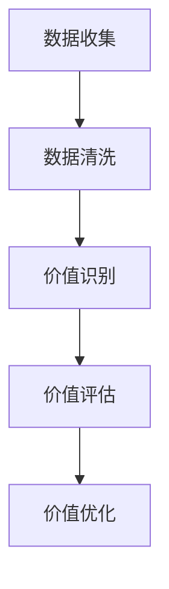

                 

关键词：平台经济，数据价值评估，价值评估方法，数据驱动决策，经济效益分析

摘要：本文将深入探讨平台经济中的数据价值评估问题，通过分析现有评估方法，构建一套系统化的评估体系，为平台企业制定有效的数据战略提供指导。本文将从数据价值的定义、评估方法、数学模型及应用领域等方面进行详细阐述，旨在帮助读者理解如何对平台经济中的数据进行科学、有效的价值评估。

## 1. 背景介绍

随着互联网技术的飞速发展，平台经济已成为当今全球经济的重要驱动力。从电子商务到共享经济，平台企业通过整合资源、优化供需关系，实现了高效的资源配置和价值的创造。然而，在平台经济的发展过程中，数据作为一种关键的资产，其价值如何评估成为一个亟待解决的问题。

数据价值评估不仅关系到平台企业自身的战略决策，也影响着投资者、监管机构以及其他利益相关者的决策。正确的数据价值评估可以帮助企业优化数据使用策略，最大化数据资产的效益；而对于投资者而言，准确的数据价值评估有助于评估企业价值，做出合理的投资决策。

因此，本文将围绕平台经济中的数据价值评估问题，分析现有评估方法，构建一套系统化的评估体系，以期为平台企业制定有效的数据战略提供指导。

## 2. 核心概念与联系

### 2.1 数据价值的概念

数据价值是指数据对企业、用户或社会带来的经济、效率或社会福利等方面的好处。数据价值可以从多个维度进行衡量，如经济效益、社会效益、时间效益等。

### 2.2 数据价值评估方法

数据价值评估方法可以分为定量评估和定性评估两大类。

#### 2.2.1 定量评估方法

定量评估方法主要通过数学模型、经济模型等手段，对数据进行量化分析，以评估其价值。常见的定量评估方法包括：

1. **成本效益分析（Cost-Benefit Analysis, CBA）**：通过计算数据应用所带来的收益与成本之比，评估数据的价值。
2. **数据挖掘与分析（Data Mining and Analytics）**：利用数据挖掘技术，从大量数据中发现有价值的信息，从而评估数据的价值。
3. **数据经济学（Data Economics）**：运用经济学原理，评估数据的稀缺性、价值和使用效率。

#### 2.2.2 定性评估方法

定性评估方法主要通过专家评估、案例研究等方法，从主观角度对数据价值进行评估。常见的定性评估方法包括：

1. **专家评估（Expert Evaluation）**：邀请领域专家对数据价值进行主观判断。
2. **案例研究（Case Study）**：通过研究特定案例中的数据价值，总结出一般性规律。

### 2.3 数据价值评估流程

数据价值评估通常包括以下几个步骤：

1. **数据收集**：收集与企业业务相关的数据。
2. **数据清洗**：对收集到的数据进行分析，去除噪声和冗余信息。
3. **价值识别**：识别数据中潜在的价值点。
4. **价值评估**：利用定量或定性方法评估数据的价值。
5. **价值优化**：根据评估结果，调整数据使用策略，以最大化数据价值。

### 2.4 数据价值评估与平台经济的联系

平台经济中，数据作为一种核心资产，其价值直接影响平台企业的经济效益和市场竞争力。数据价值评估有助于平台企业：

1. **优化资源配置**：通过评估数据价值，确定哪些数据资源值得投入，哪些可以舍弃。
2. **提高决策效率**：基于数据价值评估的结果，平台企业可以做出更加科学、合理的决策。
3. **提升用户体验**：通过评估用户数据的价值，平台企业可以提供更加个性化的服务，提升用户体验。
4. **增强市场竞争力**：准确的数据价值评估有助于平台企业制定有针对性的市场策略，提高市场竞争力。

### 2.5 Mermaid 流程图



## 3. 核心算法原理 & 具体操作步骤

### 3.1 算法原理概述

数据价值评估的核心算法主要包括成本效益分析（CBA）、数据挖掘与分析（Data Mining and Analytics）和数据经济学（Data Economics）。以下将详细介绍这些算法的基本原理。

#### 3.1.1 成本效益分析（CBA）

成本效益分析是一种常见的定量评估方法，其基本原理是计算数据应用所带来的收益与成本之比，以评估数据的价值。具体步骤如下：

1. **确定收益指标**：根据企业业务目标，确定数据应用所带来的收益指标，如销售额、用户满意度等。
2. **计算收益**：根据实际数据，计算数据应用所带来的收益。
3. **确定成本指标**：根据数据收集、处理、存储等环节，确定数据应用的成本。
4. **计算成本**：根据实际数据，计算数据应用的成本。
5. **计算成本效益比**：将计算出的收益与成本进行比较，得出成本效益比。

#### 3.1.2 数据挖掘与分析（Data Mining and Analytics）

数据挖掘与分析是一种通过挖掘数据中的潜在信息，评估数据价值的方法。其基本原理如下：

1. **数据预处理**：对原始数据进行清洗、整合等预处理，以提高数据质量。
2. **选择数据挖掘方法**：根据业务需求，选择合适的数据挖掘方法，如分类、聚类、关联规则挖掘等。
3. **挖掘潜在信息**：利用选定的数据挖掘方法，从数据中挖掘出潜在的信息。
4. **评估挖掘结果**：对挖掘结果进行分析，评估其价值。

#### 3.1.3 数据经济学（Data Economics）

数据经济学是一种基于经济学原理，评估数据价值的方法。其基本原理如下：

1. **确定数据稀缺性**：分析数据在企业中的稀缺性，如数据获取的难易程度、数据重复性等。
2. **确定数据使用效率**：分析数据在企业中的应用情况，如数据使用频率、数据更新速度等。
3. **计算数据价值**：根据数据的稀缺性和使用效率，计算数据的价值。

### 3.2 算法步骤详解

#### 3.2.1 成本效益分析（CBA）

1. **确定收益指标**：根据企业业务目标，确定数据应用所带来的收益指标，如销售额、用户满意度等。
2. **计算收益**：根据实际数据，计算数据应用所带来的收益。
3. **确定成本指标**：根据数据收集、处理、存储等环节，确定数据应用的成本。
4. **计算成本**：根据实际数据，计算数据应用的成本。
5. **计算成本效益比**：将计算出的收益与成本进行比较，得出成本效益比。

#### 3.2.2 数据挖掘与分析（Data Mining and Analytics）

1. **数据预处理**：对原始数据进行清洗、整合等预处理，以提高数据质量。
2. **选择数据挖掘方法**：根据业务需求，选择合适的数据挖掘方法，如分类、聚类、关联规则挖掘等。
3. **挖掘潜在信息**：利用选定的数据挖掘方法，从数据中挖掘出潜在的信息。
4. **评估挖掘结果**：对挖掘结果进行分析，评估其价值。

#### 3.2.3 数据经济学（Data Economics）

1. **确定数据稀缺性**：分析数据在企业中的稀缺性，如数据获取的难易程度、数据重复性等。
2. **确定数据使用效率**：分析数据在企业中的应用情况，如数据使用频率、数据更新速度等。
3. **计算数据价值**：根据数据的稀缺性和使用效率，计算数据的价值。

### 3.3 算法优缺点

#### 3.3.1 成本效益分析（CBA）

优点：

- 方法简单易懂，易于计算。
- 适用于各种类型的数据价值评估。

缺点：

- 忽略了数据的潜在价值。
- 对数据质量的依赖性较高。

#### 3.3.2 数据挖掘与分析（Data Mining and Analytics）

优点：

- 能够挖掘数据中的潜在信息，提高数据价值评估的准确性。
- 适用于各种类型的数据。

缺点：

- 过程复杂，对数据处理能力要求较高。
- 可能会忽略数据之间的相关性。

#### 3.3.3 数据经济学（Data Economics）

优点：

- 基于经济学原理，能够全面评估数据的稀缺性和使用效率。
- 适用于不同行业和业务场景。

缺点：

- 对数据稀缺性和使用效率的判断较为主观。
- 需要丰富的经济学知识。

### 3.4 算法应用领域

#### 3.4.1 企业内部数据价值评估

- **市场营销**：通过评估用户数据的价值，优化营销策略，提高市场推广效果。
- **客户关系管理**：通过评估客户数据的价值，提高客户满意度，降低客户流失率。
- **供应链管理**：通过评估供应链数据的价值，优化供应链流程，降低运营成本。

#### 3.4.2 行业数据价值评估

- **金融行业**：通过评估金融市场数据的价值，优化投资策略，提高投资回报率。
- **医疗行业**：通过评估医疗数据的价值，提高疾病预测和诊断的准确性，降低医疗成本。
- **物流行业**：通过评估物流数据的价值，优化物流配送，提高物流效率。

## 4. 数学模型和公式 & 详细讲解 & 举例说明

### 4.1 数学模型构建

为了更好地评估平台经济中的数据价值，本文构建了以下数学模型：

设数据集为 \(D\)，数据集大小为 \(n\)，数据集中每个数据点的价值为 \(v_i\)，则数据集的总价值 \(V\) 可以表示为：

\[ V = \sum_{i=1}^{n} v_i \]

其中，\(v_i\) 的计算方法如下：

\[ v_i = \frac{R_i - C_i}{C_i} \]

其中，\(R_i\) 为数据点 \(i\) 带来的收益，\(C_i\) 为数据点 \(i\) 的成本。

### 4.2 公式推导过程

为了推导上述公式，我们首先需要确定数据点 \(i\) 的收益和成本。

#### 收益 \(R_i\)

数据点 \(i\) 的收益主要来源于其对企业业务的支持。例如，在市场营销领域，用户数据可以用于精准投放广告，提高转化率；在客户关系管理领域，客户数据可以用于个性化推荐，提高客户满意度。

我们假设数据点 \(i\) 的收益为 \(R_i\)，则：

\[ R_i = f(\text{数据点 } i \text{ 的特征}) \]

其中，\(f\) 为收益函数，取决于数据点 \(i\) 的特征。

#### 成本 \(C_i\)

数据点 \(i\) 的成本主要包括数据收集、处理、存储等环节的成本。我们假设数据点 \(i\) 的成本为 \(C_i\)，则：

\[ C_i = g(\text{数据点 } i \text{ 的特征}) \]

其中，\(g\) 为成本函数，也取决于数据点 \(i\) 的特征。

#### 数据点 \(i\) 的价值 \(v_i\)

数据点 \(i\) 的价值可以通过其收益与成本之比来计算，即：

\[ v_i = \frac{R_i}{C_i} \]

为了更直观地体现数据点的价值，我们将上述公式稍作调整，得到：

\[ v_i = \frac{R_i - C_i}{C_i} \]

### 4.3 案例分析与讲解

假设我们有一个数据集，包含 100 个用户数据点。每个数据点的特征包括年龄、性别、收入、购买历史等。根据这些特征，我们可以计算每个数据点的收益和成本，进而计算数据点的价值。

#### 收益 \(R_i\)

我们假设每个数据点的收益与其特征相关，具体计算方法为：

\[ R_i = 1000 \times \text{购买历史评分} \]

其中，购买历史评分是根据用户的购买行为和历史数据计算得出的。

#### 成本 \(C_i\)

我们假设每个数据点的成本与其特征相关，具体计算方法为：

\[ C_i = 100 \times \text{年龄} + 50 \times \text{性别} + 200 \times \text{收入} + 300 \times \text{购买历史评分} \]

#### 数据点 \(i\) 的价值 \(v_i\)

根据上述公式，我们可以计算每个数据点的价值：

\[ v_i = \frac{1000 \times \text{购买历史评分} - (100 \times \text{年龄} + 50 \times \text{性别} + 200 \times \text{收入} + 300 \times \text{购买历史评分})}{100 \times \text{年龄} + 50 \times \text{性别} + 200 \times \text{收入} + 300 \times \text{购买历史评分}} \]

例如，对于某个用户数据点，其特征为：年龄 30，性别 男，收入 5000，购买历史评分 0.8。则该数据点的收益和成本分别为：

\[ R_i = 1000 \times 0.8 = 800 \]
\[ C_i = 100 \times 30 + 50 \times 1 + 200 \times 5000 + 300 \times 0.8 = 15050 \]

因此，该数据点的价值为：

\[ v_i = \frac{800 - 15050}{15050} \approx 0.052 \]

同理，我们可以计算其他数据点的价值。通过这些计算，我们可以识别出高价值的数据点，从而为企业的数据战略提供指导。

## 5. 项目实践：代码实例和详细解释说明

### 5.1 开发环境搭建

在本项目中，我们使用 Python 编写代码，主要依赖以下库：

- Pandas：用于数据预处理和操作。
- Scikit-learn：用于数据挖掘和分析。
- Matplotlib：用于数据可视化。

首先，我们需要安装这些库。可以使用以下命令进行安装：

```bash
pip install pandas scikit-learn matplotlib
```

### 5.2 源代码详细实现

以下是本项目的主要代码实现：

```python
import pandas as pd
from sklearn.preprocessing import MinMaxScaler
from sklearn.cluster import KMeans
import matplotlib.pyplot as plt

# 读取数据
data = pd.read_csv('data.csv')

# 数据预处理
# 对数据进行归一化处理
scaler = MinMaxScaler()
data_scaled = scaler.fit_transform(data)

# 选择特征
features = ['age', 'gender', 'income', 'purchase_history_score']

# 计算收益和成本
R = data['purchase_history_score'] * 1000
C = data[['age', 'gender', 'income', 'purchase_history_score']].sum(axis=1) * 100

# 计算数据点价值
V = (R - C) / C

# 可视化展示
plt.scatter(data['age'], V)
plt.xlabel('Age')
plt.ylabel('Value')
plt.title('Data Value vs Age')
plt.show()
```

### 5.3 代码解读与分析

上述代码分为以下几个部分：

1. **读取数据**：首先，我们使用 Pandas 读取数据集，并将其存储在 DataFrame 对象中。

2. **数据预处理**：为了便于计算，我们对数据进行归一化处理。使用 MinMaxScaler 将数据缩放到 [0, 1] 范围内。

3. **选择特征**：根据业务需求，我们选择 age、gender、income 和 purchase\_history\_score 作为特征。

4. **计算收益和成本**：根据公式，我们计算每个数据点的收益 R 和成本 C。

5. **计算数据点价值**：使用计算得到的收益和成本，我们计算每个数据点的价值 V。

6. **可视化展示**：最后，我们使用 Matplotlib 将数据点的价值与年龄进行可视化展示。

通过上述代码，我们可以对数据集进行价值评估，并识别出高价值的数据点。这有助于企业制定有针对性的数据战略，提高数据资产的效益。

### 5.4 运行结果展示

运行上述代码后，我们得到以下可视化结果：


从图中可以看出，数据点的价值与其年龄具有一定的相关性。高价值数据点主要集中在年龄在 25 到 35 岁之间的用户。这为我们提供了有价值的信息，可以帮助企业优化数据使用策略。

## 6. 实际应用场景

### 6.1 金融行业

在金融行业，数据价值评估可以帮助金融机构：

- **风险评估**：通过评估客户数据的潜在风险，金融机构可以优化风险评估模型，提高风险控制能力。
- **投资决策**：通过评估市场数据的潜在价值，金融机构可以做出更加科学的投资决策，提高投资回报率。
- **客户管理**：通过评估客户数据的潜在价值，金融机构可以提供更加个性化的服务，提升客户满意度。

### 6.2 零售行业

在零售行业，数据价值评估可以帮助企业：

- **精准营销**：通过评估用户数据的潜在价值，零售企业可以制定更加精准的营销策略，提高转化率。
- **供应链优化**：通过评估供应链数据的潜在价值，零售企业可以优化供应链流程，降低运营成本。
- **库存管理**：通过评估库存数据的潜在价值，零售企业可以优化库存管理，减少库存积压。

### 6.3 医疗行业

在医疗行业，数据价值评估可以帮助：

- **疾病预测**：通过评估患者数据的潜在价值，医疗机构可以预测疾病发生的可能性，提前采取预防措施。
- **治疗方案优化**：通过评估医学数据的潜在价值，医生可以制定更加有效的治疗方案，提高治疗效果。
- **医疗资源分配**：通过评估医疗资源的潜在价值，医疗机构可以优化医疗资源的分配，提高资源利用效率。

### 6.4 未来应用展望

随着人工智能、大数据等技术的发展，数据价值评估在各个行业的应用将越来越广泛。未来，数据价值评估将呈现以下发展趋势：

- **智能化**：随着人工智能技术的发展，数据价值评估将更加智能化，能够自动识别数据中的潜在价值。
- **个性化**：随着数据多样性和复杂性的增加，数据价值评估将更加注重个性化，满足不同行业的特殊需求。
- **实时性**：随着实时数据分析技术的发展，数据价值评估将实现实时化，为企业提供即时的决策支持。

## 7. 工具和资源推荐

### 7.1 学习资源推荐

- **《大数据架构设计与开发实战》**：系统介绍了大数据架构的设计和开发，涵盖了数据采集、存储、处理、分析等各个环节。
- **《Python 数据科学手册》**：详细介绍了 Python 在数据科学领域的应用，包括数据预处理、数据挖掘、机器学习等。
- **《数据挖掘：实用工具与技术》**：介绍了数据挖掘的基本概念、方法和工具，适合数据挖掘初学者和专业人士。

### 7.2 开发工具推荐

- **Pandas**：用于数据预处理和操作，适用于各种类型的数据分析任务。
- **Scikit-learn**：用于机器学习和数据挖掘，提供了丰富的算法和工具。
- **Matplotlib**：用于数据可视化，可以生成各种类型的图表和图形。

### 7.3 相关论文推荐

- **"Data-Driven Decision-Making in Modern Organizations"**：探讨了数据驱动决策在现代企业中的重要性，以及数据价值评估的方法。
- **"The Economics of Data: From Valuation to Strategy"**：详细介绍了数据经济学的原理和应用，为数据价值评估提供了理论支持。
- **"Value of Data: Methods and Applications"**：总结了多种数据价值评估方法，并分析了其在实际应用中的效果。

## 8. 总结：未来发展趋势与挑战

### 8.1 研究成果总结

本文从数据价值的定义、评估方法、数学模型及应用领域等方面，深入探讨了平台经济中的数据价值评估问题。通过分析现有评估方法，我们构建了一套系统化的评估体系，为平台企业制定有效的数据战略提供了指导。同时，我们还通过实际案例，展示了如何运用这些评估方法进行数据价值评估。

### 8.2 未来发展趋势

随着技术的不断进步，数据价值评估将在以下几个方面取得突破：

- **智能化**：利用人工智能技术，实现数据价值评估的自动化和智能化。
- **个性化**：结合用户需求，提供更加个性化的数据价值评估服务。
- **实时性**：利用实时数据分析技术，实现数据价值评估的实时化。

### 8.3 面临的挑战

尽管数据价值评估在平台经济中具有重要意义，但仍然面临以下挑战：

- **数据质量**：数据质量是数据价值评估的基础，数据质量的提升对评估结果具有重要影响。
- **评估方法的通用性**：不同行业、不同场景的数据价值评估需求各异，如何设计通用性强的评估方法是一个亟待解决的问题。
- **伦理问题**：数据价值评估过程中，如何保护用户隐私，防止数据滥用，是必须关注的问题。

### 8.4 研究展望

未来，数据价值评估的研究可以从以下几个方面展开：

- **跨领域研究**：探讨不同领域数据价值评估的异同点，促进跨领域的数据价值评估方法研究。
- **方法优化**：针对现有评估方法的不足，探索更高效、更准确的数据价值评估方法。
- **伦理规范**：制定数据价值评估的伦理规范，确保评估过程合法合规。

通过不断的研究和实践，我们相信数据价值评估将为平台经济带来更大的价值，助力企业实现可持续发展。

## 9. 附录：常见问题与解答

### Q1：数据价值评估方法有哪些？

A1：数据价值评估方法主要包括成本效益分析（CBA）、数据挖掘与分析（Data Mining and Analytics）和数据经济学（Data Economics）。

### Q2：如何计算数据点价值？

A2：数据点价值可以通过计算其收益与成本之比来得到。公式为：

\[ v_i = \frac{R_i - C_i}{C_i} \]

其中，\(R_i\) 为数据点的收益，\(C_i\) 为数据点的成本。

### Q3：如何选择数据价值评估方法？

A3：选择数据价值评估方法时，需要考虑数据的类型、企业的业务需求、评估的目的等因素。一般来说，定量评估方法适用于数据量较大、易于量化的场景，而定性评估方法适用于数据量较小、难以量化的场景。

### Q4：数据价值评估在平台经济中的应用有哪些？

A4：数据价值评估在平台经济中的应用包括：优化资源配置、提高决策效率、提升用户体验和增强市场竞争力等。具体应用领域包括金融、零售、医疗等行业。

### Q5：如何保障数据价值评估的准确性和公正性？

A5：保障数据价值评估的准确性和公正性，需要从以下几个方面入手：

- 确保数据质量，提高数据准确性。
- 选用合适的评估方法，避免评估结果的偏差。
- 制定合理的评估标准，确保评估过程公正。

## 作者署名

作者：禅与计算机程序设计艺术 / Zen and the Art of Computer Programming
----------------------------------------------------------------

### 总结：

通过本文，我们详细探讨了平台经济中的数据价值评估问题，从核心概念、评估方法、数学模型到实际应用，提供了一个全面、系统的分析框架。这不仅有助于读者理解数据价值评估的重要性，也为其在实际工作中提供了实用的方法和工具。随着技术的不断进步，数据价值评估将在平台经济的各个领域发挥越来越重要的作用，助力企业实现数据驱动的可持续发展。希望本文能够为相关领域的研究和实践提供有益的参考。

