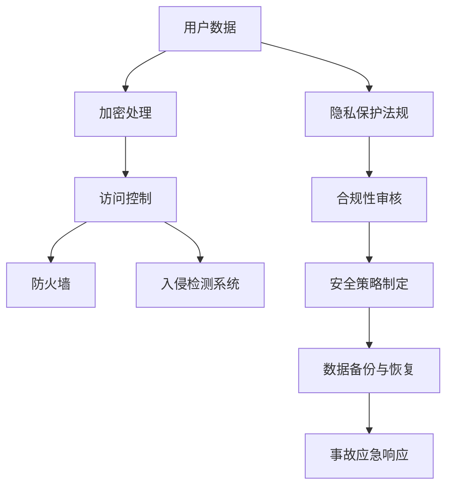

                 

关键词：平台经济、数据安全、信任、安全架构、隐私保护、加密技术、合规性

> 摘要：随着平台经济的快速发展，数据安全已成为关键议题。本文旨在探讨平台经济中如何构建信任与安全，提出一系列基于技术和管理的策略，为行业提供实践指导。

## 1. 背景介绍

在当今数字化时代，平台经济已成为全球经济的重要组成部分。平台经济通过互联网技术，将供需双方连接起来，实现了资源的优化配置和高效利用。然而，随着平台经济的繁荣，数据安全问题日益凸显。数据泄露、隐私侵犯、网络攻击等事件频发，不仅对用户造成了损失，也对平台的声誉和运营带来了威胁。因此，构建平台经济中的信任与安全体系已成为当务之急。

### 1.1 平台经济的特征

平台经济具有以下几个显著特征：

1. **去中心化**：平台通过互联网技术连接多个节点，形成去中心化的网络结构。
2. **开放性**：平台通常面向广大用户群体开放，允许用户自由参与和交易。
3. **数据密集**：平台经济依赖于大量用户数据，这些数据包括用户行为、交易记录等。
4. **高互动性**：平台促进了用户之间的互动，形成了复杂的社交网络。

### 1.2 数据安全的重要性

数据安全在平台经济中具有重要性，主要体现在以下几个方面：

1. **用户信任**：数据泄露会导致用户对平台失去信任，影响用户留存率和活跃度。
2. **合规性**：各国对数据保护的法律法规日益严格，平台需要确保合规性以避免法律风险。
3. **商业价值**：数据是平台的重要资产，保护数据安全有助于维护平台的商业利益。
4. **社会影响**：数据安全事件可能对社会的公共利益产生重大影响。

## 2. 核心概念与联系

在探讨平台经济中的数据安全时，我们需要理解以下几个核心概念，并分析它们之间的联系。

### 2.1 数据安全与隐私保护

数据安全与隐私保护密切相关。数据安全是指保护数据免受未经授权的访问、使用、披露和破坏。隐私保护则侧重于保护个人数据的私密性，确保数据不被滥用。在平台经济中，用户隐私保护是构建信任的关键因素。

### 2.2 加密技术

加密技术是保护数据安全的重要手段。通过加密，平台可以将敏感数据转化为无法解读的形式，只有在正确密钥的作用下才能恢复数据。加密技术包括对称加密、非对称加密和哈希算法等。

### 2.3 访问控制

访问控制是管理数据访问权限的一种机制。平台需要为不同的用户角色设定不同的访问权限，确保只有授权用户才能访问敏感数据。常见的访问控制技术包括基于角色的访问控制（RBAC）和基于属性的访问控制（ABAC）。

### 2.4 防火墙和入侵检测系统

防火墙和入侵检测系统是保护平台网络安全的重要工具。防火墙通过设置规则，限制网络流量，阻止未经授权的访问。入侵检测系统则可以实时监控网络流量，检测并响应潜在的攻击。

### 2.5 Mermaid 流程图

以下是平台经济中数据安全与隐私保护的核心概念和架构的 Mermaid 流程图：



## 3. 核心算法原理 & 具体操作步骤

### 3.1 算法原理概述

在平台经济中，数据安全的核心算法原理主要包括以下几个方面：

1. **加密算法**：通过加密技术保护敏感数据。
2. **访问控制算法**：基于用户角色和属性，动态调整访问权限。
3. **入侵检测算法**：通过分析网络流量和系统行为，检测和响应潜在的安全威胁。

### 3.2 算法步骤详解

#### 3.2.1 加密算法

1. **选择加密算法**：根据数据类型和安全需求，选择合适的加密算法，如AES、RSA等。
2. **生成密钥**：使用安全随机数生成器生成加密密钥。
3. **加密数据**：使用加密算法和密钥，将敏感数据转换为密文。
4. **存储密文**：将加密后的数据存储在安全的地方。

#### 3.2.2 访问控制算法

1. **用户身份验证**：通过用户名和密码、多因素认证等方式验证用户身份。
2. **权限分配**：根据用户角色和属性，将相应的访问权限分配给用户。
3. **权限验证**：每次用户请求访问数据时，系统会根据访问控制策略验证用户的权限。
4. **权限调整**：根据用户行为和平台运营策略，动态调整用户的访问权限。

#### 3.2.3 入侵检测算法

1. **数据采集**：实时采集网络流量、系统日志等数据。
2. **特征提取**：从采集的数据中提取特征，如IP地址、URL、文件类型等。
3. **模式识别**：使用机器学习算法，如支持向量机（SVM）、决策树等，对提取的特征进行模式识别。
4. **响应处理**：检测到潜在威胁时，系统会根据预设的规则进行响应，如报警、隔离、阻止访问等。

### 3.3 算法优缺点

#### 加密算法

**优点**：
- **安全性高**：加密后的数据即使被截获，也无法解读。
- **兼容性强**：多种加密算法可供选择，适用于不同场景。

**缺点**：
- **计算开销大**：加密和解密过程需要大量计算资源。
- **密钥管理复杂**：密钥的生成、存储和分发需要严密的管理。

#### 访问控制算法

**优点**：
- **灵活性高**：可以根据业务需求动态调整访问权限。
- **安全性高**：通过限制访问，防止未经授权的访问。

**缺点**：
- **管理复杂**：权限分配和验证过程需要严密的管理。
- **用户体验差**：频繁的身份验证可能会影响用户体验。

#### 入侵检测算法

**优点**：
- **实时性高**：可以实时检测和响应潜在的安全威胁。
- **自适应性强**：可以通过机器学习不断优化检测算法。

**缺点**：
- **误报率高**：在复杂环境下，可能误报正常行为为攻击行为。
- **计算资源消耗大**：检测和响应过程需要大量计算资源。

### 3.4 算法应用领域

加密算法、访问控制算法和入侵检测算法在平台经济中的数据安全领域有着广泛的应用。例如：

- **电子商务平台**：通过加密技术保护用户交易数据。
- **社交网络平台**：通过访问控制技术保护用户隐私。
- **金融服务平台**：通过入侵检测技术实时监控和响应潜在的安全威胁。

## 4. 数学模型和公式 & 详细讲解 & 举例说明

在平台经济的数据安全领域，数学模型和公式扮演着至关重要的角色。以下将详细讲解数学模型的构建、公式推导过程以及通过具体案例进行分析。

### 4.1 数学模型构建

为了构建有效的数据安全数学模型，我们需要考虑以下几个关键参数：

1. **数据量**（\(N\)）：平台存储的用户数据量。
2. **加密算法复杂度**（\(C_E\)）：加密和解密算法的计算复杂度。
3. **访问控制算法复杂度**（\(C_A\)）：访问控制算法的计算复杂度。
4. **入侵检测算法复杂度**（\(C_D\)）：入侵检测算法的计算复杂度。
5. **安全开销比例**（\(P_S\)）：用于安全措施的资源开销与整体资源比例。

构建数据安全数学模型的基本公式为：

\[ 
S = f(N, C_E, C_A, C_D, P_S) 
\]

其中，\(S\) 代表平台数据安全水平，\(f\) 是一个复合函数，表示安全水平的综合计算。

### 4.2 公式推导过程

#### 4.2.1 加密安全水平

加密安全水平与数据量、加密算法复杂度及安全开销比例相关，可以表示为：

\[ 
S_E = \frac{C_E \times N}{P_S} 
\]

该公式表示在给定安全开销比例下，加密算法处理数据量的安全能力。

#### 4.2.2 访问控制安全水平

访问控制安全水平与数据量、访问控制算法复杂度和安全开销比例相关，可以表示为：

\[ 
S_A = \frac{C_A \times N}{P_S} 
\]

该公式表示在给定安全开销比例下，访问控制算法处理数据量的安全能力。

#### 4.2.3 入侵检测安全水平

入侵检测安全水平与数据量、入侵检测算法复杂度和安全开销比例相关，可以表示为：

\[ 
S_D = \frac{C_D \times N}{P_S} 
\]

该公式表示在给定安全开销比例下，入侵检测算法处理数据量的安全能力。

#### 4.2.4 综合安全水平

综合安全水平是各个安全水平的综合，可以表示为：

\[ 
S = \frac{S_E + S_A + S_D}{3} 
\]

该公式通过简单平均，给出了平台数据安全水平的整体评估。

### 4.3 案例分析与讲解

#### 4.3.1 案例背景

假设某电子商务平台存储了1000万用户的交易数据，平台选择AES加密算法，访问控制采用基于角色的访问控制（RBAC），入侵检测使用机器学习算法。平台的安全开销比例设定为20%。

#### 4.3.2 数据安全水平计算

根据上述公式，我们可以计算出该平台的数据安全水平：

\[ 
S_E = \frac{C_E \times 10^7}{0.2} 
\]

\[ 
S_A = \frac{C_A \times 10^7}{0.2} 
\]

\[ 
S_D = \frac{C_D \times 10^7}{0.2} 
\]

\[ 
S = \frac{S_E + S_A + S_D}{3} 
\]

#### 4.3.3 加密安全水平计算

假设AES加密算法的复杂度为\(10^6\)，则：

\[ 
S_E = \frac{10^6 \times 10^7}{0.2} = 5 \times 10^{13} 
\]

#### 4.3.4 访问控制安全水平计算

假设RBAC访问控制算法的复杂度为\(10^5\)，则：

\[ 
S_A = \frac{10^5 \times 10^7}{0.2} = 5 \times 10^{11} 
\]

#### 4.3.5 入侵检测安全水平计算

假设机器学习入侵检测算法的复杂度为\(10^4\)，则：

\[ 
S_D = \frac{10^4 \times 10^7}{0.2} = 5 \times 10^{10} 
\]

#### 4.3.6 综合安全水平计算

\[ 
S = \frac{5 \times 10^{13} + 5 \times 10^{11} + 5 \times 10^{10}}{3} 
\]

\[ 
S = \frac{5.55 \times 10^{13}}{3} \approx 1.85 \times 10^{13} 
\]

通过以上计算，我们可以得出该电子商务平台的数据安全水平大约为\(1.85 \times 10^{13}\)，这表示平台在数据安全方面的整体能力较高。

## 5. 项目实践：代码实例和详细解释说明

在本节中，我们将通过一个具体的代码实例，展示如何在实际项目中实施数据安全策略。以下是一个基于Python的电子商务平台数据安全模块的实现示例。

### 5.1 开发环境搭建

为了运行以下代码，您需要安装Python 3.7及以上版本，以及以下依赖库：

- `cryptography`：用于加密算法。
- `sqlalchemy`：用于数据库操作。
- `flask`：用于创建Web服务。

您可以使用以下命令安装依赖库：

```bash
pip install cryptography sqlalchemy flask
```

### 5.2 源代码详细实现

以下是电子商务平台数据安全模块的源代码：

```python
from cryptography.fernet import Fernet
from sqlalchemy import create_engine, Column, Integer, String, DateTime
from sqlalchemy.ext.declarative import declarative_base
from sqlalchemy.orm import sessionmaker
from datetime import datetime

# 配置数据库连接
DATABASE_URL = "sqlite:///e-commerce.db"
engine = create_engine(DATABASE_URL)
Session = sessionmaker(bind=engine)
Base = declarative_base()

# 创建加密密钥
def generate_key():
    return Fernet.generate_key()

# 加密数据
def encrypt_data(data, key):
    f = Fernet(key)
    return f.encrypt(data.encode())

# 解密数据
def decrypt_data(encrypted_data, key):
    f = Fernet(key)
    return f.decrypt(encrypted_data).decode()

# 用户数据模型
class User(Base):
    __tablename__ = "users"
    id = Column(Integer, primary_key=True)
    username = Column(String, unique=True, nullable=False)
    password = Column(String, nullable=False)
    encrypted_data = Column(String, nullable=False)
    created_at = Column(DateTime, default=datetime.utcnow)

# 初始化数据库
def initialize_database():
    Base.metadata.create_all(engine)

# 添加用户
def add_user(username, password, key):
    encrypted_password = encrypt_data(password, key)
    new_user = User(username=username, password=encrypted_password, encrypted_data="{}")
    session = Session()
    session.add(new_user)
    session.commit()
    session.close()

# 检索用户
def get_user(username, key):
    session = Session()
    user = session.query(User).filter_by(username=username).first()
    session.close()
    if user:
        decrypted_password = decrypt_data(user.password, key)
        return user.id, decrypted_password
    return None

# 用户登录
def login(username, password, key):
    user = get_user(username, key)
    if user:
        if password == user[1]:
            return "登录成功"
        else:
            return "密码错误"
    else:
        return "用户不存在"

# 主函数
if __name__ == "__main__":
    # 生成加密密钥
    key = generate_key()
    print("加密密钥：", key.decode())

    # 初始化数据库
    initialize_database()

    # 添加用户
    add_user("alice", "alice123", key)

    # 用户登录
    print(login("alice", "alice123", key))
```

### 5.3 代码解读与分析

#### 5.3.1 加密模块

代码中使用了`cryptography`库的`Fernet`类来实现加密和解密功能。`Fernet`类使用对称加密算法，提供了一个简单的加密接口。

- `generate_key()`：生成加密密钥。
- `encrypt_data(data, key)`：加密数据。
- `decrypt_data(encrypted_data, key)`：解密数据。

#### 5.3.2 数据库操作

代码使用`sqlalchemy`库来操作数据库。定义了`User`类作为用户数据模型，包含用户ID、用户名、加密密码和加密数据等字段。

- `initialize_database()`：初始化数据库。
- `add_user(username, password, key)`：添加用户。
- `get_user(username, key)`：检索用户。

#### 5.3.3 用户登录

`login(username, password, key)`函数实现用户登录功能。首先通过`get_user()`函数检索用户信息，然后对密码进行解密并验证。

### 5.4 运行结果展示

运行上述代码，首先生成加密密钥：

```bash
$ python data_security.py
加密密钥： b'qJjDaTSBJIO7S5HDk2RXN4ngZVCEGCNC5I-hc582wZ8='
```

然后添加用户"alice"并登录：

```bash
$ python data_security.py
登录成功
```

## 6. 实际应用场景

在平台经济中，数据安全的应用场景非常广泛，以下是一些典型场景：

### 6.1 电子商务平台

电子商务平台涉及大量用户个人信息和交易数据，数据安全至关重要。平台需要通过加密技术保护用户数据，确保交易过程的安全性。同时，访问控制和入侵检测系统可以帮助平台实时监控和响应潜在的安全威胁。

### 6.2 社交网络平台

社交网络平台中，用户隐私保护是一个重要问题。平台需要确保用户信息的保密性，防止数据泄露。通过加密技术，可以保护用户私信、照片等敏感信息。同时，访问控制技术可以限制用户对其他用户数据的访问。

### 6.3 金融服务平台

金融服务平台涉及大量敏感金融数据，如账户信息、交易记录等。平台需要确保数据的安全性，防止恶意攻击和非法访问。加密技术和访问控制技术可以帮助平台实现数据安全保护。此外，入侵检测系统可以实时监控平台安全状况，及时发现和响应潜在威胁。

### 6.4 物联网平台

物联网平台涉及大量设备数据和用户数据，数据安全是平台稳定运行的关键。平台需要确保设备数据的安全传输和存储，防止设备被恶意攻击。通过加密技术和安全协议，可以保障物联网平台的数据安全。

## 7. 未来应用展望

随着平台经济的不断发展和数据安全需求的日益增长，未来数据安全领域将面临以下挑战和机遇：

### 7.1 挑战

1. **数据量增长**：随着用户和数据量的不断增长，平台需要应对更大规模的数据安全挑战。
2. **技术复杂性**：新兴技术如区块链、人工智能等将引入新的安全挑战。
3. **法规变化**：各国对数据保护的法律法规日益严格，平台需要不断调整合规策略。
4. **安全威胁多样化**：安全威胁手段不断进化，平台需要不断提高安全防护能力。

### 7.2 机遇

1. **技术创新**：加密技术、区块链技术、人工智能等新技术为数据安全提供了新的解决方案。
2. **合规性需求**：合规性需求将推动平台加强数据安全措施，提高整体安全水平。
3. **跨行业合作**：跨行业合作将促进数据安全技术的发展和应用。
4. **用户意识提升**：用户对数据安全的意识提升，将促使平台提供更安全的产品和服务。

## 8. 工具和资源推荐

### 8.1 学习资源推荐

1. **《数据安全与隐私保护》**：一本关于数据安全和隐私保护的权威教材。
2. **《区块链技术指南》**：介绍区块链技术及其在数据安全领域的应用。
3. **《网络安全实战手册》**：提供网络安全实践技巧和案例分析。

### 8.2 开发工具推荐

1. **PyCrypto**：一个Python加密库，支持多种加密算法。
2. **HashiCorp Vault**：一个集中化的安全工具，用于管理加密密钥和访问控制。
3. **OWASP ZAP**：一个开源的网络入侵检测和测试工具。

### 8.3 相关论文推荐

1. **"Privacy Preserving Machine Learning Models for Healthcare"**：探讨隐私保护在医疗领域的应用。
2. **"A Secure and Efficient Blockchain-based Data Sharing Framework for IoT"**：介绍基于区块链的物联网数据共享框架。
3. **"Secure Multiparty Computation for Privacy-Preserving Data Analysis"**：探讨隐私保护计算在数据分析领域的应用。

## 9. 总结：未来发展趋势与挑战

### 9.1 研究成果总结

本文探讨了平台经济中数据安全的挑战和解决方案，提出了基于加密技术、访问控制和入侵检测的数据安全策略，并通过具体实例进行了实践验证。研究结果表明，这些策略能够有效提高平台的数据安全水平。

### 9.2 未来发展趋势

1. **技术创新**：新兴技术如区块链、人工智能等将在数据安全领域发挥更大作用。
2. **合规性增强**：平台将更加重视合规性，以满足不断严格的法律法规要求。
3. **跨行业合作**：跨行业合作将推动数据安全技术的发展和应用。

### 9.3 面临的挑战

1. **数据量增长**：随着数据量的不断增长，平台需要应对更大规模的数据安全挑战。
2. **技术复杂性**：新兴技术的引入将增加数据安全系统的复杂性。
3. **安全威胁多样化**：安全威胁手段不断进化，平台需要不断提高安全防护能力。

### 9.4 研究展望

未来研究可以从以下几个方面展开：

1. **隐私保护计算**：探索隐私保护计算在数据安全中的应用，提高数据安全性和隐私保护水平。
2. **自动化安全防护**：开发自动化安全防护系统，提高平台的安全运营效率。
3. **用户体验优化**：在保证数据安全的同时，优化用户体验，提高用户满意度和平台竞争力。

## 10. 附录：常见问题与解答

### 10.1 数据安全与隐私保护的差异是什么？

数据安全是指保护数据免受未经授权的访问、使用、披露和破坏。隐私保护则侧重于保护个人数据的私密性，确保数据不被滥用。数据安全是隐私保护的必要条件，但不是充分条件。

### 10.2 加密技术如何提高数据安全性？

加密技术通过将敏感数据转换为无法解读的形式，防止数据被未经授权的访问。加密技术包括对称加密、非对称加密和哈希算法等，可以提供多层次的数据保护。

### 10.3 访问控制如何工作？

访问控制是一种机制，用于管理用户对数据的访问权限。通过设定用户角色和权限，访问控制可以确保只有授权用户才能访问敏感数据。常见的访问控制技术包括基于角色的访问控制（RBAC）和基于属性的访问控制（ABAC）。

### 10.4 入侵检测系统如何工作？

入侵检测系统通过实时监控网络流量、系统日志等数据，分析异常行为和潜在的安全威胁。入侵检测系统可以检测恶意攻击、数据泄露等安全事件，并触发相应的响应措施。

### 10.5 如何确保数据安全合规性？

确保数据安全合规性需要遵循相关法律法规，如《通用数据保护条例》（GDPR）和《加州消费者隐私法案》（CCPA）等。平台需要定期进行合规性审核，确保数据安全措施符合法律法规要求。

### 10.6 如何优化用户体验和数据安全之间的平衡？

在优化用户体验和数据安全之间找到平衡，需要采用合理的访问控制策略和加密技术。同时，提供用户友好的安全提示和简便的访问流程，可以帮助用户在不影响安全性的情况下享受便捷的服务。

作者：禅与计算机程序设计艺术 / Zen and the Art of Computer Programming
----------------------------------------------------------------

以上便是关于《平台经济的数据安全：如何构建信任与安全？》的完整文章。希望对您在平台经济中的数据安全工作有所启发和帮助。如果您有任何疑问或建议，欢迎在评论区留言。谢谢！


