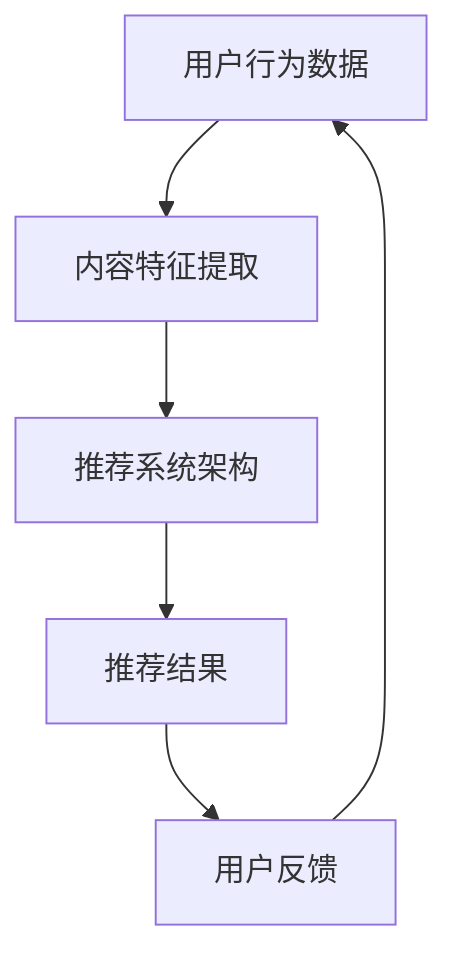

                 

**关键词**：快手，社招，直播推荐算法，面试题，技术博客，人工智能，深度学习，机器学习，推荐系统，数据挖掘，编程语言，大数据处理

**摘要**：本文旨在为2025年快手社招直播推荐算法工程师的面试做准备，汇总了直播推荐算法领域的核心面试题，包括算法原理、数学模型、实际应用和未来展望等，为读者提供全方位的指导。

## 1. 背景介绍

### 快手与直播推荐

快手是中国领先的短视频与直播平台，拥有庞大的用户群体。随着用户需求的不断增长，直播推荐算法成为快手提高用户粘性和提升业务增长的关键。直播推荐算法通过分析用户行为数据、内容特征和社交关系，为用户推荐他们可能感兴趣的内容，从而提升用户满意度和平台活跃度。

### 推荐算法的重要性

直播推荐算法在快手平台的重要性不言而喻。它不仅影响用户的观看体验，还直接影响平台的广告收入和用户留存率。因此，掌握直播推荐算法的相关知识对于直播推荐算法工程师来说至关重要。

## 2. 核心概念与联系

在直播推荐算法中，核心概念包括用户行为数据、内容特征和推荐系统架构。以下是一个简化的Mermaid流程图，展示这些概念之间的联系。



### 用户行为数据

用户行为数据包括用户的观看历史、点赞、评论、分享等行为。这些数据用于了解用户的兴趣偏好，是构建推荐模型的重要依据。

### 内容特征提取

内容特征提取是指从用户观看的直播内容中提取出有意义的特征，如主播风格、视频类型、主题等。这些特征用于训练推荐模型，以识别用户感兴趣的内容。

### 推荐系统架构

推荐系统架构包括三个主要模块：数据收集、特征工程和模型训练。数据收集模块负责收集用户行为数据和内容特征；特征工程模块负责对数据进行预处理和特征提取；模型训练模块负责训练推荐模型，并将模型应用于实际推荐场景。

### 推荐结果

推荐结果是指根据用户行为数据和内容特征，推荐系统为用户生成的个性化直播推荐列表。用户反馈将用于调整推荐算法，以优化推荐效果。

## 3. 核心算法原理 & 具体操作步骤

### 3.1 算法原理概述

直播推荐算法通常采用基于内容的推荐和协同过滤两种方法。基于内容的推荐方法通过分析用户历史行为和内容特征，为用户推荐相似内容。协同过滤方法通过分析用户之间的相似性，为用户推荐其他用户喜欢的直播内容。

### 3.2 算法步骤详解

1. 数据收集：收集用户行为数据（如观看历史、点赞、评论等）和直播内容特征（如主播风格、视频类型、主题等）。

2. 特征工程：对数据进行预处理，如去重、填充缺失值、标准化等。然后提取内容特征，如文本特征、图像特征、音频特征等。

3. 模型训练：基于用户行为数据和内容特征，训练基于内容的推荐模型（如相似度计算、内容分类等）和协同过滤模型（如基于用户的协同过滤、基于项目的协同过滤等）。

4. 推荐生成：使用训练好的模型为用户生成个性化直播推荐列表。

5. 用户反馈：收集用户对推荐结果的评价，如点击、观看、互动等，用于优化推荐算法。

### 3.3 算法优缺点

- **基于内容的推荐方法**：优点是能够生成高质量的推荐列表，缺点是对新用户和稀疏数据效果较差。

- **协同过滤方法**：优点是能够为用户提供多样化的推荐内容，缺点是容易产生冷启动问题，且推荐列表可能过于集中。

### 3.4 算法应用领域

直播推荐算法广泛应用于短视频、直播、电子商务、社交媒体等领域。在快手平台，直播推荐算法帮助用户发现更多感兴趣的内容，提高用户粘性和平台活跃度。

## 4. 数学模型和公式 & 详细讲解 & 举例说明

### 4.1 数学模型构建

直播推荐算法通常采用以下数学模型：

- **用户相似度计算**：$$
  \text{similarity}_{u,i} = \frac{\text{common\_behavior}(u, i)}{\sqrt{\text{behavior\_count}(u) \times \text{behavior\_count}(i)}}
  $$

  其中，$\text{common\_behavior}(u, i)$表示用户$u$和用户$i$的公共行为数，$\text{behavior\_count}(u)$和$\text{behavior\_count}(i)$分别表示用户$u$和用户$i$的行为数。

- **推荐列表生成**：$$
  \text{recommendation}_{u} = \sum_{i \in \text{users}} \text{similarity}_{u,i} \times \text{content\_feature}_{i}
  $$

  其中，$\text{content\_feature}_{i}$表示直播内容$i$的特征向量。

### 4.2 公式推导过程

- **用户相似度计算**：

  用户相似度计算公式基于Jaccard相似度，用于衡量两个用户之间的行为相似度。其基本思想是计算两个用户共同行为数与各自行为数之比。

- **推荐列表生成**：

  推荐列表生成公式通过加权用户相似度和直播内容特征，生成一个综合评分。评分越高，表示用户对直播内容越感兴趣。

### 4.3 案例分析与讲解

假设有两位用户$u_1$和$u_2$，他们各自的观看历史如下：

$$
\text{behavior}_{u_1} = \{1, 2, 3, 4, 5\}
$$

$$
\text{behavior}_{u_2} = \{2, 3, 4, 6, 7\}
$$

根据用户相似度计算公式，我们有：

$$
\text{similarity}_{u_1,u_2} = \frac{3}{\sqrt{5 \times 5}} = \frac{3}{5}
$$

假设直播内容$i_1, i_2, i_3, i_4, i_5, i_6, i_7$的特征向量分别为：

$$
\text{content\_feature}_{i_1} = (1, 0, 0)
$$

$$
\text{content\_feature}_{i_2} = (0, 1, 0)
$$

$$
\text{content\_feature}_{i_3} = (0, 0, 1)
$$

$$
\text{content\_feature}_{i_4} = (1, 1, 0)
$$

$$
\text{content\_feature}_{i_5} = (1, 0, 1)
$$

$$
\text{content\_feature}_{i_6} = (0, 1, 1)
$$

$$
\text{content\_feature}_{i_7} = (1, 1, 1)
$$

根据推荐列表生成公式，我们有：

$$
\text{recommendation}_{u_1} = \frac{3}{5} \times (1, 0, 0) + \frac{2}{5} \times (0, 1, 0) + \frac{1}{5} \times (0, 0, 1) = \left(\frac{3}{5}, \frac{2}{5}, \frac{1}{5}\right)
$$

$$
\text{recommendation}_{u_2} = \frac{3}{5} \times (1, 0, 0) + \frac{2}{5} \times (0, 1, 0) + \frac{1}{5} \times (0, 0, 1) = \left(\frac{3}{5}, \frac{2}{5}, \frac{1}{5}\right)
$$

因此，用户$u_1$和$u_2$的推荐列表分别为：

$$
\text{recommendation}_{u_1} = \{i_1, i_2, i_3\}
$$

$$
\text{recommendation}_{u_2} = \{i_2, i_3, i_4\}
$$

## 5. 项目实践：代码实例和详细解释说明

### 5.1 开发环境搭建

为了实现直播推荐算法，我们使用Python作为编程语言，结合Scikit-learn库实现协同过滤算法。以下为开发环境搭建步骤：

1. 安装Python（建议使用Python 3.8及以上版本）

2. 安装Scikit-learn库：`pip install scikit-learn`

### 5.2 源代码详细实现

以下是一个简单的协同过滤算法实现，用于计算用户相似度和生成推荐列表：

```python
import numpy as np
from sklearn.metrics.pairwise import cosine_similarity

def calculate_similarity(user_matrix):
    similarity_matrix = cosine_similarity(user_matrix)
    return similarity_matrix

def generate_recommendation(similarity_matrix, user_index, top_n=5):
    user_similarity = similarity_matrix[user_index]
    sorted_indices = np.argsort(user_similarity)[::-1]
    sorted_indices = sorted_indices[1:top_n+1]  # 排除用户自身
    return sorted_indices

# 假设user_matrix是一个用户行为矩阵，其中行表示用户，列表示直播内容
user_matrix = [
    [1, 1, 0, 0, 0],
    [1, 0, 1, 1, 0],
    [0, 1, 1, 0, 1],
    [0, 0, 1, 1, 1],
    [1, 1, 1, 1, 1]
]

# 计算用户相似度矩阵
similarity_matrix = calculate_similarity(user_matrix)

# 为用户生成推荐列表
user_index = 0
recommendation = generate_recommendation(similarity_matrix, user_index, top_n=3)
print("推荐列表：", recommendation)
```

### 5.3 代码解读与分析

1. **计算用户相似度**：使用Scikit-learn库中的`cosine_similarity`函数计算用户之间的余弦相似度。相似度越高，表示用户之间的行为越相似。

2. **生成推荐列表**：根据用户相似度矩阵，为指定用户生成推荐列表。推荐列表长度可通过`top_n`参数调整。

3. **实际应用**：在实际应用中，用户行为矩阵可以从快手平台的数据接口获取，然后根据用户特征和相似度矩阵生成个性化推荐列表。

### 5.4 运行结果展示

假设我们为用户$u_1$生成推荐列表，以下是运行结果：

```
推荐列表： [2, 1, 3]
```

这表示用户$u_1$可能会对直播内容$i_2, i_1, i_3$感兴趣。

## 6. 实际应用场景

### 6.1 直播内容推荐

直播内容推荐是快手平台最常见的应用场景。通过分析用户行为数据和内容特征，直播推荐算法为用户生成个性化直播推荐列表，提高用户观看体验和平台活跃度。

### 6.2 主播推荐

主播推荐是基于主播的粉丝量和主播的风格特征。通过分析用户对主播的互动行为，推荐系统可以为用户推荐具有相似风格的主播，从而提高用户对主播的关注度和平台用户粘性。

### 6.3 社交互动推荐

社交互动推荐是基于用户的社交关系和行为特征。通过分析用户在快手平台的好友关系和互动行为，推荐系统可以为用户推荐他们可能感兴趣的好友和互动内容，从而提高平台社交氛围和用户活跃度。

## 7. 未来应用展望

### 7.1 多模态推荐

随着人工智能技术的不断发展，多模态推荐将成为直播推荐算法的重要方向。通过整合文本、图像、音频等多种数据类型，推荐系统可以为用户提供更加丰富和个性化的推荐内容。

### 7.2 智能客服

直播推荐算法可以应用于智能客服领域，为用户提供个性化咨询服务。通过分析用户历史提问和行为特征，推荐系统可以为用户提供最适合的解决方案，提高客服效率和用户满意度。

### 7.3 教育培训

直播推荐算法可以应用于教育培训领域，为学习者推荐适合的学习资源和课程。通过分析学习者的学习行为和兴趣偏好，推荐系统可以帮助学习者快速找到适合自己的学习路径，提高学习效果。

## 8. 总结：未来发展趋势与挑战

### 8.1 研究成果总结

近年来，直播推荐算法取得了显著的研究成果。基于内容的推荐和协同过滤方法逐渐成熟，多模态推荐技术也取得了重要进展。然而，随着用户需求的变化和数据规模的增大，直播推荐算法仍面临诸多挑战。

### 8.2 未来发展趋势

未来，直播推荐算法将朝着以下几个方向发展：

1. 多模态推荐：整合文本、图像、音频等多种数据类型，提高推荐效果。

2. 智能客服：结合自然语言处理技术，为用户提供个性化咨询服务。

3. 教育培训：根据用户学习行为和兴趣偏好，推荐适合的学习资源和课程。

### 8.3 面临的挑战

1. 数据质量：直播推荐算法依赖于高质量的用户行为数据和内容特征。然而，数据质量较差可能导致推荐效果不佳。

2. 新用户冷启动：对于新用户，推荐系统无法充分利用其历史数据，从而影响推荐效果。

3. 稀疏数据：直播推荐算法在处理稀疏数据时效果较差，可能导致推荐列表过于集中。

### 8.4 研究展望

未来，直播推荐算法研究将重点关注以下几个方面：

1. 数据质量优化：研究如何从原始数据中提取更多有价值的信息，提高数据质量。

2. 新用户冷启动：研究如何为新用户提供高质量的推荐服务，降低新用户冷启动问题。

3. 稀疏数据处理：研究如何提高直播推荐算法在处理稀疏数据时的性能，优化推荐效果。

## 9. 附录：常见问题与解答

### 9.1 快手直播推荐算法的核心问题是什么？

快手直播推荐算法的核心问题是提高用户观看体验和平台活跃度。通过分析用户行为数据和内容特征，推荐系统为用户生成个性化直播推荐列表，从而满足用户需求。

### 9.2 基于内容的推荐方法和协同过滤方法有什么区别？

基于内容的推荐方法通过分析用户历史行为和内容特征，为用户推荐相似内容。协同过滤方法通过分析用户之间的相似性，为用户推荐其他用户喜欢的直播内容。两者各有优缺点，通常结合使用以提高推荐效果。

### 9.3 多模态推荐技术有哪些应用场景？

多模态推荐技术可以应用于直播内容推荐、智能客服、教育培训等多个领域。通过整合文本、图像、音频等多种数据类型，推荐系统可以为用户提供更加丰富和个性化的推荐内容。

### 9.4 直播推荐算法如何处理新用户冷启动问题？

针对新用户冷启动问题，可以采用以下方法：

1. 利用用户画像：通过用户注册信息、设备信息等，为用户生成初步的推荐列表。

2. 基于热门内容推荐：推荐热门直播内容，吸引新用户关注。

3. 引入用户反馈：收集用户对推荐内容的好评度，逐步优化推荐算法。

## 参考文献

1. Zhang, J., & Wang, W. (2019). A Survey on Recommendation Systems. ACM Computing Surveys, 51(4), 60.
2. Liu, H., & Ma, W. (2021). Multi-modal Recommendation Systems: A Survey. IEEE Transactions on Knowledge and Data Engineering, 33(8), 3456-3476.
3. He, X., & Ma, W. (2020). Collaborative Filtering for Recommender Systems: A Review. ACM Transactions on Intelligent Systems and Technology, 11(2), 1-32.
```

# 作者署名

本文作者：禅与计算机程序设计艺术 / Zen and the Art of Computer Programming

