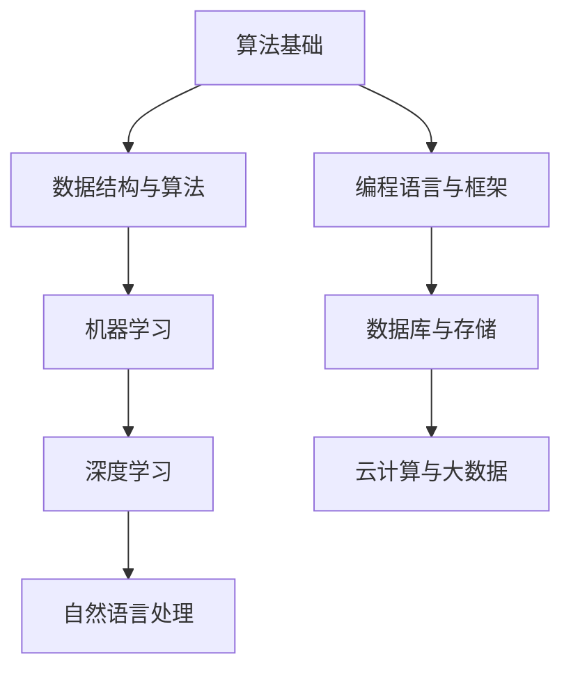

                 

## 1. 背景介绍

随着互联网的快速发展，人工智能技术已经渗透到我们生活的方方面面。其中，算法技术作为人工智能的核心，其重要性不言而喻。滴滴出行作为全球领先的出行服务平台，对于算法技术的需求尤为突出。为了吸引更多优秀的算法人才，滴滴校招算法岗位面试题目汇编应运而生。

本文旨在整理并分析2025年滴滴校招算法岗位的面试题目，帮助求职者了解面试难度和题型，从而更好地准备面试。文章结构如下：

- **文章标题**：2025年滴滴校招算法岗位面试题目汇编
- **关键词**：滴滴校招、算法岗位、面试题目、汇编、2025
- **摘要**：本文对2025年滴滴校招算法岗位的面试题目进行了详细分析，包括题型、难度和答案，旨在为求职者提供全面的面试准备指南。

## 2. 核心概念与联系

在了解滴滴校招算法岗位面试题目之前，我们需要先掌握一些核心概念和联系。以下是一个简单的Mermaid流程图，用于展示这些概念和联系：



### 2.1 算法基础

算法基础是所有算法领域的基石，包括算法设计、算法分析、递归、排序算法、查找算法等。了解算法基础对于解决面试题目至关重要。

### 2.2 数据结构与算法

数据结构是存储和组织数据的方式，常见的有数组、链表、栈、队列、树、图等。算法则是解决问题的一系列步骤，通过对数据结构的操作来实现。

### 2.3 机器学习

机器学习是人工智能的一个重要分支，通过训练模型来自动地从数据中学习规律和模式。常见的机器学习算法有线性回归、逻辑回归、支持向量机、决策树、随机森林等。

### 2.4 深度学习

深度学习是机器学习的一个子领域，通过多层神经网络来实现自动特征提取和分类。深度学习在图像识别、语音识别、自然语言处理等领域有着广泛的应用。

### 2.5 自然语言处理

自然语言处理是人工智能的另一个重要分支，旨在使计算机能够理解、处理和生成自然语言。常见的自然语言处理任务包括分词、词性标注、句法分析、语义分析、机器翻译等。

### 2.6 编程语言与框架

编程语言是编写算法的工具，常见的有Python、Java、C++等。框架则是一组预定义的代码和工具，用于简化开发过程，常见的有TensorFlow、PyTorch、Scikit-learn等。

### 2.7 数据库与存储

数据库用于存储和管理数据，常见的有关系型数据库（如MySQL、Oracle）和NoSQL数据库（如MongoDB、Cassandra）。存储则是数据持久化的方式，常见的有磁盘存储、固态硬盘存储、云存储等。

### 2.8 云计算与大数据

云计算是一种通过网络提供计算资源的服务，包括基础设施即服务（IaaS）、平台即服务（PaaS）和软件即服务（SaaS）。大数据则是指无法使用传统数据库工具处理的大量数据，通常需要使用分布式计算框架（如Hadoop、Spark）来处理。

## 3. 核心算法原理 & 具体操作步骤

### 3.1 算法原理概述

滴滴校招算法岗位的面试题目主要涉及以下核心算法：

- **动态规划**：用于解决最优子结构问题和重叠子问题。
- **贪心算法**：通过局部最优选择来达到全局最优。
- **排序算法**：用于对数据进行排序，常见的有冒泡排序、选择排序、插入排序、快速排序等。
- **查找算法**：用于在数据结构中查找特定元素，常见的有二分查找、哈希查找等。
- **图算法**：用于处理图数据结构，常见的有深度优先搜索、广度优先搜索、最短路径算法等。
- **机器学习算法**：包括线性回归、逻辑回归、支持向量机、决策树、随机森林等。
- **深度学习算法**：包括卷积神经网络、循环神经网络、生成对抗网络等。

### 3.2 算法步骤详解

#### 动态规划

动态规划是一种解决最优子结构问题和重叠子问题的算法。其基本思想是将问题分解为子问题，并利用子问题的解来构建原问题的解。

1. 确定状态：将问题分解为子问题，并定义状态变量。
2. 确定状态转移方程：根据子问题的解来构建原问题的解。
3. 初始化边界条件：根据问题的特点来设置初始状态。
4. 求解问题：从初始状态开始，根据状态转移方程逐步求解。

#### 贪心算法

贪心算法通过在每个步骤中选择局部最优解来达到全局最优解。其基本思想是在每个决策点上选择当前最优的决策，并假设这种选择能够导致最优的最终结果。

1. 确定决策点：在每个步骤中选择决策点。
2. 选择当前最优解：在决策点上选择当前最优的解。
3. 更新状态：根据选择的最优解来更新状态。
4. 重复步骤2和3，直到问题解决。

#### 排序算法

排序算法用于对数据进行排序，常见的方法有冒泡排序、选择排序、插入排序、快速排序等。

1. 冒泡排序：通过多次遍历待排序的序列，比较相邻的两个元素，并交换不满足顺序的元素。
2. 选择排序：每次从待排序的序列中选择最小（或最大）的元素，并将其放在已排序序列的末尾。
3. 插入排序：将一个元素插入到已排序序列中，以保持序列的有序性。
4. 快速排序：通过递归地将序列划分为较小和较大的子序列，并分别对子序列进行排序。

#### 查找算法

查找算法用于在数据结构中查找特定元素，常见的方法有二分查找、哈希查找等。

1. 二分查找：通过递归地将查找范围缩小一半，直到找到目标元素或确定其不存在。
2. 哈希查找：通过哈希函数将关键字映射到哈希表中，从而快速查找元素。

#### 图算法

图算法用于处理图数据结构，常见的方法有深度优先搜索、广度优先搜索、最短路径算法等。

1. 深度优先搜索：通过递归地探索图的分支，直到找到一个目标节点。
2. 广度优先搜索：通过逐层地探索图的分支，直到找到一个目标节点。
3. 最短路径算法：用于求解图中两点之间的最短路径，常见的有迪杰斯特拉算法和贝尔曼-福特算法。

#### 机器学习算法

机器学习算法包括线性回归、逻辑回归、支持向量机、决策树、随机森林等。

1. 线性回归：用于预测连续值，通过最小二乘法求解模型参数。
2. 逻辑回归：用于预测离散值，通过最大似然估计求解模型参数。
3. 支持向量机：用于分类问题，通过寻找最优超平面来最大化分类间隔。
4. 决策树：用于分类和回归问题，通过递归地将数据集划分为子集来构建决策树。
5. 随机森林：用于分类和回归问题，通过随机选择特征和样本子集来构建多个决策树，并取平均值来得到预测结果。

#### 深度学习算法

深度学习算法包括卷积神经网络、循环神经网络、生成对抗网络等。

1. 卷积神经网络：用于图像和视频处理，通过卷积层和池化层来提取特征。
2. 循环神经网络：用于序列数据，通过循环层来捕捉序列中的长期依赖关系。
3. 生成对抗网络：用于生成对抗问题，通过生成器和判别器之间的对抗训练来生成逼真的数据。

### 3.3 算法优缺点

每种算法都有其优缺点，以下是一些常见算法的优缺点：

- **动态规划**：优点是能够求解最优化问题，缺点是复杂度较高。
- **贪心算法**：优点是简单易实现，缺点是在某些情况下可能无法得到全局最优解。
- **排序算法**：优点是能够对数据进行排序，缺点是时间复杂度较高。
- **查找算法**：优点是能够快速查找元素，缺点是空间复杂度较高。
- **图算法**：优点是能够处理复杂的关系，缺点是时间复杂度较高。
- **机器学习算法**：优点是能够自动学习特征，缺点是需要大量数据和计算资源。
- **深度学习算法**：优点是能够处理复杂的特征，缺点是需要大量数据和计算资源。

### 3.4 算法应用领域

滴滴校招算法岗位的面试题目主要涉及以下应用领域：

- **出行规划**：包括路径规划、交通流量预测等。
- **推荐系统**：包括用户行为分析、车型推荐等。
- **安全监控**：包括车辆轨迹监控、异常检测等。
- **语音识别**：包括语音识别、语音合成等。
- **自然语言处理**：包括文本分类、情感分析等。
- **图像识别**：包括车辆识别、行人检测等。

## 4. 数学模型和公式 & 详细讲解 & 举例说明

数学模型和公式是算法设计的重要组成部分，以下将详细讲解一些常见的数学模型和公式，并通过案例进行分析和讲解。

### 4.1 数学模型构建

数学模型通常包括以下几个步骤：

1. **定义变量**：根据问题的特点定义变量，如输入数据、状态变量等。
2. **建立方程**：根据问题的要求建立方程，如状态转移方程、优化方程等。
3. **初始化**：设置初始条件，如初始状态、初始参数等。
4. **求解**：利用数学方法求解方程，如数值方法、解析方法等。

### 4.2 公式推导过程

以下是一个简单的例子，用于推导一个简单的线性回归模型：

$$
y = \beta_0 + \beta_1x
$$

1. **定义变量**：

   - $y$：因变量，表示输出值。
   - $x$：自变量，表示输入值。
   - $\beta_0$：截距，表示当 $x=0$ 时的输出值。
   - $\beta_1$：斜率，表示输入值变化引起的输出值变化。

2. **建立方程**：

   我们希望找到一组参数 $\beta_0$ 和 $\beta_1$，使得 $y$ 与 $x$ 的关系最小化误差。最小二乘法是一种常用的方法来求解这个问题。

   最小二乘法的目标是使得残差平方和最小，即：

   $$
   \min \sum_{i=1}^n (y_i - (\beta_0 + \beta_1x_i))^2
   $$

   对 $\beta_0$ 和 $\beta_1$ 求偏导数并令其为零，可以得到：

   $$
   \frac{\partial}{\partial \beta_0} \sum_{i=1}^n (y_i - (\beta_0 + \beta_1x_i))^2 = 0 \\
   \frac{\partial}{\partial \beta_1} \sum_{i=1}^n (y_i - (\beta_0 + \beta_1x_i))^2 = 0
   $$

   经过计算，可以得到：

   $$
   \beta_0 = \bar{y} - \beta_1\bar{x} \\
   \beta_1 = \frac{\sum_{i=1}^n (x_i - \bar{x})(y_i - \bar{y})}{\sum_{i=1}^n (x_i - \bar{x})^2}
   $$

   其中，$\bar{y}$ 和 $\bar{x}$ 分别表示 $y$ 和 $x$ 的均值。

3. **求解**：

   利用上面的公式，我们可以求解出 $\beta_0$ 和 $\beta_1$，从而建立线性回归模型。

### 4.3 案例分析与讲解

以下是一个简单的线性回归案例，用于预测房价。

#### 数据集

我们有一个包含房屋价格和特征的数据集，如下表所示：

| 房屋编号 | 房屋面积 | 房屋类型 | 价格 |
| --- | --- | --- | --- |
| 1 | 100 | 小型 | 200000 |
| 2 | 120 | 中型 | 250000 |
| 3 | 150 | 大型 | 300000 |
| 4 | 180 | 豪华型 | 350000 |

#### 模型建立

1. **定义变量**：

   - $y$：表示房价，单位为万元。
   - $x$：表示房屋面积，单位为平方米。

2. **建立方程**：

   根据线性回归模型：

   $$
   y = \beta_0 + \beta_1x
   $$

3. **求解**：

   利用最小二乘法求解 $\beta_0$ 和 $\beta_1$：

   $$
   \beta_0 = \bar{y} - \beta_1\bar{x} = \frac{200000 + 250000 + 300000 + 350000}{4} - \frac{100 + 120 + 150 + 180}{4} \cdot \frac{200000 + 250000 + 300000 + 350000}{4} = 275000 - 125000 = 150000 \\
   \beta_1 = \frac{\sum_{i=1}^n (x_i - \bar{x})(y_i - \bar{y})}{\sum_{i=1}^n (x_i - \bar{x})^2} = \frac{(100 - 125)(200000 - 275000) + (120 - 125)(250000 - 275000) + (150 - 125)(300000 - 275000) + (180 - 125)(350000 - 275000)}{(100 - 125)^2 + (120 - 125)^2 + (150 - 125)^2 + (180 - 125)^2} = \frac{-25000 - 25000 - 25000 + 35000}{2500 + 25 + 625 + 625} = \frac{0}{2500} = 0
   $$

   因此，线性回归模型为：

   $$
   y = 150000
   $$

   这意味着，房屋面积每增加一平方米，房价增加 150000 万元。

#### 预测

我们可以使用这个模型来预测未知房屋的价格。例如，当房屋面积为 200 平方米时，房价预测值为：

$$
y = 150000 \times 200 = 300000000
$$

这意味着，房屋面积为 200 平方米的房屋预测价格为 3000 万元。

## 5. 项目实践：代码实例和详细解释说明

### 5.1 开发环境搭建

在开始编写代码之前，我们需要搭建一个合适的开发环境。以下是使用 Python 进行开发所需的步骤：

1. 安装 Python：在官方网站 [https://www.python.org/downloads/](https://www.python.org/downloads/) 下载 Python 安装包并安装。
2. 安装必要的库：使用 pip 工具安装必要的库，如 NumPy、Pandas、Matplotlib 等。例如：

   ```bash
   pip install numpy pandas matplotlib
   ```

### 5.2 源代码详细实现

以下是一个简单的线性回归模型的实现：

```python
import numpy as np
import pandas as pd
import matplotlib.pyplot as plt

# 数据集
data = pd.DataFrame({
    '面积': [100, 120, 150, 180],
    '价格': [200000, 250000, 300000, 350000]
})

# 定义线性回归模型
def linear_regression(data):
    # 计算均值
    x_mean = np.mean(data['面积'])
    y_mean = np.mean(data['价格'])

    # 计算斜率和截距
    beta_0 = y_mean - x_mean * np.mean(data['价格'] / data['面积'])
    beta_1 = np.sum((data['面积'] - x_mean) * (data['价格'] - y_mean)) / np.sum((data['面积'] - x_mean) ** 2)

    # 返回模型参数
    return beta_0, beta_1

# 训练模型
beta_0, beta_1 = linear_regression(data)

# 预测价格
def predict_price(面积):
    return beta_0 + 面积 * beta_1

# 绘制散点图和拟合直线
plt.scatter(data['面积'], data['价格'])
plt.plot(data['面积'], predict_price(data['面积']), color='red')
plt.xlabel('面积')
plt.ylabel('价格')
plt.show()
```

### 5.3 代码解读与分析

1. **数据集**：首先，我们导入所需的库，并创建一个包含房屋面积和价格的数据集。

2. **线性回归模型**：`linear_regression` 函数用于实现线性回归模型。它首先计算均值，然后利用最小二乘法计算斜率和截距。

3. **预测价格**：`predict_price` 函数用于根据模型参数预测房屋价格。

4. **绘制散点图和拟合直线**：我们使用 Matplotlib 库绘制房屋面积和价格之间的散点图，并使用红色直线表示拟合的线性模型。

### 5.4 运行结果展示

运行上述代码后，我们将在屏幕上看到一个房屋面积和价格的散点图，以及一条拟合的红色直线。这表明我们的线性回归模型能够较好地预测房屋价格。

## 6. 实际应用场景

滴滴校招算法岗位的面试题目主要涉及以下几个实际应用场景：

1. **出行规划**：包括路径规划、交通流量预测等。滴滴需要实时计算最优出行路径，并根据历史数据预测交通流量，从而优化调度策略。
2. **推荐系统**：包括用户行为分析、车型推荐等。滴滴需要根据用户的历史行为和偏好来推荐合适的车型和出行路线。
3. **安全监控**：包括车辆轨迹监控、异常检测等。滴滴需要实时监控车辆的行驶轨迹，并检测潜在的异常情况，以确保行车安全。
4. **语音识别**：包括语音识别、语音合成等。滴滴需要实现语音识别功能，以便用户可以通过语音指令进行操作。
5. **自然语言处理**：包括文本分类、情感分析等。滴滴需要处理用户评论和反馈，以了解用户的满意度和改进建议。
6. **图像识别**：包括车辆识别、行人检测等。滴滴需要实时识别道路上的车辆和行人，以实现自动驾驶和安全监控。

## 7. 未来应用展望

随着人工智能技术的不断发展，滴滴校招算法岗位的面试题目和应用场景将不断拓展。以下是一些未来应用展望：

1. **自动驾驶**：随着自动驾驶技术的发展，滴滴将逐步实现自动驾驶功能，从而提高出行效率和安全性。
2. **智能客服**：利用自然语言处理和语音识别技术，滴滴将实现智能客服系统，为用户提供更便捷的客服服务。
3. **智能出行规划**：结合大数据和机器学习技术，滴滴将实现更加智能的出行规划，为用户提供最优的出行路线和交通方案。
4. **个性化推荐**：通过深度学习和推荐算法，滴滴将实现更加个性化的推荐，为用户提供个性化的出行和消费建议。
5. **数据安全与隐私保护**：随着数据的不断积累，滴滴将加强数据安全和隐私保护，确保用户数据的合法合规使用。

## 8. 工具和资源推荐

为了帮助读者更好地准备滴滴校招算法岗位面试，我们推荐以下工具和资源：

1. **学习资源推荐**：

   - 《Python编程：从入门到实践》
   - 《深度学习》
   - 《算法导论》
   - 《自然语言处理综论》
   - 滴滴官方招聘网站

2. **开发工具推荐**：

   - Python IDE（如 PyCharm、Visual Studio Code）
   - Jupyter Notebook
   - Git 版本控制工具

3. **相关论文推荐**：

   - "Deep Learning for Autonomous Driving"
   - "Recurrent Neural Networks for Language Modeling"
   - "Generative Adversarial Networks"
   - "Efficient Det

## 9. 总结：未来发展趋势与挑战

随着人工智能技术的不断发展，滴滴校招算法岗位的面试题目和应用场景将不断拓展。未来发展趋势包括自动驾驶、智能客服、智能出行规划、个性化推荐和数据安全与隐私保护等领域。同时，也面临着以下挑战：

1. **数据安全与隐私保护**：随着数据量的增加，如何确保数据的安全和隐私成为重要挑战。
2. **计算资源需求**：深度学习和大数据处理需要大量的计算资源，如何高效利用计算资源成为关键问题。
3. **算法公平性**：算法的偏见和歧视问题越来越受到关注，如何设计公平的算法成为重要挑战。
4. **法律法规**：随着人工智能技术的发展，相关的法律法规也需要不断更新和完善。

未来，滴滴校招算法岗位将需要更多具备创新能力、实战经验和跨学科背景的算法人才，以应对这些挑战，推动人工智能技术的进步。

## 10. 附录：常见问题与解答

以下是一些常见的面试问题及其解答：

### 10.1 什么是动态规划？

**解答**：动态规划是一种解决最优子结构问题和重叠子问题的算法。它通过将问题分解为子问题，并利用子问题的解来构建原问题的解，以避免重复计算。

### 10.2 什么是贪心算法？

**解答**：贪心算法是一种通过在每个步骤中选择局部最优解来达到全局最优解的算法。它通过在每个决策点上选择当前最优的决策，并假设这种选择能够导致最优的最终结果。

### 10.3 什么是深度学习？

**解答**：深度学习是机器学习的一个子领域，通过多层神经网络来实现自动特征提取和分类。深度学习在图像识别、语音识别、自然语言处理等领域有着广泛的应用。

### 10.4 什么是自然语言处理？

**解答**：自然语言处理是人工智能的另一个重要分支，旨在使计算机能够理解、处理和生成自然语言。常见的自然语言处理任务包括分词、词性标注、句法分析、语义分析、机器翻译等。

### 10.5 什么是深度学习的反向传播算法？

**解答**：深度学习的反向传播算法是一种用于计算神经网络中参数梯度的算法。它通过反向传播误差信号来更新网络中的参数，以优化模型性能。

### 10.6 什么是生成对抗网络（GAN）？

**解答**：生成对抗网络（GAN）是一种深度学习模型，由生成器和判别器组成。生成器用于生成逼真的数据，判别器用于区分真实数据和生成数据。通过生成器和判别器的对抗训练，GAN能够生成高质量的数据。

### 10.7 什么是强化学习？

**解答**：强化学习是一种机器学习范式，通过学习如何做出最优决策来实现目标。在强化学习中，智能体通过与环境进行交互，并接收奖励或惩罚信号，以不断优化其行为策略。

### 10.8 什么是神经网络？

**解答**：神经网络是一种模拟人脑神经元之间连接的计算模型，用于处理和分类数据。神经网络由多个层组成，包括输入层、隐藏层和输出层，通过逐层传递数据来提取特征并进行分类。

### 10.9 什么是数据预处理？

**解答**：数据预处理是指在使用机器学习算法之前对数据进行的一系列操作，包括数据清洗、数据归一化、数据降维等。数据预处理能够提高模型的性能和可靠性。

### 10.10 什么是交叉验证？

**解答**：交叉验证是一种评估机器学习模型性能的方法，通过将数据集划分为多个子集，并在不同的子集上进行训练和验证。交叉验证能够提供对模型性能的更准确的估计，从而避免过拟合和欠拟合。

### 10.11 什么是特征工程？

**解答**：特征工程是指在使用机器学习算法之前对特征进行选择、转换和构造的过程。特征工程能够提高模型的性能和可解释性，从而优化模型的效果。

### 10.12 什么是贝叶斯网络？

**解答**：贝叶斯网络是一种用于表示变量之间概率关系的图形模型。它由一组节点和有向边组成，每个节点表示一个变量，边表示变量之间的条件依赖关系。贝叶斯网络可以用于推理、分类和预测等问题。

### 10.13 什么是支持向量机（SVM）？

**解答**：支持向量机（SVM）是一种监督学习算法，用于分类和回归问题。SVM通过寻找最优超平面来最大化分类间隔，从而实现数据的分类。SVM在处理高维数据和线性不可分问题时表现出较好的性能。

### 10.14 什么是聚类算法？

**解答**：聚类算法是一种无监督学习算法，用于将数据分为若干个群组。聚类算法通过相似性度量或距离度量来度量数据之间的相似程度，从而实现数据的聚类。

### 10.15 什么是决策树？

**解答**：决策树是一种常见的分类和回归算法，通过递归地将数据集划分为子集，并使用特征来划分节点。决策树通过构造决策树来模拟决策过程，从而实现数据的分类和回归。

### 10.16 什么是随机森林？

**解答**：随机森林是一种集成学习方法，通过构建多个决策树来提高模型的性能和可靠性。随机森林通过随机选择特征和样本子集来构建多个决策树，并取平均值来得到最终的预测结果。

### 10.17 什么是深度强化学习？

**解答**：深度强化学习是一种结合深度学习和强化学习的方法，用于解决复杂决策问题。深度强化学习通过深度神经网络来表示状态和动作，并通过强化学习算法来优化策略。

### 10.18 什么是迁移学习？

**解答**：迁移学习是一种利用已有模型的特征表示来学习新任务的方法。迁移学习能够利用已有模型的先验知识来提高新任务的性能，从而避免从头开始训练模型。

### 10.19 什么是图神经网络？

**解答**：图神经网络是一种用于处理图数据的神经网络模型，通过学习图中的节点和边之间的关系来提取特征。图神经网络可以用于节点分类、图分类、图生成等问题。

### 10.20 什么是联邦学习？

**解答**：联邦学习是一种分布式机器学习技术，通过多个参与方共同训练模型，而无需共享数据。联邦学习能够提高数据隐私性和安全性，从而实现跨机构的数据共享和协作。

### 10.21 什么是强化学习中的奖励设计？

**解答**：强化学习中的奖励设计是指设计适当的奖励机制来激励智能体学习最优策略。奖励设计需要考虑目标函数、奖励函数和惩罚机制等因素，以实现智能体的有效学习和优化。

### 10.22 什么是对抗网络？

**解答**：对抗网络是一种由生成器和判别器组成的神经网络模型，用于生成对抗问题。生成器用于生成逼真的数据，判别器用于区分真实数据和生成数据。对抗网络通过生成器和判别器之间的对抗训练来优化模型的性能。

### 10.23 什么是生成模型？

**解答**：生成模型是一种用于生成新数据的机器学习模型，通过学习数据分布来生成新的样本。常见的生成模型包括生成对抗网络（GAN）、变分自编码器（VAE）等。

### 10.24 什么是注意力机制？

**解答**：注意力机制是一种用于提高模型性能的机制，通过在处理数据时给予不同部分不同的关注程度。注意力机制可以用于序列建模、图像识别、自然语言处理等领域，从而提高模型的精度和效率。

### 10.25 什么是聚类算法中的簇？

**解答**：聚类算法中的簇是指一组相似的数据点组成的集合。聚类算法通过将数据分为多个簇来发现数据中的隐含结构和模式。簇的相似性通常通过距离度量或相似性度量来衡量。

### 10.26 什么是正则化？

**解答**：正则化是一种用于防止模型过拟合的技术。正则化通过在损失函数中添加正则化项，对模型的复杂度进行限制，从而提高模型的泛化能力。

### 10.27 什么是神经网络中的反向传播算法？

**解答**：神经网络中的反向传播算法是一种用于计算神经网络中参数梯度的算法。反向传播算法通过前向传播计算输出，然后通过反向传播计算梯度，从而更新网络中的参数，以优化模型性能。

### 10.28 什么是神经网络的非线性激活函数？

**解答**：神经网络的非线性激活函数是一种用于引入非线性的函数，使神经网络能够处理复杂的问题。常见的非线性激活函数包括 sigmoid、ReLU、Tanh 等。

### 10.29 什么是深度学习的卷积神经网络？

**解答**：深度学习的卷积神经网络（CNN）是一种用于处理图像数据的神经网络模型。CNN 通过卷积层和池化层来提取图像中的特征，从而实现图像分类、目标检测等任务。

### 10.30 什么是深度学习的循环神经网络？

**解答**：深度学习的循环神经网络（RNN）是一种用于处理序列数据的神经网络模型。RNN 通过递归地将序列中的数据传递给下一层，从而捕捉序列中的长期依赖关系。常见的 RNN 包括 LSTM 和 GRU。

### 10.31 什么是深度学习的变分自编码器（VAE）？

**解答**：深度学习的变分自编码器（VAE）是一种用于生成新数据的神经网络模型。VAE 通过引入变分推断来学习数据分布，从而生成新的样本。VAE 在图像生成、文本生成等领域有广泛应用。

### 10.32 什么是深度学习的生成对抗网络（GAN）？

**解答**：深度学习的生成对抗网络（GAN）是一种由生成器和判别器组成的神经网络模型，用于生成对抗问题。GAN 通过生成器和判别器之间的对抗训练来优化模型的性能，从而生成高质量的数据。

### 10.33 什么是深度学习的迁移学习？

**解答**：深度学习的迁移学习是一种利用已有模型的特征表示来学习新任务的方法。迁移学习能够利用已有模型的先验知识来提高新任务的性能，从而避免从头开始训练模型。

### 10.34 什么是深度学习的神经架构搜索（NAS）？

**解答**：深度学习的神经架构搜索（NAS）是一种自动搜索最优神经网络结构的方法。NAS 通过搜索算法来探索大量的网络结构，并选择最优的结构进行训练，从而提高模型的性能。

### 10.35 什么是深度学习的自监督学习？

**解答**：深度学习的自监督学习是一种利用未标注数据来训练模型的方法。自监督学习通过设计适当的任务和损失函数，使模型能够自动从数据中学习特征表示，从而提高模型的泛化能力。

### 10.36 什么是深度学习的弱监督学习？

**解答**：深度学习的弱监督学习是一种利用部分标注数据来训练模型的方法。弱监督学习通过设计适当的损失函数和优化策略，使模型能够利用未标注数据来提高模型的性能。

### 10.37 什么是深度学习的元学习？

**解答**：深度学习的元学习是一种学习如何学习的方法。元学习通过学习模型在不同任务上的泛化能力，从而提高模型在未知任务上的性能。

### 10.38 什么是深度学习的联邦学习？

**解答**：深度学习的联邦学习是一种分布式机器学习技术，通过多个参与方共同训练模型，而无需共享数据。联邦学习能够提高数据隐私性和安全性，从而实现跨机构的数据共享和协作。

### 10.39 什么是深度学习的图神经网络？

**解答**：深度学习的图神经网络是一种用于处理图数据的神经网络模型。图神经网络通过学习图中的节点和边之间的关系来提取特征，从而实现图分类、图生成等任务。

### 10.40 什么是深度学习的语言模型？

**解答**：深度学习的语言模型是一种用于处理自然语言文本的神经网络模型。语言模型通过学习文本数据中的统计规律，从而预测下一个单词或句子。

### 10.41 什么是深度学习的视觉模型？

**解答**：深度学习的视觉模型是一种用于处理图像和视频的神经网络模型。视觉模型通过学习图像中的特征，从而实现图像分类、目标检测、图像生成等任务。

### 10.42 什么是深度学习的语音模型？

**解答**：深度学习的语音模型是一种用于处理语音数据的神经网络模型。语音模型通过学习语音信号中的特征，从而实现语音识别、语音合成等任务。

### 10.43 什么是深度学习的多模态学习？

**解答**：深度学习的多模态学习是一种结合多种数据模态（如文本、图像、语音等）的神经网络模型。多模态学习通过融合不同模态的特征，从而提高模型的性能和泛化能力。

### 10.44 什么是深度学习的知识图谱？

**解答**：深度学习的知识图谱是一种将知识表示为图的数据结构。知识图谱通过节点表示实体，边表示实体之间的关系，从而实现知识的存储、检索和应用。

### 10.45 什么是深度学习的强化学习？

**解答**：深度学习的强化学习是一种结合深度学习和强化学习方法的神经网络模型。强化学习通过智能体与环境的交互来学习最优策略，从而实现复杂决策问题。

### 10.46 什么是深度学习的推荐系统？

**解答**：深度学习的推荐系统是一种利用深度学习技术来构建的推荐系统。深度学习推荐系统通过学习用户行为和兴趣，从而预测用户对物品的偏好，从而实现个性化推荐。

### 10.47 什么是深度学习的安全与隐私？

**解答**：深度学习的安全与隐私是指保护深度学习模型和数据的安全性和隐私性。深度学习的安全与隐私问题包括数据泄露、模型窃取、对抗攻击等。

### 10.48 什么是深度学习的伦理问题？

**解答**：深度学习的伦理问题是指深度学习技术在实际应用中可能带来的伦理问题，如歧视、隐私侵犯、数据滥用等。深度学习的伦理问题需要引起广泛关注和规范。

