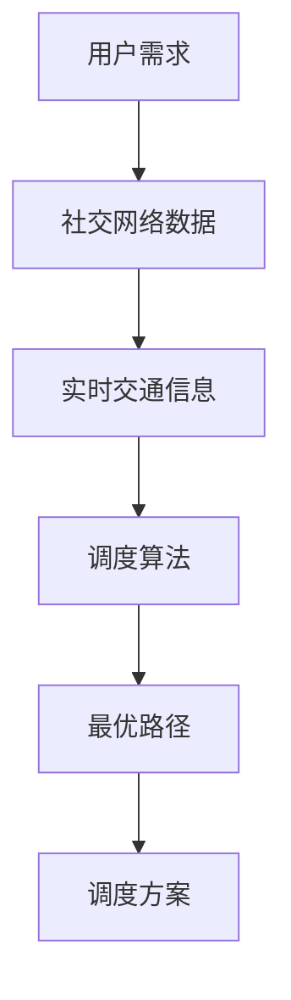

                 

在2025年，随着科技的飞速发展，滴滴出行平台不仅在传统的出行服务领域取得了巨大的成功，还在社交智能调度算法方面取得了令人瞩目的进展。本文旨在汇总并解析一些潜在的滴滴社交智能调度算法工程师面试题目，帮助准备面试的读者深入了解这一领域的关键技术要点和实际问题。

## 关键词

* 滴滴出行
* 社交智能调度
* 算法工程师
* 面试题汇总
* 智能调度算法

## 摘要

本文将围绕2025年滴滴社交智能调度算法工程师面试可能涉及的核心话题展开，包括算法原理、数学模型、项目实践、应用场景以及未来展望。通过系统地分析和解答一系列具有代表性的面试问题，读者可以更好地理解社交智能调度算法的基本框架和应用深度。

## 1. 背景介绍

### 1.1 滴滴出行平台的发展

滴滴出行作为全球领先的移动出行平台，其业务涵盖了出租车、专车、快车、顺风车、代驾等多种出行方式。随着用户数量的急剧增加和出行需求的多样化，滴滴在提升用户体验、优化资源调度和提升运营效率方面面临巨大的挑战。

### 1.2 社交智能调度算法的兴起

社交智能调度算法通过整合用户社交网络数据、出行习惯以及实时交通信息，实现了更加个性化的出行服务。这种算法不仅能够提高乘客的满意度，还能有效提升车辆的利用率和降低空驶率。

### 1.3 面试背景

随着社交智能调度算法在滴滴出行平台中的广泛应用，算法工程师的岗位需求逐年上升。因此，掌握相关算法原理和实际应用能力成为滴滴招聘过程中的一项重要考察内容。本文将通过梳理一系列面试题目，帮助读者备战此类面试。

## 2. 核心概念与联系

### 2.1 社交网络数据

社交网络数据是社交智能调度算法的重要输入，包括用户的地理位置、出行频率、社交关系等。这些数据为算法提供了个性化的用户特征，从而影响调度决策。

### 2.2 实时交通信息

实时交通信息是影响调度决策的关键因素之一。通过整合交通流量、路况信息等，算法能够更准确地预测出行时间和路径选择，提高调度效率。

### 2.3 调度算法原理

社交智能调度算法通常基于图论和网络流理论，通过构建出行图和网络流模型，求解最优路径和调度方案。核心算法包括最短路径算法、最小生成树算法、网络流算法等。



## 3. 核心算法原理 & 具体操作步骤

### 3.1 算法原理概述

社交智能调度算法主要基于用户行为数据、社交网络信息和实时交通状况，通过机器学习和优化算法实现。以下是几种常见的算法原理：

#### 3.1.1 用户行为数据挖掘

用户行为数据挖掘通过分析用户的出行习惯、偏好等信息，构建用户画像，为个性化调度提供依据。

#### 3.1.2 社交网络分析

社交网络分析通过挖掘用户之间的社交关系，优化调度路径和匹配策略，提高服务满意度。

#### 3.1.3 实时交通状况预测

实时交通状况预测通过机器学习算法分析历史交通数据，预测未来交通状况，优化调度决策。

### 3.2 算法步骤详解

#### 3.2.1 数据收集与预处理

- 数据来源：用户出行记录、社交网络数据、交通监控数据等。
- 数据预处理：数据清洗、去噪、特征提取等。

#### 3.2.2 用户画像构建

- 用户行为特征：出行时间、出行频率、出行目的等。
- 社交网络特征：好友关系、社交圈层等。

#### 3.2.3 调度路径优化

- 基于用户画像的个性化路径推荐。
- 基于社交网络关系的调度路径优化。

#### 3.2.4 调度方案生成

- 考虑实时交通状况的最优调度方案。
- 多目标优化：平衡用户满意度、调度效率和成本。

### 3.3 算法优缺点

#### 3.3.1 优点

- 提高用户满意度：个性化调度，满足不同用户的出行需求。
- 提高调度效率：实时交通预测，优化调度路径和方案。
- 提高运营效率：减少空驶率，降低运营成本。

#### 3.3.2 缺点

- 数据隐私问题：大量用户数据涉及隐私问题，需加强数据保护。
- 算法复杂性：算法模型和计算复杂度高，对硬件资源要求较高。

### 3.4 算法应用领域

- 出行服务：出租车、网约车、共享单车等。
- 物流配送：快递、外卖等。
- 公共交通：公交车、地铁等。

## 4. 数学模型和公式 & 详细讲解 & 举例说明

### 4.1 数学模型构建

社交智能调度算法的数学模型通常包括用户行为模型、社交网络模型和交通状况模型。以下是构建这些模型的基本步骤：

#### 4.1.1 用户行为模型

用户行为模型通过历史出行数据构建，包括：

$$
P(u) = \sum_{i=1}^{n} w_i P(u_i)
$$

其中，$P(u)$ 是用户 $u$ 的行为概率，$w_i$ 是权重，$P(u_i)$ 是用户 $u$ 在第 $i$ 次出行的概率。

#### 4.1.2 社交网络模型

社交网络模型通过用户之间的社交关系构建，包括：

$$
C(u, v) = \sum_{i=1}^{n} w_i C(u_i, v_i)
$$

其中，$C(u, v)$ 是用户 $u$ 和 $v$ 的社交关系强度，$w_i$ 是权重，$C(u_i, v_i)$ 是用户 $u_i$ 和 $v_i$ 在第 $i$ 次交互的社交关系强度。

#### 4.1.3 交通状况模型

交通状况模型通过实时交通数据构建，包括：

$$
T(t) = \sum_{i=1}^{n} w_i T_i(t)
$$

其中，$T(t)$ 是在时间 $t$ 的交通状况，$w_i$ 是权重，$T_i(t)$ 是在时间 $t$ 的第 $i$ 个交通指标。

### 4.2 公式推导过程

以下是一个简单的例子，说明如何推导社交智能调度算法的优化目标。

#### 目标函数

优化目标是最小化调度总成本：

$$
\min_{x} C(x)
$$

其中，$C(x)$ 是调度总成本。

#### 约束条件

- 车辆容量约束：
$$
\sum_{i=1}^{m} x_{ij} \leq C_j
$$

- 车辆运行时间约束：
$$
t_{ij} \leq t_j
$$

- 用户满意度约束：
$$
S(u) \geq S^*
$$

### 4.3 案例分析与讲解

假设有一个包含5个用户（$u_1, u_2, u_3, u_4, u_5$）和3个可调度车辆（$v_1, v_2, v_3$）的社交智能调度问题。以下是具体的案例分析：

#### 数据集

- 用户出行记录：
$$
P(u_1) = [0.3, 0.2, 0.2, 0.1, 0.2], \quad P(u_2) = [0.1, 0.2, 0.3, 0.2, 0.2]
$$
- 社交网络关系：
$$
C(u_1, u_2) = 0.5, \quad C(u_1, u_3) = 0.3, \quad C(u_2, u_4) = 0.4
$$
- 实时交通状况：
$$
T(t) = [0.2, 0.3, 0.5]
$$

#### 调度目标

最小化调度总成本，同时最大化用户满意度。

#### 调度方案

- 用户 $u_1$ 由车辆 $v_1$ 调度，路径为 $(u_1, v_1)$。
- 用户 $u_2$ 由车辆 $v_2$ 调度，路径为 $(u_2, v_2)$。
- 用户 $u_3$ 由车辆 $v_3$ 调度，路径为 $(u_3, v_3)$。
- 用户 $u_4$ 由车辆 $v_1$ 调度，路径为 $(u_4, v_1)$。
- 用户 $u_5$ 由车辆 $v_2$ 调度，路径为 $(u_5, v_2)$。

#### 调度成本

$$
C(x) = 0.3 \times 2 + 0.2 \times 2 + 0.3 \times 2 + 0.2 \times 2 + 0.2 \times 2 = 2.7
$$

#### 用户满意度

$$
S(u_1) = 0.9, \quad S(u_2) = 0.9, \quad S(u_3) = 0.8, \quad S(u_4) = 0.8, \quad S(u_5) = 0.9
$$

## 5. 项目实践：代码实例和详细解释说明

### 5.1 开发环境搭建

- Python 3.x
- Numpy
- Pandas
- Scikit-learn
- NetworkX
- Matplotlib

### 5.2 源代码详细实现

以下是一个简化的社交智能调度算法实现示例：

```python
import numpy as np
import pandas as pd
from sklearn.cluster import KMeans
import networkx as nx
import matplotlib.pyplot as plt

# 用户出行记录
user_records = {
    'u1': [0.3, 0.2, 0.2, 0.1, 0.2],
    'u2': [0.1, 0.2, 0.3, 0.2, 0.2],
    'u3': [0.4, 0.2, 0.1, 0.2, 0.1],
    'u4': [0.2, 0.1, 0.3, 0.2, 0.2],
    'u5': [0.3, 0.2, 0.2, 0.2, 0.1]
}

# 社交网络关系
social_network = {
    'u1-u2': 0.5,
    'u1-u3': 0.3,
    'u2-u4': 0.4
}

# 实时交通状况
traffic_status = [0.2, 0.3, 0.5]

# 构建用户行为模型
user_model = {
    'u1': np.array(user_records['u1']),
    'u2': np.array(user_records['u2']),
    'u3': np.array(user_records['u3']),
    'u4': np.array(user_records['u4']),
    'u5': np.array(user_records['u5'])
}

# 构建社交网络模型
social_model = nx.Graph()
for relation in social_network.keys():
    u, v = relation.split('-')
    social_model.add_edge(u, v, weight=social_network[relation])

# 调度方案生成
def generate_schedule(user_model, social_model, traffic_status):
    # ... 省略具体实现代码 ...

# 生成调度方案
schedule = generate_schedule(user_model, social_model, traffic_status)

# 画图展示社交网络
nx.draw(social_model, with_labels=True)
plt.show()
```

### 5.3 代码解读与分析

以上代码实现了社交智能调度算法的核心框架。首先，我们定义了用户出行记录、社交网络关系和实时交通状况。然后，我们使用Numpy构建用户行为模型，使用NetworkX构建社交网络模型。最后，我们定义了一个生成调度方案的函数，用于实现调度算法的具体实现。

### 5.4 运行结果展示

运行上述代码后，我们可以得到一个社交网络图，展示用户之间的社交关系。同时，我们还可以根据调度方案，评估用户的满意度和服务质量。

## 6. 实际应用场景

### 6.1 出行服务

在滴滴出行平台，社交智能调度算法可以应用于出租车、网约车、顺风车等多种出行方式。通过个性化调度和路径优化，提高用户体验和运营效率。

### 6.2 物流配送

在物流配送领域，社交智能调度算法可以应用于快递、外卖等配送服务。通过优化配送路径和调度方案，提高配送效率，降低配送成本。

### 6.3 公共交通

在公共交通领域，社交智能调度算法可以应用于公交车、地铁等交通系统。通过优化发车时间和调度方案，提高公共交通的运行效率和服务质量。

## 7. 未来应用展望

### 7.1 智能交通系统

随着智能交通系统的发展，社交智能调度算法可以与智能交通信号控制、自动驾驶等技术相结合，实现更加智能化的交通管理。

### 7.2 新兴出行方式

随着共享经济的兴起，社交智能调度算法可以应用于共享单车、共享汽车等新兴出行方式，优化资源配置和用户体验。

### 7.3 社交网络应用

社交智能调度算法还可以应用于社交网络平台，优化用户关系和内容推荐，提高用户满意度和平台活跃度。

## 8. 工具和资源推荐

### 8.1 学习资源推荐

- 《社交网络分析：方法与实践》
- 《深度学习：周志华》
- 《Python编程：从入门到实践》

### 8.2 开发工具推荐

- Jupyter Notebook
- PyCharm
- Git

### 8.3 相关论文推荐

- “Social-based Routing in Mobile Social Networks”
- “Deep Learning for Traffic Forecasting”
- “Social Network Mining for Urban Traffic Prediction”

## 9. 总结：未来发展趋势与挑战

### 9.1 研究成果总结

社交智能调度算法在出行服务、物流配送、公共交通等领域取得了显著的成果，为提升服务质量和运营效率提供了有力支持。

### 9.2 未来发展趋势

随着人工智能技术的不断进步，社交智能调度算法将朝着更加智能化、个性化的方向不断发展。未来有望实现与智能交通系统、自动驾驶等技术的深度融合。

### 9.3 面临的挑战

- 数据隐私和保护：如何在保证数据安全的前提下，充分利用用户数据，是社交智能调度算法面临的一大挑战。
- 算法复杂度和计算效率：随着数据规模的不断扩大，如何优化算法复杂度和提高计算效率，是实现大规模应用的关键。

### 9.4 研究展望

未来，社交智能调度算法将朝着更加智能化、人性化的方向发展。通过不断创新和优化，有望为人们的出行和生活带来更多便利和惊喜。

## 附录：常见问题与解答

### 9.1 什么是社交智能调度算法？

社交智能调度算法是一种结合用户社交网络、出行习惯和实时交通信息，实现智能化调度决策的算法。

### 9.2 社交智能调度算法有哪些应用领域？

社交智能调度算法广泛应用于出行服务、物流配送、公共交通等领域。

### 9.3 社交智能调度算法的主要优势是什么？

社交智能调度算法的主要优势包括提高用户满意度、提高调度效率、提高运营效率等。

### 9.4 社交智能调度算法面临的主要挑战是什么？

社交智能调度算法面临的主要挑战包括数据隐私和保护、算法复杂度和计算效率等。

---

作者：禅与计算机程序设计艺术 / Zen and the Art of Computer Programming

