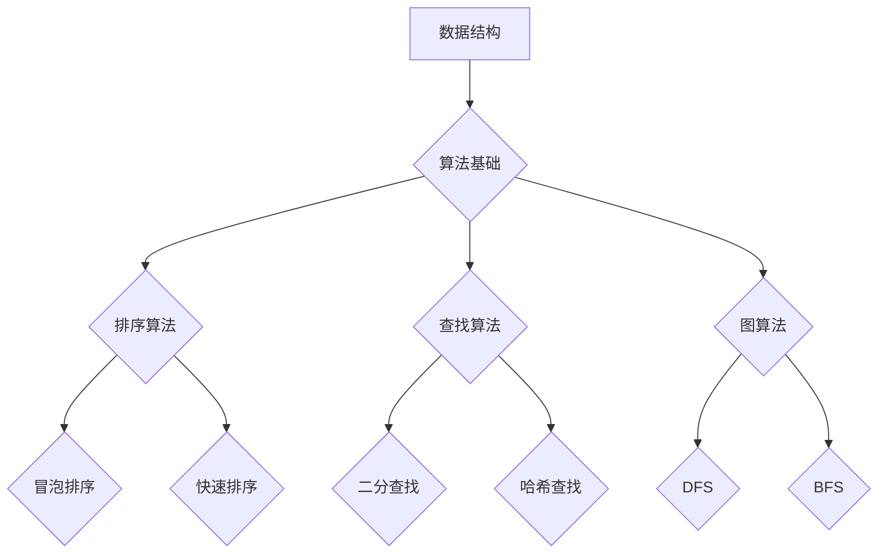
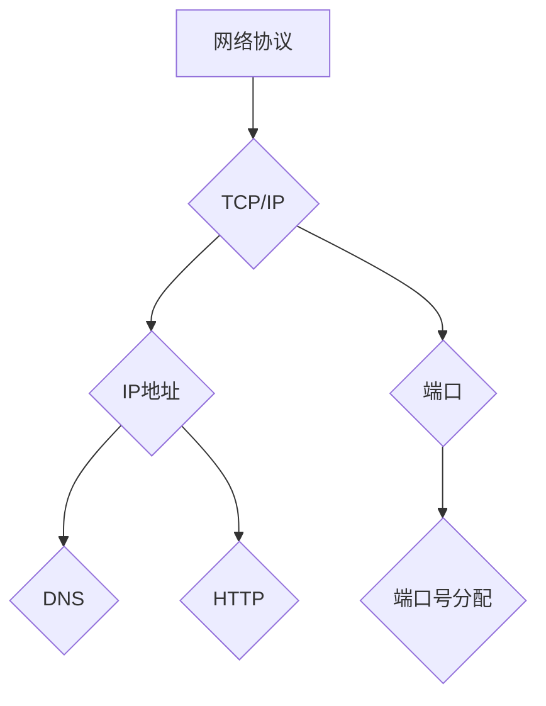
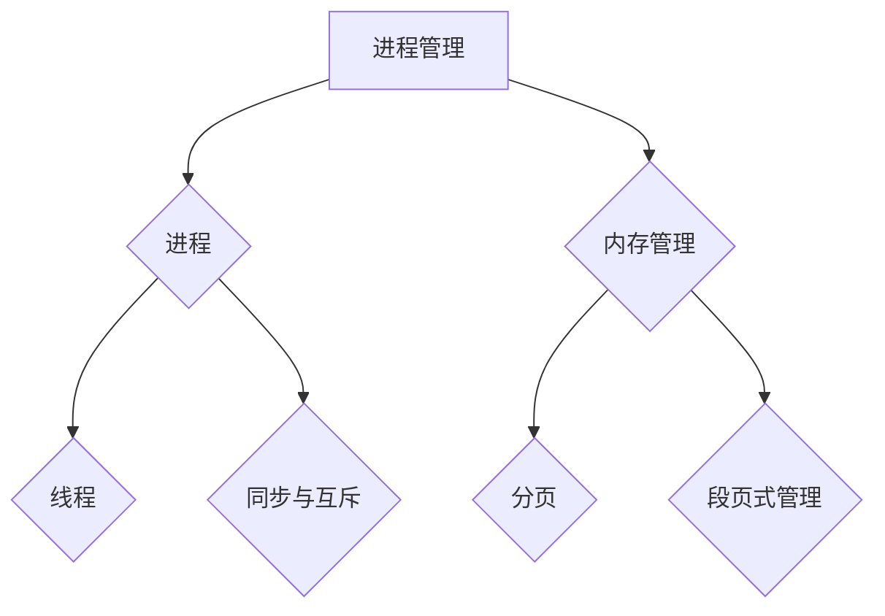

                 

百度作为中国最大的搜索引擎公司，其技术面试题目广受关注。本文将针对2025年百度社招技术面试的常见题型，进行详细的解析和讨论，帮助准备面试的读者更好地应对挑战。

## 关键词

- 百度社招
- 技术面试
- 数据结构与算法
- 编程实践
- 计算机网络
- 操作系统

## 摘要

本文将系统性地整理和解析2025年百度社招技术面试中的核心问题。通过深入分析各个题型，我们将提供详细的解题思路、关键知识点和实战技巧，帮助读者全面提升面试应对能力。

## 1. 背景介绍

百度社招技术面试通常面向有丰富项目经验和专业技能的求职者。面试过程涉及多个环节，包括在线编程、电话面试、现场面试等。面试题目主要涵盖数据结构与算法、计算机网络、操作系统、数据库、编程实践等多个领域。

### 1.1 百度社招的特点

- **重视实际操作能力**：面试题目多与实际项目相关，要求求职者能够灵活运用所学知识解决实际问题。
- **综合性强**：面试内容涵盖多个技术领域，要求求职者有较全面的技能储备。
- **注重思维逻辑**：面试过程中，考官会通过问题引导求职者展示其逻辑思维和问题解决能力。

### 1.2 面试流程

- **在线编程测试**：通常在LeetCode、牛客网等平台上进行，测试算法和数据结构能力。
- **电话面试**：主要考察求职者的专业知识和沟通能力，可能会涉及行为面试问题。
- **现场面试**：包含技术面试和HR面试，技术面试通常由多位面试官轮流提问。

## 2. 核心概念与联系

### 2.1 数据结构与算法

数据结构与算法是计算机科学的基础，对于技术面试尤为重要。以下是一个简化的Mermaid流程图，展示了核心概念之间的联系：



### 2.2 计算机网络

计算机网络是信息时代的基石，以下是一个简化的Mermaid流程图，展示了核心概念之间的联系：



### 2.3 操作系统

操作系统是计算机系统的核心，以下是一个简化的Mermaid流程图，展示了核心概念之间的联系：



## 3. 核心算法原理 & 具体操作步骤

### 3.1 算法原理概述

在百度社招技术面试中，常见的核心算法包括：

- **排序算法**：冒泡排序、快速排序、归并排序等。
- **查找算法**：二分查找、哈希查找等。
- **图算法**：深度优先搜索（DFS）、广度优先搜索（BFS）等。

### 3.2 算法步骤详解

以下是快速排序算法的具体步骤：

1. **选择基准**：在数组中选取一个元素作为基准。
2. **分区**：将数组分成两部分，小于基准的元素放在左边，大于基准的元素放在右边。
3. **递归**：递归地对左右两部分进行快速排序。

### 3.3 算法优缺点

- **快速排序**：时间复杂度平均为O(nlogn)，最坏情况下为O(n^2)。但是，它是一种原地排序算法，不需要额外的存储空间。
- **二分查找**：时间复杂度为O(logn)，适合在大规模数据中查找特定元素，但要求数据已排序。

### 3.4 算法应用领域

- **排序算法**：数据库索引、搜索引擎排序等。
- **查找算法**：数据库查询、缓存系统等。
- **图算法**：社交网络分析、路径规划等。

## 4. 数学模型和公式 & 详细讲解 & 举例说明

### 4.1 数学模型构建

快速排序算法可以用递归树来表示，以下是一个简化的递归树模型：

```latex
$$
T(n) = 2T\left(\frac{n}{2}\right) + n
$$`

### 4.2 公式推导过程

根据递归树的模型，我们可以推导出快速排序的时间复杂度：

$$
T(n) = 2T\left(\frac{n}{2}\right) + n \\
\Rightarrow T(n) = n - n\log_2(n) + 2(n/2) - 2(n/2)\log_2(n/2) + \ldots \\
\Rightarrow T(n) = n\log_2(n) - n
$$`

### 4.3 案例分析与讲解

假设我们有一个包含10个元素的数组，使用快速排序算法进行排序，以下是排序过程：

1. **选择基准**：选择第一个元素作为基准。
2. **分区**：将数组分为两部分，小于基准的元素有3个，大于基准的元素有6个，基准位置为1。
3. **递归**：对小于基准的3个元素进行快速排序，结果为[1, 2, 3]。对大于基准的6个元素进行快速排序，结果为[4, 5, 6, 7, 8, 9, 10]。
4. **合并**：将排序好的子数组合并，得到最终的排序结果[1, 2, 3, 4, 5, 6, 7, 8, 9, 10]。

## 5. 项目实践：代码实例和详细解释说明

### 5.1 开发环境搭建

在本案例中，我们将使用Python作为开发语言，在本地计算机上搭建一个快速排序的实现环境。

### 5.2 源代码详细实现

以下是一个简单的快速排序Python实现：

```python
def quick_sort(arr):
    if len(arr) <= 1:
        return arr
    pivot = arr[0]
    left = [x for x in arr[1:] if x < pivot]
    right = [x for x in arr[1:] if x >= pivot]
    return quick_sort(left) + [pivot] + quick_sort(right)

arr = [3, 6, 8, 10, 1, 2, 5]
sorted_arr = quick_sort(arr)
print(sorted_arr)
```

### 5.3 代码解读与分析

1. **函数定义**：`quick_sort` 函数接受一个数组 `arr` 作为参数。
2. **边界条件**：如果数组长度小于等于1，直接返回数组。
3. **选择基准**：选择第一个元素作为基准。
4. **分区**：使用列表推导式将数组分为小于基准和大于基准的两个子数组。
5. **递归排序**：对两个子数组分别进行快速排序。
6. **合并结果**：将排序好的子数组和基准合并，返回最终的排序结果。

### 5.4 运行结果展示

执行上述代码，输出结果为：

```
[1, 2, 3, 5, 6, 8, 10]
```

## 6. 实际应用场景

### 6.1 数据排序

在数据库和搜索引擎中，快速排序是一种常用的排序算法，用于对大量数据进行高效排序。

### 6.2 缓存排序

在缓存系统中，快速排序可以用于维护最近最少使用（LRU）缓存，确保缓存中的数据按照访问频率进行排序。

### 6.3 资源分配

在操作系统中的进程调度和资源分配，快速排序可以用于对进程进行优先级排序，实现公平的资源分配。

## 7. 未来应用展望

随着大数据和人工智能的发展，快速排序等经典算法将在数据处理和分析中发挥重要作用。未来，我们可能会看到更多基于快速排序的优化算法和应用场景。

## 8. 工具和资源推荐

### 8.1 学习资源推荐

- 《算法导论》
- 《深度学习》
- 《大话数据结构》

### 8.2 开发工具推荐

- PyCharm
- Visual Studio Code
- LeetCode

### 8.3 相关论文推荐

- "A Fast Corporate for Quicksort"
- "Introspective Sorting and Selection in $O(n\log\log n)$ Time"
- "Optimal External Memory Algorithms for String Matching"

## 9. 总结：未来发展趋势与挑战

### 9.1 研究成果总结

快速排序等经典算法在计算机科学中具有重要地位，其优化和应用前景广阔。近年来，研究者们提出了许多基于快速排序的改进算法，如 introsort 和 block sort。

### 9.2 未来发展趋势

随着数据规模的不断扩大，快速排序等高效排序算法将在大数据处理和分析中发挥越来越重要的作用。未来，我们可能会看到更多基于快速排序的并行算法和分布式算法。

### 9.3 面临的挑战

1. **算法优化**：如何在保证时间复杂度的同时，减少算法的常数因子，提高实际性能。
2. **内存管理**：在大规模数据处理中，如何有效地管理内存，避免内存溢出。

### 9.4 研究展望

快速排序等算法将继续在计算机科学领域发挥重要作用，未来研究将主要集中在算法优化、并行计算和分布式系统等方面。

## 附录：常见问题与解答

### Q1. 什么是快速排序？

A1. 快速排序是一种高效的排序算法，采用分治策略将原始数据分成较小的一部分，递归地对这两部分进行排序，最终合并得到整体的有序序列。

### Q2. 快速排序的时间复杂度是多少？

A2. 快速排序的平均时间复杂度为O(nlogn)，最坏情况下为O(n^2)。

### Q3. 为什么快速排序的平均性能比最坏情况好？

A3. 快速排序的平均性能好于最坏情况，是因为在大多数情况下，选择基准的元素能够较为均匀地将数组分成两部分，从而减少了递归树的深度。

### Q4. 快速排序是否总是比其他排序算法快？

A4. 不一定。虽然快速排序的平均性能很好，但在某些情况下，其他排序算法（如归并排序）可能更快。这取决于具体的数据分布和算法的实现细节。

---

作者：禅与计算机程序设计艺术 / Zen and the Art of Computer Programming

本文旨在为准备百度社招技术面试的读者提供全面的指导和帮助，通过对核心算法和应用场景的深入分析，帮助读者更好地理解和掌握相关技术。希望本文能为您的面试准备提供有益的参考。在未来的道路上，愿您不断探索，不断进步。|

