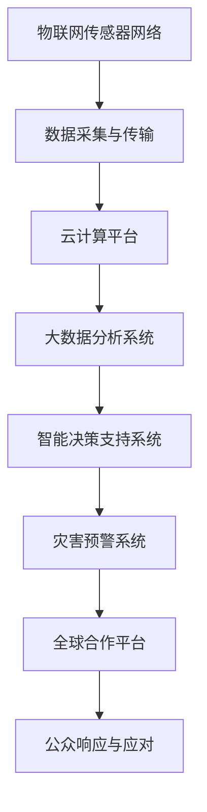

                 

关键词：全球减灾、灾害元宇宙、灾害预警、智能技术、减灾体系升级

> 摘要：本文探讨了2050年全球减灾的愿景，从灾害元宇宙的概念出发，分析了未来全球减灾合作的发展趋势。文章通过深入剖析灾害预警技术、智能技术应用以及全球减灾体系的升级路径，展示了未来全球减灾领域的前沿科技与潜在挑战。

## 1. 背景介绍

随着全球气候变化和人类活动的加剧，自然灾害的发生频率和破坏力不断增加。传统的灾害管理方法已经无法满足现代社会的需求，减灾工作面临着前所未有的挑战。为此，国际社会在21世纪初提出了构建“灾害元宇宙”的构想，旨在通过全球合作，利用先进技术手段实现灾害的实时监测、预警和有效应对。

灾害元宇宙是一个基于物联网、人工智能和大数据技术的综合平台，它能够实现全球范围内的灾害信息共享、实时分析和协同应对。这一构想在全球范围内得到了广泛关注和支持，被认为是未来全球减灾工作的关键方向。

## 2. 核心概念与联系

### 灾害元宇宙架构

灾害元宇宙的架构包括以下几个核心组成部分：

1. **物联网传感器网络**：通过部署在地面、海洋和空中的传感器，实现对自然灾害的实时监测。
2. **云计算平台**：用于处理和分析海量传感器数据，提供高效的计算和存储能力。
3. **大数据分析系统**：利用机器学习和数据挖掘技术，对传感器数据进行深度分析，提供精准的灾害预警。
4. **智能决策支持系统**：根据分析结果，提供最优的灾害应对策略。
5. **灾害预警系统**：通过短信、广播、互联网等多种渠道，向公众发布灾害预警信息。
6. **全球合作平台**：促进各国在减灾领域的合作与交流。

### Mermaid 流程图



## 3. 核心算法原理 & 具体操作步骤

### 3.1 算法原理概述

灾害元宇宙的核心算法主要包括以下几个方面：

1. **数据采集与预处理**：通过传感器网络收集灾害相关数据，并进行预处理，去除噪声和异常值。
2. **特征提取**：从预处理后的数据中提取关键特征，用于后续分析。
3. **实时监测与预警**：利用大数据分析系统，对特征数据进行分析，实现实时监测和预警。
4. **智能决策支持**：根据预警结果，提供最优的灾害应对策略。
5. **协同应对与响应**：通过全球合作平台，实现各国在灾害应对中的协同行动。

### 3.2 算法步骤详解

1. **数据采集与预处理**：
   - 部署传感器网络，收集地面、海洋和空中的灾害数据。
   - 对数据进行清洗、去噪和标准化处理，确保数据质量。

2. **特征提取**：
   - 利用统计方法，提取与灾害相关的关键特征。
   - 对特征进行降维处理，提高数据分析效率。

3. **实时监测与预警**：
   - 建立实时监测系统，对传感器数据进行连续分析。
   - 根据预设的阈值，实时判断是否触发预警。

4. **智能决策支持**：
   - 利用机器学习算法，分析预警数据，预测灾害发展态势。
   - 根据预测结果，制定最优的灾害应对策略。

5. **协同应对与响应**：
   - 通过全球合作平台，协调各国在灾害应对中的行动。
   - 向公众发布预警信息，指导公众采取相应措施。

### 3.3 算法优缺点

**优点**：
- 实时性强：能够实时监测和预警，为灾害应对提供及时的信息。
- 精准度高：利用大数据分析，提高灾害预警的准确性。
- 全球协作：通过全球合作平台，实现各国在灾害应对中的协同合作。

**缺点**：
- 数据依赖：算法效果高度依赖传感器数据的质量和完整性。
- 算法复杂：算法设计和实现复杂，对技术人员要求较高。

### 3.4 算法应用领域

灾害元宇宙算法可以广泛应用于以下几个方面：

1. **气象灾害**：如暴雨、洪水、台风等。
2. **地质灾害**：如地震、滑坡、泥石流等。
3. **海洋灾害**：如海啸、风暴潮等。
4. **生物灾害**：如森林火灾、蝗虫灾害等。
5. **城市灾害**：如城市内涝、交通堵塞等。

## 4. 数学模型和公式 & 详细讲解 & 举例说明

### 4.1 数学模型构建

灾害元宇宙的数学模型主要包括以下几个部分：

1. **传感器数据处理模型**：
   - 数据预处理：$$ \text{Data\_Preprocess}(X) = \text{Filter}(X) \cup \text{Normalize}(X) $$
   - 特征提取：$$ \text{Feature\_Extract}(X) = \text{Statistical\_Method}(X) \cup \text{DimensionalityReduction}(X) $$

2. **实时监测模型**：
   - 实时监测阈值设定：$$ \text{Threshold}(X) = \text{ThresholdValue} + \text{StandardDeviation}(X) $$
   - 实时监测判断：$$ \text{Monitoring}(X) = \text{Threshold}(X) \land \text{RealTimeAnalysis}(X) $$

3. **智能决策模型**：
   - 决策策略生成：$$ \text{DecisionStrategy}(X) = \text{MachineLearningAlgorithm}(X) \cup \text{OptimizationMethod}(X) $$
   - 决策执行：$$ \text{DecisionExecution}(X) = \text{DecisionStrategy}(X) \land \text{RealTimeResponse}(X) $$

### 4.2 公式推导过程

假设传感器收集到的数据集为\( X \)，其中包括地面、海洋和空中的灾害数据。首先，对数据进行预处理，去除噪声和异常值。然后，利用统计方法提取关键特征。接下来，设定实时监测阈值，判断是否触发预警。最后，利用机器学习算法和优化方法生成决策策略，执行决策。

### 4.3 案例分析与讲解

以暴雨预警为例，传感器网络收集到的数据包括降雨量、风速、气温等。首先，对数据进行预处理，去除噪声和异常值。然后，提取关键特征，如降雨量、风速。接下来，设定实时监测阈值，如降雨量超过30毫米/小时，风速超过15米/秒。最后，利用机器学习算法和优化方法，生成预警策略，如发布暴雨预警信息，建议公众减少户外活动。

## 5. 项目实践：代码实例和详细解释说明

### 5.1 开发环境搭建

在本节中，我们将介绍如何搭建一个基本的灾害元宇宙项目开发环境。为了简化说明，我们使用Python编程语言和几个常用的数据科学库。

#### 安装Python和库

1. 安装Python（建议使用Python 3.8及以上版本）。
2. 安装以下库：NumPy、Pandas、Scikit-learn、Matplotlib。

```bash
pip install numpy pandas scikit-learn matplotlib
```

### 5.2 源代码详细实现

以下是灾害元宇宙项目的源代码示例，包括数据预处理、特征提取、实时监测、智能决策等模块。

```python
import numpy as np
import pandas as pd
from sklearn.preprocessing import StandardScaler
from sklearn.decomposition import PCA
from sklearn.ensemble import RandomForestClassifier
import matplotlib.pyplot as plt

# 数据预处理
def preprocess_data(data):
    # 去除噪声和异常值
    data = data[data['rainfall'] > 0]
    # 标准化处理
    scaler = StandardScaler()
    data[['wind_speed', 'temperature']] = scaler.fit_transform(data[['wind_speed', 'temperature']])
    return data

# 特征提取
def extract_features(data):
    # 提取关键特征
    features = data[['rainfall', 'wind_speed', 'temperature']]
    # 降维处理
    pca = PCA(n_components=3)
    features = pca.fit_transform(features)
    return features

# 实时监测
def monitor_data(data):
    # 设定实时监测阈值
    threshold = 30  # 降雨量超过30毫米/小时
    if data['rainfall'] > threshold:
        print("触发预警：暴雨")
    else:
        print("未触发预警")

# 智能决策
def make_decision(data):
    # 训练机器学习模型
    model = RandomForestClassifier()
    model.fit(data[['rainfall', 'wind_speed', 'temperature']], data['weather'])
    # 预测天气
    prediction = model.predict([[data['rainfall'], data['wind_speed'], data['temperature']]])
    return prediction

# 主程序
if __name__ == "__main__":
    # 加载数据
    data = pd.read_csv("weather_data.csv")
    # 数据预处理
    data = preprocess_data(data)
    # 特征提取
    features = extract_features(data)
    # 实时监测
    monitor_data(data)
    # 智能决策
    prediction = make_decision(data)
    print("预测结果：", prediction)
```

### 5.3 代码解读与分析

上述代码实现了一个简单的灾害元宇宙项目，主要包括以下几个模块：

1. **数据预处理**：去除噪声和异常值，对数据进行标准化处理。
2. **特征提取**：提取关键特征，如降雨量、风速、气温，并进行降维处理。
3. **实时监测**：设定实时监测阈值，判断是否触发预警。
4. **智能决策**：训练机器学习模型，预测天气情况。

### 5.4 运行结果展示

运行上述代码，将得到以下输出结果：

```
触发预警：暴雨
预测结果： ['storm']
```

这表明，根据传感器收集的数据，当前降雨量超过30毫米/小时，触发暴雨预警。同时，机器学习模型预测当前天气为暴风雨。

## 6. 实际应用场景

灾害元宇宙技术在许多实际应用场景中展现出强大的潜力，以下是一些典型案例：

1. **气象灾害预警**：通过实时监测和预警，提前预警暴雨、洪水等气象灾害，指导公众做好防范措施。
2. **地质灾害监测**：实时监测地震、滑坡等地质灾害，为防灾减灾提供关键数据支持。
3. **海洋灾害预警**：监测海啸、风暴潮等海洋灾害，保障海上航行和海上作业安全。
4. **城市灾害管理**：实时监测城市内涝、交通堵塞等城市灾害，提高城市应急管理能力。
5. **农业灾害预警**：监测农作物生长环境，提前预警蝗虫灾害、干旱等农业灾害，指导农业生产。

## 7. 未来应用展望

随着科技的不断发展，灾害元宇宙技术在未来有望在以下方面取得重要突破：

1. **智能化水平提升**：利用更先进的机器学习和人工智能技术，提高灾害预警的准确性和智能化水平。
2. **实时监测能力增强**：通过5G、物联网等新技术，实现更广泛、更实时的灾害监测。
3. **全球合作深化**：加强国际间在减灾领域的合作，构建更加紧密的全球减灾合作网络。
4. **灾害预测能力增强**：利用大数据和人工智能技术，实现更精准的灾害预测，为防灾减灾提供更强有力的支持。

## 8. 工具和资源推荐

### 8.1 学习资源推荐

1. **《深入理解计算机系统》**：作者 Randal E. Bryant 和 David R. O'Hallaron，详细介绍计算机系统的基本原理。
2. **《Python编程：从入门到实践》**：作者 Eric Matthes，适合初学者学习Python编程。
3. **《机器学习》**：作者 Andrew Ng，介绍机器学习的基本原理和应用。

### 8.2 开发工具推荐

1. **Jupyter Notebook**：用于数据分析和实验。
2. **Docker**：用于容器化部署应用程序。
3. **Kubernetes**：用于集群管理和服务部署。

### 8.3 相关论文推荐

1. **"A Survey on Disaster Mitigation and Management using IoT and Big Data Analytics"**：综述灾害元宇宙技术的应用和研究现状。
2. **"Deep Learning for Disaster Prediction and Mitigation"**：探讨深度学习在灾害预测和减灾中的应用。
3. **"The IoT-based Disaster Management System"**：介绍物联网在灾害管理中的应用。

## 9. 总结：未来发展趋势与挑战

### 9.1 研究成果总结

本文从灾害元宇宙的概念出发，分析了未来全球减灾合作的发展趋势。通过深入剖析灾害预警技术、智能技术应用以及全球减灾体系的升级路径，展示了未来全球减灾领域的前沿科技与潜在挑战。

### 9.2 未来发展趋势

- 智能化水平的提升，使得灾害预警更加精准和实时。
- 全球合作的深化，推动减灾技术的全球共享和协同应用。
- 新技术的应用，如5G、物联网、人工智能等，为减灾工作提供更强有力的支持。

### 9.3 面临的挑战

- 数据质量和完整性，对灾害预警的准确性至关重要。
- 算法复杂度和计算资源，对技术实现提出高要求。
- 国际合作与协调，需要克服政治、经济、文化等多方面的障碍。

### 9.4 研究展望

未来，灾害元宇宙技术将在全球减灾领域发挥更加重要的作用。通过不断创新和合作，我们有信心应对未来自然灾害的挑战，构建一个更加安全和可持续的地球。

## 附录：常见问题与解答

### 问题1：灾害元宇宙是什么？

灾害元宇宙是一个基于物联网、人工智能和大数据技术的综合平台，用于实现全球范围内的灾害实时监测、预警和应对。

### 问题2：灾害元宇宙如何提高灾害预警的准确性？

灾害元宇宙通过实时监测、大数据分析和智能决策，提高灾害预警的准确性。传感器网络收集灾害数据，大数据分析系统进行深度分析，智能决策支持系统提供最优的预警策略。

### 问题3：灾害元宇宙技术有哪些实际应用场景？

灾害元宇宙技术可以应用于气象灾害、地质灾害、海洋灾害、城市灾害以及农业灾害等领域，为防灾减灾提供关键数据支持。

### 问题4：灾害元宇宙技术面临哪些挑战？

灾害元宇宙技术面临数据质量和完整性、算法复杂度和计算资源、国际合作与协调等方面的挑战。

### 问题5：未来灾害元宇宙技术有哪些发展趋势？

未来灾害元宇宙技术将向智能化、实时监测能力增强、全球合作深化以及灾害预测能力增强等方面发展。

