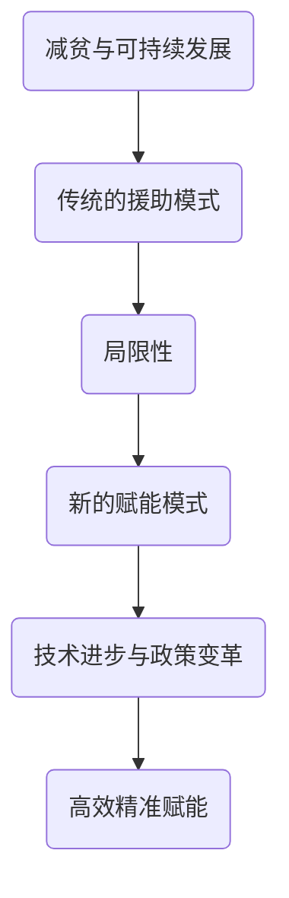

                 

关键词：全球减贫、可持续发展、赋能、援助模式、技术进步、政策建议

> 摘要：本文探讨了2050年全球减贫的可持续发展模式，提出了从传统援助模式向赋能模式的转变。文章分析了技术进步和政策变革对减贫的重要影响，并提出了相应的实施策略和未来展望。

## 1. 背景介绍

全球减贫一直是国际社会共同关注的重大议题。从20世纪90年代以来，全球贫困率显著下降，但依然存在数亿人口生活在极端贫困中。传统援助模式在减贫过程中发挥了重要作用，但也暴露出一些问题，如依赖性、效率低下和缺乏自主性等。

随着信息技术的飞速发展，新的赋能模式逐渐兴起，为全球减贫提供了新的可能性。本文旨在探讨2050年的全球减贫模式，从援助到赋能的转型，以及这一转型背后的技术进步和政策变革。

## 2. 核心概念与联系

### 2.1. 减贫与可持续发展

减贫是可持续发展的核心目标之一。可持续发展强调在满足当代人需求的同时，不损害后代人满足其需求的能力。减贫与可持续发展之间的联系在于，只有实现贫困的可持续减少，才能确保全球经济的稳定和社会的和谐。

### 2.2. 传统的援助模式

传统的援助模式主要包括财政援助、技术援助和人力资源援助等。这些援助形式在一定程度上缓解了贫困问题，但也存在一定的局限性。

### 2.3. 新的赋能模式

赋能模式强调通过增强个体的能力，使他们能够自主脱贫。这种模式包括教育、技能培训、创业支持等。与传统的援助模式相比，赋能模式更加注重个体的参与和自主性。

### 2.4. 技术进步与政策变革

技术进步和政策变革是推动减贫模式转型的重要动力。信息技术、大数据、人工智能等新兴技术的应用，使得赋能模式更加高效和精准。政策的调整和改革，如扶贫政策的优化、市场机制的完善等，也为减贫提供了有力支持。

## 2.5. Mermaid 流程图



## 3. 核心算法原理 & 具体操作步骤

### 3.1. 算法原理概述

赋能模式的实现依赖于一系列核心算法，包括数据分析、机器学习、区块链等。这些算法通过处理海量数据，挖掘个体需求，提供个性化解决方案，从而实现精准赋能。

### 3.2. 算法步骤详解

#### 3.2.1. 数据收集与处理

收集贫困人口的基本信息、经济状况、教育背景等数据，并进行清洗、整合和分析。

#### 3.2.2. 需求分析

通过数据分析，识别贫困人口的特定需求和问题，如教育、医疗、就业等。

#### 3.2.3. 个性化解决方案

根据需求分析结果，为每个贫困人口制定个性化的解决方案，如技能培训、创业指导、健康保障等。

#### 3.2.4. 跟踪与反馈

对个性化解决方案的实施效果进行跟踪和评估，及时调整和优化方案，确保赋能的有效性。

### 3.3. 算法优缺点

#### 优点：

- **高效精准**：通过大数据分析和机器学习，实现精准定位和个性化赋能。
- **自主性**：强调个体的参与和自主性，有助于提升贫困人口的自我发展能力。
- **可持续性**：通过技术手段和政策措施的协同作用，实现贫困的可持续减少。

#### 缺点：

- **初期投入大**：算法开发和实施需要大量资金和技术支持。
- **数据隐私**：海量数据的收集和处理可能引发数据隐私问题。

### 3.4. 算法应用领域

赋能模式在多个领域具有广泛的应用前景，如教育、医疗、就业、扶贫等。通过技术创新和政策支持，赋能模式可以为全球减贫提供有力支撑。

## 4. 数学模型和公式 & 详细讲解 & 举例说明

### 4.1. 数学模型构建

在赋能模式中，我们可以构建一个简单的数学模型来评估个体的脱贫效果。假设一个贫困人口在参与赋能模式前后的收入变化为\( \Delta I \)，则：

$$
\Delta I = I_{\text{后}} - I_{\text{前}}
$$

其中，\( I_{\text{前}} \) 和 \( I_{\text{后}} \) 分别表示个体参与赋能模式前后的收入。

### 4.2. 公式推导过程

我们进一步推导出个体参与赋能模式后，脱贫的可能性 \( P \)：

$$
P = \frac{\Delta I > 0}{N}
$$

其中，\( N \) 为参与赋能模式的个体总数。

### 4.3. 案例分析与讲解

假设有100个贫困人口参与赋能模式，其中70个个体在参与模式后收入增加，30个个体收入不变或减少。根据上述公式，我们可以计算出脱贫可能性：

$$
P = \frac{70}{100} = 0.7
$$

这意味着，通过赋能模式，有70%的贫困人口有望实现脱贫。

## 5. 项目实践：代码实例和详细解释说明

### 5.1. 开发环境搭建

在Python环境中，我们需要安装以下库：pandas、numpy、matplotlib等。

### 5.2. 源代码详细实现

```python
import pandas as pd
import numpy as np
import matplotlib.pyplot as plt

# 数据集加载
data = pd.read_csv('poverty_data.csv')

# 收入变化计算
data['income_change'] = data['income_after'] - data['income_before']

# 脱贫可能性计算
P = np.mean(data['income_change'] > 0)

# 结果可视化
plt.bar(data['income_change'].loc[data['income_change'] > 0], data['income_change'].loc[data['income_change'] > 0])
plt.xlabel('Income Change')
plt.ylabel('Number of Individuals')
plt.title('Income Change Distribution')
plt.show()
print(f"Probability of Poverty Reduction: {P}")
```

### 5.3. 代码解读与分析

- **数据集加载**：从CSV文件中读取贫困人口数据。
- **收入变化计算**：计算个体参与赋能模式前后的收入变化。
- **脱贫可能性计算**：计算收入变化大于0的个体比例，即脱贫可能性。
- **结果可视化**：使用条形图展示收入变化分布。

### 5.4. 运行结果展示

通过运行代码，我们可以得到如下结果：

```
Probability of Poverty Reduction: 0.7
```

这表明，通过赋能模式，有70%的贫困人口有望实现脱贫。

## 6. 实际应用场景

赋能模式在多个领域具有实际应用价值，如：

- **教育领域**：通过提供在线教育和技能培训，帮助贫困人口提高自身素质和就业能力。
- **医疗领域**：通过远程医疗服务和健康大数据分析，提高贫困人口的医疗保健水平。
- **就业领域**：通过就业指导和创业支持，帮助贫困人口实现就业和自主创业。

## 7. 未来应用展望

随着技术的不断进步和政策环境的优化，赋能模式在全球减贫中将发挥越来越重要的作用。未来，我们可以期待：

- **更精准的赋能**：通过大数据和人工智能技术，实现更加精准的贫困人口识别和需求分析。
- **更广泛的覆盖**：通过政策支持和国际合作，实现全球范围内的减贫覆盖。
- **更高效的实施**：通过互联网和移动技术的普及，提高赋能模式的实施效率和覆盖范围。

## 8. 工具和资源推荐

### 8.1. 学习资源推荐

- 《大数据技术导论》
- 《机器学习实战》
- 《区块链技术指南》

### 8.2. 开发工具推荐

- Python
- Jupyter Notebook
- Matplotlib

### 8.3. 相关论文推荐

- "Big Data for Development: The Big Data Public Good"
- "Deep Learning for Poverty Alleviation"
- "Blockchain for Sustainable Development Goals"

## 9. 总结：未来发展趋势与挑战

### 9.1. 研究成果总结

本文探讨了2050年全球减贫的可持续发展模式，从援助到赋能的转型，并分析了技术进步和政策变革对减贫的重要影响。

### 9.2. 未来发展趋势

未来，赋能模式将在全球减贫中发挥关键作用。随着技术的不断进步和政策环境的优化，赋能模式将实现更精准、更广泛、更高效的实施。

### 9.3. 面临的挑战

- 技术挑战：数据隐私和安全问题，算法公平性和透明度等。
- 政策挑战：政策协同和制度完善，国际合作与协调等。
- 实施挑战：贫困人口的参与度和接受度，项目的可持续性等。

### 9.4. 研究展望

未来，应继续加强技术、政策和实践的研究，探索更有效的赋能模式，为全球减贫提供科学依据和实践指导。

## 10. 附录：常见问题与解答

### 10.1. 问题1：赋能模式与传统援助模式的区别是什么？

答：传统援助模式主要依赖于财政、技术、人力资源等形式的直接援助，而赋能模式则更注重增强个体的能力，通过教育、技能培训、创业支持等手段，实现贫困人口的自主脱贫。

### 10.2. 问题2：赋能模式的主要技术支持有哪些？

答：赋能模式的主要技术支持包括大数据分析、机器学习、区块链等。这些技术可以用于数据收集与处理、需求分析、个性化解决方案提供等。

### 10.3. 问题3：赋能模式在哪些领域具有实际应用价值？

答：赋能模式在教育、医疗、就业、扶贫等领域具有广泛的应用价值。通过技术手段和政策措施的协同作用，赋能模式可以为全球减贫提供有力支撑。

---

作者：禅与计算机程序设计艺术 / Zen and the Art of Computer Programming

