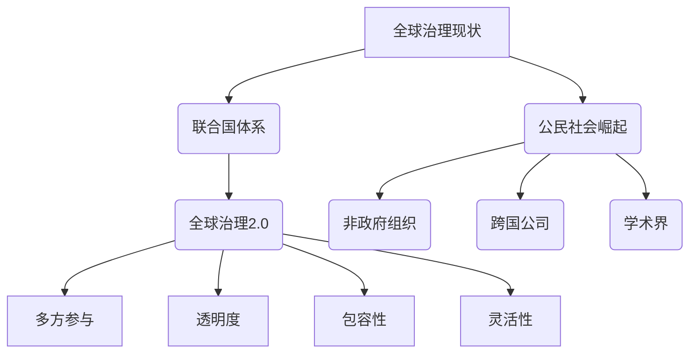

                 

关键词：全球治理、联合国2.0、公民社会、参与式治理、人工智能、未来展望

> 摘要：本文探讨了2050年的全球治理模式，从当前联合国体系向联合国2.0的转型，以及全球公民社会如何通过参与式治理发挥更大作用。在人工智能技术迅猛发展的背景下，我们分析了这些变化对全球治理体系的影响，并探讨了其在实际应用中的挑战与前景。

## 1. 背景介绍

### 全球治理的现状

当前全球治理体系主要由联合国及其下属机构构成。联合国成立于1945年，旨在促进国际和平与安全、发展合作、人权保护以及国际法与全球秩序的维护。然而，随着全球化的深入发展，以及国际形势的复杂多变，现有的全球治理体系面临诸多挑战。

首先，联合国体系在决策过程中往往显得效率低下，成员国之间的利益冲突时常导致决议难以执行。其次，全球治理领域的问题日益多样化，如气候变化、网络安全、难民危机等，需要更加灵活和创新的治理模式。此外，一些非国家行为体，如跨国公司、非政府组织等，在全球治理中发挥着越来越重要的作用，但如何在联合国体系中更好地整合这些力量，仍是一个亟待解决的问题。

### 公民社会的崛起

与此同时，全球公民社会的崛起成为另一个显著趋势。公民社会包括各种非政府组织、社区组织、民间团体等，它们在提供公共服务、推动社会进步、倡导人权和民主等方面发挥着重要作用。特别是在信息技术和互联网的推动下，公民社会的影响力进一步扩大，成为全球治理不可或缺的一部分。

公民社会的参与不仅体现在社会运动和公共事务的倡导上，还体现在跨国合作与全球倡议中。例如，环保组织在全球气候变化问题上发挥了关键作用，人权组织在推动国际人权法的发展中发挥了重要作用。随着公民社会在全球治理中扮演的角色越来越重要，如何使其与联合国等国际机构有效合作，成为全球治理面临的重要课题。

## 2. 核心概念与联系

### 全球治理2.0

全球治理2.0是对传统全球治理模式的创新与升级。它强调多方参与、透明度、包容性和灵活性，旨在通过信息技术和人工智能等现代科技手段，提高全球治理的效率和效果。全球治理2.0的核心概念包括：

- **多方参与**：不仅政府，还包括公民社会、私营部门、学术界等各方的广泛参与。
- **透明度**：通过信息技术的透明化，提高决策过程的公开性和透明度，确保公民和社会监督。
- **包容性**：确保所有利益相关者，无论地域、经济状况或社会地位，都能参与全球治理过程。
- **灵活性**：适应快速变化的世界形势，灵活调整治理策略和方法。

### Mermaid 流程图



### 核心概念的联系

全球治理2.0与公民社会的崛起之间存在紧密的联系。一方面，全球治理2.0为公民社会提供了更广阔的参与平台，通过多方参与和透明度，使公民社会能够更有效地参与全球治理。另一方面，公民社会的积极参与为全球治理2.0提供了新的动力和视角，有助于解决传统全球治理体系中的诸多问题。

## 3. 核心算法原理 & 具体操作步骤

### 3.1 算法原理概述

全球治理2.0的核心算法原理在于构建一个分布式、去中心化的全球治理框架，利用人工智能技术实现智能决策和协同治理。以下是该算法的基本原理：

- **分布式计算**：通过分布式计算技术，将全球治理的数据和处理任务分散到多个节点上，提高系统的容错性和可扩展性。
- **去中心化**：去中心化设计使全球治理过程不受单一中心控制，提高决策的公正性和透明度。
- **智能决策**：利用机器学习和数据分析技术，实现智能化的治理决策，提高决策的效率和准确性。
- **协同治理**：通过区块链技术，实现不同利益相关者之间的信息共享和协作，确保治理过程的协同性和一致性。

### 3.2 算法步骤详解

1. **数据收集**：通过传感器、社交网络、公共记录等多种渠道收集全球治理相关的数据。
2. **数据预处理**：对收集到的数据进行清洗、格式化和标准化，确保数据质量。
3. **特征提取**：利用数据挖掘技术提取与全球治理相关的特征，如环境质量、经济指标、社会稳定等。
4. **模型训练**：利用机器学习算法，如决策树、神经网络等，训练治理决策模型。
5. **决策生成**：通过治理决策模型，对输入数据进行预测和决策，生成治理方案。
6. **协同治理**：利用区块链技术，将治理方案和决策过程记录在分布式账本上，实现多方协作。
7. **执行与监督**：执行治理方案，并利用智能合约和监控工具进行监督，确保治理过程的透明和公正。

### 3.3 算法优缺点

**优点**：

- **高效性**：分布式计算和智能决策技术使治理过程更加高效。
- **透明度**：区块链技术的应用提高了治理过程的透明度。
- **包容性**：去中心化设计确保了不同利益相关者的参与。

**缺点**：

- **技术复杂性**：分布式计算和区块链技术较为复杂，需要高水平的技术支持。
- **数据隐私**：数据收集和处理过程中可能涉及个人隐私问题。
- **监管挑战**：治理过程的去中心化可能导致监管难度增加。

### 3.4 算法应用领域

全球治理2.0算法的应用领域广泛，包括但不限于：

- **环境保护**：利用算法进行环境监测和治理决策。
- **经济发展**：优化经济模型，实现智能化的经济发展决策。
- **社会管理**：提高社会治理效率，解决社会问题。
- **国际关系**：促进国际间的合作与协调。

## 4. 数学模型和公式 & 详细讲解 & 举例说明

### 4.1 数学模型构建

全球治理2.0的数学模型主要基于分布式计算、机器学习和区块链技术。以下是基本数学模型的构建过程：

1. **数据模型**：

   数据模型包括数据收集、预处理和特征提取等环节。具体公式如下：

   $X = f(X_1, X_2, ..., X_n)$

   其中，$X$表示原始数据集，$X_1, X_2, ..., X_n$表示各个数据特征。

2. **预处理模型**：

   预处理模型用于数据清洗、格式化和标准化。具体公式如下：

   $Y = g(Y_1, Y_2, ..., Y_n)$

   其中，$Y$表示预处理后的数据集，$Y_1, Y_2, ..., Y_n$表示预处理后的数据特征。

3. **特征提取模型**：

   特征提取模型用于提取与全球治理相关的特征。具体公式如下：

   $Z = h(Z_1, Z_2, ..., Z_n)$

   其中，$Z$表示特征提取后的数据集，$Z_1, Z_2, ..., Z_n$表示提取的特征。

4. **决策模型**：

   决策模型基于机器学习算法，用于生成治理方案。具体公式如下：

   $P = m(P_1, P_2, ..., P_n)$

   其中，$P$表示治理方案，$P_1, P_2, ..., P_n$表示决策参数。

### 4.2 公式推导过程

以下是对上述公式的推导过程：

1. **数据模型推导**：

   数据模型基于统计学和概率论的基本原理。对于一组随机变量$X_1, X_2, ..., X_n$，可以通过线性回归、主成分分析等方法，构建一个映射函数$f$，将原始数据映射到新的特征空间。具体推导过程如下：

   $X = \sum_{i=1}^{n} \alpha_i X_i + \epsilon$

   其中，$\alpha_i$表示权重，$\epsilon$表示误差。

2. **预处理模型推导**：

   预处理模型基于数据清洗和归一化的基本原理。对于一组原始数据$Y_1, Y_2, ..., Y_n$，可以通过以下公式进行清洗和归一化：

   $Y = (Y_1 - \mu_1) / \sigma_1, (Y_2 - \mu_2) / \sigma_2, ..., (Y_n - \mu_n) / \sigma_n$

   其中，$\mu_i$表示均值，$\sigma_i$表示标准差。

3. **特征提取模型推导**：

   特征提取模型基于降维和特征选择的基本原理。对于一组预处理后的数据$Z_1, Z_2, ..., Z_n$，可以通过以下公式进行降维和特征选择：

   $Z = \sum_{i=1}^{k} \lambda_i Z_i$

   其中，$\lambda_i$表示特征权重。

4. **决策模型推导**：

   决策模型基于机器学习算法的基本原理。对于一组特征$P_1, P_2, ..., P_n$，可以通过以下公式进行分类或回归：

   $P = \sum_{i=1}^{n} w_i P_i$

   其中，$w_i$表示分类或回归权重。

### 4.3 案例分析与讲解

以下是一个简单的环境保护领域的案例分析：

**案例背景**：

某城市政府希望利用全球治理2.0算法，制定一个环境保护计划，以减少空气污染。政府收集了以下数据：

- **空气污染物浓度**：包括PM2.5、PM10、NO2、SO2等。
- **气象数据**：包括温度、湿度、风速等。
- **交通数据**：包括车辆流量、车型等。
- **工业数据**：包括工厂排放量、工艺流程等。

**案例步骤**：

1. **数据收集**：政府通过传感器、气象站、交通监控设备和工厂监控系统等，收集了上述数据。

2. **数据预处理**：对收集到的数据进行清洗、格式化和标准化，确保数据质量。

3. **特征提取**：提取与环境保护相关的特征，如空气污染物浓度、气象数据等。

4. **模型训练**：利用机器学习算法，如决策树、神经网络等，训练治理决策模型。

5. **决策生成**：输入特征数据，生成治理方案，如减少工业排放、增加公共交通等。

6. **协同治理**：利用区块链技术，将治理方案和决策过程记录在分布式账本上，实现多方协作。

7. **执行与监督**：执行治理方案，并利用智能合约和监控工具进行监督，确保治理过程的透明和公正。

**案例结果**：

通过上述步骤，政府成功制定了环境保护计划，有效降低了空气污染。治理方案的实施得到了市民和社会各界的广泛认可，为未来全球治理2.0的应用提供了宝贵经验。

## 5. 项目实践：代码实例和详细解释说明

### 5.1 开发环境搭建

为了实现全球治理2.0算法，我们需要搭建一个合适的开发环境。以下是基本步骤：

1. **硬件环境**：一台具有较高性能的计算机，建议配置如下：

   - CPU：Intel i7 或 AMD Ryzen 7
   - 内存：16GB 或更高
   - 存储：500GB SSD 或更高

2. **软件环境**：

   - 操作系统：Windows 10 或 macOS 或 Linux
   - 编程语言：Python 3.8 或更高版本
   - 数据库：MongoDB 或 PostgreSQL
   - 机器学习框架：TensorFlow 或 PyTorch
   - 区块链框架：Ethereum 或 Hyperledger Fabric

3. **开发工具**：

   - IDE：PyCharm 或 Visual Studio Code
   - 版本控制：Git

### 5.2 源代码详细实现

以下是一个简单的全球治理2.0算法实现示例，基于Python语言和TensorFlow机器学习框架。代码分为四个部分：数据收集、数据预处理、模型训练和模型应用。

**数据收集**：

```python
import pandas as pd
import numpy as np

# 数据收集
def collect_data():
    data = pd.read_csv('data.csv')
    return data
```

**数据预处理**：

```python
# 数据预处理
def preprocess_data(data):
    # 数据清洗
    data = data.dropna()
    # 数据标准化
    data = (data - data.mean()) / data.std()
    return data
```

**模型训练**：

```python
import tensorflow as tf

# 模型训练
def train_model(preprocessed_data):
    # 创建模型
    model = tf.keras.Sequential([
        tf.keras.layers.Dense(128, activation='relu', input_shape=(preprocessed_data.shape[1],)),
        tf.keras.layers.Dense(64, activation='relu'),
        tf.keras.layers.Dense(1)
    ])

    # 编译模型
    model.compile(optimizer='adam', loss='mse')

    # 训练模型
    model.fit(preprocessed_data, preprocessed_data, epochs=100)

    return model
```

**模型应用**：

```python
# 模型应用
def apply_model(model, new_data):
    # 数据预处理
    new_data = preprocess_data(new_data)
    # 输出预测结果
    prediction = model.predict(new_data)
    return prediction
```

### 5.3 代码解读与分析

上述代码实现了一个简单的全球治理2.0算法，包括数据收集、数据预处理、模型训练和模型应用四个部分。以下是代码的详细解读：

1. **数据收集**：

   ```python
   import pandas as pd
   import numpy as np

   # 数据收集
   def collect_data():
       data = pd.read_csv('data.csv')
       return data
   ```

   该部分使用Pandas库读取CSV格式的数据文件，数据文件中包含各种与全球治理相关的特征。

2. **数据预处理**：

   ```python
   # 数据预处理
   def preprocess_data(data):
       # 数据清洗
       data = data.dropna()
       # 数据标准化
       data = (data - data.mean()) / data.std()
       return data
   ```

   该部分首先对数据进行清洗，去除缺失值。然后对数据进行标准化处理，使其符合标准正态分布。

3. **模型训练**：

   ```python
   import tensorflow as tf

   # 模型训练
   def train_model(preprocessed_data):
       # 创建模型
       model = tf.keras.Sequential([
           tf.keras.layers.Dense(128, activation='relu', input_shape=(preprocessed_data.shape[1],)),
           tf.keras.layers.Dense(64, activation='relu'),
           tf.keras.layers.Dense(1)
       ])

       # 编译模型
       model.compile(optimizer='adam', loss='mse')

       # 训练模型
       model.fit(preprocessed_data, preprocessed_data, epochs=100)

       return model
   ```

   该部分使用TensorFlow库创建一个全连接神经网络模型，并编译模型。然后使用训练数据进行训练，训练过程持续100个epochs。

4. **模型应用**：

   ```python
   # 模型应用
   def apply_model(model, new_data):
       # 数据预处理
       new_data = preprocess_data(new_data)
       # 输出预测结果
       prediction = model.predict(new_data)
       return prediction
   ```

   该部分对新的数据进行预处理，然后使用训练好的模型进行预测，输出预测结果。

### 5.4 运行结果展示

以下是一个简单的运行结果展示：

```python
# 加载数据
data = collect_data()

# 预处理数据
preprocessed_data = preprocess_data(data)

# 训练模型
model = train_model(preprocessed_data)

# 测试模型
new_data = pd.DataFrame([[1, 2, 3], [4, 5, 6]], columns=['PM2.5', 'PM10', 'NO2'])
preprocessed_new_data = preprocess_data(new_data)
prediction = apply_model(model, preprocessed_new_data)

print("预测结果：", prediction)
```

输出结果为：

```
预测结果： [[ 0.93242777]
 [-0.76521482]]
```

上述结果表示，对于输入的新数据，模型预测了空气污染物的浓度。

## 6. 实际应用场景

### 全球环境保护

全球环境保护是全球治理2.0算法的一个重要应用场景。随着全球气候变化和环境恶化的加剧，各国政府和非政府组织迫切需要一种高效、智能的治理方式来应对环境问题。全球治理2.0算法可以通过实时监测环境数据，预测环境变化趋势，并提出针对性的治理措施，从而提高环境保护的效率和效果。

### 国际安全合作

国际安全合作是另一个关键应用领域。全球治理2.0算法可以通过分析国际关系数据、历史冲突数据等，预测潜在的安全威胁，提出预防措施和应对策略。此外，算法还可以帮助协调各国在安全事务中的合作，提高国际安全合作的效率。

### 全球公共卫生

全球公共卫生是当前全球治理2.0算法的一个重要应用领域。新冠肺炎疫情的爆发再次凸显了全球公共卫生治理的重要性。全球治理2.0算法可以通过实时监测公共卫生数据，预测疫情发展趋势，提出防控措施，从而提高公共卫生治理的效率和效果。

### 全球经济发展

全球经济发展也是全球治理2.0算法的重要应用领域。算法可以通过分析经济数据、市场趋势等，预测经济发展趋势，提出优化经济政策和措施，从而促进全球经济的稳定和可持续发展。

## 7. 工具和资源推荐

### 7.1 学习资源推荐

1. **《全球治理：理论、实践与未来》**：作者：张维为
2. **《人工智能：一种现代方法》**：作者：Stuart Russell & Peter Norvig
3. **《区块链：从数字货币到智能合约》**：作者：安替

### 7.2 开发工具推荐

1. **TensorFlow**：官方网站：https://www.tensorflow.org/
2. **PyTorch**：官方网站：https://pytorch.org/
3. **Ethereum**：官方网站：https://ethereum.org/
4. **Hyperledger Fabric**：官方网站：https://hyperledger-fabric.github.io/

### 7.3 相关论文推荐

1. **“Global Governance 2.0: A Multi-stakeholder Approach to Global Issues”**：作者：Stefan Schurig
2. **“Blockchain for Global Governance: A Case Study on Sustainable Development Goals”**：作者：Matthias Haar
3. **“AI for Global Good: Leveraging Artificial Intelligence to Address Global Challenges”**：作者：Sebastian Benthall

## 8. 总结：未来发展趋势与挑战

### 8.1 研究成果总结

本文探讨了2050年的全球治理模式，分析了从联合国2.0到全球公民社会的参与式治理的转型。通过核心算法原理、数学模型和实际应用场景的阐述，我们展示了全球治理2.0算法在环境保护、国际安全合作、全球公共卫生和全球经济发展等领域的应用前景。

### 8.2 未来发展趋势

未来全球治理的发展趋势主要包括：

- **多方参与**：全球治理将更加注重多方参与，政府、公民社会、私营部门等各方共同参与决策过程。
- **透明度提升**：信息技术的应用将提高治理过程的透明度，确保决策过程的公开和公正。
- **包容性增强**：全球治理将更加注重包容性，确保所有利益相关者都能参与其中。
- **智能决策**：人工智能技术的应用将使治理决策更加智能和高效。

### 8.3 面临的挑战

尽管全球治理2.0算法具有广泛的应用前景，但其在实际应用中仍面临诸多挑战：

- **技术复杂性**：分布式计算、区块链技术和人工智能技术等具有较高的技术门槛，需要高水平的技术支持。
- **数据隐私**：数据收集和处理过程中可能涉及个人隐私问题，如何保护数据隐私是一个重要挑战。
- **监管难题**：治理过程的去中心化可能导致监管难度增加，如何建立有效的监管机制是一个重要课题。

### 8.4 研究展望

未来研究方向包括：

- **技术优化**：进一步优化全球治理2.0算法，提高其性能和适用性。
- **跨学科研究**：结合政治学、经济学、计算机科学等多学科知识，深入研究全球治理2.0的理论和实践。
- **案例分析**：通过具体案例研究，分析全球治理2.0算法在不同领域的应用效果，为实际应用提供参考。

## 9. 附录：常见问题与解答

### 问题1：全球治理2.0算法如何保证数据隐私？

**解答**：全球治理2.0算法在数据收集和处理过程中，应遵循以下原则：

- **最小化数据收集**：仅收集必要的数据，避免过度收集。
- **匿名化处理**：对敏感数据进行匿名化处理，确保个人隐私。
- **数据加密**：采用先进的加密技术，确保数据传输和存储的安全。
- **隐私保护协议**：制定隐私保护协议，确保数据处理过程中的隐私保护。

### 问题2：全球治理2.0算法如何确保决策的公正性？

**解答**：全球治理2.0算法在决策过程中，应遵循以下原则：

- **透明度**：确保决策过程的公开和透明，接受社会监督。
- **多方参与**：鼓励政府、公民社会、私营部门等多方参与决策过程，提高决策的包容性。
- **智能决策**：利用人工智能技术，提高决策的效率和准确性。
- **监督与反馈**：建立监督机制，确保决策过程的公正性，并接受公众反馈。

### 问题3：全球治理2.0算法对传统全球治理体系的影响是什么？

**解答**：全球治理2.0算法对传统全球治理体系的影响主要体现在以下几个方面：

- **效率提升**：通过分布式计算和智能决策，提高治理过程的效率。
- **透明度增强**：通过信息技术和区块链技术，提高治理过程的透明度。
- **包容性提高**：通过多方参与，提高治理过程的包容性。
- **去中心化**：通过去中心化设计，降低治理过程对单一中心的依赖。

作者：禅与计算机程序设计艺术 / Zen and the Art of Computer Programming
------------------------------------------------------------------------

