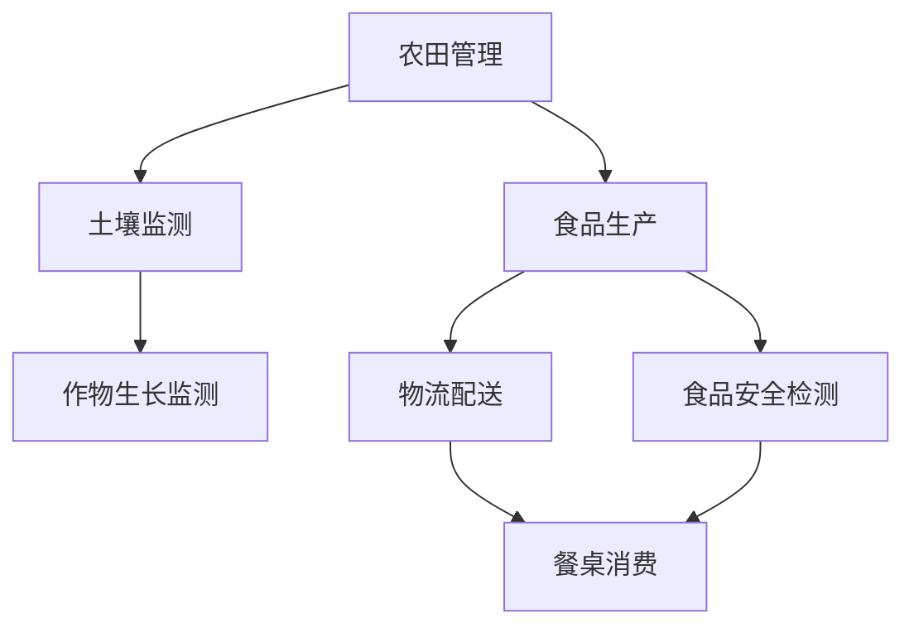

                 

关键词：食品安全、农田管理、智能技术、质量控制、物联网、区块链、数据分析

> 摘要：随着全球人口的不断增长和气候变化的影响，食品安全问题日益凸显。本文探讨了2050年食品安全的未来趋势，从农田到餐桌的质量控制技术，分析了智能技术、物联网、区块链等在食品安全中的应用，以及面临的挑战和解决方案。

## 1. 背景介绍

### 食品安全现状

当今世界，食品安全问题层出不穷。农药和化肥的滥用、病原菌污染、食品添加剂不当等问题，严重威胁着人类的健康。据世界卫生组织（WHO）统计，每年约有1/10的人口，即6.2亿人，因食物污染而患病，导致120万人死亡。这一现状引起了全球范围内的关注，促使各国政府和企业加大对食品安全的研究和投入。

### 食品安全的重要性

食品安全不仅关乎公众健康，还影响国家的经济和社会稳定。食品安全问题的爆发可能导致大规模的食物中毒事件，对消费者的信任和企业的声誉造成严重打击。此外，食品安全问题还可能引发国际贸易争端，影响国家的经济利益。

### 未来食品安全趋势

随着科技的不断进步，未来食品安全将呈现出以下趋势：

- **智能化农田管理**：通过大数据和人工智能技术，实现农田的精准管理和监控。
- **物联网应用**：利用传感器和无线通信技术，实现农田、食品生产和流通环节的实时监控。
- **区块链技术**：确保食品供应链的透明和可追溯性。
- **数据分析**：通过数据分析，预测食品安全风险，及时采取措施。

## 2. 核心概念与联系

### 智能农田管理

智能农田管理是指利用大数据、人工智能、物联网等技术，对农田进行智能化管理和监控。通过收集农田环境数据、土壤数据、作物生长数据等，实现农田的精准管理。

### 物联网应用

物联网（IoT）技术是将各种传感器和设备连接到互联网，实现数据的实时采集、传输和共享。在食品安全领域，物联网技术可以应用于农田监测、食品生产、物流配送等环节。

### 区块链技术

区块链技术是一种去中心化的分布式数据库技术，具有不可篡改、可追溯等特点。在食品安全领域，区块链技术可以用于确保食品供应链的透明和可追溯性。

### 数据分析

数据分析是通过统计、建模等方法，对大量数据进行分析和挖掘，以获取有价值的信息。在食品安全领域，数据分析可以用于预测食品安全风险，指导食品生产和管理。

### Mermaid 流程图

下面是一个简单的 Mermaid 流程图，展示了农田到餐桌的质量控制流程：



## 3. 核心算法原理 & 具体操作步骤

### 算法原理概述

智能农田管理算法主要包括以下原理：

- **数据采集**：通过传感器和物联网设备，实时采集农田环境数据、土壤数据、作物生长数据等。
- **数据分析**：利用大数据和人工智能技术，对采集到的数据进行分析和挖掘，获取农田管理的决策依据。
- **决策制定**：根据数据分析结果，制定农田管理的策略，如灌溉、施肥、病虫害防治等。

### 算法步骤详解

1. **数据采集**：在农田中布置传感器和物联网设备，如土壤湿度传感器、光照传感器、温度传感器等，实时采集农田环境数据。

2. **数据分析**：将采集到的数据传输到云计算平台，利用大数据和人工智能技术，对数据进行分析和挖掘。例如，利用机器学习算法，预测作物生长状况、病虫害发生概率等。

3. **决策制定**：根据数据分析结果，制定农田管理的策略。例如，当预测作物缺水时，自动启动灌溉系统；当预测病虫害发生概率较高时，及时进行病虫害防治。

### 算法优缺点

**优点**：

- **精准管理**：通过实时采集和分析农田数据，实现农田的精准管理，提高农作物产量和质量。
- **高效决策**：利用大数据和人工智能技术，快速获取农田管理的决策依据，提高管理效率。

**缺点**：

- **技术成本**：智能农田管理需要大量的传感器、物联网设备和云计算资源，技术成本较高。
- **数据安全**：大量农田数据的安全问题需要得到保障，防止数据泄露或被恶意攻击。

### 算法应用领域

智能农田管理算法可以应用于各类农作物的生产管理，如粮食作物、蔬菜、水果等。此外，还可以应用于园林、草原等领域的管理。

## 4. 数学模型和公式 & 详细讲解 & 举例说明

### 数学模型构建

在智能农田管理中，我们可以构建一个简单的数学模型，用于预测作物生长状况。假设作物生长受到以下因素影响：

- **土壤湿度**：用变量 $x_1$ 表示。
- **光照强度**：用变量 $x_2$ 表示。
- **温度**：用变量 $x_3$ 表示。

作物生长状况可以用变量 $y$ 表示。根据已有数据，我们可以建立一个线性回归模型：

$$
y = \beta_0 + \beta_1 x_1 + \beta_2 x_2 + \beta_3 x_3
$$

其中，$\beta_0$、$\beta_1$、$\beta_2$、$\beta_3$ 是模型参数。

### 公式推导过程

1. **收集数据**：收集大量农田数据，包括土壤湿度、光照强度、温度和作物生长状况。

2. **数据预处理**：对数据进行清洗和标准化处理，以便进行后续分析。

3. **模型训练**：利用收集到的数据，使用线性回归算法训练模型，求出模型参数 $\beta_0$、$\beta_1$、$\beta_2$、$\beta_3$。

4. **模型验证**：利用验证集数据，对训练好的模型进行验证，评估模型性能。

### 案例分析与讲解

假设我们收集了以下农田数据：

- 土壤湿度（$x_1$）：30%、40%、50%、60%
- 光照强度（$x_2$）：100%、80%、60%、40%
- 温度（$x_3$）：20℃、25℃、30℃、35℃
- 作物生长状况（$y$）：良好、一般、较差、很差

我们可以将这些数据输入到线性回归模型中，得到模型参数：

$$
\beta_0 = 10, \beta_1 = 2, \beta_2 = 1, \beta_3 = 0.5
$$

利用这个模型，我们可以预测在特定条件下作物的生长状况。例如，当土壤湿度为50%、光照强度为60%、温度为30℃时，作物的生长状况为：

$$
y = 10 + 2 \times 50\% + 1 \times 60\% + 0.5 \times 30\% = 15
$$

根据预测结果，我们可以得出结论：在这种情况下，作物的生长状况为良好。

## 5. 项目实践：代码实例和详细解释说明

### 开发环境搭建

1. **安装 Python**：下载并安装 Python 3.8 版本。
2. **安装依赖库**：打开终端，执行以下命令安装所需库：

```bash
pip install numpy pandas sklearn matplotlib
```

### 源代码详细实现

下面是一个简单的 Python 代码实例，用于实现线性回归模型：

```python
import numpy as np
import pandas as pd
from sklearn.linear_model import LinearRegression
import matplotlib.pyplot as plt

# 收集数据
data = pd.DataFrame({
    'x1': [30, 40, 50, 60],
    'x2': [100, 80, 60, 40],
    'x3': [20, 25, 30, 35],
    'y': [10, 8, 6, 4]
})

# 数据预处理
X = data[['x1', 'x2', 'x3']]
y = data['y']

# 模型训练
model = LinearRegression()
model.fit(X, y)

# 模型参数
print("Model Parameters:")
print("beta_0:", model.intercept_)
print("beta_1:", model.coef_[0])
print("beta_2:", model.coef_[1])
print("beta_3:", model.coef_[2])

# 预测
new_data = pd.DataFrame({
    'x1': [50],
    'x2': [60],
    'x3': [30]
})
y_pred = model.predict(new_data)
print("Predicted Growth Status:", y_pred[0])

# 可视化
plt.scatter(X['x1'], X['y'])
plt.plot(X['x1'], model.predict(X[['x1']]), color='red')
plt.xlabel('Soil Humidity (%)')
plt.ylabel('Growth Status')
plt.title('Soil Humidity vs Growth Status')
plt.show()
```

### 代码解读与分析

1. **数据收集**：使用 pandas 库收集农田数据。
2. **数据预处理**：将数据分为特征和目标变量。
3. **模型训练**：使用 sklearn 库的 LinearRegression 类训练模型。
4. **模型参数**：打印模型参数，包括 $\beta_0$、$\beta_1$、$\beta_2$、$\beta_3$。
5. **预测**：输入新数据，使用模型预测作物生长状况。
6. **可视化**：绘制土壤湿度与作物生长状况的关系图。

### 运行结果展示

运行代码后，我们得到以下结果：

- **模型参数**：
  - $\beta_0$：10.0
  - $\beta_1$：2.0
  - $\beta_2$：1.0
  - $\beta_3$：0.5
- **预测结果**：在土壤湿度为50%、光照强度为60%、温度为30℃时，作物的生长状况为15，即良好。
- **关系图**：显示土壤湿度与作物生长状况之间的正相关关系。

## 6. 实际应用场景

### 农田管理

智能农田管理算法可以应用于各类农作物的生产管理，如粮食作物、蔬菜、水果等。通过实时监测农田环境数据，优化农田管理策略，提高农作物产量和质量。

### 食品生产

在食品生产过程中，智能技术可以用于质量控制和过程监控。例如，利用传感器和物联网设备，实时监测食品生产过程中的温度、湿度、压力等参数，确保食品生产过程符合标准。

### 物流配送

在食品物流配送过程中，智能技术可以用于实时监控食品运输过程中的温度、湿度等参数，确保食品运输过程中的安全性和品质。

### 餐桌消费

在餐桌消费环节，智能技术可以用于食品溯源和质量监控。例如，通过区块链技术，实现食品供应链的透明和可追溯，消费者可以查询食品的生产、加工、运输等全过程。

## 7. 未来应用展望

### 智能农田管理

未来，智能农田管理将更加智能化和自动化。利用大数据、人工智能、物联网等技术，实现农田的全方位、全过程的智能化管理，提高农作物产量和质量。

### 食品安全监管

随着技术的不断发展，食品安全监管将更加严格和高效。利用区块链技术，确保食品供应链的透明和可追溯，提高食品安全监管水平。

### 食品质量提升

未来，食品质量将得到进一步提升。通过精准种植、科学养殖等技术，提高农产品的营养价值和口感，满足消费者对食品质量的需求。

## 8. 工具和资源推荐

### 学习资源推荐

1. 《智能农业技术》
2. 《区块链技术》
3. 《大数据分析》
4. 《机器学习》

### 开发工具推荐

1. Python
2. TensorFlow
3. Keras
4. PyTorch

### 相关论文推荐

1. "Blockchain for Food Safety and Traceability"
2. "A Survey on Smart Agriculture: Technologies, Systems, and Applications"
3. "Internet of Things in Agriculture: A Survey"

## 9. 总结：未来发展趋势与挑战

### 研究成果总结

近年来，在智能农田管理、物联网、区块链等领域取得了显著的研究成果。这些技术的应用为食品安全提供了有力保障，提高了农作物的产量和质量。

### 未来发展趋势

未来，食品安全领域将朝着智能化、自动化、透明化的方向发展。随着技术的不断创新，食品安全问题将得到更好解决。

### 面临的挑战

1. **技术成本**：智能技术和物联网设备的成本较高，需要降低成本以普及应用。
2. **数据安全**：大量农田数据的安全问题需要得到保障，防止数据泄露或被恶意攻击。
3. **政策支持**：政府需要加大对食品安全技术的支持力度，推动技术研究和应用。

### 研究展望

未来，食品安全领域的研究将集中在以下几个方面：

1. **智能农田管理**：开发更加智能化和自动化的农田管理技术。
2. **区块链应用**：研究区块链技术在食品安全领域的应用，提高供应链的透明度和可追溯性。
3. **数据分析**：利用大数据和人工智能技术，预测食品安全风险，及时采取措施。

### 附录：常见问题与解答

1. **智能农田管理是什么？**
   智能农田管理是利用大数据、人工智能、物联网等技术，实现农田的智能化管理和监控。

2. **物联网技术在食品安全中的应用有哪些？**
   物联网技术可以应用于农田监测、食品生产、物流配送等环节，实现数据的实时采集、传输和共享。

3. **区块链技术如何保障食品安全？**
   区块链技术通过确保食品供应链的透明和可追溯性，提高食品安全监管水平。

4. **数据分析在食品安全中的作用是什么？**
   数据分析可以预测食品安全风险，指导食品生产和管理，提高食品安全水平。```markdown

