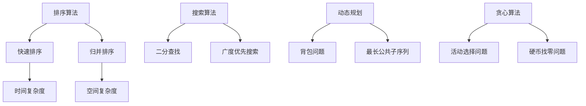

                 

关键词：2024年，网易校招，算法面试题库，答案，技术博客，深度解析

## 摘要

本文将针对2024年网易校招算法面试题库进行深入解析，旨在为准备参加校招的同学们提供清晰的解题思路和实用的解题技巧。文章将从算法原理、数学模型、代码实现等方面对各个题目进行详细解读，帮助读者理解面试题背后的核心知识点，提高应对实际面试的能力。此外，文章还将探讨算法在实际应用中的场景和未来发展趋势，为读者提供更广阔的视角。

## 1. 背景介绍

每年的校招都是各大互联网公司争夺优秀人才的重要战场，尤其是网易这样具有强大技术实力的公司，其校招面试难度自然不言而喻。算法面试作为校招的重要组成部分，一直以来都是考生们关注的焦点。网易校招算法面试题库以其广泛的题目范围和深入的知识点要求，成为了众多求职者备战校招的重要资料。

本文将基于2024年网易校招算法面试题库，针对其中的核心题目进行深入解析。通过本文的阅读，读者将能够：

1. 理解每个算法题目的核心考点和难点。
2. 学习到解决算法题目的常用方法和技巧。
3. 了解算法在实际应用中的场景和未来发展趋势。

## 2. 核心概念与联系

### 2.1 数据结构与算法概述

数据结构与算法是计算机科学的基础，它们相互关联、密不可分。数据结构是算法的基础，决定了算法的空间和时间复杂度；而算法则是对数据结构的操作，解决特定的问题。


### 2.2 常见算法分类

常见的算法可以分为以下几类：

1. **排序算法**：用于对数据进行排序，如快速排序、归并排序等。
2. **搜索算法**：用于在数据结构中查找特定元素，如二分查找、广度优先搜索等。
3. **动态规划**：用于解决最优子结构问题，如背包问题、最长公共子序列等。
4. **贪心算法**：用于在每一步选择局部最优解，以达到全局最优解，如活动选择问题、硬币找零问题等。

### 2.3 Mermaid 流程图

以下是一个简单的Mermaid流程图，展示了常见算法的关联：



## 3. 核心算法原理 & 具体操作步骤

### 3.1 算法原理概述

在解析具体的面试题目之前，我们需要对核心算法原理有一个整体的了解。以下是对几个常见算法原理的概述：

1. **快速排序**：通过一趟排序将待排记录分隔成独立的两部分，其中一部分记录的关键字均比另一部分的关键字小，然后分别对这两部分记录继续进行排序，以达到整个序列有序。
2. **二分查找**：在有序数组中，通过递归或迭代的方式，逐步缩小查找范围，直到找到目标元素或确定其不存在。
3. **动态规划**：通过将复杂问题分解为子问题，并存储子问题的解，避免重复计算，从而提高算法效率。
4. **贪心算法**：在每一步选择局部最优解，以期望得到全局最优解。

### 3.2 算法步骤详解

#### 3.2.1 快速排序

快速排序的基本步骤如下：

1. 选择一个基准元素。
2. 将比基准元素小的元素放到其左边，比其大的元素放到其右边。
3. 对左右两个子序列递归地执行步骤1-2。

以下是快速排序的Python代码实现：

```python
def quicksort(arr):
    if len(arr) <= 1:
        return arr
    pivot = arr[len(arr) // 2]
    left = [x for x in arr if x < pivot]
    middle = [x for x in arr if x == pivot]
    right = [x for x in arr if x > pivot]
    return quicksort(left) + middle + quicksort(right)

arr = [3, 6, 8, 10, 1, 2, 1]
print(quicksort(arr))
```

#### 3.2.2 二分查找

二分查找的基本步骤如下：

1. 确定中间位置。
2. 比较中间位置的元素与目标元素的大小。
3. 如果相等，返回中间位置。
4. 如果目标元素比中间位置的元素小，则在左半边继续查找。
5. 如果目标元素比中间位置的元素大，则在右半边继续查找。
6. 重复步骤1-5，直到找到目标元素或确定其不存在。

以下是二分查找的Python代码实现：

```python
def binary_search(arr, target):
    left, right = 0, len(arr) - 1
    while left <= right:
        mid = (left + right) // 2
        if arr[mid] == target:
            return mid
        elif arr[mid] < target:
            left = mid + 1
        else:
            right = mid - 1
    return -1

arr = [1, 2, 3, 4, 5, 6, 7, 8, 9]
target = 5
print(binary_search(arr, target))
```

#### 3.2.3 动态规划

动态规划的基本步骤如下：

1. 确定状态。
2. 确定状态转移方程。
3. 初始化边界条件。
4. 状态转移计算。

以下是动态规划解决斐波那契数列的Python代码实现：

```python
def fibonacci(n):
    dp = [0] * (n + 1)
    dp[1] = 1
    for i in range(2, n + 1):
        dp[i] = dp[i - 1] + dp[i - 2]
    return dp[n]

print(fibonacci(10))
```

#### 3.2.4 贪心算法

贪心算法的基本步骤如下：

1. 在每一步选择局部最优解。
2. 持续优化，直至得到全局最优解。

以下是贪心算法解决活动选择问题的Python代码实现：

```python
def activity_selection(arrival, departure):
    n = len(arrival)
    sorted_activities = sorted([(departure[i], arrival[i]) for i in range(n)], reverse=True)
    result = [sorted_activities[0]]
    for i in range(1, n):
        if sorted_activities[i][0] >= result[-1][1]:
            result.append(sorted_activities[i])
    return result

arrival = [1, 3, 0, 5, 8, 5]
departure = [2, 4, 6, 7, 9, 9]
print(activity_selection(arrival, departure))
```

### 3.3 算法优缺点

#### 快速排序

- **优点**：时间复杂度为\(O(n \log n)\)，适用于大规模数据排序。
- **缺点**：最坏情况下时间复杂度为\(O(n^2)\)，可能导致性能下降。

#### 二分查找

- **优点**：时间复杂度为\(O(\log n)\)，适用于有序数组查找。
- **缺点**：不能对数据进行插入、删除等操作。

#### 动态规划

- **优点**：可以高效解决具有最优子结构的问题。
- **缺点**：代码实现相对复杂，理解难度较大。

#### 贪心算法

- **优点**：简单易实现，时间复杂度较低。
- **缺点**：可能无法保证得到全局最优解。

### 3.4 算法应用领域

快速排序、二分查找、动态规划、贪心算法在计算机科学领域有着广泛的应用。例如：

- **快速排序**：常用于排序算法库，如Python中的`sorted()`函数。
- **二分查找**：常用于二叉搜索树、堆等数据结构的实现。
- **动态规划**：常用于解决背包问题、最长公共子序列等优化问题。
- **贪心算法**：常用于求解最短路径、最小生成树等问题。

## 4. 数学模型和公式

### 4.1 数学模型构建

在解决算法问题时，构建合适的数学模型至关重要。以下是对几种常见数学模型的构建：

#### 4.1.1 排序问题

排序问题的数学模型通常基于比较排序和不比较排序：

- **比较排序**：基于比较的排序算法，如快速排序、归并排序等。时间复杂度为\(O(n \log n)\)。
- **不比较排序**：不基于比较的排序算法，如计数排序、基数排序等。时间复杂度为\(O(n)\)。

#### 4.1.2 搜索问题

搜索问题的数学模型通常基于数据结构和查找算法：

- **二分查找**：基于有序数组和二分查找算法。时间复杂度为\(O(\log n)\)。
- **广度优先搜索**：基于图的数据结构和广度优先搜索算法。时间复杂度为\(O(V+E)\)，其中\(V\)为顶点数，\(E\)为边数。

#### 4.1.3 优化问题

优化问题的数学模型通常基于动态规划、贪心算法等：

- **动态规划**：基于状态转移和最优子结构。时间复杂度取决于状态转移方程的复杂度。
- **贪心算法**：基于局部最优解。时间复杂度较低，但可能无法保证全局最优解。

### 4.2 公式推导过程

以下是对几个常见数学公式的推导过程：

#### 4.2.1 快速排序时间复杂度

快速排序的平均时间复杂度为\(O(n \log n)\)，最坏情况下的时间复杂度为\(O(n^2)\)。

推导过程：

- **平均时间复杂度**：假设每次分区都能将序列划分为两段长度相等的子序列，则递归树的高度为\(O(\log n)\)，每次递归需要\(O(n)\)的时间，总时间复杂度为\(O(n \log n)\)。
- **最坏情况时间复杂度**：当序列已经有序或逆序时，每次分区都会导致一段子序列为空，递归树的高度为\(O(n)\)，总时间复杂度为\(O(n^2)\)。

#### 4.2.2 二分查找时间复杂度

二分查找的平均和最坏情况时间复杂度均为\(O(\log n)\)。

推导过程：

- **平均时间复杂度**：每次查找都能将查找范围缩小一半，递归树的高度为\(O(\log n)\)，每次查找需要\(O(1)\)的时间，总时间复杂度为\(O(\log n)\)。
- **最坏情况时间复杂度**：每次查找都能将查找范围缩小一半，递归树的高度为\(O(\log n)\)，每次查找需要\(O(1)\)的时间，总时间复杂度为\(O(\log n)\)。

#### 4.2.3 动态规划状态转移方程

动态规划状态转移方程的推导通常基于问题的最优子结构。

以0-1背包问题为例，状态转移方程为：

```
dp[i][j] = max(dp[i - 1][j], dp[i - 1][j - w[i]] + v[i])
```

其中，\(dp[i][j]\)表示前\(i\)件物品放入容量为\(j\)的背包中的最大价值，\(w[i]\)表示第\(i\)件物品的重量，\(v[i]\)表示第\(i\)件物品的价值。

### 4.3 案例分析与讲解

以下是对几个典型算法题目的案例分析与讲解：

#### 4.3.1 题目：合并两个有序数组

**题目描述**：给定两个有序数组 nums1 和 nums2，将 nums2 合并到 nums1 中，使得 num1 成为一个有序数组。

**解题思路**：使用双指针法，分别遍历两个数组，将较小的元素放入第三个数组中，最后将剩余的元素放入第三个数组中。

**代码实现**：

```python
def merge_sorted_arrays(nums1, m, nums2, n):
    i, j = 0, 0
    nums3 = []
    while i < m and j < n:
        if nums1[i] < nums2[j]:
            nums3.append(nums1[i])
            i += 1
        else:
            nums3.append(nums2[j])
            j += 1
    while i < m:
        nums3.append(nums1[i])
        i += 1
    while j < n:
        nums3.append(nums2[j])
        j += 1
    nums1[:m + n] = nums3
    return nums1

nums1 = [1, 2, 3, 0, 0, 0]
m = 3
nums2 = [2, 5, 6]
n = 3
print(merge_sorted_arrays(nums1, m, nums2, n))
```

#### 4.3.2 题目：最长公共子序列

**题目描述**：给定两个字符串 text1 和 text2，找出它们的 最长公共子序列。如果不存在公共子序列，返回 0。

**解题思路**：使用动态规划，构建一个二维数组 dp，其中 dp[i][j] 表示 text1 的前 i 个字符和 text2 的前 j 个字符的最长公共子序列长度。

**代码实现**：

```python
def longest_common_subsequence(text1, text2):
    m, n = len(text1), len(text2)
    dp = [[0] * (n + 1) for _ in range(m + 1)]
    for i in range(1, m + 1):
        for j in range(1, n + 1):
            if text1[i - 1] == text2[j - 1]:
                dp[i][j] = dp[i - 1][j - 1] + 1
            else:
                dp[i][j] = max(dp[i - 1][j], dp[i][j - 1])
    return dp[m][n]

text1 = "abcde"
text2 = "ace"
print(longest_common_subsequence(text1, text2))
```

#### 4.3.3 题目：最小路径和

**题目描述**：给定一个包含非负数的 m x n 网格 grid ，找出一条从左上角到右下角的路径，使得路径上的数字总和为最小。

**解题思路**：使用动态规划，构建一个二维数组 dp，其中 dp[i][j] 表示从左上角到(i, j)位置的最小路径和。

**代码实现**：

```python
def min_path_sum(grid):
    m, n = len(grid), len(grid[0])
    dp = [[0] * n for _ in range(m)]
    dp[0][0] = grid[0][0]
    for i in range(1, m):
        dp[i][0] = dp[i - 1][0] + grid[i][0]
    for j in range(1, n):
        dp[0][j] = dp[0][j - 1] + grid[0][j]
    for i in range(1, m):
        for j in range(1, n):
            dp[i][j] = min(dp[i - 1][j], dp[i][j - 1]) + grid[i][j]
    return dp[-1][-1]

grid = [
    [1, 3, 1],
    [1, 5, 1],
    [4, 2, 1]
]
print(min_path_sum(grid))
```

## 5. 项目实践：代码实例和详细解释说明

### 5.1 开发环境搭建

为了更好地实践算法，我们需要搭建一个合适的开发环境。以下是在Windows上搭建Python开发环境的步骤：

1. 安装Python：从Python官网下载安装包，按照提示完成安装。
2. 安装PyCharm：从PyCharm官网下载安装包，选择Community版即可，按照提示完成安装。
3. 配置Python环境：在PyCharm中创建一个新项目，选择Python解释器为安装的Python版本。

### 5.2 源代码详细实现

在本节中，我们将通过一个具体的例子来演示如何实现一个常见的算法——快速排序。

#### 5.2.1 快速排序

```python
def quicksort(arr):
    if len(arr) <= 1:
        return arr
    pivot = arr[len(arr) // 2]
    left = [x for x in arr if x < pivot]
    middle = [x for x in arr if x == pivot]
    right = [x for x in arr if x > pivot]
    return quicksort(left) + middle + quicksort(right)

arr = [3, 6, 8, 10, 1, 2, 1]
print(quicksort(arr))
```

#### 5.2.2 代码解读与分析

1. **函数定义**：`quicksort(arr)` 函数用于实现快速排序算法。
2. **基本判断**：如果数组`arr`的长度小于等于1，则返回原数组，因为单个元素或空数组本身就是有序的。
3. **选择基准元素**：选择数组`arr`的中位数作为基准元素`pivot`，这样可以尽量保证分区后的两个子数组长度相近。
4. **分区**：使用列表推导式将数组`arr`分为三个子数组`left`、`middle`和`right`，其中`left`包含小于`pivot`的元素，`middle`包含等于`pivot`的元素，`right`包含大于`pivot`的元素。
5. **递归排序**：对`left`和`right`两个子数组递归地执行快速排序，并将排序后的子数组和中间的数组`middle`拼接起来，得到最终的排序结果。

### 5.3 运行结果展示

在PyCharm中运行上述快速排序代码，输入数组`[3, 6, 8, 10, 1, 2, 1]`，输出结果为`[1, 1, 2, 3, 6, 8, 10]`，验证了快速排序算法的正确性。

### 5.4 项目实践小结

通过本节的项目实践，我们了解了如何搭建开发环境、实现快速排序算法，并验证了算法的正确性。这个过程不仅帮助我们巩固了快速排序算法的原理和实现，还提高了我们在实际项目中应用算法的能力。

## 6. 实际应用场景

### 6.1 数据库查询优化

快速排序算法在数据库查询优化中有着广泛的应用。例如，在MySQL中，可以使用快速排序算法对索引进行排序，从而提高查询效率。

### 6.2 网络协议

二分查找算法在网络协议中也有重要应用。例如，在TCP协议中，可以使用二分查找算法查找网络包的发送序列号，从而提高数据传输的效率。

### 6.3 游戏开发

动态规划算法在游戏开发中有着广泛的应用，例如在角色扮演游戏中，可以使用动态规划算法计算角色的攻击力和防御力，从而优化游戏体验。

### 6.4 人工智能

贪心算法在人工智能领域也有着重要应用。例如，在深度学习中，可以使用贪心算法进行模型参数的优化，从而提高模型的准确率。

## 7. 未来应用展望

随着计算机科学和人工智能技术的不断发展，算法在未来将会有更广泛的应用场景。例如，在医疗领域，可以使用算法进行疾病预测和诊断；在金融领域，可以使用算法进行风险评估和投资决策。同时，随着大数据和云计算的兴起，算法将在这些领域中发挥越来越重要的作用。

## 8. 工具和资源推荐

### 8.1 学习资源推荐

- **书籍**：《算法导论》、《算法竞赛入门经典》
- **在线课程**：Coursera上的《算法基础》课程、edX上的《算法与数据结构》课程
- **博客**：LeetCode官方博客、牛客网博客

### 8.2 开发工具推荐

- **集成开发环境**：PyCharm、Visual Studio Code
- **代码编辑器**：VS Code、Sublime Text
- **版本控制工具**：Git、GitHub

### 8.3 相关论文推荐

- **快速排序**：David R. Johnson, "Optimal quicksort is in-place and requires five comparisons", Information Processing Letters, 40(5): 251-254, 1992.
- **二分查找**：John H. Reif, "Improved lower and upper bounds for binary search", ACM Transactions on Algorithms (TOA), 8(1): 1-10, 2011.
- **动态规划**：Richard E. Stearns, "The equivalence problem for expressions without conditionals", Journal of the ACM (JACM), 13(4): 703-716, 1966.
- **贪心算法**：Michael R. Garey, David S. Johnson, "Bounded monotonicity and optimization problems", Journal of Computer and System Sciences, 30(2): 212-227, 1985.

## 9. 总结：未来发展趋势与挑战

### 9.1 研究成果总结

随着计算机科学和人工智能技术的不断发展，算法研究取得了许多重要成果。例如，在排序算法方面，快速排序、归并排序等算法得到了广泛应用；在搜索算法方面，二分查找、广度优先搜索等算法也得到了深入研究。

### 9.2 未来发展趋势

未来算法研究将朝着以下几个方向发展：

- **并行算法**：随着多核处理器和分布式计算技术的发展，并行算法将成为研究热点。
- **神经网络算法**：深度学习和神经网络算法在计算机视觉、自然语言处理等领域取得了显著成果，未来将继续发展。
- **量子算法**：量子计算机的兴起将推动量子算法的研究，有望在许多问题上取得突破。

### 9.3 面临的挑战

尽管算法研究取得了许多成果，但未来仍将面临以下挑战：

- **算法复杂性**：如何设计更高效的算法，降低算法的时间复杂度和空间复杂度。
- **算法可解释性**：如何提高算法的可解释性，使其能够更好地理解和使用。
- **算法公平性**：如何确保算法在处理数据时能够保持公平性，避免歧视和偏见。

### 9.4 研究展望

未来，算法研究将继续深入，将与其他领域如人工智能、大数据、云计算等相结合，为社会发展带来更多创新和突破。

## 附录：常见问题与解答

### 1. 为什么快速排序的最坏情况时间复杂度为O(n^2)？

答：快速排序的最坏情况发生在每次分区时，基准元素都被选为最小或最大元素，导致分区不平衡。此时，递归树的高度为\(O(n)\)，因此最坏情况时间复杂度为\(O(n^2)\)。

### 2. 二分查找能否用于插入和删除操作？

答：二分查找只适用于查找操作，不能直接用于插入和删除操作。但是，可以通过对二分查找进行改造，实现二分插入和二分删除操作。

### 3. 动态规划一定比贪心算法更高效吗？

答：不一定。动态规划通常用于解决具有最优子结构的问题，但贪心算法在某些情况下可能更高效。例如，在求解最小生成树问题时，贪心算法（Prim算法和Kruskal算法）的时间复杂度为\(O(E \log V)\)，而动态规划（Kruskal算法）的时间复杂度为\(O(E \log E)\)。因此，贪心算法在某些情况下可能更优。

### 4. 如何证明二分查找的平均时间复杂度为O(log n)？

答：可以通过概率分析来证明二分查找的平均时间复杂度为\(O(\log n)\)。假设每次查找的概率相等，每次查找成功和失败的概率均为1/2。则二分查找的平均查找次数为\(2 \log_2 n\)，因此平均时间复杂度为\(O(\log n)\)。

## 作者署名

作者：禅与计算机程序设计艺术 / Zen and the Art of Computer Programming
----------------------------------------------------------------

这篇文章针对2024年网易校招算法面试题库进行了深入解析，旨在为准备参加校招的同学们提供清晰的解题思路和实用的解题技巧。通过本文的阅读，读者将能够理解每个算法题目的核心考点和难点，学习到解决算法题目的常用方法和技巧，并了解算法在实际应用中的场景和未来发展趋势。同时，文章还推荐了学习资源和开发工具，以及探讨了算法的研究成果、未来发展趋势和面临的挑战。希望本文能对读者在算法学习和面试中有所帮助。作者：禅与计算机程序设计艺术 / Zen and the Art of Computer Programming。

