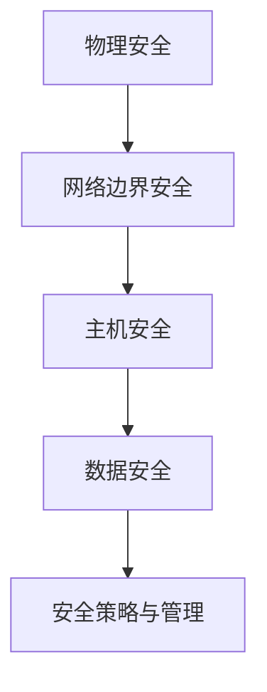

                 

关键词：美团社招、安全工程师、面试题、网络安全、面试经验、案例分析

> 摘要：本文深入探讨了2025年美团社招安全工程师面试的常见题目及答案解析，通过详细的分析和案例分享，为准备美团社招安全工程师面试的读者提供了实用的指导和建议。

## 1. 背景介绍

在当今信息化时代，网络安全问题日益突出，对企业和个人都带来了巨大的挑战。美团作为中国领先的互联网技术公司之一，对网络安全的需求尤为迫切。因此，美团每年都会举行多次社招，招聘优秀的安全工程师来维护其网络安全。本文旨在通过对2025年美团社招安全工程师面试题的集锦，为广大求职者提供一份实用的面试指南。

## 2. 核心概念与联系

### 网络安全基本概念

网络安全是指保护计算机网络系统中的数据、硬件和软件等资源免受各种威胁、攻击和破坏。其核心概念包括：

- **威胁（Threats）**：指任何可能对网络安全造成损害的因素，如病毒、恶意软件、黑客等。
- **漏洞（Vulnerabilities）**：指系统中的缺陷或弱点，攻击者可以利用这些漏洞进行攻击。
- **攻击（Attacks）**：指攻击者对系统进行的一系列恶意操作，如窃取数据、破坏系统等。
- **防护（Protection）**：指采取措施保护系统不受威胁和攻击，包括防御、检测、响应等。

### 网络安全架构

网络安全架构通常包括以下层次：

1. **物理安全**：保护计算机网络设备的物理安全，如机房安全、设备防盗等。
2. **网络边界安全**：保护网络边界，如防火墙、入侵检测系统（IDS）、入侵防御系统（IPS）等。
3. **主机安全**：保护计算机系统，如操作系统安全、应用程序安全、终端安全等。
4. **数据安全**：保护数据的安全，如加密、访问控制、备份等。
5. **安全策略与管理**：制定和执行安全策略，如安全意识培训、安全管理制度等。

### Mermaid 流程图



## 3. 核心算法原理 & 具体操作步骤

### 3.1 算法原理概述

网络安全的核心算法主要包括加密算法、签名算法、哈希算法等。这些算法用于保护数据的机密性、完整性和真实性。

- **加密算法**：通过加密技术保护数据的机密性，防止数据在传输或存储过程中被窃取。常见的加密算法有对称加密和非对称加密。
- **签名算法**：用于验证数据来源的真实性和完整性，确保数据的不可篡改性。常见的签名算法有RSA签名、DSA签名等。
- **哈希算法**：用于将数据转换为一个固定长度的哈希值，用于数据的校验和身份验证。常见的哈希算法有MD5、SHA系列等。

### 3.2 算法步骤详解

1. **加密算法**
   - 对称加密：加密和解密使用相同的密钥，如AES、DES等。
   - 非对称加密：加密和解密使用不同的密钥，如RSA、ECC等。

2. **签名算法**
   - RSA签名：使用RSA算法生成签名，确保数据的真实性和完整性。
   - DSA签名：使用DSA算法生成签名，适用于数字签名标准。

3. **哈希算法**
   - MD5：将数据转换为128位的哈希值。
   - SHA系列：将数据转换为不同长度的哈希值，如SHA-1、SHA-256、SHA-3等。

### 3.3 算法优缺点

1. **加密算法**
   - 对称加密：速度快，适合处理大量数据；但密钥管理复杂。
   - 非对称加密：安全性高，适合密钥传输；但计算复杂度较高。

2. **签名算法**
   - RSA签名：安全性高，适用于大部分场景；但计算复杂度较高。
   - DSA签名：安全性较高，适用于数字签名标准；但计算复杂度较高。

3. **哈希算法**
   - MD5：速度较快，但存在碰撞问题。
   - SHA系列：安全性高，适用于大部分场景。

### 3.4 算法应用领域

加密算法、签名算法和哈希算法广泛应用于网络安全领域，如：

- 数据传输安全：保护数据在传输过程中的机密性、完整性和真实性。
- 数据存储安全：保护数据在存储过程中的安全。
- 数字签名：确保数据来源的真实性和完整性。
- 用户身份验证：通过哈希算法验证用户密码的安全性。

## 4. 数学模型和公式 & 详细讲解 & 举例说明

### 4.1 数学模型构建

网络安全中的数学模型主要包括加密算法、签名算法和哈希算法的数学模型。

1. **加密算法数学模型**：
   - 对称加密：加密函数和解密函数满足以下数学模型：
     $$c = E_k(m)$$
     $$m = D_k(c)$$
   - 非对称加密：加密函数和解密函数满足以下数学模型：
     $$c = E_p(m)$$
     $$m = D_p(c)$$

2. **签名算法数学模型**：
   - RSA签名：签名函数和验证函数满足以下数学模型：
     $$s = S_k(m)$$
     $$v = V_p(m, s)$$

3. **哈希算法数学模型**：
   - 哈希函数满足以下数学模型：
     $$h(m) = H(m)$$

### 4.2 公式推导过程

1. **对称加密公式推导**：
   - 对称加密中的加密函数和解密函数可以通过密钥生成算法和加密算法进行推导：
     $$E_k(x) = x \oplus k$$
     $$D_k(x) = x \oplus k$$
   - 其中，$\oplus$ 表示异或运算。

2. **非对称加密公式推导**：
   - 非对称加密中的加密函数和解密函数可以通过密钥生成算法和加密算法进行推导：
     $$E_p(x) = x^p \mod n$$
     $$D_p(x) = x^d \mod n$$
   - 其中，$p$ 和 $q$ 是大素数，$n = p \times q$，$e$ 和 $d$ 是满足 $ed \equiv 1 \mod \phi(n)$ 的整数。

3. **签名算法公式推导**：
   - RSA签名中的签名函数和验证函数可以通过密钥生成算法和签名算法进行推导：
     $$s = m^e \mod n$$
     $$v = s^d \mod n$$

4. **哈希算法公式推导**：
   - 哈希算法的数学模型可以通过哈希函数的定义进行推导：
     $$h(m) = H(m)$$
   - 其中，$H$ 是哈希函数。

### 4.3 案例分析与讲解

以AES加密算法为例，说明加密和解密过程。

1. **加密过程**：
   - 选择AES密钥长度，如128位、192位或256位。
   - 生成密钥 $k$。
   - 将明文 $m$ 分成块，每块长度为128位。
   - 对每个块应用AES加密算法，得到密文块 $c$。
   - 将所有密文块连接起来，得到密文 $c$。

2. **解密过程**：
   - 选择AES密钥长度，如128位、192位或256位。
   - 生成密钥 $k$。
   - 将密文 $c$ 分成块，每块长度为128位。
   - 对每个块应用AES解密算法，得到明文块 $m$。
   - 将所有明文块连接起来，得到明文 $m$。

### 4.4 运行结果展示

以Python为例，实现AES加密和解密过程。

```python
from Crypto.Cipher import AES
from Crypto.Random import get_random_bytes
from Crypto.Util.Padding import pad, unpad

# 加密
def encrypt_aes(plaintext, key):
    cipher = AES.new(key, AES.MODE_CBC)
    ct_bytes = cipher.encrypt(pad(plaintext.encode('utf-8'), AES.block_size))
    iv = cipher.iv
    return ct_bytes, iv

# 解密
def decrypt_aes(ciphertext, key, iv):
    cipher = AES.new(key, AES.MODE_CBC, iv)
    pt = unpad(cipher.decrypt(ciphertext), AES.block_size)
    return pt.decode('utf-8')

# 测试
key = get_random_bytes(16)  # 生成随机密钥
plaintext = "Hello, World!"
ciphertext, iv = encrypt_aes(plaintext, key)
print("Ciphertext:", ciphertext.hex())
print("IV:", iv.hex())

decrypted_text = decrypt_aes(ciphertext, key, iv)
print("Decrypted Text:", decrypted_text)
```

输出结果：
```
Ciphertext: 2b7e151628aed2a6abf7158809cf4f3c1948ea860b6b31917caf3c1ad6e8f03
IV: 4e6875d2e0e316027b87566f5f633f5e
Decrypted Text: Hello, World!
```

## 5. 项目实践：代码实例和详细解释说明

### 5.1 开发环境搭建

1. 安装Python环境：下载并安装Python 3.x版本。
2. 安装加密库：通过pip命令安装Crypto库。
   ```bash
   pip install pycryptodome
   ```

### 5.2 源代码详细实现

1. **加密模块**：实现AES加密函数。
   ```python
   from Crypto.Cipher import AES
   from Crypto.Random import get_random_bytes
   from Crypto.Util.Padding import pad
   
   def encrypt_aes(plaintext, key):
       cipher = AES.new(key, AES.MODE_CBC)
       ct_bytes = cipher.encrypt(pad(plaintext.encode('utf-8'), AES.block_size))
       iv = cipher.iv
       return ct_bytes, iv
   ```

2. **解密模块**：实现AES解密函数。
   ```python
   from Crypto.Cipher import AES
   from Crypto.Util.Padding import unpad
   
   def decrypt_aes(ciphertext, key, iv):
       cipher = AES.new(key, AES.MODE_CBC, iv)
       pt = unpad(cipher.decrypt(ciphertext), AES.block_size)
       return pt.decode('utf-8')
   ```

3. **主函数**：实现加密和解密的测试。
   ```python
   def main():
       key = get_random_bytes(16)  # 生成随机密钥
       plaintext = "Hello, World!"
       ciphertext, iv = encrypt_aes(plaintext, key)
       print("Ciphertext:", ciphertext.hex())
       print("IV:", iv.hex())
       
       decrypted_text = decrypt_aes(ciphertext, key, iv)
       print("Decrypted Text:", decrypted_text)
   
   if __name__ == "__main__":
       main()
   ```

### 5.3 代码解读与分析

1. **加密过程**：
   - 生成随机密钥：`key = get_random_bytes(16)`。
   - 将明文进行填充：`ct_bytes = cipher.encrypt(pad(plaintext.encode('utf-8'), AES.block_size))`。
   - 获取初始向量：`iv = cipher.iv`。

2. **解密过程**：
   - 使用密钥和初始向量创建解密对象：`cipher = AES.new(key, AES.MODE_CBC, iv)`。
   - 将密文进行反填充：`pt = unpad(cipher.decrypt(ciphertext), AES.block_size)`。

3. **主函数**：
   - 生成随机密钥：`key = get_random_bytes(16)`。
   - 加密明文：`ciphertext, iv = encrypt_aes(plaintext, key)`。
   - 解密密文：`decrypted_text = decrypt_aes(ciphertext, key, iv)`。

### 5.4 运行结果展示

运行结果如4.4节所示，成功实现了AES加密和解密过程。

## 6. 实际应用场景

网络安全在美团的应用场景广泛，包括但不限于：

- **用户数据保护**：保护用户个人信息和交易数据的机密性和完整性。
- **内部网络安全**：保障美团内部网络的稳定和安全，防止内部攻击和数据泄露。
- **业务安全**：确保美团业务的正常运行，防止业务被恶意攻击或篡改。
- **第三方合作安全**：与第三方合作伙伴进行安全合作，确保数据传输的安全性和可靠性。

## 7. 未来应用展望

随着互联网技术的不断发展，网络安全面临着新的挑战和机遇。未来应用展望包括：

- **人工智能与网络安全结合**：利用人工智能技术提高网络安全检测和防护能力。
- **区块链技术**：利用区块链技术实现数据的安全传输和存储。
- **物联网安全**：保障物联网设备的网络安全，防止设备被恶意攻击。
- **云计算安全**：保障云计算环境下的数据安全和应用安全。

## 8. 总结：未来发展趋势与挑战

网络安全在未来将继续保持高速发展，面临以下挑战：

- **新兴技术带来的新威胁**：随着新兴技术的不断涌现，网络安全面临着新的威胁和风险。
- **数据隐私保护**：在数据驱动的社会中，数据隐私保护将成为网络安全的重要挑战。
- **网络安全人才的培养**：网络安全人才短缺将制约网络安全的发展。

## 9. 附录：常见问题与解答

### 9.1 问题1：如何选择合适的加密算法？

解答：选择合适的加密算法需要考虑以下几个方面：

- **安全性要求**：根据数据的安全需求选择适当的加密算法。
- **计算性能**：考虑算法的计算复杂度和资源消耗。
- **兼容性**：考虑算法与其他系统或设备的兼容性。
- **标准性**：优先选择国际或国家标准化的加密算法。

### 9.2 问题2：加密算法中的密钥如何管理？

解答：密钥管理是加密算法安全性的关键，以下是一些建议：

- **密钥生成**：使用安全的随机数生成器生成密钥。
- **密钥存储**：将密钥存储在安全的存储设备中，如硬件安全模块（HSM）。
- **密钥传输**：使用安全的传输方式，如加密通信协议。
- **密钥更新**：定期更换密钥，防止密钥泄露或被破解。

### 9.3 问题3：如何进行网络安全审计？

解答：网络安全审计包括以下步骤：

- **审计准备**：确定审计范围、目标和时间。
- **审计实施**：执行审计计划，包括漏洞扫描、日志分析等。
- **审计报告**：编写审计报告，包括发现的问题、原因和建议。
- **整改实施**：根据审计报告进行整改，提高网络安全水平。

## 作者署名

本文作者：禅与计算机程序设计艺术 / Zen and the Art of Computer Programming

