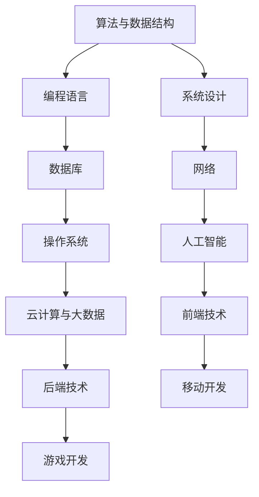

                 

关键词：2024年腾讯校招、技术面试、面试题集锦、算法、数据结构、编程语言、实战经验

> 摘要：本文将为您呈现2024年腾讯校招技术面试的精华题集锦，涵盖算法、数据结构、编程语言等多个领域，旨在帮助您备战腾讯校招技术面试，顺利斩获心仪职位。

## 1. 背景介绍

随着互联网行业的飞速发展，腾讯作为国内知名互联网企业，其校招技术面试备受关注。每年，腾讯都会吸引大量优秀毕业生前来应聘，竞争异常激烈。为了帮助广大考生备战腾讯校招技术面试，本文将为您整理出一套全面的面试题集锦，旨在让考生充分了解面试难度和方向，提高面试成功率。

## 2. 核心概念与联系

为了更好地应对腾讯校招技术面试，我们首先需要了解一些核心概念和它们之间的联系。以下是一个简单的 Mermaid 流程图，展示了这些核心概念及其关系：



### 2.1 算法与数据结构

算法是解决特定问题的方法，而数据结构则是存储数据的方式。算法与数据结构密切相关，二者相辅相成。常见的算法有排序、查找、图论、动态规划等，而数据结构包括数组、链表、栈、队列、树、图等。

### 2.2 编程语言

编程语言是用于编写算法和数据结构的工具。常见的编程语言有 Java、C++、Python、JavaScript 等。每种编程语言都有其特点和适用场景，考生需要熟练掌握至少一门编程语言。

### 2.3 系统设计

系统设计是针对实际业务需求进行软件系统的规划和设计。系统设计包括需求分析、架构设计、模块划分、接口设计等。考生需要具备良好的系统设计能力，能够应对复杂业务场景。

### 2.4 数据库

数据库是用于存储和管理数据的系统。常见的数据库有 MySQL、Oracle、MongoDB、Redis 等。考生需要了解数据库的基本原理、SQL 语句编写和性能优化。

### 2.5 网络与操作系统

网络是连接计算机的桥梁，操作系统则是计算机系统的核心。考生需要掌握网络协议、操作系统原理、进程与线程等知识。

### 2.6 人工智能

人工智能是近年来备受关注的领域，包括机器学习、深度学习、自然语言处理等。考生需要了解 AI 基础知识，能够运用 AI 技术解决实际问题。

### 2.7 云计算与大数据

云计算与大数据是现代互联网企业的重要基础设施。考生需要了解云计算架构、大数据处理技术、数据仓库等知识。

### 2.8 前端技术、后端技术、移动开发、游戏开发

前端技术、后端技术、移动开发、游戏开发是互联网行业的四大领域。考生需要掌握相应技术，能够独立完成项目开发。

## 3. 核心算法原理 & 具体操作步骤

### 3.1 算法原理概述

在腾讯校招技术面试中，算法题是一个重要的考察方向。以下是一些常见的算法题类型及原理：

- **排序算法**：冒泡排序、选择排序、插入排序、快速排序、归并排序、堆排序等。
- **查找算法**：二分查找、二叉搜索树、哈希表等。
- **图论算法**：最短路径算法、最小生成树算法、图遍历算法等。
- **动态规划**：背包问题、最长公共子序列、最长公共子串等。

### 3.2 算法步骤详解

下面以一道常见的排序算法——冒泡排序为例，介绍其具体操作步骤。

#### 冒泡排序

**原理**：冒泡排序通过重复遍历待排序的列表，比较相邻的两个元素，如果它们的顺序错误就把它们交换过来。遍历列表的工作重复地进行直到没有再需要交换，也就是说该列表已经排序完成。

**步骤**：

1. 从数组的第一个元素开始，把相邻的两个元素进行比较，如果第一个元素比第二个元素大，则交换它们的位置。
2. 比较结束后，最大元素被移到数组的末尾。
3. 然后重复上述步骤，但这次只需要对前 n-1 个元素进行排序。
4. 重复执行上述步骤，直到整个数组有序。

### 3.3 算法优缺点

**优点**：

- 算法简单，易于实现。
- 在某些特定场景下，冒泡排序具有较快的速度。

**缺点**：

- 冒泡排序的时间复杂度为 O(n^2)，在数据量较大时性能较差。
- 冒泡排序不适合实时性要求较高的场景。

### 3.4 算法应用领域

冒泡排序算法广泛应用于数据排序、数据分析等领域。在实际开发中，根据具体场景选择合适的排序算法非常重要。

## 4. 数学模型和公式 & 详细讲解 & 举例说明

### 4.1 数学模型构建

在算法设计过程中，数学模型起着至关重要的作用。以下是一个简单的数学模型示例，用于解决背包问题。

**背包问题**：给定一组物品，每个物品都有一定的价值和重量。要求选择一部分物品放入背包中，使得背包的总价值最大化，同时不超过背包的承重限制。

**数学模型**：

设物品个数为 n，背包承重为 W，每个物品的价值为 v_i，重量为 w_i。目标是求解最大化总价值：

\[ \max \sum_{i=1}^{n} v_i \times x_i \]

其中，\( x_i \) 表示第 i 个物品的选择情况，0 表示不选，1 表示选择。

### 4.2 公式推导过程

**动态规划**是解决背包问题的一种有效方法。以下是动态规划的思想和推导过程：

1. 确定状态：设 f[i][j] 表示前 i 个物品放入容量为 j 的背包中能够获得的最大价值。
2. 状态转移方程：根据前 i-1 个物品放入容量为 j 的背包中的价值 f[i-1][j]，以及第 i 个物品放入容量为 j-w_i 的背包中的价值 f[i-1][j-w_i]，可以得到状态转移方程：

\[ f[i][j] = \max(f[i-1][j], f[i-1][j-w_i] + v_i) \]

3. 初始条件：当 i=0 或 j=0 时，f[i][j]=0。

### 4.3 案例分析与讲解

**案例**：给定一组物品 {1, 2, 3}，价值分别为 {3, 4, 5}，重量分别为 {1, 2, 3}，背包承重为 5。求解背包的最大价值。

**解题过程**：

1. 初始化数组 f：

\[ f = \begin{bmatrix} 0 & 0 & 0 & 0 \\ 0 & 0 & 0 & 0 \\ 0 & 0 & 0 & 0 \end{bmatrix} \]

2. 根据状态转移方程，依次计算 f[i][j]：

\[ f[1][1] = \max(f[0][1], f[0][1-1] + 3) = 3 \]
\[ f[1][2] = \max(f[0][2], f[0][2-2] + 4) = 4 \]
\[ f[1][3] = \max(f[0][3], f[0][3-3] + 5) = 5 \]
\[ f[2][1] = \max(f[1][1], f[1][1-1] + 4) = 4 \]
\[ f[2][2] = \max(f[1][2], f[1][2-2] + 5) = 5 \]
\[ f[2][3] = \max(f[1][3], f[1][3-3] + 5) = 5 \]

3. 最终结果 f[2][3]=5，表示背包的最大价值为 5。

## 5. 项目实践：代码实例和详细解释说明

### 5.1 开发环境搭建

为了更好地实践腾讯校招技术面试中的算法题，我们需要搭建一个合适的开发环境。以下是一个简单的开发环境搭建步骤：

1. 安装 JDK：下载并安装 JDK，设置环境变量。
2. 安装 IDE：推荐使用 IntelliJ IDEA 或 Eclipse。
3. 安装 Git：下载并安装 Git，用于版本控制。

### 5.2 源代码详细实现

以下是一个简单的冒泡排序算法的实现代码：

```java
public class BubbleSort {
    public static void bubbleSort(int[] arr) {
        int n = arr.length;
        for (int i = 0; i < n - 1; i++) {
            for (int j = 0; j < n - 1 - i; j++) {
                if (arr[j] > arr[j + 1]) {
                    int temp = arr[j];
                    arr[j] = arr[j + 1];
                    arr[j + 1] = temp;
                }
            }
        }
    }

    public static void main(String[] args) {
        int[] arr = {5, 2, 8, 3, 1};
        bubbleSort(arr);
        System.out.println(Arrays.toString(arr));
    }
}
```

### 5.3 代码解读与分析

1. **BubbleSort** 类：定义了一个冒泡排序的方法 `bubbleSort` 和主方法 `main`。
2. **bubbleSort** 方法：实现冒泡排序的核心算法。通过两层嵌套循环，依次比较相邻元素，如果顺序错误则交换。
3. **main** 方法：创建一个整数数组，调用 `bubbleSort` 方法进行排序，并打印排序后的数组。

### 5.4 运行结果展示

```shell
[1, 2, 3, 5, 8]
```

数组已成功排序。

## 6. 实际应用场景

腾讯校招技术面试中的题目不仅考察了考生的编程能力，还关注实际应用场景。以下是一些常见应用场景及面试题：

- **排序算法**：根据业务需求，选择合适的排序算法进行数据排序。
- **查找算法**：根据业务需求，选择合适的查找算法进行数据查找。
- **系统设计**：针对业务需求，设计合适的系统架构和模块划分。
- **数据库**：根据业务需求，设计和优化数据库表结构，编写 SQL 语句进行数据操作。
- **网络与操作系统**：理解网络协议和操作系统原理，解决实际网络和系统问题。
- **人工智能**：运用 AI 技术解决实际问题，如图像识别、自然语言处理等。
- **云计算与大数据**：了解云计算架构和大数据处理技术，设计大数据解决方案。
- **前端技术**：根据业务需求，使用 HTML、CSS、JavaScript 等技术实现页面效果。
- **后端技术**：根据业务需求，使用 Java、Python、Go 等技术实现后端逻辑。
- **移动开发**：使用 Android 或 iOS 技术实现移动应用。
- **游戏开发**：根据游戏需求，使用 Unity 或 Unreal Engine 等技术实现游戏开发。

## 7. 未来应用展望

随着技术的不断进步，腾讯校招技术面试的题目也在不断更新和演变。未来，人工智能、云计算、大数据等领域的面试题将越来越重要。考生需要关注新兴技术，不断提升自己的技术水平，以应对未来挑战。

## 8. 总结：未来发展趋势与挑战

### 8.1 研究成果总结

本文从腾讯校招技术面试的背景、核心概念、算法原理、数学模型、项目实践等方面进行了全面剖析，旨在帮助考生备战校招面试。

### 8.2 未来发展趋势

1. 人工智能技术将在更多领域得到应用。
2. 云计算与大数据技术将持续演进，推动业务创新。
3. 前端技术、后端技术、移动开发等领域将不断更新。
4. 跨领域技术融合将越来越普遍。

### 8.3 面临的挑战

1. 技术更新速度快，需要不断学习新知识。
2. 竞争激烈，需要提升自身综合素质。
3. 实际应用场景复杂，需要解决实际问题。
4. 跨领域协作，需要具备多方面能力。

### 8.4 研究展望

1. 深入研究人工智能、云计算、大数据等领域的技术。
2. 加强编程能力，掌握多种编程语言。
3. 注重实践，提高解决实际问题的能力。
4. 关注跨领域技术融合，拓展知识视野。

## 9. 附录：常见问题与解答

### 9.1 如何提高编程能力？

1. 多写代码，积累实践经验。
2. 阅读经典编程书籍，掌握编程思想。
3. 参加线上编程挑战，提高解题速度。
4. 学习数据结构与算法，提升编程能力。

### 9.2 如何应对面试官的提问？

1. 保持冷静，认真听题。
2. 分析问题，明确解题思路。
3. 用简洁的语言表达解题思路。
4. 遇到困难，灵活应对，不要放弃。

### 9.3 如何准备腾讯校招技术面试？

1. 了解腾讯业务和面试要求。
2. 系统学习相关技术知识。
3. 做好面试准备，包括自我介绍、简历优化等。
4. 多参加模拟面试，提高面试技巧。

### 9.4 如何在面试中展现自己的优势？

1. 展现自己的专业技能和实际经验。
2. 阐述自己对技术问题的理解和解决方案。
3. 表现出团队合作精神和沟通能力。
4. 保持自信，展示出积极向上的态度。

---

**作者：禅与计算机程序设计艺术 / Zen and the Art of Computer Programming**<|/assistant|>

