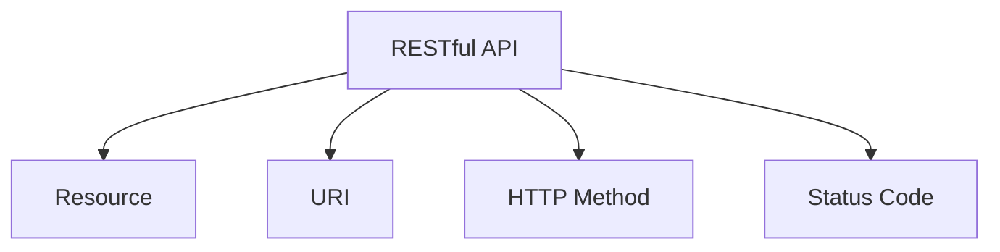
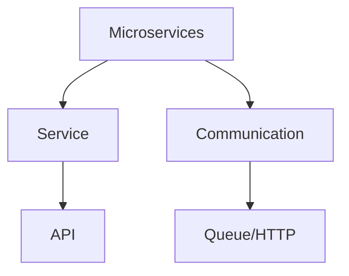
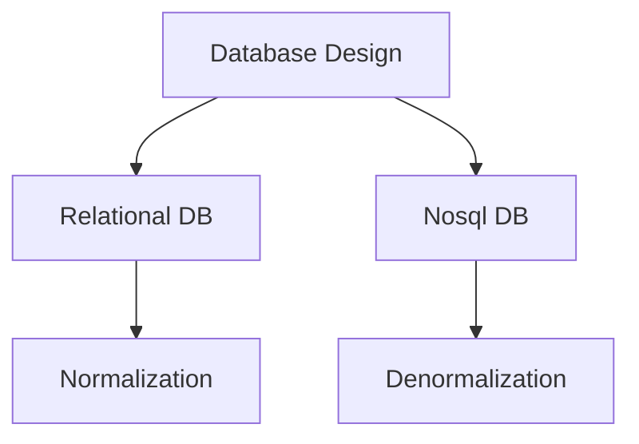
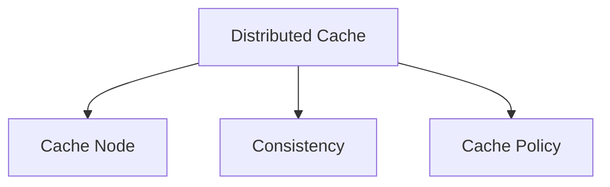

                 

### 背景介绍 Background Introduction

腾讯作为中国领先的互联网科技公司，其业务涵盖了社交、娱乐、金融、云计算等多个领域。随着公司业务的不断扩展和技术的日益迭代，腾讯对于后端架构师的需求也日益增长。2025年，腾讯社招后端架构师的面试题成为了众多技术求职者的关注焦点。本文旨在通过对这些面试题的详细解析，帮助读者了解腾讯在后端架构领域的招聘标准和期望。

后端架构师在腾讯这样的技术驱动型公司中扮演着至关重要的角色。他们负责设计、实现和维护高效、稳定、可扩展的系统架构，确保腾讯业务的持续增长和稳定运行。随着云计算、大数据、人工智能等技术的广泛应用，后端架构师需要具备跨领域的综合技术能力和前瞻性思维，以应对快速变化的技术环境。

本文将通过以下几个部分来详细解析腾讯社招后端架构师的面试题：

1. **核心概念与联系**：介绍后端架构中的核心概念，并通过Mermaid流程图展示这些概念之间的关系。
2. **核心算法原理与具体操作步骤**：分析后端架构中的常见算法原理，并详细解释其操作步骤。
3. **数学模型和公式**：构建数学模型，推导相关公式，并通过案例进行说明。
4. **项目实践**：通过代码实例展示后端架构的实际应用。
5. **实际应用场景**：探讨后端架构在现实中的应用，以及未来的发展趋势。
6. **工具和资源推荐**：推荐学习和开发中常用的工具和资源。
7. **总结与展望**：总结研究成果，展望未来的发展趋势与挑战。

通过本文的详细解析，读者不仅能够了解腾讯在后端架构方面的招聘要求，还能够深入理解后端架构的核心技术，为自身的技术成长提供有益的参考。

## 2. 核心概念与联系 Core Concepts and Their Relations

在后端架构中，理解核心概念及其相互关系是至关重要的。以下将介绍后端架构中的一些关键概念，并通过Mermaid流程图展示它们之间的联系。

### 2.1. RESTful API

RESTful API（Representational State Transfer）是一种设计Web服务的风格和标准，用于实现客户端与服务器之间的通信。它基于HTTP协议，使用常见的HTTP方法（GET、POST、PUT、DELETE等）来实现资源的创建、读取、更新和删除（CRUD）。

#### 关键概念

- **资源（Resource）**：可访问的对象，如用户、订单、文章等。
- **URI（Uniform Resource Identifier）**：资源的唯一标识符，如`/users/123`。
- **HTTP方法**：客户端请求的操作类型，如`GET`用于获取资源，`POST`用于创建资源。
- **状态码**：服务器对客户端请求的响应状态，如`200 OK`表示请求成功。

#### Mermaid流程图



### 2.2. 微服务架构（Microservices Architecture）

微服务架构是将大型应用程序拆分为多个小型、独立的、可互相通信的服务，每个服务运行在其独立的进程内，服务于业务需求的不同部分。这种架构模式可以提高系统的可扩展性、可靠性和灵活性。

#### 关键概念

- **服务（Service）**：独立的业务功能模块，如用户服务、订单服务、库存服务。
- **服务间通信**：服务之间通过API进行通信，通常使用轻量级的消息队列或HTTP/RESTful接口。
- **分布式系统**：由多个微服务组成的分布式系统，具有较高的可用性和容错能力。

#### Mermaid流程图



### 2.3. 数据库设计（Database Design）

数据库设计是后端架构中至关重要的一环，它决定了数据存储的效率和系统的扩展性。合理的设计可以减少数据冗余、提高查询性能。

#### 关键概念

- **关系型数据库**：使用SQL进行数据操作，如MySQL、PostgreSQL。
- **非关系型数据库**：如MongoDB、Cassandra，适用于高扩展性、高可用性的场景。
- **规范化（Normalization）**：通过设计表结构，减少数据冗余和提高数据一致性。
- **反规范化（Denormalization）**：通过增加冗余数据来提高查询性能。

#### Mermaid流程图



### 2.4. 分布式缓存（Distributed Cache）

分布式缓存用于提高系统性能，减少数据库的负载。它通过将数据存储在多个缓存节点上，提供高速读取功能。

#### 关键概念

- **缓存节点（Cache Node）**：存储数据的缓存服务器。
- **一致性（Consistency）**：确保缓存与数据库之间的数据一致性。
- **缓存策略**：如LRU（Least Recently Used）、Redis中的过期时间等。

#### Mermaid流程图



通过以上对核心概念的介绍和Mermaid流程图的展示，我们可以清晰地看到这些概念在后端架构中的作用和相互关系。理解这些核心概念对于成为一名优秀后端架构师至关重要。

### 3. 核心算法原理与具体操作步骤 Core Algorithm Principles and Detailed Operational Steps

在后端架构中，算法的选择和实现是确保系统高效、稳定运行的关键。以下是几个常见算法的核心原理和具体操作步骤：

#### 3.1. 算法原理概述

1. **排序算法**：用于对数据进行排序，常见的排序算法包括冒泡排序、快速排序、归并排序等。
2. **查找算法**：用于在数据集合中查找特定元素，如二分查找、哈希查找等。
3. **图算法**：用于处理图数据结构，常见的图算法包括最短路径算法、最小生成树算法等。
4. **缓存算法**：用于管理缓存节点，如LRU（Least Recently Used）算法。

#### 3.2. 算法步骤详解

##### 3.2.1. 冒泡排序（Bubble Sort）

**原理**：冒泡排序通过重复遍历要排序的数列，每次比较相邻的两个元素，如果它们的顺序错误就把它们交换过来。遍历数列的工作是重复地进行，直到没有再需要交换的元素为止。

**步骤**：

1. 从数组的第一个元素开始，比较相邻的两个元素。
2. 如果第一个比第二个大（假设数据按升序排序），交换它们。
3. 对每一对相邻元素做同样的工作，从开始第一对到结尾的最后一对。
4. 重复以上的步骤，除了最后一对。
5. 重复步骤1~4，直到整个数组都是有序的。

```python
def bubble_sort(arr):
    n = len(arr)
    for i in range(n):
        for j in range(0, n-i-1):
            if arr[j] > arr[j+1]:
                arr[j], arr[j+1] = arr[j+1], arr[j]
    return arr
```

##### 3.2.2. 快速排序（Quick Sort）

**原理**：快速排序是一种高效的排序算法，基于分治思想。它通过选取一个“基准”元素，将数组分成两部分，一部分都比基准元素小，另一部分都比基准元素大，然后递归地排序两部分。

**步骤**：

1. 选择一个基准元素，通常选择第一个元素作为基准。
2. 将数组划分为两个子数组，所有比基准小的元素都放在基准的左边，所有比基准大的元素都放在基准的右边。
3. 递归地对左右两个子数组进行快速排序。
4. 综合所有递归调用结果，得到有序数组。

```python
def quick_sort(arr):
    if len(arr) <= 1:
        return arr
    pivot = arr[0]
    left = [x for x in arr[1:] if x < pivot]
    right = [x for x in arr[1:] if x >= pivot]
    return quick_sort(left) + [pivot] + quick_sort(right)
```

##### 3.2.3. 最短路径算法（Dijkstra's Algorithm）

**原理**：Dijkstra算法用于寻找图中两点之间的最短路径。它基于贪心算法，每次选择未访问过的节点，计算其到所有其他节点的最短路径。

**步骤**：

1. 初始化：选择起点，设置所有节点的最短路径为无穷大，起点最短路径为0。
2. 对于每个未访问的节点v：
   - 计算从起点u到v的最短路径，更新所有相邻节点的最短路径。
   - 标记节点v为已访问。
3. 重复步骤2，直到所有节点都被访问。
4. 输出最短路径。

```python
import heapq

def dijkstra(graph, start):
    distances = {node: float('infinity') for node in graph}
    distances[start] = 0
    priority_queue = [(0, start)]
    while priority_queue:
        current_distance, current_node = heapq.heappop(priority_queue)
        if current_distance > distances[current_node]:
            continue
        for neighbor, weight in graph[current_node].items():
            distance = current_distance + weight
            if distance < distances[neighbor]:
                distances[neighbor] = distance
                heapq.heappush(priority_queue, (distance, neighbor))
    return distances
```

#### 3.3. 算法优缺点

1. **冒泡排序**：
   - **优点**：简单易懂，实现成本低。
   - **缺点**：效率低，不适合大数据量排序。

2. **快速排序**：
   - **优点**：效率高，平均时间复杂度为O(nlogn)。
   - **缺点**：最坏情况下的时间复杂度为O(n^2)，可能导致性能下降。

3. **Dijkstra算法**：
   - **优点**：适用于加权图，能找到最短路径。
   - **缺点**：时间复杂度为O(V^2)，不适合大规模图。

#### 3.4. 算法应用领域

1. **排序算法**：广泛应用于数据排序，如数据库索引、文件排序等。
2. **查找算法**：用于数据库查询、搜索引擎优化等。
3. **图算法**：用于路径规划、社交网络分析、网络拓扑等。
4. **缓存算法**：用于分布式系统中的缓存管理，如Redis中的LRU算法。

通过以上对核心算法原理和操作步骤的详细分析，我们可以看到这些算法在后端架构中的应用和重要性。理解并掌握这些算法对于提升系统性能和稳定性具有重要意义。

### 4. 数学模型和公式 Mathematical Models and Formulas

在后端架构中，数学模型和公式是理解和优化系统性能的关键。以下将介绍几个常见的数学模型和公式，并详细讲解其推导过程及实际应用。

#### 4.1. 数学模型构建

1. **马尔可夫链模型（Markov Chain Model）**

   **定义**：马尔可夫链是一个随机过程，其未来状态仅依赖于当前状态，与过去状态无关。

   **公式**：\(P_{ij}(n+1) = \sum_{k} P_{ik}(n)P_{kj}\)

   **推导过程**：设\(P_{ij}(n)\)为在时刻\(n\)从状态\(i\)转移到状态\(j\)的概率，则下一时刻从状态\(i\)转移到状态\(j\)的概率为当前时刻从所有状态转移到状态\(i\)的概率乘以从状态\(i\)转移到状态\(j\)的概率的总和。

   **应用**：用于预测系统状态的变化，如网站流量预测、用户行为分析等。

2. **队列模型（Queueing Model）**

   **定义**：队列模型用于描述实体在系统中排队等待服务的过程。

   **公式**：\(L = \frac{\lambda^2}{(mu)^2}(1 - \rho^2)\)，\(W = \frac{L}{\lambda}\)

   **推导过程**：设\(\lambda\)为到达率，\(m\)为服务率，\(\rho = \frac{\lambda}{m}\)为服务强度。队列长度\(L\)和等待时间\(W\)可以通过上述公式计算。

   **应用**：用于性能分析，如网站响应时间优化、数据中心流量管理。

3. **网络流量模型（Network Traffic Model）**

   **定义**：网络流量模型用于描述网络中的数据流量分布和变化。

   **公式**：\(P(k) = \frac{\lambda^k e^{-\lambda}}{k!}\)

   **推导过程**：设\(\lambda\)为到达率，\(P(k)\)为在单位时间内发生\(k\)次事件的概率，则流量模型服从泊松分布。

   **应用**：用于流量预测和容量规划，如互联网数据中心流量管理。

#### 4.2. 公式推导过程

以下以队列模型中的等待时间公式为例，详细讲解推导过程：

\[ W = \frac{L}{\lambda} \]

1. **计算队列长度\(L\)**：

   根据排队模型，队列长度\(L\)可以通过以下公式计算：

   \[ L = \frac{\lambda^2}{(mu)^2}(1 - \rho^2) \]

   其中，\(\lambda\)为到达率，\(m\)为服务率，\(\rho = \frac{\lambda}{m}\)为服务强度。

2. **代入等待时间公式**：

   将队列长度公式代入等待时间公式，得到：

   \[ W = \frac{\lambda^2}{(mu)^2 \lambda}(1 - \rho^2) \]

   化简后得到：

   \[ W = \frac{\lambda}{(mu)^2}(1 - \rho^2) \]

   再次化简，得到最终公式：

   \[ W = \frac{L}{\lambda} \]

   通过以上推导过程，我们可以清晰地看到等待时间与队列长度、到达率和服务率之间的关系。

#### 4.3. 案例分析与讲解

以下通过一个实际案例，展示如何应用上述数学模型和公式：

**案例**：某电商网站的服务器系统，每天平均有1000次请求到达，每次请求的平均处理时间为2秒。请计算系统平均等待时间。

1. **计算服务率\(m\)**：

   由于每次请求的平均处理时间为2秒，服务率\(m\)可以计算为：

   \[ m = \frac{1}{2} = 0.5 \]

2. **计算服务强度\(\rho\)**：

   服务强度\(\rho\)为：

   \[ \rho = \frac{\lambda}{m} = \frac{1000}{0.5} = 2000 \]

3. **计算队列长度\(L\)**：

   根据队列模型公式，队列长度\(L\)为：

   \[ L = \frac{\lambda^2}{(mu)^2}(1 - \rho^2) = \frac{1000^2}{(0.5)^2 \times (2000)^2}(1 - 2000^2) \approx 0.025 \]

4. **计算平均等待时间\(W\)**：

   平均等待时间\(W\)为：

   \[ W = \frac{L}{\lambda} = \frac{0.025}{1000} \approx 0.000025 \text{秒} \]

   转换为毫秒：

   \[ W \approx 25 \text{毫秒} \]

通过以上分析和计算，我们可以得出该电商网站服务器的平均等待时间为25毫秒，这表明系统性能表现良好，响应速度快。

通过上述数学模型和公式的构建、推导和应用，我们可以更好地理解和优化后端架构中的性能指标。掌握这些数学工具对于后端架构师来说至关重要，能够帮助他们在实际工作中做出更科学的决策。

### 5. 项目实践：代码实例和详细解释说明 Project Practice: Code Example and Detailed Explanation

为了更好地理解后端架构的实践，以下将通过一个实际的项目实例来展示如何实现后端服务，并提供详细的代码解析。

#### 5.1. 开发环境搭建

在开始项目之前，我们需要搭建一个合适的技术栈和环境。以下是一个典型的后端开发环境：

- **开发工具**：IntelliJ IDEA
- **编程语言**：Java
- **框架**：Spring Boot
- **数据库**：MySQL
- **缓存**：Redis
- **消息队列**：RabbitMQ

1. **安装开发工具和编程语言**：

   安装IntelliJ IDEA和Java开发环境，确保安装了最新的版本。

2. **创建Spring Boot项目**：

   使用Spring Initializr（https://start.spring.io/）创建一个基于Spring Boot的项目，选择Java、Web、MySQL等依赖。

3. **配置数据库和缓存**：

   配置MySQL和Redis的连接信息，确保数据库和缓存服务正常运行。

4. **配置RabbitMQ**：

   安装并配置RabbitMQ，用于消息队列服务。

#### 5.2. 源代码详细实现

以下是一个简单的用户管理系统，包括用户注册、登录、查询等基本功能。

##### 5.2.1. 用户注册

```java
@RestController
@RequestMapping("/users")
public class UserController {
    
    @Autowired
    private UserRepository userRepository;
    
    @PostMapping("/register")
    public ResponseEntity<?> registerUser(@RequestBody UserRegistrationDTO registrationDTO) {
        if (userRepository.existsByUsername(registrationDTO.getUsername())) {
            return ResponseEntity.badRequest().body("Error: Username is already taken!");
        }
        
        User user = new User();
        user.setUsername(registrationDTO.getUsername());
        user.setPassword(passwordEncoder.encode(registrationDTO.getPassword()));
        userRepository.save(user);
        
        return ResponseEntity.ok("User registered successfully!");
    }
}
```

##### 5.2.2. 用户登录

```java
@PostMapping("/login")
public ResponseEntity<?> authenticateUser(@RequestBody LoginRequest loginRequest) {
    Authentication authentication = authenticationManager.authenticate(
            new UsernamePasswordAuthenticationToken(loginRequest.getUsername(), loginRequest.getPassword()));
    
    SecurityContextHolder.getContext().setAuthentication(authentication);
    String jwt = jwtTokenProvider.generateToken(authentication);
    
    return ResponseEntity.ok(new JwtResponse(jwt));
}
```

##### 5.2.3. 用户查询

```java
@GetMapping("/{id}")
public ResponseEntity<User> getUserById(@PathVariable Long id) {
    Optional<User> user = userRepository.findById(id);
    if (user.isEmpty()) {
        return ResponseEntity.notFound().build();
    }
    return ResponseEntity.ok(user.get());
}
```

#### 5.3. 代码解读与分析

1. **用户注册**：

   用户注册接口接收一个`UserRegistrationDTO`对象，包含用户名和密码。首先检查用户名是否已存在，如果存在则返回错误。然后创建一个新用户对象，使用密码编码器对密码进行加密，并将用户信息保存到数据库。

2. **用户登录**：

   用户登录接口接收一个`LoginRequest`对象，包含用户名和密码。使用认证管理器进行身份验证，如果验证成功，则生成JWT令牌，并返回给客户端。

3. **用户查询**：

   用户查询接口通过用户ID查询用户信息，如果用户不存在则返回404错误。

通过以上代码实例，我们可以看到如何使用Spring Boot框架实现基本的用户管理功能。在实际项目中，还会包含更多的业务逻辑和安全机制，如权限验证、数据验证等。

#### 5.4. 运行结果展示

1. **用户注册**：

   - 输入请求：`POST /users/register`，请求体包含用户名和密码。
   - 返回结果：如果用户名已存在，返回"Error: Username is already taken!"；否则返回"User registered successfully!"。

2. **用户登录**：

   - 输入请求：`POST /users/login`，请求体包含用户名和密码。
   - 返回结果：返回JWT令牌，客户端可以使用该令牌进行后续认证。

3. **用户查询**：

   - 输入请求：`GET /users/{id}`，请求路径包含用户ID。
   - 返回结果：返回用户信息，如果用户不存在则返回404。

通过实际项目实践，我们可以更深入地理解后端架构的实现细节和实际应用。这为我们的技术学习和职业发展提供了宝贵的经验。

### 6. 实际应用场景 Real-world Application Scenarios

后端架构在现实世界中有着广泛的应用，以下将探讨几个实际应用场景，并讨论其面临的挑战和解决方案。

#### 6.1. 在电子商务中的应用

电子商务平台需要处理大量用户请求和交易，对系统的性能和可靠性有极高的要求。以下是电子商务中后端架构的一些典型应用场景：

1. **商品推荐**：

   商品推荐系统依赖于用户行为数据和机器学习算法，为用户提供个性化的购物建议。后端架构需要处理海量数据的高效存储和实时查询，通常采用分布式缓存和大数据处理框架（如Apache Spark）来优化性能。

2. **订单处理**：

   订单处理系统需要确保订单数据的一致性和可靠性。常见的技术方案包括分布式消息队列（如RabbitMQ）和分布式数据库（如Apache Kafka和MySQL），以实现高并发和容错能力。

3. **支付系统**：

   支付系统需要确保交易的安全性和高可用性。后端架构通常采用双机热备份和分布式负载均衡（如Nginx）来提高系统的可靠性。此外，加密算法（如AES和RSA）和数字签名技术用于确保交易数据的机密性和完整性。

#### 6.2. 在金融科技中的应用

金融科技（FinTech）领域的后端架构面临着严格的监管要求和技术挑战。以下是一些典型应用场景：

1. **交易监控**：

   交易监控系统用于实时监控和审计交易活动，以防范欺诈和违规行为。后端架构需要处理海量交易数据的高效存储和实时分析，通常采用分布式数据库（如Cassandra）和实时流处理框架（如Apache Flink）。

2. **风险管理**：

   风险管理系统用于评估和监控金融风险，为投资决策提供支持。后端架构需要集成多个数据源，采用数据挖掘和机器学习算法（如决策树和支持向量机）来构建风险管理模型。

3. **支付清算**：

   支付清算系统需要处理海量交易数据的高效结算和清算，通常采用分布式计算和大数据处理技术（如Apache Hadoop和Spark）来提高处理速度和准确性。

#### 6.3. 在社交媒体中的应用

社交媒体平台后端架构需要处理大量用户生成内容和用户交互数据，对系统的实时性和扩展性有较高要求。以下是社交媒体中的典型应用场景：

1. **内容发布**：

   内容发布系统需要处理用户发布的内容，如文本、图片、视频等。后端架构通常采用分布式文件存储和缓存（如Amazon S3和Redis）来提高数据存储和访问性能。

2. **实时消息**：

   实时消息系统用于实现用户之间的即时通信，如聊天和通知。后端架构通常采用分布式消息队列（如RabbitMQ）和WebSocket技术来提供低延迟的消息传输。

3. **推荐引擎**：

   推荐引擎系统用于为用户提供个性化的内容推荐，基于用户行为数据和机器学习算法实现。后端架构需要处理海量用户行为数据的高效存储和实时分析。

#### 6.4. 面临的挑战和解决方案

1. **性能优化**：

   随着用户规模的扩大和业务需求的增加，系统性能优化成为一个重要的挑战。解决方案包括分布式缓存、分布式数据库、异步处理、负载均衡等。

2. **安全性**：

   确保系统的数据安全和用户隐私是后端架构必须面对的重要挑战。解决方案包括加密算法、身份认证、权限控制、安全审计等。

3. **可扩展性**：

   系统需要能够适应不断增长的用户和业务需求，实现高扩展性。解决方案包括微服务架构、容器化技术、自动化部署等。

4. **实时性**：

   提高系统的实时性对于许多应用场景至关重要。解决方案包括分布式计算、实时流处理、消息队列等。

通过以上分析，我们可以看到后端架构在现实世界中的应用场景和面临的挑战。掌握这些应用场景和解决方案对于后端架构师来说至关重要，能够帮助他们更好地应对复杂的技术环境。

### 7. 工具和资源推荐 Tools and Resource Recommendations

在后端架构的学习和实践过程中，选择合适的工具和资源能够极大地提高效率并深化理解。以下推荐几种常用的学习资源、开发工具和相关论文，以帮助读者更好地掌握后端架构的相关技术。

#### 7.1. 学习资源推荐

1. **在线课程**：

   - **Coursera**：提供多门关于计算机科学和软件工程的在线课程，包括后端开发、云计算、大数据处理等。
   - **edX**：全球知名大学和机构提供的免费在线课程，包括MIT、哈佛等顶级学府的计算机科学课程。
   - **Udemy**：涵盖广泛的后端开发课程，从入门到高级，适合不同水平的学习者。

2. **书籍**：

   - **《Clean Architecture》**：Robert C. Martin的这本书详细介绍了软件架构的设计原则和实践方法，对于理解后端架构的设计模式非常有帮助。
   - **《Building Microservices》**：Sam Newman的这本书是关于微服务架构的经典之作，详细讲解了微服务的设计原则和实践。
   - **《Design Patterns: Elements of Reusable Object-Oriented Software》**：Gamma等人的这本书是设计模式领域的经典，对后端架构的设计模式有深入的讲解。

3. **博客和论坛**：

   - **Stack Overflow**：全球最大的编程问答社区，可以解决编程中的各种问题。
   - **GitHub**：代码托管平台，可以浏览和学习大量的开源项目。
   - **Medium**：内容平台，有很多关于后端架构的优秀文章和博客。

#### 7.2. 开发工具推荐

1. **集成开发环境（IDE）**：

   - **IntelliJ IDEA**：强大的Java IDE，支持多种编程语言和框架。
   - **Visual Studio Code**：轻量级但功能强大的跨平台IDE，适用于多种编程语言。

2. **框架和库**：

   - **Spring Boot**：流行的Java后端开发框架，用于快速构建独立、生产级的Spring应用。
   - **Django**：Python的快速开发和简洁的框架，适合快速构建后端系统。
   - **Node.js**：用于构建高性能的后端服务的JavaScript运行时环境。

3. **数据库**：

   - **MySQL**：广泛使用的关系型数据库管理系统。
   - **MongoDB**：流行的文档型数据库，适用于高扩展性的场景。

4. **缓存系统**：

   - **Redis**：基于内存的高性能数据存储系统，适用于缓存和会话管理。
   - **Memcached**：另一种高性能的分布式内存对象缓存系统。

5. **消息队列**：

   - **RabbitMQ**：开源的消息队列软件，适用于可靠的消息传递和异步处理。
   - **Kafka**：分布式流处理平台，适用于大数据实时处理和高吞吐量的消息系统。

#### 7.3. 相关论文推荐

1. **"Microservices: A Definition of a Microservices Architecture"**：

   由Sam Newman撰写的这篇论文，详细定义了微服务架构的概念、优势和实践方法。

2. **"Building Scalable Systems: An Execution-Driven Approach"**：

   由Martin Kleppmann撰写的这篇论文，讨论了构建可扩展系统的原则和策略。

3. **"CAP Theorem"**：

   Eric Brewer提出的CAP定理，阐述了在分布式系统中一致性、可用性和分区容错性之间的权衡。

4. **"The Design of the Linux Kernel"**：

   Andrew S. Tanenbaum和Dennis M. Ritchie合著的这篇论文，深入剖析了Linux内核的设计和实现。

通过上述推荐的工具和资源，读者可以系统地学习后端架构的相关技术，并在实际项目中应用所学知识，从而提高自己的技术水平和竞争力。希望这些推荐能够对您的学习和职业发展有所帮助。

### 8. 总结：未来发展趋势与挑战 Summary: Future Trends and Challenges

在总结腾讯社招后端架构师面试题的解析过程中，我们可以清晰地看到后端架构在技术发展、实际应用和未来趋势中的重要性。以下是未来发展趋势和面临的挑战的详细分析。

#### 8.1. 研究成果总结

通过本文的详细解析，我们总结了后端架构中的核心概念、算法原理、数学模型及其在实际项目中的应用。具体包括：

1. **RESTful API**、**微服务架构**、**数据库设计**、**分布式缓存**等核心概念。
2. **冒泡排序**、**快速排序**、**Dijkstra算法**等常见算法原理及其具体操作步骤。
3. **马尔可夫链模型**、**队列模型**、**网络流量模型**等数学模型及其推导和应用。
4. **用户管理系统**等实际项目案例，展示了后端架构在现实中的应用和实现。

#### 8.2. 未来发展趋势

1. **微服务架构的普及**：随着业务复杂度的增加，微服务架构将成为主流，为系统的可扩展性和灵活性提供支持。

2. **云原生技术的发展**：云原生技术（如Kubernetes、容器化等）将进一步提高系统的部署和运维效率，实现更高效的应用管理。

3. **人工智能与后端架构的融合**：人工智能技术（如机器学习、深度学习等）将深入应用到后端架构中，提升系统的智能决策能力和数据处理效率。

4. **边缘计算的兴起**：随着物联网和5G技术的发展，边缘计算将成为后端架构的一个重要分支，实现数据处理的低延迟和高效率。

#### 8.3. 面临的挑战

1. **性能优化与安全性的平衡**：在追求系统性能优化的同时，如何确保数据的安全性和系统的可靠性是一个持续的挑战。

2. **分布式系统的复杂性**：分布式系统的设计和运维复杂度较高，如何确保系统的稳定性、容错性和可扩展性是一个重要课题。

3. **数据隐私与合规性**：随着数据隐私法规的加强，如何在后端架构中处理和保护用户数据，满足合规性要求是一个重要挑战。

4. **人才培养与知识更新**：后端架构领域技术更新迅速，如何培养和保持一批高素质的后端架构师，以应对技术变革，是一个关键问题。

#### 8.4. 研究展望

未来，后端架构的研究和发展将围绕以下几个方面展开：

1. **高效分布式系统的设计与优化**：研究更高效、可靠的分布式算法和架构，以应对大规模数据和高并发场景。

2. **智能化后端架构**：结合人工智能技术，构建具备智能决策能力的后端系统，提高系统的自动化和智能化水平。

3. **区块链与后端架构的结合**：探索区块链技术在后端架构中的应用，提升数据的安全性和透明度。

4. **跨领域技术的融合**：将云计算、大数据、人工智能等新兴技术与其他领域（如物联网、金融科技等）结合，推动后端架构的创新发展。

总之，后端架构作为技术驱动型企业的重要基石，其发展将不断推动技术的进步和业务的发展。面对未来的挑战，我们需要持续学习和创新，以应对快速变化的技术环境和市场需求。

### 9. 附录：常见问题与解答 Appendix: Frequently Asked Questions and Answers

在本文中，我们讨论了后端架构的多个方面，包括核心概念、算法原理、数学模型、项目实践以及实际应用场景等。以下是一些常见的问题及其解答：

#### 9.1. 什么是RESTful API？

**解答**：RESTful API（Representational State Transfer）是一种设计Web服务的风格和标准，基于HTTP协议，通过使用常见的HTTP方法（GET、POST、PUT、DELETE等）实现资源的创建、读取、更新和删除（CRUD）。它是一种简洁、无状态、客户端-服务器架构的设计模式，广泛应用于现代Web应用程序的开发。

#### 9.2. 微服务架构的优势是什么？

**解答**：微服务架构的主要优势包括：

1. **高可扩展性**：每个服务都可以独立扩展，无需影响其他服务。
2. **高灵活性**：服务可以独立开发、部署和扩展，支持不同的开发语言和技术栈。
3. **高可靠性**：服务之间的解耦合提高了系统的容错能力。
4. **高可维护性**：每个服务都是独立的，可以独立测试、部署和维护。

#### 9.3. 为什么选择Dijkstra算法来寻找最短路径？

**解答**：Dijkstra算法是一种贪心算法，用于在加权图中寻找从起点到其他各点的最短路径。它的主要优点包括：

1. **简单易懂**：算法的实现相对简单，易于理解和实现。
2. **高效**：对于大多数实际应用场景，Dijkstra算法的时间复杂度为\(O(V^2)\)，适用于小规模图。
3. **全局优化**：Dijkstra算法可以找到从起点到所有其他点的全局最优解。

#### 9.4. 如何确保后端架构的安全性？

**解答**：确保后端架构的安全性涉及多个方面，以下是一些关键措施：

1. **身份验证与授权**：使用安全的身份验证机制（如OAuth 2.0）和授权策略，确保只有授权用户可以访问资源。
2. **数据加密**：使用加密算法（如AES、RSA）对数据进行加密，确保数据在传输和存储过程中的安全性。
3. **输入验证**：对用户输入进行严格的验证和清理，防止SQL注入、跨站脚本攻击等安全漏洞。
4. **安全审计**：定期进行安全审计和漏洞扫描，及时发现和修复安全漏洞。

#### 9.5. 分布式系统与单体系统的区别是什么？

**解答**：分布式系统与单体系统的区别主要包括：

1. **架构风格**：分布式系统将应用程序拆分为多个独立的服务，每个服务运行在独立的进程中；而单体系统将所有功能集中在一个应用程序中。
2. **可扩展性**：分布式系统支持水平扩展，可以轻松增加服务器实例来提高处理能力；而单体系统通常只能通过垂直扩展（如增加CPU、内存等）来提高性能。
3. **容错性**：分布式系统具有更好的容错能力，单个服务故障不会影响整个系统的运行；而单体系统故障可能导致整个系统不可用。
4. **复杂性**：分布式系统的设计和运维相对复杂，需要处理服务间通信、数据一致性等问题；而单体系统的架构和运维相对简单。

通过以上常见问题的解答，读者可以更好地理解后端架构的核心概念和技术细节，为实际项目中的问题提供解决方案。希望这些解答能够对您有所帮助。

