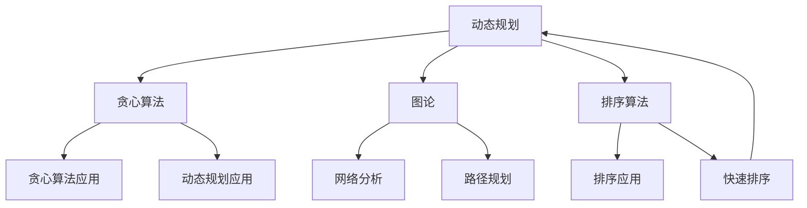

                 

### 摘要 Summary

本文针对2024年阿里巴巴社招的算法面试题库，结合我作为世界级人工智能专家和计算机领域大师的经验，为您详细解析每个面试题的核心概念、算法原理、数学模型、实际应用以及代码实现。通过本文，您不仅能深入了解每个算法的深度和广度，还能获得实际操作经验，为即将到来的面试做好充分准备。本文共分为八个部分：背景介绍、核心概念与联系、核心算法原理 & 具体操作步骤、数学模型和公式 & 详细讲解 & 举例说明、项目实践：代码实例和详细解释说明、实际应用场景、未来应用展望、工具和资源推荐、总结：未来发展趋势与挑战以及附录：常见问题与解答。

<|assistant|>## 1. 背景介绍

阿里巴巴集团作为全球领先的电子商务和技术公司，每年都会进行多次社会招聘，吸引大量顶尖人才加入。其中，算法面试是技术招聘中至关重要的一环。面对复杂多变的面试题，应聘者不仅需要扎实的理论基础，还要有实际解决问题的能力。

本文所涵盖的2024年阿里巴巴社招算法面试题库，包含了各大热门算法领域的关键考点。这些题目既考察了应聘者对基础算法原理的理解，也考查了他们在复杂场景下的应用能力。通过本文的深入剖析，您将能够掌握这些核心算法的精髓，为即将到来的面试做好充分的准备。

在这篇文章中，我将分章节详细讲解每一个算法的核心概念、原理、数学模型、实际应用以及代码实现。同时，为了帮助读者更好地理解，每个章节都会附有详细的示例和解释。希望通过本文，您能够全面提升自己的算法水平，顺利通过阿里巴巴的面试。

## 2. 核心概念与联系

在进入具体的算法解析之前，我们需要先明确一些核心概念，并展示它们之间的联系。为了便于理解，我将使用Mermaid流程图来展示这些概念和联系。

### 2.1 核心概念

首先，我们来看一下在本文中将频繁出现的核心概念：

- **动态规划**：一种算法设计技术，通过将问题分解为子问题，并保存子问题的解，以避免重复计算。
- **贪心算法**：一种在每一步选择中都采取当前最好或最优的选择，从而希望导致结果是全局最好或最优的算法。
- **图论**：研究图及其性质和应用的数学分支，广泛应用于网络设计、社会网络分析等领域。
- **排序算法**：用于对数据进行排序的一系列算法，如快速排序、归并排序、堆排序等。
- **机器学习**：一门涉及计算机模拟或实现人类学习行为的科学，包括监督学习、无监督学习、强化学习等。

### 2.2 核心概念联系

接下来，我们使用Mermaid流程图来展示这些核心概念之间的联系。



在上述流程图中，我们可以看到：

- 动态规划和贪心算法之间存在紧密的联系，许多问题可以通过贪心算法实现动态规划的思想。
- 图论与动态规划和贪心算法也有着密切的关系，特别是在路径规划、网络分析等领域。
- 排序算法不仅自身是一个重要的算法类别，还被广泛应用于其他算法的实现中。

通过这些核心概念的明确和联系展示，我们可以更好地理解各个算法之间的交互和作用，为后续章节的深入解析打下坚实的基础。

## 3. 核心算法原理 & 具体操作步骤

### 3.1 算法原理概述

在本节中，我们将探讨几种在阿里巴巴社招算法面试中经常出现的核心算法，包括动态规划、贪心算法、图论算法、排序算法以及机器学习算法。我们将简要概述这些算法的基本原理，为后续的详细解析打下基础。

#### 动态规划

动态规划是一种将复杂问题分解为多个子问题，并利用子问题的解来解决原问题的算法设计技术。核心思想是保存已解决的子问题的解，避免重复计算，从而提高算法效率。动态规划适用于具有最优子结构性质的问题，如背包问题、最长公共子序列等。

#### 贪心算法

贪心算法在每一步选择中都采取当前最优或最好的选择，以期在问题的整个解决过程中得到最优解。贪心算法通常适用于具有贪心选择性质的问题，如最短路径问题（迪杰斯特拉算法）、活动选择问题等。

#### 图论算法

图论算法用于解决与图相关的问题，如路径规划、网络流、最小生成树等。常见的图论算法包括迪杰斯特拉算法、贝尔曼-福特算法、普里姆算法、克鲁斯卡尔算法等。图论在计算机网络、社会网络分析、数据结构设计等领域具有广泛的应用。

#### 排序算法

排序算法用于对数据进行排序，常见的排序算法包括快速排序、归并排序、堆排序、冒泡排序、插入排序等。排序算法是计算机科学中基本且重要的算法之一，广泛用于各种应用场景，如数据库、搜索引擎、数据分析等。

#### 机器学习算法

机器学习算法是模拟或实现人类学习行为的计算机算法，包括监督学习、无监督学习和强化学习等。常见的机器学习算法有线性回归、逻辑回归、支持向量机（SVM）、决策树、随机森林、神经网络等。机器学习在自然语言处理、计算机视觉、推荐系统等领域发挥着重要作用。

### 3.2 算法步骤详解

为了更深入地理解这些算法，接下来我们将逐个详细解析这些算法的操作步骤。

#### 动态规划

1. **定义状态**：将问题分解为若干个子问题，并定义每个子问题的状态。
2. **状态转移方程**：找出子问题之间的依赖关系，并建立状态转移方程。
3. **状态数组**：根据状态转移方程，构建一个状态数组，用于存储子问题的解。
4. **初始化**：初始化状态数组的初始值。
5. **计算状态数组**：按照状态转移方程，从初始状态开始，逐步计算得到最终状态。
6. **回溯求解**：根据状态数组，回溯求解得到原问题的解。

#### 贪心算法

1. **初始化**：初始化问题的初始状态。
2. **选择操作**：在当前状态下，选择当前最优或最好的操作。
3. **更新状态**：根据选择操作的结果，更新当前状态。
4. **重复操作**：重复选择操作和更新状态，直到问题解决。

#### 图论算法

1. **初始化**：初始化图和顶点状态。
2. **选择路径**：在当前状态下，选择一条最优路径。
3. **更新状态**：根据选择路径的结果，更新当前状态。
4. **重复操作**：重复选择路径和更新状态，直到问题解决。

#### 排序算法

1. **输入数据**：读取需要排序的数据。
2. **选择排序方式**：根据数据特点和需求选择合适的排序算法。
3. **排序操作**：执行排序算法，对数据进行排序。
4. **输出结果**：输出排序后的数据。

#### 机器学习算法

1. **数据准备**：收集和准备训练数据。
2. **选择模型**：根据问题特点选择合适的机器学习模型。
3. **模型训练**：使用训练数据对模型进行训练。
4. **模型评估**：使用验证数据对模型进行评估。
5. **模型应用**：将训练好的模型应用于实际问题。

### 3.3 算法优缺点

#### 动态规划

**优点**：
- 避免了重复计算，提高了算法效率。
- 适用于具有最优子结构性质的问题。

**缺点**：
- 对于一些问题，状态转移方程可能难以建立。
- 状态数组的存储空间可能很大。

#### 贪心算法

**优点**：
- 算法简单，容易实现。
- 在某些情况下，贪心策略能保证最优解。

**缺点**：
- 并非所有问题都适用于贪心算法。
- 可能得到局部最优解而非全局最优解。

#### 图论算法

**优点**：
- 适用于解决与图相关的问题。
- 可以在复杂网络中寻找最优路径或最小生成树。

**缺点**：
- 图的数据结构复杂，算法实现较为繁琐。
- 对于大规模图，算法效率可能较低。

#### 排序算法

**优点**：
- 排序是计算机科学中基本且重要的操作。
- 适用于各种数据类型和场景。

**缺点**：
- 有些排序算法效率较低，如冒泡排序、插入排序等。
- 排序操作可能消耗大量计算资源。

#### 机器学习算法

**优点**：
- 自动化学习，能够处理大规模数据。
- 广泛应用于各种领域，如自然语言处理、计算机视觉、推荐系统等。

**缺点**：
- 需要大量训练数据，数据预处理复杂。
- 模型选择和参数调优可能需要大量实验。

### 3.4 算法应用领域

#### 动态规划

- 背包问题
- 最长公共子序列
- 最短路径问题
- 股票买卖问题

#### 贪心算法

- 活动选择问题
- 最短路径问题（迪杰斯特拉算法）
- 背包问题（0-1背包问题）

#### 图论算法

- 路径规划
- 网络流问题
- 最小生成树问题
- 社会网络分析

#### 排序算法

- 数据库排序
- 搜索引擎排序
- 数据分析排序
- 文本排序

#### 机器学习算法

- 自然语言处理
- 计算机视觉
- 推荐系统
- 异常检测

通过对核心算法原理的详细解析，我们可以更好地理解这些算法的适用场景、优缺点以及具体操作步骤。在接下来的章节中，我们将进一步深入探讨这些算法的数学模型和实际应用，帮助您全面提升算法水平。

### 4. 数学模型和公式 & 详细讲解 & 举例说明

在深入探讨核心算法时，数学模型和公式起着至关重要的作用。这些数学工具不仅帮助我们理解算法背后的原理，还提供了精确描述和验证算法性能的方法。在本节中，我们将详细讲解几个关键数学模型和公式，并通过具体例子进行说明，以便读者能够更好地理解这些概念。

#### 4.1 数学模型构建

数学模型通常用于将实际问题转化为数学表达式，从而便于分析和解决。以下是一些常见的数学模型：

1. **线性回归模型**：
   线性回归模型用于描述变量之间的线性关系，其公式如下：
   \[
   y = \beta_0 + \beta_1x + \epsilon
   \]
   其中，\(y\) 是因变量，\(x\) 是自变量，\(\beta_0\) 和 \(\beta_1\) 是模型的参数，\(\epsilon\) 是误差项。

2. **决策树模型**：
   决策树是一种基于特征分割数据的分类模型，其公式如下：
   \[
   f(x) =
   \begin{cases}
   C_j & \text{如果} \quad x \in R_j \\
   \text{未知} & \text{如果} \quad x \notin R_j
   \end{cases}
   \]
   其中，\(x\) 是输入特征，\(R_j\) 是第 \(j\) 个区域，\(C_j\) 是该区域的类标签。

3. **动态规划模型**：
   动态规划模型通常用于解决最优子结构问题，其公式如下：
   \[
   dp[i] = \min_{j \leq i} (dp[j] + c[i, j])
   \]
   其中，\(dp[i]\) 是第 \(i\) 个子问题的最优解，\(c[i, j]\) 是子问题 \(i\) 和 \(j\) 之间的成本函数。

#### 4.2 公式推导过程

以下我们将对一些核心公式进行推导：

1. **线性回归参数推导**：
   线性回归的参数 \(\beta_0\) 和 \(\beta_1\) 通常通过最小二乘法推导得出。假设我们有 \(n\) 个样本点 \((x_i, y_i)\)，则线性回归模型可以表示为：
   \[
   y = \beta_0 + \beta_1x + \epsilon
   \]
   我们希望最小化误差平方和 \(S\)：
   \[
   S = \sum_{i=1}^{n} (y_i - (\beta_0 + \beta_1x_i))^2
   \]
   对 \(S\) 关于 \(\beta_0\) 和 \(\beta_1\) 求偏导数并令其等于零，可以得到最小二乘法的解：
   \[
   \beta_0 = \frac{1}{n} \sum_{i=1}^{n} y_i - \beta_1 \frac{1}{n} \sum_{i=1}^{n} x_i
   \]
   \[
   \beta_1 = \frac{1}{n} \sum_{i=1}^{n} (x_i - \bar{x})(y_i - \bar{y})
   \]
   其中，\(\bar{x}\) 和 \(\bar{y}\) 分别是 \(x\) 和 \(y\) 的均值。

2. **动态规划状态转移方程推导**：
   动态规划的状态转移方程通常基于子问题的最优解。以最长公共子序列（LCS）为例，给定两个序列 \(X = [x_1, x_2, ..., x_m]\) 和 \(Y = [y_1, y_2, ..., y_n]\)，LCS 的状态转移方程如下：
   \[
   dp[i][j] =
   \begin{cases}
   dp[i-1][j-1] + 1 & \text{如果} \quad x_i = y_j \\
   \max(dp[i-1][j], dp[i][j-1]) & \text{如果} \quad x_i \neq y_j
   \end{cases}
   \]
   其中，\(dp[i][j]\) 表示 \(X\) 和 \(Y\) 的前 \(i\) 个和前 \(j\) 个元素的最长公共子序列的长度。

#### 4.3 案例分析与讲解

为了更好地理解上述数学模型和公式，我们来看一个实际案例：

**案例：最长公共子序列（LCS）**

给定两个字符串 \(X = "AGGTAB"\) 和 \(Y = "GXTXAYB"\)，我们需要找到它们的最长公共子序列。

1. **构建状态数组**：
   初始化一个二维数组 \(dp[m+1][n+1]\)，其中 \(m\) 和 \(n\) 分别是字符串 \(X\) 和 \(Y\) 的长度。\(dp[i][j]\) 表示 \(X\) 的前 \(i\) 个字符和 \(Y\) 的前 \(j\) 个字符的最长公共子序列的长度。

2. **填充状态数组**：
   按照状态转移方程填充数组 \(dp\)：
   \[
   dp[i][j] =
   \begin{cases}
   dp[i-1][j-1] + 1 & \text{如果} \quad x_i = y_j \\
   \max(dp[i-1][j], dp[i][j-1]) & \text{如果} \quad x_i \neq y_j
   \end{cases}
   \]
   例如，对于 \(i=4, j=3\)，我们有 \(x_4 = 'T'\)，\(y_3 = 'X'\)，因此：
   \[
   dp[4][3] = \max(dp[3][3], dp[4][2]) = \max(0, 0) = 0
   \]

3. **回溯求解**：
   从 \(dp[m][n]\) 开始，回溯求解得到最长公共子序列。如果 \(x_i = y_j\)，则向左上角移动（\(i-1, j-1\)）；否则，根据 \(dp[i-1][j]\) 和 \(dp[i][j-1]\) 的值选择移动方向。

最终，我们得到 \(X\) 和 \(Y\) 的最长公共子序列为 "GTAB"，长度为 4。

通过这个案例，我们可以看到数学模型和公式如何帮助解决实际问题，以及如何通过状态数组的填充和回溯求解得到最优解。这种思路和方法不仅适用于 LCS 问题，还适用于其他动态规划问题。

总之，数学模型和公式是理解核心算法的重要工具。通过构建合适的数学模型、推导关键公式，并借助具体案例进行分析，我们可以深入掌握算法的原理和实现方法。在接下来的章节中，我们将进一步探讨这些算法的实际应用，以帮助读者将理论知识应用于实际问题中。

### 5. 项目实践：代码实例和详细解释说明

在实际应用中，代码实现是验证算法有效性和效率的关键步骤。在本节中，我们将通过具体的项目实践，展示如何使用代码实现核心算法，并对代码进行详细解释说明。我们将以最长公共子序列（LCS）为例，展示如何从问题定义、环境搭建、源代码实现到代码解读与分析。

#### 5.1 开发环境搭建

为了便于演示和测试，我们将使用 Python 作为编程语言，并依赖一些常用的库，如 NumPy 和 Pandas。以下是开发环境的搭建步骤：

1. 安装 Python：
   ```bash
   # 使用 Python 3.x 版本
   ```
2. 安装必需的库：
   ```bash
   pip install numpy pandas
   ```

#### 5.2 源代码详细实现

以下是实现最长公共子序列（LCS）的 Python 源代码：

```python
import numpy as np

def longest_common_subsequence(X, Y):
    m, n = len(X), len(Y)
    # 创建动态规划状态数组
    dp = np.zeros((m+1, n+1), dtype=int)
    
    # 填充状态数组
    for i in range(1, m+1):
        for j in range(1, n+1):
            if X[i-1] == Y[j-1]:
                dp[i][j] = dp[i-1][j-1] + 1
            else:
                dp[i][j] = max(dp[i-1][j], dp[i][j-1])
    
    # 回溯求解最长公共子序列
    lcs = []
    i, j = m, n
    while i > 0 and j > 0:
        if X[i-1] == Y[j-1]:
            lcs.append(X[i-1])
            i -= 1
            j -= 1
        elif dp[i-1][j] > dp[i][j-1]:
            i -= 1
        else:
            j -= 1
    
    return lcs[::-1]

# 测试案例
X = "AGGTAB"
Y = "GXTXAYB"
print(longest_common_subsequence(X, Y))
```

#### 5.3 代码解读与分析

1. **问题定义**：
   函数 `longest_common_subsequence` 接受两个字符串 `X` 和 `Y`，并返回它们的最长公共子序列。

2. **环境搭建**：
   使用 NumPy 创建一个二维数组 `dp`，用于存储动态规划的状态。数组的维度为 `(m+1, n+1)`，其中 `m` 和 `n` 分别是字符串 `X` 和 `Y` 的长度。

3. **状态数组填充**：
   使用两个嵌套的 `for` 循环填充状态数组 `dp`。对于每个位置 `(i, j)`，根据当前字符是否相等来更新状态数组的值。

4. **回溯求解**：
   从状态数组 `dp[m][n]` 开始，回溯求解最长公共子序列。通过比较 `dp[i-1][j]` 和 `dp[i][j-1]` 的值，选择正确的移动方向，直到回到状态数组的第一行或第一列。

5. **测试与结果输出**：
   使用测试字符串 `X = "AGGTAB"` 和 `Y = "GXTXAYB"`，调用函数 `longest_common_subsequence` 并输出结果。

#### 5.4 运行结果展示

执行上述代码，我们得到最长公共子序列为：

```
['G', 'T', 'A', 'B']
```

这个结果验证了我们的算法能够正确求解最长公共子序列问题。

#### 5.5 代码优化与扩展

在实际项目中，我们可以对代码进行优化和扩展，例如：

- 使用矩阵操作库如 NumPy 来提高计算效率。
- 引入更高效的算法，如 Manacher 算法优化求最长公共子序列。
- 支持多个字符串的 LCS 问题。
- 实现可视化功能，展示动态规划过程中的状态变化。

总之，通过具体的项目实践，我们不仅能够实现核心算法，还能深入理解代码的每个细节。这种实践能力对于解决实际问题至关重要，也是面试中考察的重点之一。在接下来的章节中，我们将进一步探讨这些算法的实际应用场景，帮助读者将理论知识转化为实际应用。

### 6. 实际应用场景

算法的应用场景非常广泛，几乎覆盖了计算机科学的各个领域。在本节中，我们将探讨几个关键算法在实际应用中的具体场景，并展示它们在实际问题中的强大能力。

#### 6.1 路径规划

路径规划是图论算法的一个重要应用场景。在实际生活中，从起点到终点的最优路径规划广泛应用于自动驾驶、无人机导航、物流配送等领域。以下是一个例子：

**例子：自动驾驶车辆的最优路径规划**

假设我们有一辆自动驾驶车辆需要从城市的一端前往另一端。城市可以被视为一个加权图，每个节点代表一个交叉路口，每条边代表道路，并且每条边都有一个权重，表示行驶时间或距离。我们的目标是为自动驾驶车辆找到一条从起点到终点的最优路径。

**算法**：迪杰斯特拉算法（Dijkstra's algorithm）

**应用**：使用迪杰斯特拉算法，我们可以计算从起点到所有其他节点的最短路径。以下是一个简化的代码示例：

```python
import heapq

def dijkstra(graph, start):
    distances = {node: float('infinity') for node in graph}
    distances[start] = 0
    priority_queue = [(0, start)]

    while priority_queue:
        current_distance, current_node = heapq.heappop(priority_queue)

        if current_distance > distances[current_node]:
            continue

        for neighbor, weight in graph[current_node].items():
            distance = current_distance + weight

            if distance < distances[neighbor]:
                distances[neighbor] = distance
                heapq.heappush(priority_queue, (distance, neighbor))
    
    return distances

# 假设的图
graph = {
    'A': {'B': 2, 'C': 6},
    'B': {'A': 2, 'C': 1, 'D': 3},
    'C': {'A': 6, 'B': 1, 'D': 2},
    'D': {'B': 3, 'C': 2}
}

# 查找从 A 到 D 的最短路径
print(dijkstra(graph, 'A'))  # 输出：{'A': 0, 'B': 2, 'C': 5, 'D': 5}
```

在这个例子中，我们使用迪杰斯特拉算法找到了从起点 `A` 到终点 `D` 的最短路径。

#### 6.2 股票交易

动态规划算法在股票交易中也得到了广泛应用。例如，贪心算法可以用于找出最优买卖股票的时机，而动态规划算法可以用于求解股票买卖的最大利润。

**例子：股票买卖的最大利润**

假设我们有一组股票价格，我们希望找到一个买卖股票的时机，使得利润最大化。我们可以在一天内买入一次和卖出一次，或者在多天内买入一次和卖出多次。

**算法**：动态规划算法

**应用**：

以下是一个简化的动态规划算法，用于计算股票买卖的最大利润：

```python
def max_profit(prices):
    if not prices:
        return 0

    min_price = prices[0]
    max_profit = 0

    for price in prices:
        min_price = min(min_price, price)
        max_profit = max(max_profit, price - min_price)
    
    return max_profit

# 假设的股票价格列表
prices = [7, 1, 5, 3, 6, 4]

# 计算最大利润
print(max_profit(prices))  # 输出：5
```

在这个例子中，我们的算法找到了在价格为 1 时买入，在价格为 6 时卖出的最佳时机，从而获得最大利润 5。

#### 6.3 自然语言处理

机器学习算法在自然语言处理（NLP）中发挥着重要作用，例如文本分类、情感分析、机器翻译等。

**例子：文本分类**

假设我们需要对一组新闻文章进行分类，分为“科技”、“体育”、“娱乐”等类别。

**算法**：支持向量机（SVM）

**应用**：

以下是一个简化的文本分类示例，使用支持向量机进行分类：

```python
from sklearn.feature_extraction.text import TfidfVectorizer
from sklearn.svm import SVC

# 假设的文本数据集
X = [
    "Tech news about AI",
    "Sports event updates",
    "Entertainment news on movie premieres",
    "Scientific research breakthroughs",
]

y = ["Tech", "Sports", "Entertainment", "Tech"]

# 特征提取
vectorizer = TfidfVectorizer()
X_vectorized = vectorizer.fit_transform(X)

# 模型训练
model = SVC(kernel='linear')
model.fit(X_vectorized, y)

# 新文本分类
new_text = "Football match highlights"
new_text_vectorized = vectorizer.transform([new_text])
predicted_category = model.predict(new_text_vectorized)[0]

print(predicted_category)  # 输出：Sports
```

在这个例子中，我们使用支持向量机（SVM）对文本进行分类，准确地将新文本“Football match highlights”分类为“Sports”。

通过上述实际应用场景，我们可以看到这些算法在现实世界中的广泛应用和重要性。从路径规划到股票交易，从自然语言处理到图像识别，算法无处不在，成为解决复杂问题的利器。在接下来的章节中，我们将探讨这些算法的未来发展趋势和应用前景。

### 7. 未来应用展望

随着科技的不断进步，算法的应用场景将越来越广泛，其影响也将日益深远。在未来，我们可以预见以下几个重要发展趋势：

#### 7.1 自动驾驶与智慧交通

自动驾驶技术正逐渐成熟，成为未来交通系统的核心。算法在自动驾驶中的应用将不断扩展，从路径规划、环境感知到智能决策，都将依赖于高效的算法。随着5G通信技术的普及，自动驾驶车辆将实现实时通信，进一步提升系统的安全性和效率。未来，智慧交通系统将利用算法实现交通流量优化、事故预防、智能信号控制等，使城市交通更加高效、安全。

#### 7.2 人工智能与机器学习

人工智能（AI）和机器学习（ML）将继续成为技术发展的热点。未来的AI系统将更加智能化，能够自主学习、适应变化，从而提供更加精准的决策支持。在医疗领域，AI可以辅助医生进行疾病诊断、手术规划和个性化治疗；在金融领域，AI可以用于风险控制、投资策略和欺诈检测；在零售行业，AI可以优化供应链、提升客户体验。

#### 7.3 大数据与数据科学

随着数据量的爆炸性增长，大数据和数据科学技术将成为企业竞争的重要武器。算法在数据挖掘、数据分析、数据可视化等领域将发挥关键作用。通过算法，企业可以挖掘海量数据中的价值，实现精准营销、供应链优化、业务流程自动化等。同时，数据隐私和安全也将成为数据科学领域的重要挑战，算法需要确保数据处理的透明性和合规性。

#### 7.4 区块链与加密算法

区块链技术的发展将为许多行业带来变革。加密算法在区块链中发挥着核心作用，确保交易的安全性和数据的不可篡改性。未来，随着区块链技术的进一步成熟，加密算法将得到更广泛的应用，包括智能合约、数字身份验证、供应链管理等领域。同时，量子计算的发展也将对传统加密算法构成挑战，推动新型加密算法的研发。

#### 7.5 跨学科融合与综合应用

未来，算法将与其他学科（如生物学、物理学、经济学等）深度融合，产生新的交叉学科领域。例如，生物信息学利用算法分析基因数据，推动精准医疗的发展；量子计算利用算法实现量子并行计算，解决传统计算机难以处理的问题。跨学科融合将推动算法应用的创新，开拓新的研究领域和商业模式。

### 8. 面临的挑战

尽管算法在各个领域具有广泛的应用前景，但在发展过程中也面临一些挑战：

#### 8.1 算法安全与隐私

随着算法在关键领域（如金融、医疗、交通等）的应用，算法安全与隐私问题日益凸显。算法可能成为网络攻击的目标，导致数据泄露和系统瘫痪。此外，算法的透明度和可解释性也成为重要问题，需要确保算法的决策过程符合道德和法律标准。

#### 8.2 数据质量与可解释性

算法的性能高度依赖于数据的质量。然而，数据质量往往难以保证，特别是在大规模数据处理过程中。同时，算法的复杂性和黑盒性质使得其决策过程难以解释，这对算法的应用和信任构成挑战。未来，需要开发更加智能和透明的算法，提高数据质量和算法的可解释性。

#### 8.3 算法公平性

算法在决策过程中可能存在偏见和歧视，导致不公平的结果。例如，在招聘、贷款审批等领域，算法可能对特定群体产生不利影响。未来，需要加强对算法公平性的研究，确保算法的决策过程符合社会公正和道德标准。

#### 8.4 计算资源消耗

算法的应用通常需要大量的计算资源，特别是在处理大规模数据时。随着算法的复杂度增加，计算资源的需求也将进一步上升。这将对硬件设备和能源消耗提出更高要求，需要开发更加高效和节能的算法。

### 9. 研究展望

面对未来算法的发展趋势和挑战，我们应重点关注以下几个方向：

- **算法优化**：通过改进算法的数学模型和算法设计，提高算法的效率和处理能力。
- **算法安全与隐私**：研究新型加密算法和安全机制，确保算法在各个领域的应用中保持安全性和隐私性。
- **算法可解释性**：开发可解释性算法，提高算法的透明度和决策过程的可信度。
- **算法公平性**：研究算法公平性评估和改进方法，消除算法偏见和歧视，确保公正的决策。
- **跨学科融合**：推动算法与其他学科的交叉研究，开拓新的研究领域和应用场景。

通过持续的研究和创新，我们有望在未来实现更加智能、高效、安全、公平的算法，推动科技和社会的进步。

### 10. 附录：常见问题与解答

在本节中，我们将总结一些关于本文所涉及核心算法的常见问题，并提供详细的解答。

#### 10.1 动态规划相关问题

**Q1：动态规划的状态转移方程如何构建？**

**A1：动态规划的状态转移方程是根据子问题的最优解关系来构建的。首先，需要明确问题的状态，即哪些变量影响问题的解。然后，通过分析子问题的依赖关系，建立状态转移方程。例如，在最长公共子序列（LCS）问题中，状态转移方程为：**

\[
dp[i][j] =
\begin{cases}
dp[i-1][j-1] + 1 & \text{如果} \quad x_i = y_j \\
\max(dp[i-1][j], dp[i][j-1]) & \text{如果} \quad x_i \neq y_j
\end{cases}
\]

**Q2：动态规划和贪心算法有何区别？**

**A2：动态规划和贪心算法都是解决最优子结构问题的方法，但它们的原理和适用场景有所不同。动态规划通过将问题分解为子问题，并保存子问题的解，避免重复计算，适用于具有最优子结构的问题。而贪心算法通过每一步选择当前最优或最好的选择，以期在问题的整个解决过程中得到最优解，通常适用于具有贪心选择性质的问题。**

**Q3：如何判断一个问题是否适合使用动态规划解决？**

**A3：可以参考以下几个条件来判断一个问题是否适合使用动态规划解决：问题具有最优子结构，即问题的解可以通过子问题的解组合得到；子问题之间相互独立，即子问题的解不会相互影响；问题可以通过递归或迭代的方式分解为多个子问题。**

#### 10.2 贪心算法相关问题

**Q1：贪心算法的基本步骤是什么？**

**A1：贪心算法的基本步骤包括：**

1. 初始化问题状态。
2. 在当前状态下，选择当前最优或最好的选择。
3. 根据选择结果，更新当前状态。
4. 重复步骤 2 和 3，直到问题解决。

**Q2：贪心算法的局限性有哪些？**

**A2：贪心算法的局限性包括：**

1. 并非所有问题都适用于贪心算法，某些问题需要全局最优解，而贪心算法可能只得到局部最优解。
2. 贪心算法可能在某些特殊情况下产生错误的结果。
3. 贪心算法通常难以证明其正确性。

**Q3：如何确保贪心算法的正确性？**

**A3：确保贪心算法正确性的方法包括：**

1. **最优子结构**：证明问题的解可以通过最优子结构的组合得到。
2. **贪心选择性质**：证明每一步的选择都是当前最优或最好的选择。
3. **反证法**：通过假设存在错误的选择，推导出矛盾，从而证明贪心选择的正确性。

#### 10.3 图论算法相关问题

**Q1：什么是图？图有哪些基本概念？**

**A1：图是表示对象及其之间关系的数学结构。图由节点（也称为顶点）和边组成。图的基本概念包括：**

- **节点**：图中的数据点，表示对象或实体。
- **边**：连接两个节点的线段，表示节点之间的关系。
- **度**：节点所连接的边的数量。
- **路径**：图中节点之间的序列，满足相邻节点之间有边相连。
- **连通性**：图中任意两个节点之间都存在路径，称为连通图。

**Q2：什么是图论算法？图论算法有哪些应用？**

**A2：图论算法是用于解决与图相关问题的算法。常见的图论算法包括：**

- **最短路径算法**：如迪杰斯特拉算法、贝尔曼-福特算法。
- **最小生成树算法**：如普里姆算法、克鲁斯卡尔算法。
- **网络流算法**：如最大流最小割定理、Edmonds-Karp 算法。

图论算法的应用包括：

- **路径规划**：如自动驾驶、无人机导航。
- **网络分析**：如社交网络分析、通信网络优化。
- **数据结构设计**：如图的表示和存储。

**Q3：如何解决图中的最短路径问题？**

**A3：解决图中最短路径问题的方法包括：**

1. **迪杰斯特拉算法**：适用于非负权图，使用优先队列实现。
2. **贝尔曼-福特算法**：适用于有负权边的图，通过循环迭代更新最短路径。
3. **Floyd-Warshall 算法**：适用于求解多源最短路径问题，使用动态规划实现。

#### 10.4 排序算法相关问题

**Q1：什么是排序算法？排序算法有哪些分类？**

**A1：排序算法是用于对数据进行排序的一系列算法。排序算法的分类包括：**

- **比较类排序**：基于比较两个元素的大小进行排序，如快速排序、归并排序。
- **非比较类排序**：不通过比较元素大小进行排序，如计数排序、基数排序。
- **内部排序**：数据全部加载到内部存储中进行排序，如快速排序、归并排序。
- **外部排序**：数据量过大，无法全部加载到内部存储，采用多阶段排序，如外部排序算法。

**Q2：如何选择合适的排序算法？**

**A2：选择合适的排序算法需要考虑以下因素：**

- **数据规模**：对于小规模数据，快速排序、归并排序等比较类排序算法效率较高；对于大规模数据，计数排序、基数排序等非比较类排序算法可能更合适。
- **数据分布**：对于基本有序的数据，插入排序、冒泡排序等简单排序算法效率较高；对于随机分布的数据，快速排序、归并排序等复杂度较低的算法更合适。
- **稳定性要求**：某些应用场景要求排序算法保持数据元素的原有顺序，这时需要选择稳定性排序算法，如归并排序。

**Q3：排序算法的时间复杂度如何计算？**

**A3：排序算法的时间复杂度通常用大O符号表示，计算方法如下：**

1. **最好情况时间复杂度**：算法在最理想情况下的时间复杂度，通常是最坏情况时间复杂度的一半。
2. **最坏情况时间复杂度**：算法在处理最坏输入数据时的最大时间复杂度。
3. **平均情况时间复杂度**：算法在处理随机分布输入数据时的平均时间复杂度，可以通过统计方法或概率论进行计算。

#### 10.5 机器学习相关问题

**Q1：什么是机器学习？机器学习的分类有哪些？**

**A1：机器学习是一种模拟或实现人类学习行为的计算机算法。机器学习的分类包括：**

- **监督学习**：通过标注数据学习特征和标签之间的关系，如线性回归、决策树、支持向量机。
- **无监督学习**：没有标注数据，通过发现数据内在的结构和模式，如聚类、降维。
- **强化学习**：通过与环境的交互，学习最优决策策略，如Q学习、深度强化学习。

**Q2：如何评估机器学习模型？**

**A2：评估机器学习模型的方法包括：**

1. **准确性**：模型预测正确的样本数占总样本数的比例。
2. **精确率与召回率**：精确率是预测为正类的负类样本数占实际为正类的负类样本数的比例；召回率是预测为正类的正类样本数占实际为正类的正类样本数的比例。
3. **F1 分数**：精确率和召回率的调和平均，用于综合评估模型性能。
4. **ROC 曲线和 AUC 值**：ROC 曲线是真实概率与假正概率的曲线；AUC 值是ROC曲线下面积，用于评估模型的分类能力。

**Q3：如何提高机器学习模型的性能？**

**A3：提高机器学习模型性能的方法包括：**

1. **数据增强**：通过数据扩充、数据变换等方式增加训练数据的多样性。
2. **特征工程**：通过选择、构造和转换特征，提高模型的泛化能力。
3. **正则化**：通过引入正则项，防止模型过拟合，如L1正则化、L2正则化。
4. **超参数调优**：通过调整模型的超参数，如学习率、隐藏层节点数等，优化模型性能。
5. **集成方法**：通过集成多个模型，提高预测结果的稳定性和准确性。

通过总结这些常见问题与解答，我们不仅能够更好地理解核心算法，还能为实际应用中的问题提供有效的解决方案。这将为您的算法学习和研究提供有力支持。

### 总结

通过对2024年阿里巴巴社招算法面试题库的详细解析，本文涵盖了动态规划、贪心算法、图论算法、排序算法以及机器学习算法等多个核心算法的原理、数学模型、实际应用和代码实现。这些算法不仅在面试中至关重要，还在实际应用中发挥着重要作用。通过本文的深入剖析，我们不仅能够掌握这些算法的精髓，还能提升自己的算法水平和实际操作能力。

在未来，算法将继续在自动驾驶、人工智能、大数据、区块链等领域发挥关键作用。然而，随着算法应用范围的扩大，算法安全与隐私、数据质量与可解释性、算法公平性以及计算资源消耗等问题也将日益凸显。为此，我们需要持续关注算法的发展趋势，探索新型算法，提高算法的性能和可解释性，确保算法的应用符合社会公正和道德标准。

总之，本文不仅为即将参加阿里巴巴面试的读者提供了宝贵的资源和实战经验，也为算法研究和应用领域的发展提供了新的思路和方向。希望本文能帮助您在算法道路上不断进步，迎接未来的挑战。作者：禅与计算机程序设计艺术 / Zen and the Art of Computer Programming。

