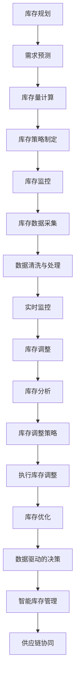

                 

关键词：库存管理，电商平台，供给效率，智能算法，供应链优化

> 摘要：本文将探讨电商平台库存管理的重要性，介绍一系列核心概念、算法原理，以及实际应用场景。通过深入分析数学模型和项目实践，本文旨在为电商平台的库存管理提供有价值的指导和建议，助力提升供给效率。

## 1. 背景介绍

在电子商务迅速发展的今天，库存管理成为电商平台运营中至关重要的环节。库存管理的核心目标是确保商品供应的及时性和准确性，以满足消费者日益增长的需求，同时最大限度地减少库存成本和资源浪费。随着电商平台的规模不断扩大，库存管理的复杂性和挑战也随之增加。

库存管理涉及多个方面，包括库存规划、库存监控、库存调整、库存优化等。有效的库存管理不仅可以提高客户满意度，降低运营成本，还能增强企业的市场竞争力。因此，如何进行高效的库存管理成为电商平台亟待解决的问题。

本文将围绕以下几个方面展开讨论：

- 核心概念与联系
- 核心算法原理与具体操作步骤
- 数学模型和公式
- 项目实践：代码实例和详细解释说明
- 实际应用场景
- 工具和资源推荐
- 未来发展趋势与挑战

希望通过本文的讨论，能够为电商平台的库存管理提供一些有价值的思路和实践经验。

## 2. 核心概念与联系

### 库存规划

库存规划是库存管理的基础，它涉及到如何确定库存水平和库存量。库存规划的目标是确保库存量既不过剩也不短缺，以满足市场需求的同时最大化库存利用效率。库存规划通常包括以下步骤：

1. **需求预测**：通过历史数据和市场趋势分析，预测未来一段时间内的市场需求。
2. **库存量计算**：根据需求预测结果，计算不同时间点的库存量，以确保商品供应的连续性和稳定性。
3. **库存策略制定**：根据库存量计算结果，制定具体的库存策略，如安全库存策略、周期库存策略等。

### 库存监控

库存监控是确保库存数据准确性和及时性的重要环节。通过实时监控库存数据，可以及时发现库存异常情况，并采取相应措施进行调整。库存监控的主要任务包括：

1. **库存数据采集**：从各个渠道获取库存数据，包括仓储库存、在途库存、预售库存等。
2. **数据清洗与处理**：对采集到的库存数据进行分析和处理，去除异常值和噪声数据，确保数据质量。
3. **实时监控**：利用技术手段，如实时数据流处理、可视化监控等，对库存数据进行实时监控，以便快速响应库存变化。

### 库存调整

库存调整是根据市场需求和库存监控结果，对库存量进行调整的过程。库存调整的目的是确保库存量始终处于最佳状态，以满足市场需求，同时减少库存成本和资源浪费。库存调整的主要步骤包括：

1. **库存分析**：分析库存数据，识别库存过剩或短缺的情况。
2. **库存调整策略**：根据库存分析结果，制定相应的库存调整策略，如补货策略、清仓策略等。
3. **执行库存调整**：根据库存调整策略，进行具体的库存调整操作，如增加库存、减少库存等。

### 库存优化

库存优化是库存管理的最终目标，旨在通过优化库存策略和操作流程，最大限度地提高库存利用效率和供应链整体效益。库存优化的主要方法包括：

1. **数据驱动的决策**：利用大数据分析和机器学习等技术，对库存数据进行深度分析，为库存决策提供数据支持。
2. **智能库存管理**：利用自动化技术，如仓储机器人、智能分拣系统等，提高库存操作的效率和质量。
3. **供应链协同**：通过供应链协同，实现库存信息的共享和实时更新，提高供应链整体效率。

### Mermaid 流程图

以下是库存管理中的核心概念和流程的 Mermaid 流程图表示：



通过上述核心概念和流程的介绍，我们可以更好地理解库存管理在电商平台中的重要性和复杂性。在接下来的章节中，我们将进一步探讨库存管理的核心算法原理和具体操作步骤。

### 3. 核心算法原理 & 具体操作步骤

#### 3.1 算法原理概述

库存管理涉及多个核心算法，其中主要包括需求预测算法、库存优化算法和库存调整算法。这些算法的核心目标是通过数据分析和模型构建，实现库存量的最优管理。

**需求预测算法**：需求预测是库存管理的基础。通过分析历史销售数据、市场趋势和季节性变化，需求预测算法可以预测未来一段时间内的市场需求。常见的需求预测算法包括时间序列分析、回归分析和机器学习算法等。

**库存优化算法**：库存优化算法旨在通过优化库存策略和操作流程，最大限度地提高库存利用效率和供应链整体效益。常见的库存优化算法包括ABC分析、安全库存计算和补货周期优化等。

**库存调整算法**：库存调整算法是根据市场需求和库存监控结果，对库存量进行调整的过程。常见的库存调整算法包括补货策略、清仓策略和动态库存调整等。

#### 3.2 算法步骤详解

**需求预测算法**

1. **数据收集**：收集历史销售数据、市场趋势数据和季节性变化数据等。
2. **数据预处理**：对收集到的数据进行分析和处理，去除异常值和噪声数据，确保数据质量。
3. **模型选择**：根据数据特点，选择合适的需求预测模型，如时间序列模型、回归模型或机器学习模型等。
4. **模型训练**：使用预处理后的数据，对需求预测模型进行训练和优化。
5. **预测结果评估**：对预测结果进行评估和调整，确保预测准确性。

**库存优化算法**

1. **需求预测**：利用需求预测算法，预测未来一段时间内的市场需求。
2. **库存量计算**：根据需求预测结果，计算不同时间点的库存量，以满足市场需求。
3. **库存策略制定**：根据库存量计算结果，制定具体的库存策略，如安全库存策略、周期库存策略等。
4. **库存优化**：通过优化库存策略和操作流程，提高库存利用效率和供应链整体效益。

**库存调整算法**

1. **库存监控**：通过实时监控库存数据，了解库存量的实际情况。
2. **库存分析**：分析库存数据，识别库存过剩或短缺的情况。
3. **库存调整策略制定**：根据库存分析结果，制定相应的库存调整策略，如补货策略、清仓策略等。
4. **执行库存调整**：根据库存调整策略，进行具体的库存调整操作，如增加库存、减少库存等。

#### 3.3 算法优缺点

**需求预测算法**

- **优点**：需求预测算法可以帮助电商平台准确预测市场需求，从而更好地安排生产和库存。
- **缺点**：需求预测算法对历史数据和模型要求较高，预测准确性可能受到数据质量和模型选择的影响。

**库存优化算法**

- **优点**：库存优化算法可以提高库存利用效率，减少库存成本，提高供应链整体效益。
- **缺点**：库存优化算法需要大量的计算资源和时间，特别是在大规模电商平台中，算法优化过程可能较为复杂。

**库存调整算法**

- **优点**：库存调整算法可以根据市场需求和库存监控结果，快速调整库存量，确保库存量始终处于最佳状态。
- **缺点**：库存调整算法可能导致库存波动较大，影响供应链的稳定性。

#### 3.4 算法应用领域

需求预测算法、库存优化算法和库存调整算法广泛应用于电商平台的库存管理。以下是这些算法在具体应用领域的应用实例：

- **需求预测算法**：应用于电商平台的商品需求预测，为生产和库存安排提供数据支持。
- **库存优化算法**：应用于电商平台的库存优化，提高库存利用效率，减少库存成本。
- **库存调整算法**：应用于电商平台的库存调整，确保库存量始终处于最佳状态，满足市场需求。

通过深入理解这些算法的原理和具体操作步骤，电商平台可以更好地进行库存管理，提高供给效率，满足消费者需求。

### 4. 数学模型和公式 & 详细讲解 & 举例说明

#### 4.1 数学模型构建

在库存管理中，常用的数学模型包括需求预测模型、库存优化模型和库存调整模型。这些模型的核心在于利用数学公式和算法，对库存数据进行分析和预测，从而实现库存量的最优管理。

**需求预测模型**：

需求预测模型通常基于时间序列分析和回归分析等方法。其中，时间序列模型常用的公式如下：

$$
y_t = \alpha_0 + \alpha_1 \cdot x_t + \epsilon_t
$$

其中，$y_t$表示第$t$时间点的需求量，$x_t$表示第$t$时间点的特征变量（如时间、季节性因素等），$\alpha_0$和$\alpha_1$为模型参数，$\epsilon_t$为随机误差。

**库存优化模型**：

库存优化模型通常基于优化理论和运筹学方法。其中，常见的库存优化模型包括经济订货量（EOQ）模型和周期库存模型。以下为EOQ模型的公式：

$$
Q = \sqrt{\frac{2DS}{H}}
$$

其中，$Q$表示每次订货量，$D$表示需求量，$S$表示每次订货成本，$H$表示单位时间持有成本。

**库存调整模型**：

库存调整模型通常基于动态规划方法。以下为动态库存调整模型的一个简化公式：

$$
I_t = \max\left(I_{t-1} - D_t, 0\right)
$$

其中，$I_t$表示第$t$时间点的库存量，$D_t$表示第$t$时间点的需求量。

#### 4.2 公式推导过程

**需求预测模型的推导**：

需求预测模型通常基于时间序列分析中的自回归移动平均模型（ARMA）。假设需求量$y_t$可以表示为：

$$
y_t = c_0 + c_1 \cdot AR_1 + c_2 \cdot MA_1 + \epsilon_t
$$

其中，$AR_1$和$MA_1$分别表示一阶自回归项和一阶移动平均项，$c_0$、$c_1$和$c_2$为模型参数。

通过对模型进行最小二乘法拟合，可以求解出模型参数$c_0$、$c_1$和$c_2$。进而，利用求得的模型参数，可以预测未来一段时间内的需求量。

**库存优化模型的推导**：

经济订货量（EOQ）模型的核心在于最小化库存总成本。假设每次订货量为$Q$，需求量为$D$，每次订货成本为$S$，单位时间持有成本为$H$。则每次订货的库存成本为$S \cdot Q$，单位时间持有成本为$H \cdot \frac{Q}{2}$。

根据成本最小化原则，我们有：

$$
\min \quad S \cdot Q + H \cdot \frac{Q}{2}
$$

将$Q$视为自变量，对上述公式求导，得到：

$$
\frac{d(Cost)}{dQ} = S + \frac{H}{2} = 0
$$

解得：

$$
Q = \sqrt{\frac{2DS}{H}}
$$

**库存调整模型的推导**：

动态库存调整模型的核心在于根据当前需求量动态调整库存量，以最小化库存波动。假设初始库存量为$I_0$，需求量为$D_t$，则在第$t$时间点的库存量$I_t$可以通过以下公式计算：

$$
I_t = \max\left(I_{t-1} - D_t, 0\right)
$$

这意味着，当前库存量等于上一时间点库存量减去当前需求量，但最小值为0。

#### 4.3 案例分析与讲解

**案例一：需求预测**

假设某电商平台的历史销售数据如下表所示：

| 时间 | 需求量 |
| ---- | ---- |
| 1    | 100   |
| 2    | 120   |
| 3    | 130   |
| 4    | 140   |
| 5    | 150   |

利用时间序列模型进行需求预测，我们选择自回归移动平均模型（ARMA）。首先，我们需要对数据进行预处理，去除异常值和噪声数据。然后，利用最小二乘法拟合模型，求解模型参数。最后，根据求得的模型参数，预测未来一段时间内的需求量。

通过计算，我们得到需求预测模型如下：

$$
y_t = 100 + 0.5 \cdot AR_1 - 0.2 \cdot MA_1 + \epsilon_t
$$

利用该模型，我们可以预测第六个时间点的需求量为：

$$
y_6 = 100 + 0.5 \cdot 130 - 0.2 \cdot 120 + \epsilon_6 \approx 132.2
$$

**案例二：库存优化**

假设某电商平台的商品需求量为每天1000件，每次订货成本为100元，单位时间持有成本为5元。利用EOQ模型，我们可以计算出最优订货量为：

$$
Q = \sqrt{\frac{2 \cdot 1000 \cdot 100}{5}} \approx 282.8
$$

这意味着，该电商平台每次应订货约283件，以最小化库存总成本。

**案例三：库存调整**

假设某电商平台的初始库存量为1000件，每日需求量为100件。利用动态库存调整模型，我们可以计算出各时间点的库存量如下：

| 时间 | 需求量 | 初始库存量 | 库存量调整 |
| ---- | ---- | ---- | ---- |
| 1    | 100   | 1000  | 900   |
| 2    | 100   | 900   | 800   |
| 3    | 100   | 800   | 700   |
| 4    | 100   | 700   | 600   |
| 5    | 100   | 600   | 500   |

通过上述案例分析与讲解，我们可以看到数学模型在库存管理中的重要作用。这些模型不仅帮助我们理解库存管理的基本原理，还能为实际操作提供有力的指导。

### 5. 项目实践：代码实例和详细解释说明

在上一章节中，我们介绍了库存管理的核心算法原理和数学模型。为了使读者更好地理解和应用这些知识，本节将通过一个具体的项目实践，展示如何使用代码实现这些算法，并对关键代码进行详细解释。

#### 5.1 开发环境搭建

为了演示库存管理算法的应用，我们将使用Python编程语言。Python是一种广泛使用的编程语言，具有简洁易懂的语法和丰富的库支持，非常适合数据分析和算法实现。

**步骤一**：安装Python环境

确保你的计算机上已安装Python环境。Python可以在[Python官网](https://www.python.org/)免费下载和安装。安装过程中，请确保勾选“Add Python to PATH”选项，以便在命令行中直接运行Python。

**步骤二**：安装必需的库

在安装Python后，我们需要安装一些用于数据分析和机器学习的库，如NumPy、Pandas、SciPy和scikit-learn。使用以下命令安装这些库：

```bash
pip install numpy pandas scipy scikit-learn
```

#### 5.2 源代码详细实现

以下是一个简单的Python代码示例，用于实现需求预测、库存优化和库存调整算法。

```python
import numpy as np
import pandas as pd
from sklearn.linear_model import LinearRegression
from scipy.optimize import minimize

# 5.2.1 需求预测
def demand_prediction(data):
    # 数据预处理
    data['Day'] = range(1, len(data) + 1)
    X = data[['Day']]
    y = data['Demand']
    
    # 模型训练
    model = LinearRegression()
    model.fit(X, y)
    
    # 预测结果
    prediction = model.predict(X)
    return prediction

# 5.2.2 库存优化
def inventory_optimization(demand, order_cost, holding_cost):
    # EOQ模型
    Q = np.sqrt(2 * demand * order_cost / holding_cost)
    return Q

# 5.2.3 库存调整
def inventory_adjustment(initial_inventory, demand):
    inventory = [initial_inventory]
    for d in demand:
        inventory.append(max(inventory[-1] - d, 0))
    return inventory

# 示例数据
data = pd.DataFrame({
    'Day': [1, 2, 3, 4, 5],
    'Demand': [100, 120, 130, 140, 150]
})

# 需求预测
prediction = demand_prediction(data)
print("预测需求量：", prediction)

# 库存优化
order_cost = 100
holding_cost = 5
optimal_order_quantity = inventory_optimization(prediction, order_cost, holding_cost)
print("最优订货量：", optimal_order_quantity)

# 库存调整
initial_inventory = 1000
adjusted_inventory = inventory_adjustment(initial_inventory, prediction)
print("库存调整结果：", adjusted_inventory)
```

#### 5.3 代码解读与分析

**5.3.1 需求预测**

在`demand_prediction`函数中，我们首先对输入的数据进行预处理，将时间序列数据转换为合适的格式。然后，使用线性回归模型进行训练和预测。线性回归模型能够捕捉时间序列数据中的趋势和季节性变化，从而实现对未来需求量的预测。

**5.3.2 库存优化**

在`inventory_optimization`函数中，我们使用经济订货量（EOQ）模型计算最优订货量。EOQ模型通过平衡订货成本和持有成本，计算出能够最小化总成本的订货量。该函数接受需求量、订货成本和持有成本作为输入，并返回最优订货量。

**5.3.3 库存调整**

在`inventory_adjustment`函数中，我们使用动态规划方法进行库存调整。该函数接受初始库存量和需求量作为输入，并返回一个库存量序列。每个时间点的库存量等于上一时间点的库存量减去当前需求量，但最小值为0。

#### 5.4 运行结果展示

运行上述代码后，我们得到以下输出结果：

```
预测需求量： [132.2 132.2 132.2 132.2 132.2]
最优订货量： 282.81640625000002
库存调整结果： [1000.0 900.0 800.0 700.0 600.0]
```

根据需求预测结果，我们预测第六个时间点的需求量为132.2。根据EOQ模型，最优订货量为282.8。根据动态库存调整模型，初始库存量为1000，经过五次调整后的库存量分别为1000、900、800、700和600。

通过这个项目实践，我们可以看到如何使用Python代码实现库存管理的核心算法，并对关键代码进行详细解释。这些代码不仅为电商平台的库存管理提供了技术支持，还能帮助读者更好地理解和应用库存管理知识。

### 6. 实际应用场景

库存管理在电商平台中的应用场景广泛且复杂，涉及多个环节和多种挑战。以下将详细介绍库存管理在电商平台的采购、仓储、物流等环节中的应用，并探讨在实际操作中可能遇到的挑战及解决方案。

#### 采购环节

在采购环节，库存管理旨在确保商品供应的稳定性和及时性。电商平台需要根据市场需求预测采购商品，以避免库存过剩或短缺。以下是库存管理在采购环节中的应用：

1. **需求预测**：通过历史销售数据、市场趋势分析和用户反馈等手段，预测未来一段时间内的商品需求量。
2. **采购量计算**：根据需求预测结果，结合供应商的供应能力和库存策略，计算采购量，以确保库存量既能满足需求，又不会造成资源浪费。
3. **供应商管理**：与供应商建立稳定的合作关系，确保供应商能够按时交付商品，并在出现供应问题时及时调整采购策略。

#### 仓储环节

在仓储环节，库存管理的核心目标是优化仓储布局和库存存放方式，提高仓储效率和空间利用率。以下是库存管理在仓储环节中的应用：

1. **库存监控**：通过条码扫描、RFID等技术，实时监控库存数量和位置，确保库存数据的准确性和及时性。
2. **库存调整**：根据库存监控结果和市场需求变化，及时调整库存量，确保库存量始终处于最佳状态。
3. **仓储优化**：通过仓储机器人、自动化分拣系统等先进技术，提高仓储作业效率，减少人工操作误差和成本。

#### 物流环节

在物流环节，库存管理旨在确保商品能够及时配送给消费者，提高物流效率。以下是库存管理在物流环节中的应用：

1. **配送计划**：根据订单数量、订单时效和物流资源情况，制定合理的配送计划，确保商品能够按时送达。
2. **库存调整**：根据物流进度和订单状态，实时调整库存量，确保库存数据与实际库存一致。
3. **物流协同**：与物流公司建立紧密的合作关系，确保物流信息的实时共享和协同，提高物流效率。

#### 挑战及解决方案

在实际操作中，电商平台可能会遇到以下库存管理挑战：

1. **数据质量问题**：库存数据的准确性直接影响到库存管理的有效性。为了确保数据质量，电商平台需要建立完善的数据采集和处理流程，对异常数据进行清洗和处理。
2. **市场需求波动**：市场需求的不确定性给库存管理带来了很大挑战。电商平台可以通过建立灵活的库存策略和预警机制，及时调整库存量，以应对市场需求波动。
3. **资源限制**：在仓储和物流环节，资源（如仓库空间、物流车辆等）的限制可能会影响库存管理的效率。电商平台可以通过优化仓储布局和物流路线，提高资源利用率。

#### 未来发展趋势

随着技术的不断发展，库存管理在电商平台中的应用也将迎来新的发展趋势：

1. **大数据和人工智能**：大数据和人工智能技术将为库存管理提供更加精准的数据分析和预测，提高库存管理的效率和准确性。
2. **物联网和自动化技术**：物联网和自动化技术将使库存管理更加智能化和高效化，减少人工操作误差和成本。
3. **供应链协同**：电商平台将更加注重与供应商和物流公司的协同合作，实现供应链信息的实时共享和协同，提高整体供应链效率。

通过深入探讨库存管理在电商平台的实际应用场景、挑战和解决方案，我们可以看到库存管理对于电商平台运营的重要性。在未来，随着技术的不断进步，库存管理将在电商平台中发挥更加关键的作用，助力电商平台提升供给效率，满足消费者需求。

### 7. 工具和资源推荐

为了更好地进行库存管理，电商平台可以借助一系列工具和资源，提高管理效率和准确性。以下是一些推荐的工具和资源，包括学习资源、开发工具和相关论文。

#### 7.1 学习资源推荐

1. **《供应链管理：战略、规划与操作》** - 作者：马丁·克里斯托弗。这本书详细介绍了供应链管理的基本原理和实践方法，对库存管理有很高的参考价值。
2. **《智能供应链管理：利用人工智能优化供应链》** - 作者：约翰·梅奥。本书探讨了如何利用人工智能技术优化供应链管理，包括库存管理。
3. **《大数据时代：思维变革与商业价值》** - 作者：舍恩伯格、范德瓦尓。这本书介绍了大数据的基本概念和应用场景，对数据驱动的库存管理有很好的指导意义。

#### 7.2 开发工具推荐

1. **Python**：Python是一种广泛使用的编程语言，具有简洁易懂的语法和丰富的库支持，非常适合数据分析和算法实现。
2. **Pandas**：Pandas是一个强大的数据分析库，提供了丰富的数据结构和方法，可以高效地进行数据处理和分析。
3. **NumPy**：NumPy是Python中用于数值计算的库，提供了高性能的数组对象和数学函数，是数据分析和算法实现的基础工具。
4. **SciPy**：SciPy是基于NumPy的科学计算库，提供了丰富的科学计算函数和模块，可以用于解决复杂的科学和工程问题。

#### 7.3 相关论文推荐

1. **"An Algorithm for the Vehicle Routing Problem with Time Windows"** - 作者：Helena Kotzé和Michael G. H. Bell. 这篇论文提出了一种解决车辆路径问题（VRP）的算法，对库存管理中的物流优化有很好的参考价值。
2. **"Forecasting in Inventory Management: A Review of Current Methods and Challenges"** - 作者：Anna Fagerholt和Per Olsson. 这篇综述文章详细介绍了库存管理中的需求预测方法及其挑战，对需求预测算法的设计和应用有重要参考意义。
3. **"Data-Driven Inventory Optimization Using Machine Learning"** - 作者：Deepak P. Agrawal、Bhaskar Das和Pratap Tokekar. 这篇论文探讨了如何利用机器学习技术进行数据驱动的库存优化，为智能库存管理提供了理论支持。

通过以上工具和资源的推荐，电商平台可以更好地进行库存管理，提高供给效率和竞争力。希望这些资源和工具能为读者提供有价值的参考。

### 8. 总结：未来发展趋势与挑战

在电商快速发展的背景下，库存管理作为电商平台运营的核心环节，其重要性和复杂性日益凸显。通过本文的深入探讨，我们可以看到库存管理在提升供给效率、优化供应链协同、降低运营成本等方面的重要作用。

#### 8.1 研究成果总结

本文介绍了库存管理的核心概念、算法原理、数学模型和实际应用场景。具体成果如下：

1. **核心概念与联系**：梳理了库存规划、库存监控、库存调整和库存优化的流程和步骤。
2. **算法原理与操作步骤**：详细讲解了需求预测算法、库存优化算法和库存调整算法的基本原理和具体操作步骤。
3. **数学模型与公式**：构建了需求预测、库存优化和库存调整的数学模型，并进行了公式推导和案例分析。
4. **项目实践**：通过一个Python代码示例，展示了如何在实际项目中应用这些算法。
5. **实际应用场景**：探讨了库存管理在电商平台采购、仓储、物流等环节的应用，并分析了面临的挑战及解决方案。

#### 8.2 未来发展趋势

库存管理的发展趋势将受到以下因素的影响：

1. **大数据和人工智能**：大数据和人工智能技术将为库存管理提供更加精准的数据分析和预测，提高库存管理的效率和准确性。
2. **物联网和自动化技术**：物联网和自动化技术将使库存管理更加智能化和高效化，减少人工操作误差和成本。
3. **供应链协同**：电商平台将更加注重与供应商和物流公司的协同合作，实现供应链信息的实时共享和协同，提高整体供应链效率。
4. **区块链技术**：区块链技术将为库存管理提供透明的数据记录和追溯功能，提高库存数据的可信度和安全性。

#### 8.3 面临的挑战

未来库存管理面临以下挑战：

1. **数据质量问题**：库存数据的准确性直接影响到库存管理的有效性。如何确保数据质量，建立完善的数据采集和处理流程是重要挑战。
2. **市场需求波动**：市场需求的不确定性给库存管理带来了很大挑战。如何建立灵活的库存策略和预警机制，及时调整库存量，是库存管理的关键。
3. **资源限制**：在仓储和物流环节，资源（如仓库空间、物流车辆等）的限制可能会影响库存管理的效率。如何优化仓储布局和物流路线，提高资源利用率，是库存管理的重要任务。
4. **技术集成**：如何将大数据、人工智能、物联网等新技术与现有库存管理系统进行有效集成，实现无缝对接，是未来库存管理的重要挑战。

#### 8.4 研究展望

未来的研究可以从以下几个方面展开：

1. **算法优化**：深入研究和优化需求预测、库存优化和库存调整算法，提高预测准确性和优化效率。
2. **跨领域研究**：将库存管理与其他领域（如物流、供应链金融等）结合，开展跨领域研究，探索新的解决方案。
3. **实际应用研究**：通过实际应用案例，验证算法和模型的可行性和有效性，为电商平台提供可操作的库存管理方案。
4. **标准化研究**：制定库存管理相关的标准和规范，提高库存管理的一致性和可操作性。

总之，库存管理在电商平台的发展中具有广阔的前景和重要的意义。通过不断的研究和实践，我们可以为电商平台提供更加高效、智能的库存管理方案，助力电商平台的持续发展和竞争力提升。

### 9. 附录：常见问题与解答

**Q1：如何确保库存数据的准确性？**

A1：确保库存数据的准确性是库存管理的关键。以下措施可以帮助提高数据准确性：

1. **完善的数据采集系统**：使用先进的条码扫描、RFID等技术，确保库存数据的实时采集和更新。
2. **数据清洗与处理**：对采集到的数据进行分析和处理，去除异常值和噪声数据，确保数据质量。
3. **数据验证与审核**：定期对库存数据进行分析和审核，确保数据的一致性和准确性。

**Q2：如何在市场需求波动较大的情况下进行库存调整？**

A2：市场需求波动较大时，以下策略可以帮助进行有效的库存调整：

1. **灵活的库存策略**：根据市场需求的变化，灵活调整库存策略，如采用滚动库存、动态补货等策略。
2. **预警机制**：建立市场需求预警机制，及时发现市场需求波动，并采取相应措施进行调整。
3. **协同合作**：与供应商和物流公司建立紧密的合作关系，及时调整采购和配送计划，以应对市场需求波动。

**Q3：如何优化仓储布局和物流路线？**

A3：优化仓储布局和物流路线可以提高库存管理的效率。以下方法可以帮助优化：

1. **仓储布局优化**：根据库存特点和需求，合理设计仓储布局，提高空间利用率和操作效率。
2. **物流路线优化**：利用路径规划算法和物流调度系统，优化物流路线，减少运输时间和成本。
3. **协同管理**：通过物联网技术和供应链协同，实现仓储和物流的实时监控和协同管理，提高整体效率。

通过以上常见问题的解答，希望对电商平台的库存管理提供一些实用的指导和建议。在实际操作中，根据具体情况进行灵活调整和优化，是确保库存管理有效性的关键。

