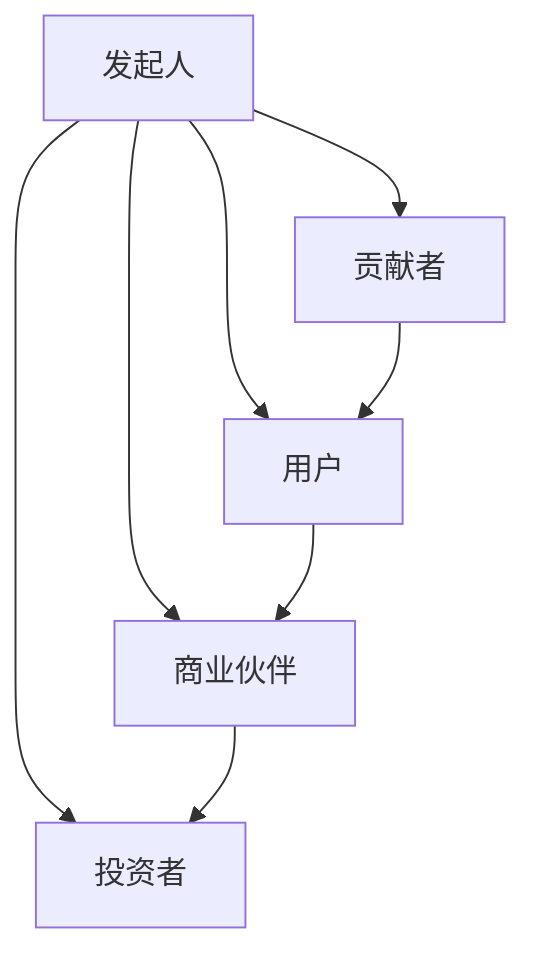

                 

关键词：开源项目，商业生态系统，盈利模式，技术创新，社区参与，用户增长。

## 摘要

本文探讨了如何建立开源项目的商业生态系统，旨在为开源项目提供可持续的商业模式，促进技术创新和社区参与。我们将从开源项目的背景介绍开始，深入探讨核心概念和联系，分析核心算法原理，讲解数学模型和公式，提供项目实践代码实例，分析实际应用场景，展望未来发展趋势与挑战，并推荐相关工具和资源。

## 1. 背景介绍

随着信息技术的发展，开源项目已成为软件开发的重要方式之一。开源项目以其透明性、协作性和灵活性吸引了大量开发者参与，推动了技术的进步和软件的普及。然而，开源项目的可持续发展面临诸多挑战，其中之一是如何建立有效的商业生态系统。

商业生态系统是开源项目成功的关键因素，它不仅为开源项目提供经济支持，还能促进技术创新、社区参与和用户增长。本文将介绍如何建立开源项目的商业生态系统，包括核心概念、算法原理、数学模型、实践应用和未来发展等方面。

## 2. 核心概念与联系

### 2.1 开源项目的定义

开源项目是指遵循特定开源协议（如GPL、BSD、Apache等）的软件项目，其源代码对外公开，允许用户自由地查看、修改和分发。开源项目通常由一个社区共同维护，社区成员通过贡献代码、文档和反馈来推动项目的发展。

### 2.2 商业生态系统的构成

商业生态系统由多个参与方组成，包括开源项目发起人、贡献者、用户、商业伙伴和投资者。各个参与方之间通过协作、交易和竞争形成了一个复杂的网络。

- **开源项目发起人**：负责项目的创建和初始阶段的发展，通常是一个团队或个人。
- **贡献者**：为开源项目提供代码、文档、测试和反馈的开发者。
- **用户**：使用开源项目的最终用户，他们可能来自不同的行业和领域。
- **商业伙伴**：与开源项目合作的企业，提供技术支持、培训和咨询服务。
- **投资者**：为开源项目提供资金支持，以促进其可持续发展。

### 2.3 Mermaid 流程图

以下是一个简化的开源项目商业生态系统的 Mermaid 流程图：



## 3. 核心算法原理 & 具体操作步骤

### 3.1 算法原理概述

开源项目的商业生态系统建立在以下核心算法原理之上：

1. **共享与协作**：通过开源协议，项目发起人鼓励贡献者共享他们的代码和技术，共同推动项目的发展。
2. **激励机制**：通过提供经济激励（如赞助、股权等），鼓励贡献者、用户和商业伙伴积极参与项目。
3. **社区管理**：建立一套有效的社区管理机制，确保项目的发展和社区的稳定。

### 3.2 算法步骤详解

1. **项目发起**：项目发起人创建项目并发布到开源平台上，例如GitHub、GitLab等。
2. **贡献与协作**：贡献者下载项目代码，进行修改和优化，并将改进提交给项目发起人。
3. **用户参与**：用户下载并使用开源项目，提供反馈和建议，促进项目的改进。
4. **商业合作**：商业伙伴为开源项目提供技术支持、培训和咨询服务，并与项目发起人合作开发相关产品。
5. **资金支持**：投资者为开源项目提供资金支持，以促进其可持续发展。

### 3.3 算法优缺点

**优点**：

- **共享与协作**：促进了技术的进步和软件的普及。
- **激励机制**：提高了贡献者的积极性和创造力。
- **社区管理**：增强了社区的稳定性和凝聚力。

**缺点**：

- **资金问题**：开源项目的资金来源相对有限，可能导致项目的发展受阻。
- **质量控制**：开源项目的质量控制难度较大，容易出现漏洞和错误。

### 3.4 算法应用领域

开源项目的商业生态系统适用于各种软件开发领域，如操作系统、数据库、Web 应用程序、云计算等。以下是一些具体的应用领域：

- **操作系统**：如Linux、FreeBSD等。
- **数据库**：如MySQL、PostgreSQL等。
- **Web 应用程序**：如WordPress、Joomla等。
- **云计算**：如OpenStack、Kubernetes等。

## 4. 数学模型和公式 & 详细讲解 & 举例说明

### 4.1 数学模型构建

开源项目的商业生态系统的数学模型可以基于以下几个关键参数：

- **贡献者数量** \(N_c\)：表示参与开源项目的贡献者数量。
- **用户数量** \(N_u\)：表示使用开源项目的用户数量。
- **商业伙伴数量** \(N_b\)：表示与开源项目合作的商业伙伴数量。
- **投资金额** \(I\)：表示投资者为开源项目提供的资金总额。

根据这些参数，我们可以构建以下数学模型：

\[ \text{商业生态系统价值} = f(N_c, N_u, N_b, I) \]

### 4.2 公式推导过程

商业生态系统价值的计算可以分为以下几个步骤：

1. **贡献者价值**：

\[ \text{贡献者价值} = \sum_{c=1}^{N_c} \text{贡献者} \]

2. **用户价值**：

\[ \text{用户价值} = \sum_{u=1}^{N_u} \text{用户} \]

3. **商业伙伴价值**：

\[ \text{商业伙伴价值} = \sum_{b=1}^{N_b} \text{商业伙伴} \]

4. **投资价值**：

\[ \text{投资价值} = I \]

5. **商业生态系统价值**：

\[ \text{商业生态系统价值} = \text{贡献者价值} + \text{用户价值} + \text{商业伙伴价值} + \text{投资价值} \]

### 4.3 案例分析与讲解

假设一个开源项目的数学模型参数如下：

- 贡献者数量 \(N_c = 100\)
- 用户数量 \(N_u = 1000\)
- 商业伙伴数量 \(N_b = 10\)
- 投资金额 \(I = 100,000\) 美元

根据上述数学模型，我们可以计算出商业生态系统价值：

\[ \text{商业生态系统价值} = \sum_{c=1}^{100} \text{贡献者} + \sum_{u=1}^{1000} \text{用户} + \sum_{b=1}^{10} \text{商业伙伴} + 100,000 \]

为了简化计算，我们可以假设每个贡献者、用户和商业伙伴的价值分别为 1000、500 和 5000 美元。则：

\[ \text{商业生态系统价值} = 100 \times 1000 + 1000 \times 500 + 10 \times 5000 + 100,000 \]
\[ \text{商业生态系统价值} = 100,000 + 500,000 + 50,000 + 100,000 \]
\[ \text{商业生态系统价值} = 2,000,000 \text{ 美元} \]

这意味着该开源项目的商业生态系统价值为 2,000,000 美元。

## 5. 项目实践：代码实例和详细解释说明

### 5.1 开发环境搭建

为了实践开源项目的商业生态系统，我们需要搭建一个开发环境。以下是一个简单的开发环境搭建步骤：

1. 安装Git：从 [Git 官网](https://git-scm.com/downloads) 下载并安装 Git。
2. 安装Python：从 [Python 官网](https://www.python.org/downloads/) 下载并安装 Python。
3. 安装Jupyter Notebook：在命令行中运行以下命令：

   ```bash
   pip install notebook
   ```

### 5.2 源代码详细实现

以下是一个简单的开源项目示例，实现了一个基本的计算器功能。我们将使用 Python 和 Jupyter Notebook 进行开发。

```python
import ipywidgets as widgets
from IPython.display import display

def calculate(expression):
    try:
        result = str(eval(expression))
        return result
    except Exception as e:
        return "Error: " + str(e)

input_widget = widgets.Textarea(value="10 + 5", description="Expression:")
output_widget = widgets.Output()

def on_input_change(change):
    with output_widget:
        clear_output(wait=True)
        display(calculate(change.new))

input_widget.observe(on_input_change, names="value")

display(input_widget, output_widget)
```

### 5.3 代码解读与分析

这段代码实现了以下功能：

- **导入模块**：导入了 `ipywidgets` 和 `IPython.display` 模块，用于创建和管理用户界面。
- **定义计算函数**：`calculate()` 函数接收一个字符串参数 `expression`，尝试计算其结果并返回。如果发生错误，则返回错误信息。
- **创建输入框**：`input_widget` 是一个文本框，用户可以在其中输入计算表达式。
- **创建输出框**：`output_widget` 是一个输出框，用于显示计算结果或错误信息。
- **定义输入框变化事件处理器**：`on_input_change()` 函数在输入框的值发生变化时被调用。它调用 `calculate()` 函数并清空输出框，然后显示计算结果或错误信息。
- **观察输入框值变化**：使用 `observe()` 函数监视 `input_widget` 的值变化，并在值变化时调用 `on_input_change()` 函数。

### 5.4 运行结果展示

运行上述代码后，我们将看到一个计算器界面，用户可以在输入框中输入表达式，然后输出框将显示计算结果。例如，输入 "10 + 5" 后，输出框将显示 "15"。

```plaintext
Expression: 10 + 5
15
```

## 6. 实际应用场景

开源项目的商业生态系统在多个实际应用场景中得到了广泛应用，以下是一些具体案例：

### 6.1 操作系统

Linux 是一个典型的开源操作系统，其商业生态系统包括：

- **贡献者**：全球范围内的开发者共同维护 Linux 内核。
- **用户**：企业和个人使用 Linux 进行操作系统部署。
- **商业伙伴**：如 Red Hat、SUSE 等公司提供技术支持、培训和咨询服务。
- **投资者**：Red Hat 公司通过收购其他公司来扩大市场份额，并在纳斯达克上市。

### 6.2 数据库

MySQL 是一个流行的开源数据库，其商业生态系统包括：

- **贡献者**：全球范围内的开发者共同维护 MySQL 数据库。
- **用户**：企业和个人使用 MySQL 进行数据存储和管理。
- **商业伙伴**：如 Oracle、Percona 等公司提供技术支持、培训和咨询服务。
- **投资者**：Oracle 公司通过收购 MySQL AB 来扩大市场份额。

### 6.3 云计算

OpenStack 是一个开源云计算平台，其商业生态系统包括：

- **贡献者**：全球范围内的开发者共同维护 OpenStack 项目。
- **用户**：企业和个人使用 OpenStack 进行云计算部署。
- **商业伙伴**：如 Rackspace、Red Hat 等公司提供技术支持、培训和咨询服务。
- **投资者**：Rackspace 公司通过收购其他公司来扩大市场份额。

## 7. 未来应用展望

随着信息技术的发展，开源项目的商业生态系统将面临更多的机遇和挑战。以下是一些未来应用展望：

### 7.1 开源与云计算的结合

开源云计算平台如 OpenStack、Kubernetes 等将在未来继续发展，为企业提供更灵活、可扩展的云计算解决方案。商业伙伴和技术服务商将提供更多针对特定场景的云服务和解决方案。

### 7.2 开源硬件与物联网

开源硬件和物联网的结合将带来更多的创新应用，如智能家居、智能交通等。开源项目将促进硬件生态系统的建设，为开发者提供更多工具和资源。

### 7.3 开源人工智能

开源人工智能项目如 TensorFlow、PyTorch 等将继续发展，为研究人员和开发者提供强大的工具。商业伙伴和技术服务商将提供更多针对特定应用场景的人工智能解决方案。

## 8. 工具和资源推荐

### 8.1 学习资源推荐

- 《精通 Python 3》（Mark Lutz）
- 《Linux 命令行与shell脚本编程大全》（Richard Blum）
- 《深入理解计算机系统》（GREG GIGI）
- 《机器学习》（周志华）

### 8.2 开发工具推荐

- GitHub：一个优秀的开源项目托管平台。
- Jupyter Notebook：一个强大的交互式开发环境。
- Docker：一个容器化技术，用于简化开发、测试和部署过程。

### 8.3 相关论文推荐

- "The Cathedral and the Bazaar"（Eric S. Raymond）
- "The Future of Open Source"（Red Hat）
- "Open Source Models for Business"（Stewart Butterfield）

## 9. 总结：未来发展趋势与挑战

开源项目的商业生态系统在技术创新、社区参与和用户增长方面具有巨大潜力。然而，要实现可持续的商业成功，开源项目需要解决资金问题、质量控制等问题。未来，开源项目将继续与云计算、物联网、人工智能等领域紧密结合，为开发者提供更多工具和资源。同时，开源项目的商业化模式将不断创新，以满足市场需求和促进技术进步。

## 10. 附录：常见问题与解答

### 10.1 如何吸引贡献者参与开源项目？

- 提供清晰的贡献指南和代码风格指南。
- 搭建良好的社区氛围，鼓励交流与合作。
- 提供适当的奖励和认可，如赞助、股权等。

### 10.2 如何确保开源项目的质量控制？

- 建立严格的代码审查机制。
- 定期进行代码审计和安全测试。
- 搭建自动化测试框架，确保代码质量。

### 10.3 如何建立可持续的商业生态系统？

- 寻找合适的商业模式，如赞助、订阅、咨询服务等。
- 与商业伙伴建立合作关系，共同推动项目发展。
- 提供优质的技术支持和服务，增强用户满意度。

---

### 文章作者署名：

作者：禅与计算机程序设计艺术 / Zen and the Art of Computer Programming
----------------------------------------------------------------


