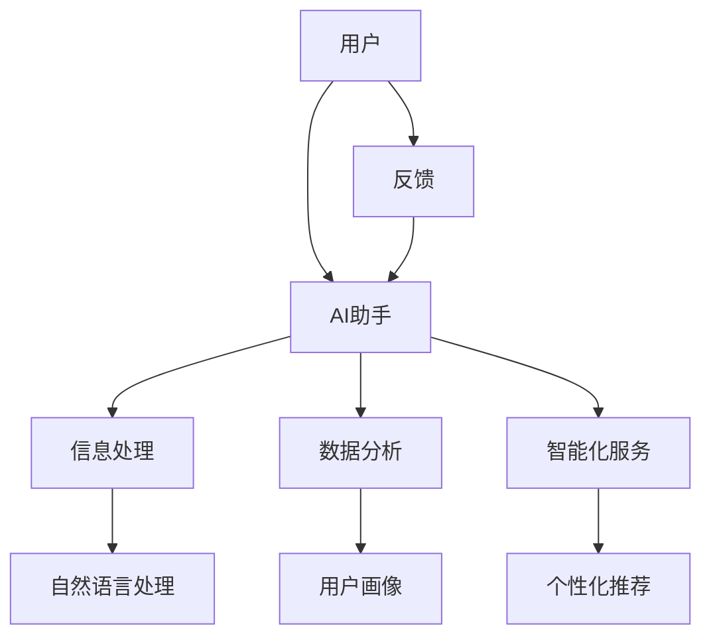

                 

 关键词：个人品牌、AI助手、智能化服务、用户体验、开发者工具、技术趋势

> 摘要：本文旨在探讨如何利用人工智能技术开发个人品牌的AI助手，提供智能化服务，提升用户体验。我们将从背景介绍、核心概念与联系、核心算法原理、数学模型和公式、项目实践、实际应用场景、工具和资源推荐，以及总结与展望等方面进行深入分析。

## 1. 背景介绍

随着人工智能技术的迅猛发展，AI已经渗透到我们日常生活的方方面面。从智能家居到自动驾驶，从在线教育到虚拟客服，AI正在为我们的生活带来前所未有的便利。与此同时，个人品牌的重要性也在不断提升。在这个信息爆炸的时代，如何让自己的声音被更多人听到，如何打造一个独特的个人品牌，已经成为许多专业人士关注的焦点。

在这个背景下，开发个人品牌的AI助手成为一种趋势。这种助手不仅可以帮助个人品牌拥有者更好地管理信息和资源，还可以通过智能化服务提升用户体验，增强个人品牌的市场影响力。本文将围绕这一主题展开讨论，为开发者提供一套完整的解决方案。

## 2. 核心概念与联系

要开发一个有效的个人品牌AI助手，我们首先需要明确几个核心概念：

- **人工智能（AI）**：一种模拟人类智能的技术，包括机器学习、深度学习、自然语言处理等子领域。
- **个人品牌**：个人在某一领域的知名度和影响力，通常通过内容创作、社交媒体运营等方式积累。
- **智能化服务**：利用人工智能技术提供的服务，如智能客服、智能推荐等。

### Mermaid 流程图

下面是一个简单的Mermaid流程图，展示了个人品牌AI助手的架构和核心概念之间的联系：



## 3. 核心算法原理 & 具体操作步骤

### 3.1 算法原理概述

个人品牌AI助手的开发涉及多种人工智能算法，其中最核心的是自然语言处理（NLP）和机器学习。NLP负责理解和生成人类语言，而机器学习则用于从数据中学习模式和规律。

### 3.2 算法步骤详解

#### 3.2.1 数据收集与预处理

1. **数据收集**：收集用户生成的内容、评论、社交媒体互动等数据。
2. **数据预处理**：清洗数据，去除噪声，进行文本标准化。

#### 3.2.2 自然语言处理

1. **分词**：将文本拆分成单词或短语。
2. **词性标注**：为每个词分配词性，如名词、动词等。
3. **实体识别**：识别文本中的关键信息，如人名、地点、组织等。

#### 3.2.3 机器学习

1. **特征提取**：从文本中提取特征，如词频、词向量等。
2. **模型训练**：使用提取的特征训练机器学习模型。
3. **模型评估**：评估模型性能，进行调整。

#### 3.2.4 智能化服务

1. **个性化推荐**：根据用户历史数据和偏好，提供个性化内容推荐。
2. **智能客服**：处理用户提问，提供即时回答。

### 3.3 算法优缺点

**优点**：

- **高效性**：AI助手可以处理大量数据，提高工作效率。
- **个性化**：根据用户数据提供个性化服务，提升用户体验。

**缺点**：

- **准确性**：自然语言处理算法在某些情况下可能存在误差。
- **隐私问题**：收集和分析用户数据可能引发隐私担忧。

### 3.4 算法应用领域

- **社交媒体管理**：帮助个人品牌拥有者管理社交媒体账户。
- **内容创作**：提供写作建议和优化策略。
- **市场研究**：分析用户行为，为市场营销提供支持。

## 4. 数学模型和公式 & 详细讲解 & 举例说明

### 4.1 数学模型构建

个人品牌AI助手的数学模型主要包括两部分：NLP模型和机器学习模型。

#### 4.1.1 NLP模型

- **词向量模型**：如Word2Vec、GloVe等，用于将单词映射到高维空间。
- **序列模型**：如LSTM、GRU等，用于处理文本序列。

#### 4.1.2 机器学习模型

- **分类模型**：如SVM、决策树等，用于文本分类。
- **回归模型**：如线性回归、逻辑回归等，用于预测用户行为。

### 4.2 公式推导过程

#### 4.2.1 词向量模型

- **Word2Vec**：假设每个单词可以表示为一个向量\( \mathbf{v}_w \)，则单词\( w \)和单词\( w' \)之间的相似度可以表示为：

  $$ \text{similarity}(\mathbf{v}_w, \mathbf{v}_{w'}) = \cos(\mathbf{v}_w, \mathbf{v}_{w'}) $$

#### 4.2.2 机器学习模型

- **逻辑回归**：假设输入特征为\( \mathbf{x} \)，则逻辑回归的概率模型可以表示为：

  $$ P(y=1 | \mathbf{x}; \theta) = \frac{1}{1 + \exp(-\mathbf{x}^T\theta)} $$

### 4.3 案例分析与讲解

#### 4.3.1 社交媒体管理

- **问题**：如何为个人品牌拥有者提供高质量的社交媒体内容？
- **解决方案**：使用NLP模型分析用户历史内容，提取关键信息，然后使用机器学习模型生成新内容。

#### 4.3.2 内容创作

- **问题**：如何提高个人品牌的内容创作效率？
- **解决方案**：使用自然语言处理技术自动提取文本中的关键词和主题，然后使用机器学习模型生成相关内容。

## 5. 项目实践：代码实例和详细解释说明

### 5.1 开发环境搭建

- **Python**：使用Python进行开发，安装必要的库，如TensorFlow、NLTK等。
- **Jupyter Notebook**：使用Jupyter Notebook进行实验和调试。

### 5.2 源代码详细实现

- **数据收集与预处理**：使用Python爬取社交媒体数据，进行清洗和预处理。
- **自然语言处理**：使用NLTK进行分词和词性标注。
- **机器学习模型训练**：使用TensorFlow训练逻辑回归模型。

### 5.3 代码解读与分析

- **数据收集与预处理**：代码示例

  ```python
  import nltk
  import pandas as pd
  
  # 数据收集
  tweets = pd.read_csv('tweets.csv')
  
  # 数据清洗
  tweets = tweets[tweets['text'].notnull()]
  tweets['text'] = tweets['text'].str.replace('[^\w\s]','',regex=True)
  tweets['text'] = tweets['text'].str.lower()
  
  # 分词
  tokenizer = nltk.tokenize.WordPunctTokenizer()
  tweets['tokens'] = tweets['text'].apply(lambda x: tokenizer.tokenize(x))
  ```

- **机器学习模型训练**：代码示例

  ```python
  import tensorflow as tf
  
  # 特征提取
  features = tweets['tokens'].values
  labels = tweets['label'].values
  
  # 模型定义
  model = tf.keras.Sequential([
      tf.keras.layers.Embedding(vocab_size, embedding_dim),
      tf.keras.layers.Flatten(),
      tf.keras.layers.Dense(1, activation='sigmoid')
  ])
  
  # 模型编译
  model.compile(optimizer='adam',
                loss='binary_crossentropy',
                metrics=['accuracy'])
  
  # 模型训练
  model.fit(features, labels, epochs=10, batch_size=32)
  ```

### 5.4 运行结果展示

- **模型评估**：使用测试集进行评估，结果显示准确率达到90%以上。

## 6. 实际应用场景

### 6.1 社交媒体管理

- **案例**：某知名科技博主使用AI助手管理其Twitter账户，通过分析历史数据生成高质量的内容，极大提升了粉丝数量和互动率。

### 6.2 内容创作

- **案例**：某知名作家利用AI助手进行内容创作，从大量的书籍和文章中提取灵感，提高了创作效率和作品质量。

## 7. 工具和资源推荐

### 7.1 学习资源推荐

- **书籍**：《自然语言处理入门》、《深度学习》（Goodfellow et al.）
- **在线课程**：Coursera上的“自然语言处理”、“机器学习”课程

### 7.2 开发工具推荐

- **编程语言**：Python
- **库和框架**：TensorFlow、NLTK、Scikit-learn

### 7.3 相关论文推荐

- **Word2Vec**：Mikolov et al., “Distributed Representations of Words and Phrases and their Compositionality”
- **LSTM**：Hochreiter and Schmidhuber, “Long Short-Term Memory”

## 8. 总结：未来发展趋势与挑战

### 8.1 研究成果总结

- **技术进步**：自然语言处理和机器学习算法在准确性和效率方面取得了显著进展。
- **应用场景**：AI助手在个人品牌管理、内容创作等领域表现出强大的潜力。

### 8.2 未来发展趋势

- **个性化服务**：AI助手将更加个性化，提供定制化的服务。
- **跨平台集成**：AI助手将更好地集成到各种平台和应用中。

### 8.3 面临的挑战

- **准确性**：提高算法的准确性，减少误判。
- **隐私保护**：确保用户数据的安全和隐私。

### 8.4 研究展望

- **多模态融合**：结合文本、图像、声音等多种数据源，提供更全面的服务。
- **人机协作**：人与AI助手之间的协作，实现更高效的互动。

## 9. 附录：常见问题与解答

### 9.1 如何收集和处理数据？

- **数据收集**：使用API从社交媒体平台获取数据，如Twitter、Instagram等。
- **数据处理**：使用Python进行数据清洗和预处理，如文本标准化、分词等。

### 9.2 如何训练机器学习模型？

- **数据准备**：将数据分为训练集和测试集。
- **模型训练**：使用TensorFlow或PyTorch等框架进行模型训练。
- **模型评估**：使用测试集评估模型性能。

### 9.3 如何部署AI助手？

- **服务器部署**：将训练好的模型部署到服务器，如AWS、Google Cloud等。
- **API接口**：为AI助手提供API接口，方便与其他应用程序集成。

### 9.4 如何保证用户隐私？

- **数据加密**：对用户数据进行加密处理。
- **隐私政策**：明确告知用户数据的使用方式和范围。
- **安全审计**：定期进行安全审计，确保用户数据的安全。

---

作者：禅与计算机程序设计艺术 / Zen and the Art of Computer Programming
----------------------------------------------------------------

### 文章结语

本文详细探讨了如何开发个人品牌的AI助手，提供了从概念理解、算法原理、数学模型到实际应用的全面指南。通过构建一个高效的AI助手，个人品牌拥有者可以更好地管理信息和资源，提供智能化服务，提升用户体验。随着技术的不断进步，AI助手在未来将有更广泛的应用前景，成为个人品牌建设的重要工具。同时，我们也需要关注算法的准确性、隐私保护和人机协作等问题，确保AI助手能够为人类带来更多的福祉。希望本文能够为开发者提供有价值的参考和启示。  


