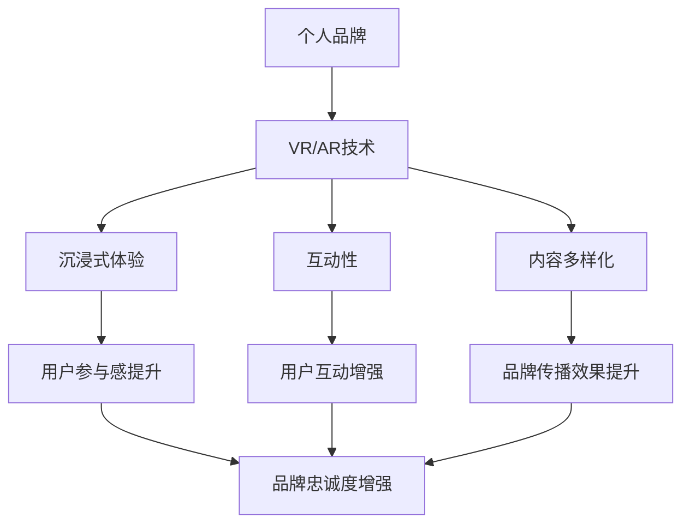

                 

关键词：个人品牌、虚拟现实（VR）、增强现实（AR）、知识传播、用户体验设计、技术趋势。

> 摘要：随着虚拟现实（VR）和增强现实（AR）技术的飞速发展，个人品牌建设迎来了新的机遇。本文将探讨如何利用VR/AR技术创造独特的个人品牌体验，创新知识传播方式，提升用户参与感和品牌忠诚度。

## 1. 背景介绍

在互联网和数字技术迅猛发展的今天，个人品牌建设变得愈发重要。通过个人品牌，个体可以在信息爆炸的时代中脱颖而出，建立自己的专业形象和影响力。传统的个人品牌建设方式包括博客、社交媒体、视频内容等，但这些方式往往存在一些局限性，如内容形式单一、互动性不足等。

VR（Virtual Reality，虚拟现实）和AR（Augmented Reality，增强现实）技术的出现为个人品牌建设提供了新的可能性。VR和AR通过沉浸式的用户体验，为知识传播和品牌展示带来了全新的互动方式。本文将探讨如何利用VR/AR技术来打造个人品牌，提升知识传播的效果。

### 1.1 VR与AR技术的核心概念

- **虚拟现实（VR）**：通过计算机技术模拟出一个完全虚拟的环境，使用户能够沉浸其中，仿佛置身于真实世界中。

- **增强现实（AR）**：通过计算机技术将虚拟信息叠加到现实世界中，使用户能够同时看到现实世界和虚拟元素。

### 1.2 VR与AR在个人品牌建设中的应用

- **沉浸式体验**：通过VR和AR技术，个人品牌可以创建出高度沉浸的体验，吸引用户的注意力。

- **互动性增强**：VR和AR技术提供了丰富的互动方式，用户可以与品牌内容进行互动，提高用户体验。

- **内容多样化**：VR和AR技术使得个人品牌可以创造出多种形式的内容，如图像、视频、三维模型等，丰富品牌表达方式。

### 1.3 技术发展现状与趋势

目前，VR和AR技术已经逐渐成熟，并在多个领域得到应用。未来，随着硬件设备性能的提升、内容创作的丰富化以及用户习惯的养成，VR和AR技术将在个人品牌建设中发挥更大的作用。

## 2. 核心概念与联系

为了深入理解VR/AR在个人品牌建设中的应用，我们需要明确几个核心概念，并探讨它们之间的联系。

### 2.1 个人品牌的概念

个人品牌是指个体在专业领域内建立的形象、声誉和影响力。它包括专业能力、个人特质、品牌传播等多个方面。

### 2.2 VR/AR技术的核心原理

- **VR技术原理**：通过头戴显示器（HMD）或VR眼镜，用户可以进入一个完全虚拟的环境。VR技术依赖于计算机图形学、三维建模、传感器等多个技术领域。

- **AR技术原理**：通过摄像头或传感器捕捉现实环境，将虚拟信息叠加到现实世界中。AR技术涉及图像识别、计算机视觉、光学技术等多个方面。

### 2.3 VR/AR在个人品牌建设中的联系

- **沉浸式体验**：VR和AR技术可以为个人品牌创造沉浸式的体验，使用户在虚拟环境中感受到品牌的独特魅力。

- **互动性**：VR和AR技术提供了丰富的互动方式，用户可以通过手势、声音等与品牌内容进行互动，增强品牌与用户之间的互动性。

- **内容多样化**：VR和AR技术使得个人品牌可以创造出多种形式的内容，如图像、视频、三维模型等，为品牌传播提供了更多可能性。

### 2.4 Mermaid流程图



## 3. 核心算法原理 & 具体操作步骤

### 3.1 算法原理概述

VR和AR技术的核心在于创建虚拟环境和增强现实内容。这涉及到多个算法的运用，包括但不限于：

- **三维建模与渲染算法**：用于创建虚拟场景和对象。
- **图像识别与跟踪算法**：用于捕捉现实环境，并在其中叠加虚拟元素。
- **用户交互算法**：用于处理用户输入，实现虚拟环境和现实世界的互动。

### 3.2 算法步骤详解

#### 3.2.1 VR沉浸式体验创建

1. **场景设计**：根据个人品牌特色设计虚拟场景。
2. **三维建模**：使用三维建模工具创建场景中的对象。
3. **渲染引擎选择**：选择合适的渲染引擎，如Unity或Unreal Engine，进行场景渲染。
4. **用户体验优化**：通过调整参数和优化代码，提高用户体验。

#### 3.2.2 AR增强现实内容创建

1. **目标识别**：使用图像识别算法识别现实环境中的目标。
2. **虚拟元素创建**：在识别到的目标上叠加虚拟元素，如三维模型、动画等。
3. **交互设计**：设计用户与虚拟元素之间的互动方式，如点击、手势等。
4. **实时渲染**：在实时捕捉的现实环境中渲染虚拟元素。

### 3.3 算法优缺点

- **优点**：
  - 提供高度沉浸的体验，增强用户参与感。
  - 增强品牌与用户之间的互动性，提升品牌忠诚度。
  - 多样化的内容形式，丰富品牌表达方式。

- **缺点**：
  - 技术门槛较高，需要专业的技术团队进行开发。
  - 需要高性能的硬件支持，对设备要求较高。
  - 需要大量的时间和资源进行内容创作和优化。

### 3.4 算法应用领域

VR和AR技术在个人品牌建设中的应用广泛，包括但不限于：

- **虚拟展览**：通过VR技术创建虚拟展览空间，展示个人品牌作品。
- **在线教育**：利用AR技术增强学习体验，提供互动式教育内容。
- **品牌推广**：通过沉浸式体验和互动设计，吸引更多潜在用户。
- **市场调研**：通过虚拟环境和互动设计，收集用户反馈和市场数据。

## 4. 数学模型和公式 & 详细讲解 & 举例说明

### 4.1 数学模型构建

在VR和AR技术中，数学模型广泛应用于场景设计、渲染、交互等方面。以下是一个简单的数学模型构建示例。

#### 4.1.1 透视变换

透视变换是将三维空间中的点映射到二维屏幕上的过程。其数学模型可以表示为：

$$
x' = \frac{x}{z}
$$

$$
y' = \frac{y}{z}
$$

其中，\( (x, y, z) \) 是三维空间中的点，\( (x', y') \) 是二维屏幕上的对应点。

#### 4.1.2 三维模型渲染

三维模型渲染涉及到投影、光照、阴影等多个方面。以下是一个简单的三维模型渲染的数学模型：

$$
\text{光照} = \text{光强} \times (\text{表面法线} \cdot \text{光线方向})
$$

其中，\( \text{光强} \) 是一个常数，\( \text{表面法线} \) 和 \( \text{光线方向} \) 是三维向量。

### 4.2 公式推导过程

以下是一个关于三维模型渲染中光照计算的公式推导过程：

1. **光线方向计算**：

   假设光源位于原点 \( (0, 0, 0) \)，光线照射到三维空间中的点 \( (x, y, z) \)。光线方向可以表示为：

   $$ 
   \text{光线方向} = \left( \frac{x}{z}, \frac{y}{z}, \frac{1}{z} \right)
   $$

2. **表面法线计算**：

   假设三维模型的表面是一个平面，其法线 \( \text{表面法线} \) 可以表示为 \( (a, b, c) \)。为了简化计算，我们可以假设法线方向为单位向量。

3. **光照计算**：

   光照强度取决于光线方向和表面法线的夹角。假设光线方向和表面法线的夹角为 \( \theta \)，则：

   $$ 
   \text{光照} = \text{光强} \times (\text{表面法线} \cdot \text{光线方向}) 
   $$

   $$ 
   \text{光照} = \text{光强} \times (a \times \frac{x}{z} + b \times \frac{y}{z} + c \times \frac{1}{z}) 
   $$

   $$ 
   \text{光照} = \text{光强} \times \frac{ax + by + cz}{z} 
   $$

### 4.3 案例分析与讲解

以下是一个关于VR个人品牌展示的案例：

#### 案例背景

一位知名数据科学家希望通过VR技术展示自己的数据分析工具，以提升个人品牌。

#### 案例实施

1. **场景设计**：设计一个现代风格的虚拟办公室，展示数据分析工具。
2. **三维建模**：使用三维建模工具创建数据分析工具的三维模型。
3. **渲染引擎**：使用Unity作为渲染引擎，实现场景渲染和交互。
4. **光照计算**：使用上述数学模型进行光照计算，为场景添加逼真的光照效果。

#### 案例效果

通过VR展示，用户可以身临其境地参观虚拟办公室，与数据分析工具进行互动，深入了解工具的功能和特点。这种沉浸式体验有助于提升用户对品牌的认知和信任，从而增强个人品牌的影响力。

## 5. 项目实践：代码实例和详细解释说明

### 5.1 开发环境搭建

为了实现VR/AR个人品牌体验，我们需要搭建一个合适的开发环境。以下是一个基于Unity引擎的VR/AR开发环境搭建过程：

1. **安装Unity Hub**：从Unity官网下载并安装Unity Hub。
2. **创建新项目**：在Unity Hub中创建一个新的VR/AR项目，选择适当的模板。
3. **配置VR设备**：根据使用VR设备的不同，配置相应的驱动和插件。
4. **导入必要的资源和插件**：下载并导入Unity插件，如Unity ARKit、Unity VRChat等。

### 5.2 源代码详细实现

以下是一个简单的Unity C#脚本示例，用于实现一个基本的VR/AR个人品牌展示界面：

```csharp
using UnityEngine;
using UnityEngine.XR.ARFoundation;

public class BrandARExperience : MonoBehaviour
{
    public ARCameraManager cameraManager;
    public BrandContent content;

    void Start()
    {
        // 初始化AR相机
        cameraManager.enabled = true;

        // 创建品牌内容对象
        GameObject contentObject = new GameObject("BrandContent");
        contentObject.AddComponent<MeshFilter>().mesh = content.mesh;
        contentObject.AddComponent<MeshRenderer>().material = content.material;

        // 将品牌内容对象添加到AR相机视图中
        ARCamera arCamera = cameraManager.GetComponent<ARCamera>();
        arCamera.visualizer.gameObject.transform.position = arCamera.transform.position + arCamera.transform.forward;
        arCamera.visualizer.gameObject.transform.rotation = arCamera.transform.rotation;
        arCamera.visualizer.gameObject.transform.SetParent(contentObject.transform);
    }

    void Update()
    {
        // 处理用户交互
        if (Input.GetKeyDown(KeyCode.Escape))
        {
            // 退出VR/AR体验
            cameraManager.enabled = false;
        }
    }
}
```

### 5.3 代码解读与分析

- **ARCameraManager**：用于管理AR相机和相关功能的组件。
- **BrandContent**：包含品牌内容模型、材质等资源的脚本。
- **Start方法**：在场景初始化时调用，用于设置AR相机和创建品牌内容对象。
- **Update方法**：在每一帧调用，用于处理用户交互。

通过这个简单的示例，我们可以看到如何使用Unity实现一个基本的VR/AR个人品牌展示界面。在实际开发过程中，我们可以根据需要添加更多功能和交互元素，如用户互动、场景切换等。

### 5.4 运行结果展示

当运行上述代码时，用户将看到一个基于AR技术的个人品牌展示界面。用户可以通过设备的手势或控制器与品牌内容进行互动，如旋转、缩放、点击等。这种交互方式使得用户能够更深入地了解品牌，增强用户体验和品牌认知。

## 6. 实际应用场景

### 6.1 虚拟展览

虚拟展览是一种利用VR/AR技术展示个人品牌作品的有效方式。通过虚拟展览，用户可以身临其境地参观展览空间，浏览和互动展品。例如，一位艺术家可以使用VR技术创建一个虚拟画廊，展示自己的画作。用户可以通过VR眼镜在虚拟画廊中漫步，与画作进行互动，如旋转、放大等。

### 6.2 在线教育

在线教育是另一个适合使用VR/AR技术的领域。通过VR/AR技术，教育者可以创建沉浸式的学习体验，提高学生的学习兴趣和参与度。例如，一位教授可以使用AR技术为学生提供一个虚拟的实验室环境，让学生在虚拟实验中学习化学或物理知识。学生可以通过手势或控制器与实验设备进行互动，如调整实验参数、观察实验结果等。

### 6.3 品牌推广

品牌推广是个人品牌建设中不可或缺的一环。VR/AR技术为品牌推广提供了全新的方式，通过创造独特的沉浸式体验，吸引更多潜在用户。例如，一家科技公司可以使用VR技术创建一个虚拟的科技馆，展示公司的产品和技术。用户可以通过VR眼镜在虚拟科技馆中参观，了解公司的产品特点和应用场景。这种互动式体验有助于提升用户对品牌的认知和信任。

### 6.4 未来应用展望

随着VR/AR技术的不断发展和普及，未来在个人品牌建设中的应用前景将更加广阔。以下是一些未来应用展望：

- **个性化定制**：未来，VR/AR技术将能够根据用户的需求和兴趣，提供更加个性化的品牌体验。
- **全息互动**：全息投影技术的应用将使品牌展示更加逼真和立体，用户可以与全息图像进行互动。
- **跨平台融合**：VR/AR技术与其他数字技术（如人工智能、大数据等）的融合，将创造出更多创新的应用场景。

## 7. 工具和资源推荐

### 7.1 学习资源推荐

- **VR/AR开发教程**：Unity官方教程、ARKit官方文档等。
- **VR/AR技术书籍**：《虚拟现实与增强现实技术》等。
- **在线课程**：Coursera、Udemy等平台上的VR/AR相关课程。

### 7.2 开发工具推荐

- **Unity引擎**：适用于开发VR/AR应用的通用引擎。
- **ARKit**：适用于开发iOS平台的AR应用。
- **VRChat**：适用于开发VR社交应用。

### 7.3 相关论文推荐

- **《VR/AR技术在教育中的应用》**：探讨VR/AR技术在教育领域的应用和研究现状。
- **《增强现实与虚拟现实的交互设计研究》**：研究虚拟现实和增强现实交互设计的方法和原则。
- **《虚拟现实与增强现实技术在品牌推广中的应用研究》**：分析VR/AR技术在品牌推广中的应用案例和效果。

## 8. 总结：未来发展趋势与挑战

### 8.1 研究成果总结

本文探讨了VR/AR技术在个人品牌建设中的应用，包括沉浸式体验、互动性、内容多样化等方面的优势。通过实际案例和数学模型分析，展示了VR/AR技术在个人品牌建设中的潜在应用场景和效果。

### 8.2 未来发展趋势

随着VR/AR技术的不断成熟和普及，未来在个人品牌建设中的应用前景将更加广阔。个性化定制、全息互动、跨平台融合等技术趋势将为个人品牌建设带来更多创新和可能性。

### 8.3 面临的挑战

- **技术门槛**：VR/AR技术涉及多个领域，开发成本较高，需要专业的技术团队。
- **硬件设备**：VR/AR应用对硬件设备的要求较高，需要高性能的计算机、头戴显示器等。
- **内容创作**：高质量的VR/AR内容创作需要大量的时间和资源，对创作者的技能和经验有较高要求。

### 8.4 研究展望

未来，VR/AR技术在个人品牌建设中的应用将继续深入发展。通过不断优化技术、降低开发成本、丰富内容创作手段，VR/AR技术将为个人品牌建设带来更多创新和机遇。

## 9. 附录：常见问题与解答

### 9.1 VR/AR技术的基本原理是什么？

VR（Virtual Reality，虚拟现实）通过计算机生成一个虚拟的三维环境，用户戴上头戴显示器（HMD）或其他设备后，能够感受到完全沉浸式的体验。AR（Augmented Reality，增强现实）则是将虚拟信息叠加到现实世界中，用户通过设备看到的现实环境中有虚拟元素的存在。

### 9.2 VR/AR技术对个人品牌建设有哪些优势？

VR/AR技术为个人品牌建设提供了沉浸式体验、互动性、内容多样化等方面的优势。这些特点有助于提高用户参与感、增强品牌忠诚度，并丰富品牌表达方式。

### 9.3 如何选择VR/AR开发工具？

选择VR/AR开发工具时，需要考虑应用场景、开发技能和硬件设备要求等因素。Unity引擎适用于多种平台，ARKit适用于iOS平台，VRChat适用于VR社交应用。

### 9.4 VR/AR内容创作有哪些技巧？

VR/AR内容创作需要考虑用户体验、场景设计、交互设计等方面。保持简洁的设计风格、注重内容质量、优化交互流程是提高VR/AR内容创作效果的关键。

### 9.5 VR/AR技术在教育领域有哪些应用？

VR/AR技术在教育领域有广泛的应用，包括虚拟实验室、虚拟博物馆、互动课件等。这些应用可以提高学生的学习兴趣和参与度，提供更加生动和互动的学习体验。

### 9.6 VR/AR技术的未来发展趋势是什么？

未来，VR/AR技术将继续向个性化定制、全息互动、跨平台融合等方向发展。随着技术的成熟和普及，VR/AR技术将在更多领域得到应用，为个人品牌建设带来更多创新和机遇。

---

**作者：禅与计算机程序设计艺术 / Zen and the Art of Computer Programming**。本文旨在探讨VR/AR技术在个人品牌建设中的应用，为读者提供有益的技术参考和实践指导。在实际应用中，读者可以根据自身需求和实际情况进行调整和优化。如有疑问或建议，欢迎在评论区留言。

