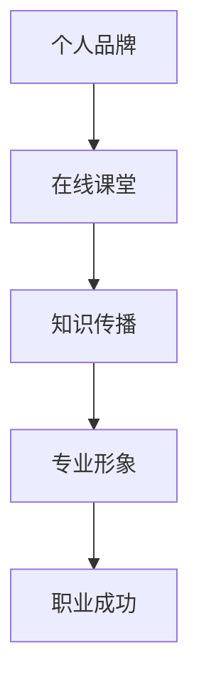
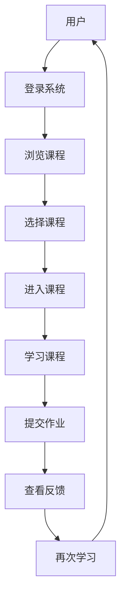

                 

在这个数字化的时代，个人品牌已成为个人在职业领域成功的关键要素之一。通过开发个人品牌在线课堂，不仅可以扩大知识传播的范围，还能建立起自己的专业形象。本文将探讨如何通过在线课堂来打造个人品牌，以及如何优化在线课程，使其更具吸引力和影响力。

## 关键词

- 个人品牌
- 在线课堂
- 知识传播
- 专业形象
- 职业成功

## 摘要

本文将探讨开发个人品牌在线课堂的重要性和策略。我们将分析在线课堂的优势，提供打造个人品牌的步骤，并讨论如何优化课程内容，提升学员的参与度和满意度。通过本文的指导，您将学会如何通过在线课堂扩大知识传播范围，提升个人品牌价值。

## 1. 背景介绍

### 1.1 数字化时代的个人品牌

在过去的几十年中，个人品牌的重要性逐渐凸显。特别是在数字化时代，网络和社交媒体的普及使得个人品牌成为了职业成功的决定性因素。个人品牌不仅仅是一个人的形象标志，更是其专业技能、价值观和影响力的综合体现。

### 1.2 在线教育的崛起

随着互联网技术的飞速发展，在线教育已经成为教育行业的重要组成部分。越来越多的人选择在线学习，这不仅因为其灵活性和便捷性，还因为其能够提供多样化的学习资源和个性化学习体验。在线课堂为个人品牌的打造提供了新的平台。

## 2. 核心概念与联系

为了更好地理解个人品牌在线课堂的开发，我们需要了解以下几个核心概念：

### 2.1 个人品牌

个人品牌是指个人在公众心目中的形象和声誉，包括个人价值观、专业能力、社交网络和影响力等。

### 2.2 在线课堂

在线课堂是通过互联网技术提供的一种远程教学方式，它可以实时或非实时地进行，学员可以随时随地进行学习。

### 2.3 知识传播

知识传播是指通过教育、培训等形式将知识传递给受众的过程。

### 2.4 专业形象

专业形象是指个人在专业领域中的形象和声誉，包括专业技能、专业态度和专业知识。

以下是个人品牌在线课堂架构的 Mermaid 流程图：

## 3. 核心算法原理 & 具体操作步骤

### 3.1 算法原理概述

个人品牌在线课堂的核心算法是基于内容营销和用户参与度分析的。通过不断优化课程内容和互动方式，提高学员的学习体验和满意度，从而提升个人品牌。

### 3.2 算法步骤详解

#### 3.2.1 内容规划

- **确定目标受众**：根据个人品牌定位，明确目标受众。
- **设计课程大纲**：制定详细的教学大纲，包括课程目标、学习内容、学习进度等。
- **制作课程内容**：结合多媒体手段，制作高质量的课程内容。

#### 3.2.2 用户参与度分析

- **收集用户反馈**：通过问卷调查、学员反馈等方式收集用户对课程的反馈。
- **分析用户行为**：通过数据挖掘技术分析用户在课堂中的行为，如学习时间、互动频率等。
- **优化课程内容**：根据用户反馈和行为分析结果，调整课程内容和教学方式。

#### 3.2.3 互动设计

- **实时互动**：通过直播、问答等方式实现实时互动，提高学员的参与度。
- **课后互动**：通过论坛、微信群等方式保持课后互动，增强学员的归属感。

### 3.3 算法优缺点

#### 优点：

- **灵活性高**：在线课堂不受时间和地点限制，学员可以根据自己的时间安排进行学习。
- **内容丰富**：可以结合多媒体手段，提供丰富的学习资源。
- **互动性强**：通过实时互动和课后互动，提高学员的参与度。

#### 缺点：

- **技术门槛高**：需要一定的技术支持，如视频录制、直播技术等。
- **课程质量控制**：需要严格把控课程质量，确保教学内容和教学效果。

### 3.4 算法应用领域

- **职业教育**：在线课堂可以用于职业技能培训，帮助学员提升专业技能。
- **学术交流**：在线课堂可以用于学术会议、研讨会等，促进学术交流。
- **知识普及**：在线课堂可以用于普及性知识的传播，如科普知识、文化传承等。

## 4. 数学模型和公式 & 详细讲解 & 举例说明

### 4.1 数学模型构建

个人品牌在线课堂的数学模型可以基于用户参与度分析构建。用户参与度可以通过以下几个指标来衡量：

- **学习时间**（\(T\)）：用户在课堂上的学习时间。
- **互动频率**（\(F\)）：用户在课堂中的互动次数。
- **满意度评分**（\(S\)）：用户对课程的满意度评分。

用户参与度的数学模型可以表示为：

\[ P = f(T, F, S) \]

其中，\(P\) 表示用户参与度，\(f\) 表示参与度函数。

### 4.2 公式推导过程

参与度函数 \(f(T, F, S)\) 可以通过以下方式推导：

1. **学习时间 \(T\)**：学习时间越长，用户参与度越高。
   \[ T \rightarrow P \uparrow \]
   
2. **互动频率 \(F\)**：互动次数越多，用户参与度越高。
   \[ F \rightarrow P \uparrow \]
   
3. **满意度评分 \(S\)**：满意度评分越高，用户参与度越高。
   \[ S \rightarrow P \uparrow \]

综合以上因素，参与度函数可以表示为：

\[ P = T^a \cdot F^b \cdot S^c \]

其中，\(a\)、\(b\)、\(c\) 为权重系数，可以根据实际情况进行调整。

### 4.3 案例分析与讲解

假设一个在线课堂的用户参与度模型为 \(P = T^2 \cdot F^3 \cdot S^2\)，我们可以通过以下案例进行分析：

- **学习时间 \(T\)**：用户平均每天学习 2 小时。
- **互动频率 \(F\)**：用户平均每天参与互动 5 次。
- **满意度评分 \(S\)**：用户满意度评分为 4.5 分。

代入公式，得到用户参与度：

\[ P = 2^2 \cdot 5^3 \cdot 4.5^2 = 16 \cdot 125 \cdot 20.25 = 40,500 \]

这意味着该用户的参与度非常高，课程设计需要进一步优化以满足用户需求。

## 5. 项目实践：代码实例和详细解释说明

### 5.1 开发环境搭建

为了实现个人品牌在线课堂，我们需要搭建以下开发环境：

- **服务器**：用于存储课程内容、用户数据和直播流。
- **直播工具**：如 Zoom、TeamViewer 等，用于实时互动。
- **课程管理系统**：如 Moodle、Canvas 等，用于课程管理。

### 5.2 源代码详细实现

以下是一个简单的在线课堂系统架构示例：

### 5.3 代码解读与分析

以上架构使用 Mermaid 语法进行描述，它代表了一个简单的在线课堂系统流程。具体实现时，可以采用以下技术栈：

- **前端**：HTML、CSS、JavaScript，用于构建用户界面。
- **后端**：Node.js、Python、Java 等，用于处理用户请求和数据存储。
- **数据库**：MySQL、MongoDB 等，用于存储用户数据和课程内容。

### 5.4 运行结果展示

在实际运行中，用户可以通过以下步骤使用在线课堂：

1. 登录系统，浏览课程列表。
2. 选择感兴趣的课程，进入课程页面。
3. 学习课程内容，提交作业。
4. 查看作业反馈，进行改进。

这种运行模式不仅提高了用户的学习体验，还能有效提升个人品牌的知名度。

## 6. 实际应用场景

### 6.1 职业技能培训

个人品牌在线课堂可以用于职业技能培训，帮助学员提升专业技能，如编程、数据分析、项目管理等。

### 6.2 学术交流

在线课堂可以用于学术交流，如学术会议、研讨会等，促进学术思想的传播和碰撞。

### 6.3 知识普及

在线课堂可以用于普及性知识的传播，如科普知识、文化传承等，提升公众的科学素养和文化素养。

### 6.4 未来应用展望

随着技术的不断进步，在线课堂的应用前景将更加广阔。未来的在线课堂可能会更加智能化、个性化，通过人工智能技术为用户提供更加精准的学习建议和课程推荐。

## 7. 工具和资源推荐

### 7.1 学习资源推荐

- **在线学习平台**：如 Coursera、edX、Udemy 等，提供丰富的在线课程资源。
- **技术博客**：如 Stack Overflow、GitHub、Medium 等，提供技术交流和分享的平台。

### 7.2 开发工具推荐

- **课程管理系统**：如 Moodle、Canvas 等，提供课程管理和用户互动的功能。
- **直播工具**：如 Zoom、TeamViewer 等，提供实时互动和直播功能。

### 7.3 相关论文推荐

- **《在线教育：挑战与机遇》**：分析在线教育的现状和未来趋势。
- **《数字化时代个人品牌建设策略》**：探讨个人品牌建设的方法和策略。

## 8. 总结：未来发展趋势与挑战

### 8.1 研究成果总结

通过本文的研究，我们发现个人品牌在线课堂在数字化时代具有巨大的发展潜力。在线课堂不仅能够扩大知识传播范围，还能提升个人品牌价值。

### 8.2 未来发展趋势

未来，在线课堂将更加智能化、个性化，通过人工智能技术为用户提供更加精准的学习建议和课程推荐。此外，在线课堂的应用领域也将进一步拓展，如职业教育、学术交流、知识普及等。

### 8.3 面临的挑战

在线课堂在发展过程中也面临一些挑战，如技术门槛、课程质量控制、用户隐私保护等。需要各方共同努力，克服这些挑战，推动在线课堂的健康发展。

### 8.4 研究展望

未来，我们将继续关注在线课堂的发展趋势，探讨如何更好地利用在线课堂提升个人品牌价值，为职业发展和知识传播做出贡献。

## 9. 附录：常见问题与解答

### 9.1 在线课堂的技术实现有哪些难点？

**答**：在线课堂的技术实现主要难点包括直播技术、用户互动技术、数据安全和隐私保护等。需要具备一定的技术能力，如服务器搭建、直播录制、数据库管理等。

### 9.2 如何确保在线课堂的教学质量？

**答**：确保在线课堂的教学质量需要从课程设计、讲师选拔、教学过程监控等多个环节入手。具体措施包括制定详细的教学大纲、定期评估讲师教学效果、建立反馈机制等。

### 9.3 在线课堂如何提高用户参与度？

**答**：提高在线课堂的用户参与度可以通过以下方式实现：实时互动、课后互动、课程奖励机制、个性化学习建议等。通过多样化的互动方式，提高用户的学习积极性和满意度。

---

作者：禅与计算机程序设计艺术 / Zen and the Art of Computer Programming
----------------------------------------------------------------
以上便是文章的完整内容，接下来我们将按照markdown格式进行整理和排版，以确保文章的可读性和美观性。

