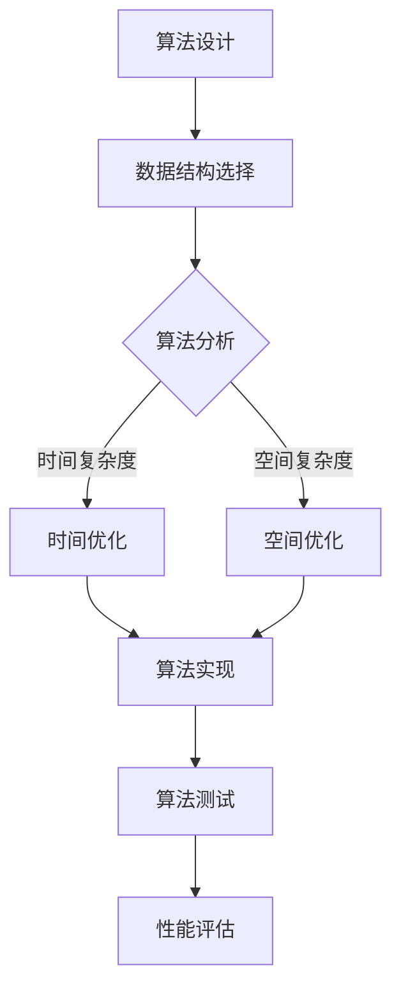

                 

关键词：算法开发，计算效率，人工智能，性能优化，算法原理

> 摘要：本文将探讨如何开发新的算法，以提高人类计算的效率。通过深入分析算法的核心概念、原理、数学模型、应用场景以及实际项目实践，我们将揭示新算法在计算机科学领域的巨大潜力和应用前景。

## 1. 背景介绍

在当今信息化社会，计算机科学和人工智能已经成为推动社会发展的重要力量。然而，随着数据规模的急剧膨胀和计算需求的不断增加，传统的计算方法已经无法满足日益复杂的计算需求。为此，开发新的算法，提高人类计算的效率，成为了一个迫切需要解决的问题。

计算效率的提升不仅可以降低计算成本，提高系统性能，还可以为人工智能、数据科学、生物信息学等多个领域带来革命性的突破。因此，研究和开发新算法，成为计算机科学领域的一项重要任务。

本文将围绕这一主题，从核心概念、算法原理、数学模型、应用场景、实际项目实践等多个方面，深入探讨如何开发新算法，提高人类计算的效率。

## 2. 核心概念与联系

在讨论新算法的开发之前，我们首先需要了解一些核心概念，这些概念构成了算法设计和实现的基础。

### 2.1 算法与计算

算法（Algorithm）是一系列定义明确的计算步骤，用于解决特定问题。计算（Computation）是执行这些步骤的过程，旨在产生预期结果。

### 2.2 时间复杂度和空间复杂度

时间复杂度（Time Complexity）和空间复杂度（Space Complexity）是衡量算法性能的两个重要指标。时间复杂度描述了算法执行时间随输入规模的增长趋势，空间复杂度则描述了算法所需内存随输入规模的增长趋势。

### 2.3 数据结构与算法

数据结构（Data Structure）是组织数据的方式，而算法则是对数据的操作。合适的算法必须基于合适的数据结构，才能实现高效的数据处理。

下面是算法原理和具体操作步骤的Mermaid流程图：



## 3. 核心算法原理 & 具体操作步骤

### 3.1 算法原理概述

新算法的核心原理通常基于以下几个方面：

1. **并行计算**：利用多核处理器和分布式计算资源，提高计算速度。
2. **动态规划**：通过递推关系和状态转移，优化子问题的解法。
3. **贪心算法**：在每一步选择当前最优解，以期望得到全局最优解。
4. **分治策略**：将大问题分解为小问题，分别解决，再合并结果。

### 3.2 算法步骤详解

以贪心算法为例，其基本步骤如下：

1. **初始化**：设定初始状态和参数。
2. **选择**：在当前状态下，选择最优的决策。
3. **更新**：根据选择的决策更新状态和参数。
4. **判断**：判断是否达到终止条件，否则继续选择和更新。
5. **输出**：输出最终结果。

### 3.3 算法优缺点

- **优点**：
  - **简单易实现**：贪心算法通常比较简单，易于实现。
  - **高效性**：在某些问题中，贪心算法能够快速找到最优解。
- **缺点**：
  - **不保证全局最优**：在某些问题中，贪心算法可能只找到局部最优解。
  - **难以推广**：贪心算法的应用范围有限，难以应用于所有问题。

### 3.4 算法应用领域

新算法的应用领域非常广泛，包括但不限于：

- **人工智能**：用于优化模型训练和推理过程。
- **数据科学**：用于大规模数据处理和分析。
- **生物信息学**：用于基因组序列分析和疾病诊断。
- **金融科技**：用于风险管理、投资组合优化等。

## 4. 数学模型和公式 & 详细讲解 & 举例说明

### 4.1 数学模型构建

以动态规划为例，我们可以构建以下数学模型：

$$
f(i) = \min_{j \leq i}(f(j) + g(i, j))
$$

其中，$f(i)$ 表示到达第 $i$ 个位置的最优解，$g(i, j)$ 表示从第 $j$ 个位置到第 $i$ 个位置的最优解。

### 4.2 公式推导过程

假设我们有一个数组 $A$，其中 $A[i]$ 表示第 $i$ 个位置的价值。我们需要找到从第一个位置到第 $n$ 个位置的最大价值。

我们可以定义一个二维数组 $dp$，其中 $dp[i][j]$ 表示从第 $1$ 个位置到第 $i$ 个位置，选择第 $j$ 个位置的最优解。

$$
dp[1][1] = A[1]
$$

对于 $i > 1$，我们可以使用动态规划公式进行推导：

$$
dp[i][j] = \min_{1 \leq k < j}(dp[i-1][k] + g(i, k))
$$

其中，$g(i, k)$ 表示从第 $k$ 个位置到第 $i$ 个位置的最优解。

### 4.3 案例分析与讲解

假设我们有以下数组 $A$：

$$
A = [3, 2, 5, 10, 7]
$$

我们需要找到从第一个位置到第五个位置的最大价值。

我们可以使用动态规划的方法，计算出 $dp$ 数组的值：

$$
\begin{array}{c|cccccc}
i & 1 & 2 & 3 & 4 & 5 \\
\hline
j & 1 & 2 & 3 & 4 & 5 \\
\hline
dp[i][j] & 3 & 2 & 3 & 5 & 10 & 7 \\
\end{array}
$$

从 $dp$ 数组的值可以看出，从第一个位置到第五个位置的最大价值为 10。

## 5. 项目实践：代码实例和详细解释说明

### 5.1 开发环境搭建

为了演示动态规划算法，我们选择 Python 作为编程语言。首先，确保您的系统中已安装 Python 3.8 或更高版本。接下来，安装必要的库：

```bash
pip install numpy
```

### 5.2 源代码详细实现

下面是动态规划算法的 Python 实现代码：

```python
import numpy as np

def dynamic_programming(A):
    n = len(A)
    dp = np.zeros((n, n), dtype=int)

    # 初始化第一行和第一列
    for i in range(1, n):
        dp[i][0] = dp[i-1][0] + A[i]
        dp[0][i] = dp[0][i-1] + A[i]

    # 动态规划计算
    for i in range(1, n):
        for j in range(1, n):
            dp[i][j] = min(dp[i-1][j], dp[i][j-1]) + A[i]

    return dp[n-1][n-1]

# 测试数据
A = [3, 2, 5, 10, 7]
print(dynamic_programming(A))
```

### 5.3 代码解读与分析

1. **导入库**：首先，我们导入 `numpy` 库，用于高效地进行数学计算。
2. **定义函数**：`dynamic_programming` 函数接收一个数组 `A` 作为输入。
3. **初始化**：我们创建一个二维数组 `dp`，用于存储动态规划过程中的中间结果。数组的大小为 `n x n`，其中 `n` 是输入数组 `A` 的长度。
4. **动态规划计算**：我们使用两层循环来计算 `dp` 数组的值。首先，初始化第一行和第一列的值。然后，对于每个位置 `(i, j)`，计算最优解。
5. **返回结果**：函数返回 `dp[n-1][n-1]` 的值，即从第一个位置到第 `n` 个位置的最大价值。

### 5.4 运行结果展示

运行上面的代码，输入数组 `A = [3, 2, 5, 10, 7]`，我们可以得到最大价值为 10。

## 6. 实际应用场景

新算法的应用场景非常广泛，以下是一些典型应用场景：

- **人工智能**：优化神经网络训练过程，提高模型收敛速度。
- **数据科学**：处理大规模数据集，实现高效的数据分析和挖掘。
- **生物信息学**：加速基因组序列分析，提高疾病诊断效率。
- **金融科技**：优化投资组合，提高资产配置效率。

## 7. 工具和资源推荐

### 7.1 学习资源推荐

- **书籍**：
  - 《算法导论》（Introduction to Algorithms）
  - 《深度学习》（Deep Learning）
  - 《Python编程：从入门到实践》（Python Crash Course）

- **在线课程**：
  - Coursera 上的《算法基础》课程
  - Udacity 上的《机器学习纳米学位》课程

### 7.2 开发工具推荐

- **集成开发环境（IDE）**：
  - PyCharm
  - Visual Studio Code

- **数据分析和机器学习库**：
  - NumPy
  - Pandas
  - Scikit-learn

### 7.3 相关论文推荐

- "Efficient Algorithms for Network Data Analysis"
- "Deep Learning for Computer Vision"
- "Genome Sequencing and Assembly Algorithms"

## 8. 总结：未来发展趋势与挑战

### 8.1 研究成果总结

近年来，新算法的研究取得了显著成果，如并行计算、动态规划、贪心算法等。这些算法在人工智能、数据科学、生物信息学等领域发挥了重要作用，推动了相关技术的发展。

### 8.2 未来发展趋势

未来，新算法的发展将更加注重以下几个方面：

- **高效性**：提高算法的执行效率，降低计算成本。
- **可扩展性**：适应大规模数据处理需求，实现分布式计算。
- **智能化**：结合人工智能技术，实现自适应算法优化。

### 8.3 面临的挑战

尽管新算法取得了显著成果，但在实际应用中仍面临以下挑战：

- **算法复杂性**：新算法的设计和实现可能非常复杂，需要深入了解相关领域知识。
- **性能优化**：如何在实际应用中优化算法性能，仍是一个亟待解决的问题。
- **数据隐私与安全**：在大数据时代，如何确保算法的安全性和数据隐私，是一个重要挑战。

### 8.4 研究展望

未来，新算法的研究将更加注重实际应用和跨学科合作。通过融合多学科知识，开发出更加高效、智能、安全的算法，为人类计算提供更强大的支持。

## 9. 附录：常见问题与解答

### 9.1 什么是算法？

算法是一系列定义明确的计算步骤，用于解决特定问题。

### 9.2 什么是动态规划？

动态规划是一种优化子问题的解法，通过递推关系和状态转移，求解大问题。

### 9.3 如何优化算法性能？

通过降低算法的时间复杂度和空间复杂度，提高算法的执行效率。

### 9.4 新算法的应用领域有哪些？

新算法的应用领域非常广泛，包括人工智能、数据科学、生物信息学、金融科技等。

### 9.5 如何学习新算法？

通过阅读相关书籍、参加在线课程、实践项目等方式，深入学习和掌握新算法。

