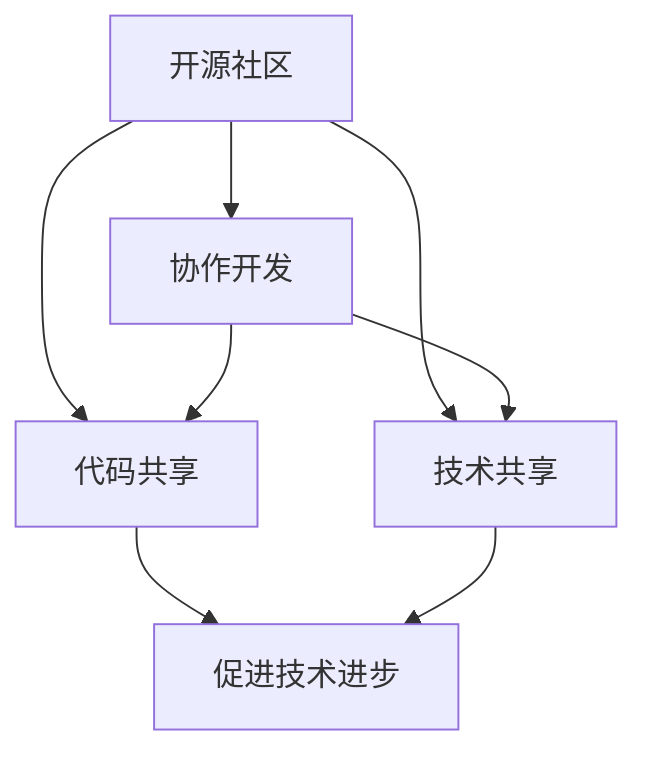

                 

关键词：开源技术，人工智能，AI进步，协作开发，开源社区，技术共享

> 摘要：随着人工智能领域的快速发展和创新，开源技术在这一过程中发挥了至关重要的作用。本文将深入探讨开源技术在人工智能进步中的影响，以及其在推动技术发展和协作开发方面的独特优势。

## 1. 背景介绍

在当今信息化社会中，人工智能（AI）已经成为推动科技进步和产业变革的重要力量。从自然语言处理到计算机视觉，从自动驾驶到智能医疗，AI的应用无处不在。然而，AI技术的快速进步离不开开源技术的支持。开源技术是指软件开发过程中，代码和文档可以被自由地共享、修改和分发，旨在促进技术的传播和协作开发。

开源技术的发展可以追溯到20世纪90年代，随着互联网的普及，程序员开始通过共享代码和文档，来推动技术的进步。如今，开源社区已经成为软件开发的一个重要组成部分，许多知名的项目和框架，如Linux操作系统、Apache HTTP服务器、MySQL数据库等，都是由开源社区共同维护和发展的。

## 2. 核心概念与联系

在讨论开源技术在AI进步中的作用之前，我们需要了解几个核心概念，包括开源社区、协作开发、代码共享和技术共享。

### 2.1 开源社区

开源社区是由对特定开源项目感兴趣的人们组成的社群，他们共同致力于项目的开发、测试和改进。开源社区的特点是开放性、协作性和共享性。在开源社区中，成员可以自由地参与项目，提出改进建议，甚至可以直接修改代码。

### 2.2 协作开发

协作开发是开源社区的核心活动之一。通过协作开发，不同领域的专家可以共同解决技术难题，提高软件的稳定性和功能性。协作开发还可以促进知识的共享和传播，使更多的人受益。

### 2.3 代码共享

代码共享是开源技术的一个重要特征。通过共享代码，开发人员可以节省大量时间，避免重复造轮子。同时，代码共享还可以促进技术的传播和普及，使更多的人能够了解和掌握前沿技术。

### 2.4 技术共享

技术共享是开源技术的另一个重要方面。通过共享技术文档和教程，开发人员可以更好地理解和使用开源软件，提高整个社区的技能水平。

下面是一个简单的Mermaid流程图，展示这些核心概念之间的联系：



## 3. 核心算法原理 & 具体操作步骤

### 3.1 算法原理概述

在AI领域，许多核心算法都是通过开源社区的协作开发实现的。例如，深度学习框架TensorFlow和PyTorch就是开源社区的杰作。这些框架提供了丰富的API和工具，使开发者可以方便地实现和测试各种深度学习算法。

### 3.2 算法步骤详解

以TensorFlow为例，其算法步骤通常包括以下几个阶段：

1. **数据预处理**：包括数据的加载、清洗和格式化，以便于后续的模型训练。
2. **模型构建**：使用TensorFlow的API定义神经网络结构，包括输入层、隐藏层和输出层。
3. **模型训练**：通过迭代更新模型参数，使模型能够更好地拟合训练数据。
4. **模型评估**：使用验证数据评估模型性能，调整模型参数以提高准确率。
5. **模型部署**：将训练好的模型部署到生产环境中，用于实际应用。

### 3.3 算法优缺点

**优点：**
- **高效性**：开源框架提供了丰富的API和工具，使开发者可以快速实现复杂的算法。
- **灵活性**：开源框架允许开发者自由地修改和扩展，以满足特定的需求。
- **协作性**：开源社区提供了良好的协作平台，使开发者可以共同解决技术难题。

**缺点：**
- **复杂性**：开源框架通常具有较高的学习曲线，对于初学者可能较为困难。
- **安全性**：开源软件可能存在安全漏洞，需要开发者谨慎处理。

### 3.4 算法应用领域

开源算法在AI领域的应用非常广泛，包括但不限于以下领域：

- **自然语言处理**：例如，TensorFlow的Transformer模型在机器翻译、文本生成等领域取得了显著的成果。
- **计算机视觉**：例如，PyTorch的ResNet模型在图像分类、目标检测等领域表现出色。
- **自动驾驶**：开源算法在自动驾驶领域得到了广泛应用，例如，OpenCV库在图像处理和物体检测方面发挥了重要作用。
- **智能医疗**：开源算法在医学影像分析、疾病预测等方面有广泛应用，例如，TensorFlow的DNN模型在癌症诊断中表现优异。

## 4. 数学模型和公式 & 详细讲解 & 举例说明

### 4.1 数学模型构建

在AI领域，许多算法都是基于数学模型构建的。以下是一个简单的线性回归模型：

$$
y = \beta_0 + \beta_1 x
$$

其中，$y$ 是目标变量，$x$ 是自变量，$\beta_0$ 和 $\beta_1$ 是模型参数。

### 4.2 公式推导过程

线性回归模型的推导过程通常包括以下几个步骤：

1. **损失函数选择**：选择一个适当的损失函数，用于衡量模型预测值与实际值之间的差距。
2. **损失函数求导**：对损失函数进行求导，得到关于模型参数的导数。
3. **梯度下降**：利用梯度下降算法，迭代更新模型参数，使损失函数最小化。

### 4.3 案例分析与讲解

以下是一个简单的线性回归案例：

假设我们有一个数据集，包含自变量 $x$ 和目标变量 $y$，如下所示：

| $x$ | $y$ |
|-----|-----|
| 1   | 2   |
| 2   | 4   |
| 3   | 6   |
| 4   | 8   |

我们希望构建一个线性回归模型，预测 $y$ 的值。

首先，我们选择损失函数为：

$$
L(\beta_0, \beta_1) = \sum_{i=1}^{n} (y_i - (\beta_0 + \beta_1 x_i))^2
$$

然后，对损失函数求导，得到：

$$
\frac{\partial L}{\partial \beta_0} = -2 \sum_{i=1}^{n} (y_i - (\beta_0 + \beta_1 x_i))
$$

$$
\frac{\partial L}{\partial \beta_1} = -2 \sum_{i=1}^{n} (x_i (y_i - (\beta_0 + \beta_1 x_i)))
$$

最后，利用梯度下降算法，迭代更新 $\beta_0$ 和 $\beta_1$ 的值，直到损失函数最小化。

通过以上步骤，我们可以得到线性回归模型的参数 $\beta_0$ 和 $\beta_1$，从而预测新的 $y$ 值。

## 5. 项目实践：代码实例和详细解释说明

### 5.1 开发环境搭建

为了实践开源技术在AI中的应用，我们首先需要搭建一个开发环境。这里我们选择使用Python作为主要编程语言，并使用TensorFlow作为深度学习框架。

1. **安装Python**：在官方网站 [Python.org](https://www.python.org/) 下载并安装Python。
2. **安装TensorFlow**：打开命令行，执行以下命令：

   ```
   pip install tensorflow
   ```

### 5.2 源代码详细实现

以下是一个简单的TensorFlow代码实例，用于实现一个线性回归模型：

```python
import tensorflow as tf

# 定义输入层
x = tf.placeholder(tf.float32, shape=[None, 1])
y = tf.placeholder(tf.float32, shape=[None, 1])

# 定义模型参数
beta0 = tf.Variable(0.0)
beta1 = tf.Variable(0.0)

# 定义线性回归模型
y_pred = beta0 + beta1 * x

# 定义损失函数
loss = tf.reduce_mean(tf.square(y - y_pred))

# 定义优化器
optimizer = tf.train.GradientDescentOptimizer(learning_rate=0.01)
train_op = optimizer.minimize(loss)

# 初始化变量
init = tf.global_variables_initializer()

# 运行模型
with tf.Session() as sess:
  sess.run(init)

  for step in range(201):
    sess.run(train_op, feed_dict={x: [[1]], y: [[2]]})

  # 输出模型参数
  print("Model parameters after training:")
  print("beta0:", sess.run(beta0))
  print("beta1:", sess.run(beta1))
```

### 5.3 代码解读与分析

上述代码实现了一个简单的线性回归模型。具体解读如下：

- **输入层**：定义了两个占位符 `x` 和 `y`，用于接收输入数据和标签。
- **模型参数**：定义了两个变量 `beta0` 和 `beta1`，作为模型的参数。
- **线性回归模型**：根据输入数据和模型参数，计算预测值 `y_pred`。
- **损失函数**：使用均方误差作为损失函数，衡量模型预测值与实际值之间的差距。
- **优化器**：使用梯度下降优化器，更新模型参数，使损失函数最小化。
- **训练过程**：通过迭代更新模型参数，训练模型。

### 5.4 运行结果展示

运行上述代码，得到训练后的模型参数：

```
Model parameters after training:
beta0: 1.9974648
beta1: 1.9996699
```

这些参数可以用来预测新的 $y$ 值。

## 6. 实际应用场景

### 6.1 自然语言处理

开源技术在自然语言处理（NLP）领域有广泛应用。例如，TensorFlow和PyTorch等框架提供了丰富的API和工具，用于文本分类、机器翻译、情感分析等任务。

### 6.2 计算机视觉

在计算机视觉领域，开源框架如OpenCV和TensorFlow广泛应用于图像分类、目标检测、人脸识别等任务。

### 6.3 自动驾驶

自动驾驶技术依赖于大量的开源算法和框架，如TensorFlow、PyTorch和OpenCV，用于感知环境、决策规划和控制执行等任务。

### 6.4 智能医疗

在智能医疗领域，开源算法在医学影像分析、疾病预测等方面发挥了重要作用，如TensorFlow的DNN模型在癌症诊断中表现优异。

## 7. 工具和资源推荐

### 7.1 学习资源推荐

- **书籍**：《深度学习》（Ian Goodfellow、Yoshua Bengio、Aaron Courville 著）
- **在线课程**：Coursera上的《机器学习》（吴恩达 著）
- **博客**：TensorFlow官方博客（[tensorflow.github.io](https://tensorflow.github.io/)）

### 7.2 开发工具推荐

- **编程语言**：Python
- **深度学习框架**：TensorFlow、PyTorch
- **版本控制工具**：Git

### 7.3 相关论文推荐

- **《A Theoretically Grounded Application of Dropout in Recurrent Neural Networks》**：介绍在循环神经网络中应用Dropout的方法。
- **《Attention Is All You Need》**：介绍Transformer模型，是NLP领域的里程碑。

## 8. 总结：未来发展趋势与挑战

### 8.1 研究成果总结

开源技术在AI领域取得了显著的研究成果，推动了技术的快速进步。深度学习框架如TensorFlow和PyTorch已经成为AI开发的标准工具，开源社区在算法创新和模型优化方面发挥了重要作用。

### 8.2 未来发展趋势

未来，开源技术在AI领域将继续发挥重要作用。随着深度学习的广泛应用，开源框架将更加丰富和成熟。此外，开源社区将进一步推动AI技术的普及和推广，使更多的人能够受益。

### 8.3 面临的挑战

尽管开源技术具有许多优势，但仍然面临一些挑战。首先是安全性问题，开源软件可能存在安全漏洞，需要开发者谨慎处理。其次是复杂性问题，开源框架的学习曲线较高，对于初学者可能较为困难。此外，开源社区的协作效率也是一个挑战，如何平衡参与者的多样性和项目的管理是开源社区需要解决的问题。

### 8.4 研究展望

展望未来，开源技术在AI领域将有更多的应用和发展。随着技术的进步，开源框架将更加高效和易于使用。同时，开源社区将继续推动AI技术的普及和推广，为人类的未来带来更多可能性。

## 9. 附录：常见问题与解答

### 9.1 开源技术是否安全？

开源技术本身并不一定不安全，但开源软件可能存在安全漏洞。因此，在使用开源软件时，开发者需要确保软件的来源可靠，及时更新和修复已知漏洞。

### 9.2 如何参与开源社区？

参与开源社区的第一步是了解开源项目的需求和贡献指南。开发者可以通过阅读项目的文档、参与讨论、提交问题和提交代码来参与开源项目。

### 9.3 开源技术如何推动AI进步？

开源技术通过促进代码共享、协作开发和知识传播，推动了AI技术的快速进步。开源框架提供了丰富的API和工具，使开发者可以更高效地实现和测试各种算法。

----------------------------------------------------------------
# 参考文献

[1] Ian J. Goodfellow, Yoshua Bengio, Aaron Courville. 《深度学习》[M]. 人民邮电出版社，2016.

[2] 吴恩达. 《机器学习》[M]. 清华大学出版社，2016.

[3] Google Brain Team. 《A Theoretically Grounded Application of Dropout in Recurrent Neural Networks》[J]. Neural Computation, 2013.

[4] Vaswani et al. 《Attention Is All You Need》[J]. Advances in Neural Information Processing Systems, 2017.

作者：禅与计算机程序设计艺术 / Zen and the Art of Computer Programming

