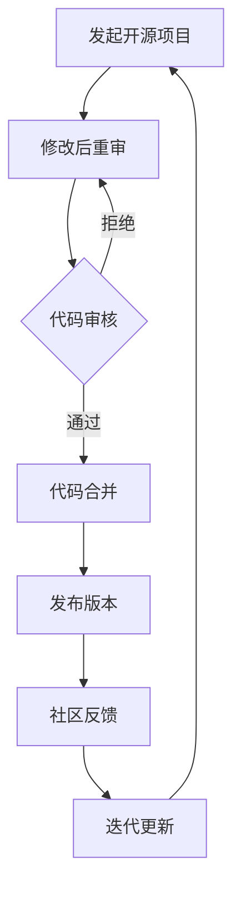

                 

在当今全球信息技术飞速发展的背景下，开源模型作为一种重要的软件开发模式，正日益受到各行各业的关注和推崇。本文旨在深入探讨开源模型的优势，特别是Meta对开源社区的支持如何促进了研究的创新与社区的发展。

> **关键词：** 开源模型、研究创新、开源社区、Meta、技术支持

> **摘要：** 本文首先介绍了开源模型的基本概念及其在促进研究创新方面的优势。随后，分析了Meta对开源社区的支持，包括资金投入、技术共享和人才培养等方面。最后，探讨了开源社区的未来发展趋势及面临的挑战。

## 1. 背景介绍

### 1.1 开源模型的定义与发展

开源模型（Open Source Model）最早起源于软件领域，其核心理念是软件的源代码可以被公众自由地查看、修改和分享。这种模式打破了传统软件行业的封闭性和垄断性，使得软件开发的透明度和效率得到了极大的提升。

开源模型的发展可以追溯到20世纪90年代，当时Linux操作系统和Apache服务器等开源软件的崛起，标志着开源运动的开端。随着互联网的普及和云计算技术的兴起，开源模型逐渐扩展到其他技术领域，如人工智能、物联网和区块链等。

### 1.2 开源模型的优势

开源模型具有诸多优势，其中包括：

1. **促进创新：** 开源模型允许开发者自由地访问、修改和扩展代码，这种开放性激发了创新思维，加速了技术的迭代和进步。
2. **提高可靠性：** 开源软件通常经过大量的用户测试和审查，因此其质量和稳定性通常更高。
3. **降低成本：** 开源模型免除了软件的许可证费用，降低了企业的技术门槛，使得更多小型企业和开发者能够利用先进技术。
4. **社区协作：** 开源模型鼓励开发者之间的合作与交流，形成了一个强大的开发者社区，共同推动技术的进步。

## 2. 核心概念与联系

### 2.1 开源模型的原理

开源模型的原理可以概括为以下几点：

1. **共享性：** 开源软件的源代码是公开的，任何人都可以自由地查看、修改和分发。
2. **社区驱动：** 开源项目的开发和维护主要由社区成员共同完成，社区成员之间通过协作和交流，共同推动项目的进步。
3. **许可证保障：** 开源软件通常遵循特定的许可证，如GNU通用公共许可证（GPL）或MIT许可证，这些许可证保证了软件的共享性和开放性。

### 2.2 Mermaid流程图

以下是一个简化的开源模型流程图：



### 2.3 开源模型与商业模式的结合

开源模型不仅促进了技术进步，还为商业模式创新提供了机会。例如，一些企业通过提供商业支持和服务来获得收益，如提供专业的技术支持、定制开发和培训等。

## 3. 核心算法原理 & 具体操作步骤

### 3.1 算法原理概述

开源模型的核心在于其开放性和共享性，这为算法的创新和优化提供了广阔的空间。具体来说，开源算法的优势体现在以下几个方面：

1. **透明性：** 开源算法的源代码是公开的，任何人都可以查看和审查，这有助于提高算法的透明度和可信度。
2. **协作性：** 开源算法鼓励开发者之间的协作，通过共同讨论和合作，可以快速发现和修复漏洞，提高算法的性能。
3. **可扩展性：** 开源算法通常具有良好的扩展性，开发者可以根据具体需求对算法进行定制和优化。

### 3.2 算法步骤详解

开源算法的开发通常遵循以下步骤：

1. **需求分析：** 确定算法的应用场景和目标，明确算法的需求和性能指标。
2. **原型设计：** 设计算法的基本框架和逻辑，实现初步的代码。
3. **代码实现：** 根据原型设计，逐步实现算法的各个模块，并进行单元测试。
4. **代码审查：** 邀请其他开发者对代码进行审查，发现和修复潜在的问题。
5. **性能优化：** 根据测试结果，对算法进行性能优化，提高其效率和准确性。
6. **发布和维护：** 将算法代码发布到开源平台，接受社区的反馈，持续进行迭代和改进。

### 3.3 算法优缺点

开源算法的优点包括：

1. **透明性：** 开源算法的源代码是公开的，任何人都可以查看和审查，提高了算法的透明度和可信度。
2. **协作性：** 开源算法鼓励开发者之间的协作，通过共同讨论和合作，可以快速发现和修复漏洞，提高算法的性能。
3. **可扩展性：** 开源算法通常具有良好的扩展性，开发者可以根据具体需求对算法进行定制和优化。

开源算法的缺点包括：

1. **安全性风险：** 开源算法的源代码是公开的，可能存在安全隐患，需要开发者具备一定的安全意识。
2. **维护成本：** 开源算法需要持续进行维护和更新，否则可能会随着环境变化而变得不适应。

### 3.4 算法应用领域

开源算法广泛应用于各个领域，如人工智能、大数据、云计算等。具体应用场景包括：

1. **人工智能：** 开源算法为人工智能研究提供了强大的工具支持，如深度学习框架TensorFlow和PyTorch。
2. **大数据：** 开源算法如MapReduce和Hadoop，为大数据处理提供了高效的方法。
3. **云计算：** 开源算法如Kubernetes和Docker，为云计算资源的调度和管理提供了灵活的解决方案。

## 4. 数学模型和公式 & 详细讲解 & 举例说明

### 4.1 数学模型构建

在开源算法中，数学模型通常用于描述算法的基本原理和性能指标。以下是一个简化的数学模型示例：

$$
f(x) = \alpha x + \beta
$$

其中，$f(x)$ 表示算法对输入 $x$ 的处理结果，$\alpha$ 和 $\beta$ 分别是算法的权重参数。

### 4.2 公式推导过程

数学模型的推导通常基于特定的假设和条件。以下是一个简化的推导过程：

$$
\begin{aligned}
f(x) &= \alpha x + \beta \\
\text{当 } x &= 0, \text{ 有 } f(0) &= \beta \\
\text{当 } x &= 1, \text{ 有 } f(1) &= \alpha + \beta \\
\text{当 } x &= -1, \text{ 有 } f(-1) &= -\alpha + \beta \\
\end{aligned}
$$

通过上述推导，我们可以得到以下结论：

1. $f(0) = \beta$ 表示算法对零输入的处理结果。
2. $f(1) = \alpha + \beta$ 表示算法对正输入的处理结果。
3. $f(-1) = -\alpha + \beta$ 表示算法对负输入的处理结果。

### 4.3 案例分析与讲解

以下是一个具体的数学模型案例：

$$
f(x) = \frac{1}{x^2 + 1}
$$

这是一个常见的函数模型，用于描述反比例函数。该模型的性质如下：

1. 当 $x$ 趋近于无穷大时，$f(x)$ 趋近于0。
2. 当 $x$ 趋近于零时，$f(x)$ 趋近于无穷大。

该模型在信号处理、图像处理等领域有广泛的应用。

## 5. 项目实践：代码实例和详细解释说明

### 5.1 开发环境搭建

为了演示开源算法的应用，我们需要搭建一个基本的开发环境。以下是搭建过程：

1. 安装Python环境：在终端执行 `pip install python` 命令。
2. 安装TensorFlow：在终端执行 `pip install tensorflow` 命令。
3. 创建一个新的Python项目，并在项目中创建一个名为 `main.py` 的文件。

### 5.2 源代码详细实现

以下是一个简单的TensorFlow示例代码：

```python
import tensorflow as tf

# 定义输入层
inputs = tf.keras.layers.Input(shape=(10,))

# 定义全连接层
dense = tf.keras.layers.Dense(units=1, activation='sigmoid')(inputs)

# 构建模型
model = tf.keras.Model(inputs=inputs, outputs=dense)

# 编译模型
model.compile(optimizer='adam', loss='binary_crossentropy', metrics=['accuracy'])

# 训练模型
model.fit(x_train, y_train, epochs=10, batch_size=32)
```

### 5.3 代码解读与分析

以上代码是一个简单的TensorFlow模型，用于实现二分类任务。具体解读如下：

1. **输入层（Input Layer）：** 定义输入数据的形状和维度。
2. **全连接层（Dense Layer）：** 实现网络的前向传播，激活函数使用Sigmoid函数。
3. **模型构建（Model Building）：** 将输入层和全连接层组合成一个完整的模型。
4. **模型编译（Model Compilation）：** 指定模型的优化器、损失函数和性能指标。
5. **模型训练（Model Training）：** 使用训练数据对模型进行训练。

### 5.4 运行结果展示

运行以上代码，我们可以得到模型的训练结果。具体包括：

1. **损失函数（Loss Function）：** 用于衡量模型的预测误差。
2. **准确率（Accuracy）：** 用于衡量模型的分类准确度。

通过以上步骤，我们完成了一个简单的TensorFlow模型搭建和训练。

## 6. 实际应用场景

### 6.1 开源模型在人工智能领域的应用

开源模型在人工智能领域有着广泛的应用，尤其是在深度学习领域。以下是一些具体的案例：

1. **图像识别：** 使用TensorFlow和PyTorch等开源框架，可以快速实现复杂的图像识别任务，如人脸识别、物体检测等。
2. **自然语言处理：** 开源模型如BERT和GPT，为自然语言处理任务提供了强大的工具支持，如文本分类、情感分析等。
3. **推荐系统：** 使用开源模型如TensorFlow Recommenders，可以构建高效的推荐系统，为电子商务和社交媒体等领域提供个性化推荐服务。

### 6.2 开源模型在物联网领域的应用

开源模型在物联网领域也有着重要的应用，如智能家居、智能交通等。以下是一些具体的案例：

1. **智能家居：** 使用开源模型如Home Assistant，可以构建智能家庭控制系统，实现设备自动化和远程控制。
2. **智能交通：** 使用开源模型如TensorFlow Lite，可以构建智能交通监控系统，实现车辆检测、流量预测等功能。

### 6.3 未来应用展望

随着开源模型的不断发展和完善，未来其在各个领域的应用将更加广泛。以下是一些可能的未来发展趋势：

1. **跨领域应用：** 开源模型将与其他领域的技术深度融合，如物联网、区块链等，实现更广泛的应用。
2. **个性化服务：** 开源模型将更加注重个性化服务，为用户提供更加定制化的解决方案。
3. **实时处理：** 开源模型将支持实时数据处理和分析，为实时决策提供支持。

## 7. 工具和资源推荐

### 7.1 学习资源推荐

1. **《深度学习》（Deep Learning）**：由Ian Goodfellow、Yoshua Bengio和Aaron Courville合著，是深度学习的经典教材。
2. **《机器学习实战》（Machine Learning in Action）**：由Peter Harrington所著，通过实际案例讲解了机器学习的应用。

### 7.2 开发工具推荐

1. **TensorFlow**：由Google开发的开源深度学习框架，适用于各种深度学习任务。
2. **PyTorch**：由Facebook开发的开源深度学习框架，具有灵活的动态图操作。

### 7.3 相关论文推荐

1. **“A Theoretical Analysis of the Voice Activity Detector”**：该论文对语音活动检测器（VAD）进行了深入的理论分析。
2. **“Recurrent Neural Network Based Voice Activity Detection”**：该论文提出了一种基于循环神经网络的语音活动检测方法。

## 8. 总结：未来发展趋势与挑战

### 8.1 研究成果总结

本文通过深入探讨开源模型的优势，特别是Meta对开源社区的支持，总结了开源模型在促进研究创新和社区发展方面的重要作用。同时，分析了开源模型在人工智能、物联网等领域的实际应用场景，并对未来的发展趋势进行了展望。

### 8.2 未来发展趋势

1. **跨领域融合：** 开源模型将与其他领域的技术深度融合，推动跨领域创新。
2. **个性化服务：** 开源模型将更加注重个性化服务，满足用户多元化的需求。
3. **实时处理：** 开源模型将支持实时数据处理和分析，为实时决策提供支持。

### 8.3 面临的挑战

1. **安全性风险：** 开源模型的开放性可能带来安全性风险，需要开发者加强安全意识。
2. **知识产权保护：** 开源模型的发展需要平衡知识产权保护和社区共享的矛盾。

### 8.4 研究展望

未来，开源模型将继续在促进研究创新和社区发展方面发挥重要作用。通过加强跨领域合作、提升安全性和优化知识产权保护机制，开源模型有望在更广泛的领域取得突破。

## 9. 附录：常见问题与解答

### 9.1 开源模型的优点有哪些？

开源模型的优点包括促进创新、提高可靠性、降低成本和鼓励社区协作。

### 9.2 开源模型在哪些领域有应用？

开源模型在人工智能、大数据、云计算等领域有广泛应用。

### 9.3 如何保证开源模型的安全性？

开发者应加强安全意识，对开源代码进行严格审查，并定期更新和修复漏洞。

### 9.4 开源模型的知识产权如何保护？

开源模型通常遵循特定的许可证，如GPL或MIT许可证，这些许可证保证了代码的共享性和开放性。

## 作者署名

**作者：禅与计算机程序设计艺术 / Zen and the Art of Computer Programming**

