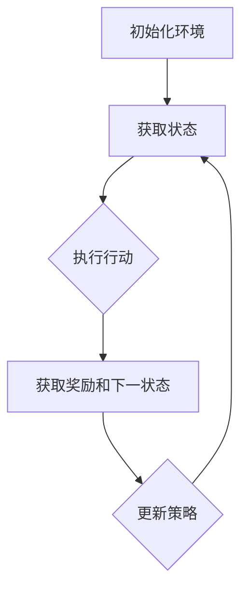

                 

 关键词：
- 强化学习
- 航空航天
- 自动化
- 机器人
- 智能控制

摘要：
本文深入探讨了强化学习（Reinforcement Learning，RL）在航空航天领域的应用及其面临的挑战。强化学习作为机器学习的一种重要方法，近年来在自动驾驶、游戏智能等领域取得了显著成果。本文旨在分析强化学习在航空航天领域，特别是在自动化飞行控制、无人机调度、卫星轨道控制等方面的潜在应用，并讨论其在实际操作中面临的挑战和解决方案。

## 1. 背景介绍

### 1.1 强化学习的起源与发展

强化学习起源于20世纪50年代，由Richard Sutton和Andrew Barto在其经典著作《强化学习：一种介绍》中进行了系统性阐述。强化学习的核心思想是通过试错学习来获取最优策略，其基本框架包括代理（Agent）、环境（Environment）、状态（State）、行动（Action）和奖励（Reward）。代理通过不断与环境交互，根据反馈的奖励信号调整自身的策略，以达到最大化累积奖励的目的。

强化学习的发展可以分为三个阶段：早期基于规则的强化学习、基于模型的学习和现在广泛应用的模型无关（Model-Free）学习。随着深度学习技术的进步，强化学习也在向模型无关的方向发展，特别是深度强化学习（Deep Reinforcement Learning，DRL）在复杂任务上的显著表现，使得强化学习在各个领域的应用得到了极大的推动。

### 1.2 航空航天领域的发展与挑战

航空航天领域自20世纪以来经历了飞速的发展，从早期的火箭技术、喷气发动机，到现代的航天飞机、卫星、无人机等，人类在探索宇宙的道路上不断迈进。然而，随着技术的不断进步，航空航天领域也面临着一系列新的挑战：

1. **安全性**：航空飞行和航天任务对安全性的要求极高，任何细微的失误都可能导致严重后果。
2. **可靠性**：航空器和航天器的运行环境复杂，可靠性是确保任务成功的关键。
3. **自动化**：随着人类对太空的探索不断深入，对自动化系统的依赖也在增加，如何提高自动化系统的智能化水平成为一个重要课题。
4. **效率**：提高航空器和航天器的运行效率，降低成本，是当前航空航天领域的重要目标。

## 2. 核心概念与联系

### 2.1 强化学习的基本概念

强化学习的基本概念包括：

- **代理（Agent）**：执行行动并接收环境的反馈。
- **环境（Environment）**：代理行动发生的场所，提供状态和奖励信号。
- **状态（State）**：描述代理在环境中的状态。
- **行动（Action）**：代理能够执行的操作。
- **奖励（Reward）**：代理行动后的即时反馈信号。

### 2.2 强化学习架构

强化学习的架构可以分为两个部分：状态评估和价值函数。状态评估是指评估当前状态下的价值，而价值函数则是预测在未来执行特定行动后获得的累积奖励。

下面是强化学习的 Mermaid 流程图（注意：节点中不要有括号、逗号等特殊字符）：



## 3. 核心算法原理 & 具体操作步骤

### 3.1 算法原理概述

强化学习算法通过试错来探索最优策略，其核心思想是基于状态-行动值函数（Q-value function）或策略值函数（Policy Value Function）。Q-learning和策略梯度（Policy Gradient）是两种常见的强化学习算法。

- **Q-learning**：通过更新状态-行动值函数来学习最优策略。其目标是最小化预测误差，即期望的累积奖励与实际累积奖励之间的差距。
- **策略梯度**：直接优化策略参数，使其最大化期望累积奖励。策略梯度算法包括REINFORCE、PPO（Proximal Policy Optimization）等。

### 3.2 算法步骤详解

1. **初始化**：初始化代理的参数、状态-行动值函数或策略参数。
2. **环境交互**：代理与环境进行交互，执行行动并获取状态和奖励。
3. **更新策略**：根据获取的奖励信号更新状态-行动值函数或策略参数。
4. **重复交互**：重复上述步骤，直到达到预定的训练次数或收敛条件。

### 3.3 算法优缺点

- **Q-learning**：优点是简单易懂，收敛速度快；缺点是需要大量样本，对环境噪声敏感。
- **策略梯度**：优点是直接优化策略，不需要状态-行动值函数；缺点是梯度消失问题严重，需要使用特殊的优化方法。

### 3.4 算法应用领域

强化学习在航空航天领域有广泛的应用，包括：

- **自动化飞行控制**：使用强化学习算法优化飞行器控制策略，提高飞行稳定性和安全性。
- **无人机调度**：通过强化学习算法优化无人机编队飞行和任务分配。
- **卫星轨道控制**：使用强化学习算法优化卫星轨道调整策略，提高轨道精度。

## 4. 数学模型和公式 & 详细讲解 & 举例说明

### 4.1 数学模型构建

强化学习中的数学模型主要包括状态-行动值函数（Q-value function）和策略值函数（Policy Value Function）。

- **状态-行动值函数**：\( Q(s, a) = \mathbb{E}_{r, s'}[r + \gamma \max_{a'} Q(s', a')] \)
  - \( Q(s, a) \)：状态-行动值函数。
  - \( r \)：即时奖励。
  - \( s' \)：下一状态。
  - \( \gamma \)：折扣因子。
  - \( \mathbb{E} \)：期望值。

- **策略值函数**：\( V(s) = \mathbb{E}_{\pi}[Q(s, \pi(s))] \)
  - \( V(s) \)：策略值函数。
  - \( \pi(s) \)：策略。

### 4.2 公式推导过程

状态-行动值函数的推导基于马尔可夫决策过程（MDP）的基本原理。假设给定一个状态 \( s \) 和行动 \( a \)，代理在下一步 \( t+1 \) 收到即时奖励 \( r \) 并转移到状态 \( s' \)。根据马尔可夫性质，未来状态的概率分布只依赖于当前状态和行动。

### 4.3 案例分析与讲解

假设一个无人驾驶飞机在执行飞行任务时，需要根据当前状态（位置、速度、高度等）选择最优行动（俯冲、上升、转弯等），以最大化累积奖励（到达目标、避免障碍等）。我们可以使用Q-learning算法来训练无人机的控制策略。

1. **初始化**：初始化Q-value函数和策略参数。
2. **环境交互**：无人机根据当前状态选择行动，并获取奖励和下一状态。
3. **更新Q-value函数**：使用如下公式更新Q-value函数：
   $$ Q(s, a) = Q(s, a) + \alpha [r + \gamma \max_{a'} Q(s', a') - Q(s, a)] $$
   - \( \alpha \)：学习率。
4. **重复交互**：重复上述步骤，直到无人机达到预定目标或收敛条件。

## 5. 项目实践：代码实例和详细解释说明

### 5.1 开发环境搭建

为了实现强化学习在无人机飞行控制中的应用，我们需要搭建一个开发环境。本文使用Python编程语言和PyTorch深度学习框架进行开发。以下是开发环境搭建的步骤：

1. 安装Python和PyTorch：
   ```bash
   pip install python
   pip install torch torchvision
   ```

2. 安装辅助库：
   ```bash
   pip install numpy matplotlib
   ```

### 5.2 源代码详细实现

以下是无人机飞行控制强化学习的源代码实现：

```python
import torch
import torch.nn as nn
import torch.optim as optim
import numpy as np
import matplotlib.pyplot as plt

# 初始化环境
env = MyEnvironment()

# 初始化代理
actor = ActorNetwork()
critic = CriticNetwork()

# 定义优化器
optimizer_actor = optim.Adam(actor.parameters(), lr=0.001)
optimizer_critic = optim.Adam(critic.parameters(), lr=0.001)

# 训练过程
for episode in range(num_episodes):
    state = env.reset()
    done = False
    total_reward = 0

    while not done:
        # 预测行动和值函数
        action = actor.predict(state)
        next_state, reward, done = env.step(action)

        # 更新奖励信号
        critic_loss = (reward + gamma * critic.predict(next_state) - actor.predict(state)).square()

        # 更新代理和评价网络
        optimizer_actor.zero_grad()
        optimizer_critic.zero_grad()
        critic_loss.backward()
        actor_loss.backward()
        optimizer_actor.step()
        optimizer_critic.step()

        # 更新状态
        state = next_state
        total_reward += reward

    print(f"Episode {episode}: Total Reward = {total_reward}")

# 运行结果展示
plt.plot([episode for episode in range(num_episodes)], [total_reward for total_reward in rewards])
plt.xlabel("Episode")
plt.ylabel("Total Reward")
plt.show()
```

### 5.3 代码解读与分析

以上代码实现了一个基本的强化学习无人机飞行控制框架。代码中主要涉及以下模块：

- **环境（MyEnvironment）**：定义无人机在飞行过程中的状态、行动和奖励。
- **代理（ActorNetwork）**：预测无人机行动的神经网络。
- **评价网络（CriticNetwork）**：评估无人机行动的价值。

训练过程中，代理和评价网络通过不断更新策略参数和值函数，优化无人机的飞行控制策略。训练结束后，可以绘制训练过程中的累积奖励曲线，以评估训练效果。

## 6. 实际应用场景

### 6.1 自动化飞行控制

自动化飞行控制是强化学习在航空航天领域的典型应用。通过强化学习算法，无人驾驶飞机可以在复杂环境下自主飞行，提高飞行稳定性和安全性。例如，无人机在执行搜救任务时，可以使用强化学习算法优化飞行路径，快速到达搜救区域。

### 6.2 无人机调度

无人机调度是强化学习在无人机编队飞行和任务分配中的重要应用。通过强化学习算法，可以优化无人机编队的飞行路径和任务分配，提高整体效率。例如，在灾难救援任务中，无人机编队可以使用强化学习算法快速建立通信网络，实现高效的信息传递。

### 6.3 卫星轨道控制

卫星轨道控制是强化学习在航天领域的重要应用。通过强化学习算法，可以优化卫星轨道调整策略，提高轨道精度和稳定性。例如，在卫星在轨服务过程中，可以使用强化学习算法调整卫星轨道，延长卫星寿命，提高任务成功率。

## 7. 未来应用展望

### 7.1 算法优化

随着深度学习技术的不断发展，强化学习算法在复杂任务上的表现将得到显著提升。未来研究将重点关注算法优化，包括改进学习效率、减少样本依赖、提高泛化能力等方面。

### 7.2 跨领域应用

强化学习在航空航天领域的应用将向更多领域拓展。例如，在机器人、智能交通、工业自动化等领域，强化学习有望发挥重要作用，推动智能化水平的提升。

### 7.3 安全性保障

强化学习在航空航天领域应用的关键是确保系统安全性。未来研究将重点关注算法安全性和鲁棒性，提高系统在复杂环境下的可靠性。

## 8. 总结：未来发展趋势与挑战

### 8.1 研究成果总结

本文总结了强化学习在航空航天领域的应用及其面临的挑战。强化学习在自动化飞行控制、无人机调度、卫星轨道控制等方面具有广泛的应用前景，但仍需解决算法优化、跨领域应用、安全性保障等问题。

### 8.2 未来发展趋势

未来，强化学习在航空航天领域的发展趋势将包括算法优化、跨领域应用和安全性的提升。随着深度学习技术的进步，强化学习在复杂任务上的表现将得到显著提升，有望在更多领域发挥重要作用。

### 8.3 面临的挑战

强化学习在航空航天领域面临的挑战主要包括算法优化、跨领域应用和安全性的保障。未来研究需要关注这些挑战，推动强化学习在航空航天领域的广泛应用。

### 8.4 研究展望

未来，强化学习在航空航天领域的研究将朝着算法优化、跨领域应用和安全性的方向发展。通过解决上述挑战，强化学习有望在航空航天领域发挥更大的作用，推动智能化水平的提升。

## 9. 附录：常见问题与解答

### 9.1 强化学习在航空航天领域的应用有哪些？

强化学习在航空航天领域的应用包括自动化飞行控制、无人机调度、卫星轨道控制等。这些应用可以提高飞行稳定性和安全性，优化任务分配和轨道调整策略。

### 9.2 强化学习算法在航空航天领域的优势是什么？

强化学习算法在航空航天领域的优势包括：

- **自适应能力**：可以适应复杂环境，提高飞行稳定性和安全性。
- **优化效率**：通过学习最优策略，提高任务执行效率和资源利用率。
- **可扩展性**：可以应用于不同类型的航空器和航天任务，具有广泛的应用前景。

### 9.3 强化学习在航空航天领域面临的挑战是什么？

强化学习在航空航天领域面临的挑战包括：

- **算法优化**：提高算法效率，减少样本依赖，提高泛化能力。
- **跨领域应用**：将强化学习算法应用于不同类型的航空器和航天任务。
- **安全性保障**：确保系统在复杂环境下的可靠性，提高安全性。

### 9.4 强化学习算法在航空航天领域的发展趋势是什么？

未来，强化学习在航空航天领域的发展趋势包括：

- **算法优化**：改进学习效率、减少样本依赖、提高泛化能力。
- **跨领域应用**：拓展应用领域，推动智能化水平的提升。
- **安全性保障**：提高算法安全性和鲁棒性，确保系统可靠性。

---

作者：禅与计算机程序设计艺术 / Zen and the Art of Computer Programming

