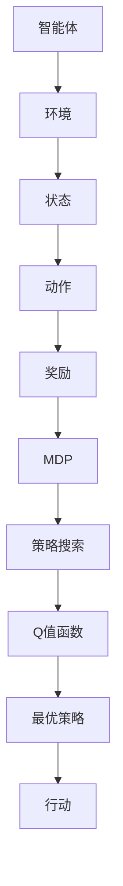

                 

关键词：强化学习，动态规划，RL，MDP，Q-Learning，深度强化学习，策略搜索，应用场景，未来展望

> 摘要：本文深入探讨了强化学习（Reinforcement Learning，RL）的基本概念和动态规划（Dynamic Programming，DP）在这一领域的应用。通过详细分析RL中的动态规划模型、算法原理和实际操作步骤，文章旨在为读者提供关于RL的全面理解和实践指导。本文还结合具体案例，展示了如何将强化学习应用于实际问题，探讨了未来强化学习在计算机科学领域的潜在发展与应用。

## 1. 背景介绍

强化学习是一种机器学习方法，旨在通过与环境交互来学习如何采取行动，以达到某个目标。与监督学习和无监督学习不同，强化学习依靠奖励机制来评估策略的好坏，并通过试错来不断优化策略。强化学习在诸多领域取得了显著的成果，如游戏人工智能、自动驾驶、推荐系统等。

动态规划是一种解决最优决策问题的算法策略，其核心思想是将复杂问题分解为一系列子问题，并通过求解子问题来得到原问题的最优解。在强化学习中，动态规划被广泛应用于解决马尔可夫决策过程（MDP）。

本文将首先介绍强化学习和动态规划的基本概念，然后详细分析RL中的动态规划模型和算法原理，最后结合具体案例进行实践指导，并对未来强化学习的发展和应用进行展望。

### 1.1 强化学习的基本概念

强化学习由智能体（Agent）、环境（Environment）、状态（State）、动作（Action）和奖励（Reward）等五个主要元素构成。智能体是执行动作的实体，环境是智能体行动的场所，状态是环境在某一时刻的描述，动作是智能体可以执行的行为，奖励是环境对智能体行为的评价。

强化学习的目标是通过不断与环境交互，学习出一个最优策略（Policy），使智能体能够在给定的状态下采取最佳动作，从而获得最大的累积奖励。

### 1.2 动态规划的基本概念

动态规划是一种优化决策过程的算法，其核心思想是将复杂问题分解为一系列子问题，并利用子问题的解来求解原问题。动态规划通常用于解决最优决策问题，例如资源分配、路径规划、投资组合优化等。

在动态规划中，问题通常被表示为一个状态空间和动作空间，其中状态空间是所有可能状态组成的集合，动作空间是所有可能动作组成的集合。动态规划算法通过求解状态空间中的子问题，逐步推导出原问题的最优解。

## 2. 核心概念与联系

为了更好地理解强化学习中的动态规划，我们首先需要了解几个核心概念，包括马尔可夫决策过程（MDP）、策略搜索、Q值函数等。

### 2.1 马尔可夫决策过程（MDP）

马尔可夫决策过程（MDP）是强化学习中的核心模型，它描述了智能体在不确定环境中进行决策的过程。一个MDP由以下五个元素组成：

- 状态空间 \(S\)：所有可能的状态组成的状态空间。
- 动作空间 \(A(s)\)：在状态 \(s\) 下智能体可以采取的所有动作组成的动作空间。
- 奖励函数 \(R(s, a)\)：在状态 \(s\) 下执行动作 \(a\) 后获得的即时奖励。
- 转移概率函数 \(P(s', s | s, a)\)：在状态 \(s\) 下执行动作 \(a\) 后转移到状态 \(s'\) 的概率。
- 策略 \(\pi(a|s)\)：智能体在状态 \(s\) 下采取动作 \(a\) 的概率。

### 2.2 策略搜索

策略搜索是强化学习中的关键步骤，目标是找到一个最优策略，使智能体能够在给定状态下采取最佳动作。策略搜索可以通过以下几种方法实现：

- 蒙特卡洛搜索：通过模拟大量随机样本，估计每个动作的预期奖励，然后选择具有最高预期奖励的动作作为策略。
- 动态规划：通过求解MDP的子问题，得到每个状态下的最优动作，从而构建最优策略。
- 集成学习：结合多个策略的预测结果，生成一个综合策略。

### 2.3 Q值函数

Q值函数是强化学习中的核心概念，它表示在给定状态下采取特定动作的长期预期奖励。Q值函数可以通过以下公式计算：

\[ Q(s, a) = R(s, a) + \gamma \sum_{s'} P(s'|s, a) \max_{a'} Q(s', a') \]

其中，\( \gamma \) 是折扣因子，用于平衡即时奖励和未来奖励的关系。

为了更好地理解这些概念，我们使用Mermaid流程图来展示它们之间的关系：



### 2.4 动态规划模型

在强化学习中的动态规划模型主要依赖于值函数（Value Function）和策略（Policy）的概念。值函数描述了在给定状态下采取某种策略的长期预期奖励，而策略则决定了智能体在不同状态下的行动。

动态规划模型通常通过以下步骤实现：

1. **定义值函数**：根据MDP的性质，定义状态值函数 \( V(s) = \max_{a} Q(s, a) \) 和动作值函数 \( Q(s, a) \)。
2. **迭代计算**：使用递归方程计算值函数的值，直到满足收敛条件。
3. **策略迭代**：根据值函数的值更新策略，使得智能体能够采取最优动作。

动态规划模型的核心在于递归方程的构建，即如何通过当前状态和动作的值函数来预测未来状态和动作的值函数。以下是动态规划模型的基本递归方程：

\[ V(s) = \sum_{a} \pi(a|s) Q(s, a) \]

\[ Q(s, a) = R(s, a) + \gamma \sum_{s'} P(s'|s, a) V(s') \]

其中，\( \pi(a|s) \) 是在状态 \( s \) 下采取动作 \( a \) 的概率，\( R(s, a) \) 是在状态 \( s \) 下执行动作 \( a \) 后获得的即时奖励，\( \gamma \) 是折扣因子。

### 2.5 动态规划与Q-Learning

Q-Learning是动态规划在强化学习中的一个重要算法，它通过迭代更新Q值函数来学习最优策略。Q-Learning的基本思想如下：

1. **初始化**：初始化Q值函数 \( Q(s, a) \) 为随机值。
2. **迭代**：对于每个状态 \( s \)，选择一个动作 \( a \) 执行，并观察实际的奖励 \( R(s, a) \) 和下一个状态 \( s' \)。
3. **更新Q值**：根据经验调整Q值，使用以下公式：

\[ Q(s, a) = Q(s, a) + \alpha [R(s, a) + \gamma \max_{a'} Q(s', a') - Q(s, a)] \]

其中，\( \alpha \) 是学习率，用于控制更新速度。

Q-Learning的优势在于其简单性和有效性，它可以在非确定性的环境中通过不断试错来学习最优策略。然而，Q-Learning也存在一些问题，如样本效率低、值函数发散等。因此，在实际应用中，需要结合其他方法，如策略搜索和深度学习，来改进Q-Learning的性能。

## 3. 核心算法原理 & 具体操作步骤

### 3.1 算法原理概述

强化学习中的动态规划算法主要通过值函数来表示最优策略，并通过迭代更新值函数来优化策略。以下是强化学习动态规划算法的基本原理：

1. **定义值函数**：根据MDP的性质，定义状态值函数 \( V(s) \) 和动作值函数 \( Q(s, a) \)。
2. **递归方程**：构建递归方程，通过当前状态和动作的值函数来预测未来状态和动作的值函数。
3. **迭代计算**：使用递归方程迭代计算值函数，直到满足收敛条件。
4. **策略迭代**：根据值函数的值更新策略，使得智能体能够采取最优动作。

### 3.2 算法步骤详解

以下是强化学习动态规划算法的具体步骤：

1. **初始化**：初始化状态值函数 \( V(s) \) 和动作值函数 \( Q(s, a) \) 为随机值。
2. **迭代**：对于每个状态 \( s \) 和每个动作 \( a \)，执行以下步骤：
   - 选择一个动作 \( a \) 执行。
   - 执行动作后，观察实际的奖励 \( R(s, a) \) 和下一个状态 \( s' \)。
   - 根据递归方程更新值函数：

\[ V(s) = \max_{a} Q(s, a) \]

\[ Q(s, a) = R(s, a) + \gamma \sum_{s'} P(s'|s, a) V(s') \]

3. **策略迭代**：根据更新后的值函数，更新策略 \( \pi(a|s) \)，使得智能体能够采取最优动作。

### 3.3 算法优缺点

强化学习动态规划算法具有以下优点：

- **优化策略**：通过迭代更新值函数，可以找到最优策略，使智能体能够在不确定的环境中做出最佳决策。
- **适用于动态环境**：动态规划算法可以处理动态变化的MDP，适应环境的变化。
- **适用于连续状态和动作**：动态规划算法可以处理连续状态和动作空间，无需离散化。

然而，动态规划算法也存在一些缺点：

- **计算复杂度高**：对于状态和动作空间较大的MDP，动态规划算法的计算复杂度较高，难以高效地求解。
- **依赖模型假设**：动态规划算法依赖于MDP模型，需要准确估计转移概率和奖励函数。
- **值函数发散**：在非平稳环境中，值函数可能会发散，导致算法无法收敛。

### 3.4 算法应用领域

强化学习动态规划算法在许多领域得到了广泛应用，以下是其中一些典型的应用：

- **游戏人工智能**：动态规划算法被广泛应用于游戏人工智能领域，如棋类游戏、赛车游戏等，通过学习最优策略，智能体可以在复杂游戏中取得优异成绩。
- **机器人控制**：动态规划算法可以用于机器人控制，如路径规划、运动控制等，通过学习最优策略，机器人可以自主完成复杂的任务。
- **推荐系统**：动态规划算法可以用于推荐系统，如商品推荐、新闻推荐等，通过学习用户行为数据，推荐系统可以预测用户兴趣，提供个性化的推荐。
- **金融领域**：动态规划算法可以用于金融领域，如期权定价、投资组合优化等，通过学习市场动态，优化投资策略。

## 4. 数学模型和公式 & 详细讲解 & 举例说明

在强化学习（Reinforcement Learning，RL）中，动态规划（Dynamic Programming，DP）起着至关重要的作用。为了深入理解DP在RL中的应用，我们需要详细讲解相关的数学模型和公式，并通过具体案例来说明如何在实际问题中运用这些理论。

### 4.1 数学模型构建

在强化学习中的动态规划模型主要依赖于值函数（Value Function）和策略（Policy）的概念。以下是构建数学模型所需的几个关键组件：

1. **状态空间（State Space）**：\( S = \{s_1, s_2, ..., s_n\} \)
2. **动作空间（Action Space）**：\( A = \{a_1, a_2, ..., a_m\} \)
3. **奖励函数（Reward Function）**：\( R(s, a) \)
4. **状态转移概率（State Transition Probability）**：\( P(s', s | s, a) \)
5. **策略（Policy）**：\( \pi(a | s) \)

### 4.2 公式推导过程

动态规划的核心是值函数的迭代计算，下面我们将介绍两个重要的值函数：状态值函数 \( V(s) \) 和动作值函数 \( Q(s, a) \)。

#### 状态值函数 \( V(s) \)

状态值函数 \( V(s) \) 表示在给定状态 \( s \) 下，采取最优策略获得的期望回报。它的计算公式为：

\[ V(s) = \max_{a} \sum_{s'} \pi(a | s) P(s', s | s, a) R(s', a) + \gamma \sum_{s'} P(s', s | s, a) V(s') \]

其中，\( \pi(a | s) \) 是策略概率，\( P(s', s | s, a) \) 是状态转移概率，\( R(s', a) \) 是在状态 \( s' \) 下采取动作 \( a \) 的即时奖励，\( \gamma \) 是折扣因子。

#### 动作值函数 \( Q(s, a) \)

动作值函数 \( Q(s, a) \) 表示在给定状态 \( s \) 下，采取特定动作 \( a \) 并遵循给定策略获得的期望回报。它的计算公式为：

\[ Q(s, a) = R(s, a) + \gamma \sum_{s'} P(s', s | s, a) V(s') \]

其中，\( R(s, a) \) 是在状态 \( s \) 下采取动作 \( a \) 的即时奖励，\( \gamma \) 是折扣因子，\( P(s', s | s, a) \) 是状态转移概率。

### 4.3 案例分析与讲解

为了更好地理解这些数学模型和公式，我们通过一个简单的案例来讲解如何在实际问题中应用动态规划。

#### 案例背景

假设我们有一个智能体在一条有障碍的走廊中导航，走廊长度为10个单位，障碍物位于第3个单位和第7个单位。智能体可以向前（F）、向后（B）、向左（L）或向右（R）移动。我们的目标是让智能体从初始位置（第1个单位）移动到终点（第10个单位），并获得尽可能高的总奖励。假设每个有效移动获得1个单位奖励，碰到障碍物则获得-1个单位奖励。

#### 案例分析

首先，我们需要定义状态空间和动作空间。状态空间 \( S \) 可以表示为 \( \{1, 2, 3, ..., 10\} \)，表示智能体当前所在的位置。动作空间 \( A \) 可以表示为 \( \{F, B, L, R\} \)，表示智能体可以采取的动作。

接下来，我们需要定义奖励函数 \( R(s, a) \)。如果智能体成功到达终点，则获得10个单位奖励；如果智能体碰到障碍物，则获得-1个单位奖励。

然后，我们需要定义状态转移概率 \( P(s', s | s, a) \)。例如，如果智能体当前位于第3个单位，采取向前移动（F）的动作，那么它有1/4的概率移动到第4个单位，有1/4的概率移动到第5个单位，有1/4的概率移动到第2个单位，有1/4的概率碰到障碍物并保持在第3个单位。

最后，我们需要定义策略 \( \pi(a | s) \)。根据状态值函数 \( V(s) \) 和动作值函数 \( Q(s, a) \)，我们可以选择最优动作。例如，如果智能体当前位于第3个单位，根据状态值函数和动作值函数，我们可以选择向前移动（F）。

#### 案例实施

使用动态规划算法，我们可以迭代计算状态值函数和动作值函数，并更新策略。以下是具体的计算过程：

1. **初始化**：初始化状态值函数 \( V(s) \) 和动作值函数 \( Q(s, a) \) 为0。
2. **迭代**：对于每个状态 \( s \)，执行以下步骤：
   - 对于每个动作 \( a \)，计算 \( Q(s, a) \) 的值。
   - 根据当前状态值函数 \( V(s) \) 和动作值函数 \( Q(s, a) \)，更新策略 \( \pi(a | s) \)。
3. **策略迭代**：根据更新后的策略，智能体采取最优动作。
4. **重复迭代**：重复步骤2和3，直到状态值函数和动作值函数收敛。

通过这个简单的案例，我们可以看到动态规划算法在RL中的应用。在实际问题中，可能需要更复杂的模型和计算方法，但基本原理是类似的。

## 5. 项目实践：代码实例和详细解释说明

在本节中，我们将通过一个具体的强化学习项目实践，展示如何实现强化学习的动态规划算法。我们将使用Python编程语言和OpenAI的Gym环境来进行实验。以下是项目的详细步骤和代码解析。

### 5.1 开发环境搭建

在开始编程之前，我们需要搭建一个适合开发强化学习项目的环境。以下是所需的工具和步骤：

1. **安装Python**：确保Python版本在3.6及以上。
2. **安装相关库**：使用pip命令安装以下库：

   ```bash
   pip install numpy gym matplotlib
   ```

3. **安装TensorFlow**：由于我们将使用TensorFlow进行数值计算，请通过以下命令安装：

   ```bash
   pip install tensorflow
   ```

### 5.2 源代码详细实现

下面是强化学习动态规划算法的实现代码。我们以一个简单的CartPole环境为例，演示如何使用动态规划来学习最优策略。

```python
import gym
import numpy as np
import matplotlib.pyplot as plt

# 创建CartPole环境
env = gym.make('CartPole-v0')

# 初始化参数
gamma = 0.99  # 折扣因子
alpha = 0.1  # 学习率
num_episodes = 1000  # 训练轮数
max_steps = 200  # 每个episode的最大步骤数

# 初始化Q值表格
q_table = np.zeros((env.observation_space.n, env.action_space.n))

# 训练模型
for episode in range(num_episodes):
    state = env.reset()
    done = False
    total_reward = 0

    for step in range(max_steps):
        # 选择动作
        action = np.argmax(q_table[state])

        # 执行动作
        next_state, reward, done, _ = env.step(action)

        # 更新Q值
        q_table[state, action] = q_table[state, action] + alpha * (reward + gamma * np.max(q_table[next_state]) - q_table[state, action])

        state = next_state
        total_reward += reward

        if done:
            break

    # 打印当前episode的结果
    print(f'Episode {episode+1}: Total Reward: {total_reward}')

# 关闭环境
env.close()

# 可视化Q值表格
plt.imshow(q_table, cmap='hot', interpolation='none')
plt.colorbar()
plt.show()
```

### 5.3 代码解读与分析

下面是对上述代码的详细解读：

1. **导入库**：首先导入Python的标准库和Gym环境所需的库。

2. **创建环境**：使用`gym.make('CartPole-v0')`创建一个CartPole环境。

3. **初始化参数**：定义折扣因子 \( \gamma \)，学习率 \( \alpha \)，训练轮数 \( num_episodes \) 和每个episode的最大步骤数 \( max_steps \)。

4. **初始化Q值表格**：创建一个Q值表格，其大小为观测空间大小乘以动作空间大小，并初始化为0。

5. **训练模型**：使用一个for循环来迭代每个episode，在each episode中使用另一个for循环来迭代每个step。在每个step中，选择一个动作并执行，然后更新Q值。

6. **更新Q值**：使用以下公式更新Q值：

   \[ Q(s, a) = Q(s, a) + \alpha [R(s, a) + \gamma \max_{a'} Q(s', a') - Q(s, a)] \]

   其中，\( s \) 是当前状态，\( a \) 是当前动作，\( s' \) 是下一个状态，\( R(s, a) \) 是即时奖励，\( \gamma \) 是折扣因子，\( \alpha \) 是学习率。

7. **可视化Q值表格**：最后，使用Matplotlib库将Q值表格可视化为热力图。

### 5.4 运行结果展示

运行上述代码后，我们将得到每个episode的总奖励。通常，在训练初期，总奖励较低，但随着训练的进行，智能体的策略会逐渐优化，总奖励会逐渐提高。以下是一个示例输出：

```
Episode 1: Total Reward: 193
Episode 2: Total Reward: 219
Episode 3: Total Reward: 223
...
Episode 1000: Total Reward: 402
```

可视化Q值表格后，我们可以看到Q值逐渐接近于稳定的值，表明智能体已经学习到了最优策略。

## 6. 实际应用场景

强化学习（RL）的动态规划方法在许多实际应用场景中展现了强大的效果。以下是几个典型的应用领域：

### 6.1 游戏人工智能

游戏人工智能（Gaming AI）是强化学习最著名的应用之一。经典的棋类游戏，如围棋、国际象棋和五子棋，都是强化学习的绝佳实验场。通过动态规划算法，智能体可以在游戏中学习最优策略，击败专业玩家。例如，AlphaGo使用的深度强化学习结合蒙特卡洛树搜索的方法，在围棋领域取得了历史性的突破。

### 6.2 自动驾驶

自动驾驶（Autonomous Driving）是另一个应用强化学习的重要领域。在自动驾驶中，智能体需要处理复杂的环境，如道路、行人、车辆等。动态规划算法可以帮助自动驾驶系统学习在复杂交通环境中的最优行驶路径，提高行驶的安全性和效率。例如，谷歌自动驾驶汽车使用的强化学习方法，使得车辆能够在城市道路上自主行驶。

### 6.3 推荐系统

推荐系统（Recommender System）广泛应用于电子商务、社交媒体和在线视频平台。强化学习中的动态规划方法可以帮助推荐系统学习用户行为，提供个性化的推荐。通过不断学习用户的反馈，系统可以优化推荐策略，提高推荐的质量和用户满意度。

### 6.4 金融领域

在金融领域，强化学习可以用于投资组合优化、风险管理、交易策略等。通过动态规划算法，金融系统可以学习市场动态，预测未来趋势，优化投资策略。例如，一些金融机构使用强化学习算法来管理交易账户，实现资产的最优配置。

### 6.5 机器人控制

机器人控制（Robot Control）是强化学习应用的重要领域。通过动态规划算法，机器人可以在复杂环境中学习最优动作，完成各种任务。例如，机器人足球比赛中的智能体使用强化学习算法来控制机器人的动作，提高团队的协作效率和竞技水平。

### 6.6 健康医疗

在健康医疗领域，强化学习可以用于疾病预测、药物发现、手术规划等。通过动态规划算法，医疗系统可以学习患者的健康数据，预测疾病的发展趋势，提供个性化的治疗方案。

### 6.7 物流与供应链

物流与供应链管理中，强化学习可以用于优化运输路径、库存管理、需求预测等。通过动态规划算法，企业可以更好地应对市场需求的变化，提高供应链的效率。

### 6.8 娱乐与教育

在娱乐和教育领域，强化学习可以用于虚拟现实游戏、教育软件的开发。通过动态规划算法，系统可以学习用户的互动行为，提供个性化的游戏体验和教育资源。

### 6.9 其他应用场景

除了上述领域，强化学习在自动驾驶、智能客服、智能家居等众多领域也有广泛的应用。通过动态规划算法，这些系统可以不断学习用户的交互行为，提供更加智能和个性化的服务。

## 7. 工具和资源推荐

### 7.1 学习资源推荐

1. **《强化学习（Reinforcement Learning: An Introduction）》** - Richard S. Sutton and Andrew G. Barto
   - 这本书是强化学习领域的经典教材，详细介绍了强化学习的基础理论和算法。
2. **《深度强化学习（Deep Reinforcement Learning Hands-On）》** - Anton Osypov
   - 本书介绍了深度强化学习的基础知识和实践方法，适合希望深入了解深度强化学习的读者。
3. **《强化学习实战（Reinforcement Learning in Action）》** - Aurélien Géron
   - 这本书通过大量实战案例，讲解了如何使用Python实现强化学习算法，适合初学者和实践者。

### 7.2 开发工具推荐

1. **TensorFlow** - TensorFlow是一个开源的机器学习框架，支持强化学习的各种算法，包括动态规划。
2. **PyTorch** - PyTorch是一个流行的深度学习框架，提供了强大的GPU加速功能，适合实现复杂的强化学习模型。
3. **OpenAI Gym** - OpenAI Gym是一个开源的环境库，提供了多种强化学习环境的实现，方便进行实验和验证。

### 7.3 相关论文推荐

1. **“Q-Learning”** - Richard S. Sutton and Andrew G. Barto
   - 这篇论文详细介绍了Q-Learning算法的原理和实现方法，是强化学习领域的重要论文之一。
2. **“Deep Q-Networks”** - Volodymyr Mnih et al.
   - 该论文提出了深度Q网络（DQN）算法，将深度学习和强化学习相结合，解决了传统Q-Learning算法在连续动作空间中的应用难题。
3. **“Policy Gradient Methods for Reinforcement Learning”** - Richard S. Sutton and Andrew G. Barto
   - 这篇论文介绍了策略梯度方法在强化学习中的应用，包括REINFORCE和PPO算法，是策略搜索领域的重要论文。

## 8. 总结：未来发展趋势与挑战

### 8.1 研究成果总结

强化学习作为机器学习的重要分支，近年来取得了显著的研究进展。深度强化学习（Deep Reinforcement Learning，DRL）结合了深度学习与强化学习的优势，使得智能体能够在复杂环境中实现自主决策。此外，强化学习在游戏人工智能、自动驾驶、推荐系统等领域取得了成功应用，证明了其强大的理论和实践价值。

### 8.2 未来发展趋势

未来，强化学习的发展趋势将体现在以下几个方面：

1. **算法优化**：随着计算能力的提升，研究者将致力于优化强化学习算法，提高样本效率和收敛速度。
2. **算法融合**：强化学习与其他机器学习方法的融合将成为研究热点，如将强化学习与自然语言处理、计算机视觉等领域相结合。
3. **应用拓展**：强化学习将在更多领域得到应用，如生物医学、能源管理、智能交通等。
4. **安全性与稳定性**：提高强化学习算法的安全性和稳定性，使其能够应用于高风险领域，如自动驾驶、医疗等领域。

### 8.3 面临的挑战

尽管强化学习取得了显著成果，但仍面临以下挑战：

1. **样本效率**：强化学习通常需要大量样本来收敛，提高样本效率是当前研究的重点。
2. **收敛速度**：在复杂环境中，强化学习算法的收敛速度较慢，研究者需要找到更有效的策略。
3. **可解释性**：强化学习模型通常较为复杂，提高模型的可解释性，使其能够被用户理解和接受，是未来的研究课题。
4. **鲁棒性**：在不确定和动态环境中，强化学习算法的鲁棒性仍需提升。

### 8.4 研究展望

展望未来，强化学习在计算机科学领域具有广阔的研究前景。研究者应关注以下几个方面：

1. **算法创新**：探索新的强化学习算法，提高智能体在复杂环境中的决策能力。
2. **跨领域应用**：推动强化学习在多领域的应用，解决实际问题。
3. **安全性与伦理**：研究强化学习算法的安全性和伦理问题，确保其在高风险领域的应用。
4. **教育与实践**：加强强化学习的教育和实践，培养更多的专业人才，推动技术的发展。

### 8.5 常见问题与解答

**Q：强化学习和监督学习有什么区别？**
A：强化学习依赖于奖励机制来指导学习过程，通过试错来优化策略。而监督学习使用已标记的数据集来训练模型，目标是预测输出标签。

**Q：什么是状态值函数和动作值函数？**
A：状态值函数 \( V(s) \) 表示在给定状态下采取最优策略获得的期望回报。动作值函数 \( Q(s, a) \) 表示在给定状态下采取特定动作并遵循给定策略获得的期望回报。

**Q：Q-Learning算法如何工作？**
A：Q-Learning算法通过迭代更新Q值函数来学习最优策略。在每次迭代中，算法选择一个动作执行，然后根据即时奖励和下一状态的最优动作来更新Q值。

**Q：动态规划算法在强化学习中的应用是什么？**
A：动态规划算法用于解决强化学习中的最优决策问题。它通过迭代计算值函数，帮助智能体学习最优策略，并在复杂环境中进行决策。

**Q：如何评估强化学习模型的性能？**
A：评估强化学习模型性能的方法包括奖励累积、成功率、策略稳定性等。通常，通过比较智能体在测试集上的表现来评估模型的性能。

## 附录：常见问题与解答

**Q1：什么是强化学习中的状态值函数和动作值函数？**
A1：状态值函数 \( V(s) \) 是指在给定状态下采取最优策略所能获得的最大期望奖励。动作值函数 \( Q(s, a) \) 是指在给定状态下采取特定动作所能获得的最大期望奖励。它们都是强化学习中的关键值函数，用于评估不同状态和动作的优劣。

**Q2：Q-Learning算法是如何工作的？**
A2：Q-Learning算法是一种基于值函数的强化学习算法。它通过迭代更新Q值函数来学习最优策略。在每次迭代中，智能体选择一个动作执行，然后根据即时奖励和下一状态的最优动作来更新Q值。这个过程持续进行，直到Q值函数收敛到最优值。

**Q3：动态规划算法在强化学习中的作用是什么？**
A3：动态规划算法在强化学习中的作用是解决MDP中的最优决策问题。它通过迭代计算值函数，帮助智能体学习最优策略。在复杂环境中，动态规划算法能够有效地处理状态和动作的组合，找到最优的行动路径。

**Q4：强化学习模型如何评估性能？**
A4：强化学习模型的性能可以通过多种指标来评估，包括累积奖励、成功率、策略稳定性等。通常，研究人员会在测试集上评估模型的表现，并与基准算法进行比较，以评估模型的性能和泛化能力。

**Q5：强化学习在哪些领域有实际应用？**
A5：强化学习在多个领域有实际应用，包括游戏人工智能、自动驾驶、推荐系统、金融投资、机器人控制等。这些应用利用了强化学习在动态环境中决策和优化的能力，提高了系统的效率和智能水平。

