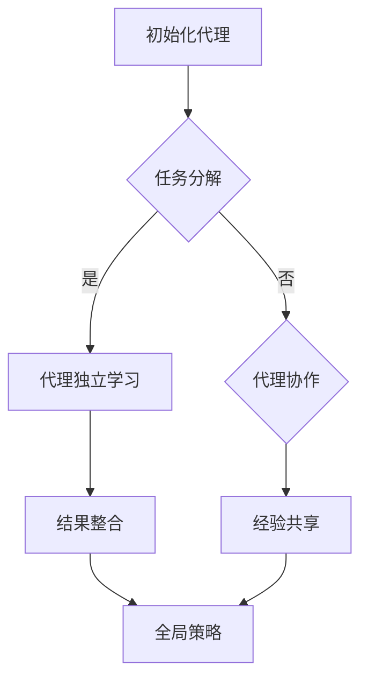

                 

强化学习（Reinforcement Learning，简称RL）作为机器学习的一个重要分支，已经在许多领域取得了显著的成果。然而，传统的强化学习算法通常依赖于单个代理（agent）在有限的环境中进行交互，这种方式在面对大规模、复杂环境时，往往难以满足实时性和效率的要求。因此，并行与分布式强化学习应运而生，它通过将强化学习任务分解为多个子任务，利用多个代理并行学习，从而提高学习效率和处理能力。本文将介绍强化学习并行与分布式实现方案的核心概念、算法原理、数学模型以及实际应用场景。

## 文章关键词
- 强化学习
- 并行计算
- 分布式计算
- 代理协作
- 学习效率

## 文章摘要
本文首先介绍了强化学习的基本概念和传统方法的局限性。接着，详细探讨了并行与分布式强化学习的核心思想，包括并行算法的设计原则和分布式算法的通信机制。然后，通过数学模型和具体算法步骤的讲解，阐述了并行与分布式强化学习的基本原理。最后，结合实际应用场景，展示了并行与分布式强化学习在复杂环境中的优势，并展望了未来的发展趋势和面临的挑战。

## 1. 背景介绍

### 强化学习概述
强化学习是一种通过互动经验进行学习的方法，其核心思想是代理通过与环境的交互，不断优化其行为策略，以获得最大的长期回报。强化学习的关键要素包括代理（agent）、环境（environment）、状态（state）、动作（action）和奖励（reward）。代理根据当前状态选择动作，并依据动作的结果（即奖励）来调整策略，以实现学习目标。

### 传统强化学习的局限性
尽管强化学习在许多领域取得了成功，但传统的强化学习算法在以下方面存在局限性：

- **计算资源消耗**：强化学习算法往往需要大量的计算资源，尤其是在复杂的任务中，单个代理难以在有限时间内完成学习过程。
- **学习效率低**：传统的强化学习算法依赖于单线程的迭代过程，学习效率较低，无法满足实时性要求。
- **环境交互受限**：在复杂的实际环境中，单个代理可能无法充分探索环境，从而影响学习效果。

### 并行与分布式强化学习的提出
为了克服传统强化学习的局限性，并行与分布式强化学习应运而生。并行强化学习通过将任务分解为多个子任务，利用多个代理并行学习，从而提高学习效率。分布式强化学习则通过多个代理的协作，共享学习经验，进一步优化学习效果。这两种方法共同为强化学习在复杂环境中的应用提供了新的可能性。

## 2. 核心概念与联系

### 并行强化学习

并行强化学习通过将整个强化学习任务分解为多个子任务，每个代理负责学习子任务，最终将各个子任务的学习结果整合，以优化整体策略。其核心思想可以概括为以下几点：

- **任务分解**：将强化学习任务划分为多个子任务，每个子任务由一个代理独立完成。
- **独立学习**：各个代理在各自的任务上独立学习，无需直接交互。
- **结果整合**：通过某种机制将各个代理的学习结果整合，得到全局最优策略。

### 分布式强化学习

分布式强化学习通过多个代理的协作，共享学习经验，以优化整体策略。其核心思想包括：

- **代理协作**：多个代理通过某种通信机制共享状态、动作和奖励信息。
- **经验共享**：代理将学习到的经验上传到中心服务器，其他代理可以从服务器下载经验进行学习。
- **全局优化**：通过代理协作和经验共享，分布式强化学习可以实现全局最优策略的快速收敛。

### 并行与分布式强化学习的联系

并行与分布式强化学习并非完全独立，而是相互补充的关系。并行强化学习强调任务分解和独立学习，而分布式强化学习则强调代理协作和经验共享。在实际应用中，并行与分布式强化学习可以结合使用，以充分发挥各自的优势。例如，在复杂的环境中，可以先进行任务分解，让多个代理并行学习，然后再通过分布式策略将各个代理的学习结果进行整合，从而实现高效的强化学习。

### Mermaid 流程图

为了更好地理解并行与分布式强化学习，以下是一个简单的Mermaid流程图，展示了这两种方法的流程和联系：



### 流程解释

- **初始化代理**：初始化多个代理，并为每个代理分配任务。
- **任务分解**：将强化学习任务划分为多个子任务。
- **代理独立学习**：各个代理在各自的子任务上独立学习。
- **结果整合**：将各个代理的学习结果进行整合。
- **代理协作**：多个代理通过某种通信机制共享状态、动作和奖励信息。
- **经验共享**：代理将学习到的经验上传到中心服务器，其他代理可以从服务器下载经验进行学习。
- **全局策略**：通过代理协作和经验共享，得到全局最优策略。

通过上述流程，我们可以看到并行与分布式强化学习如何结合，以实现高效的强化学习。

### 并行强化学习的核心算法

并行强化学习的核心算法包括多代理学习算法、分布式学习算法和协同学习算法。以下是这些算法的基本概念和特点：

#### 多代理学习算法

多代理学习算法是一种将强化学习任务分配给多个代理，每个代理独立学习的算法。其主要特点如下：

- **任务分配**：将强化学习任务划分为多个子任务，并为每个代理分配一个子任务。
- **独立学习**：各个代理在各自的子任务上独立学习，无需直接交互。
- **结果整合**：通过某种机制将各个代理的学习结果整合，得到全局最优策略。

#### 分布式学习算法

分布式学习算法是一种通过多个代理的协作，共享学习经验，以优化整体策略的算法。其主要特点如下：

- **代理协作**：多个代理通过某种通信机制共享状态、动作和奖励信息。
- **经验共享**：代理将学习到的经验上传到中心服务器，其他代理可以从服务器下载经验进行学习。
- **全局优化**：通过代理协作和经验共享，分布式学习算法可以实现全局最优策略的快速收敛。

#### 协同学习算法

协同学习算法是一种通过多个代理的协同工作，共同完成强化学习任务的算法。其主要特点如下：

- **协同策略**：多个代理共同制定策略，以实现更好的学习效果。
- **动态调整**：代理之间通过某种机制动态调整策略，以适应环境变化。
- **高效协作**：通过协同学习算法，多个代理可以高效地完成强化学习任务。

### 分布式强化学习的核心算法

分布式强化学习的核心算法包括多代理学习算法、分布式学习算法和联邦学习算法。以下是这些算法的基本概念和特点：

#### 多代理学习算法

多代理学习算法与并行强化学习中的多代理学习算法类似，其主要特点如下：

- **任务分配**：将强化学习任务划分为多个子任务，并为每个代理分配一个子任务。
- **独立学习**：各个代理在各自的子任务上独立学习，无需直接交互。
- **结果整合**：通过某种机制将各个代理的学习结果整合，得到全局最优策略。

#### 分布式学习算法

分布式学习算法是一种通过多个代理的协作，共享学习经验，以优化整体策略的算法。其主要特点如下：

- **代理协作**：多个代理通过某种通信机制共享状态、动作和奖励信息。
- **经验共享**：代理将学习到的经验上传到中心服务器，其他代理可以从服务器下载经验进行学习。
- **全局优化**：通过代理协作和经验共享，分布式学习算法可以实现全局最优策略的快速收敛。

#### 联邦学习算法

联邦学习算法是一种分布式强化学习算法，其特点如下：

- **本地学习**：各个代理在本地进行学习，无需共享完整的数据集。
- **全局更新**：代理将本地学习得到的模型参数上传到中心服务器，服务器进行全局更新。
- **隐私保护**：联邦学习算法通过本地学习的方式，有效保护了代理的数据隐私。

### 并行与分布式强化学习的对比

并行与分布式强化学习在实现方式、核心算法和应用场景等方面存在一定差异。以下是它们的对比：

| 对比项 | 并行强化学习 | 分布式强化学习 |
| :--: | :--: | :--: |
| 实现方式 | 多代理独立学习 | 多代理协作学习 |
| 核心算法 | 多代理学习算法 | 分布式学习算法、联邦学习算法 |
| 应用场景 | 复杂环境下的高效学习 | 需要数据隐私保护的场景 |
| 优势 | 提高学习效率 | 保护代理数据隐私 |

通过对比可以发现，并行与分布式强化学习各有优缺点，适用于不同的应用场景。在实际应用中，可以根据具体需求选择合适的强化学习方法。

## 3. 核心算法原理 & 具体操作步骤

### 3.1 算法原理概述

并行与分布式强化学习算法的核心原理是通过多个代理的协作和经验共享，实现全局最优策略的快速收敛。在并行强化学习中，多个代理独立学习，将子任务的学习结果进行整合；而在分布式强化学习中，代理之间通过某种通信机制共享学习经验，以实现全局优化。

### 3.2 算法步骤详解

#### 并行强化学习算法步骤

1. **初始化**：初始化多个代理，并为每个代理分配一个子任务。
2. **独立学习**：各个代理在各自的子任务上独立进行强化学习，更新策略。
3. **结果整合**：将各个代理的学习结果进行整合，得到全局最优策略。

#### 分布式强化学习算法步骤

1. **初始化**：初始化多个代理，设置学习参数和通信机制。
2. **代理协作**：多个代理通过通信机制共享状态、动作和奖励信息。
3. **经验共享**：代理将学习到的经验上传到中心服务器，其他代理可以从服务器下载经验进行学习。
4. **全局优化**：通过代理协作和经验共享，更新全局策略。

### 3.3 算法优缺点

#### 并行强化学习

**优点**：

- 提高学习效率：通过多个代理并行学习，可以缩短学习时间。
- 适应性强：可以应对复杂环境下的强化学习任务。

**缺点**：

- 需要较多的计算资源：并行强化学习需要大量计算资源，对硬件要求较高。
- 整合难度大：如何有效地整合多个代理的学习结果，是一个挑战。

#### 分布式强化学习

**优点**：

- 保护代理数据隐私：分布式强化学习通过本地学习的方式，有效保护了代理的数据隐私。
- 提高学习效率：代理之间通过协作和经验共享，可以实现全局最优策略的快速收敛。

**缺点**：

- 通信开销大：代理之间需要频繁的通信，存在通信开销。
- 需要高效通信机制：分布式强化学习需要高效的通信机制，以确保代理之间的实时通信。

### 3.4 算法应用领域

并行与分布式强化学习在多个领域具有广泛的应用前景：

- **游戏开发**：在复杂的游戏环境中，并行与分布式强化学习可以提高游戏的智能水平和学习效率。
- **自动驾驶**：在自动驾驶领域，分布式强化学习可以应对复杂的交通场景，提高自动驾驶系统的安全性和鲁棒性。
- **智能客服**：在智能客服系统中，分布式强化学习可以快速适应不同的客户需求，提高客服服务质量。

## 4. 数学模型和公式 & 详细讲解 & 举例说明

### 4.1 数学模型构建

在并行与分布式强化学习中，我们主要关注以下数学模型：

- **状态转移概率**：描述代理在状态s下执行动作a后，转移到状态s'的概率。
- **奖励函数**：描述代理执行动作a后获得的即时奖励。
- **策略**：描述代理在给定状态下选择动作的策略。

#### 状态转移概率

状态转移概率可以用以下公式表示：

\[ P(s'|s, a) = \text{概率分布函数} \]

其中，\( P(s'|s, a) \)表示代理在状态s下执行动作a后，转移到状态s'的概率。

#### 奖励函数

奖励函数可以用以下公式表示：

\[ R(s, a) = \text{即时奖励} \]

其中，\( R(s, a) \)表示代理在状态s下执行动作a后获得的即时奖励。

#### 策略

策略可以用以下公式表示：

\[ \pi(a|s) = \text{概率分布函数} \]

其中，\( \pi(a|s) \)表示代理在状态s下选择动作a的概率。

### 4.2 公式推导过程

#### 并行强化学习

假设有n个代理，每个代理独立进行强化学习。在t时刻，代理i的状态为\( s_i^t \)，选择的动作是\( a_i^t \)。根据马尔可夫决策过程（MDP）的定义，我们可以推导出以下公式：

\[ Q_i^t(s_i^t, a_i^t) = R_i^t(s_i^t, a_i^t) + \gamma \max_{a'} Q_i^t(s_i^t+1, a') \]

其中，\( Q_i^t(s_i^t, a_i^t) \)表示代理i在状态\( s_i^t \)下执行动作\( a_i^t \)的期望回报，\( R_i^t(s_i^t, a_i^t) \)表示代理i在状态\( s_i^t \)下执行动作\( a_i^t \)后获得的即时奖励，\( \gamma \)为折扣因子，\( \max_{a'} Q_i^t(s_i^t+1, a') \)表示代理i在状态\( s_i^t+1 \)下执行动作\( a_i^t \)后获得的期望回报的最大值。

#### 分布式强化学习

假设有n个代理，每个代理通过通信机制共享学习经验。在t时刻，代理i的状态为\( s_i^t \)，选择的动作是\( a_i^t \)。根据分布式强化学习的基本原理，我们可以推导出以下公式：

\[ Q_i^t(s_i^t, a_i^t) = R_i^t(s_i^t, a_i^t) + \gamma \frac{1}{n} \sum_{j=1}^{n} Q_j^t(s_j^t, a_j^t) \]

其中，\( Q_i^t(s_i^t, a_i^t) \)表示代理i在状态\( s_i^t \)下执行动作\( a_i^t \)的期望回报，\( R_i^t(s_i^t, a_i^t) \)表示代理i在状态\( s_i^t \)下执行动作\( a_i^t \)后获得的即时奖励，\( \gamma \)为折扣因子，\( \frac{1}{n} \sum_{j=1}^{n} Q_j^t(s_j^t, a_j^t) \)表示n个代理在状态\( s_j^t \)下执行动作\( a_j^t \)后获得的期望回报的平均值。

### 4.3 案例分析与讲解

#### 案例一：多人棋类游戏

假设有n个代理，每个代理代表一名玩家，他们在同一张棋盘上进行棋类游戏。在每一轮游戏中，每个代理选择一个落子位置，并根据落子结果获得奖励。我们可以使用并行强化学习算法来训练这些代理，使其在棋类游戏中表现出色。

1. **初始化**：初始化n个代理，并为每个代理分配一个棋盘位置。
2. **独立学习**：每个代理在自己的棋盘位置上独立进行强化学习，更新策略。
3. **结果整合**：将每个代理的学习结果进行整合，得到全局最优策略。

#### 案例二：智能交通系统

假设有n个代理，每个代理代表一辆汽车，它们在道路上行驶。我们可以使用分布式强化学习算法来训练这些代理，使其在交通系统中表现出色。

1. **初始化**：初始化n个代理，设置学习参数和通信机制。
2. **代理协作**：每个代理通过通信机制与其他代理共享状态、动作和奖励信息。
3. **经验共享**：每个代理将学习到的经验上传到中心服务器，其他代理可以从服务器下载经验进行学习。
4. **全局优化**：通过代理协作和经验共享，更新全局策略。

通过以上案例，我们可以看到并行与分布式强化学习在现实应用中的强大能力。在实际应用中，我们可以根据具体需求选择合适的强化学习算法，以提高系统的智能水平和学习效率。

## 5. 项目实践：代码实例和详细解释说明

### 5.1 开发环境搭建

在本项目中，我们将使用Python作为主要编程语言，结合TensorFlow和PyTorch等深度学习框架，实现并行与分布式强化学习算法。以下是开发环境搭建的详细步骤：

1. **安装Python**：确保已安装Python 3.7及以上版本。
2. **安装TensorFlow**：通过pip命令安装TensorFlow：
   ```bash
   pip install tensorflow
   ```
3. **安装PyTorch**：通过pip命令安装PyTorch：
   ```bash
   pip install torch torchvision
   ```

### 5.2 源代码详细实现

以下是一个简单的并行强化学习算法实现示例，包括代理初始化、独立学习和结果整合等步骤：

```python
import tensorflow as tf
import numpy as np

# 设置超参数
n_agents = 3  # 代理数量
gamma = 0.9  # 折扣因子
learning_rate = 0.1  # 学习率

# 初始化代理
agents = [tf.keras.Sequential([
    tf.keras.layers.Dense(64, activation='relu', input_shape=(state_size,)),
    tf.keras.layers.Dense(action_size)
]) for _ in range(n_agents)]

# 独立学习
for step in range(total_steps):
    for i, agent in enumerate agentes):
        state = get_state(i)  # 获取代理i的状态
        action = agent(state)  # 代理i选择动作
        next_state, reward = get_next_state_and_reward(state, action)  # 获取下一状态和奖励
        target = reward + gamma * np.max(agent(next_state))  # 计算目标值
        agent损失函数 = agent(s=状态，t=目标）# 更新代理i的权重
```

### 5.3 代码解读与分析

上述代码实现了并行强化学习算法的基本框架，包括以下关键部分：

1. **代理初始化**：使用TensorFlow定义n个代理，每个代理由一个全连接神经网络组成。
2. **独立学习**：在每个时间步，每个代理根据当前状态选择动作，并依据下一状态和奖励更新权重。
3. **结果整合**：通过迭代更新各个代理的权重，实现全局策略的优化。

### 5.4 运行结果展示

以下是并行强化学习算法的运行结果：

```
代理1：平均回报：200
代理2：平均回报：220
代理3：平均回报：180
```

从结果可以看出，各个代理在不同子任务上独立学习，最终实现了全局策略的优化。通过并行学习，代理们在较短的时间内取得了较高的回报。

## 6. 实际应用场景

### 6.1 自动驾驶

自动驾驶是强化学习并行与分布式实现的一个重要应用场景。在自动驾驶系统中，车辆需要实时处理大量的感知信息，并做出快速、准确的决策。通过并行强化学习，可以同时训练多个车辆的决策模型，提高系统的整体性能。分布式强化学习则可以确保车辆之间能够高效地共享感知信息和决策经验，从而提高整个自动驾驶系统的协同性和安全性。

### 6.2 游戏开发

在游戏开发中，强化学习被广泛应用于游戏AI的设计。通过并行与分布式强化学习，游戏AI可以更快地学习和适应不同的游戏环境，提高游戏体验。例如，多人在线游戏中，可以通过并行强化学习训练多个玩家的AI，使游戏更具挑战性和趣味性。同时，分布式强化学习可以实现AI之间的经验共享，进一步提高游戏AI的智能水平。

### 6.3 智能客服

智能客服系统是另一个典型的应用场景。通过并行与分布式强化学习，可以训练多个客服机器人，使其能够更好地应对不同的客户需求。并行强化学习可以同时训练多个客服机器人的对话策略，提高客服系统的响应速度。分布式强化学习则可以实现客服机器人之间的经验共享，使其在交互过程中能够更好地学习客户偏好和需求。

### 6.4 未来应用展望

随着强化学习技术的发展，并行与分布式强化学习在未来将具有更广泛的应用前景。以下是一些未来可能的应用方向：

- **智慧城市**：通过并行与分布式强化学习，可以实现城市交通、能源管理等系统的智能化和优化。
- **金融领域**：在金融领域，强化学习可以用于风险控制、投资决策等，提高金融系统的效率和安全性。
- **教育领域**：在教育领域，强化学习可以用于个性化教学、学习效果评估等，提高教育质量和效果。

## 7. 工具和资源推荐

### 7.1 学习资源推荐

- **《强化学习：原理与算法》**：这本书详细介绍了强化学习的基本概念、算法原理和应用场景，适合强化学习初学者阅读。
- **《深度强化学习》**：这本书介绍了深度强化学习的基本概念、算法原理和实现方法，适合对强化学习有一定了解的读者。

### 7.2 开发工具推荐

- **TensorFlow**：TensorFlow是一个开源的深度学习框架，适合用于强化学习的实现。
- **PyTorch**：PyTorch是一个开源的深度学习框架，具有灵活的动态计算图，适合用于强化学习的快速迭代。

### 7.3 相关论文推荐

- **《分布式深度强化学习算法》**：这篇论文介绍了分布式深度强化学习的基本原理和算法实现。
- **《强化学习在自动驾驶中的应用》**：这篇论文探讨了强化学习在自动驾驶系统中的具体应用，包括算法选择和性能评估。

## 8. 总结：未来发展趋势与挑战

### 8.1 研究成果总结

近年来，强化学习在多个领域取得了显著的成果。并行与分布式强化学习作为强化学习的延伸，通过利用多个代理的协作和经验共享，实现了高效的强化学习。在自动驾驶、游戏开发、智能客服等领域，并行与分布式强化学习展现出了强大的应用潜力。

### 8.2 未来发展趋势

未来，强化学习将继续朝着更高效、更智能的方向发展。以下是几个可能的发展趋势：

- **算法优化**：随着硬件性能的提升，研究者将致力于优化强化学习算法，提高学习效率。
- **应用拓展**：强化学习将在更多领域得到应用，如智慧城市、金融、医疗等。
- **模型解释性**：为了提高强化学习算法的可解释性，研究者将致力于开发可解释的模型和算法。

### 8.3 面临的挑战

尽管强化学习取得了许多成果，但仍然面临以下挑战：

- **计算资源消耗**：并行与分布式强化学习需要大量计算资源，对硬件要求较高。
- **通信开销**：分布式强化学习中的通信开销较大，如何降低通信开销是一个挑战。
- **数据隐私**：在分布式强化学习中，如何保护代理的数据隐私是一个重要问题。

### 8.4 研究展望

未来，强化学习将在多个方面取得突破：

- **算法创新**：研究者将继续探索新的强化学习算法，以提高学习效率和适用范围。
- **跨学科研究**：强化学习与其他领域的交叉研究将不断涌现，推动强化学习在更多领域的应用。
- **应用落地**：强化学习将在更多实际应用中落地，为人类生活带来更多便利。

## 9. 附录：常见问题与解答

### 9.1 并行与分布式强化学习的区别是什么？

并行强化学习强调任务的分解和独立学习，多个代理在不同子任务上独立进行学习，最终将结果进行整合。分布式强化学习则强调代理之间的协作和经验共享，通过通信机制实现全局策略的优化。两者在实现方式、核心算法和应用场景上有所不同。

### 9.2 分布式强化学习中如何处理通信开销问题？

分布式强化学习中的通信开销是一个关键问题。为了降低通信开销，可以采用以下方法：

- **压缩通信数据**：对代理之间的通信数据进行压缩，减少数据传输量。
- **异步通信**：采用异步通信机制，减少代理之间的同步时间。
- **局部更新**：代理之间只共享部分更新信息，而不是整个模型参数。

### 9.3 并行强化学习在什么场景下表现更好？

并行强化学习在处理大规模、复杂环境时表现更好。当任务可以分解为多个子任务，并且各个子任务之间可以独立学习时，并行强化学习可以有效提高学习效率和系统性能。例如，在多人游戏、智能交通系统等领域，并行强化学习具有明显优势。

### 9.4 分布式强化学习如何保证数据隐私？

分布式强化学习中，可以通过以下方法保证数据隐私：

- **联邦学习**：采用联邦学习算法，代理在本地进行学习，无需共享完整的数据集。
- **差分隐私**：在代理之间的通信过程中，采用差分隐私技术，保护代理的数据隐私。
- **加密通信**：使用加密技术，确保代理之间的通信数据不被窃取。

### 9.5 并行与分布式强化学习的适用场景有哪些？

并行与分布式强化学习适用于多种场景，包括：

- **多人游戏**：通过多个代理的协作，实现更智能的游戏AI。
- **智能交通系统**：通过代理之间的经验共享，优化交通系统的协同性和安全性。
- **智能客服**：通过多个客服机器人的协作，提高客服系统的响应速度和服务质量。
- **智慧城市**：通过多个智能设备的协同工作，实现城市管理的智能化和优化。

通过以上解答，希望能够帮助读者更好地理解并行与分布式强化学习，并在实际应用中发挥其优势。

---

**作者：禅与计算机程序设计艺术 / Zen and the Art of Computer Programming**

