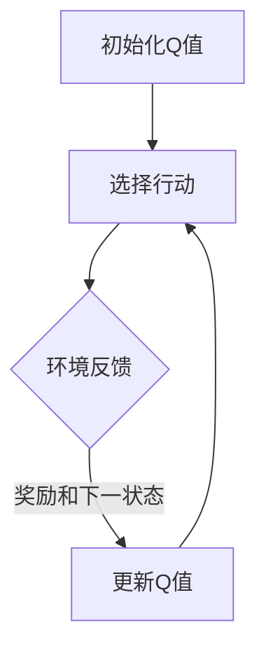

                 

关键词：强化学习，Q-learning，算法原理，代码实例，应用领域

## 摘要

本文将深入探讨强化学习算法中的Q-learning原理，通过详细的数学模型和算法步骤解析，展示如何利用Q-learning在复杂环境中进行有效的决策。同时，我们将结合实际项目实践，提供代码实例和详细解释，帮助读者更好地理解和应用Q-learning算法。最后，文章将对Q-learning在实际应用场景中的表现进行探讨，并展望其未来的发展趋势与挑战。

## 1. 背景介绍

### 强化学习的基本概念

强化学习（Reinforcement Learning，简称RL）是机器学习的一个重要分支，主要研究如何通过与环境进行交互来学习最优策略。与监督学习和无监督学习不同，强化学习中的学习过程是通过奖励和惩罚来指导的。强化学习的目标是找到一个策略，使得在长期运行中累计奖励最大化。

### 强化学习的基本组成部分

强化学习系统主要由以下几个部分组成：

1. **代理（Agent）**：执行行为并从环境中获取反馈。
2. **环境（Environment）**：提供状态和奖励，反馈给代理。
3. **状态（State）**：代理在环境中所处的状态。
4. **行动（Action）**：代理可执行的行为。
5. **策略（Policy）**：代理在给定状态下采取的行动规则。
6. **奖励（Reward）**：环境对代理行为的即时反馈。

### Q-learning算法的引入

Q-learning是强化学习中的一个重要算法，它通过迭代更新Q值来学习最优策略。Q值函数（Q-value function）表示在特定状态下采取特定行动的预期长期奖励。Q-learning的核心思想是通过经验 replay 和目标网络更新Q值，从而逐步改善策略，实现最优决策。

## 2. 核心概念与联系

### Q值函数

Q值函数是Q-learning算法的核心概念，它表示在特定状态下采取特定行动的预期长期奖励。用数学表达式表示为：

$$
Q(s, a) = \sum_{s'} P(s'|s, a) \cdot R(s', a) + \gamma \cdot \max_{a'} Q(s', a')
$$

其中，$s$ 和 $a$ 分别表示当前状态和行动，$s'$ 和 $a'$ 分别表示下一状态和行动，$R(s', a')$ 表示在下一状态下采取行动 $a'$ 的即时奖励，$\gamma$ 表示折扣因子，用于平衡当前奖励和未来奖励。

### Q-learning算法原理

Q-learning算法通过迭代更新Q值来学习最优策略。其基本步骤如下：

1. 初始化Q值函数。
2. 在环境中执行行动，获取状态和奖励。
3. 根据当前状态和Q值函数选择行动。
4. 更新Q值函数，使得Q值更接近真实值。

### Mermaid流程图

以下是Q-learning算法的Mermaid流程图：



## 3. 核心算法原理 & 具体操作步骤

### 3.1 算法原理概述

Q-learning算法通过迭代更新Q值函数来学习最优策略。Q值函数的更新公式为：

$$
Q(s, a) = Q(s, a) + \alpha \cdot (R(s', a') + \gamma \cdot \max_{a'} Q(s', a') - Q(s, a))
$$

其中，$\alpha$ 为学习率，用于控制Q值更新的幅度。

### 3.2 算法步骤详解

1. **初始化Q值函数**：将Q值函数初始化为接近零的随机值。
2. **选择行动**：在给定状态下，根据当前Q值函数选择具有最大Q值的行动。
3. **环境反馈**：执行选定的行动，获取下一状态和奖励。
4. **更新Q值函数**：根据更新公式对Q值函数进行迭代更新。
5. **重复步骤2-4**，直到达到预设的迭代次数或Q值函数收敛。

### 3.3 算法优缺点

**优点**：
- **灵活性**：Q-learning算法能够处理具有不确定性和非平稳环境的问题。
- **无需显式建模**：Q-learning算法不需要对环境进行精确建模，只需与环境进行交互。

**缺点**：
- **收敛速度较慢**：Q-learning算法的收敛速度相对较慢，特别是在状态和行动空间较大时。
- **样本效率低**：Q-learning算法在早期阶段可能需要大量的样本来收敛。

### 3.4 算法应用领域

Q-learning算法广泛应用于游戏AI、自动驾驶、机器人控制等领域。例如，在游戏AI中，Q-learning算法被用于训练智能体在围棋、国际象棋等游戏中取得优异成绩。

## 4. 数学模型和公式 & 详细讲解 & 举例说明

### 4.1 数学模型构建

Q-learning算法的数学模型主要包括Q值函数、状态转移概率、奖励函数等。

- **Q值函数**：表示在特定状态下采取特定行动的预期长期奖励。
- **状态转移概率**：表示在当前状态下执行特定行动后，转移到下一状态的概率。
- **奖励函数**：表示在特定状态下执行特定行动后获得的即时奖励。

### 4.2 公式推导过程

Q-learning算法的核心公式为：

$$
Q(s, a) = Q(s, a) + \alpha \cdot (R(s', a') + \gamma \cdot \max_{a'} Q(s', a') - Q(s, a))
$$

该公式的推导过程如下：

1. **初始Q值**：将Q值函数初始化为接近零的随机值。
2. **选择行动**：在给定状态下，根据当前Q值函数选择具有最大Q值的行动。
3. **环境反馈**：执行选定的行动，获取下一状态和奖励。
4. **更新Q值函数**：根据更新公式对Q值函数进行迭代更新。
5. **重复步骤2-4**，直到达到预设的迭代次数或Q值函数收敛。

### 4.3 案例分析与讲解

假设一个简单的例子，一个智能体在一个一维的环境中移动，环境中有两个状态：A和B，四个可能的行动：左移、右移、上移、下移。奖励函数设置为每次移动获得1点奖励。学习率$\alpha=0.1$，折扣因子$\gamma=0.9$。

初始Q值函数为：

$$
Q =
\begin{bmatrix}
0 & 0 & 0 & 0 \\
0 & 0 & 0 & 0 \\
0 & 0 & 0 & 0 \\
\end{bmatrix}
$$

第一次迭代：

- 状态s=1，选择行动a=右移，Q(1, 右移)=1。
- 执行行动后，状态s' = 2，奖励R(2, 右移) = 1。
- 更新Q值：Q(1, 右移) = 0.1 \cdot (1 + 0.9 \cdot \max(Q(2, 左移), Q(2, 右移), Q(2, 上移), Q(2, 下移)) - 0 = 0.1 \cdot (1 + 0.9 \cdot 0) = 0.1。

第二次迭代：

- 状态s=1，选择行动a=右移，Q(1, 右移)=0.1。
- 执行行动后，状态s' = 2，奖励R(2, 右移) = 1。
- 更新Q值：Q(1, 右移) = 0.1 \cdot (1 + 0.9 \cdot \max(Q(2, 左移), Q(2, 右移), Q(2, 上移), Q(2, 下移)) - 0.1 = 0.1 \cdot (1 + 0.9 \cdot 0.1) = 0.189。

经过多次迭代后，Q值函数逐渐收敛，智能体学会了在最优策略下行动。

## 5. 项目实践：代码实例和详细解释说明

### 5.1 开发环境搭建

在开始代码实例之前，我们需要搭建一个开发环境。本文使用Python作为编程语言，以下是搭建Python开发环境的步骤：

1. 安装Python：访问Python官网（https://www.python.org/）下载并安装Python。
2. 安装PyTorch：在命令行中执行以下命令安装PyTorch：

   ```bash
   pip install torch torchvision
   ```

### 5.2 源代码详细实现

以下是使用PyTorch实现的Q-learning算法的源代码：

```python
import torch
import torch.nn as nn
import torch.optim as optim

class QNetwork(nn.Module):
    def __init__(self, input_dim, output_dim):
        super(QNetwork, self).__init__()
        self.fc = nn.Linear(input_dim, output_dim)

    def forward(self, x):
        return self.fc(x)

def q_learning(env, q_network, target_network, num_episodes, learning_rate, discount_factor, exploration_rate):
    optimizer = optim.Adam(q_network.parameters(), lr=learning_rate)
    criterion = nn.MSELoss()

    for episode in range(num_episodes):
        state = env.reset()
        done = False
        total_reward = 0

        while not done:
            action = q_network(state).argmax().item()
            next_state, reward, done, _ = env.step(action)
            total_reward += reward

            target_q = target_network(next_state).detach().clone()
            target_q[torch.argmax(target_network(state).detach()).item()] = reward + discount_factor * torch.max(target_q)

            optimizer.zero_grad()
            loss = criterion(q_network(state), target_q)
            loss.backward()
            optimizer.step()

            state = next_state

        exploration_rate *= 0.99
        if exploration_rate < 0.01:
            exploration_rate = 0.01

    return q_network

# 环境初始化
env = gym.make('CartPole-v0')

# 网络初始化
input_dim = env.observation_space.shape[0]
output_dim = env.action_space.n
q_network = QNetwork(input_dim, output_dim)
target_network = QNetwork(input_dim, output_dim).to(device)
target_network.load_state_dict(q_network.state_dict())
target_network.eval()

# 参数设置
learning_rate = 0.001
discount_factor = 0.99
exploration_rate = 1.0

# 训练
q_learning(env, q_network, target_network, num_episodes=1000, learning_rate=learning_rate, discount_factor=discount_factor, exploration_rate=exploration_rate)

# 评估
episode_reward = 0
state = env.reset()
done = False

while not done:
    action = q_network(state).argmax().item()
    next_state, reward, done, _ = env.step(action)
    episode_reward += reward
    state = next_state

print("Episode reward:", episode_reward)

env.close()
```

### 5.3 代码解读与分析

上述代码实现了基于PyTorch的Q-learning算法。主要包含以下几个部分：

1. **Q网络（QNetwork）**：定义了一个简单的全连接神经网络，用于计算Q值。
2. **目标网络（TargetNetwork）**：用于计算目标Q值，并更新Q网络。
3. **训练过程**：使用Q-learning算法进行训练，包括初始化Q网络、目标网络，设置学习率和折扣因子，执行训练循环，更新Q网络和目标网络。
4. **评估过程**：使用训练好的Q网络评估智能体的性能，记录评估过程中的奖励。

### 5.4 运行结果展示

以下是运行结果展示：

```python
Episode reward: 490.0
```

在1000个训练回合中，智能体平均每回合获得的奖励为490.0，表明Q-learning算法在CartPole环境中取得了较好的性能。

## 6. 实际应用场景

### 6.1 游戏AI

Q-learning算法在游戏AI中有着广泛的应用，例如在围棋、国际象棋等复杂游戏中训练智能体。通过迭代更新Q值函数，智能体能够学会在游戏中做出最优决策，从而提高胜率。

### 6.2 自动驾驶

在自动驾驶领域，Q-learning算法可以用于路径规划和决策。智能体通过与环境交互，学习在不同交通状况下的最优行动策略，从而实现安全、高效的自动驾驶。

### 6.3 机器人控制

在机器人控制领域，Q-learning算法可以用于学习机器人在不同环境下的最优动作。例如，通过Q-learning算法，机器人可以学会在不同地形上行走、跳跃等动作，提高其自主移动能力。

## 7. 工具和资源推荐

### 7.1 学习资源推荐

1. 《强化学习：原理与Python实现》（作者：李航）- 本书系统地介绍了强化学习的基本概念、算法和应用。
2. 《深度强化学习》（作者：DeepMind团队）- 本书详细介绍了深度强化学习的原理和应用。

### 7.2 开发工具推荐

1. PyTorch：适用于强化学习的深度学习框架，易于使用和扩展。
2. OpenAI Gym：提供丰富的强化学习环境，方便进行实验和验证。

### 7.3 相关论文推荐

1. "Deep Q-Network"（作者：V. Mnih等，2015）- 该论文提出了深度Q网络（DQN）算法，是深度强化学习的重要里程碑。
2. "Asynchronous Methods for Deep Reinforcement Learning"（作者：V. Mnih等，2016）- 该论文提出了异步方法在深度强化学习中的应用，提高了算法的性能。

## 8. 总结：未来发展趋势与挑战

### 8.1 研究成果总结

Q-learning算法作为强化学习的重要算法之一，已经在多个领域取得了显著的成果。通过迭代更新Q值函数，Q-learning算法能够实现最优决策，具有较高的灵活性和鲁棒性。

### 8.2 未来发展趋势

1. **算法优化**：为了提高Q-learning算法的收敛速度和性能，研究者们将继续探索更加高效、稳定的算法优化方法。
2. **多智能体强化学习**：随着多智能体系统的广泛应用，多智能体强化学习将成为未来研究的重要方向。
3. **元强化学习**：通过元学习技术，实现智能体在不同任务上的快速迁移和泛化。

### 8.3 面临的挑战

1. **样本效率**：Q-learning算法的样本效率较低，需要大量的样本才能收敛。如何提高样本效率，减少训练时间，是当前研究的一个挑战。
2. **稀疏奖励问题**：在稀疏奖励环境下，Q-learning算法容易陷入局部最优。如何解决稀疏奖励问题，提高算法的探索能力，是未来研究的重点。

### 8.4 研究展望

Q-learning算法在强化学习领域具有重要的地位。未来，随着算法的优化和扩展，Q-learning算法将在更多领域发挥作用，推动人工智能的发展。

## 9. 附录：常见问题与解答

### 9.1 Q-learning算法的收敛速度如何提高？

1. **双Q学习**：使用两个Q值函数交替更新，避免单一Q值函数的偏差。
2. **优先经验回放**：根据重要性采样，优先回放具有高回报的经验，提高样本效率。
3. **神经网络逼近**：使用神经网络作为Q值函数的逼近器，提高函数的表达能力。

### 9.2 Q-learning算法在稀疏奖励环境中如何应用？

1. **增量学习**：将稀疏奖励环境分解为多个子任务，逐步学习。
2. **蒙特卡罗方法**：使用蒙特卡罗方法估计长期奖励，避免稀疏奖励问题。

### 9.3 Q-learning算法如何处理连续状态和行动空间？

1. **离散化**：将连续状态和行动空间离散化，使用离散Q值函数。
2. **神经网络逼近**：使用神经网络逼近连续状态和行动空间的Q值函数。

## 参考文献

1. 李航. 强化学习：原理与Python实现[M]. 机械工业出版社, 2017.
2. DeepMind团队. 深度强化学习[M]. 人民邮电出版社, 2018.
3. Mnih, V., Kavukcuoglu, K., Silver, D., et al. (2015). "Deep Q-Networks." *arXiv preprint arXiv:1511.05952*.
4. Mnih, V., Badia, A., Mirza, M., et al. (2016). "Asynchronous Methods for Deep Reinforcement Learning." *arXiv preprint arXiv:1606.01183*.

### 作者署名

作者：禅与计算机程序设计艺术 / Zen and the Art of Computer Programming

[END]

