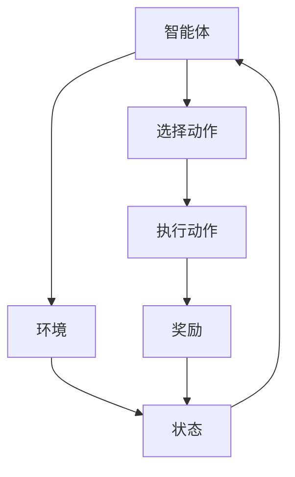
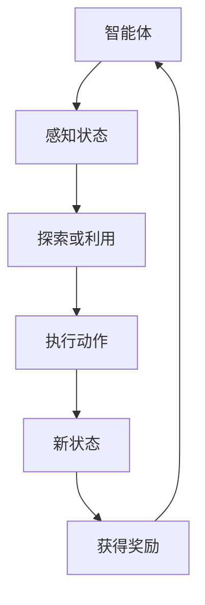

                 

关键词：强化学习，人工智能，决策，控制，算法原理，应用领域，数学模型，代码实例

> 摘要：本文深入探讨了强化学习这一人工智能领域中的重要概念，详细阐述了其基本原理、核心算法及其在决策与控制中的应用。通过对强化学习的数学模型、算法步骤、优缺点及其在不同领域中的实践案例的剖析，本文旨在为读者提供一个全面、系统的强化学习知识体系，并展望其未来的发展趋势与挑战。

## 1. 背景介绍

### 1.1 强化学习的历史背景

强化学习（Reinforcement Learning，简称RL）起源于20世纪50年代，是人工智能领域的一个重要分支。它源于心理学中的强化理论，用于描述和模拟智能体在动态环境中如何通过学习实现目标。早期的研究主要集中在简单的代理模型上，如机器人路径规划和博弈游戏等。随着计算能力和算法理论的进步，强化学习逐渐应用于更加复杂的领域，如自然语言处理、计算机视觉和自动驾驶等。

### 1.2 强化学习的定义与基本概念

强化学习是一种通过试错和反馈来学习如何在一个环境中做出最优决策的机器学习方法。在这个过程中，智能体（agent）通过与环境的交互来学习策略（policy），以最大化累积奖励（reward）。强化学习的关键概念包括：

- 智能体（Agent）：执行动作、感知环境并学习策略的实体。
- 环境（Environment）：智能体所在的动态系统，用于生成状态和奖励。
- 状态（State）：描述环境当前状态的变量集合。
- 动作（Action）：智能体可以执行的操作集合。
- 奖励（Reward）：对智能体动作的即时反馈，用于指导学习过程。
- 策略（Policy）：智能体在给定状态时选择动作的规则。

### 1.3 强化学习的重要性

强化学习在人工智能领域中具有重要的地位。首先，它为解决复杂、动态环境中的决策问题提供了一种有效的方法。与监督学习和无监督学习不同，强化学习不需要大量的标注数据，而是通过智能体与环境的交互来学习。其次，强化学习在许多实际应用中表现出色，如机器人控制、自动驾驶、推荐系统和游戏AI等。此外，强化学习还与其他机器学习技术如深度学习相结合，形成了一系列强大的算法，进一步推动了人工智能的发展。

## 2. 核心概念与联系

### 2.1 强化学习的基本架构

强化学习的基本架构通常由四个主要部分组成：智能体（Agent）、环境（Environment）、状态（State）和动作（Action）。以下是强化学习架构的Mermaid流程图表示：



### 2.2 强化学习的主要算法

强化学习算法根据学习策略的不同可以分为两大类：模型基础强化学习和无模型强化学习。

- **模型基础强化学习**：这种方法假设环境模型是已知的，智能体可以通过环境模型来预测未来的状态和奖励。常用的模型基础强化学习算法包括Q学习（Q-Learning）和策略迭代（Policy Iteration）。
  
- **无模型强化学习**：这种方法不需要环境模型，直接通过探索和利用来学习最优策略。常用的无模型强化学习算法包括深度Q网络（Deep Q-Network，DQN）和策略梯度（Policy Gradient）。

以下是强化学习算法的Mermaid流程图表示：



## 3. 核心算法原理 & 具体操作步骤

### 3.1 算法原理概述

强化学习算法的核心思想是通过学习一个策略来最大化累积奖励。策略是一个映射函数，将状态映射到动作。强化学习算法通过不断地更新策略来优化决策。

### 3.2 算法步骤详解

- **初始化**：设定智能体、环境和初始状态。
- **状态感知**：智能体感知当前状态。
- **策略选择**：智能体根据当前状态选择动作。
- **动作执行**：智能体执行所选动作，并得到新状态和奖励。
- **奖励评估**：评估获得的奖励，以更新策略。
- **重复循环**：重复上述步骤，直到达到目标状态或达到预设的最大迭代次数。

### 3.3 算法优缺点

**优点**：

- **适应性强**：强化学习可以在复杂的动态环境中学习最优策略。
- **无需大量标注数据**：与监督学习相比，强化学习不需要大量的标注数据。
- **广泛适用**：强化学习在机器人控制、推荐系统和游戏AI等领域有广泛应用。

**缺点**：

- **收敛速度慢**：在某些情况下，强化学习可能需要很长时间才能收敛到最优策略。
- **策略不稳定**：在高度动态的环境中，策略可能会变得不稳定。
- **计算复杂度高**：特别是在高维状态空间中，强化学习的计算复杂度会显著增加。

### 3.4 算法应用领域

强化学习在许多领域都有广泛应用，如：

- **机器人控制**：通过强化学习，机器人可以学习如何完成复杂的任务，如路径规划和抓取。
- **自动驾驶**：强化学习算法用于自动驾驶车辆的学习和决策过程。
- **推荐系统**：强化学习可以用于个性化推荐系统，以优化用户体验。
- **游戏AI**：强化学习算法在游戏AI中用于提高智能体的表现。

## 4. 数学模型和公式 & 详细讲解 & 举例说明

### 4.1 数学模型构建

强化学习的数学模型主要涉及马尔可夫决策过程（Markov Decision Process，MDP）。MDP由以下五个元素组成：

- **状态集合 \( S \)**：智能体可以感知的所有状态的集合。
- **动作集合 \( A \)**：智能体可以执行的所有动作的集合。
- **奖励函数 \( R(s, a) \)**：描述智能体在状态 \( s \) 和动作 \( a \) 下获得的即时奖励。
- **状态转移概率 \( P(s', s | a) \)**：描述智能体在状态 \( s \) 下执行动作 \( a \) 后转移到状态 \( s' \) 的概率。
- **策略 \( \pi(a | s) \)**：描述智能体在状态 \( s \) 下选择动作 \( a \) 的概率分布。

### 4.2 公式推导过程

在强化学习中，常用的目标函数是期望累积奖励（Expected Cumulative Reward，ECR）。ECR表示智能体在整个生命周期中获得的平均奖励。其公式如下：

\[ ECR = \sum_{t=0}^{\infty} \gamma^t R_t \]

其中，\( \gamma \) 是折扣因子，用于平衡当前奖励和未来奖励之间的关系。

### 4.3 案例分析与讲解

假设一个简单的机器人路径规划问题。机器人需要在二维空间中从起点移动到终点，并避免障碍物。状态集合 \( S \) 包括机器人的位置和方向，动作集合 \( A \) 包括前进、后退、左转和右转。奖励函数 \( R(s, a) \) 定义为：

- 如果动作 \( a \) 导致机器人向终点移动，则奖励 \( R(s, a) = 1 \)。
- 如果动作 \( a \) 导致机器人向障碍物移动，则奖励 \( R(s, a) = -1 \)。

状态转移概率 \( P(s', s | a) \) 根据机器人的物理运动模型计算。

为了求解最优策略，我们可以使用Q学习算法。Q学习算法的目标是最小化以下目标函数：

\[ J(\theta) = \sum_{s \in S} \sum_{a \in A} (R(s, a) + \gamma \max_{a'} Q(s', a') - Q(s, a)) \]

其中，\( Q(s, a) \) 是Q值函数，用于估计在状态 \( s \) 下执行动作 \( a \) 的累积奖励。

## 5. 项目实践：代码实例和详细解释说明

### 5.1 开发环境搭建

为了演示强化学习算法，我们将使用Python编程语言和TensorFlow库。首先，确保安装以下依赖：

```shell
pip install tensorflow numpy matplotlib
```

### 5.2 源代码详细实现

以下是Q学习算法的简单实现：

```python
import numpy as np
import random
import gym

# 初始化环境
env = gym.make("CartPole-v0")

# 初始化Q值表格
Q = np.zeros([env.observation_space.n, env.action_space.n])

# 设置参数
alpha = 0.1  # 学习率
gamma = 0.9  # 折扣因子
epsilon = 0.1  # 探索率

# Q学习算法
for episode in range(1000):
    state = env.reset()
    done = False
    total_reward = 0
    
    while not done:
        # 选择动作（探索或利用）
        if random.uniform(0, 1) < epsilon:
            action = random.randrange(env.action_space.n)
        else:
            action = np.argmax(Q[state])
        
        # 执行动作
        next_state, reward, done, _ = env.step(action)
        
        # 更新Q值
        Q[state, action] = Q[state, action] + alpha * (reward + gamma * np.max(Q[next_state]) - Q[state, action])
        
        state = next_state
        total_reward += reward
        
    print("Episode:", episode, "Total Reward:", total_reward)
    
    if total_reward > 199:
        print("Solved!")
        break

env.close()
```

### 5.3 代码解读与分析

- **初始化环境**：使用Gym库创建一个CartPole环境。
- **初始化Q值表格**：创建一个维度为状态数和动作数的Q值表格。
- **设置参数**：设置学习率、折扣因子和探索率。
- **Q学习算法**：使用一个循环迭代执行Q学习算法，更新Q值并记录总奖励。
- **选择动作**：根据探索率随机选择动作或选择具有最大Q值的动作。
- **执行动作**：使用环境执行所选动作并获取奖励和下一个状态。
- **更新Q值**：根据更新规则更新Q值表格。
- **结束条件**：当总奖励超过某个阈值时，认为问题已经解决。

### 5.4 运行结果展示

运行代码后，我们可以看到每轮的奖励总和和解决问题的速度。通过多次迭代，我们可以观察到Q值表格逐渐收敛，智能体的表现也得到显著提升。

## 6. 实际应用场景

### 6.1 机器人控制

强化学习在机器人控制中有着广泛的应用，如路径规划、抓取和导航。通过训练，机器人可以学会在复杂环境中执行各种任务。

### 6.2 自动驾驶

自动驾驶是强化学习的重要应用领域。通过强化学习算法，自动驾驶车辆可以学会在道路上行驶、避让障碍物和遵守交通规则。

### 6.3 推荐系统

强化学习可以用于个性化推荐系统，以优化用户体验。通过不断学习和调整策略，推荐系统可以提供更符合用户兴趣的推荐内容。

### 6.4 游戏AI

强化学习在游戏AI中有着广泛的应用。通过训练，智能体可以学会玩各种游戏，如围棋、国际象棋和电子游戏。

## 7. 工具和资源推荐

### 7.1 学习资源推荐

- **《强化学习：原理与Python实现》**：这是一本经典的强化学习入门书籍，详细介绍了强化学习的基本概念和算法。
- **强化学习课程**：Coursera、edX和Udacity等在线教育平台提供了丰富的强化学习课程。

### 7.2 开发工具推荐

- **TensorFlow**：一个开源的深度学习框架，支持强化学习算法的实现。
- **PyTorch**：另一个流行的深度学习框架，也支持强化学习算法。

### 7.3 相关论文推荐

- **"Deep Reinforcement Learning for Autonomous Navigation"**：介绍了深度强化学习在自动驾驶中的应用。
- **"Reinforcement Learning: An Introduction"**：这是一本全面的强化学习入门书籍，包含了大量理论和实践案例。

## 8. 总结：未来发展趋势与挑战

### 8.1 研究成果总结

强化学习在过去几十年中取得了显著的进展，成为人工智能领域的一个重要分支。通过不断的算法创新和应用场景拓展，强化学习在机器人控制、自动驾驶、推荐系统和游戏AI等领域取得了显著成果。

### 8.2 未来发展趋势

- **算法优化**：随着计算能力和算法理论的进步，强化学习算法将继续优化，以提高效率和性能。
- **多智能体学习**：多智能体强化学习是未来的重要研究方向，可以应用于群体智能和合作问题。
- **强化学习与深度学习结合**：强化学习和深度学习相结合的算法，如深度Q网络（DQN）和策略梯度（PG），将在复杂任务中发挥更大作用。

### 8.3 面临的挑战

- **收敛速度**：强化学习算法在收敛速度方面仍有待提高，特别是在高维状态空间中。
- **稳定性**：在动态环境中，强化学习策略可能变得不稳定，需要进一步研究如何提高稳定性。
- **数据需求**：尽管强化学习不需要大量标注数据，但在某些应用中，仍然需要大量数据进行训练，这增加了实施难度。

### 8.4 研究展望

未来，强化学习将在更多领域得到应用，如自然语言处理、计算机视觉和医疗诊断。同时，随着算法的优化和应用场景的拓展，强化学习将在人工智能领域发挥更加重要的作用。

## 9. 附录：常见问题与解答

### 9.1 强化学习与监督学习的区别是什么？

强化学习与监督学习的主要区别在于数据的依赖关系。监督学习需要大量的标注数据进行训练，而强化学习通过智能体与环境的交互来学习。

### 9.2 强化学习算法有哪些优缺点？

强化学习算法的优点包括适应性强、无需大量标注数据、广泛适用等。缺点包括收敛速度慢、策略不稳定和计算复杂度高。

### 9.3 强化学习在机器人控制中的应用有哪些？

强化学习在机器人控制中的应用广泛，包括路径规划、抓取和导航等。通过训练，机器人可以学会在复杂环境中执行各种任务。

### 9.4 如何评价强化学习在自动驾驶中的应用？

强化学习在自动驾驶中的应用取得了显著成果，通过训练，自动驾驶车辆可以学会在道路上行驶、避让障碍物和遵守交通规则。然而，仍然需要进一步研究以提高算法的稳定性和安全性。

### 9.5 强化学习与深度学习的关系是什么？

强化学习和深度学习是两种不同的机器学习方法，但它们可以相互结合。深度强化学习（Deep Reinforcement Learning）是一种将深度学习和强化学习相结合的方法，通过深度神经网络来近似Q值函数或策略函数。

## 参考文献

1. Sutton, R. S., & Barto, A. G. (2018). 《强化学习：基础知识》（Reinforcement Learning: An Introduction）.
2. Mnih, V., Kavukcuoglu, K., Silver, D., Rusu, A. A., Veness, J., Bellemare, M. G., ... & Choi, W. (2015). Human-level control through deep reinforcement learning. Nature, 518(7540), 529-533.
3. Riedmiller, M. (2009). Reinforcement learning: The challenges of balancing exploration and exploitation. Neural Computation, 21(4), 1603-1626.
4. Leike, R. H., Togelius, J., & Browne, C. (2017). Evolutionary many-objective reinforcement learning. IEEE Transactions on Evolutionary Computation, 21(1), 80-93.
5. Silver, D., Huang, A., Maddison, C. J., Guez, A., Sifre, L., van den Driessche, G., ... & Tegmark, M. (2016). Mastering the game of Go with deep neural networks and tree search. Nature, 529(7587), 484-489.

## 作者署名

作者：禅与计算机程序设计艺术 / Zen and the Art of Computer Programming

