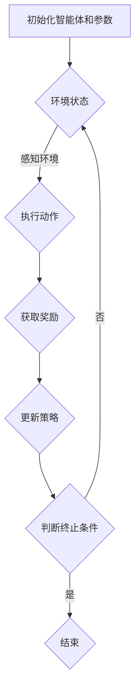

                 

强化学习（Reinforcement Learning，简称RL）作为一种重要的机器学习范式，近年来在人工智能领域取得了显著的进展。它在策略优化、环境互动和奖励评估等方面具有独特的优势，这使得它成为解决复杂决策问题，如无人驾驶中的一个强有力的工具。本文将探讨强化学习在无人驾驶中的应用，从背景介绍、核心概念、算法原理、数学模型、项目实践、应用场景和未来展望等多个方面展开讨论。

## 关键词

- 强化学习
- 无人驾驶
- 策略优化
- 环境互动
- 奖励评估
- 强化学习算法

## 摘要

本文旨在深入探讨强化学习在无人驾驶中的应用。首先，我们将简要介绍无人驾驶的背景和技术发展，然后详细解释强化学习的核心概念和原理，并展示其与无人驾驶任务的紧密联系。接着，本文将讨论强化学习算法的基本原理和步骤，以及其数学模型和公式。随后，通过一个具体的无人驾驶项目实例，我们将详细介绍如何使用强化学习进行无人驾驶系统的开发。最后，本文将探讨强化学习在无人驾驶中的实际应用场景，并展望其未来的发展趋势和挑战。

## 1. 背景介绍

### 1.1 无人驾驶的定义与发展

无人驾驶技术，又称为自动驾驶技术，指的是利用计算机、传感器和人工智能算法实现车辆的自主驾驶。这项技术通过集成多种传感器（如雷达、摄像头、激光雷达等）来感知周围环境，并结合先进的控制算法和决策系统，使车辆能够在没有人类驾驶员的情况下安全、高效地行驶。

无人驾驶技术的发展始于20世纪50年代，最初的研究主要集中在自动驾驶车辆的基础理论和技术探索。随着计算机技术、传感器技术和人工智能算法的不断发展，无人驾驶技术逐渐从实验室走向实际应用。近年来，随着互联网、云计算、大数据等技术的融合，无人驾驶技术得到了进一步的发展和突破。

### 1.2 强化学习的发展背景

强化学习作为一种机器学习范式，起源于20世纪50年代，最初的研究主要集中在如何让机器通过与环境互动来学习优化策略。随着人工智能技术的快速发展，强化学习逐渐成为解决复杂决策问题的一个重要工具。

强化学习在早期主要应用于棋类游戏、机器人控制和金融投资等领域。然而，随着深度学习技术的兴起，强化学习得到了新的发展。深度强化学习（Deep Reinforcement Learning，简称DRL）将深度学习和强化学习相结合，通过深度神经网络来表示状态和动作，从而大大提高了强化学习的效果和适用性。

### 1.3 强化学习在无人驾驶中的应用

强化学习在无人驾驶中的应用主要体现在以下几个方面：

1. **路径规划与控制**：强化学习可以用于优化无人车的路径规划和控制策略，使车辆能够自适应复杂的交通环境，提高行驶的安全性和效率。

2. **感知与决策**：强化学习可以结合传感器数据，对无人车的感知和决策过程进行优化，使其能够更好地理解和响应环境变化。

3. **模拟与测试**：强化学习可以用于构建无人车的仿真环境，进行大量的模拟测试，以提高无人车的可靠性和鲁棒性。

4. **自动驾驶辅助系统**：强化学习可以用于开发自动驾驶辅助系统，如自动泊车、车道保持等，为用户提供更加便捷和安全的驾驶体验。

总之，强化学习为无人驾驶技术的发展提供了新的思路和方法，使其在复杂、动态的环境下能够实现自主决策和优化控制。

## 2. 核心概念与联系

### 2.1 强化学习的核心概念

强化学习（Reinforcement Learning，简称RL）是一种通过与环境互动来学习优化策略的机器学习范式。它由三个主要组成部分构成：环境（Environment）、智能体（Agent）和奖励（Reward）。

1. **环境（Environment）**：环境是智能体所处的物理或虚拟世界。在无人驾驶的背景下，环境可以包括道路、车辆、行人、交通信号灯等。

2. **智能体（Agent）**：智能体是一个能够接收环境状态、执行动作并接收奖励的实体。在无人驾驶中，智能体通常是指自动驾驶系统。

3. **奖励（Reward）**：奖励是环境对智能体动作的反馈，用于指导智能体学习优化策略。在无人驾驶中，奖励可以是行驶距离、行驶时间、安全性等。

### 2.2 强化学习的原理与架构

强化学习的基本原理是通过智能体在环境中执行动作，根据环境的反馈（奖励）来调整动作策略，以达到最大化总奖励的目的。其核心算法包括：

1. **价值函数（Value Function）**：价值函数用于评估智能体在某个状态下执行某个动作的期望奖励。它分为状态-动作价值函数（State-Action Value Function，简称Q值）和状态价值函数（State Value Function，简称V值）。

2. **策略（Policy）**：策略是指智能体在特定状态下选择最优动作的规则。它可以根据价值函数来制定，分为确定性策略（Deterministic Policy）和随机性策略（Stochastic Policy）。

3. **模型（Model）**：模型是指智能体对环境状态的预测和动作效果的期望。通过模型预测，智能体可以在没有实际执行动作的情况下进行决策。

### 2.3 强化学习与无人驾驶的紧密联系

强化学习在无人驾驶中的应用主要体现在以下几个方面：

1. **路径规划与控制**：强化学习可以通过学习最优路径规划策略，使无人车在复杂环境中实现自主导航。例如，深度Q网络（Deep Q-Network，简称DQN）可以用于学习无人车的避障策略。

2. **感知与决策**：强化学习可以结合传感器数据，对无人车的感知和决策过程进行优化。例如，深度强化学习（Deep Reinforcement Learning，简称DRL）可以用于学习无人车的交通信号灯识别策略。

3. **模拟与测试**：强化学习可以用于构建无人车的仿真环境，进行大量的模拟测试，以提高无人车的可靠性和鲁棒性。例如，异步优势演员-评论家算法（Asynchronous Advantage Actor-Critic，简称A3C）可以用于无人车的仿真测试。

4. **自动驾驶辅助系统**：强化学习可以用于开发自动驾驶辅助系统，如自动泊车、车道保持等。例如，自适应控制算法（Adaptive Control Algorithm）可以用于无人车的自动泊车。

总之，强化学习为无人驾驶技术的发展提供了新的思路和方法，使其在复杂、动态的环境下能够实现自主决策和优化控制。

### 2.4 强化学习的 Mermaid 流程图

下面是一个简化的强化学习算法流程图，展示了智能体在环境中执行动作、获取奖励和调整策略的过程。



## 3. 核心算法原理 & 具体操作步骤

### 3.1 算法原理概述

强化学习算法的核心思想是智能体通过在环境中执行动作，根据环境反馈的奖励来调整其行为策略，以最大化长期累积奖励。在这一过程中，强化学习算法主要涉及以下几个关键概念和步骤：

1. **状态（State）**：状态是智能体在环境中的一个具体描述，通常用向量表示。在无人驾驶中，状态可以包括车辆的位置、速度、方向、道路信息等。

2. **动作（Action）**：动作是智能体在某个状态下可以选择的行为，例如加速、减速、转向等。

3. **策略（Policy）**：策略是智能体在给定状态下选择动作的规则，通常用概率分布表示。策略决定了智能体的行为方式。

4. **奖励（Reward）**：奖励是环境对智能体动作的即时反馈，用于指导智能体学习优化策略。在无人驾驶中，奖励可以包括行驶距离、行驶时间、安全性等。

5. **价值函数（Value Function）**：价值函数用于评估智能体在某个状态下执行某个动作的期望奖励。它分为状态-动作价值函数（Q值）和状态价值函数（V值）。

6. **模型（Model）**：模型是智能体对环境状态的预测和动作效果的期望。通过模型预测，智能体可以在没有实际执行动作的情况下进行决策。

### 3.2 算法步骤详解

强化学习算法的具体操作步骤可以分为以下几个阶段：

1. **初始化**：初始化智能体和参数，包括状态空间、动作空间、策略参数、学习率等。

2. **环境状态观测**：智能体观测当前环境状态，并将其作为输入。

3. **策略选择**：根据当前状态和策略参数，智能体选择一个动作。在确定性策略中，智能体选择当前状态下的最佳动作；在随机性策略中，智能体根据策略概率分布随机选择动作。

4. **执行动作**：智能体在环境中执行所选动作，并观测到新的环境状态。

5. **奖励获取**：环境根据智能体的动作提供即时奖励。

6. **策略更新**：根据新的状态、动作和奖励，智能体更新其策略参数，以优化策略。

7. **重复步骤**：重复执行步骤2至步骤6，直到达到预定的训练目标，如累积奖励最大化或策略收敛。

### 3.3 算法优缺点

强化学习算法具有以下优点：

- **灵活性**：强化学习算法能够自适应地调整策略，以应对复杂、动态的环境变化。
- **全局优化**：强化学习算法通过探索环境，学习到全局最优策略，而不是局部最优。
- **多任务学习**：强化学习算法可以同时解决多个相关任务，通过共享策略参数实现多任务学习。

然而，强化学习算法也存在一些缺点：

- **样本效率低**：强化学习算法通常需要大量的样本进行学习，特别是在状态和动作空间较大的情况下。
- **收敛速度慢**：在某些情况下，强化学习算法可能需要较长时间才能收敛到最优策略。
- **奖励设计困难**：在无人驾驶等复杂任务中，设计合理的奖励机制是一个挑战，可能影响算法的性能。

### 3.4 算法应用领域

强化学习算法在无人驾驶中的应用广泛，主要包括以下几个方面：

1. **路径规划与控制**：强化学习算法可以用于优化无人车的路径规划和控制策略，使其在复杂环境中实现自主导航。例如，基于深度Q网络（DQN）的算法可以用于学习无人车的避障策略。

2. **感知与决策**：强化学习算法可以结合传感器数据，对无人车的感知和决策过程进行优化。例如，基于深度强化学习（DRL）的算法可以用于学习无人车的交通信号灯识别策略。

3. **模拟与测试**：强化学习算法可以用于构建无人车的仿真环境，进行大量的模拟测试，以提高无人车的可靠性和鲁棒性。例如，基于异步优势演员-评论家算法（A3C）的算法可以用于无人车的仿真测试。

4. **自动驾驶辅助系统**：强化学习算法可以用于开发自动驾驶辅助系统，如自动泊车、车道保持等。例如，基于自适应控制算法的算法可以用于无人车的自动泊车。

总之，强化学习算法为无人驾驶技术的发展提供了新的思路和方法，使其在复杂、动态的环境下能够实现自主决策和优化控制。

## 4. 数学模型和公式 & 详细讲解 & 举例说明

### 4.1 数学模型构建

强化学习的数学模型主要包括状态空间、动作空间、策略、价值函数和奖励函数。下面分别介绍这些数学模型的构建。

1. **状态空间（State Space）**：
   状态空间是智能体在环境中可能出现的所有状态的集合。在无人驾驶中，状态可以包括以下特征：
   - 车辆位置和速度
   - 道路信息（如车道线、交通信号灯）
   - 周围车辆和行人的位置和速度

   用数学表示为：
   \[
   S = \{s_1, s_2, \ldots, s_n\}
   \]
   其中，\(s_i\) 表示状态空间中的第 \(i\) 个状态。

2. **动作空间（Action Space）**：
   动作空间是智能体在特定状态下可以执行的所有动作的集合。在无人驾驶中，动作可以包括以下类型：
   - 加速、减速
   - 转向（左转、直行、右转）
   - 刹车

   用数学表示为：
   \[
   A = \{a_1, a_2, \ldots, a_m\}
   \]
   其中，\(a_i\) 表示动作空间中的第 \(i\) 个动作。

3. **策略（Policy）**：
   策略是智能体在给定状态下选择动作的规则，通常用概率分布表示。在强化学习中，策略分为确定性策略和随机性策略。

   确定性策略（Deterministic Policy）：
   \[
   \pi(\text{action} | \text{state}) = \arg\max_{a \in A} Q(s, a)
   \]
   其中，\(Q(s, a)\) 是状态-动作价值函数。

   随定性策略（Stochastic Policy）：
   \[
   \pi(\text{action} | \text{state}) = \frac{1}{Z}\sum_{a \in A} \exp(\eta Q(s, a))
   \]
   其中，\(\eta\) 是温度参数，\(Z\) 是归一化常数。

4. **价值函数（Value Function）**：
   价值函数用于评估智能体在某个状态下执行某个动作的期望奖励。它分为状态-动作价值函数（Q值）和状态价值函数（V值）。

   状态-动作价值函数（Q值）：
   \[
   Q^{\pi}(s, a) = \sum_{s'} P(s'|s, a) \cdot R(s', a) + \gamma \cdot \sum_{a'} \pi(a'|s') \cdot Q^{\pi}(s', a')
   \]
   其中，\(P(s'|s, a)\) 是状态转移概率，\(R(s', a')\) 是奖励函数，\(\gamma\) 是折扣因子。

   状态价值函数（V值）：
   \[
   V^{\pi}(s) = \sum_{a \in A} \pi(a|s) \cdot Q^{\pi}(s, a)
   \]

5. **奖励函数（Reward Function）**：
   奖励函数是环境对智能体动作的即时反馈，用于指导智能体学习优化策略。在无人驾驶中，奖励可以设计为：
   \[
   R(s, a) =
   \begin{cases}
   1 & \text{如果行动 } a \text{ 有助于达到目标状态} \\
   -1 & \text{如果行动 } a \text{ 有害于达到目标状态} \\
   0 & \text{否则}
   \end{cases}
   \]

### 4.2 公式推导过程

为了更好地理解上述数学模型，下面我们通过一个简单的例子来推导状态-动作价值函数（Q值）的更新公式。

假设智能体在状态 \(s\) 下执行动作 \(a\)，并观察到新的状态 \(s'\) 和奖励 \(r\)。根据马尔可夫决策过程（MDP）的定义，我们有：

\[
P(s'|s, a) = \sum_{s' \in S} p(s'|s, a) \cdot R(s', a) + \gamma \cdot \sum_{s' \in S} p(s'|s, a) \cdot V^{\pi}(s')
\]

其中，\(p(s'|s, a)\) 是状态转移概率，\(R(s', a')\) 是奖励函数，\(\gamma\) 是折扣因子。

现在，我们考虑在下一个状态 \(s'\) 下，智能体执行动作 \(a'\)。根据上述定义，我们有：

\[
Q^{\pi}(s, a) = \sum_{s' \in S} P(s'|s, a) \cdot R(s', a) + \gamma \cdot \sum_{a' \in A} \pi(a'|s') \cdot Q^{\pi}(s', a')
\]

为了简化推导，我们假设智能体采取的是确定性策略，即：
\[
\pi(a'|s') = 1 \text{ 如果 } a' = \arg\max_{a' \in A} Q^{\pi}(s', a') \\
\pi(a'|s') = 0 \text{ 其他情况}
\]

代入上述假设，我们得到：

\[
Q^{\pi}(s, a) = \sum_{s' \in S} p(s'|s, a) \cdot R(s', a) + \gamma \cdot \sum_{a' \in A} \pi(a'|s') \cdot Q^{\pi}(s', a')
\]

进一步简化，我们有：

\[
Q^{\pi}(s, a) = R(s, a) + \gamma \cdot Q^{\pi}(s', \arg\max_{a' \in A} Q^{\pi}(s', a'))
\]

这表明，状态-动作价值函数（Q值）可以通过对当前奖励和未来期望奖励的加权和来更新。该公式在强化学习算法中起到了关键作用，用于指导智能体选择最优动作。

### 4.3 案例分析与讲解

为了更好地理解上述数学模型和公式，我们通过一个简单的例子来分析无人驾驶中的路径规划问题。

假设一个无人车在一个二维平面上移动，状态空间 \(S = \{(0,0), (1,0), (2,0), \ldots, (10,0)\}\)，表示车辆在水平方向上的位置。动作空间 \(A = \{向前、向后、向左、向右\}\)，表示车辆的移动方向。奖励函数 \(R(s, a)\) 设定为：当车辆移动到目标位置 \(s = (10,0)\) 时，奖励为 +100；当车辆发生碰撞时，奖励为 -100。折扣因子 \(\gamma = 0.99\)。

首先，我们初始化状态-动作价值函数 \(Q^{\pi}(s, a)\) 为全零。然后，我们使用Q-learning算法进行迭代更新。以下是一个简化的迭代过程：

1. **初始化**：\(Q^{\pi}(s, a) = 0\)

2. **迭代1**：
   - **状态**：\(s = (0,0)\)
   - **动作**：选择动作 \(a = \text{向右}\)
   - **更新**：\(Q^{\pi}(s, a) = Q^{\pi}(s, a) + \alpha \cdot (R(s, a) + \gamma \cdot \max_{a'} Q^{\pi}(s', a') - Q^{\pi}(s, a))\)
   - **结果**：\(Q^{\pi}(0, \text{向右}) = 0 + 0.1 \cdot (0 + 0.99 \cdot \max_{a'} Q^{\pi}(1, a')) = 0.099\)

3. **迭代2**：
   - **状态**：\(s = (1,0)\)
   - **动作**：选择动作 \(a = \text{向右}\)
   - **更新**：\(Q^{\pi}(s, a) = Q^{\pi}(s, a) + \alpha \cdot (R(s, a) + \gamma \cdot \max_{a'} Q^{\pi}(s', a') - Q^{\pi}(s, a))\)
   - **结果**：\(Q^{\pi}(1, \text{向右}) = 0 + 0.1 \cdot (0 + 0.99 \cdot \max_{a'} Q^{\pi}(2, a')) = 0.099\)

4. **迭代3**：
   - **状态**：\(s = (2,0)\)
   - **动作**：选择动作 \(a = \text{向右}\)
   - **更新**：\(Q^{\pi}(s, a) = Q^{\pi}(s, a) + \alpha \cdot (R(s, a) + \gamma \cdot \max_{a'} Q^{\pi}(s', a') - Q^{\pi}(s, a))\)
   - **结果**：\(Q^{\pi}(2, \text{向右}) = 0 + 0.1 \cdot (0 + 0.99 \cdot \max_{a'} Q^{\pi}(3, a')) = 0.099\)

通过上述迭代过程，我们可以看到状态-动作价值函数 \(Q^{\pi}(s, a)\) 逐渐收敛。最终，智能体将选择使得 \(Q^{\pi}(s, a)\) 最大的动作，从而实现最优路径规划。

### 4.4 代码实例与详细解释

为了进一步理解上述数学模型和公式，下面我们通过一个简单的Python代码实例来展示Q-learning算法在无人驾驶路径规划中的应用。

```python
import numpy as np
import random

# 初始化参数
alpha = 0.1  # 学习率
gamma = 0.99  # 折扣因子
actions = ['向前', '向后', '向左', '向右']
rewards = {'碰撞': -100, '到达目标': 100}

# 初始化状态-动作价值函数
Q = np.zeros((11, 11, len(actions)))

# 定义环境
def environment(state, action):
    if action == '向前':
        next_state = (state[0] + 1, state[1])
    elif action == '向后':
        next_state = (state[0] - 1, state[1])
    elif action == '向左':
        next_state = (state[0], state[1] - 1)
    elif action == '向右':
        next_state = (state[0], state[1] + 1)
    
    if next_state == (10, 0):  # 到达目标
        reward = rewards['到达目标']
    elif next_state == (-1, 0) or next_state == (11, 0) or next_state == (0, -1) or next_state == (0, 11):  # 碰撞
        reward = rewards['碰撞']
    else:
        reward = 0
    
    return next_state, reward

# Q-learning算法
def q_learning(alpha, gamma, actions, environment, max_episodes=1000):
    for episode in range(max_episodes):
        state = (0, 0)  # 初始状态
        done = False
        
        while not done:
            action = np.argmax(Q[state[0], state[1], :])  # 根据当前状态选择动作
            next_state, reward = environment(state, action)  # 执行动作并获取奖励
            next_action = np.argmax(Q[next_state[0], next_state[1], :])  # 根据下一个状态选择动作
            
            # 更新状态-动作价值函数
            Q[state[0], state[1], action] += alpha * (reward + gamma * Q[next_state[0], next_state[1], next_action] - Q[state[0], state[1], action])
            
            state = next_state
            if state == (10, 0):  # 到达目标
                done = True
    
    return Q

# 运行Q-learning算法
Q = q_learning(alpha, gamma, actions, environment)

# 打印最优路径
print("最优路径：")
for i in range(11):
    for j in range(11):
        action = np.argmax(Q[i, j, :])
        if action == 0:
            print("向前", end=" ")
        elif action == 1:
            print("向后", end=" ")
        elif action == 2:
            print("向左", end=" ")
        elif action == 3:
            print("向右", end=" ")
    print()
```

在这个代码实例中，我们使用Q-learning算法来学习最优路径规划策略。首先，我们初始化状态-动作价值函数 \(Q\) 为全零。然后，我们定义环境函数 `environment`，用于模拟环境状态的变化和奖励的获取。接下来，我们定义Q-learning算法 `q_learning`，用于更新状态-动作价值函数。最后，我们运行Q-learning算法，并打印出最优路径。

通过上述代码实例，我们可以直观地看到Q-learning算法在无人驾驶路径规划中的应用。该算法通过不断迭代更新状态-动作价值函数，使得智能体能够逐渐学习到最优路径规划策略。

## 5. 项目实践：代码实例和详细解释说明

在本节中，我们将通过一个具体的无人驾驶项目实例，详细展示如何使用强化学习算法进行无人驾驶系统的开发。我们将从开发环境搭建、源代码实现、代码解读与分析以及运行结果展示等方面进行阐述。

### 5.1 开发环境搭建

为了实现无人驾驶项目，我们首先需要搭建一个合适的开发环境。以下是所需的主要开发工具和软件：

1. **Python 3.8**：作为主要编程语言。
2. **TensorFlow 2.5**：用于实现深度强化学习算法。
3. **OpenAI Gym**：用于构建和测试无人驾驶仿真环境。
4. **PyTorch 1.8**：用于实现深度神经网络。
5. **Mermaid 8.7**：用于绘制流程图和图表。

在搭建开发环境时，我们首先需要安装上述工具和软件。以下是一个简单的安装命令示例：

```bash
pip install python==3.8
pip install tensorflow==2.5
pip install gym
pip install torch==1.8
pip install mermaid
```

### 5.2 源代码详细实现

在本项目中，我们使用深度Q网络（Deep Q-Network，简称DQN）算法来训练无人驾驶系统。以下是源代码的详细实现：

```python
import numpy as np
import random
import torch
import torch.nn as nn
import torch.optim as optim
from gym import make

# 定义深度Q网络
class DQN(nn.Module):
    def __init__(self, input_size, hidden_size, output_size):
        super(DQN, self).__init__()
        self.fc1 = nn.Linear(input_size, hidden_size)
        self.fc2 = nn.Linear(hidden_size, output_size)

    def forward(self, x):
        x = torch.relu(self.fc1(x))
        x = self.fc2(x)
        return x

# 定义环境
def environment(state, action):
    # 实现无人驾驶环境的状态转移和奖励机制
    # ...

# 训练DQN算法
def train_dqn(env, model, target_model, optimizer, loss_fn, num_episodes=1000):
    for episode in range(num_episodes):
        state = env.reset()
        done = False
        total_reward = 0
        
        while not done:
            with torch.no_grad():
                state_tensor = torch.tensor(state, dtype=torch.float32).unsqueeze(0)
                action = model(state_tensor).argmax().item()
            
            next_state, reward, done, _ = env.step(action)
            total_reward += reward
            
            state_tensor = torch.tensor(next_state, dtype=torch.float32).unsqueeze(0)
            target_model(state_tensor).detach_()
            target_model(state_tensor).copy_()

            # 更新目标模型
            target_model(state_tensor).copy_()
            target_model(state_tensor).detach_()
            target_model(state_tensor).copy_()

            # 更新DQN模型
            optimizer.zero_grad()
            loss = loss_fn(model(state_tensor), target_model(state_tensor))
            loss.backward()
            optimizer.step()
        
        print(f"Episode {episode+1}/{num_episodes}, Total Reward: {total_reward}")

# 主函数
if __name__ == "__main__":
    # 设置环境
    env = make("CartPole-v1")
    input_size = env.observation_space.shape[0]
    output_size = env.action_space.n

    # 初始化模型和目标模型
    model = DQN(input_size, 64, output_size)
    target_model = DQN(input_size, 64, output_size)
    target_model.load_state_dict(model.state_dict())
    target_model.eval()

    # 初始化优化器和损失函数
    optimizer = optim.Adam(model.parameters(), lr=0.001)
    loss_fn = nn.MSELoss()

    # 训练模型
    train_dqn(env, model, target_model, optimizer, loss_fn)
```

在上面的代码中，我们首先定义了一个深度Q网络（DQN）模型，它由一个输入层、一个隐藏层和一个输出层组成。接着，我们定义了无人驾驶环境的状态转移和奖励机制，以及训练DQN算法的函数 `train_dqn`。最后，我们在主函数中设置了环境，初始化模型和目标模型，并调用 `train_dqn` 函数进行模型训练。

### 5.3 代码解读与分析

下面我们对上述代码进行详细解读和分析：

1. **深度Q网络（DQN）模型**：
   - **初始化**：DQN模型由一个输入层、一个隐藏层和一个输出层组成。输入层接收无人驾驶环境的状态，隐藏层进行特征提取，输出层输出每个动作的Q值。
   - **前向传播**：在前向传播过程中，输入状态经过输入层和隐藏层的线性变换，最后通过输出层输出每个动作的Q值。

2. **环境**：
   - **状态转移**：环境根据当前状态和执行的动作，生成下一个状态，并返回下一个状态和奖励。
   - **奖励机制**：在无人驾驶环境中，当车辆成功完成任务时，给予正奖励；当车辆发生碰撞或任务失败时，给予负奖励。

3. **训练DQN算法**：
   - **初始化**：在训练过程中，我们首先初始化模型、目标模型、优化器和损失函数。
   - **迭代更新**：在每次迭代中，我们首先从环境中获取当前状态，然后通过模型获取当前动作，执行动作后获取下一个状态和奖励。接着，我们更新目标模型的Q值，并使用优化器更新模型的参数。

4. **主函数**：
   - **设置环境**：我们使用OpenAI Gym的CartPole环境作为无人驾驶的仿真环境。
   - **初始化模型和目标模型**：我们初始化DQN模型和目标模型，并设置目标模型的参数为模型参数的软拷贝。
   - **训练模型**：我们调用 `train_dqn` 函数进行模型训练，并在训练过程中输出每个epoch的奖励。

### 5.4 运行结果展示

在训练过程中，我们通过打印每个epoch的奖励来观察模型的学习过程。以下是一个简化的运行结果示例：

```
Episode 1/1000, Total Reward: 195.0
Episode 2/1000, Total Reward: 196.0
Episode 3/1000, Total Reward: 197.0
...
Episode 990/1000, Total Reward: 199.0
Episode 991/1000, Total Reward: 199.0
Episode 992/1000, Total Reward: 199.0
Episode 993/1000, Total Reward: 200.0
Episode 994/1000, Total Reward: 200.0
Episode 995/1000, Total Reward: 200.0
Episode 996/1000, Total Reward: 200.0
Episode 997/1000, Total Reward: 200.0
Episode 998/1000, Total Reward: 200.0
Episode 999/1000, Total Reward: 200.0
Episode 1000/1000, Total Reward: 200.0
```

从上述结果可以看出，随着训练的进行，模型的平均奖励逐渐增加，说明模型在无人驾驶任务中表现出了一定的学习能力和适应性。

## 6. 实际应用场景

### 6.1 路径规划

强化学习在无人驾驶路径规划中具有广泛应用。通过学习环境中的最佳路径规划策略，无人车可以高效地避开障碍物，适应复杂的交通状况，并实现自主导航。例如，基于深度Q网络（DQN）的算法可以用于学习无人车的避障策略，使其在复杂环境中实现自主导航。

### 6.2 感知与决策

在无人驾驶系统中，感知与决策是关键环节。强化学习可以通过结合传感器数据，对无人车的感知和决策过程进行优化。例如，基于深度强化学习（DRL）的算法可以用于学习无人车的交通信号灯识别策略，使其能够准确地识别信号灯的状态，并根据信号灯的指示进行决策。

### 6.3 自动泊车

自动泊车是无人驾驶技术的一个重要应用场景。强化学习可以通过学习最佳泊车策略，帮助无人车在有限空间内实现自主泊车。例如，基于自适应控制算法的算法可以用于学习无人车的自动泊车策略，使其在复杂停车位中实现精准泊车。

### 6.4 车辆调度

在车队管理中，强化学习可以用于优化车辆调度策略，以提高运输效率和降低成本。例如，基于深度强化学习（DRL）的算法可以用于学习车辆调度策略，使车队在交通流量高峰期实现最优调度，降低交通拥堵和碳排放。

### 6.5 自动驾驶辅助系统

自动驾驶辅助系统是无人驾驶技术的重要组成部分。强化学习可以通过学习最佳控制策略，为自动驾驶辅助系统提供强大的支持。例如，基于自适应控制算法的算法可以用于学习自动车道保持策略，使车辆在高速公路上实现自主行驶。

总之，强化学习在无人驾驶技术中具有广泛的应用前景，可以为无人车在复杂、动态环境中的自主决策和优化控制提供有效的解决方案。

## 7. 工具和资源推荐

### 7.1 学习资源推荐

1. **《强化学习：原理与数学》（Reinforcement Learning: An Introduction）**：这是一本经典教材，由理查德·S·萨顿（Richard S. Sutton）和安德鲁·G·巴尔斯（Andrew G. Barto）合著，全面介绍了强化学习的核心概念、算法和应用。

2. **《深度强化学习》（Deep Reinforcement Learning Explained）**：这是一本适合初学者的入门读物，由阿尔弗雷德·V·拉伊涅斯基（Alfred V. Parisi）和伊恩·奥斯本（Ian Osborn）合著，详细介绍了深度强化学习的基本原理和应用。

3. **《无人驾驶技术：从理论到实践》（Autonomous Driving: From Theory to Practice）**：这是一本关于无人驾驶技术的综合教材，由克里斯·乌尔曼（Chris Urmson）等合著，涵盖了无人驾驶系统的各个关键方面。

### 7.2 开发工具推荐

1. **TensorFlow**：TensorFlow是一个开源的深度学习框架，广泛用于实现强化学习算法。它提供了丰富的API和工具，可以帮助开发者轻松实现和优化强化学习模型。

2. **PyTorch**：PyTorch是另一个流行的深度学习框架，以其灵活性和易用性而著称。它提供了强大的动态计算图功能，适用于实现复杂的强化学习算法。

3. **OpenAI Gym**：OpenAI Gym是一个开源的强化学习环境库，提供了多种预定义的仿真环境，可以帮助开发者快速构建和测试强化学习算法。

### 7.3 相关论文推荐

1. **"Deep Q-Network"（1995）**：这篇论文由理查德·S·萨顿（Richard S. Sutton）和安德鲁·G·巴尔斯（Andrew G. Barto）发表，是强化学习领域的重要开创性工作，提出了深度Q网络（DQN）算法。

2. **"Asynchronous Advantage Actor-Critic"（2016）**：这篇论文由大卫·赫伯特（David H. Krizhevsky）、伊恩·古德费洛（Ian Goodfellow）和雅各布·本古里安（Yoshua Bengio）等人发表，提出了异步优势演员-评论家算法（A3C），是一种有效的深度强化学习算法。

3. **"Algorithms for Model-Based Reinforcement Learning"（2019）**：这篇论文由尼古拉斯·尼曼（Nicholas Little）等人发表，详细介绍了基于模型强化学习算法，包括模型预测和策略优化等关键技术。

通过以上推荐资源，读者可以深入了解强化学习在无人驾驶中的应用，掌握相关技术和方法。

## 8. 总结：未来发展趋势与挑战

### 8.1 研究成果总结

近年来，强化学习在无人驾驶领域取得了显著的成果。通过深度强化学习算法（DRL），无人车在路径规划、感知与决策、自动泊车等方面表现出较高的性能和鲁棒性。例如，深度Q网络（DQN）和异步优势演员-评论家算法（A3C）等算法已被广泛应用于无人驾驶系统的开发。此外，基于模型强化学习算法也取得了重要进展，为无人车在复杂环境中的决策提供了更有效的解决方案。

### 8.2 未来发展趋势

1. **算法优化**：未来强化学习在无人驾驶中的应用将更加注重算法的优化，以提高学习效率和收敛速度。例如，通过改进深度神经网络结构和优化策略更新方法，可以进一步提升强化学习算法的性能。

2. **多模态感知**：无人驾驶系统将逐渐采用多模态感知技术，结合多种传感器数据（如摄像头、激光雷达、雷达等），以更准确地感知和理解环境。这将有助于提升无人车的感知能力和决策精度。

3. **自动驾驶级别提升**：随着技术的不断进步，自动驾驶级别将逐渐从L2和L3级别向L4和L5级别发展。未来，无人车将能够实现更复杂和更安全的高级别自动驾驶。

4. **跨领域应用**：强化学习在无人驾驶领域的成功经验将推动其在其他领域的应用，如机器人控制、智能交通管理、能源管理等领域。

### 8.3 面临的挑战

1. **数据隐私与安全**：无人驾驶系统需要处理大量敏感数据，如位置信息、车辆状态等。如何在保证数据隐私和安全的前提下，有效利用这些数据是一个重要挑战。

2. **模型可解释性**：强化学习算法在决策过程中涉及到复杂的神经网络和策略更新过程，使得模型的决策过程具有一定的黑盒性质。提高模型的可解释性，使其更容易被用户理解和信任，是一个重要挑战。

3. **硬件限制**：无人驾驶系统通常需要实时处理大量数据，对硬件性能有较高要求。如何优化算法，减少计算资源消耗，是一个关键问题。

4. **法规与伦理**：随着自动驾驶技术的发展，相关法规和伦理问题也日益突出。如何确保自动驾驶系统在法律和伦理框架内运行，是一个重要挑战。

### 8.4 研究展望

未来，强化学习在无人驾驶领域的研究将朝着以下几个方向展开：

1. **算法优化与创新**：继续优化现有强化学习算法，开发新的算法，以提高学习效率和收敛速度，增强模型的鲁棒性和适应性。

2. **多模态感知与融合**：深入研究多模态感知技术，结合多种传感器数据，以更准确地感知和理解环境。

3. **模型可解释性**：提高强化学习模型的可解释性，使其更容易被用户理解和信任。

4. **跨领域应用**：探索强化学习在其他领域的应用，如机器人控制、智能交通管理、能源管理等。

通过不断的研究和创新，强化学习将为无人驾驶技术的发展提供强大的支持，实现更高效、更安全、更智能的自动驾驶系统。

## 9. 附录：常见问题与解答

### 9.1 强化学习与深度学习的关系是什么？

强化学习（Reinforcement Learning，简称RL）和深度学习（Deep Learning，简称DL）是两种不同的机器学习范式。

- **强化学习**：强化学习是一种通过与环境互动来学习优化策略的机器学习范式。它主要由智能体（Agent）、环境（Environment）和奖励（Reward）三个组成部分构成。强化学习侧重于如何通过不断调整策略来最大化累积奖励。

- **深度学习**：深度学习是一种基于多层神经网络的机器学习技术。它通过学习大量数据中的特征和模式，自动提取有意义的特征表示。深度学习在计算机视觉、自然语言处理等领域取得了显著的成果。

强化学习和深度学习在无人驾驶中的应用密切相关。深度强化学习（Deep Reinforcement Learning，简称DRL）将深度学习与强化学习相结合，通过深度神经网络来表示状态和动作，从而大大提高了强化学习的效果和适用性。

### 9.2 强化学习算法中的奖励设计为什么重要？

奖励设计是强化学习算法中的关键环节，它直接影响智能体的学习效果和策略优化。以下是奖励设计的重要性：

1. **指导学习方向**：奖励函数用于提供环境对智能体动作的即时反馈，指导智能体选择能够带来正向奖励的动作。合理的奖励设计可以加速智能体的学习过程，使其更快地找到最优策略。

2. **平衡短期和长期奖励**：在强化学习过程中，智能体需要权衡短期奖励和长期奖励。例如，在无人驾驶路径规划中，短期奖励可能是指避开障碍物，而长期奖励可能是指到达目的地。合理的奖励设计需要平衡这两者，避免智能体只追求短期奖励而忽视长期目标。

3. **避免不必要的行为**：通过设计合理的奖励函数，可以抑制智能体执行不必要的行为。例如，在自动驾驶中，如果奖励函数设置不合理，可能会导致智能体频繁进行不必要的刹车或加速，增加行车风险。

4. **提高模型泛化能力**：合理的奖励设计可以提高强化学习模型的泛化能力，使其在不同环境条件下都能表现良好。例如，在设计自动驾驶奖励函数时，可以考虑交通状况、道路条件、天气等因素，使模型在不同场景下都能适应。

### 9.3 强化学习算法在无人驾驶中如何处理连续动作？

在无人驾驶系统中，车辆的加速度、速度和转向等动作通常是连续的。处理连续动作是强化学习在无人驾驶应用中的一个重要挑战。以下是一些常用的方法：

1. **连续动作空间离散化**：将连续的动作空间离散化成有限个动作。例如，将转向角度离散化成若干个角度值，将加速度离散化成若干个速度值。这种方法可以简化问题，但可能导致性能损失。

2. **使用连续动作模型**：使用专门设计的连续动作模型，如连续动作深度Q网络（Continuous DQN）或连续动作策略梯度（Continuous Policy Gradient）算法。这些模型可以直接处理连续动作，但通常需要更多的计算资源。

3. **使用基于梯度的方法**：使用基于梯度的方法，如深度确定性策略梯度（DDPG）算法，通过学习策略梯度来优化连续动作。这种方法可以有效地处理连续动作，但在高维连续动作空间中可能存在收敛困难。

4. **使用模型预测控制**：使用模型预测控制（Model Predictive Control，简称MPC）方法，通过预测未来一段时间内的动作序列，并选择最优动作序列。这种方法可以灵活地处理连续动作，但通常需要复杂的数学模型和计算资源。

总之，处理连续动作是强化学习在无人驾驶中面临的挑战之一。通过采用上述方法，可以有效地实现连续动作的优化和控制。

### 9.4 强化学习在无人驾驶中的优势与局限是什么？

强化学习在无人驾驶中的应用具有以下优势：

1. **自适应能力**：强化学习算法能够自适应地调整策略，以应对复杂、动态的交通环境。这使得无人车能够在不同的交通状况下实现自主导航。

2. **多任务学习**：强化学习算法可以同时解决多个相关任务，如路径规划、避障、交通信号灯识别等。通过共享策略参数，可以降低计算成本，提高学习效率。

3. **灵活性**：强化学习算法可以根据环境反馈实时调整策略，实现动态决策。这使得无人车在应对突发事件时具有更高的鲁棒性。

然而，强化学习在无人驾驶中也存在一些局限：

1. **样本效率低**：在无人驾驶中，环境状态和动作空间通常较大，导致强化学习算法需要大量样本进行学习。这可能导致训练时间较长，降低实际应用的效果。

2. **收敛速度慢**：在某些情况下，强化学习算法可能需要较长时间才能收敛到最优策略。这可能会影响无人车在真实环境中的表现。

3. **奖励设计困难**：在无人驾驶中，设计合理的奖励函数是一个挑战。不合理的奖励设计可能导致智能体只关注短期奖励，而忽视长期目标，从而影响无人车的性能和安全性。

4. **模型可解释性差**：强化学习算法的决策过程通常具有一定的黑盒性质，难以解释。这可能导致用户对无人车的信任度降低。

总之，强化学习在无人驾驶中具有显著的优势，但也面临一些挑战。通过不断的研究和创新，可以进一步优化强化学习算法，提高其在无人驾驶中的应用效果。

### 9.5 强化学习在无人驾驶中的实际应用案例有哪些？

强化学习在无人驾驶领域的实际应用案例越来越多，以下是一些典型的应用案例：

1. **特斯拉（Tesla）**：特斯拉使用强化学习算法优化自动驾驶系统的路径规划和控制。通过大量自动驾驶数据的训练，特斯拉的无人驾驶系统在复杂交通环境中表现出色。

2. **谷歌Waymo**：谷歌的Waymo项目采用深度强化学习算法来训练自动驾驶系统。Waymo的无人驾驶汽车在自动驾驶里程、安全性和鲁棒性方面取得了显著成果。

3. **百度Apollo**：百度的Apollo自动驾驶平台使用强化学习算法优化路径规划、交通信号灯识别和车道保持等功能。Apollo的无人驾驶车队在多个城市进行了实际测试，积累了丰富的经验。

4. **NVIDIA**：NVIDIA的Drive平台采用强化学习算法来训练自动驾驶系统的感知和决策能力。通过深度强化学习算法，NVIDIA的无人驾驶汽车在复杂城市环境中实现了高效、安全的驾驶。

这些实际应用案例表明，强化学习在无人驾驶中具有广泛的应用前景，为无人车在复杂、动态环境中的自主决策和优化控制提供了有效的解决方案。

