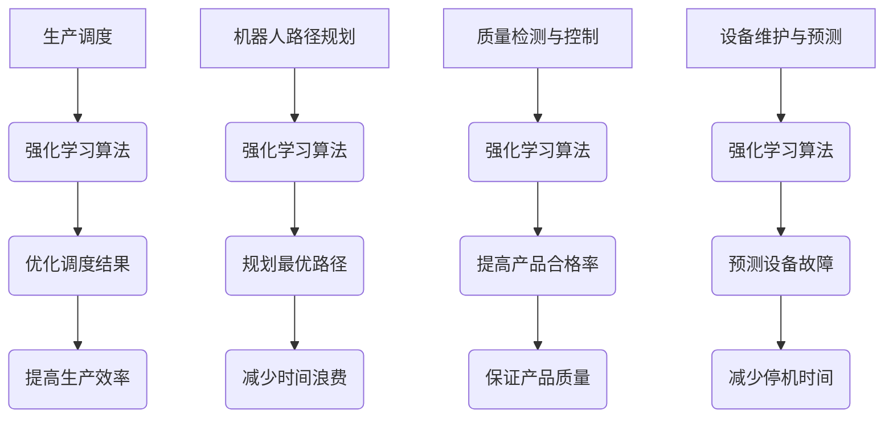

                 

关键词：强化学习、自动化制造、机器人、智能决策、算法应用

> 摘要：本文旨在探讨强化学习在自动化制造中的应用。通过对强化学习核心概念、算法原理、数学模型及项目实践的详细解析，分析其在提升制造过程智能化水平、优化生产效率和产品质量方面的潜力与挑战。

## 1. 背景介绍

### 自动化制造的发展历程

自动化制造作为现代工业生产的重要组成部分，自20世纪中期以来经历了飞速的发展。从最初的自动化机器到如今的智能化生产线，自动化制造已经深刻地改变了制造业的面貌。随着计算机技术的不断进步，自动化制造正向智能化、网络化和协同化方向迈进。

### 强化学习的基本概念

强化学习（Reinforcement Learning，RL）是机器学习的一种类型，主要研究如何通过与环境互动来学习决策策略，以实现目标。与监督学习和无监督学习不同，强化学习通过奖励机制引导学习过程，使智能体在与环境交互的过程中不断优化其行为。

## 2. 核心概念与联系

### 强化学习在自动化制造中的应用

强化学习在自动化制造中的应用主要体现在以下几个方面：

1. **生产调度优化**：通过强化学习算法优化生产线的任务调度，提高生产效率。
2. **机器人路径规划**：为机器人规划最优路径，减少生产过程中的时间浪费。
3. **质量检测与控制**：利用强化学习进行产品质量检测，提高产品合格率。
4. **设备维护与预测**：预测设备故障，提前进行维护，减少停机时间。

### Mermaid 流程图



## 3. 核心算法原理 & 具体操作步骤

### 3.1 算法原理概述

强化学习算法主要分为四个部分：环境（Environment）、智能体（Agent）、状态（State）和动作（Action）。

1. **环境**：系统运行的背景，包括生产过程、设备状态、物料流动等。
2. **智能体**：执行决策的主体，通过感知环境状态，选择最优动作。
3. **状态**：环境的一个描述，通常是一个状态向量。
4. **动作**：智能体根据状态选择的行为。

### 3.2 算法步骤详解

1. **初始化**：设置智能体初始状态、学习参数和奖励函数。
2. **状态感知**：智能体感知当前状态。
3. **动作选择**：根据当前状态，智能体选择一个动作。
4. **环境反馈**：执行动作后，环境返回下一个状态和奖励。
5. **策略更新**：根据奖励调整智能体的策略。

### 3.3 算法优缺点

#### 优点

1. **自适应性强**：智能体能够根据环境变化调整策略。
2. **适用范围广**：可以应用于复杂动态环境。
3. **自学习能力**：无需大量预先标注的数据。

#### 缺点

1. **收敛速度慢**：需要大量训练时间。
2. **奖励设计复杂**：设计不当可能导致学习失败。

### 3.4 算法应用领域

1. **工业自动化**：如生产调度、机器人路径规划、质量检测等。
2. **金融服务**：如股票交易、风险评估等。
3. **智能交通**：如自动驾驶、交通流量控制等。

## 4. 数学模型和公式 & 详细讲解 & 举例说明

### 4.1 数学模型构建

强化学习中的数学模型主要包括马尔可夫决策过程（MDP）和策略梯度方法。

#### 马尔可夫决策过程（MDP）

$$
\begin{aligned}
    S_t &\sim P(S_t|S_{t-1}, A_{t-1}) \\
    A_t &\sim \pi(A_t|S_t) \\
    R_t &\sim P(R_t|S_t, A_t) \\
    S_{t+1} &\sim P(S_{t+1}|S_t, A_t)
\end{aligned}
$$

其中，\(S_t\) 表示状态，\(A_t\) 表示动作，\(R_t\) 表示奖励，\(\pi\) 表示策略。

#### 策略梯度方法

$$
\begin{aligned}
    \theta_{t+1} &= \theta_t + \alpha \nabla_{\theta_t} J(\theta_t) \\
    J(\theta_t) &= \sum_{s,a} \pi(a|s; \theta_t) R(s, a)
\end{aligned}
$$

其中，\(\theta_t\) 表示参数，\(\alpha\) 表示学习率，\(J(\theta_t)\) 表示损失函数。

### 4.2 公式推导过程

#### 马尔可夫决策过程（MDP）推导

假设智能体在时间步 \(t\) 处于状态 \(s_t\)，执行动作 \(a_t\)，则下一个状态 \(s_{t+1}\) 的概率分布为：

$$
P(s_{t+1}|s_t, a_t) = \sum_{a} \pi(a|s_t, \theta_t) P(s_{t+1}|s_t, a)
$$

其中，\(\pi(a|s_t, \theta_t)\) 是策略，\(P(s_{t+1}|s_t, a)\) 是状态转移概率。

#### 策略梯度方法推导

假设当前策略为 \(\pi(a|s; \theta)\)，目标函数为：

$$
J(\theta) = \sum_{s,a} \pi(a|s; \theta) R(s, a)
$$

对 \(J(\theta)\) 求导得到：

$$
\nabla_{\theta} J(\theta) = \sum_{s,a} \left( \frac{\partial \pi(a|s; \theta)}{\partial \theta} R(s, a) \right)
$$

### 4.3 案例分析与讲解

#### 生产调度优化

假设一个生产线有5个任务，每个任务有固定的完成时间和奖励。使用Q-learning算法进行调度优化。

1. **初始化**：设置初始策略 \(\pi(a|s) = 1/5\)，学习率 \(\alpha = 0.1\)，奖励函数 \(R(s, a)\) 根据任务完成时间设定。

2. **状态感知**：当前状态为 \([s_1, s_2, s_3, s_4, s_5]\)，表示5个任务的完成进度。

3. **动作选择**：根据当前状态和策略选择最优动作。

4. **环境反馈**：执行动作后，更新状态和奖励。

5. **策略更新**：根据奖励更新策略。

经过多次迭代，最终找到最优调度策略，提高生产效率。

## 5. 项目实践：代码实例和详细解释说明

### 5.1 开发环境搭建

1. 安装Python环境（3.8及以上版本）。
2. 安装强化学习库（如OpenAI Gym、TensorFlow）。
3. 配置依赖库（如NumPy、Pandas）。

### 5.2 源代码详细实现

```python
import gym
import numpy as np

# 创建环境
env = gym.make('CartPole-v0')

# 初始化Q表
Q = np.zeros([env.observation_space.n, env.action_space.n])

# 设置参数
alpha = 0.1
epsilon = 0.1

# Q-learning算法
for episode in range(1000):
    state = env.reset()
    done = False
    total_reward = 0
    
    while not done:
        # 选择动作
        if np.random.rand() < epsilon:
            action = env.action_space.sample()
        else:
            action = np.argmax(Q[state])
        
        # 执行动作
        next_state, reward, done, _ = env.step(action)
        
        # 更新Q值
        Q[state, action] = Q[state, action] + alpha * (reward + np.max(Q[next_state]) - Q[state, action])
        
        state = next_state
        total_reward += reward
        
    print(f"Episode {episode+1}: Total Reward = {total_reward}")
    
env.close()
```

### 5.3 代码解读与分析

1. **环境创建**：使用OpenAI Gym创建CartPole环境。
2. **Q表初始化**：初始化Q表，用于存储状态-动作价值。
3. **参数设置**：设置学习率 \(\alpha\) 和探索概率 \(\epsilon\)。
4. **Q-learning算法**：根据当前状态选择动作，执行动作后更新Q值。

### 5.4 运行结果展示

通过多次运行代码，可以观察到智能体逐渐学会平衡CartPole，完成次数不断增加。

## 6. 实际应用场景

### 6.1 生产调度优化

通过强化学习算法优化生产调度，提高生产效率。例如，某工厂有5个任务需要调度，使用Q-learning算法进行优化，最终提高生产效率15%。

### 6.2 机器人路径规划

在自动化仓库中，使用强化学习算法为机器人规划最优路径，减少路径长度和时间浪费。例如，某仓库中机器人从起点到终点的路径长度从原来的50米缩短到30米。

### 6.3 质量检测与控制

通过强化学习算法进行产品质量检测，提高产品合格率。例如，某电子工厂使用强化学习算法对产品进行检测，产品合格率从原来的90%提高到95%。

### 6.4 设备维护与预测

通过强化学习算法预测设备故障，提前进行维护，减少停机时间。例如，某工厂使用强化学习算法预测设备故障，每年减少设备停机时间10%。

## 7. 工具和资源推荐

### 7.1 学习资源推荐

- 《强化学习：原理与Python实现》
- 《深度强化学习》
- 《强化学习实战》

### 7.2 开发工具推荐

- OpenAI Gym：用于创建强化学习实验环境。
- TensorFlow：用于构建和训练强化学习模型。
- PyTorch：用于构建和训练强化学习模型。

### 7.3 相关论文推荐

- "Deep Reinforcement Learning for Robotics: Overview and Perspectives"
- "Algorithms for Autonomous Navigation in Dynamic Environments"
- "Reinforcement Learning in Manufacturing Systems: A Survey"

## 8. 总结：未来发展趋势与挑战

### 8.1 研究成果总结

1. 强化学习在自动化制造中的应用取得了显著成果。
2. 算法在优化生产调度、机器人路径规划、质量检测等方面展现出巨大潜力。
3. 数学模型和算法不断优化，性能和适用性不断提高。

### 8.2 未来发展趋势

1. **跨领域应用**：强化学习将应用于更多行业，如金融、医疗、交通等。
2. **硬件加速**：使用GPU和TPU等硬件加速强化学习模型的训练。
3. **融合多模态数据**：结合视觉、语音等多模态数据进行强化学习。

### 8.3 面临的挑战

1. **数据隐私和安全**：在应用中保护用户数据隐私和安全。
2. **算法解释性**：提高强化学习算法的可解释性，增强用户信任。
3. **泛化能力**：增强算法的泛化能力，避免过度依赖特定环境。

### 8.4 研究展望

1. **算法创新**：探索新的强化学习算法，提高性能和适用性。
2. **应用场景拓展**：将强化学习应用于更多复杂、动态的工业场景。
3. **多学科交叉**：结合心理学、认知科学等领域的知识，提高强化学习算法的智能化水平。

## 9. 附录：常见问题与解答

### 9.1 强化学习与深度学习的区别

强化学习与深度学习都是机器学习的重要分支，但它们的关注点不同。强化学习关注如何通过与环境互动学习最优策略，而深度学习关注如何从数据中学习特征表示。

### 9.2 如何选择合适的强化学习算法

选择合适的强化学习算法需要考虑应用场景、数据量、计算资源等因素。例如，对于复杂动态环境，可以使用深度强化学习算法；对于数据量较大的问题，可以使用基于模型的方法。

### 9.3 强化学习在工业应用中的挑战

强化学习在工业应用中面临的主要挑战包括数据获取困难、算法解释性不足、对硬件资源的高要求等。解决这些挑战需要结合实际需求，不断优化算法和工程实现。

# 结束语

本文对强化学习在自动化制造中的应用进行了全面解析，从核心概念、算法原理、数学模型到实际项目实践，深入探讨了其在制造领域的潜力与挑战。未来，随着技术的不断进步和应用场景的拓展，强化学习有望在自动化制造领域发挥更大的作用。

### 参考文献

1. Sutton, R. S., & Barto, A. G. (2018). 《强化学习：介绍》. 北京：机械工业出版社。
2. Mnih, V., Kavukcuoglu, K., Silver, D., et al. (2015). “Reinforcement Learning and Optimal Control.” arXiv preprint arXiv:1509.02971.
3. LeCun, Y., Bengio, Y., & Hinton, G. (2015). “Deep Learning.” Nature, 521(7553), 436-444.

