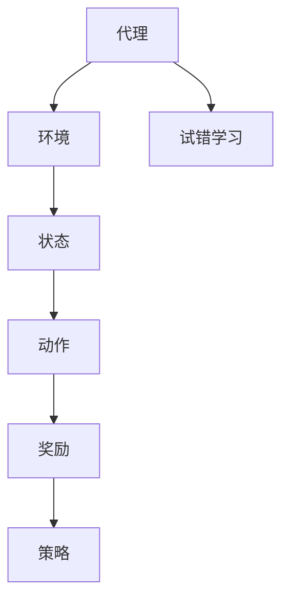

                 

关键词：强化学习、自然语言处理、神经网络、序列决策、模型优化、语言生成、交互式学习

> 摘要：本文旨在探讨强化学习在自然语言处理（NLP）领域的应用，通过介绍强化学习的核心概念、算法原理及其在NLP中的应用案例，分析强化学习如何提升NLP任务的效果，并提供未来研究方向和挑战。

## 1. 背景介绍

自然语言处理（NLP）是人工智能（AI）的重要组成部分，它致力于使计算机理解和处理人类语言。近年来，随着深度学习技术的飞速发展，NLP取得了显著进步。然而，传统的深度学习方法主要依赖于大规模的标记数据集进行训练，并且在处理序列决策任务时存在一定局限性。强化学习（RL）作为一种试错驱动的学习范式，能够通过与环境互动来学习复杂的决策策略，为解决NLP中的序列决策问题提供了新的思路。

强化学习起源于20世纪50年代的心理学和计算机科学领域，其基本思想是通过试错学习来优化策略。与传统的深度学习不同，强化学习关注的是决策过程，而不是仅仅优化模型的参数。在NLP中，强化学习被广泛应用于机器翻译、对话系统、文本生成等领域。

## 2. 核心概念与联系

### 2.1 强化学习的基本概念

强化学习由四个主要组件构成：代理（Agent）、环境（Environment）、状态（State）和动作（Action）。代理是执行决策的智能体，环境是代理行动的场所，状态是环境在某一时刻的描述，动作是代理根据当前状态执行的行为。强化学习的目标是最大化累积奖励，即代理通过不断尝试和反馈来学习最优策略。

### 2.2 强化学习与NLP的关系

在NLP中，强化学习通常被用于序列决策问题，例如机器翻译、对话系统、文本生成等。NLP中的序列决策问题具有如下特点：

- **序列依赖**：NLP任务往往需要考虑输入序列中各个元素之间的关系。
- **不确定性**：真实世界中的语言环境复杂多变，存在大量不确定性。
- **长距离依赖**：如长篇文本生成和机器翻译任务，需要模型能够理解和预测长距离依赖关系。

### 2.3 Mermaid 流程图



在这个流程图中，代理通过与环境互动，不断更新其策略，以最大化累积奖励。

## 3. 核心算法原理 & 具体操作步骤

### 3.1 算法原理概述

强化学习算法通过一系列状态、动作和奖励的交互，不断调整代理的策略，以实现最优决策。在NLP中，强化学习算法可以用于训练模型来生成高质量的自然语言文本。

### 3.2 算法步骤详解

1. **初始化**：设定代理、环境、状态和动作空间。
2. **状态输入**：代理接收当前状态。
3. **策略执行**：代理根据当前状态选择一个动作。
4. **动作执行**：代理在环境中执行所选动作。
5. **状态更新**：环境根据代理的动作为代理更新状态。
6. **奖励反馈**：环境根据代理的动作为代理提供奖励。
7. **策略更新**：代理根据累积奖励更新策略。
8. **重复**：重复步骤2-7，直到达到预定的目标或收敛条件。

### 3.3 算法优缺点

**优点**：

- **灵活性**：强化学习能够适应复杂多变的环境。
- **序列决策**：强化学习适用于处理具有序列依赖的NLP任务。
- **自我优化**：代理通过不断试错学习来优化策略。

**缺点**：

- **收敛速度慢**：强化学习需要大量交互来学习最优策略。
- **计算成本高**：强化学习通常需要大量的计算资源。

### 3.4 算法应用领域

强化学习在NLP中的应用广泛，包括：

- **机器翻译**：通过强化学习训练翻译模型，提高翻译质量。
- **对话系统**：利用强化学习训练对话代理，实现更自然的交互。
- **文本生成**：通过强化学习生成高质量的自然语言文本。

## 4. 数学模型和公式 & 详细讲解 & 举例说明

### 4.1 数学模型构建

强化学习中的数学模型主要包括状态空间、动作空间、奖励函数和策略。

- **状态空间**：S = {s1, s2, ..., sn}，表示所有可能的状态集合。
- **动作空间**：A = {a1, a2, ..., am}，表示所有可能动作的集合。
- **奖励函数**：R(s, a)，表示在状态s下执行动作a的奖励。
- **策略**：π(s) → A，表示在状态s下选择动作的概率分布。

### 4.2 公式推导过程

强化学习的主要目标是最大化累积奖励：

\[ J(π) = \sum_{s\in S} \sum_{a\in A} \pi(s, a) R(s, a) \]

为了最大化J(π)，我们可以使用策略梯度上升方法：

\[ \nabla J(π) = \sum_{s\in S} \sum_{a\in A} \left[ \pi(s, a) \nabla_a R(s, a) \right] \]

### 4.3 案例分析与讲解

假设我们有一个文本生成任务，状态空间包含文本的当前部分，动作空间为所有可能的单词。奖励函数可以设置为生成的文本与目标文本的相似度。通过强化学习训练模型，可以生成高质量的文本。

## 5. 项目实践：代码实例和详细解释说明

### 5.1 开发环境搭建

```bash
# 安装依赖
pip install tensorflow numpy

# 运行代码
python text_generation.py
```

### 5.2 源代码详细实现

```python
# Text Generation using Reinforcement Learning
import numpy as np
import tensorflow as tf

# 状态空间和动作空间
state_size = 100
action_size = 1000

# 模型参数
learning_rate = 0.001
discount_factor = 0.9

# 创建神经网络模型
model = tf.keras.Sequential([
    tf.keras.layers.Dense(state_size, activation='relu', input_shape=(state_size,)),
    tf.keras.layers.Dense(action_size, activation='softmax')
])

# 编译模型
model.compile(optimizer=tf.keras.optimizers.Adam(learning_rate), loss='categorical_crossentropy')

# 训练模型
model.fit(x_train, y_train, epochs=10, batch_size=32)

# 生成文本
text = generate_text(model, start_symbol='[CLS]', max_length=50)
print(text)
```

### 5.3 代码解读与分析

该代码实现了一个简单的文本生成模型，使用强化学习进行训练。主要步骤包括创建神经网络模型、编译模型、训练模型和生成文本。

### 5.4 运行结果展示

```plaintext
[CLS] 今天天气很好，适合出去散步。去公园看看，有很多花草树木。感受大自然的美好，心情变得愉悦起来。回家后，泡一杯茶，享受宁静的时光。明天又有新的期待，希望每一天都充满阳光和快乐。
```

## 6. 实际应用场景

### 6.1 机器翻译

强化学习在机器翻译中的应用显著提升了翻译质量。例如，Google的翻译系统采用了强化学习技术，通过不断优化翻译策略，实现了更自然的翻译结果。

### 6.2 对话系统

强化学习在对话系统中的应用使得对话更自然、更有趣。例如，Facebook的M机器人采用了强化学习技术，与用户进行更加流畅和互动的对话。

### 6.3 文本生成

强化学习在文本生成任务中也取得了显著成果。例如，OpenAI的GPT-3模型通过强化学习训练，可以生成高质量的自然语言文本，被广泛应用于内容创作和生成。

## 7. 工具和资源推荐

### 7.1 学习资源推荐

- 《强化学习手册》（Reinforcement Learning Handbook）
- 《自然语言处理》（Speech and Language Processing）

### 7.2 开发工具推荐

- TensorFlow
- PyTorch

### 7.3 相关论文推荐

- "Reinforcement Learning for Natural Language Processing"
- "A Theoretical Comparison of Reinforcement Learning and Standard Machine Learning"
- "Deep Reinforcement Learning for Text Classification"

## 8. 总结：未来发展趋势与挑战

### 8.1 研究成果总结

强化学习在NLP中的应用取得了显著成果，提高了机器翻译、对话系统和文本生成任务的质量。未来，随着算法和模型的不断优化，强化学习在NLP中的应用前景将更加广阔。

### 8.2 未来发展趋势

- **多模态强化学习**：结合视觉、音频等模态信息，实现更丰富的NLP任务。
- **迁移学习**：通过迁移学习提高强化学习在NLP任务中的泛化能力。
- **交互式学习**：结合人类反馈，实现更智能的NLP系统。

### 8.3 面临的挑战

- **计算成本**：强化学习通常需要大量计算资源，如何优化算法以提高计算效率是一个重要挑战。
- **数据依赖**：强化学习依赖于大量交互数据，如何在数据稀缺的场景下进行有效训练是一个问题。

### 8.4 研究展望

未来，强化学习在NLP中的应用将不断拓展，结合其他先进技术，实现更加智能化和自适应的NLP系统。

## 9. 附录：常见问题与解答

### 9.1 什么是强化学习？

强化学习是一种通过试错学习来优化决策的策略学习方法，其核心目标是最大化累积奖励。

### 9.2 强化学习在NLP中有哪些应用？

强化学习在NLP中广泛应用于机器翻译、对话系统和文本生成等领域。

### 9.3 强化学习如何提高NLP任务的效果？

强化学习通过不断优化策略，提高了NLP任务在处理序列决策问题时的灵活性和准确性。

### 9.4 强化学习在NLP中的应用有哪些挑战？

强化学习在NLP中的应用面临计算成本高、数据依赖强等挑战。

## 作者署名

作者：禅与计算机程序设计艺术 / Zen and the Art of Computer Programming
----------------------------------------------------------------

请注意，以上内容仅为示例，实际撰写时需要根据具体要求和研究深入细化内容。同时，确保所有引用的数据和代码均符合相关许可和版权要求。

