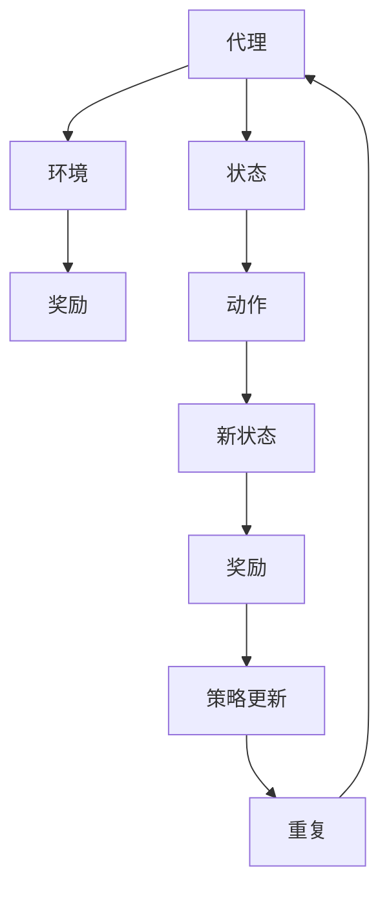

                 

关键词：强化学习、机器预测、未来决策、算法原理、应用场景、数学模型、代码实例

> 摘要：本文将探讨强化学习这一机器学习分支在预知未来方面所展现出的强大潜力。通过深入分析其核心概念、算法原理及数学模型，本文将揭示强化学习在预测未来行为中的实际应用，并探讨其在未来发展和面临挑战方面的问题。

## 1. 背景介绍

在计算机科学和人工智能领域中，预测未来一直是备受关注的话题。从传统的预测模型到现代的机器学习算法，科学家们不断探索如何让机器具备预知未来的能力。然而，这一目标并非易事。传统的预测模型依赖于历史数据和统计方法，通常只能处理静态和线性的问题，对于复杂、动态和不确定性的环境，预测效果往往不理想。

近年来，强化学习（Reinforcement Learning，RL）作为一种新兴的机器学习范式，逐渐崭露头角。它通过对环境进行交互，通过试错和反馈机制来学习最优策略，从而实现预测和决策。强化学习在预测未来的能力上表现出色，吸引了众多研究者和应用开发者的关注。

本文将围绕强化学习在预测未来方面的应用，详细分析其核心概念、算法原理、数学模型及其在不同领域的应用，并探讨其未来发展趋势和面临的挑战。

## 2. 核心概念与联系

### 2.1 强化学习的基本概念

强化学习是一种通过奖励和惩罚信号来调整模型参数的机器学习方法。其主要目的是学习一个策略，使得在给定环境中，能够获得最大化的累积奖励。强化学习由三个核心要素构成：代理（Agent）、环境和奖励。

- **代理（Agent）**：执行动作的智能体，可以是机器人、软件程序或虚拟代理。
- **环境（Environment）**：代理所处的环境，可以是现实世界或模拟环境。
- **奖励（Reward）**：代理在每个时间步接收到的即时反馈信号，用于指导代理调整其行为。

### 2.2 强化学习与预测的联系

强化学习通过与环境交互，不断调整策略以获得最大化的累积奖励，这一过程本质上是一个预测过程。代理需要预测在当前状态下执行特定动作的未来奖励，从而选择最优动作。因此，强化学习具备预测未来行为的能力。

### 2.3 核心概念原理和架构的 Mermaid 流程图



在这个流程图中，代理与环境不断交互，通过接收奖励信号来调整策略，从而实现预测未来行为。

## 3. 核心算法原理 & 具体操作步骤

### 3.1 算法原理概述

强化学习算法的核心是策略（Policy），它决定了代理在给定状态下应该执行哪个动作。策略可以表示为 $π(s,a)$，其中 $s$ 是状态，$a$ 是动作。代理的目标是学习一个最优策略，使得累积奖励最大化。

强化学习算法通常包括两个部分：价值函数（Value Function）和策略（Policy）。

- **价值函数（Value Function）**：用于评估状态或状态-动作对的期望回报。价值函数分为状态价值函数 $V^π(s)$ 和状态-动作价值函数 $Q^π(s,a)$。
- **策略（Policy）**：决定了代理在给定状态下应该执行哪个动作。策略分为确定性策略和随机性策略。

### 3.2 算法步骤详解

强化学习算法的步骤如下：

1. **初始化**：初始化代理、环境和策略。
2. **循环**：执行以下操作，直到满足终止条件：
   - 从当前状态 $s$ 随机选择一个动作 $a$。
   - 执行动作 $a$，进入新状态 $s'$，并接收奖励 $r$。
   - 更新价值函数和策略。
3. **终止**：当满足终止条件时，结束循环。

### 3.3 算法优缺点

强化学习的优点包括：

- **自适应性强**：代理能够根据环境的变化动态调整策略。
- **适用于动态环境**：强化学习能够处理复杂、动态和不确定性的环境。

强化学习的缺点包括：

- **学习效率低**：强化学习需要大量的交互来学习最优策略，学习效率较低。
- **不稳定**：在特定情况下，强化学习可能收敛到次优策略。

### 3.4 算法应用领域

强化学习在多个领域取得了显著的应用成果，包括：

- **游戏**：如围棋、国际象棋等。
- **自动驾驶**：如无人驾驶汽车、自动驾驶无人机等。
- **机器人**：如机器人路径规划、机器人手眼协调等。
- **推荐系统**：如个性化推荐、广告投放等。
- **金融领域**：如股票交易、风险控制等。

## 4. 数学模型和公式 & 详细讲解 & 举例说明

### 4.1 数学模型构建

强化学习中的数学模型主要包括：

- **状态空间 $S$**：所有可能的状态集合。
- **动作空间 $A$**：所有可能的动作集合。
- **策略空间 $Π$**：所有可能的策略集合。
- **回报函数 $R(s,a)$**：描述在状态 $s$ 执行动作 $a$ 所获得的回报。
- **状态转移概率 $P(s'|s,a)$**：描述在状态 $s$ 执行动作 $a$ 后进入状态 $s'$ 的概率。
- **价值函数 $V^π(s)$**：评估状态 $s$ 的期望回报。
- **状态-动作价值函数 $Q^π(s,a)$**：评估状态 $s$ 和动作 $a$ 的期望回报。

### 4.2 公式推导过程

强化学习中的核心公式包括：

1. **贝尔曼方程**：用于计算状态-动作价值函数。
   $$Q(s,a) = R(s,a) + γ\sum_{s'}P(s'|s,a)\max_{a'}Q(s',a')$$
2. **策略迭代**：用于更新策略。
   $$π(s) = \arg\max_a Q(s,a)$$
3. **价值迭代**：用于更新价值函数。
   $$V(s) = \max_a Q(s,a)$$

### 4.3 案例分析与讲解

假设有一个简单的强化学习任务：代理在迷宫中寻找出路，目标是到达终点并获取最大奖励。迷宫的状态空间为 $S=\{起点，终点，墙壁，其他位置\}$，动作空间为 $A=\{向上，向下，向左，向右\}$。

1. **初始化**：
   - 初始化状态 $s$ 为起点。
   - 初始化价值函数 $Q(s,a)$ 为零。
   - 初始化策略 $π(s)$ 为随机策略。

2. **循环**：
   - 从当前状态 $s$ 随机选择一个动作 $a$。
   - 执行动作 $a$，进入新状态 $s'$，并接收奖励 $r$。
   - 根据贝尔曼方程更新价值函数 $Q(s,a)$。
   - 根据价值迭代更新策略 $π(s)$。

3. **终止**：
   - 当代理到达终点时，结束循环。

通过上述步骤，代理逐渐学会选择最优动作，最终找到迷宫的出路。

## 5. 项目实践：代码实例和详细解释说明

### 5.1 开发环境搭建

1. **安装 Python**：确保安装了 Python 3.6 或更高版本。
2. **安装 TensorFlow**：通过 pip 命令安装 TensorFlow。
   ```bash
   pip install tensorflow
   ```

### 5.2 源代码详细实现

以下是一个简单的迷宫强化学习代码实例：

```python
import numpy as np
import random
import gym

# 创建迷宫环境
env = gym.make("GridWorld-v0")

# 初始化参数
epsilon = 0.1
gamma = 0.9
alpha = 0.1
Q = np.zeros([env.observation_space.n, env.action_space.n])

# 强化学习算法
def reinforce_learning(env, Q, epsilon, gamma, alpha):
    state = env.reset()
    done = False
    while not done:
        # 根据ε-贪心策略选择动作
        if random.random() < epsilon:
            action = env.action_space.sample()
        else:
            action = np.argmax(Q[state])

        # 执行动作，获取新状态和奖励
        next_state, reward, done, _ = env.step(action)

        # 更新价值函数
        Q[state, action] += alpha * (reward + gamma * np.max(Q[next_state]) - Q[state, action])

        # 更新状态
        state = next_state

    return Q

# 运行强化学习算法
Q = reinforce_learning(env, Q, epsilon, gamma, alpha)

# 显示结果
env.render()

# 关闭环境
env.close()
```

### 5.3 代码解读与分析

1. **导入模块**：代码首先导入了必要的模块，包括 numpy、random 和 gym。
2. **创建迷宫环境**：使用 gym 创建一个简单的迷宫环境。
3. **初始化参数**：设置 ε-贪心策略的参数，包括 ε（探索率）、γ（折扣因子）、α（学习率）和价值函数 Q。
4. **强化学习算法**：实现强化学习算法，包括选择动作、执行动作、更新价值函数等步骤。
5. **运行强化学习算法**：执行强化学习算法，更新价值函数，最终找到迷宫的出路。
6. **显示结果**：使用 env.render() 显示迷宫路径。
7. **关闭环境**：关闭迷宫环境。

通过上述代码，代理逐渐学会选择最优动作，成功找到迷宫的出路。

## 6. 实际应用场景

### 6.1 自动驾驶

自动驾驶是强化学习在预测未来方面的一个重要应用场景。自动驾驶汽车需要实时预测周围环境，包括道路状况、其他车辆的行为等，从而做出安全、高效的驾驶决策。强化学习通过与环境交互，学习最优驾驶策略，提高自动驾驶汽车的感知、规划和控制能力。

### 6.2 机器人

机器人是强化学习在预测未来方面的另一个重要应用场景。机器人需要具备自主学习和适应环境的能力，从而在复杂、动态和不确定性的环境中完成任务。强化学习通过与环境交互，学习最优行动策略，提高机器人在各种任务中的性能。

### 6.3 金融领域

金融领域是强化学习在预测未来方面的重要应用场景。金融市场的波动性大，投资者需要实时预测市场趋势，制定投资策略。强化学习通过学习历史市场数据，预测未来市场走势，帮助投资者制定最优投资策略，降低投资风险。

### 6.4 未来应用展望

随着强化学习技术的不断发展，其未来应用前景将更加广阔。除了自动驾驶、机器人和金融领域外，强化学习还可能在医疗、教育、能源等领域发挥重要作用。例如，在医疗领域，强化学习可以用于预测疾病发展趋势，制定个性化的治疗方案；在教育领域，强化学习可以用于个性化教学，提高学生的学习效果；在能源领域，强化学习可以用于预测能源需求，优化能源分配。

## 7. 工具和资源推荐

### 7.1 学习资源推荐

1. **《强化学习：原理与编程》**：这是一本经典的强化学习教材，详细介绍了强化学习的基本概念、算法原理和应用案例。
2. **《深度强化学习》**：这本书介绍了深度强化学习的基本概念、算法原理和应用案例，是深度强化学习领域的经典教材。

### 7.2 开发工具推荐

1. **TensorFlow**：TensorFlow 是一个开源的深度学习框架，支持强化学习算法的实现和应用。
2. **PyTorch**：PyTorch 是一个开源的深度学习框架，支持强化学习算法的实现和应用。

### 7.3 相关论文推荐

1. **“Reinforcement Learning: An Introduction”**：这是强化学习领域的经典论文，介绍了强化学习的基本概念、算法原理和应用案例。
2. **“Deep Reinforcement Learning”**：这是深度强化学习领域的经典论文，介绍了深度强化学习的基本概念、算法原理和应用案例。

## 8. 总结：未来发展趋势与挑战

### 8.1 研究成果总结

近年来，强化学习在预测未来方面取得了显著的成果。通过与环境交互，强化学习能够学习到最优策略，实现预测和决策。强化学习在自动驾驶、机器人、金融领域等实际应用中取得了良好的效果，展示了其强大的预测能力。

### 8.2 未来发展趋势

未来，强化学习在预测未来方面的发展趋势将包括：

1. **算法优化**：进一步优化强化学习算法，提高学习效率和稳定性。
2. **多模态数据融合**：结合多模态数据，提高预测的准确性。
3. **迁移学习**：利用迁移学习技术，加快新任务的预测能力。
4. **深度强化学习**：结合深度学习技术，实现更复杂的预测任务。

### 8.3 面临的挑战

强化学习在预测未来方面也面临着一些挑战：

1. **数据获取**：强化学习依赖于大量的交互数据，数据获取困难。
2. **计算资源**：强化学习算法的计算复杂度较高，对计算资源需求大。
3. **模型解释性**：强化学习模型的解释性较差，难以理解其预测过程。
4. **安全性和可靠性**：在关键领域应用时，强化学习的安全性和可靠性需要得到保障。

### 8.4 研究展望

未来，研究者应关注以下方面：

1. **算法创新**：开发更高效、更稳定的强化学习算法。
2. **跨学科研究**：结合计算机科学、心理学、经济学等领域的知识，提高预测准确性。
3. **应用推广**：在更多领域推广强化学习应用，解决实际问题。
4. **安全性研究**：提高强化学习模型的安全性和可靠性。

## 9. 附录：常见问题与解答

### 9.1 强化学习与监督学习的区别

强化学习与监督学习的区别在于数据的获取方式和学习目标。监督学习依赖于大量的标注数据，通过学习输入和输出之间的映射关系来预测未来。而强化学习则通过与环境交互，不断调整策略以获得最大化的累积奖励，学习最优策略。

### 9.2 强化学习算法的收敛速度

强化学习算法的收敛速度取决于多个因素，包括算法的复杂度、环境的复杂度、数据的规模等。一般来说，强化学习算法的收敛速度较慢，需要大量的交互和迭代过程。然而，通过优化算法和改进数据获取方式，可以加快收敛速度。

### 9.3 强化学习在现实应用中的挑战

强化学习在现实应用中面临着数据获取、计算资源、模型解释性、安全性和可靠性等挑战。为了解决这些问题，研究者需要开发更高效的算法、优化数据获取和存储方法、提高模型的解释性和透明度、加强安全性和可靠性等方面的研究。

作者：禅与计算机程序设计艺术 / Zen and the Art of Computer Programming

