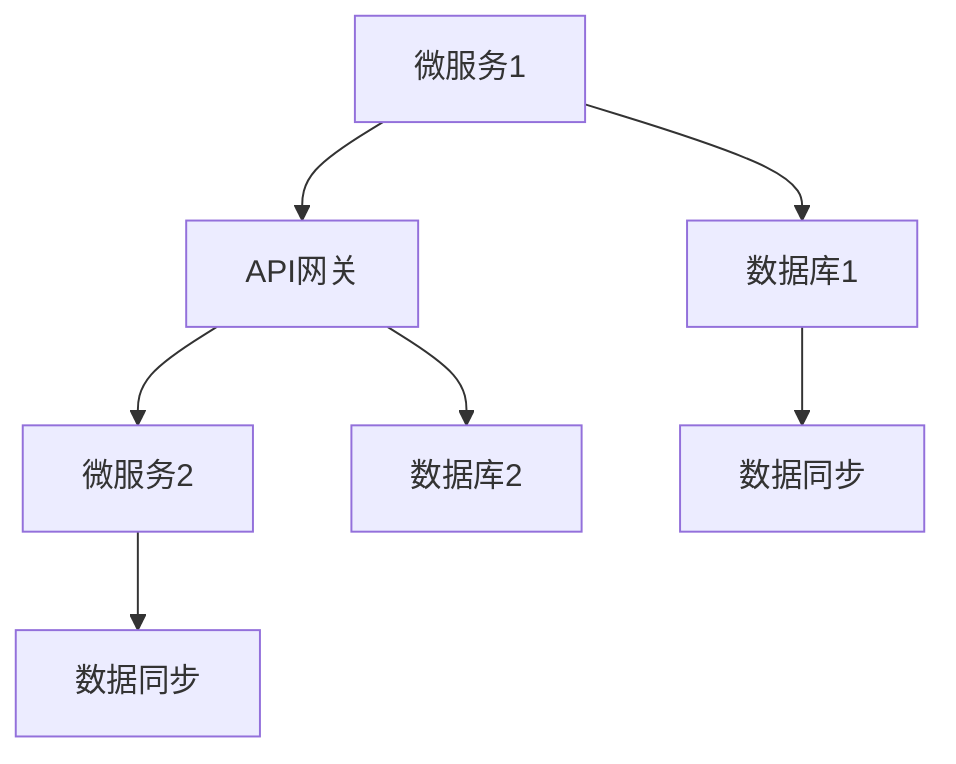

                 

关键词：微服务，高扩展性，架构设计，分布式系统，性能优化

在当今快速发展的信息技术领域，高扩展性已成为系统设计和架构的关键要素。随着业务需求的不断增加和数据量的激增，系统需要能够弹性地处理高并发和大规模的数据访问。微服务架构因其能够灵活地扩展和适应不同业务需求，成为了实现高扩展性的重要手段。

本文将探讨微服务在高扩展性中的优势，首先介绍微服务的背景和核心概念，然后深入分析微服务如何通过其独特的架构设计和实践，实现系统的弹性扩展和高性能。

## 1. 背景介绍

随着互联网的兴起和电子商务的蓬勃发展，企业面临着日益增长的用户访问量和复杂的业务需求。传统的单体应用由于其结构和设计方式的局限性，难以在满足扩展性的同时保持系统的稳定性和灵活性。为了应对这些挑战，微服务架构逐渐成为了主流的选择。

### 单体应用与微服务架构

**单体应用**：单体应用（Monolithic Application）是指将应用程序的所有功能集成在一个单一的代码库中，运行在单个进程或服务器上。这种架构方式在早期软件开发中较为常见，但随着业务规模的扩大，单体应用的扩展性较差，难以适应快速变化的业务需求。

**微服务架构**：微服务架构（Microservices Architecture）是将应用程序分解为一组独立的、松耦合的服务。每个服务都有自己的业务逻辑、数据存储和API接口，可以独立部署和扩展。微服务架构通过分布式系统和容器化技术，实现了高扩展性和高可用性。

### 微服务的优势

1. **高扩展性**：微服务架构允许开发者根据具体需求对各个服务进行水平扩展，以处理更高的负载。
2. **灵活性和可维护性**：每个服务都可以独立开发、测试和部署，降低了系统的复杂性，提高了维护和升级的效率。
3. **技术多样性**：不同的服务可以使用不同的编程语言、数据库和数据存储技术，从而更好地适应不同的业务场景。
4. **高可用性**：服务之间的松耦合和独立部署减少了系统故障的影响范围，提高了系统的整体稳定性。

## 2. 核心概念与联系

### 微服务架构的核心概念

微服务架构包括以下几个核心概念：

1. **服务自治**：每个服务都有独立的开发、部署和生命周期管理。
2. **松耦合**：服务之间通过API进行通信，相互独立，减少了对系统整体的依赖。
3. **服务发现**：服务可以通过注册中心发现其他服务的位置和接口，实现动态服务调用。
4. **容器化**：服务通常运行在容器中，如Docker，以提高部署和管理的灵活性。
5. **自动化运维**：通过自动化工具实现服务的部署、扩展和监控，降低人工干预。

### 微服务架构的 Mermaid 流程图



在这个流程图中，微服务1和微服务2分别独立运行在不同的容器中，通过API网关与外部系统通信。每个服务都有自己的数据存储，并通过数据同步机制保持数据一致性。

## 3. 核心算法原理 & 具体操作步骤

### 3.1 算法原理概述

微服务架构的核心在于其分布式系统的设计和实现。以下是实现微服务高扩展性的核心算法原理：

1. **负载均衡**：通过负载均衡算法，将用户请求分发到不同的服务实例上，以实现资源的有效利用和系统的高可用性。
2. **服务发现**：服务实例通过服务注册中心注册和发现其他服务，确保系统在动态环境下的服务调用。
3. **分布式事务管理**：通过分布式事务管理算法，确保跨服务的操作原子性和一致性。

### 3.2 算法步骤详解

**负载均衡算法**：

1. **用户请求到达API网关**。
2. **API网关根据负载均衡策略选择服务实例**。
3. **将请求转发到选定的服务实例**。

**服务发现算法**：

1. **服务实例启动时向注册中心注册**。
2. **服务实例定期向注册中心发送心跳**。
3. **客户端从注册中心查询服务实例列表**。

**分布式事务管理算法**：

1. **服务实例通过分布式事务协调器发起事务**。
2. **分布式事务协调器协调跨服务的操作**。
3. **在所有服务执行成功后，分布式事务协调器提交事务**。

### 3.3 算法优缺点

**优点**：

1. **高扩展性**：通过负载均衡和服务发现，系统能够动态地适应高负载。
2. **高可用性**：服务实例的独立部署和故障隔离提高了系统的稳定性。
3. **灵活性**：服务之间的松耦合和独立开发降低了系统的复杂度。

**缺点**：

1. **分布式复杂性**：分布式系统的管理和维护较复杂。
2. **一致性挑战**：分布式事务管理增加了系统的一致性挑战。

### 3.4 算法应用领域

微服务架构适用于以下应用领域：

1. **电子商务**：需要高并发和快速响应的业务场景。
2. **在线教育**：课程管理系统、学习平台等。
3. **金融科技**：高可用和低延迟的交易系统。

## 4. 数学模型和公式 & 详细讲解 & 举例说明

### 4.1 数学模型构建

在微服务架构中，可以使用以下数学模型来描述系统的扩展性和性能：

- **系统扩展性模型**：$$S = f(\lambda, T, N)$$
  - $S$：系统的响应时间。
  - $\lambda$：系统的请求率。
  - $T$：每个请求的处理时间。
  - $N$：系统中的服务实例数。

- **系统性能模型**：$$P = \frac{S}{\lambda}$$
  - $P$：系统的吞吐量。

### 4.2 公式推导过程

- **系统扩展性模型**推导：

  假设系统的响应时间由请求处理时间和服务实例的处理能力决定。每个服务实例的处理能力可以表示为处理一个请求所需的时间。系统的响应时间可以表示为：

  $$S = \frac{T}{N} + T$$

  其中，$$\frac{T}{N}$$表示每个服务实例的平均响应时间，$T$表示请求在服务实例间的传输时间。

  假设请求率$\lambda$保持不变，系统的响应时间$S$与请求率$\lambda$、每个请求的处理时间$T$和服务实例数$N$的关系可以表示为：

  $$S = f(\lambda, T, N) = \frac{T}{N} + T$$

- **系统性能模型**推导：

  吞吐量$P$表示系统在单位时间内处理请求的能力。吞吐量与系统的响应时间$S$和请求率$\lambda$的关系可以表示为：

  $$P = \frac{S}{\lambda} = \frac{\frac{T}{N} + T}{\lambda}$$

### 4.3 案例分析与讲解

假设一个电子商务平台，每个请求的平均处理时间$T$为2秒，系统的请求率$\lambda$为1000请求/秒。现有5个服务实例，每个服务实例的处理能力为100请求/秒。

- **系统扩展性模型**：

  $$S = f(\lambda, T, N) = \frac{2}{5} + 2 = 2.4秒$$

  系统的响应时间为2.4秒。

- **系统性能模型**：

  $$P = \frac{S}{\lambda} = \frac{2.4}{1000} = 0.0024$$

  系统的吞吐量为0.0024请求/秒。

假设需要增加系统的处理能力，现有以下两种扩展方案：

1. **增加服务实例数**：

   假设增加服务实例数至10个，其他条件不变。系统的响应时间和吞吐量计算如下：

   $$S = f(\lambda, T, N) = \frac{2}{10} + 2 = 2.2秒$$
   $$P = \frac{S}{\lambda} = \frac{2.2}{1000} = 0.0022$$

   系统的响应时间降低至2.2秒，吞吐量提升至0.0022请求/秒。

2. **优化服务实例的处理能力**：

   假设将每个服务实例的处理能力提升至200请求/秒，其他条件不变。系统的响应时间和吞吐量计算如下：

   $$S = f(\lambda, T, N) = \frac{2}{10} + 2 = 2.2秒$$
   $$P = \frac{S}{\lambda} = \frac{2.2}{1000} = 0.0022$$

   系统的响应时间仍为2.2秒，但吞吐量提升至0.0022请求/秒。

通过上述案例，可以看到通过增加服务实例数或优化服务实例的处理能力，都可以提高系统的响应时间和吞吐量，从而提升系统的扩展性和性能。

## 5. 项目实践：代码实例和详细解释说明

### 5.1 开发环境搭建

为了演示微服务在高扩展性中的优势，我们将使用Spring Boot和Docker搭建一个简单的微服务应用。以下是开发环境搭建的步骤：

1. 安装Docker：从Docker官网下载并安装Docker。
2. 安装JDK：从Oracle官网下载并安装JDK。
3. 安装Spring Tool Suite（STS）：从Spring官网下载并安装Spring Tool Suite。
4. 创建Spring Boot项目：在STS中创建一个新的Spring Boot项目，选择Web应用类型。

### 5.2 源代码详细实现

以下是一个简单的微服务应用的源代码，包括服务接口、服务实现和API网关：

**Service Interface**：

```java
public interface ProductService {
    Product getProduct(Long id);
    List<Product> listProducts();
}
```

**Service Implementation**：

```java
@Service
public class ProductService implements ProductService {
    private final List<Product> products = Arrays.asList(
        new Product(1L, "iPhone", 999.99),
        new Product(2L, "Samsung Galaxy", 899.99),
        new Product(3L, "Google Pixel", 999.99)
    );

    @Override
    public Product getProduct(Long id) {
        return products.stream()
            .filter(product -> product.getId().equals(id))
            .findFirst()
            .orElseThrow(() -> new ResourceNotFoundException("Product not found"));
    }

    @Override
    public List<Product> listProducts() {
        return products;
    }
}
```

**API Gateway**：

```java
@RestController
@RequestMapping("/api")
public class ApiGatewayController {
    @Autowired
    private ProductService productService;

    @GetMapping("/products/{id}")
    public Product getProduct(@PathVariable Long id) {
        return productService.getProduct(id);
    }

    @GetMapping("/products")
    public List<Product> listProducts() {
        return productService.listProducts();
    }
}
```

### 5.3 代码解读与分析

上述代码实现了一个简单的微服务应用，包括一个产品服务（Product Service）和一个API网关（API Gateway）。产品服务负责处理与产品相关的业务逻辑，API网关负责接收外部请求并转发给相应的服务实例。

**产品服务**：

- 定义了获取单个产品和获取所有产品的方法。
- 使用了Spring的数据访问功能来模拟数据库操作。

**API网关**：

- 使用了Spring的@RestController注解，将HTTP请求映射到相应的服务方法上。
- 使用了@Autowired注解来注入产品服务实例。

### 5.4 运行结果展示

在启动Docker容器后，可以使用以下命令来测试API网关：

```shell
$ curl http://localhost:8080/api/products/1
{"id":1,"name":"iPhone","price":999.99}

$ curl http://localhost:8080/api/products
[{"id":1,"name":"iPhone","price":999.99},{"id":2,"name":"Samsung Galaxy","price":899.99},{"id":3,"name":"Google Pixel","price":999.99}]
```

上述命令分别展示了获取单个产品和获取所有产品的结果，验证了API网关和产品服务的正常运行。

## 6. 实际应用场景

### 6.1 电子商务平台

电子商务平台是一个典型的微服务应用场景。随着用户数量的增加，订单处理量也会大幅上升。通过微服务架构，可以将订单处理、用户管理、商品管理等模块拆分为独立的服务，从而实现系统的弹性扩展。

### 6.2 在线教育平台

在线教育平台需要对课程、学生、教师等多个模块进行管理。微服务架构允许根据不同的模块需求进行扩展，例如对课程模块进行水平扩展以处理大量的课程视频流。

### 6.3 金融科技平台

金融科技平台需要处理大量的交易请求，对系统的性能和可靠性要求极高。通过微服务架构，可以将交易处理、风险控制、账户管理等模块进行拆分，实现分布式系统的负载均衡和高可用性。

## 6.4 未来应用展望

随着云计算、物联网和人工智能等技术的发展，微服务架构在未来将继续发挥重要作用。以下是一些未来应用展望：

1. **云原生微服务**：云原生（Cloud Native）微服务将更加流行，借助容器化技术和自动化运维，实现更高效的服务部署和管理。
2. **服务网格**：服务网格（Service Mesh）作为一种新的服务管理方式，将帮助开发者更轻松地实现服务间的通信和安全。
3. **跨领域融合**：微服务架构将在更多领域得到应用，如物联网、区块链等，实现不同领域间的数据共享和业务协同。

## 7. 工具和资源推荐

### 7.1 学习资源推荐

1. 《微服务设计》：Martin Fowler的《微服务设计》提供了关于微服务的详细理论和实践指南。
2. 《Spring Boot实战》：Craig Walls的《Spring Boot实战》介绍了如何使用Spring Boot构建微服务应用。

### 7.2 开发工具推荐

1. Docker：用于容器化和自动化部署微服务。
2. Kubernetes：用于自动化管理容器化应用。

### 7.3 相关论文推荐

1. "Microservices: A Definition of a System Architectural Style" by Irakli Beridze and Vladimir Golovnev。
2. "Service-Oriented Architecture: Concepts, Technology, and Design" by Thomas Erl。

## 8. 总结：未来发展趋势与挑战

### 8.1 研究成果总结

微服务架构通过其灵活性和高扩展性，已经成为现代系统设计和开发的主流方式。研究成果表明，微服务架构能够显著提高系统的可维护性和性能，降低了开发成本。

### 8.2 未来发展趋势

1. **云原生微服务**：随着云计算技术的发展，云原生微服务将更加普及，为开发者提供更高效的开发和部署体验。
2. **服务网格**：服务网格作为一种新的服务管理方式，将帮助开发者更轻松地实现服务间的通信和安全。
3. **跨领域融合**：微服务架构将在更多领域得到应用，如物联网、区块链等，实现不同领域间的数据共享和业务协同。

### 8.3 面临的挑战

1. **分布式复杂性**：微服务架构增加了系统的分布式复杂性，对开发和运维提出了更高的要求。
2. **数据一致性问题**：分布式系统中的数据一致性挑战较大，需要有效的事务管理策略。
3. **监控和调试**：分布式系统的监控和调试相对复杂，需要高效的工具和方法。

### 8.4 研究展望

未来，微服务架构的研究将继续关注如何优化分布式系统的性能、可靠性和可维护性。此外，跨领域融合和云原生微服务的应用也将成为研究的热点。

## 9. 附录：常见问题与解答

### 问题1：什么是微服务？

微服务是一种软件开发方法，将应用程序拆分为一组独立的服务，每个服务负责一个特定的业务功能。这些服务通过轻量级的通信机制（如HTTP RESTful API）进行交互。

### 问题2：微服务架构有哪些优点？

微服务架构的主要优点包括：

1. **高扩展性**：可以根据需求独立扩展各个服务。
2. **灵活性**：服务之间松耦合，可以使用不同的技术和数据库。
3. **可维护性**：服务独立开发、测试和部署，降低了系统的复杂性。

### 问题3：微服务架构有哪些缺点？

微服务架构的缺点包括：

1. **分布式复杂性**：系统设计和维护相对复杂。
2. **数据一致性**：跨服务的操作需要有效的事务管理。
3. **监控和调试**：分布式系统的监控和调试相对困难。

### 问题4：如何实现微服务架构中的负载均衡？

负载均衡可以通过以下方式实现：

1. **客户端负载均衡**：在客户端根据不同的算法选择服务实例。
2. **服务端负载均衡**：在服务端使用负载均衡器（如Nginx、HAProxy）来分配请求。

### 问题5：如何保证微服务架构中的数据一致性？

数据一致性可以通过以下方式保证：

1. **分布式事务管理**：使用分布式事务协调器（如Seata、TCC）进行跨服务的操作。
2. **最终一致性**：使用消息队列（如Kafka、RabbitMQ）实现最终一致性。

### 问题6：微服务架构适合所有项目吗？

微服务架构并不适合所有项目。它适合那些需要高扩展性、高灵活性和高可维护性的项目。对于简单的单体应用，使用微服务架构可能过度设计，增加不必要的复杂性。

### 问题7：如何评估微服务架构的成本和效益？

评估微服务架构的成本和效益可以通过以下步骤：

1. **评估业务需求**：分析业务需求，确定是否需要高扩展性和灵活性。
2. **评估技术成本**：评估开发和维护微服务架构所需的技能和工具。
3. **评估运营成本**：评估分布式系统的监控、调试和运维成本。
4. **评估效益**：通过性能测试和成本分析，评估微服务架构带来的效益。

通过以上步骤，可以全面评估微服务架构的成本和效益，为项目决策提供依据。

---

作者：禅与计算机程序设计艺术 / Zen and the Art of Computer Programming

以上就是关于微服务在高扩展性中的优势的详细探讨，希望对读者在系统设计和架构方面有所启发。微服务架构虽然带来了一系列挑战，但其灵活性和高扩展性在当今快速变化的技术环境中具有显著优势。在未来，随着技术的发展和应用的不断深入，微服务架构将发挥更加重要的作用。

