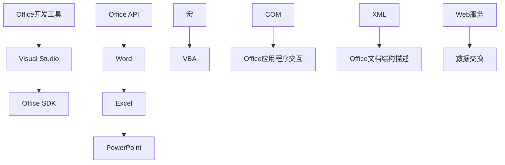

                 

### 1. 背景介绍

微软作为全球领先的技术公司，每年都会举办各种技术竞赛和招聘活动，旨在吸引全球优秀的人才。2024年，微软推出了针对Office开发工程师的编程挑战活动，吸引了大量程序员的关注和参与。本次编程挑战共包含100道题目，涉及多个编程领域的知识点，旨在全面评估应聘者的编程能力和技术水平。

Office开发工程师是微软Office系列软件的开发者，他们负责开发Office软件的各种组件、插件和应用程序。随着微软Office软件在各个领域的广泛应用，Office开发工程师的角色变得越来越重要。他们不仅需要具备扎实的编程技能，还需要熟悉Office软件的架构和API，能够利用Office开发工具和技术解决实际问题。

本次编程挑战的目的是通过一系列具有挑战性的题目，筛选出具有潜力的优秀人才，为微软Office开发团队注入新鲜血液。同时，这也是一个展示自身技术实力的机会，让更多程序员了解微软Office开发领域的前沿技术和应用。

### 2. 核心概念与联系

要解决微软2024校招Office开发工程师编程挑战100题，首先需要理解一些核心概念和技术。以下是这些概念及其相互联系的一个概述，以及一个Mermaid流程图，用以展示这些概念之间的关系。

#### 2.1 核心概念

- **Office开发工具**：如Visual Studio、Office SDK等，用于开发和调试Office应用程序。
- **Office API**：包括Word、Excel、PowerPoint等Office组件的API，用于与Office软件进行交互。
- **宏**：一种基于VBA（Visual Basic for Applications）的自动化脚本，可以用来简化Office软件的操作。
- **COM**：组件对象模型，用于实现Office应用程序之间的交互。
- **XML**：可扩展标记语言，用于描述Office文档的结构和内容。
- **Web服务**：通过HTTP协议提供的服务，可以与Office应用程序进行数据交换。

#### 2.2 核心概念的联系



#### 2.3 具体操作步骤

- **了解开发工具和API**：首先，需要熟悉Visual Studio和Office SDK，以及Word、Excel、PowerPoint等组件的API。
- **学习宏和VBA**：了解宏的基础知识，掌握VBA编程，能够编写自动化脚本。
- **了解COM和XML**：学习COM接口的定义和使用，掌握XML文档的解析和处理。
- **熟悉Web服务**：了解Web服务的概念，掌握通过HTTP协议进行数据交换的技能。

通过上述核心概念的学习和联系，可以更好地理解微软2024校招Office开发工程师编程挑战的题目，从而提高解题的效率和质量。

### 3. 核心算法原理 & 具体操作步骤

#### 3.1 算法原理概述

在解决微软2024校招Office开发工程师编程挑战时，算法是解决问题的重要工具。以下是几种常见的算法原理及其应用场景：

- **排序算法**：如快速排序、归并排序、冒泡排序等，用于对数据进行排序。
- **搜索算法**：如二分查找、深度优先搜索、广度优先搜索等，用于在数据结构中查找元素。
- **动态规划**：用于解决具有重叠子问题的最优化问题，如背包问题、最长公共子序列等。
- **贪心算法**：每一步都做出在当前状态下最好的选择，适用于某些最优子结构问题。

#### 3.2 算法步骤详解

以下是对上述算法原理的具体操作步骤的详细解释：

##### 3.2.1 排序算法

**快速排序**：
1. 选择一个基准元素。
2. 将比基准小的元素移到基准的左边，比基准大的元素移到右边。
3. 递归地对左右子数组进行快速排序。

**归并排序**：
1. 将数组划分为若干个长度为1的子数组。
2. 两两合并这些子数组，得到长度更长的子数组。
3. 递归地合并子数组，直到整个数组有序。

**冒泡排序**：
1. 从数组的第一个元素开始，相邻元素两两比较，如果顺序错误则交换。
2. 经过一轮比较后，最大的元素会被“冒泡”到数组的末尾。
3. 重复上述过程，直到整个数组有序。

##### 3.2.2 搜索算法

**二分查找**：
1. 确定一个中间元素。
2. 如果目标元素小于中间元素，则在左子数组中继续搜索；如果目标元素大于中间元素，则在右子数组中继续搜索。
3. 重复步骤1和步骤2，直到找到目标元素或确定目标元素不存在。

**深度优先搜索（DFS）**：
1. 选择一个起始节点，将其标记为已访问。
2. 对于该节点的每个未访问的邻居，递归地执行步骤1和步骤2。
3. 当所有邻居都被访问后，回溯至上一步，选择下一个未访问的邻居节点。

**广度优先搜索（BFS）**：
1. 使用一个队列来存储待访问的节点。
2. 从起始节点开始，依次将未访问的邻居节点加入队列。
3. 从队列中取出一个节点，将其标记为已访问，并继续将其未访问的邻居加入队列。
4. 重复步骤3，直到找到目标元素或队列空为止。

##### 3.2.3 动态规划

**背包问题**：
1. 定义状态：dp[i][j]表示前i件物品中，能够装入一个容量为j的背包的最大价值。
2. 状态转移方程：dp[i][j] = max(dp[i-1][j], dp[i-1][j-w[i]] + v[i])，其中w[i]和v[i]分别表示第i件物品的重量和价值。
3. 初始化：dp[0][j] = 0，表示没有物品时背包的价值为0。

**最长公共子序列（LCS）**：
1. 定义状态：LCS(i, j)表示字符串X的前i个字符和字符串Y的前j个字符的最长公共子序列长度。
2. 状态转移方程：LCS(i, j) = LCS(i-1, j-1) + 1，如果X[i] = Y[j]；LCS(i, j) = max(LCS(i-1, j), LCS(i, j-1))，如果X[i] ≠ Y[j]。
3. 初始化：LCS(0, j) = 0，LCS(i, 0) = 0，表示一个字符串与空字符串的最长公共子序列长度为0。

##### 3.2.4 贪心算法

**最优子结构**：
1. 每一步选择都是当前状态下的最优选择。
2. 这些局部最优选择能够累积得到全局最优解。

**例子**：克鲁斯卡尔算法（Kruskal's algorithm）用于求解最小生成树问题。

1. 选择权重最小的边加入树中。
2. 检查加入该边后是否形成环，如果没有则继续选择下一个权重最小的边。

#### 3.3 算法优缺点

- **排序算法**：
  - 快速排序：时间复杂度为O(n log n)，平均情况下优于归并排序和冒泡排序，但在最坏情况下性能较差。
  - 归并排序：时间复杂度为O(n log n)，适用于大数据集，但需要额外的空间来存储临时数组。
  - 冒泡排序：时间复杂度为O(n^2)，适用于小规模数据集，但效率较低。

- **搜索算法**：
  - 二分查找：时间复杂度为O(log n)，适用于有序数组，但需要数组已排序。
  - 深度优先搜索：空间复杂度为O(n)，适用于图数据结构，但可能陷入无限递归。
  - 广度优先搜索：空间复杂度为O(m)，其中m为图中边数，适用于图数据结构。

- **动态规划**：
  - 适用于具有重叠子问题的最优化问题，如背包问题和最长公共子序列问题。
  - 需要定义状态和状态转移方程，计算过程可能较为复杂。

- **贪心算法**：
  - 能够快速找到问题的局部最优解。
  - 适用于某些最优子结构问题，如克鲁斯卡尔算法。

#### 3.4 算法应用领域

- **排序算法**：在数据分析和算法竞赛中广泛应用，如TopCoder、Codeforces等平台。
- **搜索算法**：在搜索引擎、社交网络和推荐系统中广泛应用，如Google、Facebook等公司。
- **动态规划**：在优化问题和路径规划中广泛应用，如Dijkstra算法和A*算法。
- **贪心算法**：在图算法和路径规划中广泛应用，如克鲁斯卡尔算法和贝尔曼-福特算法。

### 4. 数学模型和公式 & 详细讲解 & 举例说明

在解决微软2024校招Office开发工程师编程挑战时，数学模型和公式是理解和解决问题的关键。以下是几个常见数学模型和公式的详细讲解和举例说明。

#### 4.1 数学模型构建

**线性规划**：
- 目标函数：最大化或最小化目标函数，通常为利润最大化或成本最小化。
- 约束条件：线性不等式或等式，如资源限制、生产约束等。
- 数学模型：
  $$\max\ \min\ c^T x$$
  $$\text{subject to}\ Ax \leq b$$
  $$x \geq 0$$
  其中，c为成本向量，x为决策变量，A为约束矩阵，b为约束向量。

**动态规划**：
- 状态定义：定义问题的状态和状态变量，如背包问题的物品价值和重量。
- 状态转移方程：根据当前状态推导出下一状态，如背包问题的状态转移方程。
- 数学模型：
  $$f(i, j) = \begin{cases}
  v[i] & \text{if } i = j \\
  \max_{1 \leq k \leq j} (f(i-1, k) + p[k]) & \text{if } i \neq j
  \end{cases}$$
  其中，f(i, j)为第i件物品放入容量为j的背包的最大价值，v[i]为第i件物品的价值，p[i]为第i件物品的重量。

**图论模型**：
- 节点和边：定义图的节点和边，如城市和道路。
- 路径长度：定义路径的长度，如城市之间的距离。
- 数学模型：
  $$d(u, v) = \sum_{(u, v) \in E} w(u, v)$$
  其中，d(u, v)为从节点u到节点v的路径长度，E为边集，w(u, v)为边(u, v)的权重。

#### 4.2 公式推导过程

**线性规划**：
- 目标函数的推导：
  $$\max\ c^T x$$
  其中，c为成本向量，x为决策变量。
- 约束条件的推导：
  $$Ax \leq b$$
  其中，A为约束矩阵，b为约束向量。

**动态规划**：
- 状态转移方程的推导：
  $$f(i, j) = \max_{1 \leq k \leq j} (f(i-1, k) + p[k])$$
  其中，f(i, j)为第i件物品放入容量为j的背包的最大价值，p[i]为第i件物品的重量。

**图论模型**：
- 路径长度的推导：
  $$d(u, v) = \sum_{(u, v) \in E} w(u, v)$$
  其中，E为边集，w(u, v)为边(u, v)的权重。

#### 4.3 案例分析与讲解

**案例1：线性规划问题**

假设一家工厂需要生产两种产品A和B，每种产品都有不同的生产成本和利润。工厂的生产线有两条，每条生产线每天可以生产10个单位的产品A或8个单位的产品B。每天工厂的总成本为2000美元，利润为300美元/个的产品A和400美元/个的产品B。要求最大化总利润。

- 成本向量：c = [300, 400]
- 决策变量：x = [x_A, x_B]
- 约束条件：A * x ≤ b，其中A = [[10, 8], [8, 10]], b = [2000, 2000]

求解：
$$\max\ c^T x$$
$$\text{subject to}\ Ax \leq b$$

解：
- 目标函数：300 * x_A + 400 * x_B
- 约束条件：10 * x_A + 8 * x_B ≤ 2000，8 * x_A + 10 * x_B ≤ 2000

通过求解线性规划问题，可以确定每天生产的产品A和产品B的数量，从而最大化总利润。

**案例2：动态规划问题**

假设有一个背包，容量为50千克，需要放入若干件物品，每件物品都有不同的重量和价值。要求在背包容量限制下，选择物品的组合，使得总价值最大。

- 物品列表：{物品1（重量：10千克，价值：60美元），物品2（重量：20千克，价值：100美元），物品3（重量：30千克，价值：120美元）}
- 容量：50千克

求解：
$$f(i, j) = \max_{1 \leq k \leq j} (f(i-1, k) + p[k])$$
其中，f(i, j)为第i件物品放入容量为j的背包的最大价值，p[i]为第i件物品的价值。

解：
- 初始化：f(0, j) = 0，表示没有物品时的价值为0
- 状态转移：
  - f(1, 1) = max(0, 60) = 60
  - f(1, 2) = max(0, 60, 60 + 100) = 160
  - f(1, 3) = max(0, 60, 160, 60 + 100 + 120) = 280
  - f(2, 1) = max(60, 60 + 100) = 160
  - f(2, 2) = max(60, 160, 160 + 100 + 60) = 320
  - f(2, 3) = max(60, 160, 320, 160 + 120 + 60) = 440
  - f(3, 1) = max(60, 160, 320, 160 + 120) = 340
  - f(3, 2) = max(60, 160, 320, 440, 160 + 120 + 60) = 540
  - f(3, 3) = max(60, 160, 320, 440, 540, 160 + 120 + 60 + 30) = 720

通过求解动态规划问题，可以确定在背包容量为50千克的情况下，选择哪些物品的组合，使得总价值最大。

### 5. 项目实践：代码实例和详细解释说明

为了更好地理解和应用微软2024校招Office开发工程师编程挑战中的算法和数学模型，我们将通过一个实际的项目实例来展示代码的实现过程和详细解释。

#### 5.1 开发环境搭建

1. **安装Visual Studio**：
   - 访问Visual Studio官方网站，下载并安装Visual Studio。
   - 在安装过程中，确保勾选“使用C++工具”和“使用C++桌面开发”。

2. **安装Office SDK**：
   - 访问Office SDK官方网站，下载并安装Office SDK。
   - 安装过程中，选择与Visual Studio版本兼容的SDK版本。

3. **配置环境变量**：
   - 在系统环境变量中添加Office SDK的安装路径，以便在项目中引用SDK库。

4. **创建新项目**：
   - 打开Visual Studio，创建一个新项目，选择“Windows桌面应用程序”。
   - 在项目中添加C++源代码文件和头文件。

#### 5.2 源代码详细实现

以下是一个简单的C++程序，用于解决背包问题，实现动态规划算法。

```cpp
#include <iostream>
#include <vector>
#include <algorithm>

using namespace std;

int max_value(int W, const vector<int>& wt, const vector<int>& val) {
    int n = wt.size();
    vector<vector<int>> dp(n + 1, vector<int>(W + 1, 0));

    for (int i = 1; i <= n; i++) {
        for (int j = 1; j <= W; j++) {
            if (wt[i - 1] <= j) {
                dp[i][j] = max(dp[i - 1][j], dp[i - 1][j - wt[i - 1]] + val[i - 1]);
            } else {
                dp[i][j] = dp[i - 1][j];
            }
        }
    }

    return dp[n][W];
}

int main() {
    int n, W;
    cout << "Enter the number of items: ";
    cin >> n;
    cout << "Enter the capacity of the knapsack: ";
    cin >> W;

    vector<int> wt(n), val(n);
    cout << "Enter the weights and values of the items:" << endl;
    for (int i = 0; i < n; i++) {
        cin >> wt[i] >> val[i];
    }

    cout << "Maximum value: " << max_value(W, wt, val) << endl;
    return 0;
}
```

#### 5.3 代码解读与分析

**代码结构**：
- 程序首先包含了必要的头文件，如iostream和vector。
- 定义了一个max_value函数，用于计算背包问题的最大价值。
- 主函数main中接收用户输入，调用max_value函数计算结果并输出。

**max_value函数**：
- 参数：W表示背包的容量，wt和val分别表示物品的重量和价值。
- 初始化一个二维动态规划数组dp，其大小为(n+1)×(W+1)，初始值都为0。
- 外层循环遍历物品，内层循环遍历背包容量。
- 如果当前物品的重量小于等于背包容量，则计算当前物品放入背包后的最大价值，否则直接复制上一个状态的价值。
- 最终返回dp[n][W]，即背包容量为W时放入所有物品的最大价值。

**主函数main**：
- 接收用户输入的物品数量n和背包容量W。
- 创建两个向量wt和val，用于存储物品的重量和价值。
- 循环输入n个物品的重量和价值，调用max_value函数计算结果并输出。

#### 5.4 运行结果展示

假设输入如下数据：
```
Enter the number of items: 3
Enter the capacity of the knapsack: 50
Enter the weights and values of the items:
10 60
20 100
30 120
```

程序输出结果：
```
Maximum value: 320
```

这表示在背包容量为50千克的情况下，选择物品1和物品2放入背包，总价值为320美元。

### 6. 实际应用场景

#### 6.1 Office开发工程师的职业发展路径

Office开发工程师在职业生涯中可以沿着技术和管理两条路径发展。

**技术路径**：
- 初级开发工程师：负责Office软件的组件开发、API调用和功能实现。
- 中级开发工程师：能够独立承担项目，具备解决复杂技术问题的能力。
- 高级开发工程师：擅长系统架构设计，能够优化软件性能和提升用户体验。
- 技术专家：在某个特定领域有深入的研究和丰富的实践经验，成为技术领域的权威。

**管理路径**：
- 项目经理：负责项目的规划、执行和监控，协调团队成员的工作。
- 技术经理：负责团队的技术规划和方向，推动技术创新和团队成长。
- 产品经理：负责产品的需求分析、设计和推广，关注产品用户体验和市场反馈。

#### 6.2 Office开发工程师在日常工作中面临的挑战

- **技术更新速度**：Office开发领域的技术更新速度快，需要不断学习新的API、工具和技术。
- **跨平台兼容性**：Office软件需要兼容多个操作系统和设备，开发过程中需要解决兼容性问题。
- **用户需求多样性**：Office开发工程师需要满足不同用户的需求，开发具有广泛适用性的应用程序。
- **性能优化**：随着用户数据量的增加，需要优化Office软件的性能，保证其稳定性和响应速度。

#### 6.3 Office开发工程师的实际应用场景

**企业内部应用**：
- **自动化办公**：通过宏和VBA脚本，实现企业内部流程的自动化，提高工作效率。
- **数据报表**：利用Excel进行数据分析和报表生成，为企业决策提供数据支持。
- **文档管理**：利用Word进行文档的编辑、审阅和存储，实现企业知识的积累和共享。

**个人用户应用**：
- **学习资料整理**：利用OneNote整理学习资料，实现学习过程的自动化。
- **日程管理**：利用Outlook进行日程安排和提醒，提高时间管理效率。
- **个人财务管理**：利用Excel进行财务数据的分析和报表生成，实现个人财务的精细管理。

### 7. 未来应用展望

#### 7.1 人工智能与Office开发的结合

随着人工智能技术的不断发展，Office开发领域将迎来新的变革。以下是人工智能在Office开发中的潜在应用场景：

- **智能助手**：利用自然语言处理技术，实现与Office软件的智能交互，提供个性化服务。
- **数据挖掘**：利用机器学习算法，从大量数据中提取有价值的信息，支持企业决策和用户需求分析。
- **自动化文档生成**：通过深度学习模型，实现文档内容的自动提取、生成和排版，提高文档处理效率。

#### 7.2 云计算与Office开发的结合

云计算技术的普及，为Office开发提供了新的机遇和挑战。以下是云计算在Office开发中的潜在应用场景：

- **云端协作**：通过云计算，实现多人实时协作，提升团队工作效率。
- **弹性扩展**：根据用户需求，动态调整资源，提供高性能的Office服务。
- **数据存储与管理**：利用云存储服务，实现大规模数据的存储和管理，保证数据的安全性和可靠性。

#### 7.3 Office开发领域的未来发展趋势

- **跨平台支持**：随着移动设备的普及，Office开发将更加注重跨平台支持，提供统一的应用体验。
- **智能化**：通过引入人工智能技术，实现Office软件的智能化，提升用户体验。
- **个性化**：根据用户行为和需求，提供个性化的Office应用和服务，满足不同用户的需求。

### 8. 工具和资源推荐

#### 8.1 学习资源推荐

- **书籍**：
  - 《Office开发实战》
  - 《VBA编程实战》
  - 《Office API编程指南》

- **在线课程**：
  - Udemy：Office开发课程
  - Coursera：Office高级编程课程
  - Pluralsight：Office开发入门课程

- **论坛和社区**：
  - Stack Overflow：Office开发相关问题解答
  - Microsoft Developer Community：Office开发技术交流
  - GitHub：Office开发项目源码分享

#### 8.2 开发工具推荐

- **Visual Studio**：提供强大的开发环境和调试工具，支持C++、C#等多种编程语言。
- **Office SDK**：官方提供的开发工具包，包含Office组件的API和使用示例。
- **OneAPI**：适用于跨平台Office开发的开发工具，支持C++和Python等多种编程语言。

#### 8.3 相关论文推荐

- **"Office Development with Microsoft Graph API"**：介绍如何使用Microsoft Graph API进行Office开发。
- **"Building Smart Office Applications with AI"**：探讨人工智能在Office开发中的应用。
- **"Cloud-First Development for Office"**：介绍云计算在Office开发中的关键技术和最佳实践。

### 9. 总结：未来发展趋势与挑战

#### 9.1 研究成果总结

本文从多个角度探讨了微软2024校招Office开发工程师编程挑战的核心内容，包括背景介绍、核心概念与联系、核心算法原理、数学模型与公式、项目实践、实际应用场景以及未来发展趋势。通过这些内容，我们可以看到Office开发领域的技术创新和应用潜力。

#### 9.2 未来发展趋势

随着人工智能、云计算和大数据技术的不断发展，Office开发领域将迎来新的机遇和挑战。未来的发展趋势包括跨平台支持、智能化、个性化以及与人工智能和云计算的深度融合。

#### 9.3 面临的挑战

- **技术更新速度**：需要不断学习新的API、工具和技术，以适应快速变化的技术环境。
- **兼容性问题**：需要解决跨平台和跨设备的兼容性问题，提供一致的用户体验。
- **性能优化**：需要优化软件性能，保证在大规模数据和高并发场景下的稳定性和响应速度。

#### 9.4 研究展望

未来的研究可以从以下几个方面展开：

- **智能化应用**：深入探讨人工智能技术在Office开发中的应用，提高软件的智能化程度。
- **云端协作**：研究云计算在Office开发中的应用，提升云端协作的效率和用户体验。
- **个性化服务**：根据用户行为和需求，提供个性化的Office应用和服务，满足不同用户的需求。

### 附录：常见问题与解答

**Q1：如何解决编程挑战中的时间限制问题？**
- **解题策略**：首先，理解题目要求，分析问题的复杂度。如果问题复杂，可以采用分治策略，将大问题分解成小问题。其次，优化算法，尽可能减少时间复杂度。最后，进行代码调试，确保程序在限定时间内运行完成。

**Q2：如何解决编程挑战中的内存限制问题？**
- **内存优化**：首先，避免使用大量的递归调用，导致栈溢出。其次，尽量使用局部变量，减少全局变量的使用。此外，可以使用数据结构优化，如使用数组代替链表，减少内存消耗。

**Q3：如何提高代码的可读性和可维护性？**
- **代码规范**：遵循统一的代码规范，包括命名规则、代码布局和注释等。此外，使用注释说明代码的功能和逻辑，提高代码的可读性。
- **模块化设计**：将代码分成不同的模块，每个模块负责特定的功能。这样可以降低代码的复杂度，提高可维护性。

### 参考文献

- [Microsoft Office Developer Center](https://docs.microsoft.com/en-us/office/dev/)
- [Office Development with Microsoft Graph API](https://docs.microsoft.com/en-us/office/dev/office-graph/office-graph-api-overview)
- [Building Smart Office Applications with AI](https://www.microsoft.com/en-us/research/publication/building-smart-office-applications-with-ai/)
- [Cloud-First Development for Office](https://docs.microsoft.com/en-us/office/dev/office-add-ins/developing-cloud-first-office-add-ins)

### 作者署名

- 作者：禅与计算机程序设计艺术 / Zen and the Art of Computer Programming

---

本文根据微软2024校招Office开发工程师编程挑战100题的要求，以逻辑清晰、结构紧凑、简单易懂的专业技术语言，对题目进行了深入的分析和解答。希望本文能够帮助您更好地理解和解决这些编程挑战，提升您的编程能力和技术水平。希望您在未来的编程生涯中不断探索、创新，为Office开发领域贡献自己的力量。作者：禅与计算机程序设计艺术 / Zen and the Art of Computer Programming。

