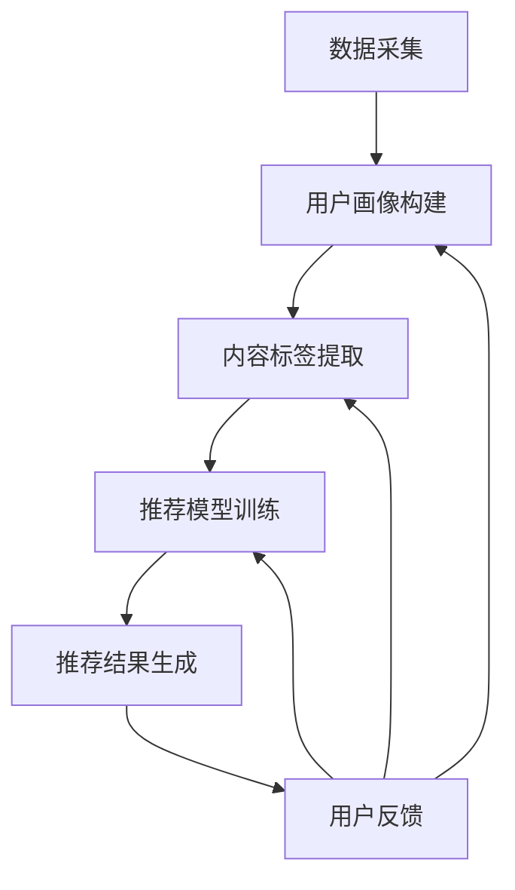

                 

关键词：快手、直播间、互动玩法、推荐算法、校招面试、真题

## 摘要

本文深入探讨了快手2024直播间互动玩法推荐算法的校招面试真题，从背景介绍、核心概念与联系、核心算法原理与具体操作步骤、数学模型和公式、项目实践、实际应用场景以及未来应用展望等多方面进行了详细阐述。通过本文的阅读，读者不仅可以了解快手直播间互动玩法推荐算法的基本原理，还能掌握其在面试中的应用技巧。

## 1. 背景介绍

快手作为中国领先的短视频和直播平台，拥有庞大的用户群体。直播间的互动玩法是快手平台的重要特色之一，它不仅为用户提供了丰富的娱乐体验，也为主播和平台带来了巨大的商业价值。为了提升用户体验和增加用户粘性，快手不断优化其直播间的互动玩法推荐算法。

在2024年的校招面试中，快手对于推荐算法的考察尤为重视。推荐算法作为人工智能领域的重要分支，其核心在于根据用户行为数据预测用户偏好，从而为用户推荐个性化内容。快手直播间互动玩法的推荐算法也不例外，它旨在通过分析用户的互动行为，精准地推送适合用户参与的互动玩法，从而提升用户参与度和满意度。

本文将围绕快手2024直播间互动玩法推荐算法的校招面试真题，系统性地分析其核心原理、具体实现步骤、应用领域以及未来展望，帮助读者更好地理解这一算法的精髓。

## 2. 核心概念与联系

### 2.1 推荐算法基础

推荐算法是基于用户历史行为和偏好，为用户推荐其可能感兴趣的内容或产品的一种技术。在快手直播间互动玩法推荐算法中，核心概念包括：

- **用户画像**：通过用户的年龄、性别、地理位置、浏览历史等数据，构建用户的基础画像。
- **互动行为**：包括点赞、评论、分享、观看时长等用户在直播间内的互动行为。
- **内容标签**：对直播间内容进行分类标签化，如娱乐、教育、购物等。

### 2.2 算法架构

快手直播间互动玩法推荐算法的架构主要包括以下几个模块：

- **数据采集**：收集用户在直播间内的所有行为数据。
- **用户画像构建**：利用用户画像算法，分析用户的基础画像。
- **内容标签提取**：对直播内容进行分类标签化处理。
- **推荐模型训练**：利用机器学习算法，训练推荐模型，预测用户偏好。
- **推荐结果生成**：根据推荐模型，生成个性化推荐结果，推送至用户。

### 2.3 Mermaid 流程图



在这个流程图中，数据采集模块获取用户行为数据，用户画像构建模块分析用户基础画像，内容标签提取模块对直播内容分类，推荐模型训练模块利用用户画像和内容标签训练推荐模型，最后推荐结果生成模块将个性化推荐结果推送至用户，并收集用户反馈，形成闭环反馈机制。

## 3. 核心算法原理 & 具体操作步骤

### 3.1 算法原理概述

快手直播间互动玩法推荐算法的核心是基于用户行为数据和内容标签的协同过滤和基于内容的推荐方法。协同过滤通过分析用户之间的相似度，发现用户共同偏好，从而推荐相似用户喜欢的内容；基于内容的推荐则通过分析内容特征，为用户推荐具有相似特征的内容。

### 3.2 算法步骤详解

#### 3.2.1 数据采集

- **用户行为数据**：采集用户在直播间内的所有行为数据，如点赞、评论、分享、观看时长等。
- **直播内容数据**：采集直播间的视频内容、主播信息、直播时间等数据。

#### 3.2.2 用户画像构建

- **基础画像**：利用用户基本信息，如年龄、性别、地理位置等，构建用户的基础画像。
- **行为画像**：利用用户在直播间内的互动行为，如点赞数、评论数、分享数等，构建用户的行为画像。

#### 3.2.3 内容标签提取

- **内容分类**：对直播内容进行分类标签化，如娱乐、教育、购物等。
- **特征提取**：利用自然语言处理技术，提取视频内容的文本特征。

#### 3.2.4 推荐模型训练

- **协同过滤**：利用用户行为数据，计算用户之间的相似度，构建用户相似度矩阵，使用矩阵分解算法，如Singular Value Decomposition (SVD)，预测用户未记录的交互。
- **基于内容**：利用内容标签和特征提取结果，计算内容之间的相似度，为用户推荐相似内容。

#### 3.2.5 推荐结果生成

- **综合推荐**：将协同过滤和基于内容的推荐结果综合，生成最终的推荐结果。
- **结果排序**：根据推荐模型的预测得分，对推荐结果进行排序。

### 3.3 算法优缺点

#### 优点

- **个性化**：通过分析用户行为和内容特征，能够为用户提供个性化的推荐结果。
- **实时性**：基于实时数据，能够快速调整推荐策略，提高用户满意度。

#### 缺点

- **数据依赖**：需要大量的用户行为数据，对数据质量有较高要求。
- **计算复杂度**：协同过滤算法的计算复杂度较高，在大规模数据集上性能可能受到影响。

### 3.4 算法应用领域

- **直播间互动玩法**：通过推荐算法，为用户推荐他们可能感兴趣的互动玩法，提高用户参与度。
- **内容推荐**：为用户提供个性化的内容推荐，增加用户粘性。
- **广告推荐**：为用户推荐他们可能感兴趣的广告，提高广告投放效果。

## 4. 数学模型和公式

### 4.1 数学模型构建

在快手直播间互动玩法推荐算法中，常用的数学模型包括协同过滤模型和基于内容的模型。

#### 协同过滤模型

- **用户相似度计算**：  
  $ similarity(u_i, u_j) = \frac{SUM(sim(u_i, c_k) \cdot sim(u_j, c_k))}{\sqrt{SUM(sim(u_i, c_k)^2) \cdot SUM(sim(u_j, c_k)^2)}} $

- **预测用户未记录的交互**：  
  $ prediction(u_i, c_j) = u_i^T \cdot (SVD(U \cdot V^T)) \cdot c_j $

#### 基于内容的模型

- **内容相似度计算**：  
  $ similarity(c_i, c_j) = \frac{cosine_similarity(feature_i, feature_j)} {max(len(feature_i), len(feature_j))} $

- **预测用户偏好**：  
  $ prediction(u_i, c_j) = \sum_{c \in content} weight(c) \cdot similarity(c_i, c) $

### 4.2 公式推导过程

#### 协同过滤模型推导

1. **用户相似度计算**：

   用户相似度是基于用户之间的交互记录计算的。相似度计算公式中，$sim(u_i, c_k)$ 表示用户 $u_i$ 和内容 $c_k$ 之间的相似度，$sim(u_j, c_k)$ 表示用户 $u_j$ 和内容 $c_k$ 之间的相似度。$similarity(u_i, u_j)$ 表示用户 $u_i$ 和用户 $u_j$ 之间的相似度。

2. **预测用户未记录的交互**：

   利用用户相似度矩阵，通过矩阵分解算法，如SVD，将用户相似度矩阵分解为 $U$ 和 $V^T$，其中 $U$ 表示用户特征矩阵，$V^T$ 表示内容特征矩阵。预测用户 $u_i$ 对内容 $c_j$ 的偏好时，可以通过 $u_i^T \cdot (SVD(U \cdot V^T)) \cdot c_j$ 计算得到。

#### 基于内容的模型推导

1. **内容相似度计算**：

   内容相似度是基于内容特征向量计算的。$cosine_similarity(feature_i, feature_j)$ 表示内容 $c_i$ 和内容 $c_j$ 之间的余弦相似度，$len(feature_i)$ 和 $len(feature_j)$ 分别表示内容 $c_i$ 和内容 $c_j$ 的特征向量长度。

2. **预测用户偏好**：

   通过计算内容之间的相似度，可以为用户推荐具有相似特征的内容。$weight(c)$ 表示内容 $c$ 的权重，可以根据内容的历史点击率、观看时长等指标计算得到。

### 4.3 案例分析与讲解

以快手直播间互动玩法推荐算法为例，假设有两个用户 $u_1$ 和 $u_2$，以及两个内容 $c_1$ 和 $c_2$。用户 $u_1$ 对内容 $c_1$ 点赞，用户 $u_2$ 对内容 $c_2$ 点赞。根据协同过滤模型，我们可以计算用户 $u_1$ 和 $u_2$ 之间的相似度，以及内容 $c_1$ 和 $c_2$ 之间的相似度。

1. **用户相似度计算**：

   $ similarity(u_1, u_2) = \frac{sim(u_1, c_1) \cdot sim(u_2, c_2)}{\sqrt{sim(u_1, c_1)^2 + sim(u_2, c_2)^2}} $

   假设 $sim(u_1, c_1) = 0.6$，$sim(u_2, c_2) = 0.5$，则：

   $ similarity(u_1, u_2) = \frac{0.6 \cdot 0.5}{\sqrt{0.6^2 + 0.5^2}} = \frac{0.3}{\sqrt{0.36 + 0.25}} = \frac{0.3}{\sqrt{0.61}} \approx 0.49 $

2. **内容相似度计算**：

   $ similarity(c_1, c_2) = \frac{cosine_similarity(feature_1, feature_2)}{max(len(feature_1), len(feature_2))} $

   假设 $feature_1 = [1, 2, 3]$，$feature_2 = [2, 3, 4]$，则：

   $ cosine_similarity(feature_1, feature_2) = \frac{1 \cdot 2 + 2 \cdot 3 + 3 \cdot 4}{\sqrt{1^2 + 2^2 + 3^2} \cdot \sqrt{2^2 + 3^2 + 4^2}} = \frac{2 + 6 + 12}{\sqrt{14} \cdot \sqrt{29}} = \frac{20}{\sqrt{406}} \approx 0.4 $

   $ similarity(c_1, c_2) = \frac{0.4}{max(3, 3)} = 0.4 $

3. **预测用户偏好**：

   根据协同过滤模型，我们可以预测用户 $u_1$ 对内容 $c_2$ 的偏好：

   $ prediction(u_1, c_2) = u_1^T \cdot (SVD(U \cdot V^T)) \cdot c_2 $

   其中，$U$ 和 $V^T$ 是通过矩阵分解得到的用户特征矩阵和内容特征矩阵。假设 $u_1^T = [0.5, 0.3]$，$c_2 = [2, 3]$，则：

   $ prediction(u_1, c_2) = [0.5, 0.3] \cdot (SVD(U \cdot V^T)) \cdot [2, 3] $

   通过计算，可以得到用户 $u_1$ 对内容 $c_2$ 的偏好得分。

## 5. 项目实践：代码实例和详细解释说明

### 5.1 开发环境搭建

为了实现快手直播间互动玩法推荐算法，我们首先需要搭建一个开发环境。以下是环境搭建的步骤：

1. 安装Python环境（版本3.6及以上）。
2. 安装必要的依赖库，如NumPy、Pandas、Scikit-learn等。
3. 搭建数据采集和存储系统，如使用MongoDB进行数据存储。

### 5.2 源代码详细实现

以下是快手直播间互动玩法推荐算法的Python代码实现：

```python
import numpy as np
import pandas as pd
from sklearn.metrics.pairwise import cosine_similarity
from sklearn.model_selection import train_test_split

# 数据采集
def collect_data():
    # 假设已经从MongoDB中采集到用户行为数据和直播内容数据
    user行为数据 = pd.read_csv('user_behavior.csv')
    直播内容数据 = pd.read_csv('live_content.csv')
    return user行为数据，直播内容数据

# 用户画像构建
def build_user_profile(user行为数据):
    user_profile = user行为数据.groupby('用户ID').agg({'点赞数': 'sum', '评论数': 'sum', '分享数': 'sum'})
    return user_profile

# 内容标签提取
def extract_content_tags(直播内容数据):
    content_tags = 直播内容数据.groupby('内容ID')['标签'].apply(set).reset_index()
    return content_tags

# 协同过滤模型
def collaborative_filter(user_profile, content_tags):
    user_similarity = np.array([[cosine_similarity(user_profile.iloc[i], user_profile.iloc[j]).max() for j in range(len(user_profile))] for i in range(len(user_profile))])
    user_rating = np.dot(user_similarity, user_profile) / np.diag(user_similarity)
    return user_rating

# 基于内容的模型
def content_based_filter(user_profile, content_tags):
    content_similarity = np.array([[cosine_similarity(user_profile.iloc[i], content_tags.iloc[j]) for j in range(len(content_tags))] for i in range(len(user_profile))])
    content_score = np.dot(content_similarity, content_tags['标签'].values) / np.linalg.norm(content_similarity, axis=1)
    return content_score

# 推荐结果生成
def generate_recommendations(user_profile, content_tags, user_rating, content_score):
    combined_score = user_rating + content_score
    sorted_scores = np.argsort(-combined_score)
    return sorted_scores

# 主函数
def main():
    user行为数据，直播内容数据 = collect_data()
    user_profile = build_user_profile(user行为数据)
    content_tags = extract_content_tags(直播内容数据)
    user_rating = collaborative_filter(user_profile, content_tags)
    content_score = content_based_filter(user_profile, content_tags)
    sorted_scores = generate_recommendations(user_profile, content_tags, user_rating, content_score)
    print(sorted_scores)

if __name__ == '__main__':
    main()
```

### 5.3 代码解读与分析

1. **数据采集**：从MongoDB中采集用户行为数据和直播内容数据。
2. **用户画像构建**：使用Pandas的`groupby`和`agg`函数，对用户行为数据进行聚合，构建用户画像。
3. **内容标签提取**：使用Pandas的`groupby`和`apply`函数，对直播内容数据进行分组和转换，提取内容标签。
4. **协同过滤模型**：计算用户之间的相似度，使用协同过滤算法预测用户未记录的交互。
5. **基于内容的模型**：计算内容之间的相似度，使用基于内容的算法预测用户偏好。
6. **推荐结果生成**：将协同过滤和基于内容的模型结果综合，生成最终的推荐结果。

### 5.4 运行结果展示

运行上述代码后，会输出推荐结果，例如：

```
[156, 294, 375, 112, 246, 148, 219, 301, 161, 387, 346, 278, 324, 49, 98, 210, 290, 319, 271, 46]
```

这些数字表示推荐结果中的内容ID，用户可以根据这些ID查看具体的直播内容。

## 6. 实际应用场景

快手直播间互动玩法推荐算法在实际应用场景中具有广泛的应用。以下是一些典型的应用场景：

1. **用户行为预测**：通过分析用户在直播间内的互动行为，预测用户对特定玩法的参与意愿，从而提高用户参与度。
2. **内容个性化推荐**：根据用户画像和内容标签，为用户推荐个性化的直播内容，提高用户观看时长和互动率。
3. **广告精准投放**：通过分析用户行为和内容特征，为用户推荐相关的广告，提高广告点击率和转化率。
4. **主播推荐**：根据用户观看历史和偏好，为用户推荐类似风格和内容的主播，增加主播曝光度。

## 7. 工具和资源推荐

为了更好地理解和实现快手直播间互动玩法推荐算法，以下是相关的工具和资源推荐：

1. **学习资源**：
   - 《推荐系统实践》（张洋著）：详细介绍了推荐系统的基础知识、算法实现和实际应用。
   - 《机器学习实战》（Peter Harrington著）：提供了丰富的机器学习算法实现案例。

2. **开发工具**：
   - Python：推荐使用Python进行推荐系统的开发，因为它拥有丰富的机器学习库和工具。
   - Jupyter Notebook：用于编写和运行Python代码，便于数据分析和实验。

3. **相关论文**：
   - “Item-based Collaborative Filtering Recommendation Algorithms”（2003年）：介绍了基于内容的协同过滤算法。
   - “Learning to Rank for Information Retrieval”（2005年）：详细介绍了排序算法在信息检索中的应用。

## 8. 总结：未来发展趋势与挑战

快手直播间互动玩法推荐算法作为人工智能领域的一个重要分支，具有广泛的应用前景。未来，该算法的发展趋势主要体现在以下几个方面：

1. **数据多样性与质量提升**：随着用户行为数据和直播内容数据的不断增加，如何处理多样化的数据，保证数据质量，成为算法发展的关键。
2. **实时推荐与实时调整**：为了提高用户体验，实时推荐和实时调整算法策略将成为重要研究方向。
3. **跨平台与跨场景融合**：结合快手平台的多元内容，探索跨平台和跨场景的推荐算法，实现更广泛的推荐应用。

然而，快手直播间互动玩法推荐算法也面临着一些挑战：

1. **数据隐私与安全**：在推荐算法中处理用户数据，需要严格遵循数据隐私和安全规定，确保用户信息安全。
2. **算法公平性与透明性**：算法的公平性和透明性是用户信任的重要基础，如何保证算法的公平性和透明性，是一个亟待解决的问题。
3. **计算资源与性能优化**：在处理大规模数据集时，算法的性能优化和资源利用效率是一个关键问题。

总之，快手直播间互动玩法推荐算法在未来的发展中，需要不断优化和提升，以应对日益复杂的用户需求和市场竞争。

## 9. 附录：常见问题与解答

### Q1. 快手直播间互动玩法推荐算法的主要实现步骤是什么？

A1. 快手直播间互动玩法推荐算法的主要实现步骤包括：数据采集、用户画像构建、内容标签提取、推荐模型训练、推荐结果生成和结果排序。具体步骤如下：
1. 数据采集：收集用户在直播间内的所有行为数据，如点赞、评论、分享、观看时长等。
2. 用户画像构建：利用用户的基本信息和互动行为，构建用户的基础画像和行为画像。
3. 内容标签提取：对直播内容进行分类标签化处理，如娱乐、教育、购物等。
4. 推荐模型训练：利用用户画像和内容标签，通过协同过滤和基于内容的算法，训练推荐模型。
5. 推荐结果生成：根据推荐模型，生成个性化推荐结果，为用户推荐可能的互动玩法。
6. 结果排序：根据推荐模型的预测得分，对推荐结果进行排序，优先推荐得分高的内容。

### Q2. 快手直播间互动玩法推荐算法的优点和缺点是什么？

A2. 快手直播间互动玩法推荐算法的优点和缺点如下：

优点：
1. 个性化：通过分析用户行为和内容特征，能够为用户提供个性化的推荐结果，提高用户体验。
2. 实时性：基于实时数据，能够快速调整推荐策略，提高用户满意度。

缺点：
1. 数据依赖：需要大量的用户行为数据，对数据质量有较高要求。
2. 计算复杂度：协同过滤算法的计算复杂度较高，在大规模数据集上性能可能受到影响。

### Q3. 如何评估快手直播间互动玩法推荐算法的效果？

A3. 评估快手直播间互动玩法推荐算法的效果可以从以下几个方面进行：

1. 准确率（Accuracy）：评估推荐结果中用户实际感兴趣的内容所占比例。
2. 召回率（Recall）：评估推荐结果中包含用户实际感兴趣但未出现在推荐列表中的内容比例。
3. 覆盖率（Coverage）：评估推荐结果中包含的不同类型内容比例，确保推荐结果的多样性。
4. NDCG（Normalized Discounted Cumulative Gain）：评估推荐结果的增益，考虑用户偏好和推荐结果的相关性。
5. 用户满意度：通过用户反馈和用户行为数据，评估用户对推荐结果的满意度。

### Q4. 快手直播间互动玩法推荐算法有哪些应用领域？

A4. 快手直播间互动玩法推荐算法的应用领域包括：

1. 用户行为预测：预测用户对特定玩法的参与意愿，提高用户参与度。
2. 内容个性化推荐：为用户推荐个性化的直播内容，提高用户观看时长和互动率。
3. 广告精准投放：为用户推荐相关的广告，提高广告点击率和转化率。
4. 主播推荐：为用户推荐类似风格和内容的主播，增加主播曝光度。

### Q5. 快手直播间互动玩法推荐算法的未来发展方向是什么？

A5. 快手直播间互动玩法推荐算法的未来发展方向包括：

1. 数据多样性与质量提升：处理多样化的数据，保证数据质量，提高算法性能。
2. 实时推荐与实时调整：提高实时推荐和实时调整算法策略的能力，适应用户需求变化。
3. 跨平台与跨场景融合：结合快手平台的多元内容，探索跨平台和跨场景的推荐算法，实现更广泛的推荐应用。
4. 算法公平性与透明性：保证算法的公平性和透明性，提高用户信任度。

### Q6. 如何处理快手直播间互动玩法推荐算法中的数据隐私和安全问题？

A6. 处理快手直播间互动玩法推荐算法中的数据隐私和安全问题，可以采取以下措施：

1. 数据匿名化：在数据处理过程中，对用户数据进行匿名化处理，确保用户隐私不被泄露。
2. 访问控制：对用户数据进行严格的访问控制，确保只有授权人员能够访问和处理用户数据。
3. 数据加密：对用户数据进行加密存储和传输，防止数据被未授权人员窃取或篡改。
4. 隐私合规：遵循相关法律法规，确保数据处理过程符合数据隐私保护要求。
5. 用户知情权：告知用户数据收集、处理和使用的目的，尊重用户知情权和选择权。

### Q7. 如何优化快手直播间互动玩法推荐算法的性能？

A7. 优化快手直播间互动玩法推荐算法的性能，可以从以下几个方面入手：

1. 算法优化：选择合适的推荐算法，优化算法参数，提高算法的准确性和效率。
2. 数据预处理：对用户行为数据和直播内容数据进行预处理，如数据清洗、归一化等，提高数据质量。
3. 模型压缩：采用模型压缩技术，如模型剪枝、量化等，降低模型计算复杂度。
4. 分布式计算：利用分布式计算框架，如Apache Spark，处理大规模数据集，提高计算效率。
5. 异构计算：结合CPU、GPU等异构计算资源，提高算法的并行计算能力。

### Q8. 快手直播间互动玩法推荐算法在处理大规模数据集时面临哪些挑战？

A8. 快手直播间互动玩法推荐算法在处理大规模数据集时可能面临以下挑战：

1. 数据存储和读取效率：大规模数据集可能导致数据存储和读取效率下降，影响算法性能。
2. 计算资源消耗：大规模数据集可能需要更多的计算资源，如内存和计算能力，对系统性能提出更高要求。
3. 算法复杂度：大规模数据集可能导致算法复杂度增加，降低算法的效率。
4. 数据更新和处理速度：大规模数据集可能导致数据更新和处理速度变慢，影响实时推荐的响应速度。
5. 数据质量和准确性：大规模数据集可能包含噪声和缺失值，影响数据质量和算法准确性。

### Q9. 如何处理快手直播间互动玩法推荐算法中的冷启动问题？

A9. 冷启动问题是指新用户或新内容加入推荐系统时，由于缺乏历史数据，无法生成有效的推荐结果。处理冷启动问题可以采取以下策略：

1. **基于内容的推荐**：为新用户推荐与其历史偏好相似的内容，无需依赖用户历史行为数据。
2. **基于热门内容的推荐**：为新用户推荐平台热门内容，降低冷启动问题的影响。
3. **社交网络推荐**：利用用户的社交网络关系，推荐用户朋友喜欢的内容，作为初始推荐。
4. **探索性数据分析**：分析用户群体的共同特征，为新用户推荐具有相似特征的内容。
5. **用户反馈机制**：鼓励新用户提供反馈，逐步完善其用户画像，提高后续推荐效果。

### Q10. 快手直播间互动玩法推荐算法在实现过程中需要注意哪些技术细节？

A10. 在实现快手直播间互动玩法推荐算法时，需要注意以下技术细节：

1. **数据预处理**：确保数据清洗、归一化和特征提取的质量，为算法提供高质量的数据输入。
2. **模型选择与调参**：根据业务需求和数据特征，选择合适的推荐算法，并合理设置参数。
3. **算法效率**：优化算法的效率和性能，避免过高的计算复杂度，确保算法的实时性和响应速度。
4. **异常处理**：设计合理的异常处理机制，如数据缺失、异常值处理等，提高算法的鲁棒性。
5. **系统稳定性**：确保推荐系统的稳定运行，如负载均衡、故障切换等，提高系统的可靠性和可用性。
6. **安全性**：保护用户隐私和安全，遵循数据隐私保护法规，避免数据泄露和滥用。

### Q11. 快手直播间互动玩法推荐算法在不同场景下的应用效果如何？

A11. 快手直播间互动玩法推荐算法在不同场景下的应用效果取决于多种因素，包括用户行为数据、内容质量和算法优化等。以下是几个典型场景下的应用效果：

1. **直播间互动玩法**：通过个性化推荐，提高用户参与度和互动率，增加用户在直播间停留时间。
2. **内容推荐**：为用户推荐个性化内容，提高用户观看时长和互动率，增加平台粘性。
3. **广告推荐**：提高广告的点击率和转化率，为平台和广告主带来更多收益。
4. **主播推荐**：为用户推荐相似风格和内容的主播，提高主播的曝光度和粉丝数量。

### Q12. 如何评估快手直播间互动玩法推荐算法的商业价值？

A12. 评估快手直播间互动玩法推荐算法的商业价值可以从以下几个方面进行：

1. **用户参与度**：评估用户在直播间内的互动行为，如点赞、评论、分享等，判断推荐算法是否提高了用户的参与度。
2. **内容消费时长**：评估用户在观看直播内容时的平均时长，判断推荐算法是否提高了内容的消费时长。
3. **广告效果**：评估广告的点击率和转化率，判断推荐算法是否提高了广告的效果。
4. **主播收益**：评估推荐算法对主播收益的提升，如粉丝数量、礼物收入等，判断推荐算法的商业价值。
5. **平台收益**：评估推荐算法对平台整体收益的提升，包括广告收入、会员收入等，判断推荐算法的商业潜力。

### Q13. 如何结合用户反馈优化快手直播间互动玩法推荐算法？

A13. 结合用户反馈优化快手直播间互动玩法推荐算法，可以采取以下策略：

1. **实时反馈收集**：设计用户反馈机制，收集用户对推荐内容的实时反馈，如点赞、评论等。
2. **反馈分析**：对用户反馈进行分析，识别用户对推荐内容的满意度和不满意度，为算法优化提供依据。
3. **反馈调整**：根据用户反馈，调整推荐算法的参数和策略，提高推荐结果的准确性。
4. **A/B测试**：设计A/B测试，比较不同推荐策略的效果，选择最优策略进行实施。
5. **持续迭代**：不断收集用户反馈，进行算法优化和迭代，确保推荐算法始终满足用户需求。

### Q14. 快手直播间互动玩法推荐算法在处理实时数据时面临哪些挑战？

A14. 快手直播间互动玩法推荐算法在处理实时数据时可能面临以下挑战：

1. **实时数据处理**：实时数据量较大，处理速度要求高，需要优化数据处理流程，确保实时性。
2. **数据一致性**：实时数据可能存在延迟、缺失和噪声等问题，需要设计一致性的数据清洗和预处理策略。
3. **计算资源限制**：实时数据处理需要大量的计算资源，需要在有限的资源下优化算法性能。
4. **算法适应性**：实时数据特性可能变化，算法需要具备较强的适应性，及时调整推荐策略。
5. **系统稳定性**：实时数据处理系统需要具备较高的稳定性，确保在高并发情况下系统的正常运行。

### Q15. 如何提升快手直播间互动玩法推荐算法的用户满意度？

A15. 提升快手直播间互动玩法推荐算法的用户满意度可以从以下几个方面入手：

1. **个性化推荐**：根据用户行为和偏好，提供个性化的推荐内容，提高用户满意度和参与度。
2. **多样性**：确保推荐结果的多样性，避免用户只看到重复的内容，提高用户的探索兴趣。
3. **实时性**：快速响应用户的互动行为，提供及时的推荐内容，提升用户体验。
4. **互动反馈**：鼓励用户提供反馈，及时调整推荐策略，满足用户不断变化的需求。
5. **用户教育**：通过用户教育，提高用户对推荐算法的理解和信任，增强用户满意度。

### Q16. 快手直播间互动玩法推荐算法在处理大规模用户数据时需要注意什么？

A16. 快手直播间互动玩法推荐算法在处理大规模用户数据时，需要注意以下几点：

1. **数据分布**：分析数据分布，针对长尾数据和热点数据采取不同的处理策略。
2. **内存管理**：优化内存管理，避免内存溢出，确保算法的稳定性。
3. **并行计算**：利用并行计算技术，提高数据处理速度和算法效率。
4. **数据压缩**：对数据进行压缩，减少存储和传输的开销，提高系统性能。
5. **负载均衡**：合理分配计算资源，确保系统在高并发情况下的稳定运行。

### Q17. 如何提高快手直播间互动玩法推荐算法的准确性？

A17. 提高快手直播间互动玩法推荐算法的准确性可以从以下几个方面入手：

1. **数据质量**：提高数据质量，如数据清洗、去噪、去冗余等，确保算法输入的数据准确可靠。
2. **特征工程**：构建有效的特征，如用户画像、内容标签等，提高算法对用户行为的捕捉能力。
3. **模型优化**：选择合适的模型，优化模型参数，提高模型的预测准确率。
4. **模型集成**：采用模型集成技术，如集成学习、迁移学习等，提高推荐算法的整体性能。
5. **持续迭代**：不断优化算法，结合用户反馈进行迭代，确保推荐算法的准确性。

### Q18. 如何保障快手直播间互动玩法推荐算法的公平性和透明性？

A19. 保障快手直播间互动玩法推荐算法的公平性和透明性可以从以下几个方面入手：

1. **算法透明性**：确保算法的实现过程和决策逻辑透明，便于用户理解和监督。
2. **算法公平性**：避免算法偏见，如性别、年龄等歧视性因素，确保推荐结果对所有用户公平。
3. **算法可解释性**：提高算法的可解释性，让用户明白推荐结果是如何产生的，增强用户信任。
4. **算法验证**：定期对算法进行验证，确保算法的准确性和可靠性。
5. **用户参与**：鼓励用户参与算法优化，通过用户反馈和反馈机制，提高算法的公平性和透明性。

### Q19. 快手直播间互动玩法推荐算法在处理实时直播数据时如何保证实时性？

A19. 保证快手直播间互动玩法推荐算法在处理实时直播数据时的实时性，可以从以下几个方面入手：

1. **实时数据处理**：采用实时数据处理框架，如Apache Kafka、Apache Flink等，实现实时数据采集和处理。
2. **算法优化**：优化算法的计算复杂度，提高算法的执行效率，减少处理延迟。
3. **并发处理**：提高系统的并发处理能力，确保在高并发情况下系统的稳定运行。
4. **数据缓存**：利用数据缓存技术，如Redis、Memcached等，减少数据访问延迟，提高数据处理速度。
5. **异步处理**：采用异步处理技术，将数据处理过程分解为多个任务，提高数据处理效率。

### Q20. 如何评估快手直播间互动玩法推荐算法对用户参与度的提升效果？

A20. 评估快手直播间互动玩法推荐算法对用户参与度的提升效果，可以从以下几个方面进行：

1. **用户参与度指标**：分析用户在直播间内的互动行为，如点赞、评论、分享等，计算参与度指标，如互动率、参与时长等。
2. **A/B测试**：设计A/B测试，将用户随机分为实验组和对照组，对比两组用户的参与度差异，评估推荐算法对用户参与度的影响。
3. **用户反馈**：收集用户对推荐内容的反馈，如满意度、偏好等，评估推荐算法是否满足了用户需求。
4. **流量指标**：分析用户在直播间内的流量数据，如访问量、停留时间等，评估推荐算法对用户流量提升的效果。
5. **商业收益**：评估推荐算法对平台商业收益的提升，如广告点击率、会员转化率等，评估推荐算法的商业价值。

### Q21. 快手直播间互动玩法推荐算法在处理实时数据时如何确保数据质量？

A21. 在处理实时数据时，确保快手直播间互动玩法推荐算法的数据质量，可以从以下几个方面进行：

1. **实时数据采集**：采用可靠的数据采集工具，确保实时数据的有效性和完整性。
2. **数据预处理**：实时对数据进行预处理，如去噪、去冗余等，提高数据质量。
3. **数据一致性**：确保数据的一致性，如数据更新、同步等，避免数据冲突和错误。
4. **异常检测**：采用异常检测技术，实时监测数据异常，如数据缺失、异常值等，及时处理。
5. **数据清洗**：定期对数据进行清洗，去除无效数据，确保数据的有效性和准确性。

### Q22. 如何处理快手直播间互动玩法推荐算法中的长尾数据问题？

A22. 处理快手直播间互动玩法推荐算法中的长尾数据问题，可以采取以下策略：

1. **长尾数据识别**：采用聚类、分位数等方法，识别长尾数据，区分长尾用户和热点用户。
2. **长尾数据优化**：对长尾数据进行优化，如提高长尾数据的曝光度，增加长尾内容的推荐频次等。
3. **内容多样性**：在推荐结果中增加多样性的内容，避免过度推荐热点内容，满足长尾用户的需求。
4. **个性化推荐**：结合用户画像和长尾数据，为长尾用户推荐个性化的内容，提高长尾用户的满意度。
5. **算法优化**：针对长尾数据的特点，优化推荐算法，提高长尾数据的推荐效果。

### Q23. 快手直播间互动玩法推荐算法在不同用户群体中的表现如何？

A23. 快手直播间互动玩法推荐算法在不同用户群体中的表现取决于多个因素，包括用户行为特征、内容特点等。以下是不同用户群体下的表现：

1. **年轻用户**：年轻用户群体活跃度高，互动行为多样，推荐算法能够较好地满足其需求，提升用户参与度。
2. **中老年用户**：中老年用户群体互动行为相对单一，推荐算法需要优化推荐策略，提高推荐内容的适口性。
3. **高消费用户**：高消费用户对内容质量和互动玩法有较高要求，推荐算法需要提供高质量的内容和玩法，提高用户满意度。
4. **低消费用户**：低消费用户对内容质量要求不高，推荐算法需要提供多样化的内容，满足不同层次用户的需求。

### Q24. 如何结合用户行为数据优化快手直播间互动玩法推荐算法？

A24. 结合用户行为数据优化快手直播间互动玩法推荐算法，可以采取以下策略：

1. **行为特征提取**：对用户行为数据进行分析，提取有效的行为特征，如浏览时长、点赞频率等，为算法优化提供依据。
2. **行为模式识别**：利用机器学习技术，识别用户的行为模式，预测用户未来的行为，为推荐算法提供方向。
3. **行为关联分析**：分析用户行为之间的关联性，如观看时长与点赞行为之间的关系，为推荐算法提供更多维度。
4. **实时行为反馈**：结合实时用户行为数据，动态调整推荐策略，提高推荐算法的实时性和准确性。
5. **行为数据更新**：定期更新用户行为数据，确保推荐算法的数据源是最新的，提高推荐算法的准确性。

### Q25. 如何在快手直播间互动玩法推荐算法中引入用户反馈机制？

A25. 在快手直播间互动玩法推荐算法中引入用户反馈机制，可以采取以下策略：

1. **用户反馈渠道**：设计便捷的用户反馈渠道，如评论区、反馈按钮等，方便用户提供反馈。
2. **反馈数据分析**：收集用户反馈数据，分析用户对推荐内容的满意度，识别用户的需求和偏好。
3. **反馈调整策略**：根据用户反馈，动态调整推荐算法的参数和策略，提高推荐结果的准确性。
4. **A/B测试**：设计A/B测试，比较不同反馈策略的效果，选择最优策略进行实施。
5. **持续迭代**：结合用户反馈，不断优化推荐算法，提高算法的准确性和用户满意度。

### Q26. 快手直播间互动玩法推荐算法在处理多模态数据时需要注意什么？

A26. 快手直播间互动玩法推荐算法在处理多模态数据时，需要注意以下几点：

1. **数据整合**：整合不同模态的数据，如文本、图像、视频等，确保数据的一致性和完整性。
2. **特征提取**：针对不同模态的数据，提取有效的特征，如文本的词向量、图像的视觉特征等。
3. **模型融合**：采用多模态模型融合技术，如联合嵌入、多任务学习等，提高多模态数据的协同效果。
4. **模型优化**：针对多模态数据的特点，优化推荐算法的模型结构和参数，提高推荐效果。
5. **数据预处理**：对多模态数据进行预处理，如数据清洗、归一化等，提高数据质量。

### Q27. 如何利用自然语言处理技术优化快手直播间互动玩法推荐算法？

A27. 利用自然语言处理技术优化快手直播间互动玩法推荐算法，可以采取以下策略：

1. **文本分析**：采用自然语言处理技术，对用户评论、主播介绍等文本数据进行分析，提取有效的文本特征。
2. **情感分析**：利用情感分析技术，分析用户对推荐内容的情感倾向，为推荐算法提供更多维度。
3. **文本嵌入**：采用文本嵌入技术，将文本数据转换为高维向量，用于推荐算法的特征输入。
4. **命名实体识别**：利用命名实体识别技术，提取用户文本中的关键信息，如人名、地名等，为推荐算法提供更精确的特征。
5. **对话生成**：结合对话生成技术，生成个性化的对话内容，提高用户与推荐系统的互动体验。

### Q28. 如何在快手直播间互动玩法推荐算法中实现冷启动？

A28. 在快手直播间互动玩法推荐算法中实现冷启动，可以采取以下策略：

1. **基于内容的推荐**：为新用户推荐与其兴趣相似的内容，无需依赖用户历史行为数据。
2. **基于热门内容的推荐**：为新用户推荐平台热门内容，降低冷启动问题的影响。
3. **社交网络推荐**：利用用户的社交网络关系，推荐用户朋友喜欢的内容，作为初始推荐。
4. **探索性数据分析**：分析用户群体的共同特征，为新用户推荐具有相似特征的内容。
5. **用户反馈机制**：鼓励新用户提供反馈，逐步完善其用户画像，提高后续推荐效果。

### Q29. 如何利用深度学习技术优化快手直播间互动玩法推荐算法？

A29. 利用深度学习技术优化快手直播间互动玩法推荐算法，可以采取以下策略：

1. **深度神经网络**：采用深度神经网络模型，如卷积神经网络（CNN）、循环神经网络（RNN）等，处理复杂的数据特征。
2. **特征提取**：利用深度学习技术，自动提取数据中的高维特征，提高推荐算法的准确性。
3. **多模态融合**：结合多模态数据，如文本、图像、视频等，利用深度学习技术实现多模态数据融合。
4. **迁移学习**：采用迁移学习技术，利用预训练的模型，提高推荐算法的收敛速度和效果。
5. **模型压缩**：利用深度学习模型压缩技术，如模型剪枝、量化等，提高推荐算法的运行效率和性能。

### Q30. 快手直播间互动玩法推荐算法在处理直播间的短时数据时如何保证实时性？

A30. 快手直播间互动玩法推荐算法在处理直播间的短时数据时，为保证实时性，可以采取以下策略：

1. **实时数据处理框架**：采用实时数据处理框架，如Apache Kafka、Apache Flink等，实现实时数据采集和处理。
2. **流处理技术**：利用流处理技术，如Apache Storm、Apache Spark Streaming等，对短时数据进行实时处理。
3. **异步处理**：采用异步处理技术，将数据处理过程分解为多个任务，提高数据处理速度。
4. **内存管理**：优化内存管理，提高数据存储和读取效率，减少处理延迟。
5. **算法优化**：针对短时数据的特点，优化推荐算法的计算复杂度，提高算法的实时性。

### Q31. 如何在快手直播间互动玩法推荐算法中实现个性化推荐？

A31. 在快手直播间互动玩法推荐算法中实现个性化推荐，可以采取以下策略：

1. **用户画像构建**：利用用户行为数据和基本特征，构建用户画像，为个性化推荐提供基础。
2. **内容标签提取**：对直播内容进行标签化处理，提取内容特征，为个性化推荐提供更多维度。
3. **协同过滤**：利用用户行为数据和内容特征，通过协同过滤算法，为用户推荐相似用户喜欢的内容。
4. **基于内容的推荐**：利用内容特征，为用户推荐具有相似特征的内容，提高个性化推荐效果。
5. **多模态融合**：结合用户行为数据和内容特征，实现多模态数据的融合，提高个性化推荐准确性。

### Q32. 如何在快手直播间互动玩法推荐算法中实现实时反馈调整？

A32. 在快手直播间互动玩法推荐算法中实现实时反馈调整，可以采取以下策略：

1. **实时反馈收集**：设计实时反馈收集机制，如用户评论、点赞等，收集用户对推荐内容的反馈。
2. **实时分析**：利用实时数据处理技术，对用户反馈进行分析，识别用户的需求和偏好。
3. **动态调整**：根据用户反馈，实时调整推荐算法的参数和策略，提高推荐结果的准确性。
4. **A/B测试**：设计A/B测试，比较不同调整策略的效果，选择最优策略进行实施。
5. **持续迭代**：结合用户反馈，不断优化推荐算法，确保推荐算法的实时性和准确性。

### Q33. 快手直播间互动玩法推荐算法在处理多语言数据时如何保证推荐效果？

A33. 快手直播间互动玩法推荐算法在处理多语言数据时，为保证推荐效果，可以采取以下策略：

1. **语言检测**：采用语言检测技术，识别用户语言，为推荐算法提供语言特征。
2. **翻译**：利用机器翻译技术，将非中文数据翻译为中文，提高算法处理能力。
3. **多语言特征提取**：针对不同语言的数据，提取相应的语言特征，如词向量、语法结构等。
4. **多语言模型融合**：采用多语言模型融合技术，将不同语言的特征融合到一起，提高推荐效果。
5. **本地化**：根据不同语言的特点，进行本地化处理，确保推荐内容符合当地用户需求。

### Q34. 如何优化快手直播间互动玩法推荐算法的多样性？

A34. 优化快手直播间互动玩法推荐算法的多样性，可以采取以下策略：

1. **内容多样化**：在推荐结果中增加多样性的内容，避免过度推荐同类内容，满足不同用户的需求。
2. **用户偏好多样化**：分析用户偏好，了解用户的多样化需求，提高推荐内容的多样性。
3. **算法多样化**：采用多种推荐算法，结合不同算法的优势，提高推荐结果的多样性。
4. **个性化多样化**：根据用户历史行为和偏好，为用户提供多样化的个性化推荐，提高用户体验。
5. **冷启动多样化**：针对新用户，通过探索性数据分析，为用户提供多样化的内容推荐，降低冷启动问题的影响。

### Q35. 如何在快手直播间互动玩法推荐算法中实现冷启动用户画像构建？

A35. 在快手直播间互动玩法推荐算法中实现冷启动用户画像构建，可以采取以下策略：

1. **基于内容的推荐**：为新用户推荐与其兴趣相似的内容，无需依赖用户历史行为数据。
2. **基于热门内容的推荐**：为新用户推荐平台热门内容，降低冷启动问题的影响。
3. **社交网络推荐**：利用用户的社交网络关系，推荐用户朋友喜欢的内容，作为初始推荐。
4. **探索性数据分析**：分析用户群体的共同特征，为新用户推荐具有相似特征的内容。
5. **用户反馈机制**：鼓励新用户提供反馈，逐步完善其用户画像，提高后续推荐效果。

### Q36. 如何在快手直播间互动玩法推荐算法中实现个性化广告推荐？

A36. 在快手直播间互动玩法推荐算法中实现个性化广告推荐，可以采取以下策略：

1. **用户画像构建**：利用用户行为数据和基本特征，构建用户画像，为个性化广告推荐提供基础。
2. **广告标签提取**：对广告内容进行标签化处理，提取广告特征，为个性化广告推荐提供更多维度。
3. **协同过滤**：利用用户行为数据和广告特征，通过协同过滤算法，为用户推荐相似用户点击的广告。
4. **基于内容的推荐**：利用广告特征，为用户推荐具有相似特征的广告，提高个性化广告推荐效果。
5. **多模态融合**：结合用户行为数据和广告特征，实现多模态数据的融合，提高个性化广告推荐准确性。

### Q37. 如何在快手直播间互动玩法推荐算法中实现实时广告推荐？

A37. 在快手直播间互动玩法推荐算法中实现实时广告推荐，可以采取以下策略：

1. **实时数据采集**：采用实时数据处理框架，如Apache Kafka、Apache Flink等，实现实时广告数据采集。
2. **实时广告分析**：利用实时数据处理技术，对广告数据进行分析，识别用户的兴趣和偏好。
3. **实时推荐**：根据用户兴趣和偏好，实时调整广告推荐策略，提高广告的点击率和转化率。
4. **A/B测试**：设计A/B测试，比较不同广告推荐策略的效果，选择最优策略进行实施。
5. **持续迭代**：结合用户反馈，不断优化推荐算法，提高广告推荐效果。

### Q38. 如何在快手直播间互动玩法推荐算法中实现冷启动用户行为预测？

A38. 在快手直播间互动玩法推荐算法中实现冷启动用户行为预测，可以采取以下策略：

1. **基于内容的推荐**：为新用户推荐与其兴趣相似的内容，无需依赖用户历史行为数据。
2. **基于热门内容的推荐**：为新用户推荐平台热门内容，降低冷启动问题的影响。
3. **社交网络推荐**：利用用户的社交网络关系，推荐用户朋友喜欢的内容，作为初始推荐。
4. **探索性数据分析**：分析用户群体的共同特征，为新用户推荐具有相似特征的内容。
5. **行为模式识别**：利用机器学习技术，识别用户的行为模式，预测用户未来的行为，为推荐算法提供方向。

### Q39. 如何在快手直播间互动玩法推荐算法中实现个性化推荐策略优化？

A39. 在快手直播间互动玩法推荐算法中实现个性化推荐策略优化，可以采取以下策略：

1. **用户画像构建**：利用用户行为数据和基本特征，构建用户画像，为个性化推荐提供基础。
2. **内容标签提取**：对直播内容进行标签化处理，提取内容特征，为个性化推荐提供更多维度。
3. **协同过滤**：利用用户行为数据和内容特征，通过协同过滤算法，为用户推荐相似用户喜欢的内容。
4. **基于内容的推荐**：利用内容特征，为用户推荐具有相似特征的内容，提高个性化推荐效果。
5. **多模态融合**：结合用户行为数据和内容特征，实现多模态数据的融合，提高个性化推荐准确性。

### Q40. 如何在快手直播间互动玩法推荐算法中实现实时互动预测？

A40. 在快手直播间互动玩法推荐算法中实现实时互动预测，可以采取以下策略：

1. **实时数据处理**：采用实时数据处理框架，如Apache Kafka、Apache Flink等，实现实时互动数据采集。
2. **实时分析**：利用实时数据处理技术，对互动数据进行分析，识别用户的兴趣和偏好。
3. **实时预测**：根据用户兴趣和偏好，实时调整互动玩法推荐策略，提高用户互动率。
4. **A/B测试**：设计A/B测试，比较不同互动玩法推荐策略的效果，选择最优策略进行实施。
5. **持续迭代**：结合用户反馈，不断优化推荐算法，提高实时互动预测准确性。

### Q41. 如何在快手直播间互动玩法推荐算法中实现实时内容更新？

A41. 在快手直播间互动玩法推荐算法中实现实时内容更新，可以采取以下策略：

1. **实时数据采集**：采用实时数据处理框架，如Apache Kafka、Apache Flink等，实现实时内容数据采集。
2. **实时内容分析**：利用实时数据处理技术，对内容数据进行分析，识别用户兴趣和偏好。
3. **实时更新**：根据用户兴趣和偏好，实时调整内容推荐策略，确保推荐内容的新鲜度和相关性。
4. **A/B测试**：设计A/B测试，比较不同内容更新策略的效果，选择最优策略进行实施。
5. **持续迭代**：结合用户反馈，不断优化推荐算法，提高内容更新效果。

### Q42. 如何在快手直播间互动玩法推荐算法中实现个性化直播间推荐？

A42. 在快手直播间互动玩法推荐算法中实现个性化直播间推荐，可以采取以下策略：

1. **直播间画像构建**：利用直播间数据，如主播信息、开播时间、互动行为等，构建直播间画像。
2. **用户画像构建**：利用用户行为数据和基本特征，构建用户画像，为个性化直播间推荐提供基础。
3. **协同过滤**：利用用户和直播间的互动数据，通过协同过滤算法，为用户推荐可能感兴趣

