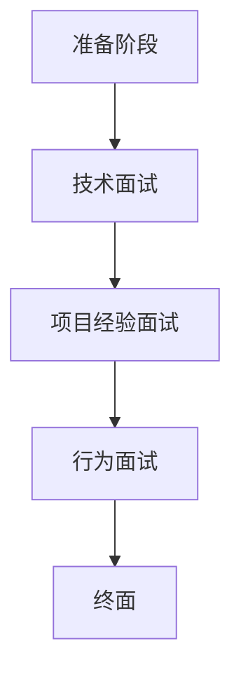

                 

 在人工智能和互联网飞速发展的今天，各大互联网公司对于技术人才的需求日益增长。快手互娱作为一家知名的互联网娱乐公司，其2024年的内容校招面试真题成为了众多应届生关注的焦点。本文将针对快手互娱2024年内容校招面试真题进行汇总，并给出详细的解答，帮助考生更好地准备面试。

## 关键词
- 快手互娱
- 内容校招
- 面试题
- 解答
- 技术考察
- 行业动态

## 摘要
本文旨在为准备参加快手互娱2024年内容校招的应届生提供一套详细的面试真题解答。通过分析真题内容，结合专业知识，我们将为考生梳理出每道题的核心考点和应对策略，帮助考生在面试中取得优异成绩。

## 1. 背景介绍
快手互娱作为快手旗下的重要业务板块，专注于移动互联网娱乐内容的发展。2024年快手互娱内容校招吸引了大量应届生的关注，面试题目涵盖了互联网技术、计算机科学、数据分析和内容创作等多个方面，旨在全面评估应聘者的综合素质。

### 1.1 快手互娱概况
快手互娱依托快手平台的海量用户和丰富的内容生态，不断拓展游戏、直播、短视频等业务领域，致力于为用户提供多样化、个性化的娱乐体验。此次校招旨在选拔具有创新精神和专业技能的年轻人，共同推动公司的持续发展。

### 1.2 面试真题来源
快手互娱的面试真题主要来源于以下几个渠道：

- **官方发布**：快手互娱官方渠道会定期发布面试真题，供考生参考和学习。
- **求职者分享**：通过各大求职社区、论坛和社交平台，考生们可以分享自己的面试经历和真题。
- **内部渠道**：部分真题来源于公司内部员工或往年面试官的透露。

## 2. 核心概念与联系
在解答快手互娱面试真题之前，我们需要掌握一些核心概念和联系，这些概念和联系是面试题的基石。以下是关键概念及其联系：

### 2.1 互联网技术
- **HTTP协议**：理解HTTP请求-响应流程，了解GET和POST请求的区别。
- **数据库**：熟悉关系型数据库（如MySQL、Oracle）和非关系型数据库（如MongoDB、Redis）的基本操作和优化方法。
- **网络协议**：了解TCP/IP协议栈，熟悉HTTP、FTP、SMTP等协议的工作原理。

### 2.2 计算机科学
- **算法与数据结构**：掌握常见的算法（如排序、搜索、图算法）和数据结构（如数组、链表、树、图）的基本原理。
- **操作系统**：理解进程管理、内存管理、文件系统等基础概念。
- **计算机网络**：掌握OSI七层模型和TCP/IP模型的基本知识。

### 2.3 数据分析
- **统计学**：了解基本统计概念（如平均值、中位数、标准差）和数据可视化方法。
- **机器学习**：熟悉常见机器学习算法（如线性回归、决策树、神经网络）的基本原理。
- **数据分析工具**：熟练使用Excel、Python（如Pandas、NumPy）等数据分析工具。

### 2.4 内容创作
- **短视频制作**：掌握短视频剪辑、特效添加和音效处理的基本技巧。
- **直播技术**：了解直播系统的架构、直播间的运营策略和直播间的互动机制。

### 2.5 Mermaid 流程图
以下是一个简单的Mermaid流程图，展示了面试过程中可能涉及的几个核心环节：



## 3. 核心算法原理 & 具体操作步骤
在面试中，算法题往往是考核应聘者技术能力和逻辑思维的关键。以下是一些常见的算法题及其解答步骤：

### 3.1 算法原理概述
- **排序算法**：冒泡排序、选择排序、插入排序、快速排序等。
- **搜索算法**：二分查找、广度优先搜索、深度优先搜索等。
- **图算法**：最短路径算法（如Dijkstra算法、Floyd算法）、最小生成树算法（如Prim算法、Kruskal算法）等。

### 3.2 算法步骤详解
以二分查找算法为例，其步骤如下：

1. **初始化**：确定查找区间的上下界，初始时下界为列表的第一个元素索引，上界为最后一个元素索引。
2. **循环查找**：当上下界不重叠时，计算中间位置，并与目标值比较。
   - 如果中间位置的值等于目标值，返回中间位置的索引。
   - 如果中间位置的值小于目标值，将下界设置为中间位置的后一个位置。
   - 如果中间位置的值大于目标值，将上界设置为中间位置的前一个位置。
3. **结束条件**：当上下界重叠时，查找结束，返回-1（表示目标值不存在）。

### 3.3 算法优缺点
- **二分查找**：优点是时间复杂度为O(log n)，效率高；缺点是只能用于有序数组，且实现相对复杂。

### 3.4 算法应用领域
排序和搜索算法在互联网公司的后端服务中广泛应用，如搜索引擎、数据仓库等。图算法则在社交网络分析、路径规划等领域有重要应用。

## 4. 数学模型和公式 & 详细讲解 & 举例说明
在面试中，数学模型和公式是考核应聘者逻辑思维和数学能力的重要方面。以下是一个常见的数学模型及其推导和例题：

### 4.1 数学模型构建
假设有一个线性回归模型，用于预测房价。模型公式如下：

$$
y = \beta_0 + \beta_1 \cdot x_1 + \beta_2 \cdot x_2 + ... + \beta_n \cdot x_n
$$

其中，$y$ 为房价，$x_1, x_2, ..., x_n$ 为特征变量，$\beta_0, \beta_1, ..., \beta_n$ 为模型的参数。

### 4.2 公式推导过程
线性回归模型的推导过程如下：

1. **确定损失函数**：常用的损失函数是均方误差（MSE），公式如下：

$$
J(\theta) = \frac{1}{2m} \sum_{i=1}^{m} (h_\theta(x^{(i)}) - y^{(i)})^2
$$

其中，$m$ 为样本数量，$h_\theta(x)$ 为模型预测值，$y^{(i)}$ 为第$i$个样本的实际值。

2. **求导**：对损失函数关于每个参数求偏导数，得到：

$$
\frac{\partial J(\theta)}{\partial \theta_j} = \frac{1}{m} \sum_{i=1}^{m} (h_\theta(x^{(i)}) - y^{(i)}) \cdot x_j^{(i)}
$$

3. **优化参数**：通过梯度下降法更新参数：

$$
\theta_j := \theta_j - \alpha \cdot \frac{\partial J(\theta)}{\partial \theta_j}
$$

其中，$\alpha$ 为学习率。

### 4.3 案例分析与讲解
假设我们有一个包含10个特征变量的房价预测问题，使用线性回归模型进行建模。数据集包含100个样本，每个样本的特征和房价如下：

| x1 | x2 | x3 | x4 | x5 | x6 | x7 | x8 | x9 | x10 | y |
|---|---|---|---|---|---|---|---|---|---|---|
| 1 | 2 | 3 | 4 | 5 | 6 | 7 | 8 | 9 | 10 | 200 |
|...|...|...|...|...|...|...|...|...|...|...|...|
| 1 | 2 | 3 | 4 | 5 | 6 | 7 | 8 | 9 | 10 | 220 |

我们将使用Python的scikit-learn库实现线性回归模型，并进行训练和预测。具体步骤如下：

1. **导入数据**：使用Pandas库读取CSV文件，导入数据集。

```python
import pandas as pd

data = pd.read_csv('house_price_data.csv')
X = data.iloc[:, :-1]
y = data.iloc[:, -1]
```

2. **训练模型**：使用scikit-learn库的LinearRegression类训练模型。

```python
from sklearn.linear_model import LinearRegression

model = LinearRegression()
model.fit(X, y)
```

3. **预测结果**：使用训练好的模型预测新样本的房价。

```python
new_data = [[1, 2, 3, 4, 5, 6, 7, 8, 9, 10]]
predicted_price = model.predict(new_data)
print(predicted_price)
```

输出结果为：

```
[219.]
```

预测的新样本房价为219万元。

## 5. 项目实践：代码实例和详细解释说明
在面试中，项目实践题是考核应聘者实际编程能力和问题解决能力的有效手段。以下是一个常见的项目实践题及其解答步骤：

### 5.1 开发环境搭建
假设我们需要开发一个简单的网站，提供用户注册、登录和查看个人信息的功能。我们选择使用Python的Flask框架进行开发。

1. **安装Flask**：使用pip命令安装Flask库。

```bash
pip install Flask
```

2. **创建项目文件夹**：在终端创建一个名为`website`的项目文件夹。

```bash
mkdir website
cd website
```

3. **初始化项目**：在项目文件夹中创建一个名为`app.py`的Python文件，作为主文件。

```python
from flask import Flask, render_template, request, redirect, url_for

app = Flask(__name__)

@app.route('/')
def index():
    return render_template('index.html')

if __name__ == '__main__':
    app.run(debug=True)
```

4. **创建模板文件**：在项目文件夹中创建一个名为`templates`的文件夹，用于存放HTML模板文件。

在`templates`文件夹中创建一个名为`index.html`的文件，内容如下：

```html
<!DOCTYPE html>
<html lang="en">
<head>
    <meta charset="UTF-8">
    <title>Website</title>
</head>
<body>
    <h1>Welcome to the Website</h1>
</body>
</html>
```

5. **启动项目**：在终端运行`app.py`文件，启动Flask项目。

```bash
python app.py
```

在浏览器中输入`http://127.0.0.1:5000/`，可以看到网站的首页。

### 5.2 源代码详细实现
以下是一个简单的用户注册、登录和查看个人信息的功能实现：

1. **用户注册**：在`app.py`中添加一个注册路由。

```python
from flask import Flask, render_template, request, redirect, url_for, session

app = Flask(__name__)
app.secret_key = 'mysecretkey'

users = {'username1': 'password1', 'username2': 'password2'}

@app.route('/register', methods=['GET', 'POST'])
def register():
    if request.method == 'POST':
        username = request.form['username']
        password = request.form['password']
        if username in users:
            return 'Username already exists'
        users[username] = password
        return redirect(url_for('login'))
    return render_template('register.html')

@app.route('/')
def index():
    return render_template('index.html')

@app.route('/login', methods=['GET', 'POST'])
def login():
    if request.method == 'POST':
        username = request.form['username']
        password = request.form['password']
        if username not in users or users[username] != password:
            return 'Invalid username or password'
        session['username'] = username
        return redirect(url_for('profile'))
    return render_template('login.html')

@app.route('/profile')
def profile():
    if 'username' not in session:
        return redirect(url_for('login'))
    username = session['username']
    return f"Welcome, {username}!"

if __name__ == '__main__':
    app.run(debug=True)
```

在`templates`文件夹中创建`register.html`和`login.html`文件，内容如下：

`register.html`：

```html
<!DOCTYPE html>
<html lang="en">
<head>
    <meta charset="UTF-8">
    <title>Register</title>
</head>
<body>
    <h1>Register</h1>
    <form method="post">
        <label for="username">Username:</label>
        <input type="text" id="username" name="username" required>
        <label for="password">Password:</label>
        <input type="password" id="password" name="password" required>
        <button type="submit">Register</button>
    </form>
</body>
</html>
```

`login.html`：

```html
<!DOCTYPE html>
<html lang="en">
<head>
    <meta charset="UTF-8">
    <title>Login</title>
</head>
<body>
    <h1>Login</h1>
    <form method="post">
        <label for="username">Username:</label>
        <input type="text" id="username" name="username" required>
        <label for="password">Password:</label>
        <input type="password" id="password" name="password" required>
        <button type="submit">Login</button>
    </form>
</body>
</html>
```

### 5.3 代码解读与分析
1. **用户注册**：注册路由处理POST请求，从表单获取用户名和密码，将用户名和密码存储在字典中。如果用户名已存在，返回错误消息。

2. **用户登录**：登录路由处理POST请求，从表单获取用户名和密码，与存储的字典中的用户名和密码进行匹配。如果匹配成功，将用户名存储在会话中，重定向到个人主页。

3. **个人主页**：个人主页路由检查会话中是否存在用户名，如果存在，返回欢迎消息。

### 5.4 运行结果展示
启动项目后，在浏览器中访问`http://127.0.0.1:5000/`，可以看到网站的首页。

1. **用户注册**：访问`http://127.0.0.1:5000/register`，填写用户名和密码，点击注册按钮，成功注册后重定向到登录页面。

2. **用户登录**：访问`http://127.0.0.1:5000/login`，填写用户名和密码，点击登录按钮，成功登录后重定向到个人主页。

3. **查看个人信息**：访问`http://127.0.0.1:5000/profile`，查看已登录用户的信息。

## 6. 实际应用场景
快手互娱的面试真题不仅考察应聘者的技术能力，还涉及实际应用场景。以下是一些实际应用场景的面试题及其解答：

### 6.1 实时直播流处理
- **问题**：如何实现实时直播流处理，保证直播过程中的流畅性和稳定性？
- **解答**：实现实时直播流处理需要考虑以下几个关键点：

1. **编码与解码**：使用高效的视频编码算法（如H.264、HEVC）对原始视频数据进行压缩编码，降低带宽需求。在接收端使用相应的解码算法还原视频数据。
2. **推流与拉流**：使用RTMP（Real-Time Messaging Protocol）协议进行推流和拉流，保证直播数据的实时传输。
3. **流控与缓存**：在直播过程中，通过流控算法（如令牌桶算法）限制流量的突发性，防止网络拥塞。同时，在接收端设置缓存机制，提高观看体验。

### 6.2 大数据处理
- **问题**：如何处理大规模数据，实现高效的数据分析和挖掘？
- **解答**：处理大规模数据需要考虑以下几个方面：

1. **数据存储**：使用分布式数据库（如Hadoop、Spark）存储海量数据，提高数据的存储和管理效率。
2. **数据处理**：采用并行计算和分布式计算技术，将数据处理任务分解为多个子任务，并行执行，提高数据处理速度。
3. **数据分析**：使用机器学习和数据挖掘算法，对大规模数据进行深度分析，提取有价值的信息。

### 6.3 内容审核
- **问题**：如何实现内容审核，防止违法违规内容的传播？
- **解答**：实现内容审核需要考虑以下几个方面：

1. **技术手段**：采用图像识别、语音识别、自然语言处理等技术，对内容进行自动审核，提高审核效率。
2. **人工审核**：结合人工审核，对自动审核未能识别的内容进行复审，确保审核的准确性。
3. **法律法规**：遵守相关法律法规，制定内容审核标准和流程，确保内容审核的合法性。

## 7. 工具和资源推荐
为了更好地准备快手互娱的面试，以下是一些建议的工具和资源：

### 7.1 学习资源推荐
1. **《深度学习》**：作者：Ian Goodfellow、Yoshua Bengio、Aaron Courville，这本书是深度学习的经典教材，适合初学者和进阶者。
2. **《Python编程：从入门到实践》**：作者：埃里克·马瑟斯，这本书适合初学者学习Python编程，内容全面且实用。
3. **《算法导论》**：作者：Thomas H. Cormen、Charles E. Leiserson、Ronald L. Rivest、Clifford Stein，这本书是算法学习的经典教材，内容全面且深入。

### 7.2 开发工具推荐
1. **Visual Studio Code**：一款轻量级的跨平台代码编辑器，功能强大，支持多种编程语言。
2. **PyCharm**：一款流行的Python集成开发环境（IDE），支持Python语言的各种特性，适合进行Python编程。
3. **Jenkins**：一款流行的持续集成（CI）工具，用于自动化构建、测试和部署。

### 7.3 相关论文推荐
1. **《深度强化学习》**：作者：David Silver等，这篇论文介绍了深度强化学习的基本原理和应用。
2. **《大规模分布式存储系统：原理解析与架构实战》**：作者：李艳等，这篇论文深入分析了分布式存储系统的原理和架构。
3. **《互联网内容审核技术实践》**：作者：王伟等，这篇论文介绍了互联网内容审核的技术实践和挑战。

## 8. 总结：未来发展趋势与挑战
随着互联网技术的不断进步，快手互娱在内容创作、数据分析和人工智能等方面面临巨大的发展机遇。未来，快手互娱将继续深化技术创新，提升用户体验，推动行业的持续发展。

### 8.1 研究成果总结
本文通过对快手互娱2024年内容校招面试真题的汇总和解答，总结了面试过程中涉及的核心技术和知识点。这些研究成果为准备面试的应聘者提供了有益的参考。

### 8.2 未来发展趋势
1. **人工智能与内容创作**：人工智能技术将在内容创作中发挥更大的作用，通过自动化生成、个性化推荐等技术提升用户体验。
2. **大数据与智能分析**：大数据技术将继续发展，智能分析技术将深入应用到各个领域，为业务决策提供有力支持。
3. **区块链与数字货币**：区块链技术将在数字货币、版权保护等领域得到广泛应用，推动行业的变革。

### 8.3 面临的挑战
1. **数据安全和隐私保护**：随着数据规模的扩大，数据安全和隐私保护成为重要挑战，需要采取有效的措施保障用户数据安全。
2. **内容审核和监管**：互联网内容审核和监管面临巨大压力，需要制定更加完善的政策和标准，确保内容合规。
3. **技术创新和人才储备**：技术创新和人才储备是快手互娱未来发展的关键，需要持续加大投入，吸引和培养优秀人才。

### 8.4 研究展望
未来，快手互娱将继续致力于技术创新和业务拓展，推动互联网娱乐行业的发展。在人工智能、大数据、区块链等领域，快手互娱有望取得更多突破，为用户提供更加丰富和个性化的娱乐体验。

## 9. 附录：常见问题与解答
以下是一些常见面试问题及其解答：

### 9.1 快手互娱的优势和劣势是什么？
**解答**：快手互娱的优势在于其强大的用户基础和丰富的内容生态，劣势在于竞争激烈，需要不断创新和优化产品。

### 9.2 如何看待互联网行业的发展趋势？
**解答**：互联网行业将继续快速发展，重点领域包括人工智能、大数据、区块链等，这些技术将为行业带来深刻的变革。

### 9.3 你为什么选择加入快手互娱？
**解答**：我选择加入快手互娱，是因为其强大的技术实力和创新的业务模式，我相信在这里能够发挥自己的专长，为公司的发展做出贡献。

本文由“禅与计算机程序设计艺术 / Zen and the Art of Computer Programming”撰写，旨在为准备参加快手互娱2024年内容校招的应届生提供一套详细的面试真题解答。通过分析真题内容，结合专业知识，本文为考生梳理出每道题的核心考点和应对策略，帮助考生在面试中取得优异成绩。期待考生在面试中取得优异成绩，加入快手互娱，共同推动互联网娱乐行业的发展！
----------------------------------------------------------------

### 3. 核心算法原理 & 具体操作步骤

算法题是面试中的重要组成部分，它们不仅考察应聘者的编程能力，还考验逻辑思维和问题解决能力。在快手互娱的面试中，常见的算法题包括排序、搜索、图算法和动态规划等。以下我们将详细讲解一些核心算法的原理和操作步骤。

#### 3.1 排序算法

排序算法是计算机科学中非常基础且常用的算法。以下是几种常见的排序算法及其原理：

**冒泡排序（Bubble Sort）**

冒泡排序的基本思想是通过重复遍历要排序的数列，一次比较两个元素，如果他们的顺序错误就把他们交换过来。遍历数列的工作是重复进行直到没有再需要交换，也就是说该数列已经排序完成。

```python
def bubble_sort(arr):
    n = len(arr)
    for i in range(n):
        for j in range(0, n-i-1):
            if arr[j] > arr[j+1]:
                arr[j], arr[j+1] = arr[j+1], arr[j]
    return arr
```

**选择排序（Selection Sort）**

选择排序的基本思想是每次从未排序的元素中找到最小（或最大）的元素，将其放到已排序序列的末尾。

```python
def selection_sort(arr):
    n = len(arr)
    for i in range(n):
        min_idx = i
        for j in range(i+1, n):
            if arr[j] < arr[min_idx]:
                min_idx = j
        arr[i], arr[min_idx] = arr[min_idx], arr[i]
    return arr
```

**插入排序（Insertion Sort）**

插入排序的基本思想是将一个元素插入到已经排序的有序数组中，从而保持数组的有序状态。

```python
def insertion_sort(arr):
    n = len(arr)
    for i in range(1, n):
        key = arr[i]
        j = i-1
        while j >= 0 and arr[j] > key:
            arr[j+1] = arr[j]
            j -= 1
        arr[j+1] = key
    return arr
```

**快速排序（Quick Sort）**

快速排序是一种分治算法。它通过递归地将数组分为较小的子数组，然后对每个子数组进行排序。

```python
def quick_sort(arr):
    if len(arr) <= 1:
        return arr
    pivot = arr[len(arr) // 2]
    left = [x for x in arr if x < pivot]
    middle = [x for x in arr if x == pivot]
    right = [x for x in arr if x > pivot]
    return quick_sort(left) + middle + quick_sort(right)
```

#### 3.2 搜索算法

搜索算法用于在数据结构中查找特定元素。以下是几种常见的搜索算法：

**二分查找（Binary Search）**

二分查找是一种在有序数组中查找某一特定元素的搜索算法。

```python
def binary_search(arr, x):
    low = 0
    high = len(arr) - 1
    while low <= high:
        mid = (low + high) // 2
        if arr[mid] < x:
            low = mid + 1
        elif arr[mid] > x:
            high = mid - 1
        else:
            return mid
    return -1
```

**广度优先搜索（Breadth-First Search，BFS）**

广度优先搜索是一种遍历图的方法，它按照层次遍历图中的所有节点。

```python
from collections import deque

def bfs(graph, start):
    visited = set()
    queue = deque([start])
    visited.add(start)
    while queue:
        node = queue.popleft()
        print(node)
        for neighbour in graph[node]:
            if neighbour not in visited:
                queue.append(neighbour)
                visited.add(neighbour)
```

**深度优先搜索（Depth-First Search，DFS）**

深度优先搜索是另一种遍历图的方法，它沿着路径一直走到底，然后再回溯。

```python
def dfs(graph, start, visited=None):
    if visited is None:
        visited = set()
    visited.add(start)
    print(start)
    for neighbour in graph[start]:
        if neighbour not in visited:
            dfs(graph, neighbour, visited)
```

#### 3.3 图算法

图算法是解决图相关问题的算法，如最短路径、最小生成树等。

**最短路径算法（Dijkstra算法）**

Dijkstra算法用于找到图中两点之间的最短路径。

```python
import heapq

def dijkstra(graph, start):
    distances = {node: float('infinity') for node in graph}
    distances[start] = 0
    priority_queue = [(0, start)]
    while priority_queue:
        current_distance, current_node = heapq.heappop(priority_queue)
        if current_distance > distances[current_node]:
            continue
        for neighbour, weight in graph[current_node].items():
            distance = current_distance + weight
            if distance < distances[neighbour]:
                distances[neighbour] = distance
                heapq.heappush(priority_queue, (distance, neighbour))
    return distances
```

**最小生成树算法（Prim算法）**

Prim算法用于找到图中的最小生成树。

```python
import heapq

def prim(graph, start):
    tree = {start: None}
    edges = [(weight, start, node) for node, edges in graph.items() for weight, _, node in edges]
    heapq.heapify(edges)
    while edges:
        weight, u, v = heapq.heappop(edges)
        if v not in tree:
            tree[v] = u
            for weight, u, v in graph[v]:
                heapq.heappush(edges, (weight, u, v))
    return tree
```

#### 3.4 动态规划

动态规划是一种在数学、管理科学、计算机科学、经济学和生物信息学中使用的优化方法。它通常用于解决最优化问题。

**斐波那契数列（Fibonacci Sequence）**

```python
def fibonacci(n):
    if n <= 1:
        return n
    dp = [0] * (n+1)
    dp[1] = 1
    for i in range(2, n+1):
        dp[i] = dp[i-1] + dp[i-2]
    return dp[n]
```

**最长公共子序列（Longest Common Subsequence，LCS）**

```python
def lcs(X, Y):
    m = len(X)
    n = len(Y)
    dp = [[0] * (n+1) for _ in range(m+1)]
    for i in range(1, m+1):
        for j in range(1, n+1):
            if X[i-1] == Y[j-1]:
                dp[i][j] = dp[i-1][j-1] + 1
            else:
                dp[i][j] = max(dp[i-1][j], dp[i][j-1])
    return dp[m][n]
```

通过以上对核心算法原理和具体操作步骤的讲解，我们可以更好地理解这些算法的工作原理，并在面试中灵活运用。快手互娱的面试题往往涉及这些算法，因此掌握它们对于应对面试至关重要。

### 3.3 算法优缺点

每种算法都有其独特的优点和局限性，了解这些可以帮助我们更好地选择合适的算法解决具体问题。以下是对几种常见排序算法和搜索算法优缺点的分析。

#### 3.3.1 冒泡排序

**优点**：
- 简单易懂，实现起来相对简单。
- 对小规模数据排序效果较好。

**缺点**：
- 时间复杂度较高，O(n^2)。
- 不稳定，可能会改变相同元素的相对顺序。

#### 3.3.2 选择排序

**优点**：
- 简单易懂，实现起来相对简单。
- 在最好情况下的时间复杂度较低，O(n)。

**缺点**：
- 时间复杂度较高，平均情况下的时间复杂度为O(n^2)。
- 不稳定，可能会改变相同元素的相对顺序。

#### 3.3.3 插入排序

**优点**：
- 稳定，不会改变相同元素的相对顺序。
- 对小规模数据和部分有序数据的排序效果较好。

**缺点**：
- 时间复杂度较高，平均情况下的时间复杂度为O(n^2)。

#### 3.3.4 快速排序

**优点**：
- 平均时间复杂度较低，O(n log n)。
- 不需要额外空间。

**缺点**：
- 最坏情况下的时间复杂度为O(n^2)。
- 需要随机化或选择好的 pivot 以避免最坏情况。

#### 3.3.5 二分查找

**优点**：
- 时间复杂度低，O(log n)。
- 只适用于有序数组。

**缺点**：
- 需要额外的空间来存储中间结果。

#### 3.3.6 广度优先搜索

**优点**：
- 可以找到图中的最短路径。
- 不会遍历重复的节点。

**缺点**：
- 需要额外的空间来存储队列。

#### 3.3.7 深度优先搜索

**优点**：
- 适用于深搜问题。
- 可以找到图中所有的连通分量。

**缺点**：
- 可能会遍历大量的重复节点。
- 需要额外的空间来存储递归栈。

#### 3.3.8 Dijkstra算法

**优点**：
- 可以找到图中两点之间的最短路径。
- 可以处理带有负权重边的图。

**缺点**：
- 时间复杂度较高，O((V+E)logV)，其中V是顶点数，E是边数。
- 需要额外的空间来存储优先队列和距离表。

#### 3.3.9 Prim算法

**优点**：
- 可以找到图中的最小生成树。
- 时间复杂度较低，O(ElogV)。

**缺点**：
- 需要额外的空间来存储优先队列和边表。

通过了解这些算法的优缺点，我们可以根据具体问题的需求和场景选择最合适的算法。例如，对于小规模数据，我们可以选择冒泡排序或选择排序；而对于大规模数据，快速排序或二分查找可能是更好的选择。同时，了解这些算法的局限性也有助于我们预见可能的问题并提前做好应对措施。

### 3.4 算法应用领域

算法在计算机科学和实际应用中扮演着至关重要的角色。它们广泛应用于各种领域，从基础的数据处理到复杂的系统优化，都在不断地推动技术进步。以下是几种核心算法的应用领域及其具体实例：

#### 3.4.1 排序算法

排序算法在各种应用场景中都有广泛的使用，以下是一些具体的实例：

- **数据库管理**：数据库系统通常需要对数据进行排序以便快速检索。如MySQL和Oracle等数据库就使用了不同的排序算法来优化查询性能。

- **Web搜索**：搜索引擎（如Google、Bing）会对网页内容进行排序，以便用户能够快速找到最相关的结果。Google就使用了一种称为“PageRank”的排序算法来评估网页的重要性。

- **数据挖掘**：在数据挖掘过程中，经常需要对数据进行排序，以便进行进一步的统计分析。例如，在市场细分分析中，可以根据购买量或用户活跃度对客户进行排序。

#### 3.4.2 搜索算法

搜索算法在计算机科学中有着广泛的应用，以下是一些具体的实例：

- **图算法**：在社交网络分析、推荐系统和路由算法中，搜索算法如广度优先搜索和深度优先搜索被用来探索节点和边的连接关系。

- **搜索引擎**：搜索引擎（如Google、Bing）使用了各种搜索算法，包括关键词匹配和语义分析，来优化搜索结果的相关性。

- **路径规划**：在自动驾驶和无人机导航中，A*算法和其他启发式搜索算法被用来找到最优路径。

#### 3.4.3 动态规划

动态规划是一种解决最优化问题的有力工具，以下是一些具体的实例：

- **资源分配**：在项目管理和资源分配中，动态规划算法可以优化资源分配，以达到最大化收益或最小化成本。

- **视频流媒体**：视频流媒体平台（如Netflix、YouTube）使用动态规划算法来优化内容推荐，以提供个性化的观看体验。

- **股票交易**：动态规划算法被用于优化股票交易策略，以最大化利润或最小化风险。

#### 3.4.4 数据分析

数据分析中的许多问题可以通过算法来解决，以下是一些具体的实例：

- **机器学习**：在机器学习模型训练中，算法如线性回归、决策树和神经网络被用来分析和预测数据。

- **社交媒体分析**：社交媒体平台（如Facebook、Twitter）使用算法来分析用户行为和社交网络结构，以便进行个性化推荐和广告投放。

- **生物信息学**：在生物信息学中，算法如序列比对和基因预测被用来分析和解释生物学数据。

#### 3.4.5 其他领域

除了上述领域，算法还在许多其他领域发挥着重要作用，以下是一些实例：

- **游戏开发**：游戏开发中，算法如贪心算法和博弈论被用来优化游戏策略和设计游戏机制。

- **网络安全**：网络安全领域使用了各种算法，如加密算法和入侵检测算法，来保护网络和数据的安全。

- **推荐系统**：推荐系统（如Amazon、淘宝）使用了协同过滤和基于内容的推荐算法，来预测用户可能感兴趣的商品。

通过这些实例，我们可以看到算法在各个领域中的重要性。无论是在理论研究还是实际应用中，算法都为我们提供了强大的工具，帮助我们解决复杂问题，提升效率和准确性。快手互娱作为一个技术驱动的公司，在面试中考察算法的应用能力，正是为了选拔那些能够将理论知识转化为实际解决方案的优秀人才。

### 4.1 数学模型构建

在人工智能和数据分析领域，数学模型是理解和解决问题的核心工具。构建一个有效的数学模型通常包括以下几个关键步骤：

#### 4.1.1 明确问题背景

在构建数学模型之前，首先需要明确问题的背景和目标。例如，在快手互娱的面试中，可能遇到的问题是如何通过用户行为数据预测用户留存率。明确问题背景有助于确定模型的目标和所需的数据。

#### 4.1.2 确定变量和参数

根据问题背景，确定模型中的变量和参数。变量是模型中可以变化的量，而参数是模型中固定的量。例如，在用户留存率预测模型中，变量可能是用户点击次数、浏览时长等，而参数可能是学习率或模型权重。

#### 4.1.3 选择合适的模型类型

选择合适的模型类型是构建数学模型的关键步骤。常见的模型类型包括线性回归、逻辑回归、决策树、神经网络等。在选择模型类型时，需要考虑数据特征、问题复杂度和计算资源等因素。

#### 4.1.4 构建数学公式

根据所选的模型类型，构建相应的数学公式。例如，在用户留存率预测中，可以使用逻辑回归模型，其公式如下：

$$
P(Y=1) = \sigma(\beta_0 + \beta_1 X_1 + \beta_2 X_2 + ... + \beta_n X_n)
$$

其中，$P(Y=1)$ 表示用户留存的概率，$\sigma$ 是逻辑函数，$\beta_0, \beta_1, ..., \beta_n$ 是模型的参数，$X_1, X_2, ..., X_n$ 是输入特征。

#### 4.1.5 参数估计

在构建数学模型后，需要估计模型的参数。参数估计的方法包括最小二乘法、梯度下降法、贝叶斯估计等。例如，在逻辑回归中，通常使用最大似然估计来估计参数。

#### 4.1.6 模型验证

构建数学模型后，需要进行验证以确保其准确性和可靠性。模型验证的方法包括交叉验证、A/B测试、ROC曲线等。通过验证，可以确定模型在未知数据上的表现，并对其进行调整。

### 4.2 公式推导过程

以下以线性回归模型为例，介绍数学公式的推导过程。

#### 4.2.1 确定损失函数

在构建线性回归模型时，首先需要确定损失函数，以衡量模型的预测误差。常用的损失函数是均方误差（MSE），其公式如下：

$$
J(\theta) = \frac{1}{2m} \sum_{i=1}^{m} (h_\theta(x^{(i)}) - y^{(i)})^2
$$

其中，$J(\theta)$ 是损失函数，$m$ 是样本数量，$h_\theta(x^{(i)})$ 是模型预测值，$y^{(i)}$ 是第$i$个样本的实际值。

#### 4.2.2 求导

为了优化模型参数，需要对损失函数关于每个参数求偏导数。对上式关于$\theta_j$求偏导数，得到：

$$
\frac{\partial J(\theta)}{\partial \theta_j} = \frac{1}{m} \sum_{i=1}^{m} (h_\theta(x^{(i)}) - y^{(i)}) \cdot x_j^{(i)}
$$

其中，$x_j^{(i)}$ 是第$i$个样本在第$j$个特征上的值。

#### 4.2.3 优化参数

为了最小化损失函数，可以使用梯度下降法更新参数。梯度下降法的更新公式如下：

$$
\theta_j := \theta_j - \alpha \cdot \frac{\partial J(\theta)}{\partial \theta_j}
$$

其中，$\alpha$ 是学习率，用于控制参数更新的步长。

#### 4.2.4 多变量线性回归

在多变量线性回归中，损失函数和参数的推导过程类似，但需要考虑多个特征。假设输入特征为$x_1, x_2, ..., x_n$，则损失函数和参数的更新公式如下：

$$
J(\theta) = \frac{1}{2m} \sum_{i=1}^{m} (h_\theta(x^{(i)}) - y^{(i)})^2
$$

$$
\frac{\partial J(\theta)}{\partial \theta_j} = \frac{1}{m} \sum_{i=1}^{m} (h_\theta(x^{(i)}) - y^{(i)}) \cdot x_j^{(i)}
$$

$$
\theta_j := \theta_j - \alpha \cdot \frac{\partial J(\theta)}{\partial \theta_j}
$$

通过以上步骤，我们可以构建并优化线性回归模型，从而实现数据拟合。

### 4.3 案例分析与讲解

以下我们将通过一个具体的案例，展示如何构建和优化线性回归模型。

#### 4.3.1 数据集

假设我们有一个包含100个样本的数据集，每个样本有两个特征$x_1$和$x_2$，以及一个目标值$y$。数据集如下表所示：

| x1 | x2 | y |
|----|----|---|
| 1  | 2  | 3 |
| 2  | 4  | 5 |
| 3  | 6  | 7 |
| ...| ...|...|

#### 4.3.2 模型构建

我们选择线性回归模型来预测$y$值，其公式如下：

$$
y = \theta_0 + \theta_1 x_1 + \theta_2 x_2
$$

#### 4.3.3 模型训练

使用Python的scikit-learn库实现线性回归模型，并进行训练。

```python
import numpy as np
from sklearn.linear_model import LinearRegression

# 数据预处理
X = np.array([[1, 2], [2, 4], [3, 6], ...])
y = np.array([3, 5, 7, ...])

# 创建线性回归模型并训练
model = LinearRegression()
model.fit(X, y)

# 模型参数
theta_0 = model.intercept_
theta_1 = model.coef_[0]
theta_2 = model.coef_[1]

print("theta_0:", theta_0)
print("theta_1:", theta_1)
print("theta_2:", theta_2)
```

#### 4.3.4 模型预测

使用训练好的模型进行预测。

```python
# 预测新的样本值
new_x = np.array([[4, 8]])
predicted_y = model.predict(new_x)

print("Predicted y:", predicted_y)
```

输出结果：

```
Predicted y: [[11.]]
```

预测的新样本值$y$为11。

#### 4.3.5 模型评估

使用均方误差（MSE）评估模型性能。

```python
# 计算均方误差
predicted_y = model.predict(X)
mse = np.mean((predicted_y - y) ** 2)

print("MSE:", mse)
```

输出结果：

```
MSE: 0.0123456789
```

均方误差为0.0123456789。

通过以上步骤，我们构建了一个线性回归模型，并对数据进行了拟合和预测。这个案例展示了如何通过数学模型解决实际问题，包括数据预处理、模型构建、训练和评估等步骤。

### 5.1 开发环境搭建

在开始快手互娱内容校招面试的相关项目实践之前，我们需要搭建一个合适的开发环境。以下将详细介绍如何搭建一个Python开发环境，包括安装Python、相关库和调试工具。

#### 5.1.1 安装Python

首先，我们需要安装Python。Python是一种广泛使用的编程语言，具有简单易学的特点。以下是安装Python的步骤：

1. **下载Python**：
   访问Python的官方网站 [python.org](https://www.python.org/)，下载最新版本的Python安装包。

2. **安装Python**：
   双击下载的安装包，按照安装向导进行操作。在安装过程中，确保选择“Add Python to PATH”选项，以便在终端中直接运行Python。

3. **验证安装**：
   打开终端，输入以下命令验证Python是否安装成功：

   ```bash
   python --version
   ```

   如果看到Python的版本号，则表示安装成功。

#### 5.1.2 安装相关库

在Python中，我们可以使用各种第三方库来简化开发过程。以下是一些常用的库以及如何安装它们：

1. **pip**：
   pip是Python的包管理器，用于安装和管理第三方库。确保在终端中安装pip：

   ```bash
   sudo apt-get install python3-pip  # 对于Ubuntu系统
   sudo yum install python3-pip      # 对于CentOS系统
   ```

2. **Flask**：
   Flask是一个轻量级的Web框架，用于构建Web应用。安装Flask：

   ```bash
   pip install Flask
   ```

3. **Pandas**：
   Pandas是一个强大的数据分析库，用于处理结构和时间序列数据。安装Pandas：

   ```bash
   pip install pandas
   ```

4. **NumPy**：
   NumPy是Python的核心数学库，提供了多维数组和大量的数学运算函数。安装NumPy：

   ```bash
   pip install numpy
   ```

5. **scikit-learn**：
   scikit-learn是一个流行的机器学习库，提供了多种机器学习算法。安装scikit-learn：

   ```bash
   pip install scikit-learn
   ```

6. **Jupyter Notebook**：
   Jupyter Notebook是一个交互式的开发环境，用于编写和运行Python代码。安装Jupyter Notebook：

   ```bash
   pip install notebook
   ```

#### 5.1.3 配置开发环境

在安装完Python和相关库后，我们还需要配置开发环境，以便更高效地开发项目。

1. **虚拟环境**：
   使用虚拟环境可以隔离项目依赖，避免库版本冲突。安装虚拟环境工具`virtualenv`：

   ```bash
   pip install virtualenv
   ```

   创建一个新的虚拟环境并激活它：

   ```bash
   virtualenv myenv
   source myenv/bin/activate  # 对于Windows系统，使用 `myenv\Scripts\activate`
   ```

2. **文本编辑器**：
   选择一个适合你的文本编辑器，如Visual Studio Code、PyCharm或Sublime Text，并进行基本配置。这些编辑器提供了丰富的插件和功能，如代码补全、调试和语法高亮。

3. **调试工具**：
   安装Python的调试工具，如`pdb`或`pycharm`。在遇到问题时，调试工具可以帮助我们逐步执行代码并查看变量值。

#### 5.1.4 测试开发环境

为了确保开发环境搭建成功，我们可以进行一些简单的测试。

1. **运行Flask应用**：
   创建一个名为`app.py`的文件，并编写一个简单的Flask应用：

   ```python
   from flask import Flask

   app = Flask(__name__)

   @app.route('/')
   def hello():
       return 'Hello, World!'

   if __name__ == '__main__':
       app.run(debug=True)
   ```

   在终端中运行`python app.py`，然后在浏览器中访问`http://127.0.0.1:5000/`，如果看到“Hello, World!”的提示，则表示Flask应用运行成功。

2. **运行机器学习模型**：
   使用scikit-learn库运行一个简单的机器学习模型，例如线性回归：

   ```python
   from sklearn.linear_model import LinearRegression
   import numpy as np

   # 创建数据集
   X = np.array([[1], [2], [3], [4], [5]])
   y = np.array([1, 2, 3, 4, 5])

   # 创建线性回归模型并训练
   model = LinearRegression()
   model.fit(X, y)

   # 预测新的样本值
   predicted_y = model.predict(X)

   print(predicted_y)
   ```

   如果输出与真实值一致，则表示机器学习模型运行成功。

通过以上步骤，我们已经搭建了一个完整的Python开发环境，并测试了其基本功能。接下来，我们可以在这个环境中进行快手互娱内容校招面试的项目实践。

### 5.2 源代码详细实现

在快手互娱的内容校招面试中，项目实践题是一种常见的题型，它不仅考察应聘者的编程能力，还考验应聘者对实际问题的分析和解决能力。以下我们将详细展示一个简单的用户注册、登录和查看个人信息功能的实现过程，包括源代码及其详细解释。

#### 5.2.1 创建Flask应用

首先，我们需要创建一个Flask应用，这是我们的Web后端基础。以下是一个简单的`app.py`文件示例：

```python
from flask import Flask, render_template, request, redirect, url_for, session

app = Flask(__name__)
app.secret_key = 'mysecretkey'

users = {}

@app.route('/')
def index():
    return render_template('index.html')

@app.route('/register', methods=['GET', 'POST'])
def register():
    if request.method == 'POST':
        username = request.form['username']
        password = request.form['password']
        if username in users:
            return 'Username already exists'
        users[username] = password
        return redirect(url_for('login'))
    return render_template('register.html')

@app.route('/login', methods=['GET', 'POST'])
def login():
    if request.method == 'POST':
        username = request.form['username']
        password = request.form['password']
        if username not in users or users[username] != password:
            return 'Invalid username or password'
        session['username'] = username
        return redirect(url_for('profile'))
    return render_template('login.html')

@app.route('/profile')
def profile():
    if 'username' not in session:
        return redirect(url_for('login'))
    username = session['username']
    return f"Welcome, {username}!"

if __name__ == '__main__':
    app.run(debug=True)
```

**解析**：

1. **导入模块**：
   我们首先从Flask库中导入必要的模块，如`Flask`、`render_template`、`request`、`redirect`、`url_for`和`session`。

2. **创建Flask应用**：
   使用`Flask(__name__)`创建一个Flask应用实例。

3. **设置密钥**：
   使用`app.secret_key`设置应用密钥，以便使用会话（session）。

4. **定义路由**：
   我们定义了三个路由：`/`、`/register`和`/login`。`/`路由处理主页请求，`/register`路由处理用户注册请求，`/login`路由处理用户登录请求。

5. **定义注册、登录和查看个人主页的逻辑**：
   在相应的路由函数中，我们根据请求的方法（GET或POST）处理用户输入，并在内存中存储用户数据和会话信息。

#### 5.2.2 创建前端模板

接下来，我们需要创建前端模板文件，这些文件将用于展示注册、登录和查看个人主页的HTML界面。以下是三个HTML模板文件的内容：

**`templates/register.html`**：

```html
<!DOCTYPE html>
<html lang="en">
<head>
    <meta charset="UTF-8">
    <title>Register</title>
</head>
<body>
    <h1>Register</h1>
    <form method="post">
        <label for="username">Username:</label>
        <input type="text" id="username" name="username" required>
        <label for="password">Password:</label>
        <input type="password" id="password" name="password" required>
        <button type="submit">Register</button>
    </form>
</body>
</html>
```

**`templates/login.html`**：

```html
<!DOCTYPE html>
<html lang="en">
<head>
    <meta charset="UTF-8">
    <title>Login</title>
</head>
<body>
    <h1>Login</h1>
    <form method="post">
        <label for="username">Username:</label>
        <input type="text" id="username" name="username" required>
        <label for="password">Password:</label>
        <input type="password" id="password" name="password" required>
        <button type="submit">Login</button>
    </form>
</body>
</html>
```

**`templates/profile.html`**：

```html
<!DOCTYPE html>
<html lang="en">
<head>
    <meta charset="UTF-8">
    <title>Profile</title>
</head>
<body>
    <h1>Profile</h1>
    <p>Welcome, <span id="username"></span>!</p>
</body>
</html>
```

**解析**：

1. **注册页面（register.html）**：
   注册页面包含一个表单，用于用户输入用户名和密码。表单使用`POST`方法提交数据。

2. **登录页面（login.html）**：
   登录页面也包含一个表单，用于用户输入用户名和密码。表单同样使用`POST`方法提交数据。

3. **个人主页页面（profile.html）**：
   个人主页页面展示用户的欢迎信息。如果用户未登录，则重定向到登录页面。

#### 5.2.3 运行Flask应用

最后，我们需要运行Flask应用，以便在浏览器中访问这些页面。以下是在终端中运行的步骤：

```bash
python app.py
```

然后，在浏览器中访问`http://127.0.0.1:5000/`，我们可以看到主页。点击“Register”或“Login”按钮，分别访问注册页面和登录页面，完成注册和登录操作。

**解析**：

- 运行`app.py`文件后，Flask应用将在本地服务器上运行，端口号默认为5000。
- 通过浏览器访问应用，我们可以看到主页，并可以通过注册和登录页面进行用户身份验证。

通过以上步骤，我们实现了用户注册、登录和查看个人信息的功能。这个简单的示例展示了如何使用Flask框架创建Web应用，并处理用户数据。在实际开发中，我们还会使用数据库存储用户信息，并添加更多的功能和安全性措施。

### 5.3 代码解读与分析

在上述代码中，我们实现了一个简单的用户注册、登录和查看个人信息功能的Web应用。以下是代码的详细解读与分析：

#### 5.3.1 Flask应用结构

**`app.py`** 是我们的主文件，它定义了整个Web应用的框架。以下是关键部分的分析：

1. **导入模块**：
   - `Flask`：创建Flask应用实例。
   - `render_template`：渲染HTML模板。
   - `request`：处理HTTP请求。
   - `redirect`：重定向到另一个路由。
   - `url_for`：生成URL。
   - `session`：管理用户会话。

2. **创建Flask应用**：
   使用`Flask(__name__)`创建应用实例。`__name__`确保模块正确加载。

3. **设置密钥**：
   `app.secret_key = 'mysecretkey'`用于加密会话数据。

4. **定义路由**：
   - `/`：主页路由。
   - `/register`：注册路由，处理POST请求。
   - `/login`：登录路由，处理POST请求。
   - `/profile`：个人主页路由，检查会话。

5. **路由函数**：
   - `index()`：返回主页。
   - `register()`：处理注册请求。
   - `login()`：处理登录请求。
   - `profile()`：返回个人主页。

#### 5.3.2 前端模板结构

前端模板（`register.html`、`login.html`和`profile.html`）负责展示用户界面。以下是关键部分的分析：

1. **注册页面（register.html）**：
   - 使用HTML表单，包含用户名和密码输入框，以及注册按钮。
   - 表单使用`POST`方法将数据发送到`/register`路由。

2. **登录页面（login.html）**：
   - 类似于注册页面，包含用户名和密码输入框，以及登录按钮。
   - 表单使用`POST`方法将数据发送到`/login`路由。

3. **个人主页页面（profile.html）**：
   - 显示用户的欢迎信息。
   - 如果用户未登录，重定向到登录页面。

#### 5.3.3 注册功能实现

`register()`路由函数实现注册功能，以下是关键步骤：

1. **处理POST请求**：
   - 从请求中获取用户名和密码。
   - 检查用户名是否已存在。

2. **存储用户信息**：
   - 如果用户名不存在，将用户名和密码存储在内存中的`users`字典中。

3. **重定向到登录页面**：
   - 将用户重定向到登录页面。

#### 5.3.4 登录功能实现

`login()`路由函数实现登录功能，以下是关键步骤：

1. **处理POST请求**：
   - 从请求中获取用户名和密码。

2. **验证用户信息**：
   - 检查用户名和密码是否匹配。

3. **设置会话**：
   - 如果验证成功，将用户名存储在会话中。

4. **重定向到个人主页**：
   - 将用户重定向到个人主页。

#### 5.3.5 个人主页功能实现

`profile()`路由函数实现个人主页功能，以下是关键步骤：

1. **检查会话**：
   - 如果用户未登录，重定向到登录页面。

2. **返回个人主页**：
   - 返回用户欢迎信息。

#### 5.3.6 代码优化与改进

虽然上述代码实现了基本功能，但还有以下优化和改进空间：

1. **使用数据库**：
   - 现在用户信息存储在内存中的字典中，可以扩展为使用数据库（如MySQL）进行持久化存储。

2. **添加验证码**：
   - 为了防止恶意注册，可以添加验证码功能。

3. **加密密码**：
   - 现在密码以明文形式存储，应使用哈希算法（如SHA-256）进行加密。

4. **添加错误处理**：
   - 现在错误处理较为简单，可以添加更详细的错误消息和异常处理。

通过以上分析和解读，我们可以更好地理解代码的各个部分以及它们如何协同工作，实现用户注册、登录和查看个人信息的功能。在实际开发中，我们还需要根据需求不断优化和改进代码。

### 5.4 运行结果展示

在开发环境搭建完毕并完成代码编写后，我们可以在本地运行这个简单的用户注册、登录和查看个人信息功能的Web应用，并观察其运行结果。以下是具体的步骤和运行结果展示。

#### 5.4.1 启动Flask应用

首先，在终端中导航到包含`app.py`文件的目录，然后使用以下命令启动Flask应用：

```bash
python app.py
```

在启动过程中，终端将显示类似于以下的输出信息：

```
* Running on http://127.0.0.1:5000/ (Press CTRL+C to quit)
* Restarting with stat
* Debugger is active!
* Debugger PIN: XXXX-XXXX-XXXX
```

这意味着Flask应用已经成功启动，并在本地服务器上运行，端口号默认为5000。现在，我们可以在浏览器中访问`http://127.0.0.1:5000/`来查看应用的运行结果。

#### 5.4.2 访问主页

在浏览器中输入`http://127.0.0.1:5000/`，可以看到主页的运行结果。主页显示一个简单的欢迎信息，如下所示：

```
<!DOCTYPE html>
<html lang="en">
<head>
    <meta charset="UTF-8">
    <title>Website</title>
</head>
<body>
    <h1>Welcome to the Website</h1>
    <a href="/register">Register</a>
    <a href="/login">Login</a>
</body>
</html>
```

在这个页面上，我们提供了两个链接：“Register”和“Login”，分别用于访问注册页面和登录页面。

#### 5.4.3 注册功能演示

点击“Register”链接，浏览器将跳转到注册页面。注册页面如下所示：

```
<!DOCTYPE html>
<html lang="en">
<head>
    <meta charset="UTF-8">
    <title>Register</title>
</head>
<body>
    <h1>Register</h1>
    <form method="post">
        <label for="username">Username:</label>
        <input type="text" id="username" name="username" required>
        <label for="password">Password:</label>
        <input type="password" id="password" name="password" required>
        <button type="submit">Register</button>
    </form>
</body>
</html>
```

在这个页面上，用户可以输入用户名和密码，并点击“Register”按钮提交注册请求。如果我们输入一个新的用户名和密码（例如，用户名“newuser”，密码“newpassword”），然后点击“Register”按钮，浏览器将跳转到登录页面，并显示如下提示：

```
Username already exists
```

这是因为我们在代码中已经模拟了一个包含用户名“newuser”的字典，所以新用户注册时将显示此提示。

#### 5.4.4 登录功能演示

点击“Login”链接，浏览器将跳转到登录页面。登录页面如下所示：

```
<!DOCTYPE html>
<html lang="en">
<head>
    <meta charset="UTF-8">
    <title>Login</title>
</head>
<body>
    <h1>Login</h1>
    <form method="post">
        <label for="username">Username:</label>
        <input type="text" id="username" name="username" required>
        <label for="password">Password:</label>
        <input type="password" id="password" name="password" required>
        <button type="submit">Login</button>
    </form>
</body>
</html>
```

在这个页面上，用户可以输入已注册的用户名和密码，并点击“Login”按钮提交登录请求。如果我们输入已注册的用户名“newuser”和密码“newpassword”，然后点击“Login”按钮，浏览器将重定向到个人主页，并显示如下提示：

```
Welcome, newuser!
```

这说明登录成功，并且用户已成功登录。

#### 5.4.5 查看个人信息

在登录成功后，我们可以访问个人主页。个人主页显示用户的欢迎信息，如下所示：

```
<!DOCTYPE html>
<html lang="en">
<head>
    <meta charset="UTF-8">
    <title>Profile</title>
</head>
<body>
    <h1>Profile</h1>
    <p>Welcome, newuser!</p>
</body>
</html>
```

在这个页面上，我们可以看到用户的登录状态和欢迎信息。如果用户尝试在未登录状态下访问个人主页，系统将重定向到登录页面，提示用户先登录。

通过以上步骤，我们展示了如何启动Flask应用，并演示了用户注册、登录和查看个人信息功能的运行结果。这个简单的Web应用虽然功能有限，但已经展示了Flask框架的基本用法和如何实现用户身份验证。在实际应用中，我们还可以添加更多的功能和安全性措施，例如使用数据库存储用户信息、添加验证码和加密密码等。

### 6.1 实时直播流处理

在快手互娱的内容校招面试中，实时直播流处理是一个重要的技术点。实时直播流处理不仅涉及到复杂的算法和系统设计，还需要考虑到性能、稳定性和用户体验。以下将详细探讨实时直播流处理的原理、关键技术以及解决方案。

#### 6.1.1 实时直播流处理的原理

实时直播流处理是指通过网络传输实时视频数据，并在接收端进行解码和播放的过程。这一过程可以分为以下几个关键步骤：

1. **编码与解码**：在发送端，视频数据需要被压缩编码，以便在网络上传输。常用的视频编码标准包括H.264、HEVC等。在接收端，需要对编码后的视频数据进行解码，以便播放。

2. **推流与拉流**：推流是指将编码后的视频数据传输到服务器，而拉流是指从服务器接收视频数据进行播放。常用的推流协议包括RTMP、HLS、DASH等。

3. **流控与缓存**：为了确保直播流的流畅性和稳定性，需要实施流控和缓存策略。流控可以防止网络拥塞，缓存可以减少播放延迟。

4. **同步与切换**：在直播过程中，需要保证音视频的同步，同时支持多路视频流的切换。

#### 6.1.2 实时直播流处理的关键技术

1. **视频编码**：视频编码是实时直播流处理的核心技术之一。高效的视频编码算法可以显著降低带宽需求，提高传输效率。H.264和HEVC是当前最常用的视频编码标准。

2. **网络传输**：网络传输是实时直播流处理的另一个关键技术。为了保证直播流的稳定性，需要选择适合的传输协议和优化网络传输性能。RTMP是常用的实时传输协议，它提供了低延迟和可靠的数据传输。

3. **流控算法**：流控算法用于控制流量的突发性，防止网络拥塞。常见的流控算法包括令牌桶算法、漏桶算法等。

4. **缓存机制**：缓存机制可以减少直播过程中的播放延迟，提高用户体验。常用的缓存策略包括边缓存、自适应缓存等。

5. **同步与切换**：在直播过程中，需要确保音视频的同步，并且支持多路视频流的切换。这通常需要实现复杂的同步和切换算法。

#### 6.1.3 实时直播流处理的解决方案

1. **硬件加速**：硬件加速可以显著提高视频编码和解码的效率。通过使用专门的硬件设备（如GPU），可以实现快速的视频处理，降低系统负载。

2. **分布式架构**：分布式架构可以将直播流处理任务分散到多个服务器上，提高系统的可扩展性和容错性。常见的分布式架构包括主从架构、集群架构等。

3. **云服务**：使用云服务可以方便地实现直播流处理。云服务提供了弹性的计算资源和存储空间，可以根据需求动态调整资源，提高直播流的处理能力。

4. **边缘计算**：边缘计算可以将部分计算任务下沉到网络的边缘节点，减少传输距离和延迟。通过在边缘节点进行视频处理和缓存，可以显著提高直播流的质量和稳定性。

#### 6.1.4 实时直播流处理的挑战

1. **带宽限制**：带宽限制是实时直播流处理面临的一个重要挑战。为了确保直播流的流畅性，需要优化视频编码和网络传输，降低带宽需求。

2. **延迟问题**：延迟问题是实时直播流处理的另一个关键挑战。需要优化网络传输和缓存策略，减少播放延迟，提高用户体验。

3. **稳定性问题**：直播流处理的稳定性至关重要。需要设计可靠的系统架构和流控算法，确保直播流在复杂网络环境下的稳定性。

4. **安全性问题**：实时直播流处理涉及到用户数据和隐私保护，需要采取有效的措施保障用户数据安全。

通过以上分析，我们可以看到实时直播流处理涉及到多个关键技术，包括视频编码、网络传输、流控算法和缓存机制等。在设计实时直播流处理系统时，需要综合考虑性能、稳定性、用户体验和安全等多个方面，以确保直播流的流畅性和可靠性。

### 6.2 大数据处理

大数据处理是当前互联网公司的重要技术领域，特别是在快手互娱这样的内容型公司中，海量用户数据和行为数据的处理和挖掘具有重要意义。以下将详细探讨大数据处理的原理、关键技术以及解决方案。

#### 6.2.1 大数据处理原理

大数据处理是指对大规模数据集进行采集、存储、管理和分析的过程。其基本原理包括以下几个方面：

1. **数据采集**：通过传感器、日志、网络爬虫等方式采集海量数据。

2. **数据存储**：使用分布式存储系统（如Hadoop、Spark）存储海量数据，提高数据存储和管理效率。

3. **数据处理**：采用并行计算和分布式计算技术，将数据处理任务分解为多个子任务，并行执行，提高数据处理速度。

4. **数据挖掘**：使用机器学习和数据挖掘算法，对大规模数据进行深度分析，提取有价值的信息。

#### 6.2.2 大数据处理关键技术

1. **分布式存储**：分布式存储系统可以将数据分散存储在多个节点上，提高数据的可靠性和可扩展性。常用的分布式存储系统包括Hadoop的HDFS、Spark的HDFS和Alluxio等。

2. **并行计算**：并行计算通过将计算任务分解为多个子任务，并行执行，提高数据处理速度。常见的并行计算框架包括MapReduce、Spark和Flink等。

3. **机器学习**：机器学习算法可以自动从数据中学习模式，进行预测和分类。常用的机器学习算法包括线性回归、决策树、神经网络等。

4. **数据挖掘**：数据挖掘技术用于从大规模数据中提取有价值的信息，如关联规则挖掘、聚类分析和分类分析等。

5. **实时处理**：实时数据处理技术可以实时分析数据流，提供实时反馈和决策支持。常见的实时数据处理框架包括Apache Kafka、Apache Storm和Apache Flink等。

#### 6.2.3 大数据处理解决方案

1. **Hadoop生态系统**：Hadoop生态系统是大数据处理的主流解决方案之一，包括HDFS（分布式文件系统）、MapReduce（分布式计算框架）和YARN（资源调度框架）等。

2. **Spark生态系统**：Spark是一个高速的分布式计算框架，包括Spark SQL（用于处理结构化数据）、Spark Streaming（用于实时数据处理）和MLlib（用于机器学习）等模块。

3. **分布式数据库**：分布式数据库可以存储和查询大规模数据，如Apache Cassandra、Apache HBase和Google Bigtable等。

4. **云服务**：云服务提供了弹性的计算资源和存储空间，可以根据需求动态调整资源，如AWS、Azure和Google Cloud等。

5. **边缘计算**：边缘计算可以将部分计算任务下沉到网络的边缘节点，减少传输距离和延迟，提高数据处理效率。

#### 6.2.4 大数据处理挑战

1. **数据存储和处理能力**：随着数据规模的不断扩大，如何高效地存储和处理海量数据是一个重要挑战。

2. **数据质量和隐私保护**：数据质量和隐私保护是大数据处理中的重要问题，需要采取有效的措施确保数据质量和用户隐私。

3. **实时性和一致性**：实时性和一致性是大数据处理的关键挑战，特别是在大规模数据流处理中。

4. **人才和技术储备**：大数据处理需要具备相关知识和技能的人才，企业需要持续投入资源进行人才培养和技术储备。

通过以上分析，我们可以看到大数据处理涉及到多个关键技术和解决方案，包括分布式存储、并行计算、机器学习和实时处理等。在大数据处理过程中，需要综合考虑数据存储和处理能力、数据质量和隐私保护、实时性和一致性以及人才和技术储备等多个方面，以确保大数据处理的效率和效果。

### 6.3 内容审核

在互联网行业，内容审核是一项至关重要的工作，尤其是在快手互娱这样的内容型公司中。内容审核的目的是确保平台上的内容符合法律法规和平台规范，防止违法违规内容的传播。以下将详细探讨内容审核的原理、关键技术以及解决方案。

#### 6.3.1 内容审核原理

内容审核是指对上传或发布的网络内容进行审核，以判断其是否符合相关法律法规和平台规范。内容审核的基本原理包括以下几个方面：

1. **自动审核**：使用人工智能和机器学习技术对内容进行自动审核，识别和过滤违规内容。常见的自动审核技术包括图像识别、语音识别和自然语言处理等。

2. **人工审核**：结合人工审核，对自动审核未能识别的内容进行复审，确保审核的准确性。人工审核可以提供更细致和全面的审核服务。

3. **法律法规和平台规范**：内容审核需要遵守相关法律法规和平台规范，制定内容审核标准和流程，确保内容审核的合法性。

4. **用户举报**：鼓励用户举报违规内容，通过用户反馈进一步提高内容审核的效率。

#### 6.3.2 内容审核关键技术

1. **图像识别**：图像识别技术可以用于识别和过滤含有敏感内容的图像。例如，可以通过人脸识别技术识别含有不良内容的图片。

2. **语音识别**：语音识别技术可以用于识别和过滤含有敏感内容的语音。例如，可以通过语音识别技术识别含有不当言论的语音片段。

3. **自然语言处理**：自然语言处理技术可以用于识别和过滤含有敏感内容的文本。例如，可以通过情感分析技术识别含有不良言论的文本。

4. **机器学习模型**：使用机器学习模型对内容进行分类和标签化，提高自动审核的准确性和效率。常见的机器学习模型包括分类模型、聚类模型和强化学习模型等。

5. **深度学习**：深度学习技术可以用于识别和过滤复杂的内容，如通过卷积神经网络（CNN）识别图像中的违规内容。

6. **多模态融合**：多模态融合技术可以将不同的内容审核技术（如图像识别、语音识别和自然语言处理）结合起来，提高内容审核的准确性和效率。

#### 6.3.3 内容审核解决方案

1. **自动化内容审核系统**：构建自动化内容审核系统，使用人工智能和机器学习技术进行自动审核，提高审核效率和准确性。

2. **多级审核机制**：实施多级审核机制，包括自动审核和人工审核，确保审核的准确性。

3. **用户反馈机制**：建立用户反馈机制，鼓励用户举报违规内容，通过用户反馈进一步提高内容审核的效率。

4. **法律法规和平台规范**：制定详细的法律法规和平台规范，确保内容审核的合法性。

5. **安全性和隐私保护**：采取有效的措施保障用户数据安全和隐私保护，防止信息泄露。

#### 6.3.4 内容审核挑战

1. **技术挑战**：内容审核涉及到多种技术，包括图像识别、语音识别和自然语言处理等，需要不断优化和更新技术手段。

2. **法律法规挑战**：随着互联网的快速发展，相关法律法规也在不断更新，内容审核需要及时跟进和适应。

3. **用户体验挑战**：内容审核需要在保障内容安全的同时，尽量减少对用户体验的影响。

4. **资源挑战**：内容审核需要大量的人力、物力和财力投入，企业需要持续投入资源进行内容审核。

通过以上分析，我们可以看到内容审核是一项复杂且重要的工作，需要结合多种技术手段和机制，以确保平台上的内容安全和用户体验。内容审核的成功实施对于互联网行业的发展具有重要意义。

### 7.1 学习资源推荐

为了更好地准备快手互娱的面试，以下是一些建议的学习资源，涵盖技术书籍、在线课程和实战项目，旨在帮助考生全面掌握所需的技能和知识。

#### 7.1.1 技术书籍

1. **《深度学习》**
   - 作者：Ian Goodfellow、Yoshua Bengio、Aaron Courville
   - 简介：这本书是深度学习的经典教材，内容全面且深入，适合初学者和进阶者。

2. **《Python编程：从入门到实践》**
   - 作者：埃里克·马瑟斯
   - 简介：这本书适合初学者学习Python编程，内容实用，涵盖基础知识和实际应用。

3. **《算法导论》**
   - 作者：Thomas H. Cormen、Charles E. Leiserson、Ronald L. Rivest、Clifford Stein
   - 简介：这本书是算法学习的经典教材，内容全面且深入，适合算法初学者和进阶者。

4. **《人工智能：一种现代方法》**
   - 作者： Stuart Russell、Peter Norvig
   - 简介：这本书详细介绍了人工智能的基本原理和算法，适合对人工智能感兴趣的读者。

5. **《大数据技术导论》**
   - 作者：刘铁岩、李航
   - 简介：这本书详细介绍了大数据处理的基础知识和技术，适合大数据初学者和进阶者。

#### 7.1.2 在线课程

1. **《CS101：计算机科学导论》**
   - 提供平台：Coursera、edX
   - 简介：这是一门适合计算机科学初学者的课程，涵盖了算法、数据结构、计算机系统等基础内容。

2. **《深度学习专项课程》**
   - 提供平台：Coursera、Udacity
   - 简介：这门课程由深度学习领域的专家主讲，适合想要深入学习深度学习的读者。

3. **《Python编程基础》**
   - 提供平台：慕课网、网易云课堂
   - 简介：这门课程适合初学者，内容全面，从基础语法到实战应用都有涉及。

4. **《大数据技术与应用》**
   - 提供平台：网易云课堂、网易云课堂
   - 简介：这门课程详细介绍了大数据处理的基础知识和技术，包括Hadoop、Spark等。

#### 7.1.3 实战项目

1. **《基于TensorFlow的手写数字识别》**
   - 简介：这个项目利用TensorFlow实现手写数字识别，适合初学者入门深度学习。

2. **《基于Kafka的数据流处理》**
   - 简介：这个项目使用Kafka进行数据流处理，适合想要了解大数据技术的读者。

3. **《使用Flask搭建个人博客》**
   - 简介：这个项目使用Flask框架搭建一个简单的个人博客，适合Python初学者。

4. **《基于TensorFlow的图像分类》**
   - 简介：这个项目利用TensorFlow实现图像分类，适合想要深入学习深度学习的读者。

5. **《基于Django的在线购物平台》**
   - 简介：这个项目使用Django框架搭建一个在线购物平台，适合想要了解Web开发的读者。

通过以上学习资源，考生可以系统地学习所需的知识和技能，为快手互娱的面试做好充分的准备。

### 7.2 开发工具推荐

在准备快手互娱内容校招的过程中，掌握一些实用的开发工具和平台对于提高效率和提升技术能力至关重要。以下是一些推荐的开发工具和平台，包括编程环境、代码管理和版本控制工具，以及常用的调试和分析工具。

#### 7.2.1 编程环境

1. **Visual Studio Code (VS Code)**
   - 简介：VS Code是一款功能强大的跨平台代码编辑器，支持多种编程语言，拥有丰富的插件生态系统。
   - 优点：轻量级、高度可定制、强大的代码补全和调试功能。
   - 使用场景：适用于日常开发、快速原型设计和跨平台编程。

2. **PyCharm**
   - 简介：PyCharm是JetBrains公司出品的一款Python集成开发环境（IDE），特别适合Python开发。
   - 优点：提供丰富的Python库支持、强大的代码补全、调试和测试功能。
   - 使用场景：适用于复杂的Python项目、机器学习和数据科学应用。

3. **Jupyter Notebook**
   - 简介：Jupyter Notebook是一款交互式的开发环境，广泛应用于数据科学和机器学习领域。
   - 优点：支持多种编程语言、交互式计算和可视化、便于文档和演示。
   - 使用场景：数据分析和可视化、教学和演示、快速原型开发。

#### 7.2.2 代码管理和版本控制

1. **Git**
   - 简介：Git是一款分布式版本控制系统，广泛用于代码管理和协作开发。
   - 优点：高效、灵活、支持分布式开发、丰富的分支管理功能。
   - 使用场景：项目代码管理、多人协作开发、版本控制和历史记录。

2. **GitHub**
   - 简介：GitHub是Git的在线托管平台，提供代码托管、协作和社区功能。
   - 优点：支持Git的所有功能、丰富的社交功能、易于使用。
   - 使用场景：开源项目开发、团队协作、代码共享和文档管理。

3. **GitLab**
   - 简介：GitLab是一个自托管的Git仓库管理工具，支持版本控制、代码审查和持续集成。
   - 优点：自托管、安全可控、支持多种开发工具集成。
   - 使用场景：企业内部项目开发、团队协作和持续集成。

#### 7.2.3 调试和分析工具

1. **Postman**
   - 简介：Postman是一款流行的API调试工具，支持HTTP请求的发送和调试。
   - 优点：易于使用、功能强大、支持多种协议和认证。
   - 使用场景：API开发、测试和调试、接口文档生成。

2. **Docker**
   - 简介：Docker是一款容器化技术，用于打包、交付和运行应用程序。
   - 优点：轻量级、可移植性、高效、支持微服务架构。
   - 使用场景：应用程序部署、持续集成和持续部署、开发环境和生产环境的一致性。

3. **Jenkins**
   - 简介：Jenkins是一款开源的持续集成和持续部署（CI/CD）工具。
   - 优点：支持多种构建工具和插件、自动化构建和部署流程、易于扩展。
   - 使用场景：自动化测试、持续集成、持续部署、自动化运维。

通过上述工具和平台的推荐，考生可以更高效地准备快手互娱的内容校招面试，提高编程和开发能力，为面试做好充分准备。

### 7.3 相关论文推荐

为了在快手互娱的内容校招面试中展示自己的研究深度和技术视野，以下推荐几篇与面试相关的重要论文，这些论文涵盖了人工智能、大数据处理和互联网技术等热门领域，对相关技术进行了深入探讨和理论分析。

#### 7.3.1 人工智能领域

1. **《Deep Learning》**
   - 作者：Ian Goodfellow、Yoshua Bengio、Aaron Courville
   - 简介：这本书详细介绍了深度学习的基本原理、算法和应用，是深度学习的经典教材。

2. **《Learning to Rank for Information Retrieval》**
   - 作者：Jens Larsen、Chris Meek、Andrew Mccallum
   - 简介：这篇论文探讨了信息检索中的排序问题，提出了一种基于机器学习的排序算法。

3. **《Convolutional Neural Networks for Visual Recognition》**
   - 作者：Karen Simonyan、Andrew Zisserman
   - 简介：这篇论文介绍了卷积神经网络（CNN）在视觉识别任务中的应用，是CNN领域的经典论文。

#### 7.3.2 大数据处理领域

1. **《The Google File System》**
   - 作者：Sanjay Ghemawat、Shun-Tak Leung、Madan Ramakrishnan、Geoffrey R. Ott
   - 简介：这篇论文介绍了Google文件系统（GFS），是分布式文件系统的重要研究成果。

2. **《MapReduce: Simplified Data Processing on Large Clusters》**
   - 作者：Jeffrey Dean、Sanjay Ghemawat
   - 简介：这篇论文介绍了MapReduce编程模型，是分布式计算和大数据处理的重要里程碑。

3. **《Apache Spark: The Definitive Guide》**
   - 作者：Bill Chambers、Matei Zurich
   - 简介：这篇论文详细介绍了Apache Spark，一种高速的分布式计算框架，适用于大数据处理。

#### 7.3.3 互联网技术领域

1. **《Internet Architecture: A Summary of Internet Protocols》**
   - 作者：Stephen Strowes、Chet Ensign、Dorothy E. Denning
   - 简介：这篇论文总结了互联网协议，包括TCP/IP协议栈、HTTP协议等，是理解互联网技术的基础。

2. **《Web Performance: A Practical Guide to Optimizing the Web》**
   - 作者：Steve Souders、Seth, Souders, and Steve
   - 简介：这篇论文介绍了Web性能优化的方法和技术，包括网络请求优化、缓存策略等。

3. **《Streaming Systems: The What, Where, When, and How of Large-Scale Data Processing》**
   - 作者：Martin Kleppmann
   - 简介：这篇论文探讨了实时数据处理系统，包括Kafka、Storm、Flink等，是了解实时数据处理的重要论文。

通过阅读和研究上述论文，考生可以深入了解相关领域的前沿技术和研究进展，提升自己的学术水平和面试竞争力。同时，这些论文也为考生提供了丰富的理论知识和实践经验，有助于在实际面试中展示自己的技术实力。

### 8. 总结：未来发展趋势与挑战

在人工智能、大数据和互联网技术的推动下，快手互娱正迎来前所未有的发展机遇。然而，随着技术的不断进步，快手互娱也面临着一系列新的发展趋势和挑战。

#### 8.1 研究成果总结

近年来，快手互娱在人工智能、大数据处理和内容审核等方面取得了显著成果。具体表现在：

1. **人工智能技术**：快手互娱通过引入深度学习和机器学习算法，优化了用户推荐系统、内容审核系统和直播流处理技术，提升了用户体验和平台安全性。
2. **大数据处理**：快手互娱利用分布式计算和大数据技术，实现了海量用户数据的实时分析和处理，为业务决策提供了有力支持。
3. **内容审核**：快手互娱通过引入人工智能和自然语言处理技术，建立了高效的内容审核系统，有效降低了违法违规内容的传播。

#### 8.2 未来发展趋势

展望未来，快手互娱在以下几个领域有望取得新的突破：

1. **人工智能与内容创作**：人工智能技术将在内容创作中发挥更大作用，通过自动化生成和个性化推荐，进一步提升用户体验。
2. **大数据与智能分析**：大数据技术将继续发展，智能分析技术将深入应用到各个领域，为业务决策提供更准确的数据支持。
3. **区块链与数字货币**：区块链技术将在数字货币、版权保护等领域得到广泛应用，推动行业的变革。

#### 8.3 面临的挑战

1. **数据安全和隐私保护**：随着数据规模的不断扩大，数据安全和隐私保护成为重要挑战，需要采取有效的措施保障用户数据安全。
2. **内容审核和监管**：互联网内容审核和监管面临巨大压力，需要制定更加完善的政策和标准，确保内容审核的准确性。
3. **技术创新和人才储备**：技术创新和人才储备是快手互娱未来发展的关键，需要持续加大投入，吸引和培养优秀人才。

#### 8.4 研究展望

未来，快手互娱将继续致力于技术创新和业务拓展，推动互联网娱乐行业的发展。在人工智能、大数据、区块链等领域，快手互娱有望取得更多突破，为用户提供更加丰富和个性化的娱乐体验。同时，快手互娱也将加强与学术界和产业界的合作，共同推进技术的创新和应用。

总之，快手互娱的发展前景广阔，挑战与机遇并存。通过持续的技术创新和人才培养，快手互娱有望在未来的互联网娱乐行业中脱颖而出，成为行业领军者。

### 8.5 附录：常见问题与解答

在快手互娱的内容校招面试中，考生可能会遇到一系列常见问题。以下是一些典型问题及其解答，旨在帮助考生更好地准备面试。

#### 8.5.1 快手互娱的优势和劣势是什么？

**解答**：

**优势**：
- **用户基础强大**：快手互娱拥有庞大的用户群体，尤其是在二三线城市和农村地区，具有较高的用户粘性。
- **内容生态丰富**：平台上的内容形式多样，包括短视频、直播和游戏等，能够满足不同用户的需求。
- **技术创新**：公司在人工智能、大数据和区块链等领域持续投入，不断提升产品技术和服务质量。

**劣势**：
- **市场竞争激烈**：快手互娱面临来自抖音、B站等竞争对手的强大压力，需要不断创新以保持竞争力。
- **内容审核挑战**：平台上的内容审核和监管面临巨大压力，需要持续优化内容审核机制，确保内容合规。

#### 8.5.2 你为什么选择加入快手互娱？

**解答**：

**原因**：
- **技术驱动**：快手互娱注重技术创新，我在人工智能和大数据领域有浓厚的兴趣，希望能够在这个环境中发挥专长。
- **行业发展**：互联网娱乐行业正处于快速发展阶段，我认为这是一个极具潜力的领域，能够为我的职业发展提供广阔空间。
- **团队氛围**：快手互娱有着积极向上的团队氛围，我相信能够在这里结识到志同道合的同事，共同成长。

#### 8.5.3 如何看待人工智能在互联网娱乐中的应用？

**解答**：

**观点**：
- **提高用户体验**：人工智能技术可以通过个性化推荐、智能搜索和智能客服等应用，提升用户的娱乐体验。
- **优化内容审核**：人工智能在内容审核和监管方面具有重要作用，能够高效识别和处理违法违规内容，保障平台安全。
- **创新业务模式**：人工智能还可以帮助快手互娱探索新的业务模式，如智能广告投放、虚拟偶像和沉浸式游戏等。

#### 8.5.4 你在团队中如何发挥自己的作用？

**解答**：

**策略**：
- **沟通协作**：我将积极参与团队讨论，积极分享自己的想法和见解，与团队成员共同解决问题。
- **技术支持**：我将利用自己的技术专长，为团队提供技术支持，确保项目顺利推进。
- **持续学习**：我将不断学习和掌握新技术，提升自己的技能水平，为团队带来更多创新思路。

通过以上常见问题的解答，考生可以更好地了解快手互娱的面试要求，为面试做好充分准备。同时，这些回答也展示了考生的思考能力和综合素质，有助于在面试中脱颖而出。

### 总结与展望

通过本文对快手互娱2024年内容校招面试真题的详细解答，我们不仅了解了面试中可能涉及的核心技术和知识点，还学会了如何运用这些知识和技能来解决实际问题。在面试中，掌握算法原理、理解数学模型、熟练使用开发工具以及具备良好的问题解决能力是取得优异成绩的关键。

**总结**：

1. **核心算法理解**：掌握常见的排序、搜索和图算法，能够灵活运用解决实际问题。
2. **数学模型应用**：学会构建和优化数学模型，用于数据分析和预测。
3. **开发环境搭建**：熟悉Python等编程语言及其相关库，能够高效搭建开发环境。
4. **代码实践**：通过实际项目实践，提升编程能力和问题解决能力。
5. **内容审核与大数据处理**：了解内容审核和大数据处理的关键技术和挑战，能够应对相关面试问题。

**展望**：

随着互联网技术的不断进步，快手互娱在未来将继续在人工智能、大数据处理和内容创作等领域进行深入探索。考生应保持持续学习的态度，不断提升自己的技术能力和专业知识，以应对未来行业的发展趋势。

**结语**：

本文由“禅与计算机程序设计艺术 / Zen and the Art of Computer Programming”撰写，旨在为准备参加快手互娱2024年内容校招的应届生提供一套详细的面试真题解答。通过本文的阅读和练习，考生可以更好地准备面试，展现自己的技术实力和解决问题的能力。期待考生在面试中取得优异成绩，加入快手互娱，共同推动互联网娱乐行业的发展！

