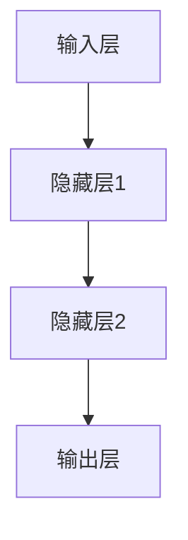
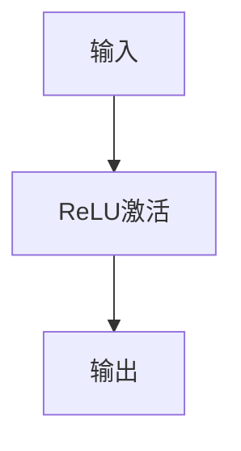
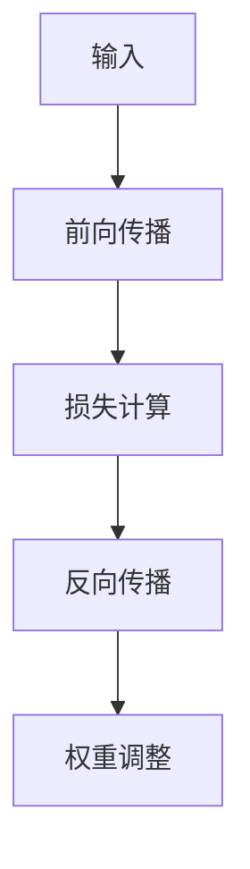

                 

关键词：深度学习、人工智能、计算机算法、数学模型、编程实践

> 摘要：本文将探讨深度学习领域的核心概念、算法原理、数学模型及其在计算机编程中的应用。通过深入分析，旨在揭示深度学习的思想深度，帮助读者从概念理解到实际应用，逐步构建对这一前沿领域的全面认识。

## 1. 背景介绍

深度学习作为人工智能的一个重要分支，已经在过去几十年中取得了显著的发展。它通过模仿人脑的神经网络结构，利用大量数据训练模型，从而实现对复杂数据的自动学习和理解。随着计算能力的提升和大数据技术的发展，深度学习在图像识别、自然语言处理、语音识别等多个领域取得了突破性的成果。

本文旨在通过对深度学习核心概念和算法的深入探讨，帮助读者理解其内在逻辑和理论基础，并掌握实际编程中的具体应用方法。通过对数学模型的详细解释和代码实例的演示，本文将展示如何将深度学习理论知识转化为实际操作技能。

## 2. 核心概念与联系

### 2.1. 神经网络

神经网络是深度学习的基础，其核心思想是通过模拟人脑神经元之间的连接，实现对数据的处理和分析。一个简单的神经网络包括输入层、隐藏层和输出层。输入层接收外部数据，隐藏层进行数据变换和特征提取，输出层产生最终的结果。



### 2.2. 激活函数

激活函数是神经网络中的一个关键元素，用于引入非线性因素，使得神经网络能够处理更复杂的问题。常见的激活函数包括sigmoid、ReLU和tanh等。



### 2.3. 反向传播算法

反向传播算法是深度学习训练过程中的核心算法，通过计算损失函数对网络参数的偏导数，不断调整网络权重，以最小化损失函数。这一过程包括前向传播和反向传播两个阶段。



## 3. 核心算法原理 & 具体操作步骤

### 3.1. 算法原理概述

深度学习的核心算法是基于梯度下降法，通过最小化损失函数来训练神经网络。损失函数通常定义为输出值与真实值之间的误差。训练过程分为以下几个步骤：

1. 初始化网络参数。
2. 前向传播：输入数据通过网络，计算输出。
3. 计算损失函数。
4. 反向传播：计算损失函数对网络参数的梯度。
5. 更新网络参数。

### 3.2. 算法步骤详解

1. **初始化网络参数**：随机初始化网络的权重和偏置。

   ```python
   # 初始化权重
   W = np.random.randn(n hidden units, input size)
   b = np.random.randn(n hidden units, 1)
   ```

2. **前向传播**：输入数据通过网络，计算输出。

   ```python
   # 前向传播
   Z = X.dot(W) + b
   A = sigmoid(Z)
   ```

3. **计算损失函数**：计算输出值与真实值之间的误差。

   ```python
   # 计算损失函数
   cost = -1/m * (Y * log(A) + (1 - Y) * log(1 - A))
   ```

4. **反向传播**：计算损失函数对网络参数的梯度。

   ```python
   # 反向传播
   dZ = A - Y
   dW = (1/m) * X.T.dot(dZ)
   db = (1/m) * np.sum(dZ, axis=1, keepdims=True)
   ```

5. **更新网络参数**：根据梯度调整网络参数。

   ```python
   # 更新参数
   W = W - alpha * dW
   b = b - alpha * db
   ```

### 3.3. 算法优缺点

**优点**：
- 能够自动从数据中提取特征，减少人工设计特征的需求。
- 在处理大规模数据和高维特征时表现优秀。

**缺点**：
- 训练过程复杂，计算成本高。
- 需要大量数据进行训练，对数据质量和数量要求较高。

### 3.4. 算法应用领域

深度学习在图像识别、自然语言处理、语音识别、推荐系统等多个领域有着广泛的应用。例如，在图像识别中，卷积神经网络（CNN）已经被广泛应用于人脸识别、物体检测等任务。

## 4. 数学模型和公式 & 详细讲解 & 举例说明

### 4.1. 数学模型构建

深度学习中的数学模型主要包括神经网络架构、损失函数和优化算法。以下是这些模型的简要概述：

1. **神经网络架构**：由输入层、隐藏层和输出层组成，各层通过权重和偏置进行连接。
   
2. **损失函数**：用于衡量预测值与真实值之间的差距，常用的有均方误差（MSE）、交叉熵损失等。

3. **优化算法**：用于更新网络参数，常见的有梯度下降、Adam优化器等。

### 4.2. 公式推导过程

以梯度下降法为例，推导过程如下：

假设损失函数为 $J(\theta) = \frac{1}{2m}\sum_{i=1}^{m}(h_\theta(x^{(i)}) - y^{(i)})^2$，其中 $h_\theta(x) = \sigma(\theta^T x + b)$，$\sigma$ 为激活函数，$\theta$ 和 $b$ 分别为权重和偏置。

1. **前向传播**：

   $$ h_\theta(x^{(i)}) = \sigma(\theta^T x^{(i)} + b) $$

2. **计算损失函数**：

   $$ J(\theta) = \frac{1}{2m}\sum_{i=1}^{m}(h_\theta(x^{(i)}) - y^{(i)})^2 $$

3. **反向传播**：

   $$ \frac{\partial J(\theta)}{\partial \theta} = \frac{1}{m}\sum_{i=1}^{m}(h_\theta(x^{(i)}) - y^{(i)}) \cdot x^{(i)} $$
   $$ \frac{\partial J(\theta)}{\partial b} = \frac{1}{m}\sum_{i=1}^{m}(h_\theta(x^{(i)}) - y^{(i)}) $$

4. **更新参数**：

   $$ \theta = \theta - \alpha \cdot \frac{\partial J(\theta)}{\partial \theta} $$
   $$ b = b - \alpha \cdot \frac{\partial J(\theta)}{\partial b} $$

### 4.3. 案例分析与讲解

以下是一个简单的线性回归问题，其中 $X$ 为输入特征，$Y$ 为真实值，$h_\theta(x) = \theta_0 + \theta_1 x$。

1. **前向传播**：

   $$ h_\theta(x) = \theta_0 + \theta_1 x $$

2. **计算损失函数**：

   $$ J(\theta) = \frac{1}{2m}\sum_{i=1}^{m}(h_\theta(x^{(i)}) - y^{(i)})^2 = \frac{1}{2m}\sum_{i=1}^{m}((\theta_0 + \theta_1 x^{(i)}) - y^{(i)})^2 $$

3. **反向传播**：

   $$ \frac{\partial J(\theta)}{\partial \theta_0} = \frac{1}{m}\sum_{i=1}^{m}((\theta_0 + \theta_1 x^{(i)}) - y^{(i)}) $$
   $$ \frac{\partial J(\theta)}{\partial \theta_1} = \frac{1}{m}\sum_{i=1}^{m}((\theta_0 + \theta_1 x^{(i)}) - y^{(i)}) \cdot x^{(i)} $$

4. **更新参数**：

   $$ \theta_0 = \theta_0 - \alpha \cdot \frac{1}{m}\sum_{i=1}^{m}((\theta_0 + \theta_1 x^{(i)}) - y^{(i)}) $$
   $$ \theta_1 = \theta_1 - \alpha \cdot \frac{1}{m}\sum_{i=1}^{m}((\theta_0 + \theta_1 x^{(i)}) - y^{(i)}) \cdot x^{(i)} $$

## 5. 项目实践：代码实例和详细解释说明

### 5.1. 开发环境搭建

在本项目中，我们将使用Python编程语言和TensorFlow深度学习框架进行开发。请确保已经安装了Python和TensorFlow。

### 5.2. 源代码详细实现

以下是一个简单的线性回归问题代码实现：

```python
import numpy as np
import tensorflow as tf

# 初始化参数
theta_0 = tf.Variable(0.0, name="theta_0")
theta_1 = tf.Variable(0.0, name="theta_1")

# 定义输入和输出
x = tf.placeholder(tf.float32, shape=[None])
y = tf.placeholder(tf.float32, shape=[None])

# 定义模型
h_theta = theta_0 + theta_1 * x
loss = tf.reduce_mean(tf.square(h_theta - y))

# 定义优化器
optimizer = tf.train.GradientDescentOptimizer(learning_rate=0.01)
train_op = optimizer.minimize(loss)

# 搭建计算图
with tf.Session() as sess:
  sess.run(tf.global_variables_initializer())
  for step in range(1000):
    sess.run(train_op, feed_dict={x: x_data, y: y_data})
    if step % 100 == 0:
      print("Step:", step, "Loss:", sess.run(loss, feed_dict={x: x_data, y: y_data}))

  # 输出最终参数
  print("Final parameters:", sess.run([theta_0, theta_1]))
```

### 5.3. 代码解读与分析

1. **导入库和初始化参数**：首先导入必要的库，并初始化参数。

2. **定义输入和输出**：使用TensorFlow的占位符（placeholder）定义输入和输出。

3. **定义模型**：根据线性回归模型定义前向传播过程。

4. **计算损失函数**：计算均方误差（MSE）作为损失函数。

5. **定义优化器**：使用梯度下降优化器。

6. **搭建计算图**：创建TensorFlow计算图，并初始化全局变量。

7. **训练模型**：通过迭代训练模型，并打印训练过程中的损失值。

8. **输出最终参数**：训练完成后，输出最终的参数值。

### 5.4. 运行结果展示

在训练完成后，我们可以看到损失值逐渐减小，最终收敛到一个较小的值。最终输出的参数值即为模型的权重和偏置。

## 6. 实际应用场景

深度学习在实际应用中有着广泛的应用。以下是一些常见的应用场景：

- **图像识别**：利用卷积神经网络（CNN）进行图像分类、目标检测和图像生成。
- **自然语言处理**：使用循环神经网络（RNN）和变换器（Transformer）进行文本分类、机器翻译和情感分析。
- **语音识别**：结合深度学习和传统的声学模型，实现语音识别和语音合成。

### 6.4. 未来应用展望

随着深度学习技术的不断发展，未来应用前景广阔。以下是一些可能的发展趋势：

- **更高效的算法**：通过改进算法结构和优化计算方式，提高深度学习的训练效率和性能。
- **跨模态学习**：结合多种数据类型（如图像、文本和语音），实现更复杂的任务。
- **自主决策系统**：通过深度学习，构建具有自主决策能力的智能系统，应用于自动驾驶、智能制造等领域。

## 7. 工具和资源推荐

### 7.1. 学习资源推荐

- **《深度学习》**：Goodfellow、Bengio和Courville合著的经典教材，全面介绍了深度学习的理论基础和应用实践。
- **Udacity的深度学习纳米学位**：提供一系列在线课程，涵盖深度学习的核心知识和实践技能。

### 7.2. 开发工具推荐

- **TensorFlow**：Google开发的开源深度学习框架，支持多种平台和编程语言。
- **PyTorch**：由Facebook开发的开源深度学习框架，提供灵活的动态计算图和丰富的API。

### 7.3. 相关论文推荐

- **“Deep Learning”**：Goodfellow、Bengio和Courville的论文，详细介绍了深度学习的原理和技术。
- **“AlexNet: Image Classification with Deep Convolutional Neural Networks”**：Alex Krizhevsky等人提出的卷积神经网络，标志着深度学习在图像识别领域的突破。

## 8. 总结：未来发展趋势与挑战

深度学习作为人工智能的重要分支，已经在各个领域取得了显著的成果。然而，面对不断增长的数据量和计算需求，未来深度学习仍将面临以下挑战：

- **计算资源**：深度学习模型通常需要大量的计算资源，如何优化算法和提高计算效率是一个重要课题。
- **数据质量**：深度学习模型的训练依赖于大量高质量的数据，数据清洗和标注是一个关键问题。
- **模型解释性**：深度学习模型通常被视为“黑箱”，如何提高模型的解释性，使其更加透明和可解释是一个重要方向。

未来，随着技术的不断进步和应用的深入，深度学习将在更多领域发挥重要作用，为人类社会带来更多的创新和变革。

## 9. 附录：常见问题与解答

### 9.1. Q：深度学习和机器学习的区别是什么？

A：深度学习是机器学习的一个子领域，主要关注于使用多层神经网络进行数据的自动学习和特征提取。而机器学习则是一个更广泛的概念，包括各种学习算法和技术，如线性回归、支持向量机、决策树等。

### 9.2. Q：如何选择深度学习框架？

A：选择深度学习框架时，需要考虑以下因素：

- **应用需求**：根据项目的具体需求，选择适合的框架，如TensorFlow、PyTorch等。
- **社区支持**：框架的社区支持对于解决问题和获取资源非常重要。
- **性能要求**：根据模型和数据的规模，选择计算性能合适的框架。

### 9.3. Q：如何处理过拟合问题？

A：过拟合是深度学习中的一个常见问题，以下是一些解决方法：

- **增加训练数据**：增加更多的训练样本可以减少过拟合。
- **数据增强**：通过旋转、缩放、裁剪等操作增加数据的多样性。
- **正则化**：引入L1、L2正则化项，减少模型参数的权重。
- **Dropout**：在训练过程中随机丢弃一部分神经元，减少模型的依赖性。

---

**作者：禅与计算机程序设计艺术 / Zen and the Art of Computer Programming**

