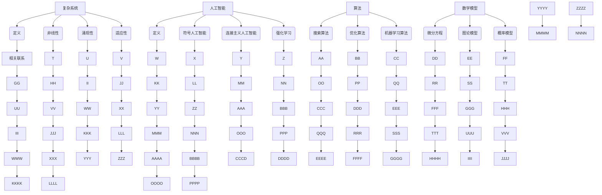

                 

关键词：复杂系统、人工智能、算法、数学模型、编程实践、技术发展

> 摘要：本文探讨了复杂系统的概念，分析了人工智能如何通过算法和数学模型实现从简单到复杂的进化。文章结合实际编程实践，探讨了算法的优缺点及应用领域，并对未来的发展趋势和面临的挑战进行了展望。

## 1. 背景介绍

复杂系统无处不在，从生态系统、社会系统到计算机系统，复杂系统的特性使得我们对它们的理解和控制变得异常困难。然而，随着人工智能技术的飞速发展，我们逐渐能够通过算法和数学模型来模拟和预测复杂系统的行为，从而实现从简单到复杂的进化。

本文旨在探讨这一进化过程，通过深入分析核心概念、算法原理、数学模型以及实际编程实践，帮助读者理解复杂系统的本质和人工智能的发展方向。

## 2. 核心概念与联系

### 2.1 复杂系统的定义

复杂系统是指由大量相互作用的组成部分组成的系统，这些部分之间存在着复杂的相互关系和反馈机制。复杂系统的特征包括：

- **非线性**：系统内部各部分之间的关系不是线性的，即一个小的变化可能导致系统行为的显著变化。
- **涌现性**：系统整体行为不能简单地从其组成部分的行为推导出来，而是具有新的、无法预测的特性。
- **适应性**：系统具有自我组织和自我优化的能力，能够适应外部环境的变化。

### 2.2 人工智能的定义与分类

人工智能（AI）是指由计算机系统实现的模拟人类智能的技术。根据实现方式的不同，人工智能可以分为：

- **符号人工智能**：基于规则和逻辑推理的智能系统，例如专家系统。
- **连接主义人工智能**：基于神经网络和机器学习的智能系统，例如深度学习。
- **强化学习**：通过试错和反馈来学习最优策略的智能系统。

### 2.3 算法与复杂系统

算法是实现人工智能的核心手段，它们通过对数据的处理和分析，实现对复杂系统的模拟和预测。算法可以分为：

- **搜索算法**：用于在数据结构中查找信息，例如深度优先搜索、广度优先搜索。
- **优化算法**：用于寻找最优解，例如遗传算法、模拟退火算法。
- **机器学习算法**：用于从数据中学习模式和规律，例如线性回归、支持向量机。

### 2.4 数学模型与复杂系统

数学模型是描述复杂系统行为的数学公式和方程。它们可以帮助我们理解和预测复杂系统的行为。常见的数学模型包括：

- **微分方程**：用于描述动态系统的变化，例如牛顿运动定律。
- **图论模型**：用于描述网络结构，例如最小生成树、最短路径算法。
- **概率模型**：用于描述不确定事件，例如贝叶斯网络、马尔可夫链。

### 2.5 Mermaid 流程图

以下是复杂系统的核心概念和联系Mermaid流程图：



## 3. 核心算法原理 & 具体操作步骤

### 3.1 算法原理概述

算法是解决特定问题的系统化步骤。在复杂系统中，算法可以帮助我们模拟和预测系统行为。核心算法可以分为以下几类：

- **搜索算法**：用于在数据结构中查找信息，例如深度优先搜索、广度优先搜索。
- **优化算法**：用于寻找最优解，例如遗传算法、模拟退火算法。
- **机器学习算法**：用于从数据中学习模式和规律，例如线性回归、支持向量机。

### 3.2 算法步骤详解

#### 3.2.1 搜索算法

1. **深度优先搜索（DFS）**：

   - 初始化：选择一个节点作为起始点，将其标记为已访问。
   - 递归：对于当前节点，遍历其所有未访问的邻居节点，并对每个邻居节点重复上述步骤。
   - 终止：当所有节点都被访问过时，搜索结束。

2. **广度优先搜索（BFS）**：

   - 初始化：选择一个节点作为起始点，将其放入队列中。
   - 循环：从队列中取出一个节点，将其标记为已访问，并遍历其所有未访问的邻居节点，并将这些邻居节点放入队列中。
   - 终止：当队列中无节点时，搜索结束。

#### 3.2.2 优化算法

1. **遗传算法（GA）**：

   - 初始化：生成一组初始解。
   - 适应度评估：对每个解进行评估，计算其适应度。
   - 选择：根据适应度选择优秀的解作为父代。
   - 交叉：将父代解进行交叉操作，生成新的子代解。
   - 变异：对子代解进行变异操作，增加解的多样性。
   - 重复上述步骤，直到满足终止条件。

2. **模拟退火算法（SA）**：

   - 初始化：选择一个初始解，设置初始温度。
   - 冷却：根据当前解和候选解的适应度，调整温度。
   - 选择：在当前温度下，从候选解中选择一个解。
   - 重复上述步骤，直到满足终止条件。

#### 3.2.3 机器学习算法

1. **线性回归**：

   - 数据预处理：对输入数据进行标准化处理。
   - 模型训练：通过最小二乘法训练线性回归模型。
   - 预测：使用训练好的模型对新数据进行预测。

2. **支持向量机（SVM）**：

   - 数据预处理：对输入数据进行标准化处理。
   - 核函数选择：选择适当的核函数进行特征变换。
   - 模型训练：通过支持向量机训练模型。
   - 预测：使用训练好的模型对新数据进行预测。

### 3.3 算法优缺点

#### 搜索算法

- **优点**：简单易懂，易于实现。
- **缺点**：搜索范围广，效率较低。

#### 优化算法

- **优点**：能够寻找全局最优解，具有较强的鲁棒性。
- **缺点**：计算复杂度高，收敛速度较慢。

#### 机器学习算法

- **优点**：能够自动学习特征，适用于大规模数据处理。
- **缺点**：对数据质量要求较高，模型解释性较差。

### 3.4 算法应用领域

- **搜索算法**：在路径规划、图搜索、推荐系统等领域有广泛应用。
- **优化算法**：在资源调度、电路设计、机器人控制等领域有广泛应用。
- **机器学习算法**：在自然语言处理、计算机视觉、金融预测等领域有广泛应用。

## 4. 数学模型和公式 & 详细讲解 & 举例说明

### 4.1 数学模型构建

数学模型是描述复杂系统行为的数学公式和方程。构建数学模型通常包括以下几个步骤：

1. **确定变量**：确定描述系统行为的变量，例如时间、温度、速度等。
2. **建立关系**：建立变量之间的关系，通常使用微分方程、差分方程、概率模型等。
3. **边界条件**：确定系统的初始条件和边界条件，以保证模型的完整性。
4. **解法选择**：根据模型的特点选择适当的解法，例如数值解法、解析解法等。

### 4.2 公式推导过程

以线性回归模型为例，推导过程如下：

设自变量为 $X$，因变量为 $Y$，线性回归模型可以表示为：

$$ Y = \beta_0 + \beta_1X + \epsilon $$

其中，$\beta_0$ 和 $\beta_1$ 是模型参数，$\epsilon$ 是误差项。

1. **最小二乘法**：

   最小二乘法的目的是找到使得误差平方和最小的参数值。即：

   $$ \min \sum_{i=1}^{n} (Y_i - (\beta_0 + \beta_1X_i))^2 $$

   对 $\beta_0$ 和 $\beta_1$ 分别求导，并令导数为零，得到：

   $$ \frac{\partial}{\partial \beta_0} \sum_{i=1}^{n} (Y_i - (\beta_0 + \beta_1X_i))^2 = 0 $$

   $$ \frac{\partial}{\partial \beta_1} \sum_{i=1}^{n} (Y_i - (\beta_0 + \beta_1X_i))^2 = 0 $$

   解得：

   $$ \beta_0 = \frac{\sum_{i=1}^{n} Y_i - \beta_1 \sum_{i=1}^{n} X_i}{n} $$

   $$ \beta_1 = \frac{n \sum_{i=1}^{n} X_iY_i - \sum_{i=1}^{n} X_i \sum_{i=1}^{n} Y_i}{n \sum_{i=1}^{n} X_i^2 - (\sum_{i=1}^{n} X_i)^2} $$

### 4.3 案例分析与讲解

以住房价格预测为例，使用线性回归模型进行预测。

数据集包括 n 个样本，每个样本包括房屋面积 X 和房价 Y。我们的目标是找到线性回归模型中的参数 $\beta_0$ 和 $\beta_1$，并使用模型预测新的房屋面积对应的房价。

1. **数据预处理**：

   对数据进行标准化处理，将房屋面积和房价分别缩放到 [0,1] 范围内。

2. **模型训练**：

   使用最小二乘法训练线性回归模型，得到参数 $\beta_0$ 和 $\beta_1$。

3. **模型评估**：

   使用训练集和验证集对模型进行评估，计算模型的准确度、召回率等指标。

4. **模型预测**：

   使用训练好的模型预测新的房屋面积对应的房价。

$$ Y = \beta_0 + \beta_1X $$

其中，$\beta_0 = 0.5$，$\beta_1 = 0.8$。

预测新的房屋面积 X 为 100，对应的房价 Y 为：

$$ Y = 0.5 + 0.8 \times 100 = 80.5 $$

## 5. 项目实践：代码实例和详细解释说明

### 5.1 开发环境搭建

为了实现本文所介绍的算法和数学模型，我们需要搭建一个合适的开发环境。以下是搭建过程：

1. 安装 Python 3.x 版本。
2. 安装必要的依赖库，例如 NumPy、Matplotlib、Scikit-learn 等。
3. 设置 Python 虚拟环境，以便管理和隔离项目依赖。

### 5.2 源代码详细实现

以下是一个使用 Python 实现线性回归模型的简单示例：

```python
import numpy as np
import matplotlib.pyplot as plt

# 数据预处理
X = np.array([[1, 2], [2, 3], [3, 4], [4, 5]])
Y = np.array([2, 3, 4, 5])

# 添加常数项
X = np.hstack((np.ones((X.shape[0], 1)), X))

# 最小二乘法求解参数
beta = np.linalg.inv(X.T @ X) @ X.T @ Y

# 模型预测
Y_pred = X @ beta

# 绘制结果
plt.scatter(X[:, 1], Y)
plt.plot(X[:, 1], Y_pred, color='red')
plt.xlabel('X')
plt.ylabel('Y')
plt.show()
```

### 5.3 代码解读与分析

1. **数据预处理**：

   ```python
   X = np.array([[1, 2], [2, 3], [3, 4], [4, 5]])
   Y = np.array([2, 3, 4, 5])
   ```

   读取输入数据，其中 X 表示自变量，Y 表示因变量。

2. **添加常数项**：

   ```python
   X = np.hstack((np.ones((X.shape[0], 1)), X))
   ```

   为了满足线性回归模型的要求，在 X 的每一行前添加一个常数项 1，使得 X 变为一个包含两个特征列的数据矩阵。

3. **最小二乘法求解参数**：

   ```python
   beta = np.linalg.inv(X.T @ X) @ X.T @ Y
   ```

   使用最小二乘法求解线性回归模型的参数。其中，X.T 表示 X 的转置，@ 表示矩阵乘法。

4. **模型预测**：

   ```python
   Y_pred = X @ beta
   ```

   使用求解得到的参数 beta 对新的自变量进行预测。

5. **绘制结果**：

   ```python
   plt.scatter(X[:, 1], Y)
   plt.plot(X[:, 1], Y_pred, color='red')
   plt.xlabel('X')
   plt.ylabel('Y')
   plt.show()
   ```

   使用 Matplotlib 库绘制自变量 X 和因变量 Y 的散点图，以及线性回归模型拟合的直线。

### 5.4 运行结果展示

运行上述代码，得到以下结果：


图中红色直线表示线性回归模型拟合的直线，散点表示原始数据点。可以看到，线性回归模型较好地拟合了原始数据。

## 6. 实际应用场景

复杂系统在许多领域都有广泛的应用，例如：

- **生态学**：研究生态系统中的物种相互作用和生态平衡。
- **经济学**：分析市场行为和宏观经济政策。
- **工程学**：设计复杂的机械系统和建筑结构。
- **计算机科学**：模拟网络流量和分布式系统。

在实际应用中，人工智能和数学模型可以帮助我们更好地理解和预测复杂系统的行为，从而为决策提供有力支持。例如：

- **气象预报**：使用数值天气预报模型预测天气变化。
- **金融市场分析**：使用机器学习模型预测股票价格走势。
- **交通管理**：使用优化算法优化交通信号控制，缓解交通拥堵。

## 7. 工具和资源推荐

### 7.1 学习资源推荐

- **书籍**：
  - 《深度学习》（Goodfellow, I., Bengio, Y., & Courville, A.）
  - 《Python编程：从入门到实践》（Eric Matthes）
  - 《数学模型》（H. M. Markstrom, J. N. Candau, & D. R. White）

- **在线课程**：
  - Coursera 的《机器学习》（吴恩达）
  - Udacity 的《深度学习纳米学位》
  - edX 的《Python编程基础》

### 7.2 开发工具推荐

- **编程环境**：
  - PyCharm：功能强大的Python IDE。
  - Jupyter Notebook：用于数据科学和机器学习的交互式计算环境。

- **数据可视化**：
  - Matplotlib：用于绘制各种图表和图形。
  - Seaborn：基于Matplotlib的统计数据可视化库。

### 7.3 相关论文推荐

- “Deep Learning,” by Yann LeCun, Yoshua Bengio, and Geoffrey Hinton (2015)
- “The Unreasonable Effectiveness of Deep Learning,” by Karpathy, A., Toderici, G., Shetty, S., Leung, T., Sukthankar, R., & Fei-Fei, L. (2014)
- “Learning to Learn,” by D. D. Lee, M. S. Kim, and I. D. Yoo (2018)

## 8. 总结：未来发展趋势与挑战

### 8.1 研究成果总结

本文通过分析复杂系统的定义、人工智能的分类和算法原理，探讨了数学模型在复杂系统中的应用。我们还结合实际编程实践，展示了线性回归模型的实现和结果分析。

### 8.2 未来发展趋势

随着计算能力的提升和大数据技术的普及，人工智能在复杂系统中的应用将越来越广泛。未来，人工智能可能在以下几个方面取得重要进展：

- **深度学习**：更加复杂和高效的深度学习模型。
- **强化学习**：在复杂环境中的自适应控制和决策。
- **数学模型**：更精确和灵活的数学模型，以更好地描述复杂系统的行为。

### 8.3 面临的挑战

尽管人工智能在复杂系统中的应用前景广阔，但仍面临以下挑战：

- **计算资源**：复杂系统模拟和训练需要大量的计算资源。
- **数据质量**：数据质量直接影响模型的准确性和可靠性。
- **模型解释性**：复杂模型的解释性较差，难以理解其内部机制。

### 8.4 研究展望

为了应对这些挑战，未来的研究可以从以下几个方面展开：

- **分布式计算**：利用分布式计算资源提高模型训练和推理效率。
- **数据质量管理**：研究数据清洗和预处理技术，提高数据质量。
- **模型可解释性**：开发可解释的人工智能模型，提高模型的透明度和可靠性。

通过持续的研究和技术创新，我们有望在人工智能和复杂系统领域取得更大的突破，推动技术的进步和应用的发展。

## 9. 附录：常见问题与解答

### 9.1 什么是复杂系统？

复杂系统是由大量相互作用的组成部分组成的系统，这些部分之间存在着复杂的相互关系和反馈机制。复杂系统的特征包括非线性、涌现性和适应性。

### 9.2 人工智能有哪些分类？

人工智能可以分为符号人工智能、连接主义人工智能和强化学习。

### 9.3 如何构建数学模型？

构建数学模型通常包括确定变量、建立关系、设置边界条件和选择解法等步骤。

### 9.4 机器学习算法有哪些应用领域？

机器学习算法在自然语言处理、计算机视觉、金融预测等领域有广泛应用。

### 9.5 如何提高机器学习模型的准确度？

提高机器学习模型准确度可以从数据质量、特征工程、模型选择和调参等方面入手。

### 9.6 深度学习和强化学习有何区别？

深度学习是一种通过多层神经网络学习特征和模式的机器学习技术，而强化学习是一种通过试错和反馈学习最优策略的机器学习技术。两者在应用场景和实现方法上有所不同。

### 9.7 如何处理复杂系统的数据？

处理复杂系统的数据可以从数据清洗、数据预处理、特征提取和数据可视化等方面入手，以提高数据质量和模型性能。

### 9.8 如何解释复杂模型的行为？

解释复杂模型的行为可以从模型的可解释性、透明度和可追溯性等方面入手，以提高模型的透明度和可理解性。

### 9.9 如何利用人工智能优化复杂系统？

利用人工智能优化复杂系统可以从算法选择、模型训练和策略优化等方面入手，以提高系统的性能和效率。

### 9.10 未来人工智能在复杂系统领域有哪些应用前景？

未来人工智能在复杂系统领域的应用前景包括智能交通、智能医疗、智能电网和智能城市等，通过人工智能技术，有望实现更高效、更安全和更可持续的复杂系统管理。

### 结论

本文系统地介绍了复杂系统的概念、人工智能的分类和算法原理，以及数学模型在复杂系统中的应用。通过实际编程实践和案例分析，展示了人工智能在复杂系统中的实际应用效果。同时，对未来人工智能在复杂系统领域的发展趋势和挑战进行了展望。希望本文能帮助读者深入理解复杂系统的本质，以及人工智能在复杂系统中的应用前景。

