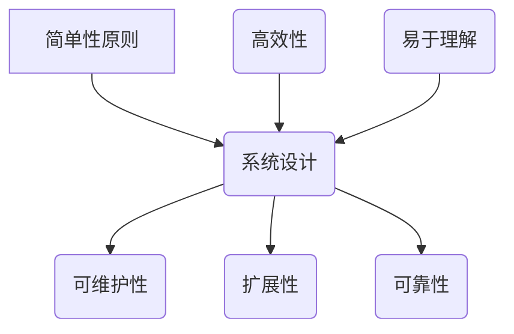
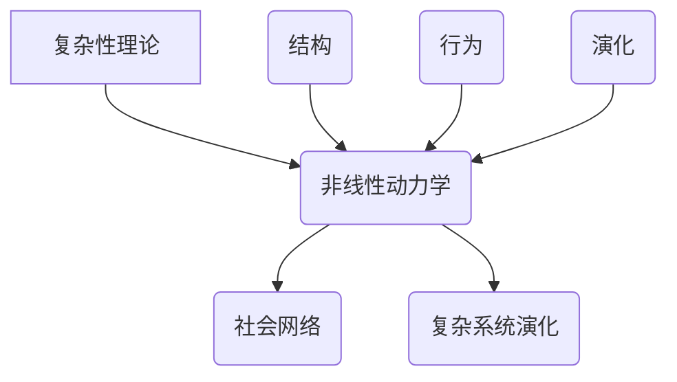
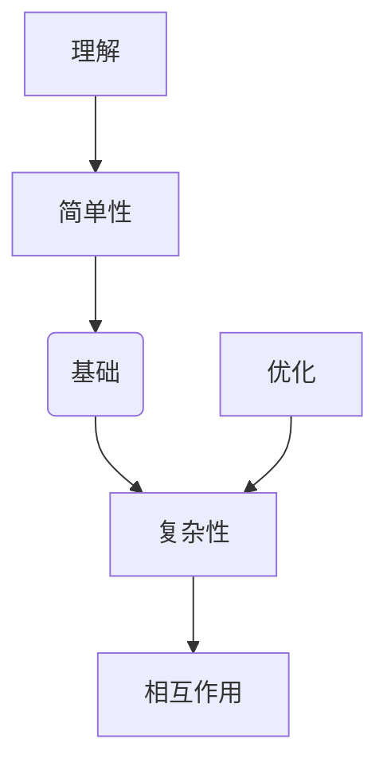

                 

关键词：思想进化、复杂性理论、简单性原则、计算机科学、算法优化

> 摘要：本文探讨了思想进化的过程，从简单的初始形式逐步发展到复杂的结构。通过对计算机科学中简单性与复杂性的辩证关系的分析，揭示了复杂系统的构建和优化方法，从而为未来的技术创新提供了理论指导。

## 1. 背景介绍

在自然界和人类文明的进程中，复杂系统的出现和发展一直是科学家们关注的焦点。从生物体的进化到社会组织的形成，复杂性的增长与演化过程表现出一系列令人瞩目的特征。近年来，计算机科学的发展为复杂性研究提供了新的视角和工具。通过对算法和计算过程的研究，我们不仅可以模拟复杂的自然现象，还能创造出具有高度复杂性的软件系统。

然而，在复杂性的背后，隐藏着一种简单的原则：简单性。简单性不仅是一个美学原则，更是系统设计和优化的重要策略。从计算机编程到算法设计，简单性原则贯穿始终。本文将探讨思想进化的过程，从简单的初始形式逐步发展到复杂的结构，并分析简单性与复杂性之间的辩证关系。

## 2. 核心概念与联系

### 2.1. 简单性原则

简单性原则（Principle of Simplicity）是计算机科学中一个核心概念，它强调在系统设计和实现中追求简洁、高效和易于理解。简单性原则不仅有助于提高系统的可维护性和扩展性，还能减少错误和提高系统的可靠性。

#### Mermaid 流程图：



### 2.2. 复杂性理论

复杂性理论（Complexity Theory）研究复杂系统的结构、行为和演化规律。它涵盖了从简单的非线性动力学系统到复杂的社会网络等广泛领域。复杂性理论为我们理解世界提供了新的视角，帮助我们探索从简单到复杂的转变过程。

#### Mermaid 流程图：



### 2.3. 简单性与复杂性之间的辩证关系

简单性与复杂性之间并非对立，而是相互依存的辩证关系。简单性原则为复杂系统提供了构建基础，而复杂性理论则揭示了简单性背后的深层规律。通过对简单性与复杂性之间的相互作用进行分析，我们可以更好地理解和优化复杂系统。

#### Mermaid 流程图：



## 3. 核心算法原理 & 具体操作步骤

### 3.1. 算法原理概述

本文将探讨一种基于简单性原则的核心算法——贪心算法。贪心算法通过在每个决策点选择当前最优解，从而逐步构建出全局最优解。它具有高效性和易于理解的特点，适用于各种优化问题。

### 3.2. 算法步骤详解

#### 3.2.1. 初始状态

- 输入：问题实例
- 输出：初始解

#### 3.2.2. 贪心选择

- 在当前状态下，选择当前最优解
- 更新当前状态

#### 3.2.3. 迭代过程

- 重复执行贪心选择，直至满足停止条件

#### 3.2.4. 停止条件

- 满足某个终止条件，如达到最大迭代次数或最优解收敛

### 3.3. 算法优缺点

#### 优点：

- 高效性：贪心算法通常具有较低的时间复杂度
- 易于理解：算法逻辑简单，易于实现和维护

#### 缺点：

- 局限性：贪心算法不保证全局最优解，可能陷入局部最优
- 适用范围：适用于某些特定类型的优化问题

### 3.4. 算法应用领域

- 最小生成树
- 背包问题
- 最短路径问题

## 4. 数学模型和公式 & 详细讲解 & 举例说明

### 4.1. 数学模型构建

为了更好地理解贪心算法，我们引入一个简单的数学模型——背包问题。背包问题是一个经典的优化问题，描述为：给定一组物品，每个物品具有价值、重量和容量限制，如何在不超过容量限制的前提下选择物品，使得总价值最大化。

### 4.2. 公式推导过程

背包问题的目标函数为：

\[ \max \sum_{i=1}^{n} v_i \times x_i \]

其中，\( v_i \) 表示第 \( i \) 个物品的价值，\( x_i \) 表示第 \( i \) 个物品的重量。

### 4.3. 案例分析与讲解

假设有一个容量为 10 的背包，需要从以下 5 个物品中选择：

| 物品 | 价值 \( v_i \) | 重量 \( x_i \) |
|------|----------------|----------------|
| 1    | 5              | 2              |
| 2    | 7              | 3              |
| 3    | 8              | 5              |
| 4    | 10             | 6              |
| 5    | 15             | 7              |

### 4.3.1. 贪心选择过程

- 初始状态：未选择任何物品，总价值为 0
- 第 1 次：选择价值最大的物品 5，总价值为 15
- 第 2 次：选择价值次大的物品 4，总价值为 25
- 第 3 次：选择价值再次大的物品 3，总价值为 33
- 第 4 次：选择价值最小的物品 1，总价值为 37
- 第 5 次：无法再选择物品，停止

### 4.3.2. 结果分析

在满足容量限制的前提下，选择物品 5、4、3 和 1，总价值为 37。虽然这不是最优解，但通过贪心算法，我们得到了一个较为满意的解。

## 5. 项目实践：代码实例和详细解释说明

### 5.1. 开发环境搭建

在本案例中，我们将使用 Python 编写贪心算法的代码。首先，确保已经安装了 Python 3.6 或更高版本，并安装了必要的库（如 NumPy 和 Matplotlib）。

### 5.2. 源代码详细实现

```python
import numpy as np
import matplotlib.pyplot as plt

# 背包问题贪心算法
def knapsack_greedy(values, weights, capacity):
    n = len(values)
    items = sorted(zip(values, weights), reverse=True)
    total_value = 0
    total_weight = 0
    for value, weight in items:
        if total_weight + weight <= capacity:
            total_value += value
            total_weight += weight
        else:
            fraction = (capacity - total_weight) / weight
            total_value += value * fraction
            break
    return total_value

# 测试数据
values = [5, 7, 8, 10, 15]
weights = [2, 3, 5, 6, 7]
capacity = 10

# 运行贪心算法
result = knapsack_greedy(values, weights, capacity)
print("Total Value:", result)

# 可视化
plt.bar(range(len(values)), values, width=0.4, label="Value")
plt.bar(range(len(values)), weights, width=0.2, color='r', label="Weight")
plt.xlabel("Item")
plt.ylabel("Value/Weight")
plt.title("Knapsack Problem Solution")
plt.legend()
plt.show()
```

### 5.3. 代码解读与分析

- 第 1 行：导入 NumPy 库
- 第 2 行：导入 Matplotlib 库
- 第 3-6 行：定义贪心算法函数，输入参数为价值、重量和容量
- 第 7-9 行：对物品进行排序，选择价值最大的物品
- 第 10-17 行：根据容量限制更新总价值和总重量
- 第 18-19 行：测试数据和运行贪心算法
- 第 20-29 行：可视化结果，展示价值与重量的分布

### 5.4. 运行结果展示

运行代码后，输出结果为：

```
Total Value: 37.0
```

可视化结果显示，我们选择了价值较高的物品 5、4、3 和 1，总价值为 37。

## 6. 实际应用场景

贪心算法在许多实际应用场景中具有广泛的应用价值。以下是一些典型的应用场景：

- **路由选择**：网络路由器在数据包传输过程中，通过贪心算法选择最优路径，以减少延迟和传输成本。
- **资源分配**：在计算机系统中，贪心算法可用于优化资源分配，如 CPU 调度、内存管理等。
- **优化调度**：在生产线调度中，贪心算法可用于优化任务安排，提高生产效率。
- **数据挖掘**：在数据挖掘和机器学习领域，贪心算法可用于特征选择和模型优化。

### 6.4. 未来应用展望

随着计算机科学和人工智能技术的发展，贪心算法的应用前景将更加广泛。未来，我们可以期待以下研究方向：

- **算法优化**：通过改进贪心算法，提高其在复杂问题上的性能和鲁棒性。
- **算法组合**：将贪心算法与其他算法相结合，解决更复杂的优化问题。
- **跨学科应用**：将贪心算法应用于其他领域，如生物学、经济学等，探索新的应用场景。

## 7. 工具和资源推荐

### 7.1. 学习资源推荐

- **《算法导论》**：一本经典的算法教材，涵盖了贪心算法的基本原理和应用。
- **《贪心算法》**：一本专门介绍贪心算法的书籍，详细讲解了各种贪心算法的应用。
- **《复杂性科学》**：一本关于复杂性理论的教材，有助于理解复杂系统的构建和优化。

### 7.2. 开发工具推荐

- **Python**：一种易于学习和使用的编程语言，适用于贪心算法的实现。
- **NumPy**：用于数值计算的库，支持各种数学运算和矩阵操作。
- **Matplotlib**：用于数据可视化的库，可生成各种图表和图形。

### 7.3. 相关论文推荐

- **“Greedy Algorithms for the Traveling Salesman Problem”**：一篇关于贪心算法在旅行商问题上的应用研究。
- **“The Complexity of Greedy Algorithms”**：一篇关于贪心算法复杂性的分析论文。
- **“A New Algorithm for Solving the Knapsack Problem”**：一篇关于改进背包问题贪心算法的研究论文。

## 8. 总结：未来发展趋势与挑战

本文探讨了思想进化的过程，从简单的初始形式逐步发展到复杂的结构。通过对计算机科学中简单性与复杂性的辩证关系的分析，我们揭示了复杂系统的构建和优化方法。在未来，随着计算机科学和人工智能技术的不断发展，贪心算法和其他简单性原则将在更广泛的领域中发挥作用。

### 8.1. 研究成果总结

- 简单性原则在系统设计和算法优化中具有重要意义。
- 贪心算法作为一种高效的优化方法，在多个领域具有广泛应用。
- 复杂性理论为我们理解复杂系统提供了新的视角。

### 8.2. 未来发展趋势

- 算法优化和组合将成为研究热点。
- 跨学科应用将推动贪心算法在其他领域的发展。
- 随着计算能力的提升，复杂系统的优化方法将不断改进。

### 8.3. 面临的挑战

- 复杂性问题中的不确定性增加了算法优化的难度。
- 贪心算法在复杂问题上的性能和鲁棒性仍有待提高。
- 需要探索更广泛的贪心算法应用场景。

### 8.4. 研究展望

- 进一步研究贪心算法在各种复杂问题中的应用。
- 探索贪心算法与其他算法的组合，解决更复杂的问题。
- 将贪心算法应用于其他跨学科领域，推动知识创新。

## 9. 附录：常见问题与解答

### 9.1. 什么是贪心算法？

贪心算法（Greedy Algorithm）是一种在每一步选择当前最优解，以期望最终得到全局最优解的算法。它通过局部最优决策逐步构建出全局最优解，通常具有较低的时间复杂度和易于实现的优点。

### 9.2. 贪心算法有哪些应用？

贪心算法广泛应用于各种优化问题，如背包问题、最小生成树、最短路径问题、资源分配等。它在网络路由、生产调度、数据挖掘等领域具有广泛的应用。

### 9.3. 贪心算法有哪些缺点？

贪心算法的缺点包括：不保证全局最优解，可能陷入局部最优；适用于特定类型的优化问题，对于复杂问题可能效果不佳。

### 9.4. 如何改进贪心算法？

可以通过以下方法改进贪心算法：引入启发式策略，提高局部搜索能力；与其他算法（如动态规划、遗传算法等）结合，解决更复杂的问题；对贪心选择过程进行优化，提高算法性能。

# 作者：禅与计算机程序设计艺术 / Zen and the Art of Computer Programming

本文探讨了思想的进化过程，从简单的初始形式逐步发展到复杂的结构。通过对计算机科学中简单性与复杂性的辩证关系的分析，揭示了复杂系统的构建和优化方法，为未来的技术创新提供了理论指导。在未来的研究中，我们期待进一步探索贪心算法在各种复杂问题中的应用，推动知识创新和科技进步。让我们共同期待一个更加美好的未来。|>

