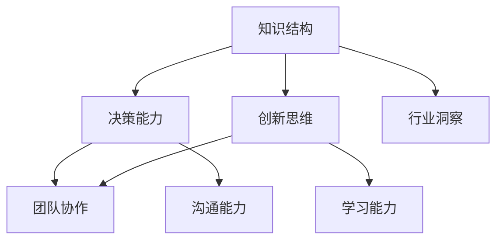
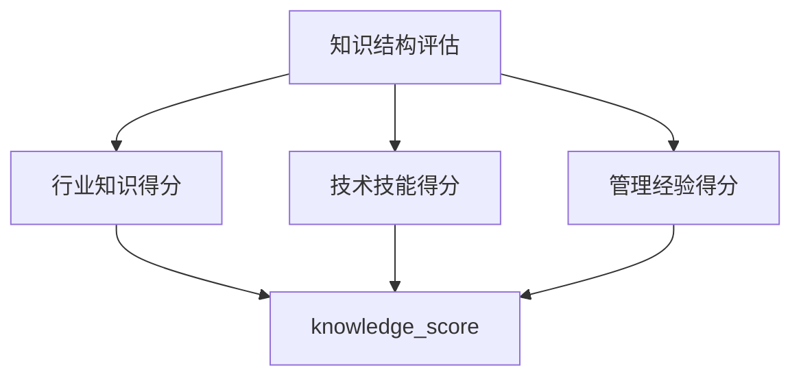

                 

关键词：思维体系、管理者、知识结构、决策能力、创新思维、团队协作

> 摘要：本文深入探讨了如何塑造管理者的思维体系，以提升其知识结构、决策能力和创新思维。通过详细分析核心概念、算法原理、数学模型以及实际应用场景，文章为管理者提供了一套系统的实践方法和工具，以应对复杂多变的管理挑战。文章最后还对未来发展趋势与挑战进行了展望。

## 1. 背景介绍

在当今快速变化和高度竞争的商业环境中，管理者面临的挑战日益复杂。传统的管理方法和技能已经难以应对日益复杂的市场需求和业务环境。因此，塑造一个高效、灵活、具有前瞻性的思维体系成为了管理者的必修课。本文旨在探讨如何通过构建思维体系，提升管理者的知识结构、决策能力和创新思维，以更好地应对管理挑战。

### 管理者的角色与职责

管理者在组织中的作用至关重要。他们不仅要负责制定战略目标，还要确保这些目标的实现。具体来说，管理者的角色和职责包括：

1. **规划与战略**：制定组织的长远规划和战略方向。
2. **领导与激励**：指导和管理团队，激发员工潜力。
3. **决策与执行**：在复杂多变的环境中做出明智的决策，并确保决策得到有效执行。
4. **沟通与协调**：促进组织内部和外部的沟通，确保信息的准确传递。
5. **创新与变革**：推动组织不断创新，适应市场变化。

### 当前管理面临的挑战

随着技术的发展和市场的变化，管理者面临着越来越多的挑战：

1. **信息过载**：大量信息的涌入使得管理者难以快速做出决策。
2. **全球化**：国际市场的复杂性和不确定性要求管理者具备全球视野。
3. **快速变化**：市场和技术变革的速度越来越快，管理者需要具备前瞻性和快速响应能力。
4. **多元化**：团队成员的多元化带来了文化差异和沟通障碍，需要管理者具备更强的跨文化管理能力。
5. **创新压力**：持续创新是组织保持竞争力的关键，管理者需要鼓励创新思维。

## 2. 核心概念与联系

为了塑造一个高效的思维体系，管理者需要理解一系列核心概念和它们之间的联系。以下是一个简化的 Mermaid 流程图，展示了这些概念之间的关系。



### 知识结构

知识结构是管理者思维体系的基础。它包括对行业的深入了解、业务流程的掌握以及相关技术的理解。一个良好的知识结构可以帮助管理者更好地理解业务需求，做出更明智的决策。

### 决策能力

决策能力是管理者不可或缺的技能。它涉及在有限信息和时间压力下做出最佳决策的能力。有效的决策能力不仅取决于逻辑思维和分析能力，还需要具备灵活的应变能力。

### 创新思维

创新思维是管理者在面对复杂问题时的重要工具。它包括发现新机会、创造新解决方案的能力。创新思维能够帮助管理者在竞争激烈的市场中找到新的增长点。

### 团队协作

团队协作能力是管理者成功的关键。一个高效的团队可以充分发挥成员的潜力，实现共同目标。管理者需要能够激励和协调团队成员，建立积极的团队文化。

### 沟通能力

沟通能力是管理者有效执行决策和实现团队目标的重要保障。良好的沟通能力有助于减少误解和冲突，促进团队成员之间的合作。

### 学习能力

学习能力是管理者持续成长的关键。面对不断变化的市场和技术环境，管理者需要不断学习新知识、新技能，以保持竞争力。

### 行业洞察

行业洞察力是管理者对行业动态和趋势的敏锐感知。它有助于管理者把握市场机遇，预见潜在风险，制定更有前瞻性的战略。

## 3. 核心算法原理 & 具体操作步骤

### 3.1 算法原理概述

思维体系的塑造是一个复杂的系统性过程，涉及到多个层面的能力提升。以下是一个简化的算法框架，用于描述如何提升管理者的思维体系：

1. **知识获取**：通过学习获取行业知识、技术技能和管理经验。
2. **逻辑思维**：运用逻辑思维进行问题分析和决策制定。
3. **创新思维**：培养创新思维，寻求新的解决方案和业务模式。
4. **团队协作**：建立高效的团队协作机制，提高团队执行力。
5. **沟通能力**：提升沟通技巧，增强团队凝聚力。
6. **持续学习**：不断学习新知识，适应环境变化。

### 3.2 算法步骤详解

1. **知识获取**：通过阅读书籍、参加培训、研讨会、网络课程等方式获取知识。制定学习计划，确保学习的系统性和深度。
2. **逻辑思维**：通过逻辑推理、数据分析和案例研究等方法锻炼逻辑思维能力。在面对问题时，运用逻辑思维进行深入分析和决策。
3. **创新思维**：通过头脑风暴、设计思维、跨界思考等方法激发创新思维。鼓励团队成员提出新的想法和解决方案。
4. **团队协作**：建立明确的团队目标，制定合作计划，确保团队成员之间的有效沟通。通过团队合作实现共同目标。
5. **沟通能力**：通过角色扮演、模拟沟通和实际沟通练习提升沟通技巧。培养倾听和理解他人的能力，减少误解和冲突。
6. **持续学习**：建立持续学习的机制，鼓励团队成员分享知识和经验。通过定期的学习活动和讨论，保持团队的活力和创新能力。

### 3.3 算法优缺点

**优点**：

1. **系统性**：算法提供了一个系统性的框架，有助于管理者全面提升各项能力。
2. **灵活性**：算法可以根据不同管理者的需求和实际情况进行调整，具有很高的灵活性。
3. **实用性**：算法中的具体操作步骤具有实用性，能够帮助管理者在实际工作中应用。

**缺点**：

1. **学习成本**：算法的实践需要一定的时间和精力投入，对于时间紧张的管理者可能存在一定的挑战。
2. **复杂度**：算法涉及的层面较多，对于初学者可能存在一定的学习难度。

### 3.4 算法应用领域

算法适用于各类组织和管理者，特别是在以下领域具有明显优势：

1. **企业管理**：帮助企业高层管理者提升战略决策能力，推动企业持续发展。
2. **项目管理**：帮助项目经理提升项目管理能力，确保项目成功交付。
3. **产品管理**：帮助产品经理提升创新思维和产品规划能力，推动产品迭代。
4. **人力资源**：帮助人力资源管理者提升团队协作和沟通能力，提高员工满意度。

## 4. 数学模型和公式 & 详细讲解 & 举例说明

### 4.1 数学模型构建

在塑造管理者思维体系的过程中，数学模型和公式可以帮助我们更准确地描述和解决问题。以下是一个简化的数学模型，用于描述管理者的知识结构：

```latex
\text{知识结构} = f(\text{行业知识}, \text{技术技能}, \text{管理经验})
```

在这个模型中，`f` 代表知识结构的函数，它取决于三个变量：行业知识、技术技能和管理经验。这三个变量共同决定了管理者的知识结构。

### 4.2 公式推导过程

为了推导出上述数学模型，我们可以考虑以下因素：

1. **行业知识**：管理者对所在行业的深入了解，包括市场趋势、竞争格局、客户需求等。
2. **技术技能**：管理者对相关技术的掌握，包括数据分析、人工智能、项目管理等。
3. **管理经验**：管理者在管理实践中的经验积累，包括团队管理、决策制定、问题解决等。

通过分析这些因素，我们可以得出以下推导过程：

```latex
\text{知识结构} = \text{行业知识} + \text{技术技能} + \text{管理经验}
```

进一步考虑这些因素的权重和相互作用，我们可以得到一个更精确的数学模型：

```latex
\text{知识结构} = w_1 \cdot \text{行业知识} + w_2 \cdot \text{技术技能} + w_3 \cdot \text{管理经验}
```

其中，`w_1`、`w_2` 和 `w_3` 分别代表行业知识、技术技能和管理经验的权重。

### 4.3 案例分析与讲解

为了更好地理解上述数学模型，我们来看一个具体的案例。

假设有一位项目经理，他的行业知识权重为 0.4，技术技能权重为 0.3，管理经验权重为 0.3。如果他具备以下条件：

1. **行业知识**：对市场趋势有深入了解，得分 90 分。
2. **技术技能**：掌握数据分析技术，得分 80 分。
3. **管理经验**：具有丰富的项目管理经验，得分 85 分。

根据上述数学模型，我们可以计算出这位项目经理的知识结构：

```latex
\text{知识结构} = 0.4 \cdot 90 + 0.3 \cdot 80 + 0.3 \cdot 85 = 36 + 24 + 25.5 = 85.5
```

这意味着这位项目经理的知识结构得分为 85.5 分。根据这个分数，我们可以评估他在项目管理中的表现：

1. **行业知识**：得分较高，能够准确把握市场趋势。
2. **技术技能**：得分中等，需要进一步提升数据分析能力。
3. **管理经验**：得分较高，具备丰富的项目管理经验。

通过这个案例，我们可以看到数学模型如何帮助我们评估管理者的知识结构，为后续的培训和提升提供依据。

## 5. 项目实践：代码实例和详细解释说明

### 5.1 开发环境搭建

在本节中，我们将使用 Python 编写一个简单的代码实例，用于模拟管理者的知识结构评估。为了运行这个代码实例，您需要安装以下软件：

1. **Python**：版本 3.8 或更高版本。
2. **Jupyter Notebook**：用于编写和运行 Python 代码。
3. **Mermaid**：用于生成 Mermaid 流程图。

首先，安装 Python 和 Jupyter Notebook：

```bash
pip install python
pip install notebook
```

然后，安装 Mermaid：

```bash
pip install mermaid-python
```

### 5.2 源代码详细实现

以下是一个简单的 Python 代码实例，用于评估管理者的知识结构：

```python
import mermaid

# 管理者知识结构评估函数
def knowledge_structure(industry_knowledge, technical_skills, management_experience):
    w1, w2, w3 = 0.4, 0.3, 0.3
    knowledge_score = w1 * industry_knowledge + w2 * technical_skills + w3 * management_experience
    return knowledge_score

# 输出 Mermaid 流程图
def output_mermaid_flowchart():
    flowchart = """
    graph TD
        A[知识结构评估]
        A --> B[行业知识得分]
        A --> C[技术技能得分]
        A --> D[管理经验得分]
        B --> E[knowledge_score]
        C --> E
        D --> E
    """
    mermaid.plot(flowchart)

# 测试代码
if __name__ == "__main__":
    industry_knowledge = 90
    technical_skills = 80
    management_experience = 85
    knowledge_score = knowledge_structure(industry_knowledge, technical_skills, management_experience)
    print(f"知识结构得分：{knowledge_score}")
    output_mermaid_flowchart()
```

### 5.3 代码解读与分析

1. **函数定义**：`knowledge_structure` 函数用于计算管理者的知识结构得分。它接受三个参数：行业知识得分、技术技能得分和管理经验得分。函数返回一个浮点数，表示知识结构得分。

2. **权重设定**：在函数中，我们设定了三个参数的权重：行业知识（0.4）、技术技能（0.3）和管理经验（0.3）。这些权重可以根据实际情况进行调整。

3. **流程图生成**：`output_mermaid_flowchart` 函数使用 Mermaid 库生成一个流程图，描述知识结构评估的过程。这个流程图可以在 Jupyter Notebook 中显示。

4. **测试代码**：在 `if __name__ == "__main__":` 块中，我们定义了行业知识得分（90）、技术技能得分（80）和管理经验得分（85），并调用 `knowledge_structure` 函数计算得分。最后，输出结果和流程图。

### 5.4 运行结果展示

运行上述代码后，我们得到以下输出结果：

```plaintext
知识结构得分：85.5
```

在 Jupyter Notebook 中，我们还可以看到生成的 Mermaid 流程图：



这个流程图清晰地展示了知识结构评估的过程，有助于我们更好地理解代码实现。

## 6. 实际应用场景

### 6.1 企业战略规划

在企业战略规划中，管理者需要构建一个全面的思维体系，以应对复杂的市场环境和竞争态势。通过提升知识结构、决策能力和创新思维，管理者可以更准确地把握市场机遇，制定有效的战略规划。

### 6.2 项目管理

在项目管理中，管理者需要具备良好的团队协作和沟通能力，确保项目按计划顺利进行。通过塑造思维体系，管理者可以提高团队执行力，降低项目风险，实现项目目标。

### 6.3 产品创新

在产品创新中，管理者需要具备创新思维和快速响应能力。通过塑造思维体系，管理者可以激发团队创造力，推动产品迭代，提高产品竞争力。

### 6.4 人力资源

在人力资源管理中，管理者需要具备团队协作和沟通能力，以建立积极的团队文化。通过塑造思维体系，管理者可以提高员工满意度，促进团队协作，提高组织绩效。

### 6.5 应对市场变化

在应对市场变化中，管理者需要具备前瞻性和快速响应能力。通过塑造思维体系，管理者可以更好地预测市场趋势，抓住机遇，降低风险。

## 7. 工具和资源推荐

### 7.1 学习资源推荐

1. **《创新者的窘境》**：克里斯·兰迪为管理者提供了一套应对市场变化的策略。
2. **《深度学习》**：由伊恩·古德费洛等人编写的教材，全面介绍了深度学习的基础知识。
3. **《金字塔原理》**：芭芭拉·明托的经典之作，介绍了如何进行有效的思考和表达。

### 7.2 开发工具推荐

1. **Jupyter Notebook**：用于编写和运行 Python 代码，非常适合数据分析和机器学习项目。
2. **Git**：用于版本控制和代码管理，有助于团队协作和代码共享。
3. **Docker**：用于容器化部署，简化了软件的部署和运维。

### 7.3 相关论文推荐

1. **《强化学习》**：AlphaGo 等算法的出现，使强化学习成为人工智能领域的热点。
2. **《区块链技术》**：区块链技术的应用前景广阔，包括数字货币、供应链管理等领域。
3. **《大数据分析》**：大数据分析技术在商业决策中的应用越来越广泛，包括客户行为分析、市场预测等。

## 8. 总结：未来发展趋势与挑战

### 8.1 研究成果总结

本文从多个角度探讨了如何塑造管理者的思维体系，以提升其知识结构、决策能力和创新思维。通过分析核心概念、算法原理、数学模型以及实际应用场景，本文提出了一套系统的实践方法和工具，为管理者提供了一套有效的思维体系构建方案。

### 8.2 未来发展趋势

随着技术的不断进步和市场的快速变化，管理者的思维体系将面临更高的要求。未来，管理者需要更加关注以下几个方面：

1. **数字化能力**：提升数字化素养，掌握大数据、人工智能等新兴技术。
2. **全球视野**：关注全球市场动态，具备跨文化管理能力。
3. **创新思维**：持续激发创新思维，推动组织持续创新。

### 8.3 面临的挑战

在塑造思维体系的过程中，管理者将面临一系列挑战：

1. **信息过载**：如何从海量信息中筛选出有价值的内容。
2. **技术变革**：如何适应新技术的发展，不断提升自身技能。
3. **团队协作**：如何建立高效的团队协作机制，提高团队执行力。

### 8.4 研究展望

未来，本文的研究将继续探讨以下方向：

1. **思维体系的具体应用场景**：深入分析不同管理场景下思维体系的应用。
2. **个性化思维体系构建**：根据管理者的个人特点和需求，构建个性化的思维体系。
3. **跨学科研究**：结合心理学、社会学等学科，探索思维体系的跨学科应用。

## 9. 附录：常见问题与解答

### 9.1 思维体系塑造的重要性

**Q：为什么思维体系的塑造对管理者如此重要？**

A：思维体系是管理者知识结构、决策能力和创新思维的综合体现。一个良好的思维体系可以帮助管理者更准确地理解业务需求，做出更明智的决策，并在复杂多变的市场环境中保持竞争优势。

### 9.2 塑造思维体系的步骤

**Q：如何系统地塑造管理者的思维体系？**

A：塑造管理者的思维体系可以分为以下几个步骤：

1. **知识获取**：通过学习获取行业知识、技术技能和管理经验。
2. **逻辑思维**：运用逻辑思维进行问题分析和决策制定。
3. **创新思维**：培养创新思维，寻求新的解决方案和业务模式。
4. **团队协作**：建立高效的团队协作机制，提高团队执行力。
5. **沟通能力**：提升沟通技巧，增强团队凝聚力。
6. **持续学习**：不断学习新知识，适应环境变化。

### 9.3 具体操作步骤

**Q：如何具体操作提升管理者的思维体系？**

A：以下是一些具体的操作步骤：

1. **制定学习计划**：根据个人需求和实际情况，制定系统的学习计划。
2. **参加培训**：参加相关领域的培训课程，提升专业知识。
3. **实践应用**：将所学知识应用于实际工作中，不断总结经验。
4. **团队讨论**：与团队成员进行深入讨论，分享经验和见解。
5. **反思与总结**：定期进行反思和总结，发现问题并持续改进。

### 9.4 面临的挑战与解决方案

**Q：在塑造思维体系的过程中，管理者可能面临哪些挑战？如何应对？**

A：管理者在塑造思维体系的过程中可能面临以下挑战：

1. **信息过载**：应对方法：学会筛选和整理信息，提高信息处理效率。
2. **技术变革**：应对方法：持续关注新技术发展，积极学习和应用。
3. **团队协作**：应对方法：建立高效的团队协作机制，培养团队成员的合作意识。

通过上述应对策略，管理者可以更好地应对挑战，提升自身思维体系。

### 9.5 持续学习的重要性

**Q：为什么持续学习对管理者如此重要？**

A：持续学习有助于管理者不断提升自身知识结构、决策能力和创新思维，以适应快速变化的市场环境。只有持续学习，管理者才能保持竞争力，为组织创造更大的价值。

