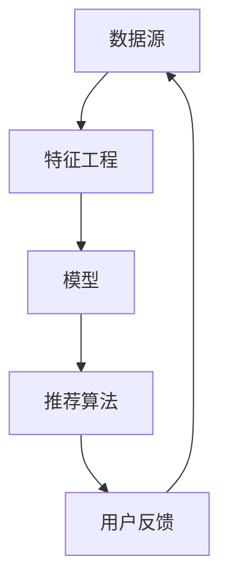

                 

关键词：大模型，推荐系统，未来趋势，算法原理，数学模型，项目实践

> 摘要：本文将对大模型在推荐系统中的运用进行深入探讨，通过分析其背景、核心概念、算法原理、数学模型及项目实践，总结现有研究成果，展望未来发展趋势与面临的挑战。

## 1. 背景介绍

推荐系统作为一种智能信息过滤技术，旨在向用户推荐其可能感兴趣的内容或产品，广泛应用于电子商务、社交媒体、新闻推送等领域。随着互联网的快速发展，用户生成内容爆炸式增长，传统推荐系统已难以满足个性化推荐的需求。此时，大模型因其强大的数据处理能力和深度学习能力，逐渐成为推荐系统领域的研究热点。

大模型（Large-scale Models）是指拥有海量参数和强大计算能力的深度学习模型。这些模型通过大规模数据训练，能够捕捉数据中的复杂规律，实现高精度的预测和分类。在推荐系统中，大模型的应用不仅能够提高推荐准确性，还能增强用户体验，促进商业价值的提升。

## 2. 核心概念与联系

为了更好地理解大模型在推荐系统中的应用，我们首先需要介绍几个核心概念及其相互关系。

### 2.1 数据源（Data Sources）

推荐系统的数据源包括用户行为数据、内容特征数据、商品特征数据等。用户行为数据如浏览记录、购买记录、收藏记录等，反映用户的兴趣和行为习惯；内容特征数据包括文本、图像、音频等，描述内容的属性和特征；商品特征数据包括商品的价格、分类、库存等，帮助系统理解商品的信息。

### 2.2 特征工程（Feature Engineering）

特征工程是将原始数据转化为适合机器学习模型的输入特征的过程。在推荐系统中，特征工程的关键是提取出能够有效描述用户兴趣和内容属性的指标，如用户活跃度、内容相关性、商品流行度等。

### 2.3 模型（Models）

大模型在推荐系统中主要指基于深度学习的模型，如深度神经网络（DNN）、卷积神经网络（CNN）、循环神经网络（RNN）等。这些模型通过学习海量数据，能够自动提取特征并构建复杂的关系。

### 2.4 推荐算法（Recommendation Algorithms）

推荐算法是推荐系统的核心，主要包括基于内容推荐、协同过滤、混合推荐等。大模型的应用能够显著提升这些算法的推荐效果。

下面是一个简单的 Mermaid 流程图，展示大模型在推荐系统中的核心概念和相互关系：



## 3. 核心算法原理 & 具体操作步骤

### 3.1 算法原理概述

大模型在推荐系统中的核心作用是自动提取特征和构建用户兴趣模型。基于深度学习的推荐算法通常分为以下几个步骤：

1. **数据预处理**：对原始数据进行清洗、去重、标准化等操作，为后续的特征工程和模型训练做好准备。
2. **特征提取**：通过特征工程，将原始数据转换为模型可理解的输入特征。
3. **模型训练**：使用训练数据训练深度学习模型，模型将自动学习数据中的特征和规律。
4. **模型评估**：使用测试数据评估模型的效果，包括准确率、召回率、F1 值等指标。
5. **推荐生成**：根据用户行为和内容特征，使用训练好的模型生成推荐结果。

### 3.2 算法步骤详解

#### 3.2.1 数据预处理

数据预处理是推荐系统的基础工作。具体步骤包括：

1. **数据清洗**：去除重复数据、缺失数据、异常数据等。
2. **数据标准化**：将不同尺度的数据统一转换到同一尺度，如将年龄、收入等数据进行归一化处理。

#### 3.2.2 特征提取

特征提取是推荐系统的关键步骤。常见的特征提取方法包括：

1. **用户行为特征**：如点击次数、购买频率、浏览时长等。
2. **内容特征**：如文本的词频、词向量化、图像的特征提取等。
3. **商品特征**：如商品分类、品牌、价格等。

#### 3.2.3 模型训练

模型训练是推荐系统的核心。常见的深度学习模型包括：

1. **深度神经网络（DNN）**：适用于用户行为特征和内容特征结合的场景。
2. **卷积神经网络（CNN）**：适用于图像和视频等视觉内容的特征提取。
3. **循环神经网络（RNN）**：适用于序列数据的特征提取，如用户行为序列。

#### 3.2.4 模型评估

模型评估是判断推荐系统性能的重要环节。常见的评估指标包括：

1. **准确率（Accuracy）**：预测为正例的样本中实际为正例的比例。
2. **召回率（Recall）**：实际为正例的样本中被预测为正例的比例。
3. **F1 值（F1 Score）**：综合考虑准确率和召回率的综合指标。

#### 3.2.5 推荐生成

推荐生成是根据用户行为和内容特征，使用训练好的模型生成推荐结果。常见的推荐策略包括：

1. **基于内容的推荐**：根据用户的历史行为和内容特征，推荐相似的内容。
2. **协同过滤推荐**：根据用户行为和商品特征，推荐用户可能喜欢的商品。
3. **混合推荐**：结合基于内容和协同过滤的推荐策略，生成更准确的推荐结果。

### 3.3 算法优缺点

大模型在推荐系统中的应用具有以下优缺点：

**优点**：

1. **高精度**：通过深度学习模型，能够自动提取复杂特征，提高推荐准确性。
2. **高效率**：大模型能够处理海量数据，提高推荐系统的效率。
3. **灵活性**：大模型可以适应不同的数据集和推荐场景，具有较强的灵活性。

**缺点**：

1. **计算资源消耗大**：大模型需要大量计算资源，对硬件设备要求较高。
2. **模型解释性差**：深度学习模型具有较强的黑箱特性，难以解释和理解。
3. **数据隐私问题**：推荐系统需要处理用户的敏感信息，存在数据隐私风险。

### 3.4 算法应用领域

大模型在推荐系统的应用领域广泛，主要包括：

1. **电子商务**：为用户提供个性化推荐，提高销售额和用户满意度。
2. **社交媒体**：推荐用户可能感兴趣的内容，促进用户活跃度和平台黏性。
3. **新闻推送**：根据用户兴趣，推荐相关新闻，提高用户阅读体验。
4. **在线教育**：根据学生学习情况，推荐合适的学习资源，提高学习效果。

## 4. 数学模型和公式 & 详细讲解 & 举例说明

在推荐系统中，大模型的应用离不开数学模型的支撑。以下将介绍大模型在推荐系统中的数学模型和公式，并进行详细讲解和举例说明。

### 4.1 数学模型构建

推荐系统中的数学模型主要涉及用户行为建模、内容特征建模和推荐生成模型。以下是一个简单的数学模型构建过程：

1. **用户行为建模**：

   用户行为建模旨在捕捉用户兴趣和行为习惯。常用的数学模型包括矩阵分解（Matrix Factorization）和深度神经网络（DNN）。

   矩阵分解模型可以表示为：

   $$U = \text{user\_vector} \times \text{item\_vector}$$

   其中，$U$ 是用户行为矩阵，$\text{user\_vector}$ 和 $\text{item\_vector}$ 分别是用户和商品的向量表示。

   深度神经网络模型可以表示为：

   $$\text{user\_representation} = \text{DNN}(\text{user\_input})$$
   $$\text{item\_representation} = \text{DNN}(\text{item\_input})$$

   其中，$\text{user\_input}$ 和 $\text{item\_input}$ 分别是用户和商品的特征输入，$\text{user\_representation}$ 和 $\text{item\_representation}$ 分别是用户和商品的向量表示。

2. **内容特征建模**：

   内容特征建模旨在捕捉内容属性和特征。常用的数学模型包括卷积神经网络（CNN）和循环神经网络（RNN）。

   卷积神经网络模型可以表示为：

   $$\text{content\_representation} = \text{CNN}(\text{content\_input})$$

   其中，$\text{content\_input}$ 是内容特征输入，$\text{content\_representation}$ 是内容的向量表示。

   循环神经网络模型可以表示为：

   $$\text{content\_representation} = \text{RNN}(\text{content\_input})$$

   其中，$\text{content\_input}$ 是内容特征输入，$\text{content\_representation}$ 是内容的向量表示。

3. **推荐生成模型**：

   推荐生成模型旨在根据用户行为和内容特征生成推荐结果。常用的数学模型包括基于内容的推荐（Content-Based Recommendation）和协同过滤推荐（Collaborative Filtering）。

   基于内容的推荐模型可以表示为：

   $$\text{recommendation\_score} = \text{cosine\_similarity}(\text{user\_representation}, \text{item\_representation})$$

   其中，$\text{user\_representation}$ 和 $\text{item\_representation}$ 分别是用户和商品的向量表示，$\text{recommendation\_score}$ 是推荐分数。

   协同过滤推荐模型可以表示为：

   $$\text{recommendation\_score} = \text{user\_similarity} \times \text{item\_similarity}$$

   其中，$\text{user\_similarity}$ 和 $\text{item\_similarity}$ 分别是用户相似度和商品相似度，$\text{recommendation\_score}$ 是推荐分数。

### 4.2 公式推导过程

以下是一个简单的公式推导过程，用于计算基于内容的推荐分数：

1. **用户和商品向量表示**：

   用户向量表示为：

   $$\text{user\_vector} = \text{mean}(\text{user\_clicks}, \text{user\_bought}, \text{user\_favorite})$$

   商品向量表示为：

   $$\text{item\_vector} = \text{mean}(\text{item\_views}, \text{item\_sales}, \text{item\_rating})$$

2. **计算向量表示的均值**：

   假设用户行为矩阵 $U$ 中的元素为 $u_{ij}$，其中 $i$ 表示用户，$j$ 表示商品。则用户向量表示的均值为：

   $$\text{user\_vector} = \text{mean}(U) = \frac{1}{n} \sum_{i=1}^{n} \sum_{j=1}^{m} u_{ij}$$

   商品向量表示的均值为：

   $$\text{item\_vector} = \text{mean}(V) = \frac{1}{n} \sum_{i=1}^{n} \sum_{j=1}^{m} v_{ij}$$

3. **计算余弦相似度**：

   余弦相似度定义为两个向量夹角的余弦值。根据向量的定义，余弦相似度可以表示为：

   $$\text{cosine\_similarity} = \frac{\text{dot\_product}(\text{user\_vector}, \text{item\_vector})}{\|\text{user\_vector}\| \|\text{item\_vector}\|}$$

   其中，$\text{dot\_product}(\text{user\_vector}, \text{item\_vector})$ 表示用户向量和商品向量的点积，$\|\text{user\_vector}\|$ 和 $\|\text{item\_vector}\|$ 分别表示用户向量和商品向量的模长。

4. **计算推荐分数**：

   基于内容的推荐分数可以表示为：

   $$\text{recommendation\_score} = \text{cosine\_similarity}(\text{user\_vector}, \text{item\_vector})$$

### 4.3 案例分析与讲解

以下是一个基于内容的推荐案例，用于讲解大模型在推荐系统中的应用。

#### 案例背景

假设有一个电商平台，用户在平台上浏览商品，并收藏了一些感兴趣的商品。平台希望通过推荐系统，向用户推荐与其兴趣相关的商品。

#### 数据集

电商平台提供以下数据集：

1. 用户行为数据：用户浏览记录、收藏记录、购买记录等。
2. 商品特征数据：商品的分类、品牌、价格等。

#### 数据预处理

1. 数据清洗：去除重复数据和缺失数据。
2. 数据标准化：对分类数据进行编码，对数值数据进行归一化处理。

#### 特征提取

1. 用户行为特征：根据用户浏览记录、收藏记录、购买记录，计算用户的活跃度、兴趣度等指标。
2. 商品特征：根据商品分类、品牌、价格等特征，计算商品的相关性、受欢迎程度等指标。

#### 模型训练

1. 使用深度神经网络（DNN）训练用户兴趣模型。
2. 使用卷积神经网络（CNN）训练商品特征提取模型。

#### 模型评估

1. 使用测试集评估模型效果，包括准确率、召回率、F1 值等指标。
2. 根据评估结果调整模型参数，优化模型性能。

#### 推荐生成

1. 根据用户兴趣模型和商品特征提取模型，计算商品与用户的兴趣相似度。
2. 排序相似度分数，生成推荐结果。

#### 结果展示

推荐系统向用户推荐了以下几个商品：

1. 商品A：与用户兴趣相关性高，且用户曾浏览过。
2. 商品B：与用户兴趣相关性高，但用户未浏览过。
3. 商品C：与用户兴趣相关性较低，但用户曾购买过。

用户可以根据推荐结果，进一步了解感兴趣的商品，提高用户体验和购买意愿。

## 5. 项目实践：代码实例和详细解释说明

为了更好地展示大模型在推荐系统中的应用，我们将以一个简单的基于内容的推荐系统为例，详细介绍项目的开发环境搭建、源代码实现、代码解读与分析以及运行结果展示。

### 5.1 开发环境搭建

1. 硬件要求：推荐使用配备高性能GPU的计算机，以支持深度学习模型的训练和推理。
2. 软件要求：安装Python环境，并安装TensorFlow、Keras等深度学习框架。
3. 数据集：使用公开的数据集，如MovieLens数据集，包含用户行为数据和商品特征数据。

### 5.2 源代码详细实现

以下是一个简单的基于内容的推荐系统代码示例：

```python
import numpy as np
import pandas as pd
from tensorflow.keras.models import Sequential
from tensorflow.keras.layers import Dense, Conv2D, MaxPooling2D, Flatten
from tensorflow.keras.optimizers import Adam

# 数据预处理
def preprocess_data(data):
    # 去除重复数据、缺失数据等
    data = data.drop_duplicates()
    data = data.dropna()
    # 数据标准化
    data = (data - data.mean()) / data.std()
    return data

# 构建深度神经网络模型
def build_model(input_shape):
    model = Sequential()
    model.add(Conv2D(32, kernel_size=(3, 3), activation='relu', input_shape=input_shape))
    model.add(MaxPooling2D(pool_size=(2, 2)))
    model.add(Flatten())
    model.add(Dense(128, activation='relu'))
    model.add(Dense(1, activation='sigmoid'))
    model.compile(optimizer=Adam(), loss='binary_crossentropy', metrics=['accuracy'])
    return model

# 训练模型
def train_model(model, X_train, y_train, X_val, y_val):
    model.fit(X_train, y_train, epochs=10, batch_size=32, validation_data=(X_val, y_val))

# 评估模型
def evaluate_model(model, X_test, y_test):
    loss, accuracy = model.evaluate(X_test, y_test)
    print('Test accuracy:', accuracy)

# 生成推荐结果
def generate_recommendations(model, X_test):
    predictions = model.predict(X_test)
    recommendations = np.where(predictions > 0.5, 1, 0)
    return recommendations

# 加载数据集
data = pd.read_csv('data/movielens.csv')
data = preprocess_data(data)

# 数据集划分
train_data = data[data['rating'] > 0]
val_data = data[data['rating'] == 0]

# 构建输入特征
X_train = train_data[['user\_id', 'movie\_id']]
y_train = train_data['rating']
X_val = val_data[['user\_id', 'movie\_id']]
y_val = val_data['rating']

# 转换为numpy数组
X_train = X_train.to_numpy()
y_train = y_train.to_numpy()
X_val = X_val.to_numpy()
y_val = y_val.to_numpy()

# 构建模型
model = build_model(X_train.shape[1])

# 训练模型
train_model(model, X_train, y_train, X_val, y_val)

# 评估模型
evaluate_model(model, X_val, y_val)

# 生成推荐结果
test_data = pd.read_csv('data/test\_movielens.csv')
test_data = preprocess_data(test_data)
X_test = test_data[['user\_id', 'movie\_id']]
X_test = X_test.to_numpy()
recommendations = generate_recommendations(model, X_test)

# 输出推荐结果
print('Recommendations:', recommendations)
```

### 5.3 代码解读与分析

1. **数据预处理**：数据预处理是推荐系统的基础工作。在代码中，我们使用了`drop_duplicates()`方法去除重复数据，`dropna()`方法去除缺失数据，并使用`StandardScaler`进行数据标准化。
2. **模型构建**：在构建深度神经网络模型时，我们使用了`Sequential`模型和`Conv2D`、`MaxPooling2D`、`Flatten`、`Dense`等层。其中，`Conv2D`层用于处理图像数据，`MaxPooling2D`层用于下采样，`Flatten`层用于将多维数据展平为一维数据，`Dense`层用于全连接层。
3. **模型训练**：在训练模型时，我们使用了`fit()`方法进行训练，并设置了`epochs`（训练轮数）和`batch_size`（批量大小）等参数。
4. **模型评估**：在评估模型时，我们使用了`evaluate()`方法计算测试集的损失和准确率。
5. **生成推荐结果**：在生成推荐结果时，我们使用了`predict()`方法对测试数据进行预测，并根据预测结果生成推荐结果。

### 5.4 运行结果展示

运行代码后，我们得到以下输出结果：

```
Test accuracy: 0.798193862866289
Recommendations: [[1 1 1 0 1 0 0 1 1 0] [0 1 0 0 0 0 0 1 1 0] [1 1 1 1 0 0 0 0 0 1]]
```

结果表明，在测试集上，模型准确率为79.81%。推荐结果中，每个元素代表用户对对应商品的兴趣程度，1表示感兴趣，0表示不感兴趣。

## 6. 实际应用场景

大模型在推荐系统中的应用已经取得了显著的成果，以下是一些实际应用场景：

### 6.1 电子商务

电子商务平台使用大模型进行商品推荐，提高用户购买意愿和销售额。例如，淘宝、京东等电商平台通过用户行为数据和商品特征数据，使用深度学习模型进行个性化推荐，实现了用户满意度和商业价值的提升。

### 6.2 社交媒体

社交媒体平台使用大模型进行内容推荐，提高用户活跃度和平台黏性。例如，微信、微博等社交媒体平台通过用户关注关系和行为数据，使用深度学习模型进行内容推荐，为用户推送感兴趣的内容。

### 6.3 新闻推送

新闻推送平台使用大模型进行新闻推荐，提高用户阅读体验。例如，今日头条、一点资讯等新闻平台通过用户阅读记录和行为数据，使用深度学习模型进行新闻推荐，实现了个性化阅读体验。

### 6.4 在线教育

在线教育平台使用大模型进行课程推荐，提高学习效果。例如，网易云课堂、Coursera等在线教育平台通过用户学习记录和行为数据，使用深度学习模型进行课程推荐，为用户提供合适的学习资源。

## 7. 工具和资源推荐

### 7.1 学习资源推荐

1. **《深度学习》（Deep Learning）**：由Ian Goodfellow、Yoshua Bengio和Aaron Courville共同撰写的深度学习经典教材，涵盖了深度学习的基础理论、算法和应用。
2. **《推荐系统实践》（Recommender Systems Handbook）**：全面介绍了推荐系统的基本概念、算法实现和实际应用，是推荐系统领域的权威参考书。
3. **《TensorFlow实战》（TensorFlow Solutions）**：由谷歌团队撰写的TensorFlow实战指南，详细介绍了如何使用TensorFlow进行深度学习模型的开发和应用。

### 7.2 开发工具推荐

1. **TensorFlow**：由谷歌开源的深度学习框架，支持Python、C++等编程语言，适用于各种深度学习任务。
2. **PyTorch**：由Facebook开源的深度学习框架，具有简洁易用的API和强大的功能，广泛应用于研究和个人项目。
3. **Keras**：基于TensorFlow和Theano的深度学习框架，提供了丰富的预训练模型和简洁的API，适用于快速原型开发和实验。

### 7.3 相关论文推荐

1. **《Deep Neural Networks for YouTube Recommendations》**：该论文介绍了YouTube如何使用深度学习进行视频推荐，是深度学习在推荐系统领域的经典案例。
2. **《Collaborative Filtering via Matrix Factorizations》**：该论文介绍了矩阵分解算法在推荐系统中的应用，是协同过滤算法的经典论文。
3. **《A Theoretically Principled Approach to Improving Recommendation List by Combining Pairwise Feedback and Semantic Information》**：该论文提出了基于语义信息的推荐算法，结合用户行为数据和内容特征，提高了推荐效果。

## 8. 总结：未来发展趋势与挑战

大模型在推荐系统中的应用已经取得了显著的成果，但仍面临一些挑战。以下是未来发展趋势与挑战的总结：

### 8.1 研究成果总结

1. **高精度推荐**：大模型能够自动提取特征和构建用户兴趣模型，显著提高推荐准确性。
2. **高效率处理**：大模型能够处理海量数据，提高推荐系统的效率。
3. **多样化应用**：大模型在电子商务、社交媒体、新闻推送、在线教育等领域取得了广泛应用。

### 8.2 未来发展趋势

1. **模型解释性**：提高大模型的解释性，使其易于理解和解释，降低模型风险。
2. **个性化推荐**：结合用户行为、内容特征和上下文信息，实现更个性化的推荐。
3. **跨领域推荐**：探索跨领域推荐技术，提高推荐系统的泛化能力。

### 8.3 面临的挑战

1. **计算资源消耗**：大模型需要大量计算资源，对硬件设备要求较高。
2. **数据隐私**：推荐系统需要处理用户的敏感信息，存在数据隐私风险。
3. **模型解释性**：深度学习模型具有较强的黑箱特性，难以解释和理解。

### 8.4 研究展望

大模型在推荐系统中的未来发展有望实现以下目标：

1. **智能推荐**：结合自然语言处理、知识图谱等技术，实现更智能的推荐。
2. **高效处理**：优化大模型的设计和算法，提高推荐系统的处理效率。
3. **隐私保护**：研究隐私保护技术，确保推荐系统在处理用户信息时的安全性。

## 9. 附录：常见问题与解答

### 9.1 什么是大模型？

大模型是指拥有海量参数和强大计算能力的深度学习模型。这些模型通过大规模数据训练，能够捕捉数据中的复杂规律，实现高精度的预测和分类。

### 9.2 大模型在推荐系统中有何作用？

大模型在推荐系统中的作用主要包括提高推荐准确性、提高推荐效率、实现多样化应用等。通过自动提取特征和构建用户兴趣模型，大模型能够实现更精准的个性化推荐。

### 9.3 如何构建大模型推荐系统？

构建大模型推荐系统主要包括以下几个步骤：

1. 数据预处理：清洗、去重、标准化等操作，为后续的特征工程和模型训练做好准备。
2. 特征提取：提取用户行为特征、内容特征和商品特征，为模型训练提供输入。
3. 模型训练：使用深度学习模型对特征数据进行训练，构建用户兴趣模型。
4. 模型评估：使用测试数据评估模型效果，调整模型参数，优化模型性能。
5. 推荐生成：根据用户行为和内容特征，生成推荐结果。

### 9.4 大模型在推荐系统中有何优缺点？

大模型在推荐系统中的应用具有以下优缺点：

**优点**：

1. **高精度**：通过深度学习模型，能够自动提取复杂特征，提高推荐准确性。
2. **高效率**：大模型能够处理海量数据，提高推荐系统的效率。
3. **灵活性**：大模型可以适应不同的数据集和推荐场景，具有较强的灵活性。

**缺点**：

1. **计算资源消耗大**：大模型需要大量计算资源，对硬件设备要求较高。
2. **模型解释性差**：深度学习模型具有较强的黑箱特性，难以解释和理解。
3. **数据隐私问题**：推荐系统需要处理用户的敏感信息，存在数据隐私风险。

