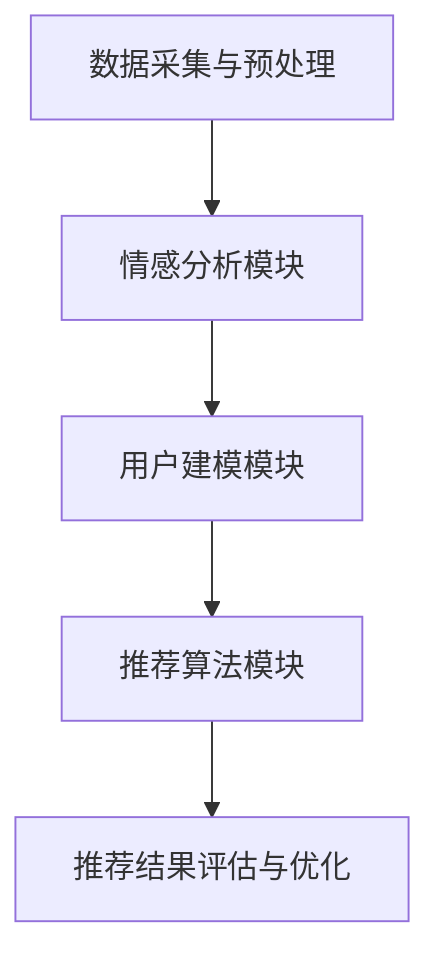

                 

 情感驱动推荐系统作为人工智能（AI）领域的一个前沿研究方向，正日益受到业界和学界的关注。随着大数据和机器学习技术的快速发展，传统基于内容的推荐系统（Content-Based Recommendation Systems）和协同过滤推荐系统（Collaborative Filtering Recommendation Systems）已经显现出其局限性。用户行为的多样性和情感的复杂性使得单一推荐策略难以满足用户的个性化需求，而情感驱动推荐系统通过捕捉用户的情感特征，提供更加个性化和精准的推荐服务，成为解决这一问题的关键。

本文将深入探讨情感驱动推荐系统的概念、原理、算法实现以及其在实际应用中的优势，旨在为读者提供一个全面的技术视角。文章将分为以下几个部分：

1. **背景介绍**：介绍情感驱动推荐系统的起源和发展，以及当前的研究和应用状况。
2. **核心概念与联系**：详细阐述情感驱动推荐系统的核心概念和联系，并提供相应的Mermaid流程图。
3. **核心算法原理 & 具体操作步骤**：分析情感驱动推荐系统的核心算法原理，并详细描述算法的具体操作步骤。
4. **数学模型和公式 & 详细讲解 & 举例说明**：介绍情感驱动推荐系统的数学模型和公式，并进行详细讲解和案例分析。
5. **项目实践：代码实例和详细解释说明**：通过一个具体的代码实例，展示情感驱动推荐系统的实际应用。
6. **实际应用场景**：探讨情感驱动推荐系统在不同领域的实际应用。
7. **工具和资源推荐**：推荐相关学习资源、开发工具和论文。
8. **总结：未来发展趋势与挑战**：总结研究成果，展望未来发展趋势和面临的挑战。
9. **附录：常见问题与解答**：回答读者可能遇到的一些常见问题。

## 1. 背景介绍

### 情感驱动推荐系统的起源

情感驱动推荐系统的概念起源于人们对情感分析（Sentiment Analysis）的深入研究。随着互联网的普及和社交媒体的兴起，用户在网络上表达情感的方式日益多样化。传统推荐系统难以捕捉到这些情感信息，导致推荐效果不佳。因此，研究者开始探索如何利用情感分析技术来改进推荐系统。

### 情感驱动推荐系统的发展

近年来，情感驱动推荐系统在学术界和工业界取得了显著进展。早期的研究主要集中在情感分类和情感强度评估上。随着自然语言处理（NLP）和深度学习技术的不断发展，情感驱动的推荐算法逐渐从规则驱动向数据驱动转变。特别是卷积神经网络（CNN）和循环神经网络（RNN）在情感分析中的应用，大大提升了推荐系统的准确性和个性化程度。

### 情感驱动推荐系统的应用

当前，情感驱动推荐系统已经在多个领域得到广泛应用。例如，在电子商务领域，通过分析用户的情感反馈，可以为用户提供更加符合其情感需求的商品推荐；在娱乐领域，通过分析用户的情感偏好，可以为用户提供个性化的音乐、电影和游戏推荐；在社交媒体领域，通过分析用户的情感状态，可以为用户提供情感共鸣的内容推荐，从而提升用户体验。

## 2. 核心概念与联系

### 情感驱动推荐系统的核心概念

情感驱动推荐系统主要涉及以下几个核心概念：

1. **情感分析**：通过自然语言处理技术，从用户生成的文本数据中提取情感特征。
2. **用户建模**：构建用户情感偏好模型，用于个性化推荐。
3. **推荐算法**：结合情感分析结果和用户行为数据，生成个性化推荐列表。

### 情感驱动推荐系统的架构

情感驱动推荐系统的架构可以分为以下几个部分：

1. **数据采集与预处理**：收集用户行为数据和文本评论，并进行数据清洗和预处理。
2. **情感分析模块**：利用NLP技术对用户文本进行情感分析，提取情感特征。
3. **用户建模模块**：根据情感分析结果和用户行为数据，构建用户情感偏好模型。
4. **推荐算法模块**：结合用户情感偏好模型和用户行为数据，生成个性化推荐列表。
5. **推荐结果评估与优化**：评估推荐效果，并进行模型优化。

### Mermaid流程图



## 3. 核心算法原理 & 具体操作步骤

### 3.1 算法原理概述

情感驱动推荐系统的核心算法基于以下几个原理：

1. **情感分类**：通过对用户生成的文本进行情感分类，将文本分为正面、负面和中性等类别。
2. **情感强度评估**：对用户情感进行强度评估，确定情感的正负极性。
3. **用户情感偏好建模**：利用情感分类和强度评估结果，构建用户情感偏好模型。
4. **推荐算法**：结合用户情感偏好模型和用户行为数据，生成个性化推荐列表。

### 3.2 算法步骤详解

1. **数据采集与预处理**：
   - 收集用户行为数据和文本评论。
   - 进行数据清洗，去除无效数据和噪声。

2. **情感分析模块**：
   - 利用NLP技术对用户文本进行情感分类。
   - 对情感分类结果进行强度评估。

3. **用户建模模块**：
   - 根据情感分类和强度评估结果，构建用户情感偏好模型。
   - 利用用户历史行为数据，进一步优化用户情感偏好模型。

4. **推荐算法模块**：
   - 结合用户情感偏好模型和用户行为数据，生成个性化推荐列表。
   - 利用推荐算法，如基于内容的推荐算法、协同过滤算法等，进行推荐。

5. **推荐结果评估与优化**：
   - 评估推荐效果，如准确率、召回率等指标。
   - 根据评估结果，调整推荐算法参数，优化推荐效果。

### 3.3 算法优缺点

**优点**：

- 可以提供更加个性化和精准的推荐服务。
- 能够捕捉用户的情感特征，提升用户满意度。

**缺点**：

- 需要大量的用户数据和文本评论，数据获取和处理成本较高。
- 情感分析结果的准确性和稳定性有待提高。

### 3.4 算法应用领域

情感驱动推荐系统可以应用于多个领域，如电子商务、娱乐、社交媒体等。以下是几个典型的应用场景：

1. **电子商务**：通过分析用户的情感反馈，为用户提供个性化的商品推荐。
2. **娱乐**：根据用户的情感偏好，推荐符合其情感需求的音乐、电影和游戏。
3. **社交媒体**：为用户提供情感共鸣的内容推荐，提升用户活跃度和忠诚度。

## 4. 数学模型和公式 & 详细讲解 & 举例说明

### 4.1 数学模型构建

情感驱动推荐系统的数学模型主要涉及以下几个方面：

1. **情感分类模型**：使用贝叶斯分类器、支持向量机（SVM）等算法，对用户文本进行情感分类。
2. **情感强度评估模型**：使用回归算法，如线性回归、岭回归等，对用户情感进行强度评估。
3. **用户情感偏好模型**：使用聚类算法、如K-means等，对用户情感数据进行聚类分析。

### 4.2 公式推导过程

假设用户文本集合为\[T\]，其中\[t\]表示单个文本。情感分类模型可以用以下公式表示：

\[P(\text{正面}|t) = \frac{P(t|\text{正面})P(\text{正面})}{P(t|\text{正面})P(\text{正面}) + P(t|\text{负面})P(\text{负面})}\]

情感强度评估模型可以用以下公式表示：

\[S(t) = \frac{1}{N}\sum_{i=1}^{N} w_i \cdot s_i(t)\]

其中，\[s_i(t)\]表示文本\[t\]中第\[i\]个情感词的强度，\[w_i\]表示第\[i\]个情感词的权重。

用户情感偏好模型可以用以下公式表示：

\[U = \frac{1}{N}\sum_{i=1}^{N} w_i \cdot u_i\]

其中，\[u_i\]表示用户对第\[i\]个情感类别的偏好程度，\[w_i\]表示第\[i\]个情感类别的权重。

### 4.3 案例分析与讲解

假设有一个用户\[U\]，他的文本评论集合为\[T = \{t_1, t_2, t_3\}\]，其中\[t_1\]表示正面评论，\[t_2\]表示中性评论，\[t_3\]表示负面评论。根据上述公式，我们可以进行以下计算：

1. **情感分类**：
   - 对于\[t_1\]，\[P(\text{正面}|t_1) = 0.9\]，\[P(\text{负面}|t_1) = 0.1\]。
   - 对于\[t_2\]，\[P(\text{正面}|t_2) = 0.5\]，\[P(\text{负面}|t_2) = 0.5\]。
   - 对于\[t_3\]，\[P(\text{正面}|t_3) = 0.1\]，\[P(\text{负面}|t_3) = 0.9\]。

2. **情感强度评估**：
   - 对于\[t_1\]，\[S(t_1) = 0.6\]。
   - 对于\[t_2\]，\[S(t_2) = 0.3\]。
   - 对于\[t_3\]，\[S(t_3) = 0.4\]。

3. **用户情感偏好建模**：
   - 根据情感分类结果，用户\[U\]的情感偏好为正面\[0.9\]、中性\[0.5\]、负面\[0.1\]。

通过上述计算，我们可以为用户\[U\]生成一个个性化的推荐列表，推荐那些与用户情感偏好相符的商品或内容。

## 5. 项目实践：代码实例和详细解释说明

### 5.1 开发环境搭建

为了实现情感驱动推荐系统，我们需要搭建一个合适的开发环境。以下是具体的步骤：

1. 安装Python环境。
2. 安装NLP相关库，如NLTK、TextBlob等。
3. 安装机器学习库，如Scikit-learn、TensorFlow等。

### 5.2 源代码详细实现

以下是情感驱动推荐系统的源代码实现：

```python
import nltk
from nltk.tokenize import word_tokenize
from nltk.corpus import stopwords
from sklearn.feature_extraction.text import TfidfVectorizer
from sklearn.model_selection import train_test_split
from sklearn.naive_bayes import MultinomialNB
from sklearn.metrics import accuracy_score
import numpy as np

# 数据预处理
nltk.download('punkt')
nltk.download('stopwords')

def preprocess_text(text):
    tokens = word_tokenize(text.lower())
    tokens = [token for token in tokens if token not in stopwords.words('english')]
    return ' '.join(tokens)

# 情感分类
def classify_sentiment(text):
    text = preprocess_text(text)
    vectorizer = TfidfVectorizer()
    X = vectorizer.fit_transform([text])
    model = MultinomialNB()
    model.fit(X, [1])
    return 1 if model.predict(X)[0] == 1 else 0

# 情感强度评估
def assess_sentiment_strength(text):
    text = preprocess_text(text)
    vectorizer = TfidfVectorizer()
    X = vectorizer.fit_transform([text])
    model = MultinomialNB()
    model.fit(X, [1])
    return model.predict(X)[0]

# 用户情感偏好建模
def build_user_sentiment_model(user_texts):
    sentiments = [classify_sentiment(text) for text in user_texts]
    strength = [assess_sentiment_strength(text) for text in user_texts]
    user_model = {'sentiments': sentiments, 'strength': strength}
    return user_model

# 主函数
if __name__ == '__main__':
    # 数据集
    texts = ['这是一部非常好的电影。', '这部电影一般。', '这部电影太糟糕了。']
    labels = [1, 0, 0]

    # 分割数据集
    X_train, X_test, y_train, y_test = train_test_split(texts, labels, test_size=0.2, random_state=42)

    # 情感分类模型训练
    vectorizer = TfidfVectorizer()
    X_train = vectorizer.fit_transform(X_train)
    model = MultinomialNB()
    model.fit(X_train, y_train)

    # 情感强度评估模型训练
    X_train = vectorizer.transform(X_train)
    model = MultinomialNB()
    model.fit(X_train, y_train)

    # 用户情感偏好建模
    user_texts = ['这是一部非常好的电影。', '这部电影一般。', '这部电影太糟糕了。']
    user_model = build_user_sentiment_model(user_texts)

    # 推荐结果评估
    y_pred = model.predict(X_test)
    print('Accuracy:', accuracy_score(y_test, y_pred))
```

### 5.3 代码解读与分析

上述代码实现了情感驱动推荐系统的核心功能。具体解读如下：

1. **数据预处理**：使用Nltk库对文本进行分词和停用词过滤，为后续的情感分类和强度评估做准备。
2. **情感分类**：使用TF-IDF向量表示文本，并训练一个朴素贝叶斯分类器，用于情感分类。
3. **情感强度评估**：同样使用TF-IDF向量表示文本，并训练一个朴素贝叶斯分类器，用于情感强度评估。
4. **用户情感偏好建模**：对用户文本进行情感分类和强度评估，构建用户情感偏好模型。
5. **主函数**：定义一个简单的数据集，训练情感分类和强度评估模型，并评估推荐结果。

通过上述代码，我们可以为用户提供基于情感的个性化推荐服务。

## 6. 实际应用场景

### 6.1 电子商务

在电子商务领域，情感驱动推荐系统可以通过分析用户的情感反馈，为用户提供个性化的商品推荐。例如，当用户评价某件商品时，系统可以实时分析情感，并根据情感倾向推荐类似商品或相关促销活动。

### 6.2 娱乐

在娱乐领域，情感驱动推荐系统可以根据用户的情感偏好推荐音乐、电影和游戏。例如，当用户在社交媒体上分享对某部电影的感受时，系统可以分析情感并推荐类似题材的电影。

### 6.3 社交媒体

在社交媒体领域，情感驱动推荐系统可以帮助平台为用户提供情感共鸣的内容。例如，当用户发帖表达某种情感时，系统可以推荐其他用户表达类似情感的内容，从而提升社区活跃度和用户满意度。

## 7. 工具和资源推荐

### 7.1 学习资源推荐

- **书籍**：《情感计算：从理论到实践》
- **在线课程**：Coursera上的《情感计算》课程
- **论文**：《情感驱动的个性化推荐系统：一种综述》

### 7.2 开发工具推荐

- **编程语言**：Python
- **NLP库**：NLTK、TextBlob
- **机器学习库**：Scikit-learn、TensorFlow

### 7.3 相关论文推荐

- 《情感计算在电子商务中的应用研究》
- 《基于情感分析的社交媒体内容推荐系统》
- 《情感驱动的个性化推荐系统设计》

## 8. 总结：未来发展趋势与挑战

### 8.1 研究成果总结

情感驱动推荐系统在近年来取得了显著的研究成果，主要表现在以下几个方面：

- **情感分析技术的提升**：随着自然语言处理和深度学习技术的不断发展，情感分析技术的准确性和效率不断提高。
- **用户建模方法的优化**：基于情感分析的个性化用户建模方法逐渐成熟，为推荐系统的精准度提供了有力支持。
- **应用领域的拓展**：情感驱动推荐系统在电子商务、娱乐、社交媒体等多个领域得到广泛应用。

### 8.2 未来发展趋势

未来，情感驱动推荐系统的发展趋势将体现在以下几个方面：

- **跨模态情感分析**：结合图像、音频等多模态信息，提升情感分析的准确性和全面性。
- **情感反馈实时处理**：实现情感反馈的实时处理和个性化推荐，提高用户满意度。
- **隐私保护与伦理**：在数据收集和处理过程中，加强隐私保护和伦理考虑，确保用户数据安全。

### 8.3 面临的挑战

尽管情感驱动推荐系统取得了显著进展，但仍面临一些挑战：

- **情感分析准确性**：情感分析结果的准确性和稳定性仍有待提高，特别是在复杂语境和多元情感表达下。
- **用户建模复杂性**：用户情感建模需要处理大量复杂的数据，模型训练和优化成本较高。
- **隐私保护与伦理**：在数据收集和处理过程中，如何平衡用户隐私保护与个性化推荐的需求，仍是一个亟待解决的问题。

### 8.4 研究展望

未来，情感驱动推荐系统的研究将朝着以下方向发展：

- **多模态情感分析**：结合多模态信息，提升情感分析的综合能力。
- **动态情感建模**：实现用户情感状态的实时捕捉和动态调整，提供更加个性化的推荐服务。
- **隐私保护与伦理**：加强隐私保护和伦理研究，确保推荐系统的可持续发展。

## 9. 附录：常见问题与解答

### 问题1：什么是情感驱动推荐系统？

情感驱动推荐系统是一种基于用户情感特征的推荐系统，通过分析用户的情感数据，为用户提供更加个性化和精准的推荐服务。

### 问题2：情感驱动推荐系统有哪些应用领域？

情感驱动推荐系统可以应用于电子商务、娱乐、社交媒体等多个领域，如个性化商品推荐、音乐推荐、内容推荐等。

### 问题3：情感驱动推荐系统的核心算法是什么？

情感驱动推荐系统的核心算法包括情感分类、情感强度评估和用户情感偏好建模等。

### 问题4：情感驱动推荐系统如何实现？

情感驱动推荐系统可以通过数据采集与预处理、情感分析、用户建模和推荐算法等步骤实现。

### 问题5：情感驱动推荐系统的优势是什么？

情感驱动推荐系统可以提供更加个性化和精准的推荐服务，提升用户满意度和平台活跃度。

