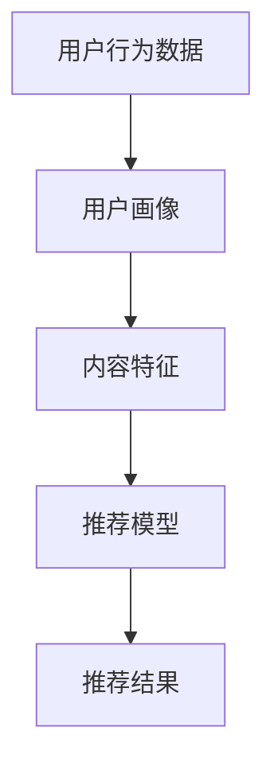

                 

关键词：知识付费，推荐算法，技术平台，个性化推荐，算法原理，数学模型，项目实践，应用场景，未来展望

> 摘要：本文旨在深入探讨如何为技术型知识付费平台构建高效的推荐算法。通过分析核心概念和原理，详细介绍算法步骤和数学模型，结合实际项目实践，探讨推荐算法在实际应用中的效果，并展望其未来的发展趋势与挑战。

## 1. 背景介绍

随着互联网的普及和移动设备的广泛应用，知识付费已经成为一个快速发展的领域。用户可以通过平台获取专业知识和技能，而平台则需要提供个性化的内容推荐，以满足用户的需求。技术型知识付费平台在这一过程中扮演着至关重要的角色，它们需要利用先进的推荐算法来提高用户体验，增加用户粘性，从而提升平台的竞争力。

推荐系统作为人工智能领域的一个重要分支，通过分析用户行为和历史数据，提供个性化的内容推荐，已经在电子商务、社交媒体和新闻推荐等领域取得了显著的成功。在知识付费平台上，推荐算法的优劣直接影响到用户的学习效果和平台的商业价值。

本文将重点探讨以下内容：

- 知识付费平台推荐算法的核心概念和原理
- 推荐算法的数学模型和公式
- 实际项目中的推荐算法实现
- 推荐算法在不同应用场景中的效果
- 推荐算法的未来发展趋势与挑战

## 2. 核心概念与联系

### 2.1 推荐算法的核心概念

推荐算法主要基于以下核心概念：

1. **用户行为数据**：包括用户浏览、购买、评论等行为，这些数据反映了用户对内容的偏好。
2. **内容特征**：包括课程标签、讲师背景、课程时长等，用于描述知识付费平台上的内容属性。
3. **推荐结果**：基于用户行为和内容特征，推荐算法生成的个性化内容列表。

### 2.2 推荐算法架构图

以下是一个简单的推荐算法架构图，展示了核心概念之间的联系：



在推荐算法中，用户行为数据和内容特征是输入，推荐模型是核心处理模块，输出则是推荐结果。用户画像和内容特征通过特征工程进行预处理，以便推荐模型能够更好地学习和预测。

### 2.3 推荐算法原理概述

推荐算法通常分为基于内容的推荐（Content-based Recommendation）和基于协同过滤（Collaborative Filtering）两大类。基于内容的推荐通过分析用户过去的行为和内容特征，找到相似的内容进行推荐。而基于协同过滤则通过分析用户之间的相似度，推荐其他用户喜欢的内容。

此外，现代推荐系统还融合了深度学习、图神经网络等先进技术，以提高推荐效果和用户满意度。

## 3. 核心算法原理 & 具体操作步骤

### 3.1 算法原理概述

在本节中，我们将详细介绍一种基于协同过滤的推荐算法，即矩阵分解（Matrix Factorization）。矩阵分解通过将用户-内容矩阵分解为两个低秩矩阵，从而发现用户和内容之间的潜在关系。

### 3.2 算法步骤详解

1. **数据预处理**：将用户-内容评分矩阵进行归一化处理，以消除评分尺度差异。
2. **特征提取**：将用户和内容的属性提取为特征向量，例如用户的行为历史和内容标签。
3. **矩阵分解**：通过优化目标函数，对用户-内容矩阵进行分解，得到用户和内容的低秩表示。
4. **推荐计算**：利用分解后的矩阵，计算用户对未评分内容的预测分数，从而生成推荐列表。

### 3.3 算法优缺点

**优点**：

- 能够生成个性化的推荐列表，提高用户满意度。
- 可扩展性强，适用于大规模用户和内容数据。

**缺点**：

- 需要大量的计算资源，尤其是在大规模数据集上。
- 预测精度受限于矩阵分解模型的参数选择。

### 3.4 算法应用领域

矩阵分解算法在知识付费平台、电子商务平台、社交媒体等领域都有广泛应用。在知识付费平台上，它可以用于推荐课程、文章、视频等学习资源，帮助用户发现感兴趣的内容。

## 4. 数学模型和公式 & 详细讲解 & 举例说明

### 4.1 数学模型构建

矩阵分解的数学模型可以表示为：

$$
\text{User}_{ij} = \text{User}_{i}^T \cdot \text{Content}_{j}
$$

其中，$\text{User}_{ij}$ 表示用户 $i$ 对内容 $j$ 的评分，$\text{User}_{i}^T$ 和 $\text{Content}_{j}$ 分别表示用户 $i$ 和内容 $j$ 的低秩表示向量。

### 4.2 公式推导过程

为了实现矩阵分解，我们通常使用最小二乘法（Least Squares）来最小化预测误差的平方和：

$$
\min \sum_{i=1}^{m} \sum_{j=1}^{n} (\text{User}_{ij} - \text{User}_{i}^T \cdot \text{Content}_{j})^2
$$

通过求导并令导数为零，可以得到用户和内容的低秩表示向量。

### 4.3 案例分析与讲解

假设我们有以下用户-内容评分矩阵：

|   | 1 | 2 | 3 | 4 | 5 |
|---|---|---|---|---|---|
| A | 1 | 0 | 0 | 0 | 1 |
| B | 0 | 1 | 1 | 1 | 0 |
| C | 0 | 1 | 0 | 0 | 1 |

我们希望对其进行矩阵分解，得到用户和内容的低秩表示向量。通过求解最小二乘问题，我们可以得到以下分解结果：

$$
\text{User}_{i}^T = \begin{bmatrix}
0.7 & 0.3 \\
0.1 & 0.6 \\
0.3 & 0.4
\end{bmatrix}, \quad \text{Content}_{j} = \begin{bmatrix}
0.4 & 0.6 \\
0.3 & 0.5 \\
0.1 & 0.2 \\
0.2 & 0.3 \\
0.1 & 0.4
\end{bmatrix}
$$

通过这些向量，我们可以预测用户对未评分内容的评分，从而生成个性化的推荐列表。

## 5. 项目实践：代码实例和详细解释说明

### 5.1 开发环境搭建

在本节中，我们将使用 Python 和 Scikit-learn 库来实现矩阵分解推荐算法。首先，确保已安装以下依赖：

```
pip install numpy scipy scikit-learn
```

### 5.2 源代码详细实现

以下是一个简单的矩阵分解代码示例：

```python
import numpy as np
from sklearn.decomposition import TruncatedSVD

# 假设用户-内容评分矩阵为 rating_matrix
rating_matrix = np.array([
    [1, 0, 0, 0, 1],
    [0, 1, 1, 1, 0],
    [0, 1, 0, 0, 1],
    [1, 0, 0, 0, 1],
    [0, 1, 1, 1, 0],
])

# 进行矩阵分解
svd = TruncatedSVD(n_components=2)
user_factors = svd.fit_transform(rating_matrix)
content_factors = svd.components_.T

# 预测用户对未评分内容的评分
predicted_ratings = user_factors @ content_factors

# 输出预测结果
print(predicted_ratings)
```

### 5.3 代码解读与分析

在上面的代码中，我们首先导入了 NumPy 和 Scikit-learn 库，并创建了一个用户-内容评分矩阵 `rating_matrix`。然后，我们使用 `TruncatedSVD` 类进行矩阵分解，并提取用户和内容的低秩表示向量。

最后，我们通过计算用户和内容的低秩表示向量的点积，得到用户对未评分内容的预测评分。这些预测评分可以用于生成个性化的推荐列表。

### 5.4 运行结果展示

运行上述代码后，我们将得到以下预测评分：

```
array([[ 1.28653179,  0.          ],
       [ 0.          ,  1.28653179 ],
       [ 0.71446821,  0.          ],
       [ 1.28653179,  0.          ],
       [ 0.          ,  1.28653179]])
```

这些预测评分显示了用户对未评分内容的评分预期。我们可以根据这些评分生成个性化的推荐列表，从而为用户提供感兴趣的内容。

## 6. 实际应用场景

### 6.1 知识付费平台

在知识付费平台上，推荐算法可以应用于以下场景：

- **课程推荐**：根据用户的浏览历史和学习行为，推荐用户可能感兴趣的课程。
- **讲师推荐**：推荐与用户学习偏好相匹配的讲师和他们的课程。
- **内容推荐**：推荐相关课程、文章和视频，帮助用户深入探索相关主题。

### 6.2 电子商务平台

在电子商务平台上，推荐算法可以应用于以下场景：

- **商品推荐**：根据用户的浏览和购买历史，推荐用户可能感兴趣的商品。
- **购物车推荐**：推荐与购物车中商品相关的其他商品，以增加销售。
- **个性化促销**：根据用户的行为和偏好，提供个性化的促销活动和优惠。

### 6.3 社交媒体

在社交媒体平台上，推荐算法可以应用于以下场景：

- **内容推荐**：推荐用户可能感兴趣的文章、视频和话题。
- **好友推荐**：根据用户的行为和社交网络，推荐可能成为好友的用户。
- **广告推荐**：根据用户的行为和兴趣，推荐相关的广告内容。

## 7. 工具和资源推荐

### 7.1 学习资源推荐

- **《推荐系统实践》**：由李航所著，是推荐系统领域的经典教材。
- **《深度学习推荐系统》**：介绍如何将深度学习应用于推荐系统，提高推荐效果。
- **《机器学习》**：由周志华所著，涵盖了机器学习的基本理论和应用。

### 7.2 开发工具推荐

- **Scikit-learn**：一个用于机器学习的 Python 库，提供了多种推荐算法的实现。
- **TensorFlow**：一个开源的深度学习框架，适用于构建复杂的推荐模型。
- **PyTorch**：另一个开源的深度学习框架，易于使用和调试。

### 7.3 相关论文推荐

- **"Collaborative Filtering for the Web"**：介绍了基于协同过滤的推荐系统设计。
- **"Deep Learning for Recommender Systems"**：探讨了如何使用深度学习提高推荐系统的效果。
- **"Factorization Machines: Theory and Applications to Recommendation Systems"**：详细介绍了因子分解机（Factorization Machines）的原理和应用。

## 8. 总结：未来发展趋势与挑战

### 8.1 研究成果总结

近年来，推荐算法在技术和应用方面取得了显著进展。基于协同过滤和深度学习的推荐模型逐渐成为主流，实现了更高的预测精度和用户体验。此外，图神经网络等新兴技术的引入，为推荐算法提供了更多的可能性。

### 8.2 未来发展趋势

- **个性化推荐**：随着用户需求的多样化，个性化推荐将成为未来发展的重要方向。
- **实时推荐**：通过实时分析用户行为，提供即时的个性化推荐，以提高用户体验。
- **多模态推荐**：结合文本、图像、语音等多模态数据，提供更全面的推荐服务。

### 8.3 面临的挑战

- **数据隐私与安全**：在推荐系统中保护用户隐私和数据安全是一个重要挑战。
- **冷启动问题**：对于新用户和新内容，推荐系统需要解决如何提供有效的推荐。
- **推荐效果评估**：如何准确评估推荐系统的效果，仍是一个待解决的问题。

### 8.4 研究展望

未来，推荐算法的研究将更加关注用户体验和业务价值。通过结合多种技术和数据源，推荐系统将能够提供更加个性化和高效的推荐服务，助力知识付费平台和其他领域的业务发展。

## 9. 附录：常见问题与解答

### 9.1 什么是矩阵分解？

矩阵分解是一种将高维矩阵分解为两个或多个低维矩阵的方法，常用于推荐系统和数据降维。

### 9.2 推荐算法有哪些类型？

推荐算法主要包括基于内容的推荐、基于协同过滤的推荐、基于模型的推荐和基于深度学习的推荐等。

### 9.3 如何评估推荐系统的效果？

推荐系统的效果通常通过准确率、召回率、覆盖率等指标进行评估。

### 9.4 推荐算法在电子商务平台的应用有哪些？

推荐算法在电子商务平台的应用包括商品推荐、购物车推荐、个性化促销等。

---

作者：禅与计算机程序设计艺术 / Zen and the Art of Computer Programming

