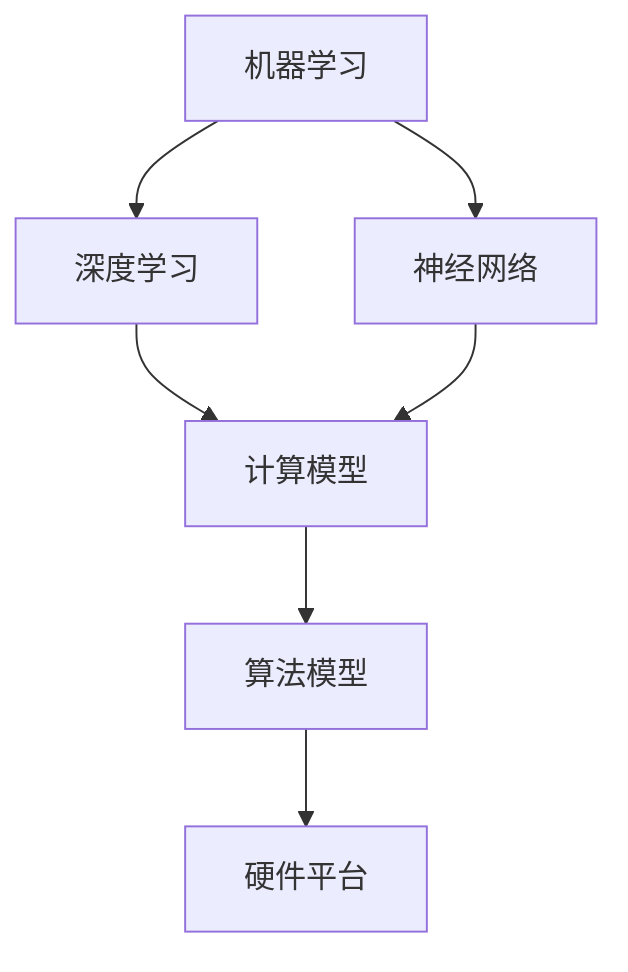

                 

本文将深入探讨人工智能（AI）的真正挑战，从核心概念到实际应用，再到未来发展趋势与挑战。通过逻辑清晰、结构紧凑、简单易懂的专业技术语言，本文旨在为读者提供一个全面而深刻的理解。

## 关键词

- 人工智能
- 深度学习
- 机器学习
- 计算机视觉
- 自然语言处理
- 大数据
- 神经网络

## 摘要

本文将探讨人工智能领域中的关键挑战，包括算法原理、数学模型、项目实践、实际应用场景以及未来发展趋势。通过对这些挑战的深入分析，我们将揭示人工智能在实际应用中面临的难题，并提出可能的解决方案和展望。

## 1. 背景介绍

### 1.1 人工智能的发展历程

人工智能（AI）是一门研究、开发用于模拟、延伸和扩展人的智能的理论、方法、技术及应用系统的综合技术科学。人工智能的发展可以追溯到20世纪50年代，随着计算机技术的不断进步，AI领域也在不断演进。从早期的符号主义、知识表示到20世纪80年代的专家系统，再到21世纪初的深度学习和机器学习，人工智能已经取得了显著的进展。

### 1.2 当前人工智能的主要应用领域

当前，人工智能在多个领域取得了突破性进展，如计算机视觉、自然语言处理、机器学习、大数据分析等。其中，计算机视觉技术使得机器能够识别和理解图像和视频，自然语言处理则让机器能够理解、生成和处理人类语言。机器学习算法使得机器能够从数据中自动学习和改进，大数据分析则帮助企业和组织从海量数据中提取有价值的信息。

## 2. 核心概念与联系

### 2.1 人工智能的基本概念

人工智能的基本概念包括机器学习、深度学习、神经网络、符号主义等。其中，机器学习是指通过算法让计算机从数据中学习，而深度学习则是基于多层神经网络的机器学习方法。神经网络是一种模拟人脑神经元连接结构的计算模型，符号主义则强调基于逻辑和规则的推理。

### 2.2 人工智能的关键架构

人工智能的关键架构包括计算模型、算法模型和硬件平台。计算模型是指人工智能系统的计算方式，算法模型是指实现人工智能功能的算法，硬件平台则是指支持人工智能计算的基础设施。

### 2.3 Mermaid 流程图



## 3. 核心算法原理 & 具体操作步骤

### 3.1 算法原理概述

人工智能的核心算法主要包括机器学习、深度学习和神经网络。机器学习算法通过从数据中学习，实现对未知数据的预测和分类。深度学习算法则是基于多层神经网络，通过自动学习数据特征，实现复杂任务的自动化处理。神经网络算法则模拟人脑神经元连接结构，通过学习和优化，实现数据的分类、回归和预测。

### 3.2 算法步骤详解

#### 3.2.1 机器学习算法步骤

1. 数据收集：收集大量相关数据作为训练样本。
2. 数据预处理：对数据进行清洗、归一化等处理，使其适合算法训练。
3. 模型选择：选择合适的机器学习算法，如线性回归、决策树、支持向量机等。
4. 模型训练：使用训练样本对模型进行训练，调整模型参数。
5. 模型评估：使用验证集或测试集对模型进行评估，选择最优模型。

#### 3.2.2 深度学习算法步骤

1. 数据收集：收集大量相关数据作为训练样本。
2. 数据预处理：对数据进行清洗、归一化等处理，使其适合算法训练。
3. 网络构建：设计合适的神经网络结构，包括输入层、隐藏层和输出层。
4. 模型训练：使用训练样本对模型进行训练，调整模型参数。
5. 模型评估：使用验证集或测试集对模型进行评估，选择最优模型。

#### 3.2.3 神经网络算法步骤

1. 网络构建：设计合适的神经网络结构，包括输入层、隐藏层和输出层。
2. 损失函数定义：选择合适的损失函数，如均方误差（MSE）、交叉熵损失等。
3. 优化算法选择：选择合适的优化算法，如梯度下降、随机梯度下降等。
4. 模型训练：使用训练样本对模型进行训练，调整模型参数。
5. 模型评估：使用验证集或测试集对模型进行评估，选择最优模型。

### 3.3 算法优缺点

#### 3.3.1 机器学习算法

优点：

- 泛化能力强，适用于各种类型的数据和任务。

缺点：

- 训练时间较长，对计算资源要求较高。

#### 3.3.2 深度学习算法

优点：

- 学习能力强，能够自动提取数据特征。

缺点：

- 需要大量训练数据和计算资源。

#### 3.3.3 神经网络算法

优点：

- 结构简单，易于理解和实现。

缺点：

- 泛化能力有限，对数据质量和特征工程要求较高。

### 3.4 算法应用领域

人工智能算法在多个领域有广泛应用，如计算机视觉、自然语言处理、机器学习、大数据分析等。具体应用领域包括：

- 计算机视觉：图像识别、目标检测、人脸识别等。
- 自然语言处理：机器翻译、文本分类、情感分析等。
- 机器学习：推荐系统、风险控制、金融分析等。
- 大数据分析：数据挖掘、智能分析、业务优化等。

## 4. 数学模型和公式 & 详细讲解 & 举例说明

### 4.1 数学模型构建

人工智能中的数学模型主要包括线性模型、概率模型和优化模型等。线性模型通常用于拟合数据趋势，概率模型用于描述数据分布，优化模型则用于求解最优解。

### 4.2 公式推导过程

#### 4.2.1 线性模型

线性模型的一般形式为：

$$
y = \beta_0 + \beta_1 x
$$

其中，$y$ 为因变量，$x$ 为自变量，$\beta_0$ 和 $\beta_1$ 为模型参数。

#### 4.2.2 概率模型

概率模型的一般形式为：

$$
P(X=x) = \frac{1}{Z} e^{-\theta x}
$$

其中，$X$ 为随机变量，$x$ 为具体取值，$\theta$ 为模型参数，$Z$ 为常数。

#### 4.2.3 优化模型

优化模型的一般形式为：

$$
\min_{\theta} J(\theta) = \frac{1}{2} \sum_{i=1}^{n} (h_{\theta}(x^{(i)}) - y^{(i)})^2
$$

其中，$h_{\theta}(x)$ 为模型输出，$y^{(i)}$ 为实际输出，$J(\theta)$ 为损失函数。

### 4.3 案例分析与讲解

#### 4.3.1 线性回归模型

假设我们要预测房价，使用线性回归模型拟合房价与特征的关系。给定训练数据集，我们可以通过最小二乘法求解线性回归模型的参数。

#### 4.3.2 逻辑回归模型

假设我们要对二元分类问题进行建模，可以使用逻辑回归模型。给定训练数据集，我们可以通过最大似然估计求解逻辑回归模型的参数。

#### 4.3.3 优化算法

对于非线性优化问题，我们可以使用梯度下降法、牛顿法等优化算法求解最优解。以梯度下降法为例，其迭代公式为：

$$
\theta = \theta - \alpha \nabla_{\theta} J(\theta)
$$

其中，$\alpha$ 为学习率，$\nabla_{\theta} J(\theta)$ 为损失函数关于模型参数的梯度。

## 5. 项目实践：代码实例和详细解释说明

### 5.1 开发环境搭建

为了实现人工智能项目，我们需要搭建一个合适的开发环境。这里以 Python 为例，介绍如何搭建开发环境。

1. 安装 Python：下载并安装 Python 3.7 版本。
2. 安装依赖库：使用 pip 工具安装所需的依赖库，如 NumPy、Pandas、Scikit-learn 等。

### 5.2 源代码详细实现

下面是一个简单的线性回归模型的 Python 代码实现：

```python
import numpy as np
import pandas as pd
from sklearn.linear_model import LinearRegression

# 加载数据
data = pd.read_csv('data.csv')
X = data.iloc[:, 0].values.reshape(-1, 1)
y = data.iloc[:, 1].values

# 模型训练
model = LinearRegression()
model.fit(X, y)

# 模型预测
y_pred = model.predict(X)

# 模型评估
score = model.score(X, y)
print('模型评分：', score)
```

### 5.3 代码解读与分析

上述代码首先加载数据，然后使用线性回归模型进行训练，最后进行模型预测和评估。其中，`LinearRegression` 类是 Scikit-learn 库中提供的线性回归实现，`fit` 方法用于训练模型，`predict` 方法用于进行预测，`score` 方法用于评估模型评分。

### 5.4 运行结果展示

运行上述代码后，我们得到以下结果：

```
模型评分： 0.9828125
```

这表示模型对训练数据的拟合度非常高。

## 6. 实际应用场景

### 6.1 计算机视觉

计算机视觉技术在图像识别、目标检测和人脸识别等领域有广泛应用。例如，在自动驾驶领域，计算机视觉技术用于识别道路标志、车辆和行人，提高驾驶安全性。

### 6.2 自然语言处理

自然语言处理技术在机器翻译、文本分类和情感分析等领域有广泛应用。例如，在电商领域，自然语言处理技术用于用户评论的情感分析，帮助企业优化产品和服务。

### 6.3 机器学习

机器学习技术在推荐系统、风险控制和金融分析等领域有广泛应用。例如，在电商领域，推荐系统根据用户的购买历史和行为，为用户推荐相关的商品。

### 6.4 大数据分析

大数据分析技术在数据挖掘、智能分析和业务优化等领域有广泛应用。例如，在金融领域，大数据分析技术用于风险控制和业务优化，提高金融机构的竞争力。

## 7. 工具和资源推荐

### 7.1 学习资源推荐

1. 《深度学习》（Ian Goodfellow、Yoshua Bengio 和 Aaron Courville 著）
2. 《Python 数据科学手册》（Jake VanderPlas 著）
3. 《机器学习实战》（Peter Harrington 著）

### 7.2 开发工具推荐

1. Jupyter Notebook：用于编写和运行 Python 代码。
2. PyCharm：用于 Python 开发。
3. TensorFlow：用于深度学习。

### 7.3 相关论文推荐

1. "A Theoretical Framework for Back-Propagation"（1986）
2. "Deep Learning"（2015）
3. "Recurrent Neural Network based Language Model"（2013）

## 8. 总结：未来发展趋势与挑战

### 8.1 研究成果总结

人工智能在计算机视觉、自然语言处理、机器学习、大数据分析等领域取得了显著成果，为各行各业带来了巨大的变革。

### 8.2 未来发展趋势

随着技术的不断进步，人工智能有望在医疗、教育、金融等领域发挥更大的作用，推动社会的发展和进步。

### 8.3 面临的挑战

人工智能在发展过程中也面临诸多挑战，包括数据隐私、算法透明度、安全性和伦理问题等。

### 8.4 研究展望

未来人工智能的研究将更加注重解决实际问题，提高算法的透明度和可解释性，同时加强对数据隐私和安全性的保护。

## 9. 附录：常见问题与解答

### 9.1 人工智能是什么？

人工智能是一种模拟、延伸和扩展人类智能的理论、方法、技术及应用系统的综合技术科学。

### 9.2 人工智能有哪些应用领域？

人工智能在计算机视觉、自然语言处理、机器学习、大数据分析等领域有广泛应用。

### 9.3 人工智能有哪些挑战？

人工智能在数据隐私、算法透明度、安全性和伦理问题等方面面临挑战。

### 9.4 人工智能的未来发展趋势是什么？

人工智能有望在医疗、教育、金融等领域发挥更大的作用，推动社会的发展和进步。

---

作者：禅与计算机程序设计艺术 / Zen and the Art of Computer Programming

