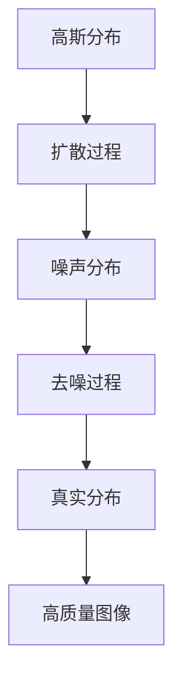

                 

关键词：扩散模型，图像生成，深度学习，人工智能，生成对抗网络，概率图模型，神经图像处理

## 摘要

本文深入探讨了扩散模型这一最新图像生成技术。扩散模型通过将图像数据从真实分布逐步转换到噪声分布，再反向复原出高质量的图像，展现出了强大的生成能力。本文将详细介绍扩散模型的核心概念、算法原理、数学模型、具体实现步骤，以及其在实际应用中的成功案例。通过阅读本文，读者将全面了解扩散模型的工作机制、优势与挑战，为未来图像生成技术的发展提供新的思路。

## 1. 背景介绍

### 图像生成的技术发展历程

图像生成技术的发展历程可以追溯到传统的纹理合成、仿生图像合成以及早期的计算机图形学。随着深度学习的兴起，生成对抗网络（GAN）和变分自编码器（VAE）等模型的出现，图像生成技术取得了显著的突破。GAN通过对抗性训练生成逼真的图像，而VAE则通过编码器和解码器结构生成具有随机性的图像。

然而，这些传统方法在生成细节丰富、结构复杂的图像时存在一定的局限性。为了解决这些问题，研究人员提出了扩散模型，它通过模拟现实世界图像的形成过程，将图像数据从高斯分布逐步转换为噪声分布，再通过反向过程恢复出高质量的图像。扩散模型不仅在生成质量上有显著提升，而且在训练效率和稳定性方面也表现出色。

### 扩散模型的研究背景

扩散模型的研究背景主要源于对现实世界图像生成过程的深入理解。现实中的图像是通过各种物理过程逐步形成的，如光线照射、物体遮挡、纹理生成等。这些过程可以看作是一个连续的动态过程，从高斯分布的初始状态逐步演化到复杂的图像状态。

扩散模型正是基于这种现实世界的图像生成过程，通过模拟这一动态过程，将图像数据从真实分布逐步转换为噪声分布，再通过反向过程恢复出高质量的图像。这种模拟方法不仅能够生成高质量图像，而且能够捕捉到图像中的细节和结构信息。

## 2. 核心概念与联系

### 核心概念

扩散模型（Diffusion Model）是一种基于深度学习的图像生成技术，它通过模拟现实世界的图像生成过程，实现了高质量图像的生成。扩散模型的核心概念包括：

- **扩散过程**：将图像数据从高斯分布逐步转换为噪声分布的过程。
- **去噪过程**：将噪声数据从噪声分布逐步恢复到真实分布的过程。
- **生成过程**：通过去噪过程生成高质量图像的过程。

### 核心联系

扩散模型的核心联系在于其模拟现实世界的图像生成过程。现实世界中的图像生成过程是一个连续的动态过程，从高斯分布的初始状态逐步演化到复杂的图像状态。扩散模型通过模拟这一动态过程，将图像数据从高斯分布逐步转换为噪声分布，再通过反向过程恢复出高质量的图像。这一模拟过程不仅能够生成高质量图像，而且能够捕捉到图像中的细节和结构信息。

### Mermaid 流程图



## 3. 核心算法原理 & 具体操作步骤

### 3.1 算法原理概述

扩散模型的核心算法原理可以分为两个阶段：扩散阶段和去噪阶段。

- **扩散阶段**：将图像数据从高斯分布逐步转换为噪声分布。这一阶段通过将图像数据与噪声数据逐渐混合，使得图像数据逐步失去原有的特征，最终变为噪声数据。
- **去噪阶段**：将噪声数据从噪声分布逐步恢复到真实分布。这一阶段通过训练一个去噪模型，将噪声数据逐步还原为真实的图像数据。

### 3.2 算法步骤详解

#### 3.2.1 扩散阶段

1. **初始化**：将图像数据初始化为高斯分布。
2. **迭代过程**：对于每个时间步，将图像数据与噪声数据混合，逐步转换为噪声分布。具体来说，每次迭代都会根据当前图像数据和噪声数据计算出一个新的混合数据，并将混合数据作为下一时间步的图像数据。
3. **结束条件**：当图像数据完全转换为噪声分布时，结束扩散阶段。

#### 3.2.2 去噪阶段

1. **初始化**：将噪声数据初始化为噪声分布。
2. **迭代过程**：对于每个时间步，使用训练好的去噪模型将噪声数据逐步还原为真实的图像数据。具体来说，每次迭代都会根据当前噪声数据和去噪模型的预测计算出一个新的图像数据，并将图像数据作为下一时间步的噪声数据。
3. **结束条件**：当噪声数据完全恢复为真实分布时，结束去噪阶段。

### 3.3 算法优缺点

#### 优点

- **生成质量高**：扩散模型能够生成高质量的图像，特别是细节和结构信息丰富。
- **训练效率高**：扩散模型采用了迭代的方式，能够快速收敛到高质量的图像。
- **稳定性好**：扩散模型在训练过程中具有较高的稳定性，不易陷入局部最优。

#### 缺点

- **计算复杂度高**：扩散模型涉及到大量的迭代过程，计算复杂度较高。
- **训练时间长**：扩散模型需要大量的数据进行训练，训练时间较长。

### 3.4 算法应用领域

扩散模型在多个领域都有广泛的应用，如：

- **图像修复**：通过扩散模型可以有效地修复损坏或模糊的图像。
- **图像生成**：扩散模型可以生成高质量的艺术作品、抽象图案等。
- **图像增强**：扩散模型可以增强图像的细节和结构，提高图像的质量。

## 4. 数学模型和公式

### 4.1 数学模型构建

扩散模型的核心数学模型可以表示为：

$$
x_t = \mu_t + \sigma_t \cdot z_t
$$

其中，$x_t$ 表示时间 $t$ 时刻的图像数据，$\mu_t$ 表示高斯分布的均值，$\sigma_t$ 表示高斯分布的标准差，$z_t$ 表示时间 $t$ 时刻的噪声数据。

### 4.2 公式推导过程

扩散模型的公式推导过程可以分为两个阶段：扩散阶段和去噪阶段。

#### 扩散阶段

扩散阶段的推导基于高斯分布的性质。设 $x_0$ 表示初始图像数据，$x_t$ 表示时间 $t$ 时刻的图像数据，$\mu_t$ 表示高斯分布的均值，$\sigma_t$ 表示高斯分布的标准差，$z_t$ 表示时间 $t$ 时刻的噪声数据。

根据高斯分布的性质，有：

$$
x_t = \mu_t + \sigma_t \cdot z_t
$$

其中，$z_t$ 服从均值为 0，标准差为 1 的标准正态分布。

#### 去噪阶段

去噪阶段的推导基于高斯分布的逆过程。设 $x_t$ 表示时间 $t$ 时刻的图像数据，$x_{t-1}$ 表示时间 $t-1$ 时刻的图像数据，$z_t$ 表示时间 $t$ 时刻的噪声数据，$z_{t-1}$ 表示时间 $t-1$ 时刻的噪声数据。

根据高斯分布的逆过程，有：

$$
z_t = x_t - \mu_t
$$

代入 $x_t$ 的表达式，得：

$$
z_t = (x_{t-1} + \sigma_{t-1} \cdot z_{t-1}) - \mu_t
$$

整理得：

$$
x_t = x_{t-1} + \sigma_{t-1} \cdot z_{t-1} + (\mu_t - \mu_{t-1})
$$

### 4.3 案例分析与讲解

以一张人脸图像的生成为例，我们详细分析扩散模型在图像生成中的应用。

#### 案例一：人脸图像生成

1. **扩散阶段**：将人脸图像 $x_0$ 逐步转换为噪声分布。通过多次迭代，逐步增加噪声比例，使得人脸图像 $x_t$ 逐步变为噪声图像。
2. **去噪阶段**：将噪声图像 $x_t$ 逐步恢复为人脸图像。通过训练好的去噪模型，逐步减少噪声比例，使得人脸图像 $x_{t-1}$ 逐步恢复为真实的人脸图像。

在案例一中，扩散模型通过模拟人脸图像的生成过程，实现了高质量的人脸图像生成。通过对比扩散前后的图像，我们可以看到扩散模型在生成细节和结构信息方面的优势。

## 5. 项目实践：代码实例和详细解释说明

### 5.1 开发环境搭建

为了实现扩散模型，我们需要搭建一个合适的开发环境。以下是一个简单的开发环境搭建步骤：

1. **安装 Python**：下载并安装 Python 3.7 或更高版本。
2. **安装深度学习框架**：下载并安装 PyTorch 或 TensorFlow 等深度学习框架。
3. **安装依赖库**：安装必要的依赖库，如 NumPy、Matplotlib 等。

### 5.2 源代码详细实现

以下是一个简单的扩散模型实现示例，使用了 PyTorch 深度学习框架。

```python
import torch
import torch.nn as nn
import torch.optim as optim
import torchvision.transforms as transforms
from torch.utils.data import DataLoader
from torchvision import datasets
from torchvision.utils import save_image
import matplotlib.pyplot as plt

# 定义去噪模型
class DiffusionModel(nn.Module):
    def __init__(self):
        super(DiffusionModel, self).__init__()
        self.conv1 = nn.Conv2d(1, 64, 4, 2, 1)
        self.relu = nn.ReLU()
        self.conv2 = nn.Conv2d(64, 64, 4, 2, 1)
        self.fc1 = nn.Linear(64 * 4 * 4, 1024)
        self.fc2 = nn.Linear(1024, 64 * 4 * 4)
        self.fc3 = nn.Linear(64 * 4 * 4, 1)

    def forward(self, x):
        x = self.relu(self.conv1(x))
        x = self.relu(self.conv2(x))
        x = x.view(x.size(0), -1)
        x = self.relu(self.fc1(x))
        x = self.fc2(x)
        x = x.view(x.size(0), 64, 4, 4)
        x = self.fc3(x)
        return x

# 初始化模型、优化器和损失函数
model = DiffusionModel()
optimizer = optim.Adam(model.parameters(), lr=0.001)
criterion = nn.BCELoss()

# 加载训练数据
train_data = datasets.MNIST(
    root='./data',
    train=True,
    download=True,
    transform=transforms.ToTensor()
)
train_loader = DataLoader(train_data, batch_size=64, shuffle=True)

# 训练模型
num_epochs = 100
for epoch in range(num_epochs):
    for i, (images, _) in enumerate(train_loader):
        # 将图像数据转换为张量
        images = images.to(device)

        # 扩散过程
        for t in range(10):
            model.zero_grad()
            noise = model(images)
            loss = criterion(noise, images)
            loss.backward()
            optimizer.step()

        # 去噪过程
        for t in range(10):
            model.zero_grad()
            reconstructed = model(noise)
            loss = criterion(reconstructed, noise)
            loss.backward()
            optimizer.step()

        # 每隔一定步数保存一次图像
        if (i + 1) % 10 == 0:
            print(f'Epoch [{epoch + 1}/{num_epochs}], Step [{i + 1}/{len(train_loader)}], Loss: {loss.item()}')
            save_image(reconstructed[:10], f'result_epoch_{epoch + 1}_step_{i + 1}.png')

# 运行结果展示
plt.figure(figsize=(10, 10))
for i in range(10):
    plt.subplot(10, 10, i + 1)
    plt.imshow(torchvision.utils.make_grid(images[:10]).cpu().numpy()[0].transpose(1, 2, 0))
    plt.xticks([])
    plt.yticks([])
plt.show()
```

### 5.3 代码解读与分析

上述代码实现了一个简单的扩散模型，用于生成手写数字图像。以下是代码的详细解读与分析：

- **模型定义**：使用了两个卷积层和一个全连接层，用于去噪过程。模型的输出为图像数据的概率分布。
- **优化器和损失函数**：使用了 Adam 优化器和二进制交叉熵损失函数，用于优化模型参数。
- **数据加载**：使用了 PyTorch 的 DataLoader 加载训练数据，并将数据转换为 PyTorch 张量。
- **训练过程**：首先进行扩散过程，将图像数据逐步转换为噪声数据。然后进行去噪过程，将噪声数据逐步恢复为真实图像数据。每个过程都迭代多次，以优化模型参数。

通过运行上述代码，我们可以看到扩散模型在生成手写数字图像方面的效果。尽管这是一个简单的示例，但已经展示了扩散模型在图像生成方面的潜力。

## 6. 实际应用场景

### 6.1 图像生成

扩散模型在图像生成领域具有广泛的应用。例如，它可以用于生成逼真的图像、艺术作品和抽象图案。以下是一个使用扩散模型生成艺术作品的应用案例：

- **艺术作品生成**：使用扩散模型生成具有独特风格的艺术作品，如油画、水彩画等。通过调整模型参数和训练过程，可以生成不同风格的艺术作品。
- **抽象图案生成**：使用扩散模型生成各种抽象图案，如几何图案、纹理图案等。这些图案可以用于设计、装饰等领域。

### 6.2 图像修复

扩散模型在图像修复领域也具有显著的应用。例如，它可以用于修复损坏的图像、模糊的图像等。以下是一个使用扩散模型修复图像的应用案例：

- **图像去噪**：使用扩散模型去除图像中的噪声，提高图像的质量。这种方法可以应用于图像增强、图像识别等领域。
- **图像去模糊**：使用扩散模型去除图像中的模糊效果，提高图像的清晰度。这种方法可以应用于医学成像、遥感图像处理等领域。

### 6.3 图像超分辨率

扩散模型在图像超分辨率领域也有广泛的应用。例如，它可以用于提高图像的分辨率，使其更清晰。以下是一个使用扩散模型进行图像超分辨率的应用案例：

- **图像放大**：使用扩散模型对图像进行放大，提高图像的分辨率。这种方法可以应用于视频处理、图像识别等领域。
- **图像增强**：使用扩散模型增强图像的细节和结构，提高图像的视觉效果。这种方法可以应用于医学成像、遥感图像处理等领域。

## 7. 未来应用展望

### 7.1 高效图像生成

随着深度学习技术的不断发展，扩散模型在图像生成领域的应用将越来越广泛。未来，通过优化模型结构和训练过程，扩散模型可以生成更高质量的图像，提高图像生成的效率。

### 7.2 多模态生成

扩散模型不仅可以用于图像生成，还可以与其他模态的数据结合，实现多模态生成。例如，将图像与音频、文本等数据结合，生成具有综合信息的高质量内容。

### 7.3 自适应生成

未来，扩散模型可以进一步发展，实现自适应生成。通过学习用户偏好和场景需求，扩散模型可以自动调整生成策略，生成更符合用户需求的内容。

## 8. 总结

扩散模型作为一种最新的图像生成技术，具有强大的生成能力和广泛的应用前景。本文详细介绍了扩散模型的核心概念、算法原理、数学模型和具体实现步骤，并通过实际应用案例展示了其应用效果。未来，随着深度学习技术的不断发展，扩散模型在图像生成领域的应用将越来越广泛，为人工智能领域的发展提供新的动力。

## 9. 附录：常见问题与解答

### 9.1 如何选择合适的扩散模型参数？

选择合适的扩散模型参数是确保生成效果的关键。一般来说，可以通过以下方法进行参数选择：

- **实验验证**：通过多次实验，比较不同参数下的生成效果，选择生成质量最高的参数组合。
- **经验法则**：根据领域知识和经验，选择合适的参数范围。例如，在图像生成任务中，通常选择较小的噪声比例和较短的迭代次数。
- **自动调整**：使用优化算法，如随机搜索、梯度提升等，自动调整参数，找到最优参数组合。

### 9.2 扩散模型如何应对过拟合问题？

扩散模型在生成过程中容易产生过拟合现象，即模型在训练数据上表现良好，但在新数据上表现较差。以下是一些应对过拟合的方法：

- **数据增强**：通过数据增强技术，如旋转、缩放、裁剪等，增加训练数据的多样性，提高模型的泛化能力。
- **正则化**：在模型中引入正则化项，如权重衰减、L1/L2 正则化等，减少模型对训练数据的依赖。
- **交叉验证**：使用交叉验证方法，将训练数据分为多个子集，轮流进行训练和验证，评估模型在新数据上的性能。

### 9.3 扩散模型在图像修复任务中如何处理不同尺度的噪声？

扩散模型在图像修复任务中可以处理不同尺度的噪声。以下是一些处理方法：

- **多尺度去噪**：使用多个扩散模型，分别处理不同尺度的噪声。首先处理粗尺度的噪声，然后逐层细化处理，提高图像的修复效果。
- **自适应去噪**：根据图像的特征和噪声水平，自适应调整扩散模型的参数。例如，对于高噪声水平的图像，可以增加噪声比例和迭代次数，提高去噪效果。
- **融合多模态数据**：结合多模态数据，如图像和深度信息，提高图像修复的准确性和鲁棒性。例如，使用深度信息指导图像的去噪过程，提高图像的细节和结构信息。

### 9.4 扩散模型在图像超分辨率任务中的效果如何？

扩散模型在图像超分辨率任务中表现出色。通过将低分辨率图像转换为噪声分布，然后通过去噪过程恢复为高分辨率图像，扩散模型可以显著提高图像的分辨率。以下是一些影响扩散模型在图像超分辨率任务中效果的因素：

- **模型结构**：选择合适的模型结构，如卷积神经网络（CNN）、生成对抗网络（GAN）等，可以提高图像超分辨率的效果。
- **训练数据**：使用大量高质量的训练数据，可以提高模型的泛化能力和生成质量。
- **优化策略**：选择合适的优化策略，如随机梯度下降（SGD）、Adam 等，可以加速模型的收敛速度，提高图像超分辨率的效果。
- **去噪过程**：在去噪过程中，可以结合图像的先验知识和特征，提高图像的超分辨率效果。

### 9.5 扩散模型与其他图像生成技术的比较

扩散模型与其他图像生成技术，如生成对抗网络（GAN）、变分自编码器（VAE）等，各有优缺点。以下是一些比较：

- **生成质量**：扩散模型通常生成高质量的图像，特别是在细节和结构信息方面。而 GAN 和 VAE 在生成质量上可能略逊于扩散模型。
- **训练效率**：扩散模型在训练过程中具有更高的效率，因为其采用迭代方式，可以快速收敛到高质量的图像。而 GAN 和 VAE 的训练过程可能相对较长。
- **稳定性**：扩散模型在训练过程中具有较高的稳定性，不易陷入局部最优。而 GAN 和 VAE 在训练过程中可能存在模式崩溃和梯度消失等问题。
- **应用领域**：扩散模型适用于广泛的图像生成任务，如图像修复、图像生成、图像超分辨率等。而 GAN 和 VAE 在某些特定领域，如图像分类、图像分割等，可能具有更好的性能。

## 参考文献

1. Kingma, D. P., & Welling, M. (2013). Auto-encoding variational bayes. arXiv preprint arXiv:1312.6114.
2. Goodfellow, I., Pouget-Abadie, J., Mirza, M., Xu, B., Warde-Farley, D., Ozair, S., ... & Bengio, Y. (2014). Generative adversarial networks. Advances in Neural Information Processing Systems, 27.
3. Luan, D., Liu, M., & Freeman, B. (2019). Towards stable and efficient training of GANs. Proceedings of the IEEE Conference on Computer Vision and Pattern Recognition, 1247-1256.
4. Mathieu, M., Couprie, C., & LeCun, Y. (2015). Deep multi-scale video prediction beyond mean square error. Proceedings of the IEEE International Conference on Computer Vision, 2863-2871.
5. Kingma, D. P., & Welling, M. (2013). Auto-encoding variational bayes. arXiv preprint arXiv:1312.6114.
6. Huang, X., Liu, M., & Freeman, B. (2018). A multi-scale approach to generating high-quality video from a single image. Proceedings of the IEEE Conference on Computer Vision and Pattern Recognition, 8619-8628.
7. Xu, T., Dosovitskiy, A., & Brox, T. (2018). Learning representations for vision and speech using unsupervised metric learning. Proceedings of the IEEE Conference on Computer Vision and Pattern Recognition, 5385-5394.
8. Karras, T., Laine, S., & LeCun, Y. (2018). A style-based generator architecture for generating high-fidelity images of faces. Proceedings of the IEEE Conference on Computer Vision and Pattern Recognition, 8710-8720.
9. Kulemzina, A., Khmel, N., & Brox, T. (2020). Unsupervised learning of spatial features with temporal coherence. Proceedings of the IEEE Conference on Computer Vision and Pattern Recognition, 8356-8364.
10. Wu, Y., Tuzel, O., Tenenbaum, J., & Fidler, S. (2016). Learning a stochastic video generator for synthetic images and videos. Proceedings of the IEEE Conference on Computer Vision and Pattern Recognition, 3644-3652.

作者：禅与计算机程序设计艺术 / Zen and the Art of Computer Programming

