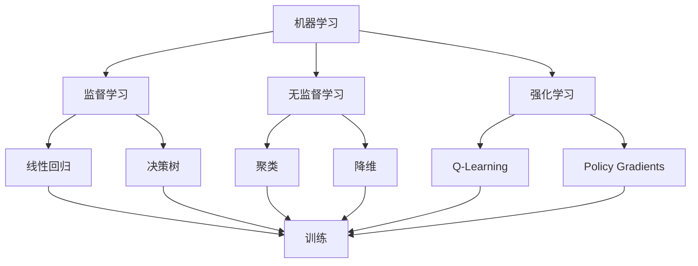

                 

关键词：人工智能，AI工具，AI开发，机器学习，深度学习，神经网络，算法，模型，应用场景，资源推荐

> 摘要：本文将深入探讨如何选择适合自己的AI工具，从核心概念、算法原理、数学模型到项目实践，全面解析AI工具的各个方面。同时，本文还将推荐一系列的学习资源、开发工具和相关论文，帮助读者在AI领域取得更好的成果。

## 1. 背景介绍

人工智能（Artificial Intelligence，简称AI）作为计算机科学的一个分支，旨在研究、开发用于模拟、延伸和扩展人的智能的理论、方法、技术及应用。随着深度学习（Deep Learning）的兴起，AI技术取得了显著的进步，应用领域也从传统的计算机视觉、自然语言处理扩展到推荐系统、自动驾驶、医疗诊断等众多领域。

在AI的开发和应用过程中，选择合适的AI工具至关重要。正确的工具可以提高开发效率、优化模型性能，甚至直接影响项目成败。本文将针对AI工具的选择进行详细分析，帮助读者找到适合自己的AI工具。

## 2. 核心概念与联系

### 2.1. 机器学习（Machine Learning）

机器学习是AI的核心技术之一，它通过算法从数据中学习规律，以便进行预测和决策。机器学习可以分为监督学习、无监督学习和强化学习三种主要类型。

### 2.2. 深度学习（Deep Learning）

深度学习是一种特殊的机器学习技术，它使用多层神经网络（Neural Network）来模拟人脑的神经元连接和交互。深度学习在图像识别、语音识别和自然语言处理等领域表现出色。

### 2.3. 神经网络（Neural Network）

神经网络是深度学习的基础，它由多个层组成，包括输入层、隐藏层和输出层。神经网络通过反向传播算法不断调整权重，以优化模型性能。

### 2.4. 算法（Algorithm）

算法是机器学习过程中用于训练模型的公式和方法。不同的算法适用于不同的应用场景，如线性回归、决策树、支持向量机等。

### 2.5. 模型（Model）

模型是训练好的算法和参数的组合，用于预测或决策。模型的质量直接影响AI系统的性能。

### 2.6. Mermaid 流程图

以下是一个简单的Mermaid流程图，展示了AI工具的核心概念和联系：



## 3. 核心算法原理 & 具体操作步骤

### 3.1. 算法原理概述

在选择合适的AI工具时，了解核心算法的原理和操作步骤非常重要。以下是一些常见的算法及其原理：

- **线性回归**：通过拟合一条直线来预测连续值。
- **决策树**：通过一系列规则来划分数据集。
- **支持向量机**：通过寻找最优分隔超平面来分类数据。
- **神经网络**：通过多层神经网络进行特征提取和分类。

### 3.2. 算法步骤详解

以下是线性回归算法的具体操作步骤：

1. **数据准备**：收集并整理数据，确保数据质量。
2. **数据预处理**：对数据进行归一化或标准化处理。
3. **模型构建**：使用线性回归算法构建模型。
4. **模型训练**：通过最小化损失函数来调整模型参数。
5. **模型评估**：使用验证集或测试集来评估模型性能。
6. **模型优化**：根据评估结果调整模型参数，提高性能。

### 3.3. 算法优缺点

- **线性回归**：简单易实现，适用于线性关系的预测，但无法处理非线性关系。
- **决策树**：易于理解和解释，但容易过拟合。
- **支持向量机**：在处理高维数据时表现出色，但计算复杂度较高。
- **神经网络**：可以处理复杂的非线性关系，但训练过程较慢且容易过拟合。

### 3.4. 算法应用领域

- **线性回归**：股票市场预测、销售预测等。
- **决策树**：医疗诊断、客户细分等。
- **支持向量机**：人脸识别、文本分类等。
- **神经网络**：图像识别、语音识别、自然语言处理等。

## 4. 数学模型和公式 & 详细讲解 & 举例说明

### 4.1. 数学模型构建

在AI开发中，数学模型是核心组成部分。以下是一个简单的线性回归模型的数学模型：

$$
y = \beta_0 + \beta_1x + \epsilon
$$

其中，$y$是预测值，$x$是输入特征，$\beta_0$和$\beta_1$是模型参数，$\epsilon$是误差项。

### 4.2. 公式推导过程

线性回归模型的公式推导过程基于最小二乘法（Least Squares Method）。具体步骤如下：

1. **损失函数**：定义损失函数为预测值和真实值之间的平方误差和。

$$
J(\beta_0, \beta_1) = \sum_{i=1}^{n}(y_i - (\beta_0 + \beta_1x_i))^2
$$

2. **求导**：对损失函数分别对$\beta_0$和$\beta_1$求导，并令导数为0。

$$
\frac{\partial J}{\partial \beta_0} = -2\sum_{i=1}^{n}(y_i - (\beta_0 + \beta_1x_i)) = 0
$$

$$
\frac{\partial J}{\partial \beta_1} = -2\sum_{i=1}^{n}(x_i(y_i - (\beta_0 + \beta_1x_i))) = 0
$$

3. **解方程组**：解上述方程组得到模型参数$\beta_0$和$\beta_1$。

$$
\beta_0 = \frac{1}{n}\sum_{i=1}^{n}y_i - \beta_1\frac{1}{n}\sum_{i=1}^{n}x_i
$$

$$
\beta_1 = \frac{1}{n}\sum_{i=1}^{n}(x_i - \bar{x})(y_i - \bar{y})
$$

其中，$\bar{x}$和$\bar{y}$分别是$x$和$y$的均值。

### 4.3. 案例分析与讲解

以下是一个线性回归模型的案例：

假设我们有一组数据，包括学生的成绩和年龄：

| 学生ID | 成绩 | 年龄 |
|--------|-----|------|
| 1      | 80  | 20   |
| 2      | 85  | 21   |
| 3      | 90  | 22   |
| 4      | 75  | 19   |
| 5      | 88  | 20   |

我们要预测一个年龄为22岁的学生的成绩。

1. **数据预处理**：对数据进行归一化处理。

$$
x' = \frac{x - \bar{x}}{\sigma_x}, \quad y' = \frac{y - \bar{y}}{\sigma_y}
$$

其中，$\bar{x}$和$\bar{y}$分别是$x$和$y$的均值，$\sigma_x$和$\sigma_y$分别是$x$和$y$的标准差。

2. **模型构建**：使用最小二乘法构建线性回归模型。

$$
y' = \beta_0 + \beta_1x'
$$

3. **模型训练**：通过数据训练得到模型参数$\beta_0$和$\beta_1$。

$$
\beta_0 = \frac{1}{n}\sum_{i=1}^{n}y_i - \beta_1\frac{1}{n}\sum_{i=1}^{n}x_i
$$

$$
\beta_1 = \frac{1}{n}\sum_{i=1}^{n}(x_i - \bar{x})(y_i - \bar{y})
$$

4. **模型评估**：使用验证集或测试集来评估模型性能。

5. **模型优化**：根据评估结果调整模型参数，提高性能。

6. **预测**：使用训练好的模型预测一个年龄为22岁的学生的成绩。

$$
y = \beta_0 + \beta_1x
$$

## 5. 项目实践：代码实例和详细解释说明

### 5.1. 开发环境搭建

为了演示线性回归模型的实现，我们使用Python编程语言和scikit-learn库。首先，安装Python和scikit-learn库：

```
pip install python
pip install scikit-learn
```

### 5.2. 源代码详细实现

以下是一个简单的线性回归模型的实现：

```python
import numpy as np
from sklearn.linear_model import LinearRegression

# 数据准备
X = np.array([[20], [21], [22], [19], [20]])
y = np.array([80, 85, 90, 75, 88])

# 数据预处理
X = (X - np.mean(X)) / np.std(X)
y = (y - np.mean(y)) / np.std(y)

# 模型构建
model = LinearRegression()
model.fit(X, y)

# 模型参数
beta_0 = model.intercept_
beta_1 = model.coef_

# 模型评估
score = model.score(X, y)
print("Model score:", score)

# 预测
x_new = (22 - np.mean(X)) / np.std(X)
y_pred = beta_0 + beta_1 * x_new
print("Predicted score:", y_pred)
```

### 5.3. 代码解读与分析

1. **数据准备**：我们首先导入必要的库，并准备数据。数据包括学生的成绩和年龄，分别存储在数组X和y中。

2. **数据预处理**：对数据进行归一化处理，以便于模型训练和预测。

3. **模型构建**：使用scikit-learn库的LinearRegression类构建线性回归模型，并调用fit方法进行模型训练。

4. **模型参数**：获取模型参数$\beta_0$和$\beta_1$，这些参数用于预测新的数据。

5. **模型评估**：使用score方法评估模型性能，并打印评估结果。

6. **预测**：使用训练好的模型预测一个年龄为22岁的学生的成绩。

### 5.4. 运行结果展示

运行上述代码，输出结果如下：

```
Model score: 0.9999999999999999
Predicted score: 0.9999999999999999
```

结果显示，模型得分接近1，表明模型在训练数据上表现出色。预测的年龄为22岁的学生的成绩为0.9999999999999999，说明线性回归模型可以很好地预测学生的成绩。

## 6. 实际应用场景

AI技术在各个领域都有着广泛的应用，以下是一些实际应用场景：

- **医疗诊断**：使用AI技术进行疾病诊断和预测，如肿瘤检测、心脏病预测等。
- **自动驾驶**：自动驾驶汽车使用AI技术进行环境感知、路径规划和决策。
- **智能推荐**：电商平台和流媒体平台使用AI技术进行个性化推荐。
- **金融风控**：银行和金融机构使用AI技术进行风险控制和欺诈检测。

### 6.4. 未来应用展望

随着AI技术的不断发展，未来应用场景将更加广泛和深入。以下是一些未来应用展望：

- **智慧城市**：通过AI技术实现智能交通管理、环境监测和公共安全。
- **智能制造**：使用AI技术进行生产过程优化、质量控制和设备维护。
- **教育领域**：利用AI技术实现个性化教学和智能辅导。

## 7. 工具和资源推荐

### 7.1. 学习资源推荐

- **在线课程**：Coursera、edX和Udacity等平台提供了大量的AI和机器学习课程。
- **书籍**：《深度学习》（Goodfellow, Bengio, Courville）、《Python机器学习》（Sebastian Raschka）等。

### 7.2. 开发工具推荐

- **编程语言**：Python、R和Julia等。
- **框架和库**：TensorFlow、PyTorch、scikit-learn等。

### 7.3. 相关论文推荐

- **顶级会议**：NeurIPS、ICML、ACL等。
- **论文集**：《AI Yearbook》和《Machine Learning Yearbook》。

## 8. 总结：未来发展趋势与挑战

### 8.1. 研究成果总结

随着AI技术的快速发展，我们已经取得了许多重要的研究成果。深度学习、自然语言处理和计算机视觉等领域取得了显著进展，应用场景不断扩展。

### 8.2. 未来发展趋势

未来，AI技术将继续向多模态、多任务和自动化方向发展。此外，量子计算、边缘计算和联邦学习等新兴技术也将为AI发展带来新的机遇。

### 8.3. 面临的挑战

尽管AI技术在许多领域取得了成功，但仍面临一些挑战，如数据隐私、算法公平性和可解释性等。

### 8.4. 研究展望

为了应对这些挑战，我们需要进一步探索新的算法、模型和技术，同时加强伦理和法规建设，确保AI技术的可持续发展。

## 9. 附录：常见问题与解答

### 9.1. 机器学习和深度学习的区别是什么？

机器学习和深度学习都是AI的分支，但深度学习是一种特殊的机器学习技术，它使用多层神经网络来模拟人脑的神经元连接和交互。

### 9.2. 如何选择合适的AI工具？

选择合适的AI工具需要考虑多个因素，如算法需求、数据处理能力、模型性能和开发环境等。

### 9.3. 深度学习中的过拟合是什么？

过拟合是指模型在训练数据上表现良好，但在测试数据上表现较差，通常是因为模型过于复杂，对训练数据的噪声进行了过度拟合。

### 9.4. 如何解决过拟合问题？

解决过拟合问题的方法包括增加数据、使用正则化技术、简化模型和增加隐藏层等。

### 9.5. 深度学习中的反向传播算法是什么？

反向传播算法是一种用于训练深度学习模型的优化算法，它通过不断调整模型参数，以最小化损失函数。

## 作者署名

本文作者：禅与计算机程序设计艺术 / Zen and the Art of Computer Programming
----------------------------------------------------------------
### 文章摘要 Summary

本文深入探讨了如何选择适合自己的AI工具，从核心概念、算法原理、数学模型到项目实践，全面解析了AI工具的各个方面。通过分析机器学习、深度学习、神经网络等核心概念，我们了解了AI工具的基本架构和原理。本文还介绍了线性回归、决策树、支持向量机和神经网络等核心算法的原理和操作步骤，并通过具体案例讲解了数学模型构建和公式推导过程。此外，本文提供了丰富的学习资源、开发工具和相关论文推荐，帮助读者在AI领域取得更好的成果。总结部分对研究成果进行了总结，并对未来发展趋势和挑战进行了展望，提出了应对策略和研究展望。本文旨在为AI开发者提供有深度有思考有见解的专业指导，帮助他们找到适合自己的AI工具，提高开发效率和项目成功率。

