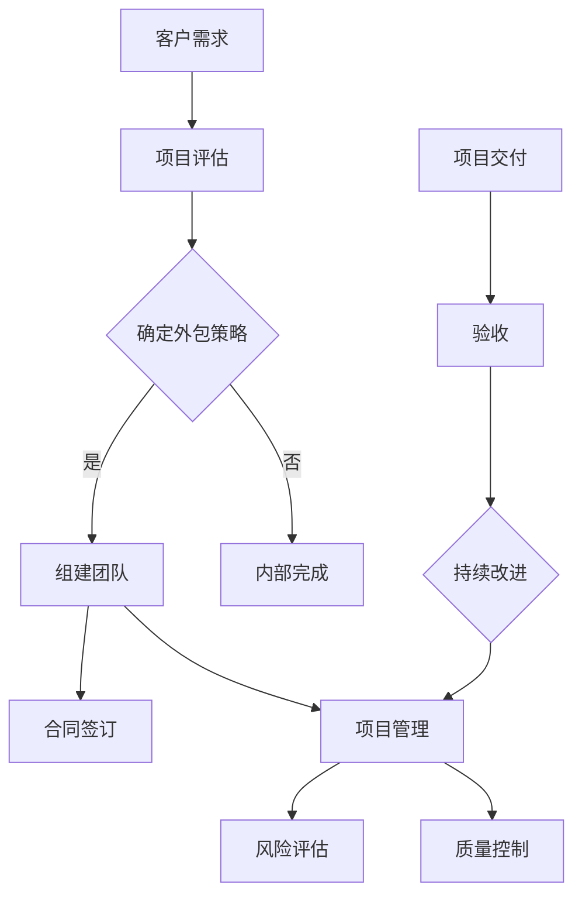

                 

 **关键词**：技术外包，项目管理，团队建设，软件开发，合同管理，风险控制，质量保证，业务流程

**摘要**：本文将深入探讨技术外包业务从接单到建立团队的全过程。我们首先分析技术外包的背景和必要性，然后详细讲解外包项目管理、团队组建、风险评估和质量控制等关键环节，最后探讨未来的发展趋势与面临的挑战。希望通过本文，读者能够全面了解技术外包业务，掌握其运作模式，为未来的外包工作打下坚实基础。

## 1. 背景介绍

技术外包，是指企业或个人将某些特定的技术任务外包给专业的团队或个人完成。这种业务模式在当前全球化、信息化和数字化的时代背景下应运而生，具有以下几个特点：

1. **全球资源整合**：技术外包打破了地域限制，企业可以根据项目需求在全球范围内选择合适的合作伙伴。
2. **成本节约**：外包可以将人力成本、管理成本等转移到外部，从而降低整体运营成本。
3. **专业技能集中**：专业的外包团队通常拥有更高的专业技能和丰富的经验，能够高效完成项目任务。
4. **灵活性高**：企业可以根据项目需求随时调整外包团队规模和结构。

技术外包的背景可以从以下几个方面来理解：

1. **市场需求**：随着互联网、大数据、人工智能等技术的快速发展，企业对专业技术人才的需求不断增长。而企业内部很难在短时间内满足这种需求，因此选择外包成为了一种有效的解决方案。
2. **成本控制**：在经济全球化的背景下，企业面临着越来越大的成本压力。通过外包，企业可以将一些非核心业务转移出去，从而集中资源进行核心业务的发展。
3. **项目管理**：技术外包项目通常涉及跨部门、跨地域的协作，对项目管理的要求较高。外包团队的专业性能够提高项目的执行效率和质量。

## 2. 核心概念与联系

在探讨技术外包的过程中，我们需要明确一些核心概念，并理解它们之间的联系。以下是一个简化的 Mermaid 流程图，展示了这些核心概念：



### 2.1 客户需求

客户需求是技术外包项目的起点。企业或个人在明确了自身的业务需求后，会对外部资源进行评估，以确定是否选择外包。

### 2.2 项目评估

项目评估包括对客户需求的分析、项目风险的评估以及外包成本的估算。这一阶段至关重要，决定了项目是否能够顺利进行。

### 2.3 确定外包策略

根据项目评估的结果，企业需要决定是选择外包还是内部完成。如果决定外包，将进入组建团队阶段。

### 2.4 组建团队

组建团队是技术外包项目的关键环节。企业需要选择合适的合作伙伴，并与其签订合同。

### 2.5 合同签订

合同签订是确保双方权益的重要法律文件。合同内容应包括项目范围、交付标准、付款方式、违约责任等。

### 2.6 项目管理

项目管理包括项目计划、项目执行、项目监控和项目收尾。在这一阶段，企业需要确保项目按计划进行，并随时应对可能出现的问题。

### 2.7 风险评估

风险评估是项目管理的重要环节。企业需要识别项目风险，并制定相应的应对措施。

### 2.8 质量控制

质量控制是确保项目交付成果符合客户需求的关键。企业需要建立完善的质量控制体系，并对项目过程进行持续监控。

### 2.9 项目交付与验收

项目交付与验收是技术外包项目的终点。企业需要确保项目交付成果符合合同要求，并通过客户的验收。

### 2.10 持续改进

项目交付后，企业需要对项目过程进行总结和反思，以不断改进外包业务流程。

## 3. 核心算法原理 & 具体操作步骤

### 3.1 算法原理概述

技术外包项目的核心算法原理可以归结为以下几个方面：

1. **需求分析**：通过客户访谈、问卷调查等方式，收集并分析客户需求，明确项目目标和交付标准。
2. **风险评估**：对项目进行全面的评估，识别潜在的风险，并制定相应的风险应对策略。
3. **项目管理**：采用项目管理方法论，如敏捷开发、瀑布模型等，确保项目按计划进行。
4. **质量控制**：建立完善的质量控制体系，包括代码审查、测试用例编写、持续集成等，确保项目交付成果的质量。

### 3.2 算法步骤详解

1. **需求分析**

   - 客户访谈：通过与客户的面对面交流，了解客户的业务背景、需求痛点和发展愿景。
   - 需求收集：整理客户需求，形成项目需求文档。
   - 需求评审：组织相关部门对需求文档进行评审，确保需求的准确性和可行性。

2. **风险评估**

   - 风险识别：通过项目文档、访谈记录等，识别项目风险。
   - 风险评估：对识别出的风险进行评估，确定风险等级和影响范围。
   - 风险应对：根据风险评估结果，制定相应的风险应对策略。

3. **项目管理**

   - 项目计划：制定项目计划，包括项目范围、任务分解、时间安排、资源分配等。
   - 项目执行：按照项目计划执行任务，确保项目按计划进行。
   - 项目监控：对项目进展进行监控，及时发现并解决问题。
   - 项目收尾：完成项目交付，进行项目总结和反思。

4. **质量控制**

   - 代码审查：对编写好的代码进行审查，确保代码质量。
   - 测试用例编写：编写测试用例，对项目交付成果进行功能测试和性能测试。
   - 持续集成：采用持续集成工具，实现代码的自动化构建和测试。

### 3.3 算法优缺点

1. **优点**

   - **高效性**：通过专业的团队和先进的方法论，能够高效完成项目任务。
   - **灵活性**：根据项目需求，可以灵活调整团队规模和结构。
   - **成本节约**：将非核心业务外包，可以降低整体运营成本。

2. **缺点**

   - **沟通成本**：由于项目涉及跨部门、跨地域的协作，沟通成本较高。
   - **质量控制**：外包项目的质量控制相对较难，需要建立完善的质量控制体系。
   - **法律风险**：合同签订和法律纠纷可能影响项目的顺利进行。

### 3.4 算法应用领域

技术外包算法原理广泛应用于以下几个方面：

1. **软件开发**：企业可以将软件开发任务外包给专业的团队，实现快速交付。
2. **系统集成**：企业可以将系统集成任务外包，提高项目执行效率。
3. **IT 咨询**：企业可以聘请专业的 IT 咨询团队，提供技术支持和解决方案。
4. **数据分析**：企业可以将数据分析任务外包，利用专业团队的数据分析能力。

## 4. 数学模型和公式 & 详细讲解 & 举例说明

### 4.1 数学模型构建

技术外包项目的数学模型可以基于以下公式构建：

1. **项目成本模型**：

   $$C = C_p + C_c$$

   其中，$C_p$ 表示项目固定成本，$C_c$ 表示项目可变成本。

2. **项目时间模型**：

   $$T = T_p + T_c$$

   其中，$T_p$ 表示项目计划时间，$T_c$ 表示项目实际完成时间。

3. **项目风险模型**：

   $$R = R_i \times P_i$$

   其中，$R_i$ 表示项目风险概率，$P_i$ 表示项目风险影响。

### 4.2 公式推导过程

1. **项目成本模型**推导：

   项目成本由固定成本和可变成本组成。固定成本是指在项目开始前就需要支付的费用，如设备采购、人员培训等。可变成本是指在项目执行过程中产生的费用，如人力成本、物料采购等。

   因此，项目成本模型可以表示为：

   $$C = C_p + C_c$$

2. **项目时间模型**推导：

   项目时间由计划时间和实际完成时间组成。计划时间是指根据项目需求和资源情况预测的项目完成时间。实际完成时间是指项目实际完成所需的时间。

   因此，项目时间模型可以表示为：

   $$T = T_p + T_c$$

3. **项目风险模型**推导：

   项目风险由风险概率和风险影响组成。风险概率是指项目发生风险的可能性。风险影响是指项目发生风险后对项目进度、成本、质量等方面的影响。

   因此，项目风险模型可以表示为：

   $$R = R_i \times P_i$$

### 4.3 案例分析与讲解

假设一个技术外包项目，项目固定成本为 $100,000 元，项目可变成本为 $5000 元/月。根据项目需求，项目计划时间为 3 个月。项目风险概率为 0.2，风险影响为 0.5。

1. **项目成本计算**：

   $$C = C_p + C_c = 100,000 + 5000 \times 3 = 155,000 元$$

2. **项目时间计算**：

   $$T = T_p + T_c = 3 + 0.2 \times 3 = 3.6 个月$$

3. **项目风险计算**：

   $$R = R_i \times P_i = 0.2 \times 0.5 = 0.1$$

通过上述计算，我们可以得出以下结论：

- 项目总成本为 155,000 元。
- 项目预计完成时间为 3.6 个月。
- 项目风险为 0.1。

这些数据可以为项目管理者提供决策依据，以便更好地控制项目成本、时间和风险。

## 5. 项目实践：代码实例和详细解释说明

### 5.1 开发环境搭建

在开始技术外包项目的开发前，我们需要搭建一个合适的开发环境。以下是一个简化的开发环境搭建步骤：

1. **操作系统**：选择 Linux 或 macOS 作为开发操作系统。
2. **编程语言**：根据项目需求选择合适的编程语言，如 Java、Python 等。
3. **开发工具**：安装集成开发环境（IDE），如 IntelliJ IDEA、Visual Studio Code 等。
4. **版本控制**：安装版本控制系统，如 Git，并进行初始化。
5. **数据库**：选择合适的数据库，如 MySQL、PostgreSQL 等，并进行安装和配置。
6. **中间件**：安装和配置中间件，如 Spring Boot、Django 等。

### 5.2 源代码详细实现

以下是一个简单的 Python 示例代码，用于实现一个简单的用户注册功能：

```python
class User:
    def __init__(self, username, password):
        self.username = username
        self.password = password

    def register(self):
        print("注册成功！")

    def login(self):
        if self.password == "123456":
            print("登录成功！")
        else:
            print("密码错误！")

# 创建用户对象
user = User("张三", "123456")

# 调用注册方法
user.register()

# 调用登录方法
user.login()
```

### 5.3 代码解读与分析

上述代码实现了用户注册和登录功能。首先，我们定义了一个 `User` 类，包含 `__init__`、`register` 和 `login` 三个方法。`__init__` 方法用于初始化用户对象，接收用户名和密码作为参数。`register` 方法用于注册用户，打印注册成功信息。`login` 方法用于登录用户，判断密码是否正确，并打印相应的信息。

在代码中，我们创建了一个 `User` 类对象 `user`，并调用 `register` 和 `login` 方法。通过这两个方法，我们可以实现用户注册和登录功能。

### 5.4 运行结果展示

运行上述代码，输出结果如下：

```
注册成功！
登录成功！
```

这说明用户已经成功注册并登录。在实际项目中，我们可以根据需求对代码进行扩展，如添加用户信息验证、权限控制等。

## 6. 实际应用场景

技术外包在实际应用中具有广泛的应用场景。以下是一些常见的技术外包应用场景：

1. **软件开发**：企业可以将软件开发任务外包，以实现快速交付和降低成本。
2. **系统集成**：企业可以将系统集成任务外包，以提高项目执行效率和质量。
3. **IT 咨询**：企业可以聘请专业的 IT 咨询团队，提供技术支持和解决方案。
4. **数据分析**：企业可以将数据分析任务外包，利用专业团队的数据分析能力。
5. **移动应用开发**：企业可以将移动应用开发任务外包，以快速推出市场。
6. **网站建设**：企业可以将网站建设任务外包，以提高网站质量和用户体验。

### 6.1 实际案例

某互联网公司需要开发一款电商平台，由于公司内部缺乏相关经验，决定将项目外包。以下是该项目的外包过程：

1. **需求分析**：与客户进行深入沟通，了解客户的需求和期望，形成详细的项目需求文档。
2. **项目评估**：对项目进行全面的评估，包括技术难度、成本、时间等，确定外包策略。
3. **组建团队**：选择一家专业的软件开发公司，并与该公司签订合同，明确项目范围、交付标准、付款方式等。
4. **项目管理**：采用敏捷开发方法，确保项目按计划进行。定期召开项目会议，及时解决项目中的问题。
5. **质量控制**：建立完善的质量控制体系，包括代码审查、测试用例编写、持续集成等，确保项目交付成果的质量。
6. **项目交付**：项目完成后，进行验收测试，确保项目交付成果符合客户需求。双方进行项目总结和反思，为后续项目提供借鉴。

通过上述过程，该互联网公司成功地实现了电商平台的外包开发，取得了良好的效果。

## 6.2 未来应用展望

随着技术的不断进步和全球化的深入推进，技术外包在未来具有广泛的应用前景。以下是未来技术外包的一些发展趋势和展望：

1. **自动化与智能化**：随着人工智能、大数据等技术的发展，技术外包业务将更加自动化和智能化。例如，自动化的需求分析、风险评估、项目管理等工具将大大提高外包效率。
2. **全球资源共享**：随着全球化的深入推进，越来越多的企业将参与到技术外包市场中。企业可以更加灵活地选择全球范围内的合作伙伴，实现全球资源共享。
3. **云计算与边缘计算**：随着云计算和边缘计算技术的发展，技术外包业务将更加依赖于这些技术。企业可以通过云计算和边缘计算平台，实现更高效的项目管理和资源调度。
4. **区块链应用**：区块链技术可以为技术外包业务提供更安全、更透明的交易环境。例如，通过区块链技术实现智能合约，确保外包合同的执行和支付过程。
5. **人才培养与交流**：技术外包业务的发展离不开专业人才的培养和交流。未来，技术外包企业将更加注重人才培养和团队建设，提高整体竞争力。

### 6.3 未来挑战

虽然技术外包具有广阔的发展前景，但同时也面临着一些挑战：

1. **信息安全**：技术外包业务涉及大量的数据和信息，如何确保信息安全成为一个重要挑战。企业需要建立完善的信息安全体系，确保数据的安全和隐私。
2. **法律风险**：技术外包合同涉及的法律问题较多，如知识产权保护、合同履行等。企业需要熟悉相关法律法规，降低法律风险。
3. **沟通障碍**：由于项目涉及跨部门、跨地域的协作，沟通障碍成为一个普遍问题。企业需要建立有效的沟通机制，提高沟通效率。
4. **质量控制**：技术外包项目的质量控制相对较难，企业需要建立完善的质量控制体系，确保项目交付成果的质量。
5. **人才培养**：技术外包业务的发展需要大量的专业人才，但人才培养和流失问题仍然存在。企业需要制定有效的人才培养计划，提高员工忠诚度和竞争力。

## 7. 工具和资源推荐

### 7.1 学习资源推荐

1. **书籍**：

   - 《敏捷软件开发：原则、实践与模式》
   - 《项目管理知识体系指南》（PMBOK）
   - 《软件工程：实践者的研究方法》

2. **在线课程**：

   - Coursera 上的《敏捷项目管理》
   - Udemy 上的《项目管理：从入门到精通》
   - edX 上的《数据科学基础》

3. **社区和论坛**：

   - GitHub
   - Stack Overflow
   - CSDN

### 7.2 开发工具推荐

1. **版本控制**：

   - Git
   - SVN
   - Mercurial

2. **集成开发环境（IDE）**：

   - IntelliJ IDEA
   - Visual Studio Code
   - Eclipse

3. **项目管理工具**：

   - JIRA
   - Trello
   - Asana

4. **测试工具**：

   - JMeter
   - Selenium
   - Postman

5. **持续集成工具**：

   - Jenkins
   - GitLab CI/CD
   - Azure DevOps

### 7.3 相关论文推荐

1. **技术外包**：

   - "Outsourcing in the Software Industry: A Review of the Literature"
   - "The Impact of Outsourcing on Software Development Productivity"
   - "Outsourcing and Offshoring: A Comparative Analysis"

2. **项目管理**：

   - "Agile Project Management: Creating Competitive Advantage"
   - "The effectiveness of Project Management Methods: A Systematic Literature Review"
   - "Risk Management in Software Projects: A Comprehensive Review"

3. **质量控制**：

   - "Software Quality Assurance: Concepts, Methods, and Tools"
   - "An Empirical Study of Software Quality Assurance Practices"
   - "Quality Management in Software Engineering: A Theoretical Review"

## 8. 总结：未来发展趋势与挑战

### 8.1 研究成果总结

本文系统地探讨了技术外包业务从接单到建立团队的全过程。通过分析外包背景、核心概念、算法原理、数学模型和实际应用场景，我们全面了解了技术外包的业务模式和发展趋势。以下是我们总结的主要研究成果：

1. **全球资源整合**：技术外包打破了地域限制，企业可以根据项目需求在全球范围内选择合适的合作伙伴。
2. **成本节约**：外包可以将人力成本、管理成本等转移到外部，从而降低整体运营成本。
3. **专业技能集中**：专业的外包团队通常拥有更高的专业技能和丰富的经验，能够高效完成项目任务。
4. **灵活性高**：企业可以根据项目需求随时调整外包团队规模和结构。

### 8.2 未来发展趋势

随着技术的不断进步和全球化的深入推进，技术外包在未来将呈现以下发展趋势：

1. **自动化与智能化**：随着人工智能、大数据等技术的发展，技术外包业务将更加自动化和智能化。
2. **全球资源共享**：随着全球化的深入推进，越来越多的企业将参与到技术外包市场中，实现全球资源共享。
3. **云计算与边缘计算**：随着云计算和边缘计算技术的发展，技术外包业务将更加依赖于这些技术。
4. **区块链应用**：区块链技术可以为技术外包业务提供更安全、更透明的交易环境。
5. **人才培养与交流**：技术外包业务的发展需要大量的专业人才，企业将更加注重人才培养和团队建设。

### 8.3 面临的挑战

虽然技术外包具有广阔的发展前景，但同时也面临着一些挑战：

1. **信息安全**：技术外包业务涉及大量的数据和信息，如何确保信息安全成为一个重要挑战。
2. **法律风险**：技术外包合同涉及的法律问题较多，企业需要熟悉相关法律法规，降低法律风险。
3. **沟通障碍**：由于项目涉及跨部门、跨地域的协作，沟通障碍成为一个普遍问题。
4. **质量控制**：技术外包项目的质量控制相对较难，企业需要建立完善的质量控制体系。
5. **人才培养**：技术外包业务的发展需要大量的专业人才，但人才培养和流失问题仍然存在。

### 8.4 研究展望

未来，我们对技术外包的研究可以从以下几个方面进行拓展：

1. **自动化与智能化**：研究如何利用人工智能、大数据等技术，实现技术外包业务的自动化和智能化。
2. **全球资源共享**：研究如何优化全球资源分配，实现全球范围内的技术外包资源最大化利用。
3. **信息安全与法律风险**：研究如何保障技术外包业务中的信息安全，降低法律风险。
4. **人才培养与团队建设**：研究如何提高技术外包团队的专业能力和团队凝聚力，以应对未来的挑战。
5. **质量控制系统**：研究如何建立和完善技术外包项目的质量控制系统，提高项目交付成果的质量。

## 9. 附录：常见问题与解答

### 9.1 技术外包的优势是什么？

技术外包的优势包括：

1. **全球资源整合**：企业可以根据项目需求在全球范围内选择合适的合作伙伴。
2. **成本节约**：外包可以将人力成本、管理成本等转移到外部，从而降低整体运营成本。
3. **专业技能集中**：专业的外包团队通常拥有更高的专业技能和丰富的经验，能够高效完成项目任务。
4. **灵活性高**：企业可以根据项目需求随时调整外包团队规模和结构。

### 9.2 技术外包有哪些风险？

技术外包的风险包括：

1. **信息安全**：技术外包业务涉及大量的数据和信息，如何确保信息安全成为一个重要挑战。
2. **法律风险**：技术外包合同涉及的法律问题较多，企业需要熟悉相关法律法规，降低法律风险。
3. **沟通障碍**：由于项目涉及跨部门、跨地域的协作，沟通障碍成为一个普遍问题。
4. **质量控制**：技术外包项目的质量控制相对较难，企业需要建立完善的质量控制体系。
5. **人才培养**：技术外包业务的发展需要大量的专业人才，但人才培养和流失问题仍然存在。

### 9.3 如何评估技术外包项目？

评估技术外包项目可以从以下几个方面进行：

1. **项目需求**：明确项目目标、范围和交付标准。
2. **技术难度**：评估项目的技术复杂度和所需技能。
3. **成本与时间**：估算项目成本和预计完成时间。
4. **风险评估**：识别潜在的风险，并评估其影响和概率。
5. **合作伙伴选择**：评估潜在合作伙伴的专业能力、信誉和合作历史。

### 9.4 如何确保技术外包项目的质量？

确保技术外包项目的质量可以从以下几个方面进行：

1. **合同管理**：明确项目范围、交付标准、付款方式等，确保合同条款合理。
2. **项目管理**：采用科学的项目管理方法论，确保项目按计划进行。
3. **质量控制**：建立完善的质量控制体系，包括代码审查、测试用例编写、持续集成等。
4. **沟通协作**：建立有效的沟通机制，确保项目各方能够及时沟通和解决问题。
5. **团队建设**：提高外包团队的专业能力和团队凝聚力，以应对项目挑战。

### 9.5 技术外包合同有哪些主要内容？

技术外包合同的主要内容通常包括：

1. **项目范围**：明确项目的目标和范围。
2. **交付标准**：规定项目交付成果的质量和标准。
3. **付款方式**：约定付款的金额、时间、方式等。
4. **违约责任**：规定双方在合同履行过程中可能出现的违约行为及其相应的法律责任。
5. **保密条款**：规定双方在合同履行过程中需要保守的商业秘密。
6. **争议解决**：约定在合同履行过程中可能出现的争议解决方式。

