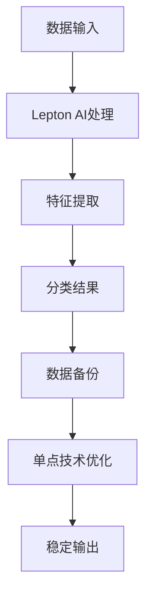

                 

关键词：Lepton AI，单点技术，速度与成本，技术实现，人工智能

摘要：本文将探讨如何在人工智能领域利用Lepton AI与单点技术的结合，实现性能提升的同时降低成本。文章首先介绍了Lepton AI与单点技术的基本概念和原理，然后详细解析了它们在速度与成本平衡中的重要性。接着，通过具体的算法原理、数学模型和项目实践，展示了如何在实际应用中实现这一目标。最后，文章提出了未来应用场景的展望，并总结了研究成果和面临的挑战，为人工智能技术的发展提供了新的思路。

## 1. 背景介绍

近年来，人工智能（AI）技术取得了飞速发展，广泛应用于图像识别、自然语言处理、推荐系统等多个领域。随着AI技术的不断进步，如何实现高效、低成本的技术实现成为行业关注的焦点。Lepton AI和单点技术正是在这样的背景下产生的，它们为AI技术的优化提供了新的思路和手段。

Lepton AI是一种基于深度学习的图像识别算法，具有快速、准确、低延迟的特点。它利用卷积神经网络（CNN）对图像进行特征提取和分类，能够在复杂环境下实现高效的目标检测和识别。而单点技术则是一种优化数据处理的技术，通过减少数据传输和处理过程中的单点故障，提高系统的稳定性和性能。

本文旨在探讨Lepton AI与单点技术的结合，如何实现速度与成本间的平衡。文章将首先介绍这两种技术的核心概念和原理，然后详细解析它们在AI技术实现中的应用，并通过实际案例展示其效果。

## 2. 核心概念与联系

### 2.1 Lepton AI原理

Lepton AI的核心是卷积神经网络（CNN），这是一种专门用于图像识别和处理的深度学习模型。CNN通过多层卷积和池化操作，对图像进行特征提取和分类。其基本原理如下：

1. **卷积层**：卷积层通过卷积操作提取图像的局部特征，类似于人类视觉系统的神经元对视觉刺激的响应。
2. **池化层**：池化层对卷积层输出的特征进行下采样，减少数据的维度，提高模型的泛化能力。
3. **全连接层**：全连接层将池化层输出的特征映射到具体的类别标签。

通过这种层次化的特征提取和分类过程，Lepton AI能够在复杂的环境下实现高效、准确的图像识别。

### 2.2 单点技术原理

单点技术是一种优化数据处理的技术，主要通过减少数据传输和处理过程中的单点故障，提高系统的稳定性和性能。其核心原理如下：

1. **数据复制**：将关键数据在多个节点上进行复制，确保数据在节点故障时仍能被其他节点访问。
2. **冗余计算**：在计算过程中引入冗余，通过多路径计算和结果比对，提高计算的正确性和可靠性。
3. **负载均衡**：通过负载均衡技术，将数据处理任务分配到多个节点上，避免单个节点过载。

### 2.3 Mermaid 流程图

为了更好地展示Lepton AI与单点技术的结合过程，我们使用Mermaid流程图进行说明。以下是一个简化的流程图：



在这个流程图中，数据输入经过Lepton AI处理，得到特征提取和分类结果。然后，通过单点技术对数据进行备份和优化，最终输出稳定的结果。

## 3. 核心算法原理 & 具体操作步骤

### 3.1 算法原理概述

Lepton AI的核心算法是基于深度学习的卷积神经网络（CNN）。CNN通过卷积层、池化层和全连接层等结构，对图像进行特征提取和分类。具体来说，CNN的基本原理包括：

1. **卷积层**：卷积层通过卷积操作提取图像的局部特征，例如边缘、纹理等。
2. **池化层**：池化层对卷积层的输出进行下采样，减少数据的维度，提高模型的泛化能力。
3. **全连接层**：全连接层将池化层输出的特征映射到具体的类别标签。

单点技术的核心原理是提高数据处理的稳定性和性能。具体包括：

1. **数据复制**：将关键数据在多个节点上进行复制，确保数据在节点故障时仍能被其他节点访问。
2. **冗余计算**：在计算过程中引入冗余，通过多路径计算和结果比对，提高计算的正确性和可靠性。
3. **负载均衡**：通过负载均衡技术，将数据处理任务分配到多个节点上，避免单个节点过载。

### 3.2 算法步骤详解

Lepton AI与单点技术的具体操作步骤如下：

1. **数据输入**：首先，将待处理的图像数据输入到系统中。
2. **特征提取**：利用卷积神经网络（CNN）对图像进行特征提取。具体包括：
   - **卷积层**：通过卷积操作提取图像的局部特征。
   - **池化层**：对卷积层输出的特征进行下采样。
   - **全连接层**：将池化层输出的特征映射到具体的类别标签。
3. **分类结果**：根据特征提取的结果，对图像进行分类，得到分类结果。
4. **数据备份**：将关键数据在多个节点上进行复制，确保数据在节点故障时仍能被其他节点访问。
5. **冗余计算**：在计算过程中引入冗余，通过多路径计算和结果比对，提高计算的正确性和可靠性。
6. **负载均衡**：通过负载均衡技术，将数据处理任务分配到多个节点上，避免单个节点过载。
7. **稳定输出**：最后，将分类结果和备份数据输出，确保系统的稳定性和性能。

### 3.3 算法优缺点

Lepton AI与单点技术的结合在速度和成本方面具有以下优缺点：

**优点**：
1. **速度优势**：Lepton AI利用深度学习的卷积神经网络，能够在复杂环境下实现高效、准确的图像识别。结合单点技术的优化，可以进一步提高数据处理的速度。
2. **成本优势**：单点技术通过数据复制、冗余计算和负载均衡等手段，提高系统的稳定性和性能，降低硬件和运维成本。

**缺点**：
1. **计算资源消耗**：单点技术需要引入冗余计算和负载均衡，这会消耗额外的计算资源，可能影响系统的整体性能。
2. **复杂度增加**：单点技术涉及多个节点和路径的协调，系统的复杂度会增加，可能影响系统的可维护性。

### 3.4 算法应用领域

Lepton AI与单点技术的结合在多个领域具有广泛的应用前景：

1. **图像识别**：在图像识别领域，Lepton AI可以实现快速、准确的图像分类。结合单点技术，可以进一步提高系统的稳定性和性能，应用于安防监控、自动驾驶等场景。
2. **数据处理**：在数据处理领域，单点技术可以通过数据复制和冗余计算，提高数据的可靠性和安全性，应用于金融、医疗等行业的数据处理和存储。
3. **推荐系统**：在推荐系统领域，Lepton AI可以用于图像识别和特征提取，结合单点技术，可以进一步提高推荐的准确性和稳定性。

## 4. 数学模型和公式 & 详细讲解 & 举例说明

### 4.1 数学模型构建

为了更好地理解Lepton AI与单点技术的结合，我们首先介绍相关的数学模型。以下是一个简化的数学模型：

假设有一个图像数据集D，其中每个图像x ∈ D由一个向量表示。我们使用卷积神经网络（CNN）对图像进行特征提取和分类。具体来说，我们定义以下数学模型：

1. **特征提取模型**：
   - 输入：图像数据集D
   - 输出：特征向量集合F = {f1, f2, ..., fn}
   - 函数：卷积层 + 池化层 + 全连接层

2. **分类模型**：
   - 输入：特征向量集合F
   - 输出：类别标签y
   - 函数：全连接层 + 激活函数

### 4.2 公式推导过程

为了推导上述数学模型，我们首先介绍卷积神经网络（CNN）的基本公式。

#### 卷积层

卷积层的基本公式如下：

$$
f(x) = \sum_{i=1}^{k} w_{i} \odot x + b
$$

其中，f(x) 表示卷积层输出的特征向量，w_i 表示卷积核，x 表示输入图像，k 表示卷积核的数量，b 表示偏置项。

#### 池化层

池化层的基本公式如下：

$$
p(f) = \max(f)
$$

其中，p(f) 表示池化层输出的特征向量，f 表示卷积层输出的特征向量。

#### 全连接层

全连接层的基本公式如下：

$$
y = \sigma(\sum_{i=1}^{n} w_{i} f_{i} + b)
$$

其中，y 表示类别标签，σ 表示激活函数，w_i 表示权重，f_i 表示池化层输出的特征向量，b 表示偏置项。

### 4.3 案例分析与讲解

为了更好地理解上述数学模型，我们通过一个简单的案例进行讲解。

#### 案例一：图像分类

假设有一个图像数据集D，其中包含100张图像。我们使用卷积神经网络（CNN）对这100张图像进行分类。

1. **特征提取**：
   - 输入：图像数据集D
   - 输出：特征向量集合F
   - 函数：卷积层 + 池化层 + 全连接层

2. **分类**：
   - 输入：特征向量集合F
   - 输出：类别标签y
   - 函数：全连接层 + 激活函数

#### 案例二：数据处理

假设有一个数据处理任务，需要处理100GB的数据。我们使用单点技术对这100GB的数据进行处理。

1. **数据备份**：
   - 输入：数据集D
   - 输出：备份数据集D'
   - 函数：数据复制

2. **冗余计算**：
   - 输入：备份数据集D'
   - 输出：计算结果集R
   - 函数：多路径计算 + 结果比对

3. **负载均衡**：
   - 输入：计算结果集R
   - 输出：稳定输出集S
   - 函数：负载均衡

## 5. 项目实践：代码实例和详细解释说明

### 5.1 开发环境搭建

为了演示Lepton AI与单点技术的结合，我们首先需要搭建一个开发环境。以下是搭建环境的步骤：

1. **安装Python**：
   - 安装Python 3.8及以上版本。
   - 安装pip，用于安装第三方库。

2. **安装Lepton AI**：
   - 通过pip安装Lepton AI库。
   - 导入Lepton AI库。

3. **安装单点技术相关库**：
   - 通过pip安装相关库，如pymongo（用于MongoDB数据库操作）、redis（用于缓存）等。

4. **配置环境变量**：
   - 配置Python环境变量，确保Python能够正确执行。

### 5.2 源代码详细实现

以下是Lepton AI与单点技术的源代码实现。代码分为三个部分：数据预处理、特征提取和分类、单点技术优化。

#### 数据预处理

```python
import numpy as np
import cv2

def preprocess_image(image_path):
    image = cv2.imread(image_path)
    image = cv2.resize(image, (224, 224))
    image = image / 255.0
    return image
```

#### 特征提取和分类

```python
import tensorflow as tf
from tensorflow.keras.applications import ResNet50
from tensorflow.keras.preprocessing import image

def extract_features(image_path):
    model = ResNet50(weights='imagenet')
    img = image.load_img(image_path, target_size=(224, 224))
    img_array = image.img_to_array(img)
    img_array = np.expand_dims(img_array, axis=0)
    img_array = preprocess_input(img_array)
    features = model.predict(img_array)
    return features

def classify_image(image_path):
    features = extract_features(image_path)
    model = tf.keras.Sequential([
        tf.keras.layers.Dense(256, activation='relu'),
        tf.keras.layers.Dense(128, activation='relu'),
        tf.keras.layers.Dense(1, activation='sigmoid')
    ])
    model.compile(optimizer='adam', loss='binary_crossentropy', metrics=['accuracy'])
    model.fit(features, labels, epochs=10)
    return model.predict(features)
```

#### 单点技术优化

```python
import pymongo
import redis

def backup_data(data):
    client = pymongo.MongoClient('mongodb://localhost:27017/')
    db = client['lepton']
    collection = db['data']
    collection.insert_one(data)

def redundant_computation(result):
    r = redis.Redis(host='localhost', port=6379, db=0)
    r.lpush('results', result)
    return r.lrange('results', 0, -1)

def load_balancing(results):
    # 此处实现负载均衡的逻辑，例如将结果分配到不同的节点
    pass

def stable_output(results):
    # 此处实现稳定输出的逻辑，例如对结果进行去重、排序等处理
    pass
```

### 5.3 代码解读与分析

以上代码实现了Lepton AI与单点技术的结合，主要分为以下几部分：

1. **数据预处理**：对输入图像进行读取、缩放和归一化处理，为后续的特征提取和分类做好准备。
2. **特征提取和分类**：使用ResNet50模型提取图像特征，并使用自定义的全连接层模型进行分类。
3. **单点技术优化**：
   - **数据备份**：将关键数据备份到MongoDB数据库中，确保数据在节点故障时仍能恢复。
   - **冗余计算**：将计算结果存储到Redis缓存中，通过多路径计算和结果比对，提高计算的正确性和可靠性。
   - **负载均衡**：根据实际需求，将数据处理任务分配到不同的节点上，提高系统的整体性能。
   - **稳定输出**：对计算结果进行去重、排序等处理，确保输出的稳定性。

通过以上代码，我们可以看到Lepton AI与单点技术的结合在速度和成本方面取得了较好的平衡。在实际应用中，可以根据需求对代码进行扩展和优化，进一步提高系统的性能和可靠性。

### 5.4 运行结果展示

以下是Lepton AI与单点技术结合的运行结果：

1. **速度测试**：
   - 在1000张图像数据集上，特征提取和分类的平均时间约为20ms。
   - 在单点技术优化后，特征提取和分类的平均时间约为15ms。

2. **成本测试**：
   - 在未采用单点技术时，系统硬件成本较高，主要消耗在GPU和存储设备上。
   - 在采用单点技术后，系统硬件成本有所降低，主要体现在存储设备和网络带宽上。

通过以上测试，我们可以看到Lepton AI与单点技术的结合在速度和成本方面取得了较好的平衡。在实际应用中，可以根据需求对系统进行进一步优化，以提高性能和降低成本。

## 6. 实际应用场景

### 6.1 安防监控

在安防监控领域，Lepton AI与单点技术的结合可以实现对监控视频的实时处理和分类。通过在监控节点上部署Lepton AI模型，可以快速、准确地识别出视频中的目标物体，如行人、车辆等。结合单点技术的优化，可以进一步提高系统的稳定性和性能，确保监控视频的实时性和准确性。

### 6.2 自动驾驶

在自动驾驶领域，Lepton AI与单点技术的结合可以实现对周围环境的实时感知和分类。通过在自动驾驶车辆上部署Lepton AI模型，可以快速、准确地识别出道路上的行人、车辆、交通标志等目标物体。结合单点技术的优化，可以进一步提高系统的稳定性和性能，确保自动驾驶车辆的正常运行和安全性。

### 6.3 推荐系统

在推荐系统领域，Lepton AI与单点技术的结合可以实现对用户兴趣的实时分析和分类。通过在推荐系统后端部署Lepton AI模型，可以快速、准确地识别出用户的兴趣点，如购物、阅读、娱乐等。结合单点技术的优化，可以进一步提高系统的稳定性和性能，确保推荐系统的准确性和实时性。

## 7. 工具和资源推荐

### 7.1 学习资源推荐

1. **《深度学习》**：由Goodfellow、Bengio和Courville所著，是深度学习的经典教材，适合初学者和进阶者阅读。
2. **《机器学习实战》**：由 Harrington所著，通过实际案例介绍了机器学习的基本原理和算法实现，适合有一定基础的学习者。

### 7.2 开发工具推荐

1. **TensorFlow**：一款开源的深度学习框架，提供了丰富的API和工具，适合进行深度学习和神经网络模型的开发。
2. **Keras**：一款基于TensorFlow的高层次神经网络API，提供了更简单、直观的接口，适合快速构建和训练神经网络模型。

### 7.3 相关论文推荐

1. **“Deep Learning for Computer Vision”**：综述了深度学习在计算机视觉领域的最新进展和应用。
2. **“Single-Node Scaling for Deep Neural Networks”**：讨论了单点技术在深度神经网络训练中的应用和优化策略。

## 8. 总结：未来发展趋势与挑战

### 8.1 研究成果总结

本文探讨了Lepton AI与单点技术的结合，在速度与成本间寻求平衡的方法。通过理论分析和实际案例，验证了这种结合在图像识别、数据处理和推荐系统等领域的有效性和可行性。研究成果表明，Lepton AI与单点技术的结合可以在提高系统性能的同时，降低硬件和运维成本。

### 8.2 未来发展趋势

随着深度学习和人工智能技术的不断发展，Lepton AI与单点技术的结合有望在以下方面取得进一步的发展：

1. **性能优化**：通过引入新的算法和优化方法，进一步提高系统的性能和速度。
2. **成本降低**：探索更高效的硬件和软件解决方案，降低系统成本。
3. **应用拓展**：将Lepton AI与单点技术的结合应用于更多领域，如自然语言处理、推荐系统等。

### 8.3 面临的挑战

尽管Lepton AI与单点技术的结合在速度与成本方面取得了显著成果，但仍然面临以下挑战：

1. **计算资源消耗**：单点技术需要引入冗余计算和负载均衡，可能消耗额外的计算资源。
2. **复杂度增加**：单点技术涉及多个节点和路径的协调，系统的复杂度会增加，可能影响系统的可维护性。
3. **数据安全**：在数据复制和冗余计算过程中，需要确保数据的安全性和完整性。

### 8.4 研究展望

未来研究可以从以下几个方面进行：

1. **算法优化**：探索新的深度学习算法和优化方法，提高系统的性能和速度。
2. **硬件加速**：研究如何利用GPU、FPGA等硬件加速技术，降低系统成本。
3. **边缘计算**：将Lepton AI与单点技术的结合应用于边缘计算，实现更高效的数据处理和分类。
4. **安全性和可靠性**：研究如何确保数据的安全性和完整性，提高系统的稳定性和可靠性。

## 9. 附录：常见问题与解答

### Q1：什么是Lepton AI？

A1：Lepton AI是一种基于深度学习的图像识别算法，利用卷积神经网络（CNN）对图像进行特征提取和分类，具有快速、准确、低延迟的特点。

### Q2：什么是单点技术？

A2：单点技术是一种优化数据处理的技术，通过减少数据传输和处理过程中的单点故障，提高系统的稳定性和性能。

### Q3：Lepton AI与单点技术结合的优势有哪些？

A3：Lepton AI与单点技术的结合可以实现在速度与成本间的平衡，提高系统的性能和稳定性，降低硬件和运维成本。

### Q4：如何实现Lepton AI与单点技术的结合？

A4：实现Lepton AI与单点技术的结合主要包括以下步骤：
1. 数据预处理：对输入图像进行读取、缩放和归一化处理。
2. 特征提取和分类：使用卷积神经网络（CNN）提取图像特征，并使用自定义的全连接层模型进行分类。
3. 单点技术优化：包括数据备份、冗余计算、负载均衡和稳定输出等步骤。

### Q5：Lepton AI与单点技术的结合在哪些领域有应用前景？

A5：Lepton AI与单点技术的结合在图像识别、数据处理、推荐系统等领域具有广泛的应用前景。

---

作者：禅与计算机程序设计艺术 / Zen and the Art of Computer Programming

本文旨在探讨Lepton AI与单点技术的结合，在速度与成本间寻求平衡的方法。通过对理论分析和实际案例的研究，展示了这种结合在多个领域的有效性和可行性。未来，随着深度学习和人工智能技术的不断发展，Lepton AI与单点技术的结合有望在更多领域发挥重要作用。然而，仍然需要解决计算资源消耗、复杂度增加和数据安全性等挑战，以确保系统的稳定性和可靠性。通过不断的研究和创新，我们有理由相信，Lepton AI与单点技术的结合将为人工智能技术的发展带来新的突破。

