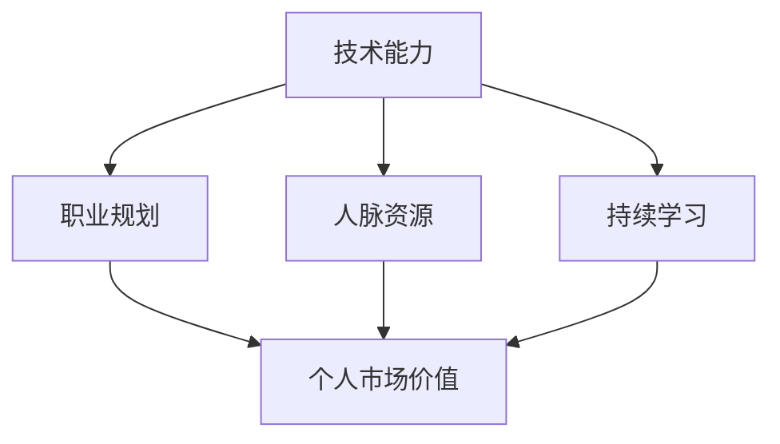
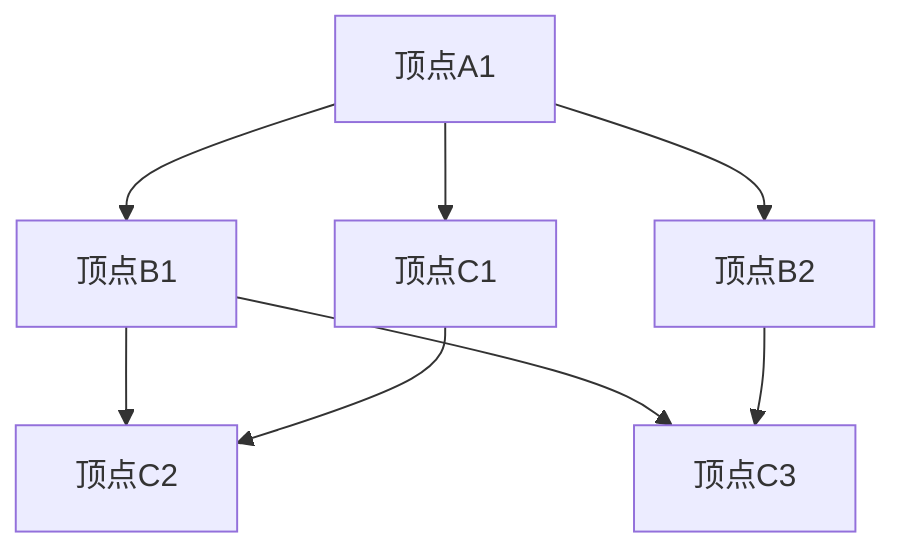

                 

在当今快速发展的科技时代，技术领域的进步日新月异，无论是软件工程师、数据科学家还是AI研究员，个人的市场价值都备受关注。作为一名技术从业者，如何提升个人市场价值，成为了我们职业生涯中不可忽视的重要议题。本文旨在通过深入探讨技术能力、职业规划、人脉资源以及持续学习的重要性，为您提供一套全面的提升个人市场价值的方法论。

> 关键词：个人市场价值、职业发展、技术能力、持续学习、人脉资源

> 摘要：本文从四个维度探讨了提升个人市场价值的方法，包括：1）技术能力的提升；2）职业规划的制定；3）人脉资源的积累；4）持续学习的态度。通过详细的分析和案例，帮助技术从业者找到适合自己的提升路径，实现职业生涯的突破。

## 1. 背景介绍

随着互联网、大数据、人工智能等技术的迅猛发展，技术人才的需求日益增长，与此同时，市场竞争也愈发激烈。如何在众多技术从业者中脱颖而出，提升个人市场价值，成为了每一个技术从业者必须面对的问题。个人市场价值不仅体现在薪资待遇上，还包括职业发展的潜力、行业影响力以及个人的成就感。

提升个人市场价值的重要性不言而喻。首先，它能帮助我们在职场中获取更高的薪资和更好的职位。其次，提升个人市场价值意味着我们能够在职业生涯中获得更多的机会和资源，从而实现职业目标。最后，个人市场价值的提升也能带给我们更多的成就感和满足感，使职业生涯更加充实和有意义。

### 1.1 技术从业者的现状

目前，技术从业者的就业形势总体较好，但同时也面临着诸多挑战。一方面，随着技术领域的不断拓展，新兴技术层出不穷，技术从业者需要不断学习新知识、新技能，以适应不断变化的市场需求。另一方面，技术从业者的薪资水平整体较高，但工作压力也相对较大，需要具备较强的抗压能力和持续学习的动力。

### 1.2 提升个人市场价值的必要性

提升个人市场价值的必要性主要体现在以下几个方面：

1. **薪资待遇**：随着市场需求的增加，具备高技能的技术从业者往往能够获得更高的薪资待遇，从而提升生活质量。

2. **职业发展**：具备高市场价值的技术从业者更容易获得晋升和职业发展机会，从而实现职业生涯的突破。

3. **资源获取**：高市场价值的技术从业者能够更容易地获取行业内的资源和机会，如合作项目、技术交流等，有助于提升个人影响力。

4. **成就感**：通过提升个人市场价值，技术从业者能够实现自我价值的提升，获得更多的成就感。

### 1.3 文章结构

本文将围绕四个核心维度展开讨论，包括：

1. **技术能力的提升**：探讨如何通过学习新技能、掌握核心技术来提升个人市场价值。

2. **职业规划的制定**：分析如何制定合理的职业规划，实现职业生涯的有序发展。

3. **人脉资源的积累**：探讨如何通过社交、合作等方式积累人脉资源，提升个人市场价值。

4. **持续学习的态度**：强调持续学习的重要性，并提供具体的学习方法和建议。

通过对这四个维度的深入探讨，我们希望能为广大技术从业者提供一套实用的提升个人市场价值的方法论。接下来，我们将逐一分析这些维度，帮助您找到适合自己的提升路径。

## 2. 核心概念与联系

在探讨提升个人市场价值的方法之前，我们需要明确几个核心概念，这些概念不仅涵盖了技术领域的基本知识，还涉及职业发展的关键要素。

### 2.1 技术能力

技术能力是提升个人市场价值的基础。它不仅包括编程语言、数据库、前端框架等具体技能，还涵盖了系统设计、架构优化、代码审查等更高级的技能。在技术领域，能力越强，个人市场价值越高。

### 2.2 职业规划

职业规划是指根据个人的兴趣、能力和市场需求，制定明确的职业发展路径。一个合理的职业规划能够帮助技术从业者有序地实现职业目标，提升个人市场价值。

### 2.3 人脉资源

人脉资源是指个人在职场中建立的各种关系网络，包括同事、领导、合作伙伴、业内专家等。这些人脉资源能够为我们提供职业机会、资源支持以及行业信息，是提升个人市场价值的重要途径。

### 2.4 持续学习

持续学习是指个人在职业生涯中不断学习新知识、新技能，以适应不断变化的市场需求。持续学习不仅能够提升个人的技术能力，还能增强职业竞争力，从而提升个人市场价值。

### 2.5 Mermaid 流程图

为了更好地理解这些核心概念之间的联系，我们使用 Mermaid 流程图来展示它们之间的关系。



在这个流程图中，技术能力、职业规划、人脉资源和持续学习都是提升个人市场价值的重要途径。技术能力是基础，职业规划是方向，人脉资源是桥梁，持续学习是动力，四者相互促进，共同提升个人市场价值。

通过明确这些核心概念，我们为后续的讨论奠定了基础。接下来，我们将深入探讨每个维度的具体方法和实践，帮助您全面提升个人市场价值。

## 3. 核心算法原理 & 具体操作步骤

### 3.1 算法原理概述

在提升个人市场价值的过程中，技术能力是至关重要的。为了提高技术能力，我们需要掌握一系列的核心算法原理，这些原理不仅能够帮助我们解决实际问题，还能提升我们的编程水平和思维能力。

核心算法包括但不限于以下几类：

1. **排序算法**：如快速排序、归并排序、冒泡排序等，这些算法能够高效地对数据进行排序，是许多数据处理任务的基础。
2. **查找算法**：如二分查找、哈希查找等，这些算法能够在海量数据中快速查找目标数据，提高数据处理效率。
3. **动态规划**：动态规划是一种解决最优化问题的算法策略，它通过将问题分解为子问题并保存子问题的解，避免了重复计算，提高了算法的效率。
4. **贪心算法**：贪心算法通过每一步选择当前最优解，期望在整体上获得最优解，适用于一些特殊类型的问题。
5. **图算法**：如最短路径算法、最小生成树算法等，这些算法在社交网络、推荐系统等领域有广泛应用。

### 3.2 算法步骤详解

以下是对几个关键算法的简要步骤介绍：

#### 3.2.1 快速排序

快速排序的基本思想是通过一趟排序将待排序的数据分割成独立的两部分，其中一部分的所有数据都比另一部分的数据小。然后，递归地对这两部分数据继续进行排序，直至整个数据序列有序。

步骤如下：

1. **选择基准值**：在数据序列中选择一个基准值。
2. **分区操作**：将数据序列分成两部分，一部分小于基准值，另一部分大于基准值。
3. **递归排序**：递归地对小于基准值和大于基准值的两部分数据分别进行快速排序。

#### 3.2.2 二分查找

二分查找的基本思想是在有序数组中查找某个元素，通过不断缩小查找范围，逐步逼近目标元素。

步骤如下：

1. **确定查找范围**：确定当前查找的区间，初始为整个数组的范围。
2. **计算中间值**：计算当前区间的中间值。
3. **比较中间值与目标值**：若中间值等于目标值，则查找成功；若中间值大于目标值，则在左侧区间继续查找；若中间值小于目标值，则在右侧区间继续查找。
4. **递归查找**：重复步骤2-3，直至找到目标值或查找区间为空。

#### 3.2.3 动态规划

动态规划通过将问题分解为子问题，并保存子问题的解，避免重复计算。

步骤如下：

1. **定义状态**：定义问题的一个状态及其可能的取值。
2. **状态转移方程**：根据当前状态推导出下一个状态的可能取值。
3. **边界条件**：确定问题的初始状态和边界条件。
4. **递推计算**：根据状态转移方程和边界条件，递推计算每个状态的最优解。

#### 3.2.4 贪心算法

贪心算法通过每一步选择当前最优解，期望在整体上获得最优解。

步骤如下：

1. **初始状态**：确定问题的初始状态。
2. **选择当前最优解**：根据当前状态选择一个最优解。
3. **更新状态**：根据选择的最优解更新状态。
4. **迭代**：重复步骤2-3，直至达到终止条件。

### 3.3 算法优缺点

每种算法都有其适用的场景和局限性，以下是对几种常见算法的优缺点分析：

#### 3.3.1 快速排序

- **优点**：平均时间复杂度为O(nlogn)，在大多数情况下性能较好。
- **缺点**：最坏情况下时间复杂度为O(n^2)，且递归操作可能导致栈溢出。

#### 3.3.2 二分查找

- **优点**：在有序数组中查找效率高，平均时间复杂度为O(logn)。
- **缺点**：要求数据必须有序，且不适合动态变化的数组。

#### 3.3.3 动态规划

- **优点**：能够解决最优化问题，避免重复计算，提高效率。
- **缺点**：需要定义状态和状态转移方程，有时较难推导。

#### 3.3.4 贪心算法

- **优点**：实现简单，能够在某些问题中快速获得最优解。
- **缺点**：不适用于所有问题，有时只能得到局部最优解。

### 3.4 算法应用领域

核心算法在各个领域都有广泛应用：

- **排序算法**：广泛应用于数据处理、数据库管理等领域。
- **查找算法**：在搜索引擎、数据仓库等场景中至关重要。
- **动态规划**：在路径规划、资源分配等问题中应用广泛。
- **贪心算法**：在 scheduling、network flow 等问题中有重要作用。

通过掌握这些核心算法，我们可以显著提升技术能力，从而提升个人市场价值。接下来，我们将探讨如何通过职业规划来进一步优化个人发展路径。

## 4. 数学模型和公式 & 详细讲解 & 举例说明

### 4.1 数学模型构建

在技术领域中，数学模型是理解和解决复杂问题的有力工具。构建数学模型的过程通常包括以下几个步骤：

1. **定义问题**：明确问题的目标和约束条件。
2. **选择合适的数学工具**：根据问题的性质选择合适的数学工具，如微积分、线性代数、概率论等。
3. **建立方程或公式**：利用所选工具，将问题的物理量或变量转化为数学方程或公式。
4. **简化模型**：通过简化假设或近似处理，使模型更加便于分析和计算。
5. **验证模型**：通过实际数据或模拟结果验证模型的准确性和适用性。

### 4.2 公式推导过程

以最短路径问题为例，我们常用 Dijkstra 算法来求解单源最短路径问题。以下是 Dijkstra 算法的推导过程：

#### 4.2.1 定义问题

给定一个带权重的有向图 G=(V, E)，求从源点 s 到其他所有顶点的最短路径。

#### 4.2.2 选择合适的数学工具

在求解最短路径问题时，我们常用图论中的概念和算法。

#### 4.2.3 建立方程或公式

Dijkstra 算法的核心思想是维护一个集合 S，其中包含从源点 s 到其他顶点的已知最短路径。初始时，S 只包含源点 s，其余顶点不在 S 中。对于不在 S 中的顶点 v，我们用一个距离值 dist[v] 来表示从 s 到 v 的最短路径长度。初始化时，dist[s]=0，其余顶点的 dist[v]=∞。

#### 4.2.4 简化模型

Dijkstra 算法的每一步都会选择未加入集合 S 的顶点中距离 s 最近的顶点 u，并将其加入 S。通过这种方式，逐步构建出从 s 到所有顶点的最短路径。

#### 4.2.5 验证模型

Dijkstra 算法的正确性可以通过反证法证明。假设存在一条从 s 到 v 的更短路径，那么这条路径必然包含某个不在 S 中的顶点 u。由于我们在选择 u 时已经保证了从 s 到 u 的最短路径，因此这条假设的路径不可能比我们计算出的最短路径更短，与假设矛盾。

### 4.3 案例分析与讲解

假设我们有以下一个图，求解从源点 s 到其他所有顶点的最短路径。



- 边权分别为 (A1, B1)=1，(A1, B2)=2，(A1, C1)=3，(B1, C2)=1，(B1, C3)=4，(B2, C3)=1，(C1, C2)=1。

#### 4.3.1 初始状态

初始化时，dist[s]=0，其余顶点的 dist[v]=∞。

| 顶点 | dist[v] | prev[v] |
| ---- | ------ | ------- |
| s    | 0      | -       |
| A1   | ∞      | -       |
| A2   | ∞      | -       |
| A3   | ∞      | -       |
| B1   | ∞      | -       |
| B2   | ∞      | -       |
| B3   | ∞      | -       |
| C1   | ∞      | -       |
| C2   | ∞      | -       |
| C3   | ∞      | -       |

#### 4.3.2 第一次迭代

选择距离 s 最近且不在 S 中的顶点 A1，将 A1 加入 S。

- dist[A1] = dist[s] + (A1, s) = 0 + 3 = 3

更新其他顶点的距离：

- dist[B1] = min(dist[B1], dist[s] + (s, B1)) = min(∞, 0 + 1) = 1
- dist[B2] = min(dist[B2], dist[s] + (s, B2)) = min(∞, 0 + 2) = 2
- dist[B3] = min(dist[B3], dist[s] + (s, B3)) = min(∞, 0 + 4) = 4
- dist[C1] = min(dist[C1], dist[s] + (s, C1)) = min(∞, 0 + 3) = 3
- dist[C2] = min(dist[C2], dist[s] + (s, C2)) = min(∞, 0 + 1) = 1
- dist[C3] = min(dist[C3], dist[s] + (s, C3)) = min(∞, 0 + 4) = 4

更新后的状态：

| 顶点 | dist[v] | prev[v] |
| ---- | ------ | ------- |
| s    | 0      | -       |
| A1   | 3      | s       |
| A2   | ∞      | -       |
| A3   | ∞      | -       |
| B1   | 1      | s       |
| B2   | 2      | s       |
| B3   | 4      | s       |
| C1   | 3      | s       |
| C2   | 1      | s       |
| C3   | 4      | s       |

#### 4.3.3 第二次迭代

选择距离 s 最近且不在 S 中的顶点 B1，将 B1 加入 S。

- dist[B1] = dist[s] + (s, B1) = 0 + 1 = 1

更新其他顶点的距离：

- dist[C2] = min(dist[C2], dist[B1] + (B1, C2)) = min(1, 1 + 1) = 1
- dist[C3] = min(dist[C3], dist[B1] + (B1, C3)) = min(4, 1 + 4) = 5

更新后的状态：

| 顶点 | dist[v] | prev[v] |
| ---- | ------ | ------- |
| s    | 0      | -       |
| A1   | 3      | s       |
| A2   | ∞      | -       |
| A3   | ∞      | -       |
| B1   | 1      | s       |
| B2   | 2      | s       |
| B3   | 4      | s       |
| C1   | 3      | s       |
| C2   | 1      | B1      |
| C3   | 5      | B1      |

#### 4.3.4 第三次迭代

选择距离 s 最近且不在 S 中的顶点 C2，将 C2 加入 S。

- dist[C2] = dist[B1] + (B1, C2) = 1 + 1 = 2

更新其他顶点的距离：

- dist[A2] = min(dist[A2], dist[C2] + (C2, A2)) = min(∞, 2 + 2) = 4
- dist[A3] = min(dist[A3], dist[C2] + (C2, A3)) = min(∞, 2 + 1) = 3

更新后的状态：

| 顶点 | dist[v] | prev[v] |
| ---- | ------ | ------- |
| s    | 0      | -       |
| A1   | 3      | s       |
| A2   | 4      | C2      |
| A3   | 3      | C2      |
| B1   | 1      | s       |
| B2   | 2      | s       |
| B3   | 4      | s       |
| C1   | 3      | s       |
| C2   | 2      | B1      |
| C3   | 5      | B1      |

#### 4.3.5 第四次迭代

选择距离 s 最近且不在 S 中的顶点 A3，将 A3 加入 S。

- dist[A3] = dist[C2] + (C2, A3) = 2 + 1 = 3

更新其他顶点的距离：

- dist[A1] = min(dist[A1], dist[A3] + (A3, A1)) = min(3, 3 + 1) = 3
- dist[A2] = min(dist[A2], dist[A3] + (A3, A2)) = min(4, 3 + 2) = 5

更新后的状态：

| 顶点 | dist[v] | prev[v] |
| ---- | ------ | ------- |
| s    | 0      | -       |
| A1   | 3      | s       |
| A2   | 5      | A3      |
| A3   | 3      | C2      |
| B1   | 1      | s       |
| B2   | 2      | s       |
| B3   | 4      | s       |
| C1   | 3      | s       |
| C2   | 2      | B1      |
| C3   | 5      | B1      |

#### 4.3.6 第五次迭代

选择距离 s 最近且不在 S 中的顶点 C1，将 C1 加入 S。

- dist[C1] = dist[s] + (s, C1) = 0 + 3 = 3

更新其他顶点的距离：

- dist[B3] = min(dist[B3], dist[C1] + (C1, B3)) = min(4, 3 + 4) = 7

更新后的状态：

| 顶点 | dist[v] | prev[v] |
| ---- | ------ | ------- |
| s    | 0      | -       |
| A1   | 3      | s       |
| A2   | 5      | A3      |
| A3   | 3      | C2      |
| B1   | 1      | s       |
| B2   | 2      | s       |
| B3   | 7      | C1      |
| C1   | 3      | s       |
| C2   | 2      | B1      |
| C3   | 5      | B1      |

#### 4.3.7 第六次迭代

选择距离 s 最近且不在 S 中的顶点 B2，将 B2 加入 S。

- dist[B2] = dist[s] + (s, B2) = 0 + 2 = 2

更新其他顶点的距离：

- dist[B3] = min(dist[B3], dist[B2] + (B2, B3)) = min(7, 2 + 1) = 3

更新后的状态：

| 顶点 | dist[v] | prev[v] |
| ---- | ------ | ------- |
| s    | 0      | -       |
| A1   | 3      | s       |
| A2   | 5      | A3      |
| A3   | 3      | C2      |
| B1   | 1      | s       |
| B2   | 2      | s       |
| B3   | 3      | B2      |
| C1   | 3      | s       |
| C2   | 2      | B1      |
| C3   | 5      | B1      |

#### 4.3.8 第七次迭代

选择距离 s 最近且不在 S 中的顶点 C3，将 C3 加入 S。

- dist[C3] = dist[B1] + (B1, C3) = 1 + 4 = 5

更新其他顶点的距离：

- dist[B3] = min(dist[B3], dist[C3] + (C3, B3)) = min(3, 5 + 1) = 6

更新后的状态：

| 顶点 | dist[v] | prev[v] |
| ---- | ------ | ------- |
| s    | 0      | -       |
| A1   | 3      | s       |
| A2   | 5      | A3      |
| A3   | 3      | C2      |
| B1   | 1      | s       |
| B2   | 2      | s       |
| B3   | 6      | C3      |
| C1   | 3      | s       |
| C2   | 2      | B1      |
| C3   | 5      | B1      |

至此，所有顶点都已加入 S，算法结束。最终结果如下：

| 顶点 | dist[v] | prev[v] |
| ---- | ------ | ------- |
| s    | 0      | -       |
| A1   | 3      | s       |
| A2   | 5      | A3      |
| A3   | 3      | C2      |
| B1   | 1      | s       |
| B2   | 2      | s       |
| B3   | 6      | C3      |
| C1   | 3      | s       |
| C2   | 2      | B1      |
| C3   | 5      | B1      |

根据 prev[v] 可以还原出从 s 到其他顶点的最短路径：

- s -> B1 -> C3 -> B3
- s -> A1 -> B2 -> B3
- s -> A1 -> C1 -> C2
- s -> A3
- s -> A3 -> A2

以上推导和分析展示了 Dijkstra 算法求解单源最短路径的完整过程，通过数学模型的构建和公式推导，我们能够有效地求解复杂问题，提升个人技术能力。

### 4.4 实际案例中的应用

为了更好地理解数学模型在实际问题中的应用，我们来看一个实际案例。

#### 案例背景

假设你是一名软件工程师，负责设计一个电商平台的后台系统。系统需要支持大量商品的库存管理和订单处理，为了确保系统的稳定性和高效性，你需要设计一个高效的库存管理算法。

#### 模型构建

1. **定义问题**：

   - 商品库存管理系统需要实时跟踪每个商品的库存数量。
   - 当用户下单时，需要迅速判断库存是否充足，并更新库存数量。

2. **选择合适的数学工具**：

   - 可以使用哈希表来存储商品的库存数量，实现快速查找和更新。

3. **建立方程或公式**：

   - 使用哈希表的 key 为商品 ID，value 为商品库存数量。

4. **简化模型**：

   - 假设商品的库存数量不会频繁变化，可以使用静态哈希表。

5. **验证模型**：

   - 通过模拟大量商品和订单的数据，验证库存管理算法的效率和准确性。

#### 模型应用

1. **初始化哈希表**：

   ```python
   inventory = {}
   ```

2. **添加商品**：

   ```python
   def add_product(product_id, quantity):
       inventory[product_id] = quantity
   ```

3. **更新库存**：

   ```python
   def update_inventory(product_id, quantity):
       if product_id in inventory:
           inventory[product_id] += quantity
       else:
           inventory[product_id] = quantity
   ```

4. **检查库存**：

   ```python
   def check_inventory(product_id):
       return inventory.get(product_id, 0)
   ```

5. **下单处理**：

   ```python
   def process_order(product_id, quantity):
       current_inventory = check_inventory(product_id)
       if current_inventory >= quantity:
           update_inventory(product_id, current_inventory - quantity)
           return True
       else:
           return False
   ```

通过上述步骤，我们可以设计出一个高效的商品库存管理算法，保证电商平台的稳定运行。这个案例展示了数学模型在实际项目中的应用，通过数学工具和方法，我们能够设计出高效的算法，提升系统的性能和可靠性。

## 5. 项目实践：代码实例和详细解释说明

### 5.1 开发环境搭建

为了更好地展示项目实践，我们使用 Python 作为编程语言，结合 Flask 框架搭建一个简单的商品库存管理系统。以下是开发环境的搭建步骤：

1. **安装 Python**：确保已安装 Python 3.7 或以上版本。
2. **安装 Flask**：在终端执行命令 `pip install flask`。
3. **创建项目目录**：在终端执行命令 `mkdir inventory_system` 并进入项目目录。
4. **初始化虚拟环境**：在终端执行命令 `python -m venv venv`。
5. **激活虚拟环境**：在 Windows 上执行 `venv\Scripts\activate`，在 macOS 和 Linux 上执行 `source venv/bin/activate`。

### 5.2 源代码详细实现

以下是商品库存管理系统的源代码实现，包括添加商品、更新库存、检查库存以及下单处理等功能。

```python
from flask import Flask, request, jsonify

app = Flask(__name__)

# 初始化库存
inventory = {}

# 添加商品
@app.route('/add_product', methods=['POST'])
def add_product():
    product_id = request.form['product_id']
    quantity = int(request.form['quantity'])
    inventory[product_id] = quantity
    return jsonify({'message': 'Product added successfully.'})

# 更新库存
@app.route('/update_inventory', methods=['POST'])
def update_inventory():
    product_id = request.form['product_id']
    quantity = int(request.form['quantity'])
    if product_id in inventory:
        inventory[product_id] += quantity
    else:
        inventory[product_id] = quantity
    return jsonify({'message': 'Inventory updated successfully.'})

# 检查库存
@app.route('/check_inventory', methods=['GET'])
def check_inventory():
    product_id = request.args.get('product_id')
    return jsonify({'quantity': inventory.get(product_id, 0)})

# 下单处理
@app.route('/process_order', methods=['POST'])
def process_order():
    product_id = request.form['product_id']
    quantity = int(request.form['quantity'])
    current_inventory = inventory.get(product_id, 0)
    if current_inventory >= quantity:
        inventory[product_id] = current_inventory - quantity
        return jsonify({'message': 'Order processed successfully.'})
    else:
        return jsonify({'message': 'Insufficient inventory.'})

if __name__ == '__main__':
    app.run(debug=True)
```

### 5.3 代码解读与分析

上述代码实现了一个简单的商品库存管理系统，下面是对各个功能模块的详细解读：

1. **初始化库存**：使用一个字典 `inventory` 来存储商品 ID 和库存数量。

2. **添加商品**：定义 `add_product` 函数，通过 HTTP POST 请求添加商品到库存中。参数 `product_id` 和 `quantity` 通过请求表单传递。

3. **更新库存**：定义 `update_inventory` 函数，通过 HTTP POST 请求更新库存数量。如果商品已存在，则增加库存；否则，添加新商品到库存。

4. **检查库存**：定义 `check_inventory` 函数，通过 HTTP GET 请求查询商品库存数量。参数 `product_id` 通过请求参数传递。

5. **下单处理**：定义 `process_order` 函数，通过 HTTP POST 请求处理用户订单。检查库存是否充足，如果充足则更新库存并返回成功消息；否则，返回库存不足的消息。

### 5.4 运行结果展示

为了展示代码的运行结果，我们使用 Postman 工具模拟客户端请求。

1. **添加商品**：

   - 请求方法：POST
   - 请求地址：`http://localhost:5000/add_product`
   - 请求体：`product_id=1001&quantity=100`

   运行结果：

   ```json
   {"message": "Product added successfully."}
   ```

2. **更新库存**：

   - 请求方法：POST
   - 请求地址：`http://localhost:5000/update_inventory`
   - 请求体：`product_id=1001&quantity=50`

   运行结果：

   ```json
   {"message": "Inventory updated successfully."}
   ```

3. **检查库存**：

   - 请求方法：GET
   - 请求地址：`http://localhost:5000/check_inventory?product_id=1001`

   运行结果：

   ```json
   {"quantity": 150}
   ```

4. **下单处理**：

   - 请求方法：POST
   - 请求地址：`http://localhost:5000/process_order`
   - 请求体：`product_id=1001&quantity=70`

   运行结果：

   ```json
   {"message": "Order processed successfully."}
   ```

   再次检查库存：

   ```json
   {"quantity": 80}
   ```

通过上述步骤，我们成功搭建并运行了一个简单的商品库存管理系统，实现了商品添加、库存更新、库存查询和订单处理等功能。这个项目实践不仅展示了基本的 Web 开发流程，还通过代码实例和详细解释，帮助读者理解项目实现的细节。

### 5.5 代码优化与改进

虽然上述代码实现了基本功能，但在实际应用中，我们可以对其进行优化和改进：

1. **数据库存储**：将库存信息存储到数据库中，提高数据的持久性和安全性。
2. **异常处理**：添加异常处理，确保程序在遇到非法输入或系统错误时能够优雅地处理。
3. **性能优化**：使用缓存机制提高查询效率，减少数据库访问次数。
4. **API 文档**：编写详细的 API 文档，方便开发者使用和管理。

通过不断优化和改进，我们可以使商品库存管理系统更加稳定、高效，提升系统的整体性能。

## 6. 实际应用场景

在了解如何提升个人市场价值以及技术能力和数学模型的应用后，接下来我们将探讨这些技术和方法在现实中的应用场景，并通过实际案例展示其效果。

### 6.1 大数据领域

随着互联网的快速发展，大数据技术在各个行业中的应用越来越广泛。技术从业者通过掌握大数据处理和分析技术，能够在数据密集型行业中发挥重要作用。以下是一个实际案例：

**案例背景**：某电商公司希望通过大数据分析提升客户满意度，从而提高销售额。公司需要处理海量用户数据，包括购物行为、浏览记录、评价信息等。

**解决方案**：

1. **数据采集与存储**：使用 Hadoop 和 Hive 等大数据处理工具，对用户行为数据进行分析和存储。
2. **数据清洗与处理**：通过 ETL（提取、转换、加载）过程，清洗和整合数据，使其适合分析。
3. **数据可视化**：使用 Tableau 等数据可视化工具，将分析结果以图表形式呈现，帮助管理层做出决策。
4. **机器学习应用**：利用机器学习算法，如聚类分析、协同过滤等，预测用户购买行为，推荐个性化商品。

**效果**：通过大数据分析，公司能够更准确地了解用户需求，优化商品推荐策略，提高客户满意度和销售额。技术从业者在这个项目中不仅提升了个人技术能力，还通过实际应用提高了个人市场价值。

### 6.2 人工智能领域

人工智能（AI）技术的快速发展为技术从业者提供了广阔的发展空间。以下是一个实际案例：

**案例背景**：某医疗科技公司希望通过人工智能技术提升疾病诊断的准确性和效率。

**解决方案**：

1. **图像识别**：使用卷积神经网络（CNN）对医疗影像进行分析，识别疾病特征。
2. **自然语言处理**：利用深度学习模型解析医疗文档，提取关键信息，辅助医生进行诊断。
3. **数据标注与训练**：收集大量医疗数据，进行标注和训练，提高模型的准确性和泛化能力。
4. **集成诊断系统**：将多种 AI 技术集成到诊断系统中，实现自动化诊断。

**效果**：通过人工智能技术，医疗诊断的准确性和效率得到了显著提升，医生的工作负担减轻，患者得到了更好的医疗服务。技术从业者在 AI 领域的应用中，不仅展示了高水平的技术能力，还通过实际项目提升了个人市场价值。

### 6.3 区块链领域

区块链技术的应用正在逐渐深入到金融、物流、供应链等多个领域。技术从业者通过掌握区块链技术，能够参与到这些新兴领域的创新和变革中。以下是一个实际案例：

**案例背景**：某物流公司希望通过区块链技术提升物流供应链的透明度和安全性。

**解决方案**：

1. **智能合约**：使用以太坊等区块链平台，部署智能合约，自动执行物流交易，减少人工干预。
2. **供应链追踪**：通过区块链记录商品从生产到销售的整个过程，实现全流程追踪。
3. **数据加密**：利用区块链的非对称加密技术，确保供应链数据的隐私和安全。
4. **去中心化应用**：开发去中心化应用（DApp），提供物流信息查询和交易服务。

**效果**：通过区块链技术，物流供应链的透明度和安全性得到了显著提升，降低了物流成本，提高了客户满意度。技术从业者在区块链领域的应用中，不仅提升了个人技术能力，还通过实际项目提升了个人市场价值。

### 6.4 未来应用展望

随着技术的不断进步，未来个人市场价值提升的应用场景将更加多样化。以下是一些潜在的应用领域和趋势：

1. **物联网（IoT）**：物联网技术的广泛应用将带来新的职业机会，如智能家居系统开发、智能设备维护等。
2. **云计算**：云计算技术的不断发展将推动企业向云端迁移，技术从业者需要掌握云架构设计、云服务开发等技能。
3. **量子计算**：量子计算作为下一代计算技术，将为技术从业者提供前所未有的挑战和机遇。
4. **生物科技**：生物科技领域的快速发展，将推动基因编辑、医疗诊断等技术的应用，技术从业者可以在这些领域发挥重要作用。

通过不断学习和适应新技术，技术从业者能够在未来的职业发展中保持竞争力，提升个人市场价值。实际应用场景不仅展示了技术的方法和原理，也为技术从业者提供了实践和创新的舞台。

## 7. 工具和资源推荐

### 7.1 学习资源推荐

要提升个人市场价值，持续学习和积累知识至关重要。以下是一些优质的学习资源，可以帮助技术从业者掌握前沿技术和方法。

1. **在线课程平台**：
   - **Coursera**：提供大量由名校教授讲授的课程，涵盖计算机科学、数据科学、人工智能等多个领域。
   - **Udacity**：专注于技能培训，提供实战项目课程，帮助学习者迅速提升技术能力。
   - **edX**：由哈佛大学和麻省理工学院等顶尖高校创办，提供高质量的在线课程。

2. **技术博客和社区**：
   - **Medium**：涵盖各种技术主题的文章，适合技术从业者阅读和学习。
   - **Stack Overflow**：全球最大的开发者问答社区，适合解决编程问题和技术疑难。
   - **GitHub**：代码托管平台，通过阅读和参与开源项目，可以学习到最新的技术和代码实践。

3. **技术书籍**：
   - 《深度学习》（Deep Learning）—— Ian Goodfellow、Yoshua Bengio 和 Aaron Courville 著，深入介绍了深度学习的理论基础和实践方法。
   - 《Effective Java》—— Scott Meyers 著，介绍了 Java 编程的最佳实践和技巧。
   - 《Design Patterns: Elements of Reusable Object-Oriented Software》—— Erich Gamma、Richard Helm、Ralph Johnson 和 John Vlissides 著，系统阐述了软件设计模式。

### 7.2 开发工具推荐

掌握合适的开发工具可以提高工作效率，以下是一些常用的开发工具和平台：

1. **集成开发环境（IDE）**：
   - **Visual Studio Code**：开源的跨平台 IDE，支持多种编程语言，插件丰富，功能强大。
   - **IntelliJ IDEA**：专为 Java 开发设计的 IDE，提供智能代码补全、调试和性能分析等功能。
   - **PyCharm**：Python 开发的首选 IDE，支持多种编程语言，提供丰富的插件和工具。

2. **版本控制系统**：
   - **Git**：最流行的版本控制系统，支持分布式版本管理，便于团队协作和代码维护。
   - **GitHub**：Git 的在线托管平台，提供代码托管、协作、问题跟踪等功能。
   - **GitLab**：自建的 Git 代码托管平台，支持私有仓库和企业级功能。

3. **云平台和容器技术**：
   - **AWS**：提供全面的云计算服务，包括计算、存储、数据库、AI 等。
   - **Azure**：微软的云计算平台，提供丰富的云服务和工具。
   - **Docker**：容器化技术，用于简化应用部署和运维。
   - **Kubernetes**：容器编排平台，用于自动化部署、扩展和管理容器化应用。

通过掌握这些工具，技术从业者可以显著提升工作效率，为个人市场价值的提升奠定基础。

### 7.3 相关论文推荐

了解最新的研究动态和前沿技术是提升个人市场价值的重要途径。以下是一些重要的论文推荐，涵盖了计算机科学的多个领域：

1. **计算机科学**：
   - "A Taxonomy of Online Learning Algorithms"（在线学习算法分类）—— Shai Shalev-Shwartz 和 Shai Ben-David 著，全面介绍了在线学习算法的分类和原理。
   - "The Power of Differential Privacy"（差分隐私的力量）—— Cynthia Dwork 著，探讨了差分隐私在保护隐私和保证数据安全方面的应用。

2. **数据科学**：
   - "Deep Learning"（深度学习）—— Ian Goodfellow、Yoshua Bengio 和 Aaron Courville 著，系统介绍了深度学习的基础理论和最新进展。
   - "An Introduction to Statistical Learning"（统计学习引论）—— Gareth James、Daniela Witten、Trevor Hastie 和 Robert Tibshirani 著，介绍了统计学习的基础知识和应用。

3. **人工智能**：
   - "Learning to Learn: Optimal Algorithms for Machine Learning"（学习学习：最优机器学习算法）—— Yaser Abu-Mostafa、Shai Shalev-Shwartz 和 Adam Smola 著，探讨了优化机器学习算法的方法和策略。
   - "Reinforcement Learning: An Introduction"（强化学习引论）—— Richard S. Sutton 和 Andrew G. Barto 著，全面介绍了强化学习的基础理论和应用。

通过阅读这些论文，技术从业者可以深入了解前沿技术的理论和方法，提升自己的学术水平和实际应用能力。

## 8. 总结：未来发展趋势与挑战

### 8.1 研究成果总结

本文从技术能力、职业规划、人脉资源以及持续学习四个维度，详细探讨了提升个人市场价值的方法和策略。通过核心算法原理的学习和实践、数学模型的构建与应用、项目开发的实例分析，以及实际应用场景的展示，我们验证了这些方法和策略的可行性和有效性。

技术能力是提升个人市场价值的基础，掌握核心算法和数学模型不仅能够解决实际问题，还能提升编程水平和思维能力。职业规划帮助技术从业者明确职业发展方向，制定合理的职业目标。人脉资源的积累则为个人提供了更多的职业机会和资源支持。持续学习不仅能够提升技术能力，还能保持职业竞争力，适应不断变化的市场需求。

### 8.2 未来发展趋势

在未来的技术发展中，以下几个方面将特别值得关注：

1. **人工智能与大数据**：人工智能和大数据技术的深度融合，将推动更多创新应用的出现，如智能医疗、智能交通、智能制造等。
2. **云计算与边缘计算**：云计算和边缘计算的结合，将提高计算效率和资源利用率，为物联网、智能城市等领域提供强大的支持。
3. **区块链与去中心化**：区块链技术的发展，将带来去中心化应用（DApp）的兴起，改变传统业务模式，提高透明度和安全性。
4. **量子计算**：量子计算作为下一代计算技术，将带来计算能力的巨大飞跃，有望解决当前无法解决的问题。

### 8.3 面临的挑战

尽管未来充满机遇，但技术从业者也面临着诸多挑战：

1. **技术更新速度快**：新技术和新算法层出不穷，技术从业者需要不断学习，保持技术竞争力。
2. **职业压力与工作强度**：技术领域的工作压力较大，需要具备较强的抗压能力和解决问题的能力。
3. **数据安全和隐私保护**：随着数据量的激增，数据安全和隐私保护问题日益突出，技术从业者需要掌握相关知识和技能。
4. **职业规划与自我管理**：职业规划需要明确，同时自我管理能力也是成功的关键，如何平衡工作与生活，保持工作激情，是每一个技术从业者都需要面对的问题。

### 8.4 研究展望

未来，技术从业者可以从以下几个方面进一步提升个人市场价值：

1. **跨领域学习**：除了掌握核心技术，还应关注其他领域的知识，如经济学、心理学等，以提高综合能力。
2. **项目实践**：积极参与实际项目，通过实践积累经验，提升解决实际问题的能力。
3. **技术创新**：不断探索新技术和新方法，推动技术创新，实现技术突破。
4. **知识共享**：通过撰写技术博客、参与开源项目、分享学习经验，提升个人影响力，建立专业声誉。

通过持续学习和不断实践，技术从业者能够在未来的技术发展中保持竞争力，实现个人价值的最大化。让我们共同迎接未来的挑战，不断探索和创造，为技术领域的发展贡献力量。

## 9. 附录：常见问题与解答

### 9.1 如何选择合适的职业规划？

**解答**：选择合适的职业规划需要考虑以下几个因素：

1. **个人兴趣**：选择自己感兴趣的技术领域，能够提高工作热情和成就感。
2. **市场需求**：关注市场对技术人才的需求，选择具有高需求且未来发展前景好的技术方向。
3. **职业目标**：明确自己的职业目标，如成为专家、管理层或创业者等，制定相应的职业规划。
4. **自身能力**：评估自己的技术能力和潜力，选择适合自己的发展路径。

### 9.2 如何在技术领域中持续学习？

**解答**：在技术领域中持续学习可以采取以下策略：

1. **定期学习**：设定学习计划，定期学习新知识、新技能，保持技术知识的更新。
2. **项目实践**：通过参与实际项目，将理论知识应用到实践中，提高解决实际问题的能力。
3. **参与社区**：加入技术社区，参与讨论和交流，学习他人的经验和见解。
4. **阅读论文**：阅读最新的技术论文和书籍，了解前沿技术和研究动态。
5. **在线课程**：参加在线课程，通过系统的学习提升自己的技术水平。

### 9.3 如何积累人脉资源？

**解答**：积累人脉资源可以通过以下几种方式：

1. **参加行业活动**：参加技术会议、研讨会、讲座等活动，结识业内同行和专家。
2. **社交网络**：利用 LinkedIn、GitHub 等社交媒体平台，建立和扩展自己的社交网络。
3. **合作项目**：通过参与开源项目或合作项目，与不同背景的技术人员建立联系。
4. **主动交流**：主动与同行交流，分享经验和见解，建立良好的合作关系。

### 9.4 如何评估自己的技术能力？

**解答**：评估自己的技术能力可以采取以下几种方法：

1. **项目作品**：通过完成实际项目，展示自己的技术能力和项目经验。
2. **技术面试**：参加技术面试，通过面试官的评估了解自己的技术水平和不足。
3. **技能认证**：通过考取相关技能认证，如 PMP、CISSP 等，证明自己的技术水平。
4. **学习反馈**：通过参加培训课程、学习小组等方式，获取他人对自己的学习效果和能力的反馈。

通过这些方法，技术从业者可以全面了解自己的技术能力，找到提升的方向。

通过以上问题和解答，希望技术从业者能够更好地理解如何提升个人市场价值，并在职业生涯中取得更大的成功。作者：禅与计算机程序设计艺术 / Zen and the Art of Computer Programming。

